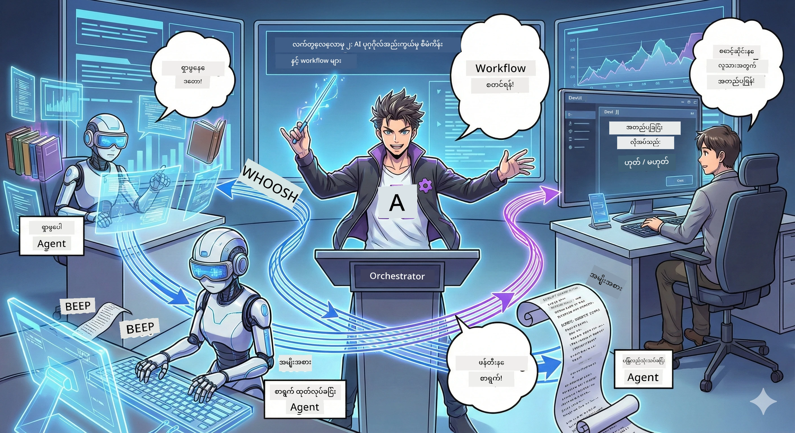

<!--
CO_OP_TRANSLATOR_METADATA:
{
  "original_hash": "93f84b804ced67c5cd017c3c4bb476ff",
  "translation_date": "2026-01-05T11:50:05+00:00",
  "source_file": "WorkshopForAgentic/md/02.AIAgentOrchestrationAndWorkflows.md",
  "language_code": "my"
}
-->
# Act 2: သင့် Podcast ထုတ်လုပ်ရေးအဖွဲ့ကို စုစည်းခြင်း 🎬



## ဇာတ်ကောင် ပိုမို ထူးခြားလာပြီ

Alex (Act 1 မှ သင့် AI အကူအညီပေးသူ) က မိုက်တယ်၊ ဒါပေမယ့် တစ်ယောက်တည်းအေးဂျင့်နဲ့ podcast စတူဒီယိုတစ်ခုကို လည်ပတ်နိုင်မှာ မဟုတ်ဘူး။ သင့်အနေနဲ့ *အဖွဲ့* တစ်ခု လိုအပ်တယ်။
- 🔍 **သုတေသန အေးဂျင့်**: အင်တာနက်မှာ အသစ်တန်း နောက်ဆုံးသတင်းအချက်အလက်တွေ ရှာဖွေပေးတယ်
- ✍️ **စာရေး အေးဂျင့်**: သုတေသနကို စိတ်ဝင်စားဖွယ်ရှိတဲ့ စကားပြောပုံစံသို့ ပြောင်းလဲတယ်
- 👤 **သင် (အယ်ဒီတာ)**: စာသားတွေကို အတည်ပြုတာ ဒါမှမဟုတ် ပြန်လည်ပြင်ဆင်ဖို့ ပို့တာ

**AI Agent Orchestration** မှ ကြိုဆိုပါတယ် — သင့်ကိုယ်ပိုင် AI အသင်းကြီးရဲ့ အကြပ်အတည်း ဦးဆောင်သူ ဖြစ်သွားမှာ ဖြစ်တယ်။ Avengers လိုထင်ပါစေ၊ ဒါပေမယ့် podcast ထုတ်လုပ်ရေးအတွက်ပဲ ဖြစ်တယ်။

## Agent Orchestration ဆိုတာ ဘာလဲ? (ရိုးရှင်းတဲ့ ဗားရှင်း)

စားသောက်ဆိုင်တစ်ခု လည်ပတ်နေတဲ့အခါ သင်ချင်း ကိုယ်တိုင် အားလုံးလုပ်မနေဘူး၊ ဟုတ်လား? အဲဒီမှာရှိတာတွေက:
- 🍳ချက်ပြုတ်သူ
- 👨‍🍳 ပူးပေါင်းအကူအညီ
- 👩‍🍳 ဆားဗာ

Agent orchestration ကလည်း အဲဒီအတွေးပဲ၊ ဒါပေမဲ့ AI တွေနဲ့။ အဲ့ဒီအေးဂျင့်တွေက အထူးပြုချက်ထားပြီး၊ သင့်က သူတို့ကိုညှိနှိုင်းပြီး ပိုကြီးမားတဲ့ရည်မှန်းချက်တွေကို မျှဝေတယ်။ တစ်ယောက်တည်း အေးဂျင့်မအလုပ်ပိုများ ၊ အလုပ်ပိုမြန်ပြီး အောင်မြင်တယ်။

### အဖွဲ့တေးဂီတ ဆင်တူမှု 🎸

သင့် AI အေးဂျင့်တွေက အဖွဲ့တေးဂီတလိုပဲ။
- **အဓိကသီချင်းဆိုသူ**: အသုံးပြုသူနဲ့တိုက်ရိုက်ဆက်ဆံတဲ့အဓိက အေးဂျင့်
- **စက်တီးသံကြိုးများ**: အဆင်ပြေဆေးလုပ်ငန်း ကိုင်တွယ်သူ
- **ဘေ့စ်ဂီတသမား**: အားလုံးကို ထောက်ပံ့၊ ဒေတာ ရှာဖွေနေသူ
- **သင် (အဖွဲ့မန်နေဂျာ)**: အားလုံးကိုညှိနှိုင်းသူ

ညှိနှိုင်းမှု မရှိရင်? ဆူညံသံတုန်တယ်ပဲ။ Orchestration နဲ့? တေးရာသီအလှတရား။

### ဘာကြောင့် ဒါဟာ အရေးကြီးတာလဲ

AI အေးဂျင့် တစ်ယောက်အားလုံးတိုက်တွန်းခဲ့ရင် မခံနိုင်ပါဘူး။ အထူးပြုထားတဲ့ အေးဂျင့်တွေ ပူးပေါင်းလုပ်ဆောင်ရင် အကျိုးရှိတယ်! 🚀

**အမှန်တကယ်ဖြစ်ပုံ**: စောင့်ရှောက်၊ ရေး၊ တည်းဖြတ် ကိုတစ်ယောက်တည်း လုပ်ကြည့်ဖူးလား? ဟုတ်ကဲ့၊ ဒါက သင့်ကို မယုံကြည်နိုင်စရာ အလုပ်ရှုပ်နေတာဖြစ်တယ်။ Orchestration နဲ့ အေးဂျင့်တိုင်းက သူ့အကောင်းဆုံး ပိုင်းကို ကိုင်တွယ်တယ်။ သင်က နောက်ဆုံးဆုံးဖြတ်ချက်ကိုသာ လုပ်တယ်။

**လက်တွေ့နမူနာ**: ဖောက်သည် ဝန်ဆောင်မှု ဘော့များဟာ ဘေလ်ကာကို ကိုင်တွယ်ရင်, နည်းပညာပြဿနာတွေလည်း ကိုင်တွယ်ရင်၊ လူတွေကို ခေါ်ကြတဲ့အချိန် သိရှိတယ်။ ဒါဟာ orchestration ဖြစ်ပါတယ်!

## Agent နဲ့ Workflow: ဘာကွာခြားတာလဲ?

ဒီလို တွေးကြည့်ပါ။

### 🤖 AI Agent = Jazz ဖျော်ဖြေသူ
- **နားဆင်ပြီး ချက်ချင်း ဆုံးဖြတ်ချက်ချတယ်**
- **ယနေ့အခြေအနေပေါ် မူတည်ပြီး ဖြေရှင်းချက်တွေ ပြောင်းလဲတယ်**
- **LLM ဦးနှောက်နဲ့ တွေးတောတယ်**
- **သည့်သည့်အရာကိုမဆို လိုက္လျောညီထွေ လုပ်ဆောင်တယ်**

### 🎵 Workflow = တေးဂီတအစီအစဉ်ကြီး တီးခတ်နေခြင်း  
- **စာရင်းကျက်အတိုင်း လိုက်နာတယ်** (ကြိုတင်သတ်မှတ်ထားတဲ့အဆင့်များ)
- **ခန့်မှန်းနိုင်တဲ့ လုပ်ဆောင်မှုလမ်းကြောင်း**
- **အေးဂျင့်တွေ၊ လူတွေ၊ စနစ်တွေ ပူးပေါင်းညှိနှိုင်းတယ်**
- **ချက်ပြုတ်နဲ့တူညီအလုပ်လုပ်တယ်**

**အံ့ဩသောအချက်**: Workflow တွေဟာ *Agent* တွေကို ညှိနှိုင်းတယ်! သင့် Workflow က အေးဂျင့်တွေကို မိမိအခန်းကဏ္ဍသတ်မှတ်ပေးတယ်။ ရိုးရာနှစ်မျိုးကိုတပြိုင်နက် ရရှိစေတယ်။ 🎭

## AI အသင်းကြီး ကို ညှိနှိုင်းဖို့ နည်းလမ်း ၃ မျိုး

### 1. 🎯 ပြည့်စုံစွာ ဦးဆောင်ခြင်း (သင်ကဘော့စ်)

အဓိက အေးဂျင့် တစ်ယောက်က အားလုံးကို ဦးဆောင်တယ်။ သင်က အဖွဲ့ မန်နေဂျာလို ဖြစ်ပြီး ဘယ်သူ ဘာလုပ်မလဲ၊ ဘယ်အချိန်လုပ်မလဲ ဆုံးဖြတ်တာပါ။

**အားသာချက်များ**:
- ✅ ဦးဆောင်မှုရှင်းလင်းမှု (ရှုပ်ထွေးမှုငြိမ်သက်စေ)
- ✅ ဆုံးဖြတ်ချက် တစ်ရပ်တည်းရှိခြင်း
- ✅ အလွယ်တကူ ပြင်ဆင်စစ်ဆေးနိုင်ခြင်း

**အသုံးပြုရန်**:
- ဖောက်သည်ဝန်ဆောင်မှု လမ်းညွှန်မှု ("ဘေလ်ကာ ဒား? နည်းပညာကူညီမှုလား?")
- စာသား အတည်ပြုခြင်း workflow ("ဒီစာသား ဒီဇင်ဘာလိူ့လား?")
- Podcast ထုတ်လုပ်ခြင်း (မည်သည့်အခါမှ ပြုလုပ်နေတယ်)

### 2. 🤝 ဖြန့်ဖြူးပြီး ကိုယ်တိုင် စည်းမျဉ်းများထားခြင်း (အေးဂျင့်တွေ ကိုယ်တိုင် စီစဉ်မှု)

အေးဂျင့်တွေ အချင်းချင်း တိုက်ရိုက် ဆက်သွယ်ပြီး အဖွဲ့လို အလုပ်လုပ်ကြတယ်။ လူပေါင်းများစွာ ပါဝင်သော စကားဝိုင်းလို။

**အားသာချက်များ**:
- ✅ အလွယ်တကူ တိုးချဲ့နိုင်ခြင်း (အေးဂျင့်များ ပေါင်းထည့်နိုင်)
- ✅ တစ်ခုပဲ ပျက်စီးခြင်းမရှိခြင်း
- ✅ အေးဂျင့်တွေ ပူးပေါင်းဆောင်ရွက်မှု သဘာဝကျကျ

**အသုံးပြုရန်**:
- သုတေသနအဖွဲ့များ (အေးဂျင့်အသီးသီး နေရာအမျိုးမျိုး ရှာဖွေ)
- စိတ်ကူးပေါ်ပြသနာများ
- ဖြန့်ဖြူးပြီး ပြဿနာဖြေရှင်းမှု

### 3. 🔀 နှစ်မျိုးစလုံး ပေါင်းစပ်မှု (အကောင်းဆုံး၏ အကောင်းဆုံး)

သင် ပိုမိုအဓိကတာဝန် ပေးပြီး၊ အေးဂျင့်တွေကို ကိုယ်တိုင် စီစဉ်ခွင့်ပေးသည်။ သင့်အဖွဲ့ကို ယုံကြည်တဲ့ CEO အဖြစ်ဖြစ်ပါ။

**သင့်တော်သည့်အတွက်**: ထိန်းချုပ်မှုနှင့် အပြောင်းအလဲ လိုအပ်တဲ့ စီမံကိန်းကြီးလှစွာ။

## Microsoft Agent Framework: သင့် Orchestration ကိရိယာဝိုင်း 🧰

တည်ဆောက်ဖို့ အချိန်ရောက်ပြီ! သင် အသုံးပြုမယ့်အရာတွေက:

### အခြေခံသော အပိုင်းများ

#### 1. 🧱 Executors (သင့်အလုပ်သမားတွေ)
- **ဘာလဲ?**: တစ်ခုချင်းစီ အလုပ်ခွဲတွေ — အေးဂျင့် ဖြစ်နိုင်၊ ကိုယ်ပိုင် မော်ဂျူများဖြစ်နိုင်
- **ဘာလုပ်လဲ?**: input ယူ၊ အလုပ်လုပ်၊ output ထုတ်
- **စဉ်းစားပါ**: စက်ရုံလိုင်းရဲ့ အဆင့်ချိတ်

#### 2. ➡️ Edges (ချိတ်ဆက်နေရာများ)
- **ဘာလဲ?**: Executors တွေကြားလမ်းကြောင်း
- **ဘာလုပ်လဲ?**: စာတိုက်ပို့မှုထိန်းချုပ် ("A ပြီးရင် B သို့ဆက်သွား")
- **စဉ်းစားပါ**: သင်္ကေတများ အဖြစ်

#### 3. 🗺️ Workflows (အထွေထွေ စီမံကိန်း)
- **ဘာလဲ?**: Executors + edges ရဲ့ ကွက်တိပြည့်စုံတဲ့ဇယား
- **ဘာလုပ်လဲ?**: အစမှအဆုံး လုပ်ငန်းစဉ်ကို သတ်မှတ်တယ်
- **စဉ်းစားပါ**: သင့်ထုတ်လုပ်မှု လမ်းကြောင်း ဆွဲခြင်း

### သင်နှစ်သက်မယ့် အင်္ဂါရပ်တွေ

**🛡️ Type Safety**: အေးဂျင့်တွေ စာတိုက်တဲ့ message တွေကို type စစ်စနစ်ကြီးနဲ့ စစ်ဆေးတယ်။ "အင်းမှားနေပြီ" မဖြစ်နိုင်ပါ။

**🔀 လွယ်ကူပြောင်းလဲနိုင်သော လမ်းကြောင်း**:
- If-then ရှိသလို ("အတည်ပြုရင်ပေါ်နှုတ်၊ မဟုတ်ရင် ပြန်ရေးဆိုခြင်း")
- တပြိုင်နက် လုပ်ဆောင်မှု (အေးဂျင့်များချင်း ကြား လုပ်ငန်းတွေသာ)
- စက်မှုလမ်းကြောင်း ပြောင်းလဲ အသွင်ကူးခြင်း

**🔌 ပြင်ပ ထည့်သွင်းမှု**:
- API ချိတ်ဆက်ခြင်း
- လူထည့်ပြီး စစ်ဆေးခြင်း (သင်အတည်ပြုပြီးမှ ထုတ်ဝေ)
- အမိန့်အသစ် တောင်းဆို / ပြန်ပြောခြင်း လမ်းကြောင်းတည်ဆောက်ခြင်း

**💾 Checkpointing**: လုပ်ဆောင်မှု တွန်းထား! ဘာညာ အလုပ်ပျက်ရင်၊ ပြန်စတင်တယ်။

**🤝 Multi-Agent Coordination**:
- အေးဂျင့်များ ကို တန်းစီဖို့ (A → B → C)
- တပြိုင်နက် ဆောင်ရွက်ဖို့ (A + B + C တပြိုင်နက်)
- Agent တွေ ပြန်ဖလှယ်ခြင်း
- ပူးပေါင်း ဆောင်ရွက်မှု

## အကောင်းဆုံး အကျင့်များ (Pro Tips) 🎯

### 1. Modular ဖြစ်အောင်ထားပါ
အေးဂျင့်တိုင်း သာ တစ်ခုတည်းသော အလုပြုကိုသာ အထူးပြုပါ။ အားလုံးလုပ်တဲ့ "super agent" မလုပ်ပါနဲ့ — ပြင်ဆင်ရခက်ခဲသွားမှာဖြစ်တယ်။

### 2. ကျရှုံးမှုအတွက် စီမံချက်ချပါ
အေးဂျင့်တွေ အမှားလုပ်တတ်တယ်။ကွန်ရက်တွေ ပျက်တတ်တယ်။ အမှားပြုပြင်မှုနဲ့ Backup များပါတဲ့စနစ် တည်ဆောက်ပါ။ အနာဂတ် ကိုယ်တိုင် ကျေးဇူးတင်သွားပါမယ်။

### 3. အားလုံးကို မျက်စောမတ်ရာထားပါ
သင့်အေးဂျင့်တွေ ဘာလုပ်နေတာကို စောင့်ကြည့်ပါ။ DevUI (လေ့လာမှာပါ!) ကို အသုံးပြုပြီး workflows တွေကို ကြည့်ရှုပြီး လုပ်ဆောင်ကြပါ။

### 4. Message အရွယ်အစား ကို တိတိကျကျ ထိန်းချုပ်ပါ
အလွန်ပင် များစွာသော ဖိုင်တွေ မပို့ပါနဲ့။ message တွေကို သေးငယ်ပြီး မြန်ဆန်အောင်ထားပါ။

### 5. လိုအပ်သလို ဖြစ်စေရန်ပုံစံ ကို ရွေးချယ်ပါ
ထိန်းချုပ်ချင်လား? Centralized လုပ်ပါ။ ကြီးမားစေချင်လား? Decentralized လုပ်ပါ။ ဆုံးဖြတ်မရဘူး? Hybrid လုပ်ပါ!

## DevUI: သင့် Workflow ကို စစ်ဆေးရာကိရိယာ 🔍

### DevUI ဆိုတာ ဘာလဲ?

DevUI က သင့်အေးဂျင့်တွေ နဲ့ workflows တွေကို စစ်ဆေး စမ်းသပ်နိုင်တဲ့ ကစားကွင်းလို ဖြစ်ပါတယ်။ ဝေဘ် UI တစ်ခုဖြစ်ပြီး သင်က:  
- 👀 Workflow ရဲ့ လုပ်ဆောင်မှုကို ကြည့်ရှုနိုင်တယ်  
- 💬 အေးဂျင့်နဲ့ တိုက်ရိုက် စကားပြောနိုင်တယ်  
- 🔍 အမှားတွေ ဖြစ်လာတဲ့အခါ အမှားရှာဖွေနိုင်တယ်  
- 📊 လမ်းကြောင်း နောက်ကြောင်းနဲ့ စွမ်းဆောင်ရည် မီတာတွေ မြင်နိုင်တယ်  

> **အရေးကြီး**: DevUI ကို သာမန် အသုံးပြုမဟုတ်ပဲ ဖွံ့ဖြိုးတိုးတက်မှု အတွက်သာ အသုံးပြုပါ။ ထုတ်လုပ်မှုမှာ သာမန် မသုံးပါနဲ့။

### ဘာကြောင့် အံ့ဩသနည်း

- **🖥️ ဆက်သွယ်ဆက်သွယ် ဝဘ် UI**: ကလစ်၊ ရိုက်၊ စမ်းသပ် — command line မလို
- **📁 စွဲပြီး ဆွဲထုတ် အကူအညီ**: ဖိုင်တင်၊ input မတူညီတဲ့အရာတွေနဲ့ စမ်းသပ်ဖို့
- **📂 အလိုအလျောက် ရှာဖွေမှု**: ဖိုလ်ဒါတစ်ခုခု ချပြီ ဂ်ီင်အားလုံးကိုလဲ ရှာတယ်
- **📋 မလိုအပ်ကတည်းစီမံချက်**: ကိုဒ်ထဲမှာ အေးဂျင့် register လုပ်၊ ဖိုလ်ဒါ အစီအစဉ်မလို
- **🔌 OpenAI နဲ့ ကိုက်ညီမှု**: OpenAI SDK နဲ့ အလုပ်လုပ်တယ် (compatibility အတွက်)
- **👁️ တိတိကျကျ နောက်ခံ လှုပ်ရှားမှု ပြသမှု**: အေးဂျင့်တွေ ဘာလုပ်နေတာ မှန်ကန်စွာ ကြည့်ရှုနိုင်တယ်

### Input ဘယ်လို လုပ်သလဲ

DevUI က input တွေကို အထူးသတိထားတယ်။

- **အေးဂျင့် စမ်းသပ်မလား?** စာသား box များနဲ့ ဖိုင်တင် ခလုတ်တွေ ပေးတယ်
- **Workflow စမ်းသပ်မလား?** Workflow ရဲ့ လိုအပ်ချက်အတိုင်း input fields ကို အလိုအလျောက် ဖန်တီးတယ်

ဒါက မာနစ်လား၊ မဟုတ်ပါဘူး၊ ကောင်းတဲ့ ကုဒ်တစ်ခုပါ။ ✨

## သင့်ရဲ့တာဝန်များ: Podcast စတူဒီယို တည်ဆောက်ခြင်း 🎬

### တာဝန် ၁: DevUI နဲ့ တစ်ယောက်တည်း အေးဂျင့် တည်ဆောက်ပါ

📂 [01.AgentDevUI](../../../../WorkshopForAgentic/code/02.Workflow/01.AgentDevUI)

**စိန်ခေါ်မှု**: အဖွဲ့တစ်စုအစား DevUI နဲ့ အေးဂျင့် တစ်ယောက်ကို စမ်းသပ်ကြည့်ပါ — ဝဘ်ရှာဖွေမှု အထူးပြုသူ ဖြစ်ပါတယ်။

**သင်တည်ဆောက်ရန်**:
Podcast အကြောင်းအရာအတွက် အင်တာနက်ရှာဖွေတာ အေးဂျင့်တစ်ယောက်။ `http://localhost:8090` မှာ DevUI ဝဘ်အင်တာဖေ့စ်တွင် စမ်းသပ်ပါ။

**သင်သင်ယူမယ့် ကျွမ်းကျင်မှုများ**:
- 🚀 DevUI မှာ အေးဂျင့်များ စတင်လည်ပတ်ခြင်း
- 🔍 အေးဂျင့် တုံ့ပြန်မှုများကို တိုက်ရိုက် စမ်းသပ်ခြင်း
- 🛠️ ကိုယ်ပိုင်ကိရိယာများ (ဝဘ်ရှာဖွေရေး)
- 📊 အမှားရှာဖွေရေး အတွက် tracing ဖွင့်ထားခြင်း
- 🖥️ အပြန်အလှန် ဝဘ် UI အသုံးပြုခြင်း

**ကုဒ်များ**:
- `agent.py`: ခွန်အား အပြည့်အဝ SearchAgent အဖြစ်  
- OllamaChatClient နဲ့ Qwen ကို ချိတ်ဆက်  
- `web_search()` tool function ကို အကောင်အထည်ဖော်  
- `serve()` နဲ့ စတင် — DevUI ကို အလိုအလျောက် ဖွင့်ပေးပါမယ်  

**အောင်မြင်မှု စံအတိုင်း**: "AI ထဲမှာ ဘာတွေသုံးနေသလဲ?" လို မေးတယ်၊ အေးဂျင့်က ဝဘ်မှာရှာဖွေနေ တာကို ကြည့်ပါ! 🎉

### တာဝန် ၂: မျိုးစုံ အေးဂျင့် Workflow တည်ဆောက်ပါ

📂 [02.WorkflowDevUI](../../../../WorkshopForAgentic/code/02.Workflow/02.WorkflowDevUI)

**စိန်ခေါ်မှု**: အခုတော့ အမှန်တကယ်ပျော်စရာကောင်းပြီ! Podcast ထုတ်လုပ်မှု workflow တစ်ခု ပြည့်စုံဖန်တီးပါ။
1. 🔍 **Search Agent** → သုတေသန ပြုလုပ်သည်  
2. ✍️ **Script Agent** → နှစ်ဦး ကြား ဒိုင်ယာလော့ (တရုတ်လို) ရေးသားသည်  
3. 👤 **Review Executor** → သင်ကို အတည်ပြု သို့မဟုတ် ငြင်းဆိုစေသည်  
4. 🔄 **Loop Back** → ငြင်းဆိုရင် သင့် တုံ့ပြန်ချက် နဲ့ ပြန်ရေးသားသည်  

**သင်လေ့လာမယ့် ကျွမ်းကျင်မှုများ**:
- 🧱 အလုပ်အမျိုးမျိုးအတွက် အထူးပြု အေးဂျင့်များ ဖန်တီးခြင်း  
- 🔗 WorkflowBuilder နဲ့ အေးဂျင့်များ ချိတ်ဆက်ခြင်း  
- 🔀 အတည်ပြုမှု loop (လူထည့် စစ်ဆေးမှု)  
- 🚦 အခြေအနေ အရ လမ်းကြောင်း ချိန်ညှိခြင်း  
- 🔧 လုပ်ငန်း Logic အတွက် ကိုယ်ပိုင် Executor များ ဖန်တီးခြင်း  

**Workflow**:  
```
SearchAgent → ScriptAgent → ReviewExecutor
                             ↑          ↓ (if rejected)
                             ←─────────
```
  
**ကုဒ်များ**:
- `search_agent/agent.py`: သုတေသန အထူးပြုသူ  
- `generate_script_agent/agent.py`: စာရေးသူ (တရုတ်လိုရေး)  
- `workflow/workflow.py`: Orchestration လူကြီးစိန်မှတ်တွေအားလုံး  
- `main.py`: DevUI မှာ စတင်အလုပ်လုပ်တယ်  

**အောင်မြင်မှု စံအတိုင်း**: အကြောင်းအရာပေး၊ စာသား ကြည့်၊ loop စမ်းသပ်ဖို့ တစ်ခါ ငြင်းဆိုပါ၊ အတည်ပြုပေးပါ! 🎉

### တာဝန် ၃: Console App တည်ဆောက်ပါ

📂 [03.Application](../../../../WorkshopForAgentic/code/02.Workflow/03.Application)

**စိန်ခေါ်မှု**: DevUI မှာ သင့် workflow ကို သန့်ရှင်းပြီး အရောင်စုံပါ၊ loading spinner သွယ်သွယ်လှလှ၊ ဖိုင်သိမ်းစနစ်ပါ Terminal App အဖြစ် ပြောင်းလဲပါ။ ထုတ်လုပ်ရေးအဆင်သင့်!

**သင်ရရှိမယ့် ကျွမ်းကျင်မှုများ**:
- ⚡ DevUI မလိုဘဲ workflow ကို ပရိုဂရမ်းရေးအဆင့်တွင် လည်ပတ်ရေး  
- 📡 အစီအစဉ် စတင်-ပြီးဆုံးအစီအစဉ်များနှင့် streaming  
- 🎨 Terminal UI အလှ (အရောင်များ၊ Spinner၊ Progress bar) ဖန်တီးခြင်း  
- 💾 နောက်ဆုံး စာသား ဖိုင်သို့ သိမ်းဆည်းခြင်း  
- 🔄 Python asyncio ဖြင့် async workflow ကို စီမံခြင်း  

**လုပ်ဆောင်မှု**:
1. Podcast သတင်းအချက်အလက် မေးမြန်း  
2. အလုပ်တင်ပြ "Search Agent လုပ်ရိုးနေပြီ..."  
3. အရောင်နှင့်တကွ စာသား ပြသ  
4. သင့် အတည်ပြုချက် မေး  
5. အတည်ပြုထားသော စာသားကို `podcast.txt` ထဲ သိမ်းဆည်း

**ကုဒ်များ**:
- `podcast_app.py`: Event handling ပါဝင်တဲ့ အဓိက app  
- `workflow.py`: တာဝန် ၂ မှ workflow ကို အသုံးပြုခြင်း  
- Event များကို ကိုင်တွယ် (AgentRunUpdateEvent, RequestInfoEvent, WorkflowOutputEvent)  
- Terminal အတွက် ANSI အရောင်များ အသုံးပြု

**အောင်မြင်မှု စံအတိုင်း**: App chạyပါ၊ podcast စာသား ဖန်တီးပြီး သိမ်းထားပါ! သင့်ရဲ့ တကယ့်ကိရိယာကို တည်ဆောက်ပြီး! 🚀

## သင် ကျွမ်းကျင်လာတာများ 🏆

Act 2 ပြီးဆုံးပြီးနောက် အောက်ပါအရာတွေ ပြုလုပ်နိုင်ပါပြီ —

- ✅ အေးဂျင့် အများကြီးကို ဦးဆောင် သဘောထားနှင့် နိုင်
- ✅ သဘာဝတန်းစီစဉ်မှုနှင့် အခြေအနေ အဆင်သင့် logic များ ပါဝင်သည့် workflows ဖန်တီးနိုင်
- ✅ လူအတည်ပြု စစ်ဆေးမှု checkpoints ထည့်သွင်းနိုင်
- ✅ DevUI နဲ့ workflows တွေကို စမ်းသပ်ပြီး lỗiရှာဖွေနိုင်
- ✅ ထုတ်လုပ်ရေး အသုံးပြုနိုင်သော console applications ဖန်တီးနိုင်
- ✅ ကြီးမားရှုပ်ထွေးသော စနစ်တွင် အမှားကို ယဥ်ကျေးစွာ ကိုင်တွယ်နိုင်
- ✅ အလုပ်ရဲ့ အမျိုးအစားသတ်မှတ်မှုအတွက် သင့်လျော်သော orchestration ပုံစံ ရွေးချယ်နိုင်

## ပြဿနာဖြစ်ရင် 🔧

### "Workflow ရှုပ်ထွေးလွန်လွန်းတယ်!"
**ဖြေရှင်းနည်း**: ပိုသေးသော sub-workflow များဖြင့် ခွဲထုတ်ပါ။ Workflow တစ်ခုချင်း ရေးရာမှာ တစ်ခုတည်းသောအလုပ် ပေးပါ။ လိုအပ်ရင် ချိတ်ဆက်ပါ။

### "ဘာဖြစ်နေကြောင်း စောင့်ကြည့်လို့ မရပါ!"
**ဖြေရှင်းနည်း**: Workflow checkpointing ကိုအသုံးပြုပြီး အခြေအနေ သိမ်းဆည်းပါ။ DevUI ရဲ့ tracing ကို ဖွင့်ပြီး တစ်ဆင့်ချင်း အသေးစိတ်ကြည့်ပါ။

### "Agent တစ်ယောက် အမှားသွားရင် အားလုံးပျက်နေပြီ!"
**ဖြေရှင်းနည်း**: Error boundary များ ထည့်ပါ။ အေးဂျင့် တစ်ခုချင်း ဆုံးရှုံးမှုကို ကိုယ်တိုင် တာဝန်ယူ ခြင်းနှင့် fallback လုပ်ခြင်း ထားပါ။

### "ဒီဟာ များမှုပြင်းတယ်"
**ဖြေရှင်းနည်း**: အေးဂျင့်ဘယ်သူတွေ parallel လည်ပတ်နိုင်သလဲ စဉ်းစားပါ။ တန်းစီ workflow များ လုပ်ရတာ လွယ်ကူပေမဲ့ နှေးတယ်။ Parallel လုပ်နိုင်ရေး ကြိုးစားပါ!

## အကူအညီ ရင်းမြစ် 🔗

- [Workflow Docs](https://learn.microsoft.com/en-us/agent-framework/user-guide/workflows/overview) — Microsoft မှ တရားဝင်လမ်းညွှန်များ  
- [Orchestration Patterns](https://www.ibm.com/think/topics/ai-agent-orchestration) — IBM ရဲ့ အမြင်  
- [Agent Framework GitHub](https://github.com/microsoft/agent-framework) — ကိုဒ် ရှာဖွေကြည့်ရှုရအောင်
- [Code Examples](https://github.com/microsoft/agent-framework/tree/main/python/samples) — ဒီနေရာကနေပုံစံတွေကို မူးယစ်ပါ

---

**နောက်ဆုံးအပိုင်းအတွက် ပြင်ဆင်ပြီးပြီလား?** နောက်တော့ သင့် script ကို အမှန်တကယ် အသံအဖြစ် ပြောင်းပေးကြမယ်! → [Act 3: Bring Your Podcast to Life](03.Multi-SpeakerPodcastGenerationWithVibeVoice.md) 🎤

---

**ပိတ်ဆို့နေသလား? စိတ်ခွန်အားကျသွားသလား? စိတ်လှုပ်ရှားသလား?** workshop chat မှာ မျှဝေပါ! ကျွန်တော်တို့ အကုန်တူတူ လေ့လာနေကြပါတယ်🚀

---

<!-- CO-OP TRANSLATOR DISCLAIMER START -->
**မှတ်ချက်**:
ဤစာတမ်းကို AI ဘာသာပြန်ဝန်ဆောင်မှုဖြစ်သည့် [Co-op Translator](https://github.com/Azure/co-op-translator) အသုံးပြု၍ ဘာသာပြန်ထားပါသည်။ ကျွန်ုပ်တို့သည် တိကျမှန်ကန်မှုအတွက် ကြိုးစားနေသော်လည်း၊ အလိုအလျောက် ဘာသာပြန်မှုများတွင် အမှားယွင်းချက်များ သို့မဟုတ် ကျရှုံးမှုများ ဖြစ်ပေါ်နိုင်ပါသည်။ မူရင်းစာတမ်းကို မိဘဘာသာဖြင့် အတိုင်ပင်ခံ အစားထိုးအနေဖြင့် သိမ်းဆည်းထားသင့်ပါသည်။ အရေးကြီးသော အချက်အလက်များအတွက် လူ့အရည်အချင်းရှိ ဘာသာပြန်သူမှ အတည်ပြု ဘာသာပြန်ချက်ကို အကြံပြုပါသည်။ ဤဘာသာပြန်မှုအသုံးပြုမှုကြောင့် ဖြစ်ပေါ်နိုင်သည့် နားလည်မှုပြဿနာများ သို့မဟုတ် မှားယွင်းစိတ်ခံစားမှုများအတွက် ကျွန်ုပ်တို့သည် တာဝန်မယူပါ။
<!-- CO-OP TRANSLATOR DISCLAIMER END -->