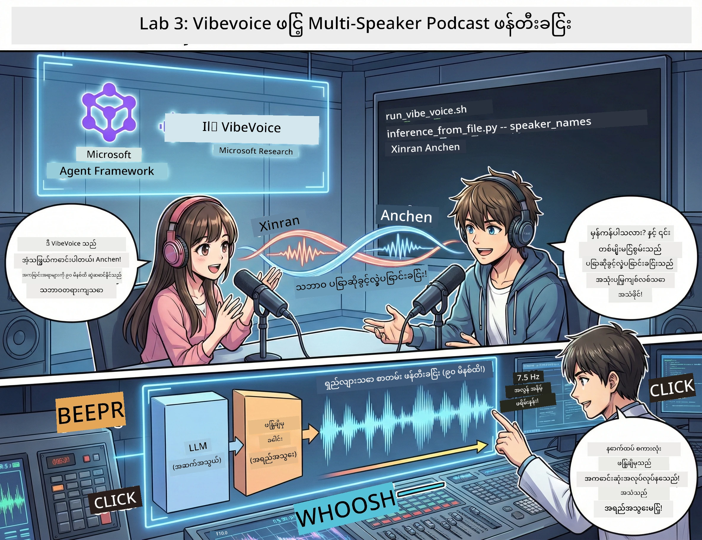

# Act 3: သင်၏ Podcast ကို အသက်သွင်းပါ 🎤



## အဆုံးအစီး အထိမ်းအမှတ်

သင်ဟာ ခေါင်းစဉ်တွေကို သုတေသနလုပ်ပြီးဖြစ်ပါတယ်။ စာသားရေးသားပြီးဖြစ်ပါတယ်။ အခုတော့ အထင်းဆောင်ရန် — သင်၏စာသားကို တကယ့်တုန်းက Podcast အသံအဖြစ် ပြောင်းလဲပေးမယ့် သဘာဝကျကျ အသံတွေဖြင့် ဖန်တီးကြမယ်!

**VibeVoice** ကို လာကြည့်ပါ — Microsoft Research ရဲ့ ဖွင့်လှစ်ထားတဲ့ TTS (စာသားမှ အသံပြောင်းတဲ့နည်း) က မယုံကြည်စရာကောင်းပြီး သိပ္ပံပညာနည်းကျဝိုင်းဖြင့် ဖန်တီးတာတွေ ဖြစ်ပါတယ်။
- 🎭 သဘာဝကျသော ဆွေးနွေးမှုတွေ
- 👥 စကားပြောသူများ များစွာ (၄ ယောက်ထိ!)
- ⏱️ ကြာရှည်သော အသံ (နာရီ ၉၀ ထိ!)
- 🎵 စတိုင်ကောင်းတဲ့ မိမိုက်တယ့် အသံထွက် (ရိုဘော့အသံ မဟုတ်ပဲ!)

ဒီဟာက အတု Podcast တွေ၏ နည်းပညာဖြစ်ပါတယ်။ သူတို့အတိုင်း ကျွန်ုပ်တို့ Podcast ကို ပြုလုပ်ကြရအောင်!

## VibeVoice ဆိုတာ ဘာလဲ? (အထူးကောင်းတဲ့အရာတွေ)

VibeVoice သည် Microsoft Research ကမ္ဘာ့သူများအတွက် ပေးအပ်ထားတဲ့ အပြည့်အဝ ကတိတော်တစ်ခုဖြစ်သည်။ Podcast ပုံစံကို အထူးပေါ်ပေါက်စေရန် ဒီနည်းပညာကို ဖန်တီးထားသည်။

### ဘာကြောင့် အထူးလဲ 🔥

* **⏱️ ကြာရှည်စကားပြောခြင်း**: တစ်လျှောက် ၉၀ မိနစ်ထိ စကားပြောထုတ်ဖော်နိုင်တယ် (ဒါဆို တစ်ခုလုံး Podcast အပိုင်းတစ်ခုပါ!)
* **👥 စကားပြောသူ များစွာ**: မတူညီတဲ့ အသံလက္ခဏာ ၄ မျိုးထိ
* **⚡ အလွန်မြန်ဆန်ဆုံး**: နည်းပါးသော ၇.၅ Hz frame rate ကို အသုံးပြု၍ စွမ်းအင် သိမ်းဆည်းတယ်
* **🧠 ထူးခြားသော အသံဖန်တီးမှု**: LLM (အကြောင်းအရာနားလည်မှု) နဲ့ diffusion model (သဘာ၀ကျသောအသံဖန်တီးမှု) ကို တွဲဖက်လိုက်ပါတယ်
* **🎭 သဘာဝတိုက်ဆိုင်မှု**: အပိုင်းပြောင်းခြင်း၊ ကြားရပ်ခြင်းနဲ့ ဆက်သွယ်မှု ရေစီးကြောင်းကို အလိုအလျောက် ကိုင်တွယ်ပေးတယ်

**ဘာဆိုလိုတာလဲ**: VibeVoice ဟာ လက်ရှိစာသားကို ဖတ်ဖို့မဟုတ်ဘဲ — တကယ့်လူတွေပြောဆိုသလို *အကောင်အထည်ဖော်* ပေးတာပါ။

---

## မစတင်ခင် 🚀

**လိုအပ်တာတွေ**:

* 🐍 **Python 3.10+** (Act 1 နဲ့ 2 ကနေ ရှိပြီးသား)
* 🚀 **uv** (အလျင်အမြန် Python package စီမံခန့်ခွဲသူ — သွင်းပါမယ်)
* 📝 **သင်၏ စာသား**: Act 2 က `podcast.txt` ဖိုင် (အတည်ပြုရန် `../03.Application/` ထဲ)

**ပိုပြီးကောင်းတဲ့ အကြံပေးချက်**: ဒီအဆင့်က pretrained model ကို ဒေါင်းလုပ်လုပ်ရန် အင်တာနက်ချိတ်ဆက်မှုကောင်းရမယ်။ ကော်ဖီတစ်ကပ္ ရယူပြီး ခဏစောင့်ဆိုင်းပါ! ☕

---

## ရောက်ပါပြီ! လွယ်ကူတဲ့နည်းလမ်း 🎬

ဒါ အရမ်းလွယ်ကူပါတယ်။ တစ်ချက်တည်း Shell script တစ်ခုနဲ့ အကုန်ပေါင်းပါသည်။

### လုပ်ငန်းစဉ်

1. **လုပ်ဆောင်ခွင့်ပေးပါ**:
```bash
chmod +x run_vibe_voice.sh
```

2. **ပြေးပါ**:
```bash
./run_vibe_voice.sh
```

3. **ကောင်းကင်တုန်းကြည့်ပါ** (ပထမဆုံး run ပြုလုပ်တယ်ဆို ကြာမြင့်နိုင်ပါတယ်)

### ဒါတွေအတွက် Shell script တွေ ပြုလုပ်ပုံ 🎭

Shell script က သင့်ရဲ့ အသံအင်ဂျင်နီယာ အလိုအလျောက်လုပ်ဆောင်သူပါ:

1. **📥 VibeVoice ကို ဒေါင်းလုပ်လုပ်တယ်**: GitHub မှ Official repository ကိုကလာင်ယူသည်
2. **📦 အချို့လိုအပ်ချက်များ ထည့်သွင်းသည်**: `uv pip` ဖြင့် package တွေ အလျင်အမြန် တင်ဆက်ခြင်း
3. **🎬 အသံဖန်တီးသည်**: inference script ကို အောက်ပါ parameters ဖြင့် run ချ:
   * `--model_path`: pretrained VibeVoice-7B model
   * `--txt_path`: သင့်ရဲ့ `podcast.txt` စာသား
   * `--speaker_names`: အသံပေးသူမည်သူများ (သို့မဟုတ်) Xinran နဲ့ Anchen ကို ပုံမှန်ထားသည်

**ရလဒ်**: သင်၏ စာသားသည် တကယ့် podcast အပိုင်းတစ်ခု ဖြစ်လာပါပြီ! 🎉

---

## သင်၏ တာဝန် 🎯

စိတ်ဝင်စားဖို့ စတင်ပါ:

### Task 1: အကြောင်းအရာ ဖန်တီးပါ
`../03.Application/podcast.txt` ကို နှစ်ဦးဆွေးနွေးနေတဲ့ စကားပြောပုံဖြင့် ပြင်ဆင်ပါ။ တက်ကြွလှပတဲ့ နေရာကျော် ကိစ္စ, အားကစားစတာ၊ ဘာဖြစ်ဖြစ် ဖြစ်အောင် ဆွေးနွေးပါ။

**ပုံစံ ဥပမာ**:
```
Speaker 1: Hey! Did you hear about the new AI model?
Speaker 2: No way! Tell me more!
Speaker 1: It's called...
```


### Task 2: အသံဖန်တီးပါ
Shell script ကို run လုပ်ပြီး မောင်ဖန်တီးမှု တောက်လျောက် ကြည့်ပါ။ ပထမဆုံးအသုံးပြုစဉ်မှာ ဒီစက်တင် ဒေါင်းလုပ်ကြာနိုင်တယ်။

### Task 3: နားထောင်ပြီး လေ့လာပါ
- သဘာဝကျတဲ့ အသံလား?
- အသံပေးသူတွေရဲ့ အသံပုံစံတွေက ခွဲခြားမှုရှိသလား?
- အပိုင်းပြောင်းမှု လျှောက်လွှာလား?
- ရိုဘော့အသံ ခံစားမှုရှိမရှိ?

### Task 4: စမ်းသပ်ကြည့်ပါ (ရဲသားများအတွက်)
`run_vibe_voice.sh` ကို ပြင်ပြီး `--speaker_names`ကို ပြောင်းလဲပြီး အသံပေါင်း မတူညီတဲ့ ဖော်စပ်မှုများ စမ်းသပ်ပါ။ VibeVoice မှာ အသံများ ရှိပါတယ်!

**ဆုကြေးဇူး**: ၃ ဦးအတူတူ စကားပြောခြင်းကို စမ်းသပ်ပါ! 🎆

---

## ပိုပြီး သိရှိလိုပါက 📚

* **🏠 Project Homepage**: [VibeVoice Official Site](https://microsoft.github.io/VibeVoice/)
* **🤗 Pre-trained Model**: [Hugging Face - VibeVoice-7B](https://huggingface.co/vibevoice/VibeVoice-7B)
* **📖 သုတေသနစာတမ်း**: နည်းပညာအသေးစိတ် ဆက်လက်လေ့လာရန် (သင့်စိတ်ဝင်စားရင်)

> **⚠️ တာဝန်ယူသော AI အသိပညာ သတိပေးချက်**: VibeVoice က အင်အားကြီးပါတယ်။ တရားဝင်နည်းလမ်းနဲ့သာ အသုံးပြုပါ! လိမ်လည်မှုခုခံသုတ်ခေါင်းများ မဖန်တီးသင့်ပါ။ လူများအတွက် အကူအညီဖြစ်မယ့် အရာတွေလုပ်ပါ။ 🙏

---

## 🏆 ဂုဏ်ပြုပါတယ်! သင်ပြီးစီးခဲ့ပါပြီ။

သင် က အပြည့်အဝ လုပ်ငန်းစဉ်ကို ပြီးပြီ:
1. ✅ **Act 1**: စိတ်ကြိုက်ကိရိယာတွေနဲ့ AI အေဂျင့်များ ရှေ့နေခဲ့သည်
2. ✅ **Act 2**: AI အေဂျင့်များ အဖွဲ့အစည်းစီမံခြင်း ပြုလုပ်သည်
3. ✅ **Act 3**: တကယ့် podcast အသံ ဖန်တီးလိုက်သည်

**သင် ယခု လက်တွင်ရှိသည်**:
- အလုပ်လုပ်နိုင်သော AI သုတေသန အကူအညီပေးသူ
- ပြည့်စုံသော podcast ထုတ်လုပ်မှု လုပ်ငန်းစဉ်
- မျှဝေသုံးနိုင်တဲ့ အသံဖိုင် တစ်ခု

### အောက်မှာ ဘာတွေလုပ်မလဲ? 🚀

**သင့် podcast ကို စတင်ထုတ်လွှင့်ပါ!**
- Podcast ပလက်ဖောင်းတွင် တင်ပါ
- လူမှုမီဒီယာ၌ မျှဝေပါ
- ဆက်လက် တိုးတတ်အောင်လုပ်ဆောင်ပါ

**ဆက်လက် ဖန်တီးပါ!**
- ခေါင်းစဉ်အသစ်တွေ စမ်းသပ်ပါ
- စကားပြောသူတွေ ပိုများအောင် စမ်းသပ်ပါ
- နောက်ခံသံ သံစဉ်များ ထည့်ပါ
- ဝက်ဘ် အင်တာဖေ့စ် ချိတ်ဆက်ပါ
- လုပ်ငန်းစဉ် အားလုံး အလိုအလျောက် မောင်းနည်း တည်ဆောက်ပါ

**သင့် အလုပ်တွေ မျှဝေပါ!**
ကျွန်ုပ်တို့ကို tag လုပ်ပါ! သင်တည်ဆောက်ထားတာကို ကမ္ဘာကြီးသိစေပါ။ AI Podcast ပြုပြင်ပြောင်းလဲမှု သင့်နဲ့စတင်ပါတယ်။ 🎙️

---

**မေးခွန်းများ? အတွေးအခေါ်များ? အောင်မြင်မှုဇာတ်လမ်းများ?** workshop chat မှာ အကူအညီတောင်းပါ!

**အနာဂတ် ဖန်တီးမှု ကမ္ဘာသို့ ကြိုဆိုပါတယ်။** 🌟

---

<!-- CO-OP TRANSLATOR DISCLAIMER START -->
**အတည်မပြုချက်**  
ဤစာတမ်းကို AI ဘာသာပြန်မှု ဝန်ဆောင်မှုဖြစ်သော [Co-op Translator](https://github.com/Azure/co-op-translator) အသုံးပြု၍ ဘာသာပြန်ထားပါသည်။ ကျွန်ုပ်တို့သည် တိကျမှန်ကန်မှုအတွက် ကြိုးပမ်းနေသော်လည်း အလိုအလျောက် ဘာသာပြန်မှုများတွင်အမှားများ သို့မဟုတ် မှန်ကန်မှုလျော့နည်းမှုများ ဖြစ်ပေါ်နိုင်ကြောင်း ကို သတိပြုပါရန် ပြောကြားလိုသည်။ မူလစာတမ်းကို မူရင်းဘာသာဖြင့်သာ ယုံကြည်စိတ်ချရသော အချက်အလက်အရင်းအမြစ်အဖြစ် သတ်မှတ်ရမည်ဖြစ်သည်။ အရေးကြီးသော သတင်းအချက်အလက်များအတွက် မိမိအကျွမ်းတော်မူသော လူမှုအဖွဲ့ဝင်များ၏ ဘာသာပြန်မှုကို အသုံးပြုရန် အကြံပြုပါသည်။ ဤဘာသာပြန်မှု အသုံးပြုမှုကြောင့် ဖြစ်တတ်သော နားလည်မှုမှားယွင်းခြင်းများ သို့မဟုတ် ဟန်ချက်မတည့်မှုများအတွက် ကျွန်ုပ်တို့သည် လုပ်သားဝန်ခံမထားပါ။
<!-- CO-OP TRANSLATOR DISCLAIMER END -->