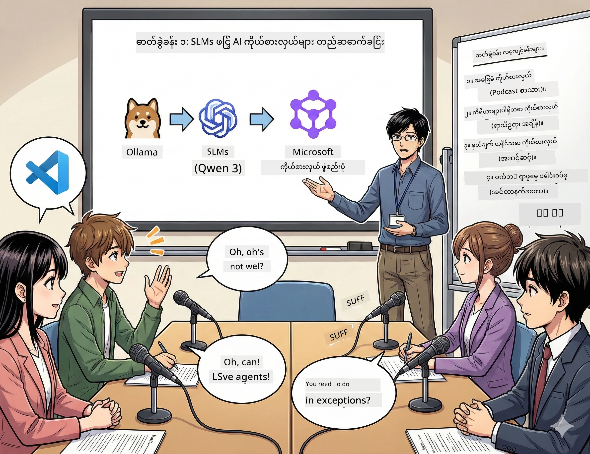

<!--
CO_OP_TRANSLATOR_METADATA:
{
  "original_hash": "21779ce57b388adecb26881a35d9cbcf",
  "translation_date": "2026-01-05T17:09:38+00:00",
  "source_file": "WorkshopForAgentic/translation/zh-cn/01.BuildAIAgentWithSLM.md",
  "language_code": "my"
}
-->
# 第一幕：သင့် AI သုတေသနအကူအညီကို နားလည်ခြင်း 🤖

## စိန်ခေါ်မှု

သင်သည် "အနာဂတ် ဘိုင်တစ်" ဟုခေါ်သော သင်၏ နည်းပညာ ပေါ့ဒ်ကတ်သစ်ကို ထုတ်လွှင့်မှာဖြစ်သည်။ ပထမဆုံးအပိုင်းမှာ နောက်ဆုံးပေါ် AI ချက်ကပ်မှုအကြောင်း ဖြစ်ပေမယ့် သင်တွင် ၂၄ နာရီပဲ ရှိသည်။  
1. ခေါင်းစဉ်ကို သုတေသနဆောင်ရွက်ရန်  
2. ယုံကြည်စိတ်ချရသော အရင်းအမြစ်များ ရှာဖွေရန်  
3. စိတ်လှုပ်ရှားဖွယ် ဇာတ်ညွှန်း ရေးသားရန်  
4. သဘာဝလောက်အောင် ကြားရအောင် ပြုလုပ်ရန်  

**ဇာတ်လမ်းကွေ့** - သင် တစ်ဦးတည်းမပြုဘဲဖြစ်နိုင်ပါသည်။ သင်၏ ပထမဆုံး AI အကူအညီကို ဖန်တီးတော့မည်ဖြစ်ပြီး၊ ဤအရာအားလုံးကို ကူညီပေးနိုင်ပါသည်။ ဤကို Alex ဟု အမည်ပေးပါစို့ — သင့်အတွက် မအိပ်ချင်သော သုတေသနမိတ်ဆွေ ဖြစ်ပါမည်။

## မည်သည့်အတွက် အသေးစား ဘာသာစကားမော်ဒယ်များ (SLM) သာ ရွေးချယ်သနည်း?（ဖော်ပြချက်：အလွန်ကောင်းမွန်သည်）

အသေးစား ဘာသာစကားမော်ဒယ်များကို (SLM) သင်၏ ကွန်ပြူတာပေါ်တွင် စည်းစိမ်run ထားသော ပုဂ္ဂိုလ်ရေး AI ဟူ၍ စဉ်းစားပါ။ ကွန်ပျူတာမိုင်းကလောက်မရှိ၊ လစဉ်ကြေးမရှိ၊ ဒေတာမျှဝေရေး အစွန်းရောက်မှု မရှိပါ။

**SLM များ မည်၍အောင်မြင်သနည်း：**  
- **🏠 သင့်စက်ပေါ်တွင် ပြေးစေခြင်း**：နိုတ်ဘုတ်၊ ဒက်စ်ထော့၊ သို့မဟုတ် တာလ်ပန့်စွမ်းဆောင်ရည် မြင့်မားသော Raspberry Pi  
- **💸 အဆက်မပြတ်ကုန်ကျစရိတ်မရှိခြင်း**：API ကုန်ကျစရိတ် မပင်ပန်းစေပါ  
- **🔒 ကိုယ်ရေးရာဇဝင်ကို ဦးစားပေးမှု**：သင့်ဒေတာသည် သင့်စက်မှ မထွက်ပါ  
- **⚡ အလင်းလိုဖေးမြန်ဆန်မှု**：ကွန်ယက်နောက်ကျမှု မရှိ၊ ချက်ချင်းတုံ့ပြန်မှု  
- **🪦 အလေးချိန်နည်းခြင်း**：၁၀ ဘီလီယံမှ ၁၀၀ ဘီလီယံပရမီတာများ နှိုင်းယှဉ် Big Model 1000 ဘီလီယံ +  

**အလေးအနက်ထားသော SLM များ**：Qwen 3၊ Phi-4၊ Gemma 3 （ဤလုပ်ငန်းရုံတွင် Qwen ကို အသုံးပြုသည်）

## သင့်ကိရိယာပုံး

### Ollama：သင်၏ AI မော်ဒယ် မန်နေဂျာ

[Ollama](https://ollama.com/) သည် AI မော်ဒယ်များအတွက် Steam ကဲ့သို့ဖြစ်သည်။ လွယ်ကူသော အမိန့်များဖြင့် မော်ဒယ်များကို ဒေါင်းလုဒ်၊ ပြေးဆွဲနှင့် စီမံခန့်ခွဲရန်။

**အံ့အားသင့်စရာများ：**  
- တစ်ခုတည်းသော အမိန့်ဖြင့် မည်သည့်မော်ဒယ်မဆို ဒေါင်းလုဒ်နှင့် ရပ်တန့်နိုင်ခြင်း  
- Mac၊ Windows၊ Linux များတွင် အသုံးပြုနိုင်ခြင်း  
- GPU ရှိပါက အလိုအလျောက် အသုံးပြုခြင်း  
- ဦးနှောက်မှတ်ဉာဏ် စွမ်းသုံးမှု လျော့ပါးခြင်း  

### Microsoft Agent Framework： မာယာအရာဖြစ်ပေါ်ရာနေရာ

[Microsoft Agent Framework](https://github.com/microsoft/agent-framework) သည် သင်၏ AI အညာများ ဖန်တီးနိုင်သော ကစားကွင်းတစ်ခုဖြစ်ပြီး၊ ၎င်းတို့သည် -

- 💬 စကားပြောခြင်းနှင့် ဆွေးနွေးမှုကို မှတ်မိထားခြင်း  
- 🛠️ ပုံစံပြင်တဲ့ကိရိယာများ (ကဲ့သို့ ရှာဖွေခြင်း၊ မိုးလေဝသ ကြည့်မည်) အသုံးပြုရန်  
- 🧠 သိပ္ပံနည်းဖြင့် ခက်ခဲသော ပြဿနာများ အဆင့်ဆင့် အတွေးထုတ်ရန်  
- 🤝 အဖွဲ့တစ်ခုအဖြစ် အခြား AI အညာများနှင့် ပူးပေါင်းဆောင်ရွက်ရန်  
- 🔌 မတူညီသည့် AI ပေးသွင်းသူများနှင့် ချိတ်ဆက်ရန် (OpenAI၊ Ollama၊ Azure)  

**ဖွဲ့စည်းပုံအစိတ်အပိုင်းများ：**  
- **အညာများ (Agents)**： သတ်မှတ်ထားသော အလုပ်များရှိသော AI အကူအညီများ  
- **ကိရိယာများ (Tools)**： သင် ပေးအပ်သော အထူးစွမ်းဆောင်ရည်များ  
- **မှတ်ဉာဏ် (Memory)**： ၎င်းတို့သည် သင့်နှင့် ဆွေးနွေးမှုများ မမေ့ရန်  
- **စဉ်းစားချက် (Reasoning)**： ၎င်းတို့ကို ဖြေဆိုခြင်းသာမက အတွေးထုတ်အောင် သင်ကြားပေးခြင်း  

## သင်၏ လေ့ကျင့်ရေး မောင်းမြှောက်မှု： ၄ လုပ်ငန်း

### လုပ်ငန်း ၁： သင်၏ ပထမဆုံး AI အညာကို ဖန်တီးခြင်း

📓 [Notebook ကို ဖွင့်ရန်](../../code/01.BasicAgent/00.BasicAgent-agent.ipynb)

**လုပ်ငန်း**： Alex ကို ဖန်တီးပါ၊ သင်၏ ပေါ့ဒ်ကတ် ဇာတ်ညွှန်းရေး AI ဖြစ်သည်။ Alex သည် နည်းပညာ ခေါင်းစဉ်ဆွေးနွေးသော ၂ ဦးမိတ်ဖက်များ တိုက်ရိုက် ပြောဆိုမှုများ ထုတ်လုပ်ရမည်။

**သင်မှာယူမည့် အကြောင်းအရာများ：**  
- AI အညာကို ပြန်လည်တက်စေရန် (တနင်္လာမနက်ထက် ပိုလွယ်ကူသည်)  
- အရည်အသွေးနှင့် ညွှန်ကြားချက်များ ပေးရန်  
- သဘာဝကျသော ပေါ့ဒ်ကတ် ဇာတ်ညွှန်း ထုတ်ပေးရန်  
- ၎င်းပေးသော အကြောင်းအရာများ နားလည်ရန်  

**အောင်မြင်မှု အခြေအနေ**： Alex သည် သင့် "အနာဂတ် ဘိုင်တစ်" AI စမ်းသပ်ပေါ့ဒ်ကတ်အတွက် ဇာတ်ညွှန်း ချမှတ်ပါမည်！🎯

### လုပ်ငန်း ၂： Alex ကို အားမာန်ထည့်ပေးပါ (ကိရိယာများ!)

📓 [Notebook ကို ဖွင့်ရန်](../../code/01.BasicAgent/01.BasicAgent-tools.ipynb)

**လုပ်ငန်း**： Alex သေချာပညာရှင်ဖြစ်သော်လည်း၊ ယနေ့ မိုးလေဝသ သုံးစွဲမှု သို့မဟုတ် အချိန်ကို မသိပါ။ ကိရိယာပေး၍ ပြုလုပ်ကြရအောင်!

**သင်မှာယူမည့် အကြောင်းအရာများ：**  
- ကိုယ်ပိုင် Python အလုပ်လုပ်ပုံကို "ကိရိယာ" အဖြစ် ဖန်တီးခြင်း  
- Alex ကို ဘယ်အချိန် ဘယ်ကိရိယာ အသုံးပြုမည်ကို ကိုယ်တိုင်ဆုံးဖြတ်စေခြင်း  
- ၎င်း၏ လွတ်လပ်မှုနှင့် ပြဿနာဖြေရှင်းမှုကို ကြည့်ရှုခြင်း  
- ကိရိယာများ အများအပြားပေါင်းစပ်၍ ခက်ခဲသော လုပ်ငန်းများ ပြီးမြောက်စေရန်  

**အောင်မြင်မှု အခြေအနေ**： "တိုကျိုမှာ မိုးလေဝသ ဘယ်လိုဖြစ်နေလဲ?"ဟုမေးခြင်း။ Alex က ကိုယ်တိုင် ဖြေရှင်းနို်င်မည်！☁️

### လုပ်ငန်း ၃： Alex ကို သင်ကြားပြီး စဉ်းစားစေခြင်း

📓 [Notebook ကို ဖွင့်ရန်](../../code/01.BasicAgent/02.BasicAgent-reasoning.ipynb)

**လုပ်ငန်း**： Alex သည် ၎င်း၏အလုပ်လုပ်ပုံကို ပြသပေးရမည်။ ပြဿနာများ ဖြေရှင်းရာတွင် အဖြေတစ်ခုသာမက "မည်သို့" စဉ်းစားသည်ကို ကြည့်လိုသည်။

**သင်မှာယူမည့် အကြောင်းအရာများ：**  
- "စဉ်းစားခြင်းပုံစံ" ကို ဖွင့်ခြင်း (သင်တန်းတွင် သင်၏အလုပ်ကို ပြသသည့်အတိုင်း)  
- Alex ၏ အဆင့်ဆင့် စဉ်းစားမှုကို ကြည့်ရှုခြင်း  
- စဉ်းစားမှုချိတ်ဆက်ချက် ကို နားလည်ခြင်း  
- Alex ရှုပ်ထွေးလျှင် ပြင်ဆင်ခြင်း  

**အောင်မြင်မှု အခြေအနေ**： ခက်ခဲသော သင်္ချာမေးခွန်းတစ်ခု မေးပြီး Alex ၏ စဉ်းစားမှုကို ကြည့်ရှူပါ！🧠

### လုပ်ငန်း ၄： Alex ကို အင်တာနက်နှင့် ချိတ်ဆက်ခြင်း

📓 [Notebook ကို ဖွင့်ရန်](../../code/01.BasicAgent/03.BasicAgent-websearch.ipynb)

**လုပ်ငန်း**： Alex ၏ သိမှတ်ထားသည့် နောက်ဆုံးရက်ကန့်သတ်ချက် ရှိသည်။ ရာသီဥတု အချက်အလက်များ အချိန်နောက်ဆုံး စစ်ဆေးရန် အင်တာနက်နှင့် ချိတ်ဆက်ကြရအောင်!

**သင်မှာယူမည့် အကြောင်းအရာများ：**  
- ကိုယ်ပိုင်ဝက်ဘ်ရှာဖွေမှု ကိရိယာ ဖန်တီးခြင်း  
- ပြင်ပ API တွဲဖက်အသုံးပြုခြင်း  
- အင်တာနက် အမှားများကို လှပစွာ ရိုက်နင်းနိုင်ခြင်း  
- Alex ၏ သင်ယူထားသော ဒေတာ မပါဝင်သည့် အချက်အလက်ရရန်  

**အောင်မြင်မှု အခြေအနေ**： ယနေ့ နည်းပညာ သတင်းကို မေးပြီး အသစ်ဆုံး ရလဒ်ရရှိပါမည်！📰

## စတင်ရန် 🚀

**လိုအပ်သော ပစ္စည်းများ**：  
- Python 3.10+ ထည့်သွင်းပြီး  
- Ollama က အဆင်ပြေနေသည်（`ollama --version` ဖြင့်စစ်ဆေးပါ）  
- Python extension ထည့်သွင်းထားသော VS Code  
- အနည်းဆုံး RAM 8GB （ပယ်သပ်မှုချောမွေ့စေရန် 16GB လိုအပ်သည်）

## လုပ်ငန်း အလိုက်လိုက်

Notebook များ ကို အစဉ်လိုက်ပြီး ပြီးမြောက်ရန် -

1. [00.BasicAgent-agent.ipynb](../../code/01.BasicAgent/00.BasicAgent-agent.ipynb) —— Alex ကို သိမြင်လိုက်မည် (သင်၏ ပထမဆုံး AI အညာ)  
2. [01.BasicAgent-tools.ipynb](../../code/01.BasicAgent/01.BasicAgent-tools.ipynb) —— အဆင့်မြှင့်တင်စဉ်  
3. [02.BasicAgent-reasoning.ipynb](../../code/01.BasicAgent/02.BasicAgent-reasoning.ipynb) —— Alex ကို စဉ်းစားသင်ကြားခြင်း  
4. [03.BasicAgent-websearch.ipynb](../../code/01.BasicAgent/03.BasicAgent-websearch.ipynb) —— အင်တာနက် ချိတ်ဆက်မှု ပြုလုပ်ခြင်း  

## သင်ယူရမည့် နည်းပညာများ

ပထမ အပိုင်းပြီးဆုံးသည့်နောက် သင်သည် -

- ✅ ကိုယ့်ပစ္စည်းထဲမှာ AI မော်ဒယ်များ run နိုင်မည်（ကလောက်မပါ!）  
- ✅ ကိုယ်ပိုင် ပုဂ္ဂိုလ်ရေးစတိုင်နှင့် တတ်ကျွမ်းမှုပါ သည့် အညာများ ဖန်တီးနိုင်မည်  
- ✅ အညာများအား ကိရိယာများပေး၍ လုပ်ငန်းရလဒ်များကို ဖြေရှင်းနိုင်မည်  
- ✅ အညာများ၏ စဉ်းစားမှု လုပ်ငန်းစဉ်ကို ပြသနိုင်မည်  
- ✅ အညာများကို ပြင်ပ ဒေတာရင်းမြစ်များနှင့် ချိတ်ဆက်နိုင်မည်  
- ✅ ပြဿနာများ ဖြစ်ပေါ်လျှင် ပြင်ဆင်နိုင်မည်  

## ပြဿနာများ ဖြစ်ပေါ်ပါက (နှင့် တည့်တည့် ပြန်ဖြေသည့် နည်းလမ်းများ) 🔧

### "Alex မတင်နိုင်ဘူး! မှတ်ဉာဏ် အားနည်းနေပြီ!"
**ဖြေရှင်းနည်း** - သင့်ကွန်ပျူတာသည် ဆင်းရဲနွမ်းပါးနေပါသည်။ အခြား အက်ပ်များကို ပိတ်ပါ၊ သို့မဟုတ် သေးငယ်သော မော်ဒယ်သို့ ပြောင်းရွှေ့ပါ။ 8GB RAM သည် အနိမ့်ဆုံးလိုအပ်ချက် ဖြစ်သည်။

### "Alex ခေ ကျနေတယ်"
**ဖြေရှင်းနည်း** - Ollama ဆက်တင်များ၌ GPU အား ပြုလုပ်ပါ။ သို့မဟုတ် context window အရွယ်အစား လျော့ချပါ။ မြန်နှုန်းမြီးမြိတ်မုဒ် အတက်ပါ！🏎️

### "ကိရိယာ မအလုပ်လုပ်ပါ!"
**ဖြေရှင်းနည်း** - သင်၏ function signature ကို ပြန်လည်ပြုစုပါ။ Alex သည် ကိရိယာ၏ လုပ်ဆောင်မှုကို နားလည်ရန် တိကျသည့် type hint များလိုအပ်သည်။ သင့်ရည်မှန်းချက်များကို ထပ်မံရှင်းလင်း ပေးပါ။

## အသုံးဝင်သော လင့်ခ်များ 🔗

- [Agent Framework မှတ်တမ်း](https://github.com/microsoft/agent-framework) —— တရားဝင် လမ်းညွှန်နှင့် နမူနာများ  
- [Ollama မော်ဒယ်စာကြည့်တိုက်](https://ollama.com/library) —— ရရှိနိုင်သမျှ မော်ဒယ်များကြည့်ရှုရန်  
- [Qwen မော်ဒယ်](https://ollama.com/library/qwen3) —— သင့် AI အကူအညီ၏ ဦးနှောက်ကို သိမြင်ရန်  
- [ကုဒ် နမူနာများ](https://github.com/microsoft/agent-framework/tree/main/python/samples) —— ဒီနေရာကနေ စိတ်ကူးတူယူရန်  

## နောက်တစ်ဆင့်： ဒုတိယအပိုင်း 🎬

သင့်တွင် အညာတစ်ခုဖြစ်ပါသည်။ ဒါပေမယ့် အညာ တစ်အသင်း ရေးဆွဲတာ ဘယ်လိုဖြစ်မလဲ? ဒုတိယအပိုင်းတွင် သင်သည် အပြီးအစီး ပေါ့ဒ်ကတ်ဖန်တီးရေးအဖွဲ့ကို တည်ဆောက်ပါမည် -  
- **သုတေသနအညာ**： အကောင်းဆုံး အရင်းအမြစ်များ ရှာဖွေခြင်း  
- **စာရေးအညာ**： ပြည့်ပြည့်စုံစုံ ဇာတ်ညွှန်းရေးခြင်း  
- **တည်းဖြတ်သူ(သင်!)**： ခွင့်ပြုနှင့် ပြင်ဆင်ရန် တောင်းဆိုခြင်း  

AI မာယာတစ်ခုပြုလုပ်ကြစို့!→ [ဒုတိယအပိုင်း： သင်၏ထုတ်လုပ်ရေးအဖွဲ့ ဖော်ဆောင်ခြင်း](02.AIAgentOrchestrationAndWorkflows.md)

---

**အသားတင်လား?** လုပ်ငန်းရုံအတွင်းမှာ မေးမြန်းပါ။ အတူတူ သင်ယူကြရအောင်！🙌

---

<!-- CO-OP TRANSLATOR DISCLAIMER START -->
**သတိပေးချက်**  
ဤစာတမ်းကို AI ဘာသာပြန်ဝန်ဆောင်မှု [Co-op Translator](https://github.com/Azure/co-op-translator) အသုံးပြုပြီး ဘာသာပြန်ထားပါသည်။ ကျွန်ုပ်တို့သည် တိကျမှန်ကန်မှုအတွက် ကြိုးစားပါသော်လည်း၊ စက်လက်ဘာသာပြန်ခြင်းကြောင့် မှားယွင်းမှုများ သို့မဟုတ် မှားနားချက်များ ပါဝင်နိုင်ကြောင်း အသိပေးလိုပါသည်။ မူလစာတမ်းကို မူလဘာသာဖြင့်သာ စံချိန်တင်အရင်းအမြစ်အဖြစ် ယူဆရန် လိုအပ်ပါသည်။ အရေးပါတဲ့သတင်းအချက်အလက်များအတွက် လူ့ဘာသာပြန်ပညာရှင်၏ ဘာသာပြန်မှုကို သုံးစွဲရန် အကြံပြုပါသည်။ ဤဘာသာပြန်ချက်အသုံးပြုခြင်းမှ ဖြစ်ပေါ်သည့် အမှားနားလည်မှုများအတွက် ကျွန်ုပ်တို့သည် တာဝန်မခံပါ။
<!-- CO-OP TRANSLATOR DISCLAIMER END -->