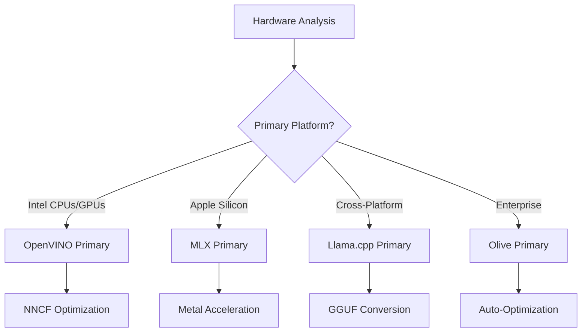
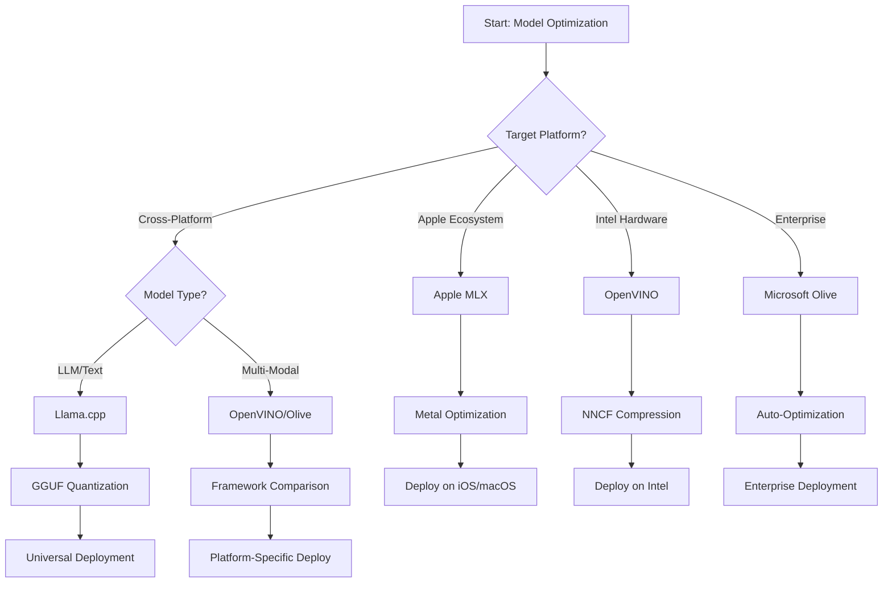
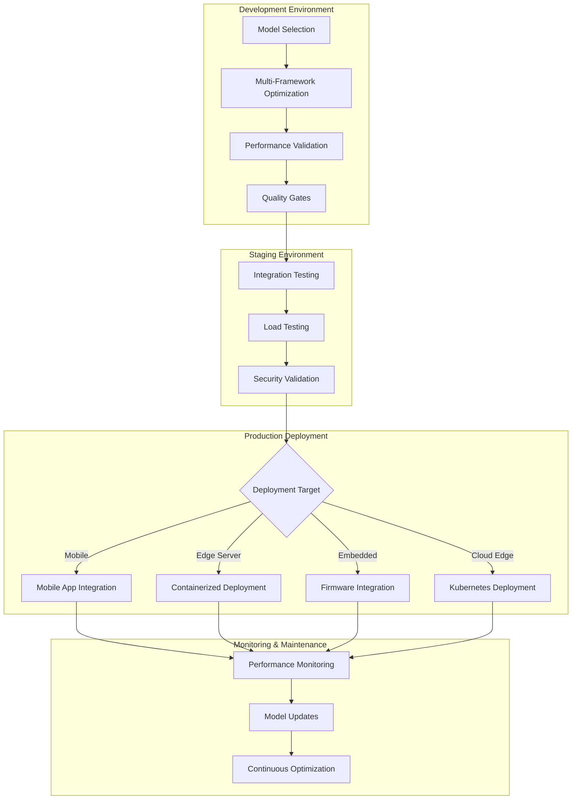

<!--
CO_OP_TRANSLATOR_METADATA:
{
  "original_hash": "6fbccc3e9d5911e3df32090724daac13",
  "translation_date": "2025-10-30T12:03:52+00:00",
  "source_file": "Module04/06.workflow-synthesis.md",
  "language_code": "ne"
}
-->
# खण्ड ६: एज एआई विकास कार्यप्रवाह संश्लेषण

## विषय सूची
1. [परिचय](../../../Module04)
2. [अध्ययनका उद्देश्यहरू](../../../Module04)
3. [एकीकृत कार्यप्रवाहको अवलोकन](../../../Module04)
4. [फ्रेमवर्क चयन म्याट्रिक्स](../../../Module04)
5. [सर्वोत्तम अभ्यासको संश्लेषण](../../../Module04)
6. [परिनियोजन रणनीति मार्गदर्शक](../../../Module04)
7. [प्रदर्शन अनुकूलन कार्यप्रवाह](../../../Module04)
8. [उत्पादन तयारी चेकलिस्ट](../../../Module04)
9. [समस्या समाधान र निगरानी](../../../Module04)
10. [तपाईंको एज एआई पाइपलाइनलाई भविष्यमा सुरक्षित बनाउने](../../../Module04)

## परिचय

एज एआई विकासले विभिन्न अनुकूलन फ्रेमवर्क, परिनियोजन रणनीति, र हार्डवेयर विचारहरूको गहिरो समझ आवश्यक छ। यो व्यापक संश्लेषणले Llama.cpp, Microsoft Olive, OpenVINO, र Apple MLX बाट ज्ञानलाई एकीकृत कार्यप्रवाहमा ल्याउँछ जसले दक्षता अधिकतम बनाउँछ, गुणस्तर कायम राख्छ, र सफल उत्पादन परिनियोजन सुनिश्चित गर्दछ।

यस पाठक्रमको क्रममा, हामीले व्यक्तिगत अनुकूलन फ्रेमवर्कहरू अन्वेषण गरेका छौं, प्रत्येकको अद्वितीय बल र विशेष प्रयोग केसहरू छन्। तर, वास्तविक संसारका एज एआई परियोजनाहरूले प्रायः धेरै फ्रेमवर्कहरूबाट प्रविधिहरू संयोजन गर्न वा विशिष्ट बाधा र आवश्यकताहरूको लागि सबैभन्दा राम्रो परिणाम दिने दृष्टिकोणको बारेमा रणनीतिक निर्णय लिन आवश्यक हुन्छ।

यस खण्डले सबै फ्रेमवर्कहरूबाट सामूहिक ज्ञानलाई कार्यप्रवाह, निर्णय वृक्षहरू, र सर्वोत्तम अभ्यासहरूमा संश्लेषण गर्दछ जसले तपाईंलाई उत्पादन-तयार एज एआई समाधानहरू कुशलतापूर्वक र प्रभावकारी रूपमा निर्माण गर्न सक्षम बनाउँछ। चाहे तपाईं मोबाइल उपकरणहरू, एम्बेडेड प्रणालीहरू, वा एज सर्भरहरूको लागि अनुकूलन गर्दै हुनुहुन्छ, यो मार्गदर्शकले तपाईंको विकास जीवनचक्रको क्रममा सूचित निर्णयहरू लिनको लागि रणनीतिक फ्रेमवर्क प्रदान गर्दछ।

## अध्ययनका उद्देश्यहरू

यस खण्डको अन्त्यसम्ममा, तपाईं सक्षम हुनुहुनेछ:

### रणनीतिक निर्णय लिनु
- **मूल्याङ्कन र चयन गर्नुहोस्** परियोजना आवश्यकताहरू, हार्डवेयर बाधाहरू, र परिनियोजन परिदृश्यहरूमा आधारित अनुकूलन फ्रेमवर्क
- **व्यापक कार्यप्रवाह डिजाइन गर्नुहोस्** अधिकतम दक्षताको लागि धेरै अनुकूलन प्रविधिहरू एकीकृत गर्ने
- **मूल्याङ्कन गर्नुहोस्** मोडेल सटीकता, अनुमान गति, मेमोरी प्रयोग, र विभिन्न फ्रेमवर्कहरूमा परिनियोजन जटिलताको बीच व्यापार-सम्झौता

### कार्यप्रवाह एकीकरण
- **एकीकृत विकास पाइपलाइन कार्यान्वयन गर्नुहोस्** जसले धेरै अनुकूलन फ्रेमवर्कहरूको बललाई उपयोग गर्दछ
- **पुनरुत्पादक कार्यप्रवाह सिर्जना गर्नुहोस्** विभिन्न वातावरणहरूमा निरन्तर मोडेल अनुकूलन र परिनियोजनको लागि
- **गुणस्तर गेटहरू स्थापना गर्नुहोस्** र मान्यकरण प्रक्रियाहरू सुनिश्चित गर्न अनुकूलित मोडेलहरू उत्पादन आवश्यकताहरू पूरा गर्छन्

### प्रदर्शन अनुकूलन
- **प्रणालीगत अनुकूलन रणनीतिहरू लागू गर्नुहोस्** क्वान्टाइजेशन, प्रुनिङ, र हार्डवेयर-विशिष्ट एक्सेलेरेशन प्रविधिहरू प्रयोग गर्दै
- **मोडेल प्रदर्शन निगरानी र बेंचमार्क गर्नुहोस्** विभिन्न अनुकूलन स्तरहरू र परिनियोजन लक्ष्यहरूमा
- **विशिष्ट हार्डवेयर प्लेटफर्महरूको लागि अनुकूलन गर्नुहोस्** CPU, GPU, NPU, र विशेष एज एक्सेलेरेटरहरू सहित

### उत्पादन परिनियोजन
- **स्केलेबल परिनियोजन आर्किटेक्चर डिजाइन गर्नुहोस्** जसले धेरै मोडेल ढाँचाहरू र अनुमान इन्जिनहरू समायोजन गर्दछ
- **उत्पादन वातावरणमा निगरानी र अवलोकनीयता कार्यान्वयन गर्नुहोस्** एज एआई अनुप्रयोगहरूको लागि
- **मोडेल अपडेटहरू, प्रदर्शन निगरानी, र प्रणाली अनुकूलनको लागि मर्मत कार्यप्रवाह स्थापना गर्नुहोस्**

### क्रस-प्लेटफर्म उत्कृष्टता
- **अनुकूलित मोडेलहरू परिनियोजन गर्नुहोस्** विविध हार्डवेयर प्लेटफर्महरूमा स्थिर प्रदर्शन कायम राख्दै
- **प्लेटफर्म-विशिष्ट अनुकूलनहरू ह्यान्डल गर्नुहोस्** Windows, macOS, Linux, मोबाइल, र एम्बेडेड प्रणालीहरूको लागि
- **एब्स्ट्र्याक्शन लेयरहरू सिर्जना गर्नुहोस्** जसले विभिन्न एज वातावरणहरूमा सहज परिनियोजन सक्षम गर्दछ

## एकीकृत कार्यप्रवाहको अवलोकन

### चरण १: आवश्यकताहरू विश्लेषण र फ्रेमवर्क चयन

सफल एज एआई परिनियोजनको आधार विस्तृत आवश्यकताहरू विश्लेषणबाट सुरु हुन्छ जसले फ्रेमवर्क चयन र अनुकूलन रणनीतिलाई सूचित गर्दछ।

#### १.१ हार्डवेयर मूल्याङ्कन


**मुख्य विचारहरू:**
- **CPU आर्किटेक्चर**: x86, ARM, Apple Silicon क्षमता
- **एक्सेलेरेटर उपलब्धता**: GPU, NPU, VPU, विशेष एआई चिप्स
- **मेमोरी सीमाहरू**: RAM सीमितता, भण्डारण क्षमता
- **पावर बजेट**: ब्याट्री जीवन, थर्मल सीमाहरू
- **कनेक्टिविटी**: अफलाइन आवश्यकताहरू, ब्यान्डविथ सीमाहरू

#### १.२ अनुप्रयोग आवश्यकताहरू म्याट्रिक्स

| आवश्यकताहरू | Llama.cpp | Microsoft Olive | OpenVINO | Apple MLX |
|-------------|-----------|-----------------|----------|-----------|
| क्रस-प्लेटफर्म | ✅ उत्कृष्ट | ⚡ राम्रो | ⚡ राम्रो | ❌ केवल Apple |
| उद्यम एकीकरण | ⚡ आधारभूत | ✅ उत्कृष्ट | ✅ उत्कृष्ट | ⚡ सीमित |
| मोबाइल परिनियोजन | ✅ उत्कृष्ट | ⚡ राम्रो | ⚡ राम्रो | ✅ iOS उत्कृष्ट |
| वास्तविक-समय अनुमान | ✅ उत्कृष्ट | ✅ उत्कृष्ट | ✅ उत्कृष्ट | ✅ उत्कृष्ट |
| मोडेल विविधता | ✅ LLM केन्द्रित | ✅ सबै मोडेलहरू | ✅ सबै मोडेलहरू | ✅ LLM केन्द्रित |
| प्रयोगको सजिलो | ✅ सरल | ✅ स्वचालित | ⚡ मध्यम | ✅ सरल |

### चरण २: मोडेल तयारी र अनुकूलन

#### २.१ सार्वभौमिक मोडेल मूल्याङ्कन पाइपलाइन

```python
# Universal Model Assessment Framework
class EdgeAIModelAssessment:
    def __init__(self, model_path, target_hardware):
        self.model_path = model_path
        self.target_hardware = target_hardware
        self.optimization_frameworks = []
        
    def assess_model_characteristics(self):
        """Analyze model size, architecture, and complexity"""
        return {
            'model_size': self.get_model_size(),
            'parameter_count': self.get_parameter_count(),
            'architecture_type': self.detect_architecture(),
            'quantization_compatibility': self.check_quantization_support()
        }
    
    def recommend_optimization_strategy(self):
        """Recommend optimal frameworks and techniques"""
        characteristics = self.assess_model_characteristics()
        
        if self.target_hardware.startswith('apple'):
            return self.mlx_optimization_strategy(characteristics)
        elif self.target_hardware.startswith('intel'):
            return self.openvino_optimization_strategy(characteristics)
        elif characteristics['model_size'] > 7_000_000_000:  # 7B+ parameters
            return self.enterprise_optimization_strategy(characteristics)
        else:
            return self.lightweight_optimization_strategy(characteristics)
```

#### २.२ बहु-फ्रेमवर्क अनुकूलन पाइपलाइन

**क्रमिक अनुकूलन दृष्टिकोण:**
1. **प्रारम्भिक रूपान्तरण**: मध्यवर्ती ढाँचामा रूपान्तरण गर्नुहोस् (ONNX सम्भव भएमा)
2. **फ्रेमवर्क-विशिष्ट अनुकूलन**: विशेष प्रविधिहरू लागू गर्नुहोस्
3. **क्रस-मान्यकरण**: लक्ष्य प्लेटफर्महरूमा प्रदर्शन प्रमाणित गर्नुहोस्
4. **अन्तिम प्याकेजिङ**: परिनियोजनको लागि तयार गर्नुहोस्

```bash
# Multi-Framework Optimization Script
#!/bin/bash

MODEL_NAME="phi-3-mini"
BASE_MODEL="microsoft/Phi-3-mini-4k-instruct"

# Phase 1: ONNX Conversion (Universal)
python convert_to_onnx.py --model $BASE_MODEL --output models/onnx/

# Phase 2: Platform-Specific Optimization
if [[ "$TARGET_PLATFORM" == "intel" ]]; then
    # OpenVINO Optimization
    python optimize_openvino.py --input models/onnx/ --output models/openvino/
elif [[ "$TARGET_PLATFORM" == "apple" ]]; then
    # MLX Optimization
    python optimize_mlx.py --input $BASE_MODEL --output models/mlx/
elif [[ "$TARGET_PLATFORM" == "cross" ]]; then
    # Llama.cpp Optimization
    python convert_to_gguf.py --input models/onnx/ --output models/gguf/
fi

# Phase 3: Validation
python validate_optimization.py --original $BASE_MODEL --optimized models/$TARGET_PLATFORM/
```

### चरण ३: प्रदर्शन मान्यकरण र बेंचमार्किङ

#### ३.१ व्यापक बेंचमार्किङ फ्रेमवर्क

```python
class EdgeAIBenchmark:
    def __init__(self, optimized_models):
        self.models = optimized_models
        self.metrics = {
            'inference_time': [],
            'memory_usage': [],
            'accuracy_score': [],
            'throughput': [],
            'energy_consumption': []
        }
    
    def run_comprehensive_benchmark(self):
        """Execute standardized benchmarks across all optimized models"""
        test_inputs = self.generate_test_inputs()
        
        for model_framework, model_path in self.models.items():
            print(f"Benchmarking {model_framework}...")
            
            # Latency Testing
            latency = self.measure_inference_latency(model_path, test_inputs)
            
            # Memory Profiling
            memory = self.profile_memory_usage(model_path)
            
            # Accuracy Validation
            accuracy = self.validate_model_accuracy(model_path, test_inputs)
            
            # Throughput Analysis
            throughput = self.measure_throughput(model_path)
            
            self.record_metrics(model_framework, latency, memory, accuracy, throughput)
    
    def generate_optimization_report(self):
        """Create comprehensive comparison report"""
        report = {
            'recommendations': self.analyze_performance_trade_offs(),
            'deployment_guidance': self.generate_deployment_recommendations(),
            'monitoring_requirements': self.define_monitoring_metrics()
        }
        return report
```

## फ्रेमवर्क चयन म्याट्रिक्स

### फ्रेमवर्क चयनको लागि निर्णय वृक्ष



### व्यापक चयन मापदण्ड

#### १. प्राथमिक प्रयोग केस समायोजन

**ठूला भाषा मोडेलहरू (LLMs):**
- **Llama.cpp**: CPU-केंद्रित, क्रस-प्लेटफर्म परिनियोजनको लागि उत्कृष्ट
- **Apple MLX**: Apple Siliconको लागि उपयुक्त, एकीकृत मेमोरीको साथ
- **OpenVINO**: Intel हार्डवेयरको लागि उत्कृष्ट, NNCF अनुकूलनको साथ
- **Microsoft Olive**: स्वचालनको साथ उद्यम कार्यप्रवाहको लागि आदर्श

**बहु-मोडल मोडेलहरू:**
- **OpenVINO**: दृष्टि, अडियो, र पाठको लागि व्यापक समर्थन
- **Microsoft Olive**: जटिल पाइपलाइनहरूको लागि उद्यम-ग्रेड अनुकूलन
- **Llama.cpp**: पाठ-आधारित मोडेलहरूमा सीमित
- **Apple MLX**: बहु-मोडल अनुप्रयोगहरूको लागि बढ्दो समर्थन

#### २. हार्डवेयर प्लेटफर्म म्याट्रिक्स

| प्लेटफर्म | प्राथमिक फ्रेमवर्क | द्वितीय विकल्प | विशेष सुविधाहरू |
|----------|------------------|------------------|---------------------|
| Intel CPU/GPU | OpenVINO | Microsoft Olive | NNCF कम्प्रेसन, Intel अनुकूलन |
| NVIDIA GPU | Microsoft Olive | OpenVINO | CUDA एक्सेलेरेशन, उद्यम सुविधाहरू |
| Apple Silicon | Apple MLX | Llama.cpp | Metal शेडरहरू, एकीकृत मेमोरी |
| ARM मोबाइल | Llama.cpp | OpenVINO | क्रस-प्लेटफर्म, न्यूनतम निर्भरता |
| Edge TPU | OpenVINO | Microsoft Olive | विशेष एक्सेलेरेटर समर्थन |
| एम्बेडेड ARM | Llama.cpp | OpenVINO | न्यूनतम फुटप्रिन्ट, कुशल अनुमान |

#### ३. विकास कार्यप्रवाह प्राथमिकताहरू

**द्रुत प्रोटोटाइपिङ:**
1. **Llama.cpp**: छिटो सेटअप, तत्काल परिणामहरू
2. **Apple MLX**: सरल Python API, छिटो पुनरावृत्ति
3. **Microsoft Olive**: स्वचालित अनुकूलन, न्यूनतम कन्फिगरेसन
4. **OpenVINO**: अधिक जटिल सेटअप, व्यापक सुविधाहरू

**उद्यम उत्पादन:**
1. **Microsoft Olive**: उद्यम सुविधाहरू, Azure एकीकरण
2. **OpenVINO**: Intel इकोसिस्टम, व्यापक उपकरणहरू
3. **Apple MLX**: Apple-विशिष्ट उद्यम अनुप्रयोगहरू
4. **Llama.cpp**: सरल परिनियोजन, सीमित उद्यम सुविधाहरू

## सर्वोत्तम अभ्यास संश्लेषण

### सार्वभौमिक अनुकूलन सिद्धान्तहरू

#### १. प्रगतिशील अनुकूलन रणनीति

```python
class ProgressiveOptimization:
    def __init__(self, base_model):
        self.base_model = base_model
        self.optimization_stages = [
            'baseline_measurement',
            'format_conversion',
            'quantization_optimization',
            'hardware_acceleration',
            'production_validation'
        ]
    
    def execute_progressive_optimization(self):
        """Apply optimization techniques incrementally"""
        
        # Stage 1: Baseline Measurement
        baseline_metrics = self.measure_baseline_performance()
        
        # Stage 2: Format Conversion
        converted_model = self.convert_to_optimal_format()
        conversion_metrics = self.measure_performance(converted_model)
        
        # Stage 3: Quantization
        quantized_model = self.apply_quantization(converted_model)
        quantization_metrics = self.measure_performance(quantized_model)
        
        # Stage 4: Hardware Acceleration
        accelerated_model = self.enable_hardware_acceleration(quantized_model)
        acceleration_metrics = self.measure_performance(accelerated_model)
        
        # Stage 5: Validation
        production_ready = self.validate_for_production(accelerated_model)
        
        return self.compile_optimization_report(
            baseline_metrics, conversion_metrics, 
            quantization_metrics, acceleration_metrics
        )
```

#### २. गुणस्तर गेट कार्यान्वयन

**सटीकता संरक्षण गेटहरू:**
- मूल मोडेल सटीकताको >95% कायम राख्नुहोस्
- प्रतिनिधि परीक्षण डेटासेटहरू विरुद्ध प्रमाणित गर्नुहोस्
- उत्पादन मान्यकरणको लागि A/B परीक्षण कार्यान्वयन गर्नुहोस्

**प्रदर्शन सुधार गेटहरू:**
- न्यूनतम 2x गति सुधार प्राप्त गर्नुहोस्
- मेमोरी फुटप्रिन्ट कम्तिमा 50% घटाउनुहोस्
- अनुमान समय स्थिरता प्रमाणित गर्नुहोस्

**उत्पादन तयारी गेटहरू:**
- लोड अन्तर्गत तनाव परीक्षण पास गर्नुहोस्
- समयको साथ स्थिर प्रदर्शन प्रदर्शन गर्नुहोस्
- सुरक्षा र गोपनीयता आवश्यकताहरू प्रमाणित गर्नुहोस्

### फ्रेमवर्क-विशिष्ट सर्वोत्तम अभ्यास एकीकरण

#### १. क्वान्टाइजेशन रणनीति संश्लेषण

```python
# Unified Quantization Approach
class UnifiedQuantizationStrategy:
    def __init__(self, model, target_platform):
        self.model = model
        self.platform = target_platform
        
    def select_optimal_quantization(self):
        """Choose best quantization based on platform and requirements"""
        
        if self.platform == 'apple_silicon':
            return self.mlx_quantization_strategy()
        elif self.platform == 'intel_hardware':
            return self.openvino_quantization_strategy()
        elif self.platform == 'cross_platform':
            return self.llamacpp_quantization_strategy()
        else:
            return self.olive_quantization_strategy()
    
    def mlx_quantization_strategy(self):
        """Apple MLX-specific quantization"""
        return {
            'method': 'mlx_quantize',
            'precision': 'int4',
            'group_size': 64,
            'optimization_target': 'unified_memory'
        }
    
    def openvino_quantization_strategy(self):
        """OpenVINO NNCF quantization"""
        return {
            'method': 'nncf_quantize',
            'precision': 'int8',
            'calibration_method': 'post_training',
            'optimization_target': 'intel_hardware'
        }
```

#### २. हार्डवेयर एक्सेलेरेशन अनुकूलन

**CPU अनुकूलन संश्लेषण:**
- **SIMD निर्देशनहरू**: फ्रेमवर्कहरूमा अनुकूलित कर्नेलहरू उपयोग गर्नुहोस्
- **मेमोरी ब्यान्डविथ**: क्यास दक्षताको लागि डेटा लेआउटहरू अनुकूलित गर्नुहोस्
- **थ्रेडिङ**: संसाधन सीमाहरूको साथ समानान्तरता सन्तुलन गर्नुहोस्

**GPU एक्सेलेरेशन सर्वोत्तम अभ्यासहरू:**
- **ब्याच प्रोसेसिङ**: उपयुक्त ब्याच साइजहरूको साथ थ्रुपुट अधिकतम गर्नुहोस्
- **मेमोरी व्यवस्थापन**: GPU मेमोरी आवंटन र स्थानान्तरण अनुकूलित गर्नुहोस्
- **सटीकता**: FP16 प्रयोग गर्नुहोस् जब प्रदर्शन सुधारको लागि समर्थन गरिएको छ

**NPU/विशेष एक्सेलेरेटर अनुकूलन:**
- **मोडेल आर्किटेक्चर**: एक्सेलेरेटर क्षमताहरूको साथ अनुकूलता सुनिश्चित गर्नुहोस्
- **डेटा प्रवाह**: एक्सेलेरेटर दक्षताको लागि इनपुट/आउटपुट पाइपलाइनहरू अनुकूलित गर्नुहोस्
- **फलब्याक रणनीतिहरू**: असमर्थित अपरेसनहरूको लागि CPU फलब्याक कार्यान्वयन गर्नुहोस्

## परिनियोजन रणनीति मार्गदर्शक

### सार्वभौमिक परिनियोजन आर्किटेक्चर



### प्लेटफर्म-विशिष्ट परिनियोजन ढाँचाहरू

#### १. मोबाइल परिनियोजन रणनीति

```yaml
# Mobile Deployment Configuration
mobile_deployment:
  ios:
    framework: apple_mlx
    optimization:
      quantization: int4
      memory_mapping: true
      background_execution: limited
    packaging:
      format: mlx
      bundle_size: <50MB
      
  android:
    framework: llama_cpp
    optimization:
      quantization: q4_k_m
      threading: android_optimized
      memory_management: conservative
    packaging:
      format: gguf
      apk_size: <100MB
      
  cross_platform:
    framework: onnx_runtime
    optimization:
      quantization: int8
      execution_provider: cpu
    packaging:
      format: onnx
      shared_libraries: minimal
```

#### २. एज सर्भर परिनियोजन

```yaml
# Edge Server Deployment Configuration
edge_server:
  intel_based:
    framework: openvino
    optimization:
      quantization: int8
      acceleration: cpu_gpu_auto
      batch_processing: dynamic
    deployment:
      container: openvino_runtime
      orchestration: kubernetes
      scaling: horizontal
      
  nvidia_based:
    framework: microsoft_olive
    optimization:
      quantization: int4
      acceleration: cuda
      tensor_parallelism: true
    deployment:
      container: nvidia_triton
      orchestration: kubernetes
      scaling: gpu_aware
```

### कन्टेनराइजेशन सर्वोत्तम अभ्यासहरू

```dockerfile
# Multi-Framework Edge AI Container
FROM ubuntu:22.04 as base

# Install common dependencies
RUN apt-get update && apt-get install -y \
    python3 \
    python3-pip \
    build-essential \
    cmake \
    && rm -rf /var/lib/apt/lists/*

# Framework-specific stages
FROM base as openvino
RUN pip install openvino nncf optimum[intel]

FROM base as llamacpp
RUN git clone https://github.com/ggerganov/llama.cpp.git \
    && cd llama.cpp && make LLAMA_OPENBLAS=1

FROM base as olive
RUN pip install olive-ai[auto-opt] onnxruntime-genai

# Production stage with selected framework
FROM openvino as production
COPY models/ /app/models/
COPY src/ /app/src/
WORKDIR /app

EXPOSE 8080
CMD ["python3", "src/inference_server.py"]
```

## प्रदर्शन अनुकूलन कार्यप्रवाह

### प्रणालीगत प्रदर्शन ट्युनिङ

#### १. प्रदर्शन प्रोफाइलिङ पाइपलाइन

```python
class EdgeAIPerformanceProfiler:
    def __init__(self, model_path, framework):
        self.model_path = model_path
        self.framework = framework
        self.profiling_results = {}
    
    def comprehensive_profiling(self):
        """Execute comprehensive performance analysis"""
        
        # CPU Profiling
        cpu_profile = self.profile_cpu_usage()
        
        # Memory Profiling
        memory_profile = self.profile_memory_usage()
        
        # Inference Latency
        latency_profile = self.profile_inference_latency()
        
        # Throughput Analysis
        throughput_profile = self.profile_throughput()
        
        # Energy Consumption (where available)
        energy_profile = self.profile_energy_consumption()
        
        return self.compile_performance_report(
            cpu_profile, memory_profile, latency_profile,
            throughput_profile, energy_profile
        )
    
    def identify_bottlenecks(self):
        """Automatically identify performance bottlenecks"""
        bottlenecks = []
        
        if self.profiling_results['cpu_utilization'] > 80:
            bottlenecks.append('cpu_bound')
        
        if self.profiling_results['memory_usage'] > 90:
            bottlenecks.append('memory_bound')
        
        if self.profiling_results['inference_variance'] > 20:
            bottlenecks.append('inconsistent_performance')
        
        return self.generate_optimization_recommendations(bottlenecks)
```

#### २. स्वचालित अनुकूलन पाइपलाइन

```python
class AutomatedOptimizationPipeline:
    def __init__(self, base_model, target_constraints):
        self.base_model = base_model
        self.constraints = target_constraints
        self.optimization_history = []
    
    def execute_optimization_search(self):
        """Systematically search optimization space"""
        
        optimization_candidates = [
            {'quantization': 'int8', 'pruning': 0.1},
            {'quantization': 'int4', 'pruning': 0.2},
            {'quantization': 'int8', 'acceleration': 'gpu'},
            {'quantization': 'int4', 'acceleration': 'npu'}
        ]
        
        best_configuration = None
        best_score = 0
        
        for config in optimization_candidates:
            optimized_model = self.apply_optimization(config)
            score = self.evaluate_optimization(optimized_model)
            
            if score > best_score and self.meets_constraints(optimized_model):
                best_score = score
                best_configuration = config
            
            self.optimization_history.append({
                'config': config,
                'score': score,
                'model': optimized_model
            })
        
        return best_configuration, self.optimization_history
```

### बहु-उद्देश्य अनुकूलन

#### १. एज एआईको लागि पारेटो अनुकूलन

```python
class ParetoOptimization:
    def __init__(self, objectives=['speed', 'accuracy', 'memory']):
        self.objectives = objectives
        self.pareto_frontier = []
    
    def find_pareto_optimal_solutions(self, optimization_results):
        """Identify Pareto-optimal configurations"""
        
        for result in optimization_results:
            is_dominated = False
            
            for frontier_point in self.pareto_frontier:
                if self.dominates(frontier_point, result):
                    is_dominated = True
                    break
            
            if not is_dominated:
                # Remove dominated points from frontier
                self.pareto_frontier = [
                    point for point in self.pareto_frontier 
                    if not self.dominates(result, point)
                ]
                
                self.pareto_frontier.append(result)
        
        return self.pareto_frontier
    
    def recommend_configuration(self, user_preferences):
        """Recommend configuration based on user preferences"""
        
        weighted_scores = []
        for config in self.pareto_frontier:
            score = sum(
                user_preferences[obj] * config['metrics'][obj] 
                for obj in self.objectives
            )
            weighted_scores.append((score, config))
        
        return max(weighted_scores, key=lambda x: x[0])[1]
```

## उत्पादन तयारी चेकलिस्ट

### व्यापक उत्पादन मान्यकरण

#### १. मोडेल गुणस्तर आश्वासन

```python
class ProductionReadinessValidator:
    def __init__(self, optimized_model, production_requirements):
        self.model = optimized_model
        self.requirements = production_requirements
        self.validation_results = {}
    
    def validate_model_quality(self):
        """Comprehensive model quality validation"""
        
        # Accuracy Validation
        accuracy_result = self.validate_accuracy()
        
        # Performance Validation
        performance_result = self.validate_performance()
        
        # Robustness Testing
        robustness_result = self.validate_robustness()
        
        # Security Assessment
        security_result = self.validate_security()
        
        # Compliance Verification
        compliance_result = self.validate_compliance()
        
        return self.compile_validation_report(
            accuracy_result, performance_result, robustness_result,
            security_result, compliance_result
        )
    
    def generate_certification_report(self):
        """Generate production certification report"""
        return {
            'model_signature': self.generate_model_signature(),
            'validation_timestamp': datetime.now(),
            'validation_results': self.validation_results,
            'deployment_approval': self.check_deployment_approval(),
            'monitoring_requirements': self.define_monitoring_requirements()
        }
```

#### २. उत्पादन परिनियोजन चेकलिस्ट

**पूर्व-परिनियोजन मान्यकरण:**
- [ ] मोडेल सटीकता न्यूनतम आवश्यकताहरू पूरा गर्दछ (>95% आधाररेखा)
- [ ] प्रदर्शन लक्ष्यहरू प्राप्त गरियो (लेटेन्सी, थ्रुपुट, मेमोरी)
- [ ] सुरक्षा कमजोरीहरू मूल्याङ्कन गरियो र कम गरियो
- [ ] अपेक्षित लोड अन्तर्गत तनाव परीक्षण पूरा गरियो
- [ ] असफलता परिदृश्यहरू परीक्षण गरियो र पुन: प्राप्ति प्रक्रियाहरू प्रमाणित गरियो
- [ ] निगरानी र अलर्ट प्रणालीहरू कन्फिगर गरियो
- [ ] रोलब्याक प्रक्रियाहरू परीक्षण गरियो र दस्तावेज गरिएको छ

**परिनियोजन प्रक्रिया:**
- [ ] ब्लू-ग्रीन परिनियोजन रणनीति कार्यान्वयन गरियो
- [ ] क्रमिक ट्राफिक र्याम्पिङ कन्फिगर गरियो
- [ ] वास्तविक-समय निगरानी ड्यासबोर्ड सक्रिय
- [ ] प्रदर्शन आधाररेखा स्थापना गरियो
- [ ] त्रुटि दर थ्रेसहोल्डहरू परिभाषित गरियो
- [ ] स्वचालित रोलब्याक ट्रिगरहरू कन्फिगर गरियो

**पोस्ट-परिनियोजन निगरानी:**
- [ ] मोडेल ड्रिफ्ट डिटेक्शन सक्रिय
- [ ] प्रदर्शन ह्रास अलर्टहरू कन्फिगर गरियो
- [ ] स्रोत उपयोग निगरानी सक्षम
- [ ] प्रयोगकर्ता अनुभव मेट्रिक्स ट्र्याक गरियो
- [ ] मोडेल संस्करण र वंशावली कायम
- [ ] नियमित मोडेल प्रदर्शन समीक्षा तालिका बनाइयो

### निरन्तर एकीकरण/निरन्तर परिनियोजन (CI/CD)

```yaml
# Edge AI CI/CD Pipeline Configuration
edge_ai_pipeline:
  stages:
    - model_validation
    - optimization
    - testing
    - staging_deployment
    - production_deployment
    - monitoring
  
  model_validation:
    accuracy_threshold: 0.95
    performance_baseline: required
    security_scan: enabled
    
  optimization:
    frameworks:
      - llama_cpp
      - openvino
      - microsoft_olive
    validation:
      cross_validation: enabled
      performance_comparison: required
      
  testing:
    unit_tests: comprehensive
    integration_tests: full_pipeline
    load_tests: production_scale
    security_tests: comprehensive
    
  deployment:
    strategy: blue_green
    traffic_ramping: gradual
    rollback: automatic
    monitoring: real_time
```

## समस्या समाधान र निगरानी

### सार्वभौमिक समस्या समाधान फ्रेमवर्क

#### १. सामान्य समस्याहरू र समाधानहरू

**प्रदर्शन समस्याहरू:**
```python
class PerformanceTroubleshooter:
    def __init__(self, model_metrics):
        self.metrics = model_metrics
        
    def diagnose_performance_issues(self):
        """Systematic performance issue diagnosis"""
        
        issues = []
        
        # High latency diagnosis
        if self.metrics['avg_latency'] > self.metrics['target_latency']:
            issues.append(self.diagnose_latency_issues())
        
        # Memory usage diagnosis
        if self.metrics['memory_usage'] > self.metrics['memory_limit']:
            issues.append(self.diagnose_memory_issues())
        
        # Throughput diagnosis
        if self.metrics['throughput'] < self.metrics['target_throughput']:
            issues.append(self.diagnose_throughput_issues())
        
        return self.generate_resolution_plan(issues)
    
    def diagnose_latency_issues(self):
        """Specific latency troubleshooting"""
        potential_causes = []
        
        if self.metrics['cpu_utilization'] > 80:
            potential_causes.append('cpu_bottleneck')
        
        if self.metrics['memory_bandwidth'] > 90:
            potential_causes.append('memory_bandwidth_limit')
        
        if self.metrics['model_size'] > self.metrics['optimal_size']:
            potential_causes.append('model_too_large')
        
        return {
            'issue': 'high_latency',
            'causes': potential_causes,
            'solutions': self.generate_latency_solutions(potential_causes)
        }
```

**फ्रेमवर्क-विशिष्ट समस्या समाधान:**

| समस्या | Llama.cpp | Microsoft Olive | OpenVINO | Apple MLX |
|-------|-----------|-----------------|----------|-----------|
| मेमोरी समस्याहरू | सन्दर्भ लम्बाइ घटाउनुहोस् | ब्याच साइज घटाउनुहोस् | क्यासिङ सक्षम गर्नुहोस् | मेमोरी म्यापिङ प्रयोग गर्नुहोस् |
| सुस्त अनुमान | SIMD सक्षम गर्नुहोस् | क्वान्टाइजेशन जाँच गर्नुहोस् | थ्रेडिङ अनुकूलित गर्नुहोस् | Metal सक्षम गर्नुहोस् |
| सटीकता ह्रास | उच्च क्वान्टाइजेशन | QATको साथ पुन: प्रशिक्षण | क्यालिब्रेसन बढाउनुहोस् | पोस्ट-क्वान्ट फाइन-ट्युन गर्नुहोस् |
| अनुकूलता | मोडेल ढाँचा जाँच गर्नुहोस् | फ्रेमवर्क संस्करण प्रमाणित गर्नुहोस् | ड्राइभरहरू अपडेट गर्नुहोस् | macOS संस्करण जाँच गर्नुहोस् |

#### २. उत्पादन निगरानी रणनीति

```python
class EdgeAIMonitoring:
    def __init__(self, deployment_config):
        self.config = deployment_config
        self.metrics_collectors = []
        self.alerting_rules = []
    
    def setup_comprehensive_monitoring(self):
        """Configure comprehensive monitoring for Edge AI deployment"""
        
        # Model Performance Monitoring
        self.setup_model_performance_monitoring()
        
        # Infrastructure Monitoring
        self.setup_infrastructure_monitoring()
        
        # Business Metrics Monitoring
        self.setup_business_metrics_monitoring()
        
        # Security Monitoring
        self.setup_security_monitoring()
    
    def setup_model_performance_monitoring(self):
        """Model-specific performance monitoring"""
        metrics = [
            'inference_latency_p50',
            'inference_latency_p95',
            'inference_latency_p99',
            'model_accuracy_drift',
            'prediction_confidence_distribution',
            'error_rate',
            'throughput_requests_per_second'
        ]
        
        for metric in metrics:
            self.add_metric_collector(metric)
            self.add_alerting_rule(metric)
    
    def detect_model_drift(self):
        """Automated model drift detection"""
        drift_indicators = [
            self.statistical_drift_detection(),
            self.performance_drift_detection(),
            self.data_distribution_shift_detection()
        ]
        
        return self.aggregate_drift_signals(drift_indicators)
```

### स्वचालित समस्या समाधान

```python
class AutomatedIssueResolution:
    def __init__(self, monitoring_system):
        self.monitoring = monitoring_system
        self.resolution_strategies = {}
    
    def handle_performance_degradation(self, alert):
        """Automated performance issue resolution"""
        
        if alert['type'] == 'high_latency':
            return self.resolve_latency_issue(alert)
        elif alert['type'] == 'high_memory_usage':
            return self.resolve_memory_issue(alert)
        elif alert['type'] == 'accuracy_drift':
            return self.resolve_accuracy_issue(alert)
        
    def resolve_latency_issue(self, alert):
        """Automated latency issue resolution"""
        resolution_steps = [
            'increase_cpu_allocation',
            'enable_model_caching',
            'reduce_batch_size',
            'switch_to_quantized_model'
        ]
        
        for step in resolution_steps:
            if self.apply_resolution_step(step):
                return f"Resolved latency issue with: {step}"
        
        return "Escalating to human operator"
```

## तपाईंको एज एआई पाइपलाइनलाई भविष्यमा सुरक्षित बनाउने

### उदीयमान प्रविधिहरू एकीकरण

#### १. नेक्स्ट-जेनेरेशन हार्डवेयर समर्थन

```python
class FutureHardwareIntegration:
    def __init__(self):
        self.supported_accelerators = [
            'npu_next_gen',
            'quantum_processors',
            'neuromorphic_chips',
            'optical_processors'
        ]
    
    def design_adaptive_pipeline(self):
        """Create hardware-agnostic optimization pipeline"""
        
        pipeline = {
            'model_preparation': self.universal_model_preparation(),
            'hardware_detection': self.dynamic_hardware_detection(),
            'optimization_selection': self.adaptive_optimization_selection(),
            'performance_validation': self.hardware_agnostic_validation()
        }
        
        return pipeline
    
    def adaptive_optimization_selection(self):
        """Dynamically select optimization based on available hardware"""
        
        def optimize_for_hardware(model, available_hardware):
            if 'npu' in available_hardware:
                return self.npu_optimization(model)
            elif 'quantum' in available_hardware:
                return self.quantum_optimization(model)
            elif 'neuromorphic' in available_hardware:
                return self.neuromorphic_optimization(model)
            else:
                return self.fallback_optimization(model)
        
        return optimize_for_hardware
```

#### २. मोडेल आर्किटेक्चर विकास

**उदीयमान आर्किटेक्चरहरूको लागि समर्थन:**
- **Mixture of Experts (MoE)**: दक्षताको लागि स्पार्स मोडेल आर्किटेक्चर
- **Retrieval-Augmented Generation**: हाइब्रिड मोडेल + ज्ञान आधार प्रणालीहरू
- **मल्टिमोडल मोडेलहरू**: दृष्टि + भाषा + अडियो एकीकरण
- **फेडरेटेड लर्निङ**: वितरित प्रशिक्षण र अनुकूलन

```python
class NextGenModelSupport:
    def __init__(self):
        self.architecture_handlers = {
            'moe': self.handle_mixture_of_experts,
            'rag': self.handle_retrieval_augmented,
            'multimodal': self.handle_multimodal,
            'federated': self.handle_federated_learning
        }
    
    def handle_mixture_of_experts(self, model):
        """Optimize Mixture of Experts models for edge deployment"""
        optimization_strategy = {
            'expert_pruning': True,
            'routing_optimization': True,
            'expert_quantization': 'per_expert',
            'load_balancing': 'dynamic'
        }
        return self.apply_moe_optimization(model, optimization_strategy)
```

### निरन्तर अध्ययन र अनुकूलन

#### १. अनलाइन लर्निङ
याद गर्नुहोस् कि सबैभन्दा राम्रो अनुकूलन रणनीति भनेको तपाईंको विशेष आवश्यकताहरू पूरा गर्ने हो, साथै ती आवश्यकताहरू परिवर्तन हुँदा अनुकूलन गर्न सक्ने लचिलोपन कायम राख्ने हो। यो मार्गदर्शनलाई सूचित निर्णयहरू लिनको लागि एक रूपरेखा रूपमा प्रयोग गर्नुहोस्, तर सधैं आफ्नो छनोटहरू अनुभवजन्य परीक्षण र वास्तविक-विश्व परिनियोजन अनुभव मार्फत प्रमाणित गर्नुहोस्।

## ➡️ अब के गर्ने

- [07: Qualcomm QNN Framework गहिरो अध्ययन](./07.QualcommQNN.md)

---

**अस्वीकरण**:  
यो दस्तावेज़ AI अनुवाद सेवा [Co-op Translator](https://github.com/Azure/co-op-translator) प्रयोग गरेर अनुवाद गरिएको छ। हामी शुद्धताको लागि प्रयास गर्छौं, तर कृपया ध्यान दिनुहोस् कि स्वचालित अनुवादमा त्रुटिहरू वा अशुद्धताहरू हुन सक्छ। यसको मूल भाषा मा रहेको दस्तावेज़लाई आधिकारिक स्रोत मानिनुपर्छ। महत्वपूर्ण जानकारीको लागि, व्यावसायिक मानव अनुवाद सिफारिस गरिन्छ। यस अनुवादको प्रयोगबाट उत्पन्न हुने कुनै पनि गलतफहमी वा गलत व्याख्याको लागि हामी जिम्मेवार हुने छैनौं।