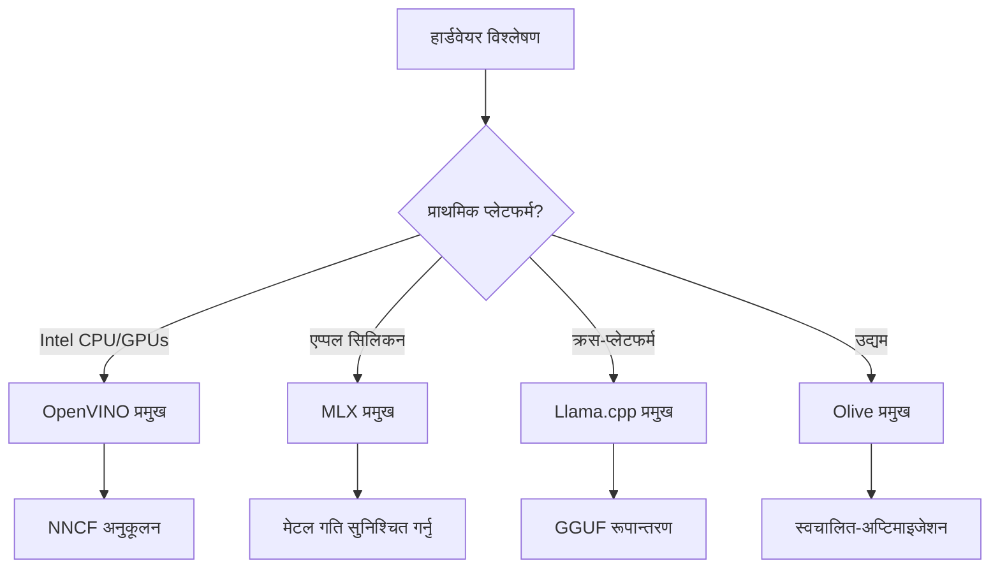
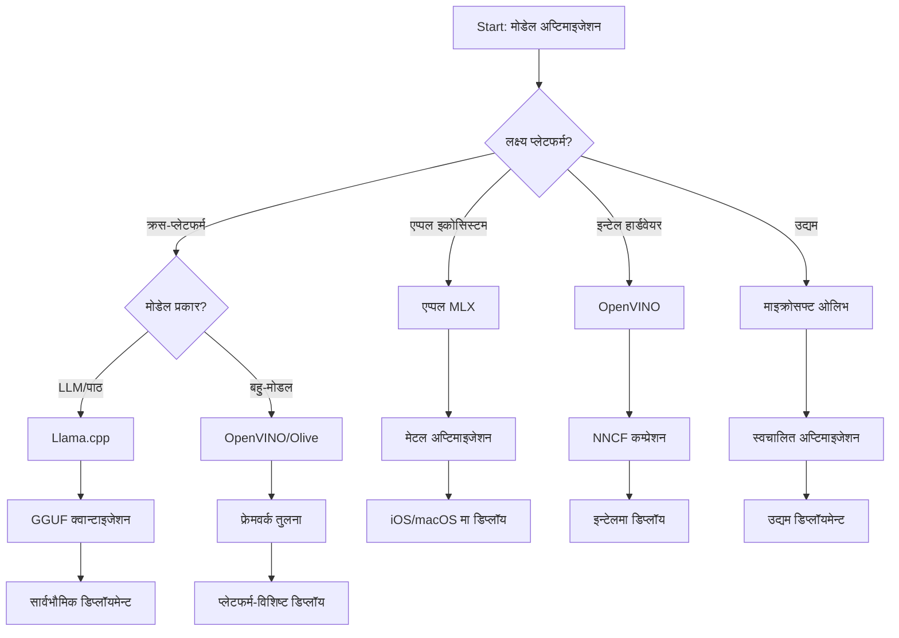
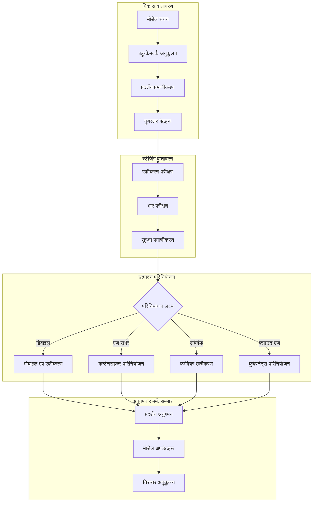

# खण्ड ६: एज AI विकास कार्यप्रवाह संश्लेषण

## सामग्री तालिका
१. [परिचय](#परिचय)
२. [अध्ययन लक्ष्यहरू](#अध्ययन-लक्ष्यहरू)
३. [एकीकृत कार्यप्रवाह अवलोकन](#एकीकृत-कार्यप्रवाह-अवलोकन)
४. [फ्रेमवर्क छनोट म्याट्रिक्स](#फ्रेमवर्क-छनोट-म्याट्रिक्स)
५. [श्रेष्ठ अभ्यास संश्लेषण](#श्रेष्ठ-अभ्यास-संश्लेषण)
६. [परिनियोजन रणनीति मार्गदर्शन](#परिनियोजन-रणनीति-मार्गदर्शन)
७. [प्रदर्शन अनुकूलन कार्यप्रवाह](#प्रदर्शन-अनुकूलन-कार्यप्रवाह)
८. [उत्पादन तयारी जाँचसूची](#उत्पादन-तयारी-जाँचसूची)
९. [समस्या निवारण र निगरानी](#समस्या-निवारण-र-निगरानी)
१०. [तपाईंको एज AI पाइपलाइन भविष्य-सुरक्षित बनाउने](#तपाईंको-एज-ai-पाइपलाइन-भविष्य-सुरक्षित-बनाउने)

## परिचय

एज AI विकासले धेरै अनुकूलन फ्रेमवर्कहरू, परिनियोजन रणनीतिहरू, र हार्डवेयर सम्बन्धी विचारहरूबारे सूक्ष्म समझ आवश्यक पर्छ। यो व्यापक संश्लेषणले Llama.cpp, Microsoft Olive, OpenVINO, र Apple MLX बाट सूचना एकत्रित गरी एकीकृत कार्यप्रवाह सिर्जना गर्छ जुन दक्षता अधिकतम बनाउँछ, गुणस्तर कायम राख्छ, र सफल उत्पादन परिनियोजन सुनिश्चित गर्छ।

यस कोर्सभरि, हामीले विभिन्न अनुकूलन फ्रेमवर्कहरू अन्वेषण गरेका छौं, प्रत्येक आफ्नै अनूठा शक्तिहरू र विशेष प्रयोग केसहरूसहित। तर वास्तविक-विश्व एज AI परियोजनाहरूले प्रायः एक भन्दा बढी फ्रेमवर्कहरूका प्राविधिहरू संयोजन गर्न वा कुन दृष्टिकोणले विशेष सीमा र आवश्यकताहरूका लागि उत्कृष्ट परिणाम ल्याउनेछ भन्ने रणनीतिक निर्णय लिनुपर्छ।

यो खण्डले सबै फ्रेमवर्कबाट संकलित ज्ञानलाई कार्यप्रवाहहरू, निर्णय वृक्षहरू र श्रेष्ठ अभ्यासहरूमा संश्लेषण गर्दछ जसले तपाईलाई दक्षतापूर्वक र प्रभावकारी रूपमा उत्पादन-तयार एज AI समाधानहरू निर्माण गर्न सक्षम बनाउँछ। मोबाइल उपकरणहरू, एम्बेडेड प्रणालीहरू, वा एज सर्भरहरूको लागि अनुकूलन गर्दै हुनुहुन्छ भने पनि, यो मार्गदर्शनले विकास जीवनचक्रभरि सूचित निर्णय लिनको लागि रणनीतिक फ्रेमवर्क प्रदान गर्दछ।

## अध्ययन लक्ष्यहरू

यस खण्डको अन्त्यसम्म तपाई सक्षम हुनुहुनेछ:

### रणनीतिक निर्णय निर्माण
- **परियोजना आवश्यकताहरू, हार्डवेयर सीमाहरू, र परिनियोजन परिदृश्यहरूमा आधारित** उत्तम अनुकूलन फ्रेमवर्कको मूल्यांकन र चयन गर्नु
- **अधिकतम दक्षताको लागि** विभिन्न अनुकूलन प्रविधिहरू समाहित गर्ने व्यापक कार्यप्रवाहहरूको डिजाइन गर्नु
- **मोडेल सटीकता, अनुमानी गति, मेमोरी उपयोग, र परिनियोजन जटिलताबीच** व्यापार-Off मूल्यांकन गर्नु

### कार्यप्रवाह एकीकरण
- **धेरै अनुकूलन फ्रेमवर्कहरूको शक्तिहरू प्रयोग गर्ने** एकीकृत विकास पाइपलाइनहरू कार्यान्वयन गर्नु
- **विभिन्न वातावरणहरूमा समान मोडेल अनुकूलन र परिनियोजनका लागि** पुनरुत्पादनीय कार्यप्रवाहहरू सिर्जना गर्नु
- **गुणस्तर ढोका र प्रमाणीकरण प्रक्रियाहरू स्थापना गर्नु** जसले अनुकूलित मोडेलहरूले उत्पादन आवश्यकताहरू पूरा गर्छन्

### प्रदर्शन अनुकूलन
- **प्रमाणिकरण, प्रुनिङ, र हार्डवेयर-विशिष्ट तीव्रता प्रविधिहरू मार्फत** व्यवस्थित अनुकूलन रणनीतिहरू लागू गर्नु
- **भिन्न अनुकूलन स्तर र परिनियोजन लक्ष्यहरूको प्रदर्शन निगरानी र मूल्याङ्कन गर्नु**
- **विभिन्न हार्डवेयर प्लेटफर्महरूमा अनुकूलन गर्नु** जस्तै CPU, GPU, NPU, र विशेष एज एक्सेलेरेटरहरू

### उत्पादन परिनियोजन
- **धेरै मोडेल ढाँचा र अनुमानी इन्जिनहरुलाई समेट्ने** स्केलेबल परिनियोजन वास्तुकला डिजाइन गर्नु
- **उत्पादन वातावरणमा एज AI अनुप्रयोगहरूको निगरानी र अवलोकन कार्यान्वयन गर्नु**
- **मोडेल अपडेट, प्रदर्शन निगरानी, र प्रणाली अनुकूलनका लागि मर्मत कार्यप्रवाह स्थापना गर्नु**

### क्रस-प्लेटफर्म उत्कृष्टता
- **विभिन्न हार्डवेयर प्लेटफर्महरूमा अनुकूलित मोडेलहरू परिनियोजन गर्नु भनेको प्रदर्शन सुसंगत राख्नु**
- **Windows, macOS, Linux, मोबाइल, र एम्बेडेड प्रणालीहरूका लागि प्लेटफर्म-विशिष्ट अनुकूलनहरू व्यवस्थापन गर्नु**
- **विभिन्न एज वातावरणहरूमा सहज परिनियोजन सक्षम पार्ने अमूर्त तहहरू सिर्जना गर्नु**

## एकीकृत कार्यप्रवाह अवलोकन

### चरण १: आवश्यकताहरू विश्लेषण र फ्रेमवर्क छनोट

सफल एज AI परिनियोजनको आधार राम्ररी आवश्यकताहरू विश्लेषणबाट सुरु हुन्छ जसले फ्रेमवर्क छनोट र अनुकूलन रणनीतिलाई सूचना दिन्छ।

#### १.१ हार्डवेयर मूल्याङ्कन

```mermaid
graph TD
    A[हार्डवेयर विश्लेषण] --> B{प्राथमिक प्लेटफर्म?}
    B -->|Intel CPU/GPUs| C[OpenVINO प्रमुख]
    B -->|एप्पल सिलिकन| D[MLX प्रमुख]
    B -->|क्रस-प्लेटफर्म| E[Llama.cpp प्रमुख]
    B -->|उद्यम| F[Olive प्रमुख]
    
    C --> G[NNCF अनुकूलन]
    D --> H[मेटल गति सुनिश्चित गर्नु]
    E --> I[GGUF रूपान्तरण]
    F --> J[स्वचालित-अप्टिमाइजेशन]
```

**मुख्य विचारहरू:**
- **CPU वास्तुकला**: x86, ARM, Apple सिलिकन क्षमताहरू
- **एक्सेलेरेटर उपलब्धता**: GPU, NPU, VPU, विशेष AI चिपहरू
- **स्मृति सीमाहरू**: RAM सीमितता, भण्डारण क्षमता
- **शक्ति बजेट**: ब्याट्री जीवन, तापीय सीमाहरू
- **जडान**: ऑफलाइन आवश्यकताहरू, ब्याण्डविथ सीमाहरू

#### १.२ अनुप्रयोग आवश्यकताहरू म्याट्रिक्स

| आवश्यकता | Llama.cpp | Microsoft Olive | OpenVINO | Apple MLX |
|-------------|-----------|-----------------|----------|-----------|
| क्रस-प्लेटफर्म | ✅ उत्कृष्ट | ⚡ राम्रो | ⚡ राम्रो | ❌ केवल एप्पल |
| उद्यम समाकलन | ⚡ आधारभूत | ✅ उत्कृष्ट | ✅ उत्कृष्ट | ⚡ सीमित |
| मोबाइल परिनियोजन | ✅ उत्कृष्ट | ⚡ राम्रो | ⚡ राम्रो | ✅ iOS उत्कृष्ट |
| वास्तविक-समय अनुमानी | ✅ उत्कृष्ट | ✅ उत्कृष्ट | ✅ उत्कृष्ट | ✅ उत्कृष्ट |
| मोडेल विविधता | ✅ LLM केन्द्रित | ✅ सबै मोडेलहरू | ✅ सबै मोडेलहरू | ✅ LLM केन्द्रित |
| प्रयोग सजिलो | ✅ सरल | ✅ स्वचालित | ⚡ मध्यम | ✅ सरल |

### चरण २: मोडेल तयारी र अनुकूलन

#### २.१ सार्वभौमिक मोडेल मूल्याङ्कन पाइपलाइन

```python
# सार्वभौमिक मोडेल मूल्याङ्कन फ्रेमवर्क
class EdgeAIModelAssessment:
    def __init__(self, model_path, target_hardware):
        self.model_path = model_path
        self.target_hardware = target_hardware
        self.optimization_frameworks = []
        
    def assess_model_characteristics(self):
        """Analyze model size, architecture, and complexity"""
        return {
            'model_size': self.get_model_size(),
            'parameter_count': self.get_parameter_count(),
            'architecture_type': self.detect_architecture(),
            'quantization_compatibility': self.check_quantization_support()
        }
    
    def recommend_optimization_strategy(self):
        """Recommend optimal frameworks and techniques"""
        characteristics = self.assess_model_characteristics()
        
        if self.target_hardware.startswith('apple'):
            return self.mlx_optimization_strategy(characteristics)
        elif self.target_hardware.startswith('intel'):
            return self.openvino_optimization_strategy(characteristics)
        elif characteristics['model_size'] > 7_000_000_000:  # ७B+ प्यारामीटरहरू
            return self.enterprise_optimization_strategy(characteristics)
        else:
            return self.lightweight_optimization_strategy(characteristics)
```

#### २.२ बहु-फ्रेमवर्क अनुकूलन पाइपलाइन

**क्रमशः अनुकूलन दृष्टिकोण:**
१. **प्रारम्भिक रूपान्तरण**: मध्यवर्ती ढाँचामा रूपान्तरण (जब सम्भव छ ONNX मा)
२. **फ्रेमवर्क-विशेष अनुकूलन**: विशेष प्रविधिहरू लागू गर्नु
३. **क्रस-मान्यकरण**: लक्ष्य प्लेटफर्महरूमा प्रदर्शन जाँच गर्नु
४. **अन्तिम प्याकेजिङ**: परिनियोजनको लागि तयारी गर्नु

```bash
# बहु-फ्रेमवर्क अनुकूलन स्क्रिप्ट
#!/bin/bash

MODEL_NAME="phi-3-mini"
BASE_MODEL="microsoft/Phi-3-mini-4k-instruct"

# चरण १: ONNX रूपान्तरण (सार्वभौमिक)
python convert_to_onnx.py --model $BASE_MODEL --output models/onnx/

# चरण २: प्लेटफर्म-विशिष्ट अनुकूलन
if [[ "$TARGET_PLATFORM" == "intel" ]]; then
    # OpenVINO अनुकूलन
    python optimize_openvino.py --input models/onnx/ --output models/openvino/
elif [[ "$TARGET_PLATFORM" == "apple" ]]; then
    # MLX अनुकूलन
    python optimize_mlx.py --input $BASE_MODEL --output models/mlx/
elif [[ "$TARGET_PLATFORM" == "cross" ]]; then
    # Llama.cpp अनुकूलन
    python convert_to_gguf.py --input models/onnx/ --output models/gguf/
fi

# चरण ३: प्रमाणीकरण
python validate_optimization.py --original $BASE_MODEL --optimized models/$TARGET_PLATFORM/
```

### चरण ३: प्रदर्शन प्रमाणीकरण र मूल्याङ्कन

#### ३.१ व्यापक मूल्याङ्कन फ्रेमवर्क

```python
class EdgeAIBenchmark:
    def __init__(self, optimized_models):
        self.models = optimized_models
        self.metrics = {
            'inference_time': [],
            'memory_usage': [],
            'accuracy_score': [],
            'throughput': [],
            'energy_consumption': []
        }
    
    def run_comprehensive_benchmark(self):
        """Execute standardized benchmarks across all optimized models"""
        test_inputs = self.generate_test_inputs()
        
        for model_framework, model_path in self.models.items():
            print(f"Benchmarking {model_framework}...")
            
            # विलम्ब परीक्षण
            latency = self.measure_inference_latency(model_path, test_inputs)
            
            # मेमोरी प्रोफाइलिङ
            memory = self.profile_memory_usage(model_path)
            
            # शुद्धता मान्यता
            accuracy = self.validate_model_accuracy(model_path, test_inputs)
            
            # थ्रुपुट विश्लेषण
            throughput = self.measure_throughput(model_path)
            
            self.record_metrics(model_framework, latency, memory, accuracy, throughput)
    
    def generate_optimization_report(self):
        """Create comprehensive comparison report"""
        report = {
            'recommendations': self.analyze_performance_trade_offs(),
            'deployment_guidance': self.generate_deployment_recommendations(),
            'monitoring_requirements': self.define_monitoring_metrics()
        }
        return report
```

## फ्रेमवर्क छनोट म्याट्रिक्स

### फ्रेमवर्क छनोटको लागि निर्णय वृक्ष


```mermaid
graph TD
    A[Start: मोडेल अप्टिमाइजेशन] --> B{लक्ष्य प्लेटफर्म?}
    
    B -->|एप्पल इकोसिस्टम| C[एप्पल MLX]
    B -->|इन्टेल हार्डवेयर| D[OpenVINO]
    B -->|क्रस-प्लेटफर्म| E{मोडेल प्रकार?}
    B -->|उद्यम| F[माइक्रोसफ्ट ओलिभ]
    
    E -->|LLM/पाठ| G[Llama.cpp]
    E -->|बहु-मोडल| H[OpenVINO/Olive]
    
    C --> I[मेटल अप्टिमाइजेशन]
    D --> J[NNCF कम्प्रेशन]
    F --> K[स्वचालित अप्टिमाइजेशन]
    G --> L[GGUF क्वान्टाइजेशन]
    H --> M[फ्रेमवर्क तुलना]
    
    I --> N[iOS/macOS मा डिप्लॉय]
    J --> O[इन्टेलमा डिप्लॉय]
    K --> P[उद्यम डिप्लॉयमेन्ट]
    L --> Q[सार्वभौमिक डिप्लॉयमेन्ट]
    M --> R[प्लेटफर्म-विशिष्ट डिप्लॉय]
```

### व्यापक छनोट मापदण्डहरू

#### १. प्राथमिक प्रयोग केस सँग मिलाउनु

**ठूला भाषा मोडेलहरू (एलएलएमहरू):**
- **Llama.cpp**: CPU-केंद्रित, क्रस-प्लेटफर्म परिनियोजनको लागि उत्तम
- **Apple MLX**: Apple सिलिकनका लागि उत्तम संग एकीकृत स्मृति
- **OpenVINO**: Intel हार्डवेयरका लागि उत्कृष्ट NNCF अनुकूलनसँग
- **Microsoft Olive**: स्वचालनसहित उद्यम कार्यप्रवाहहरूका लागि उपयुक्त

**बहु-मोडल मोडेलहरू:**
- **OpenVINO**: दृष्टि, अडियो, र पाठका लागि व्यापक समर्थन
- **Microsoft Olive**: जटिल पाइपलाइनहरूको लागि उद्यम-ग्रेड अनुकूलन
- **Llama.cpp**: पाठ-आधारित मोडेलहरूसम्म सीमित
- **Apple MLX**: बहु-मोडल अनुप्रयोगहरूको लागि बृद्धि हुँदै गरेको समर्थन

#### २. हार्डवेयर प्लेटफर्म म्याट्रिक्स

| प्लेटफर्म | प्राथमिक फ्रेमवर्क | दोस्रो विकल्प | विशेष सुविधाहरू |
|----------|------------------|------------------|---------------------|
| Intel CPU/GPU | OpenVINO | Microsoft Olive | NNCF संपीडन, Intel अनुकूलन |
| NVIDIA GPU | Microsoft Olive | OpenVINO | CUDA तीव्रता, उद्यम सुविधाहरू |
| Apple सिलिकन | Apple MLX | Llama.cpp | मेटल शेडरहरू, एकीकृत स्मृति |
| ARM मोबाइल | Llama.cpp | OpenVINO | क्रस-प्लेटफर्म, न्यूनतम निर्भरताहरू |
| एज TPU | OpenVINO | Microsoft Olive | विशेष एक्सेलेरेटर समर्थन |
| एम्बेडेड ARM | Llama.cpp | OpenVINO | न्यूनतम पदचिह्न, दक्ष अनुमानी |

#### ३. विकास कार्यप्रवाह प्राथमिकताहरू

**शीघ्र प्रोटोटाइपिंग:**
१. **Llama.cpp**: सबैभन्दा छिटो सेटअप, तत्काल परिणामहरू
२. **Apple MLX**: सरल Python API, छिटो पुनरावृत्ति
३. **Microsoft Olive**: स्वचालित अनुकूलन, न्यूनतम कन्फिगरेसन
४. **OpenVINO**: बढी जटिल सेटअप, व्यापक सुविधाहरू

**उद्यम उत्पादन:**
१. **Microsoft Olive**: उद्यम सुविधाहरू, Azure समाकलन
२. **OpenVINO**: Intel इकोसिस्टम, व्यापक उपकरणहरू
३. **Apple MLX**: एप्पल-विशिष्ट उद्यम अनुप्रयोगहरू
४. **Llama.cpp**: सरल परिनियोजन, सीमित उद्यम सुविधाहरू

## श्रेष्ठ अभ्यास संश्लेषण

### सार्वभौमिक अनुकूलन सिद्धान्तहरू

#### १. प्रगतिशील अनुकूलन रणनीति

```python
class ProgressiveOptimization:
    def __init__(self, base_model):
        self.base_model = base_model
        self.optimization_stages = [
            'baseline_measurement',
            'format_conversion',
            'quantization_optimization',
            'hardware_acceleration',
            'production_validation'
        ]
    
    def execute_progressive_optimization(self):
        """Apply optimization techniques incrementally"""
        
        # चरण १: आधार रेखा मापन
        baseline_metrics = self.measure_baseline_performance()
        
        # चरण २: ढाँचा रूपान्तरण
        converted_model = self.convert_to_optimal_format()
        conversion_metrics = self.measure_performance(converted_model)
        
        # चरण ३: मात्राकरण
        quantized_model = self.apply_quantization(converted_model)
        quantization_metrics = self.measure_performance(quantized_model)
        
        # चरण ४: हार्डवेयर तिव्रता
        accelerated_model = self.enable_hardware_acceleration(quantized_model)
        acceleration_metrics = self.measure_performance(accelerated_model)
        
        # चरण ५: मान्यता
        production_ready = self.validate_for_production(accelerated_model)
        
        return self.compile_optimization_report(
            baseline_metrics, conversion_metrics, 
            quantization_metrics, acceleration_metrics
        )
```

#### २. गुणस्तर ढोका कार्यान्वयन

**सटीकता संरक्षण ढोका:**
- मौलिक मोडेल सटीकताको >95% कायम राख्नु
- प्रतिनिधि परीक्षण डेटासेटहरूको विरूद्ध प्रमाणीकरण गर्नु
- उत्पादन प्रमाणीकरणको लागि A/B परीक्षण लागू गर्नु

**प्रदर्शन सुधार ढोका:**
- न्यूनतम २x गति सुधार हासिल गर्नु
- मेमोरी पदचिह्न कम्तिमा ५०% घटाउनु
- अनुमानी समय स्थिरता प्रमाणीकरण गर्नु

**उत्पादन तयारी ढोका:**
- लोड अन्तर्गत तनाव परीक्षण पास गर्नु
- समयको साथ स्थिर प्रदर्शन देखाउनु
- सुरक्षा र गोपनीयता आवश्यकताहरू प्रमाणित गर्नु

### फ्रेमवर्क-विशिष्ट श्रेष्ठ अभ्यास संयोजन

#### १. क्वान्टाइजेशन रणनीति संश्लेषण

```python
# एकीकृत क्वान्टाइजेशन विधि
class UnifiedQuantizationStrategy:
    def __init__(self, model, target_platform):
        self.model = model
        self.platform = target_platform
        
    def select_optimal_quantization(self):
        """Choose best quantization based on platform and requirements"""
        
        if self.platform == 'apple_silicon':
            return self.mlx_quantization_strategy()
        elif self.platform == 'intel_hardware':
            return self.openvino_quantization_strategy()
        elif self.platform == 'cross_platform':
            return self.llamacpp_quantization_strategy()
        else:
            return self.olive_quantization_strategy()
    
    def mlx_quantization_strategy(self):
        """Apple MLX-specific quantization"""
        return {
            'method': 'mlx_quantize',
            'precision': 'int4',
            'group_size': 64,
            'optimization_target': 'unified_memory'
        }
    
    def openvino_quantization_strategy(self):
        """OpenVINO NNCF quantization"""
        return {
            'method': 'nncf_quantize',
            'precision': 'int8',
            'calibration_method': 'post_training',
            'optimization_target': 'intel_hardware'
        }
```

#### २. हार्डवेयर तीव्रता अनुकूलन

**CPU अनुकूलन संश्लेषण:**
- **SIMD निर्देशनहरू**: फ्रेमवर्कहरूमा अनुकूलित कर्नेलहरू उपयोग गर्नु
- **मेमोरी ब्याण्डविथ**: क्याच दक्षताका लागि डाटा लेआउटहरू अनुकूलित गर्नु
- **थ्रेडिङ**: स्रोत सीमाहरू सँग समानान्तरता सन्तुलन गर्नु

**GPU तीव्रता श्रेष्ठ अभ्यासहरू:**
- **ब्याच प्रशोधन**: उपयुक्त ब्याच आकारहरूसँग थ्रुपुट अधिकतम बनाउनु
- **मेमोरी व्यवस्थापन**: GPU मेमोरी आबंटन र ट्रान्सफरहरू अनुकूलित गर्नु
- **नयाँपन**: राम्रो प्रदर्शनका लागि समर्थित हुँदा FP16 प्रयोग गर्नु

**NPU/विशेष एक्सेलेरेटर अनुकूलन:**
- **मोडेल वास्तुकला**: एक्सेलेरेटर क्षमतासँग अनुकूलता सुनिश्चित गर्नु
- **डाटा प्रवाह**: एक्सेलेरेटर दक्षताका लागि इनपुट/आउटपुट पाइपलाइनहरू अनुकूलित गर्नु
- **फालब्याक रणनीतिहरू**: अ-समर्थित अपरेशन्सका लागि CPU फालब्याक लागू गर्नु

## परिनियोजन रणनीति मार्गदर्शन

### सार्वभौमिक परिनियोजन वास्तुकला


```mermaid
graph TB
    subgraph "विकास वातावरण"
        A[मोडेल चयन] --> B[बहु-फ्रेमवर्क अनुकूलन]
        B --> C[प्रदर्शन प्रमाणीकरण]
        C --> D[गुणस्तर गेटहरू]
    end
    
    subgraph "स्टेजिंग वातावरण"
        D --> E[एकीकरण परीक्षण]
        E --> F[भार परीक्षण]
        F --> G[सुरक्षा प्रमाणीकरण]
    end
    
    subgraph "उत्पादन परिनियोजन"
        G --> H{परिनियोजन लक्ष्य}
        H -->|मोबाइल| I[मोबाइल एप एकीकरण]
        H -->|एज सर्भर| J[कन्टेनराइज्ड परिनियोजन]
        H -->|एम्बेडेड| K[फर्मवेयर एकीकरण]
        H -->|क्लाउड एज| L[कुबेरनेट्स परिनियोजन]
    end
    
    subgraph "अनुगमन र मर्मतसम्भार"
        I --> M[प्रदर्शन अनुगमन]
        J --> M
        K --> M
        L --> M
        M --> N[मोडेल अपडेटहरू]
        N --> O[निरन्तर अनुकूलन]
    end
```

### प्लेटफर्म-विशिष्ट परिनियोजन ढाँचाहरू

#### १. मोबाइल परिनियोजन रणनीति

```yaml
# Mobile Deployment Configuration
mobile_deployment:
  ios:
    framework: apple_mlx
    optimization:
      quantization: int4
      memory_mapping: true
      background_execution: limited
    packaging:
      format: mlx
      bundle_size: <50MB
      
  android:
    framework: llama_cpp
    optimization:
      quantization: q4_k_m
      threading: android_optimized
      memory_management: conservative
    packaging:
      format: gguf
      apk_size: <100MB
      
  cross_platform:
    framework: onnx_runtime
    optimization:
      quantization: int8
      execution_provider: cpu
    packaging:
      format: onnx
      shared_libraries: minimal
```

#### २. एज सर्भर परिनियोजन

```yaml
# Edge Server Deployment Configuration
edge_server:
  intel_based:
    framework: openvino
    optimization:
      quantization: int8
      acceleration: cpu_gpu_auto
      batch_processing: dynamic
    deployment:
      container: openvino_runtime
      orchestration: kubernetes
      scaling: horizontal
      
  nvidia_based:
    framework: microsoft_olive
    optimization:
      quantization: int4
      acceleration: cuda
      tensor_parallelism: true
    deployment:
      container: nvidia_triton
      orchestration: kubernetes
      scaling: gpu_aware
```

### कन्टेनराइजेशन श्रेष्ठ अभ्यासहरू

```dockerfile
# Multi-Framework Edge AI Container
FROM ubuntu:22.04 as base

# Install common dependencies
RUN apt-get update && apt-get install -y \
    python3 \
    python3-pip \
    build-essential \
    cmake \
    && rm -rf /var/lib/apt/lists/*

# Framework-specific stages
FROM base as openvino
RUN pip install openvino nncf optimum[intel]

FROM base as llamacpp
RUN git clone https://github.com/ggerganov/llama.cpp.git \
    && cd llama.cpp && make LLAMA_OPENBLAS=1

FROM base as olive
RUN pip install olive-ai[auto-opt] onnxruntime-genai

# Production stage with selected framework
FROM openvino as production
COPY models/ /app/models/
COPY src/ /app/src/
WORKDIR /app

EXPOSE 8080
CMD ["python3", "src/inference_server.py"]
```

## प्रदर्शन अनुकूलन कार्यप्रवाह

### प्रणालीगत प्रदर्शन ट्यूनिङ

#### १. प्रदर्शन प्रोफाइलिङ पाइपलाइन

```python
class EdgeAIPerformanceProfiler:
    def __init__(self, model_path, framework):
        self.model_path = model_path
        self.framework = framework
        self.profiling_results = {}
    
    def comprehensive_profiling(self):
        """Execute comprehensive performance analysis"""
        
        # CPU प्रोफाइलिङ
        cpu_profile = self.profile_cpu_usage()
        
        # मेमोरी प्रोफाइलिङ
        memory_profile = self.profile_memory_usage()
        
        # इन्फरेन्स लेटेन्सी
        latency_profile = self.profile_inference_latency()
        
        # थ्रूपुट विश्लेषण
        throughput_profile = self.profile_throughput()
        
        # ऊर्जा खपत (जहाँ उपलब्ध छ)
        energy_profile = self.profile_energy_consumption()
        
        return self.compile_performance_report(
            cpu_profile, memory_profile, latency_profile,
            throughput_profile, energy_profile
        )
    
    def identify_bottlenecks(self):
        """Automatically identify performance bottlenecks"""
        bottlenecks = []
        
        if self.profiling_results['cpu_utilization'] > 80:
            bottlenecks.append('cpu_bound')
        
        if self.profiling_results['memory_usage'] > 90:
            bottlenecks.append('memory_bound')
        
        if self.profiling_results['inference_variance'] > 20:
            bottlenecks.append('inconsistent_performance')
        
        return self.generate_optimization_recommendations(bottlenecks)
```

#### २. स्वचालित अनुकूलन पाइपलाइन

```python
class AutomatedOptimizationPipeline:
    def __init__(self, base_model, target_constraints):
        self.base_model = base_model
        self.constraints = target_constraints
        self.optimization_history = []
    
    def execute_optimization_search(self):
        """Systematically search optimization space"""
        
        optimization_candidates = [
            {'quantization': 'int8', 'pruning': 0.1},
            {'quantization': 'int4', 'pruning': 0.2},
            {'quantization': 'int8', 'acceleration': 'gpu'},
            {'quantization': 'int4', 'acceleration': 'npu'}
        ]
        
        best_configuration = None
        best_score = 0
        
        for config in optimization_candidates:
            optimized_model = self.apply_optimization(config)
            score = self.evaluate_optimization(optimized_model)
            
            if score > best_score and self.meets_constraints(optimized_model):
                best_score = score
                best_configuration = config
            
            self.optimization_history.append({
                'config': config,
                'score': score,
                'model': optimized_model
            })
        
        return best_configuration, self.optimization_history
```

### बहु-उद्देश्य अनुकूलन

#### १. एज AI को लागि पारेतो अनुकूलन

```python
class ParetoOptimization:
    def __init__(self, objectives=['speed', 'accuracy', 'memory']):
        self.objectives = objectives
        self.pareto_frontier = []
    
    def find_pareto_optimal_solutions(self, optimization_results):
        """Identify Pareto-optimal configurations"""
        
        for result in optimization_results:
            is_dominated = False
            
            for frontier_point in self.pareto_frontier:
                if self.dominates(frontier_point, result):
                    is_dominated = True
                    break
            
            if not is_dominated:
                # सीमाना विन्दुहरूबाट प्रभुत्वशाली बिन्दुहरू हटाउनुहोस्
                self.pareto_frontier = [
                    point for point in self.pareto_frontier 
                    if not self.dominates(result, point)
                ]
                
                self.pareto_frontier.append(result)
        
        return self.pareto_frontier
    
    def recommend_configuration(self, user_preferences):
        """Recommend configuration based on user preferences"""
        
        weighted_scores = []
        for config in self.pareto_frontier:
            score = sum(
                user_preferences[obj] * config['metrics'][obj] 
                for obj in self.objectives
            )
            weighted_scores.append((score, config))
        
        return max(weighted_scores, key=lambda x: x[0])[1]
```

## उत्पादन तयारी जाँचसूची

### व्यापक उत्पादन प्रमाणीकरण

#### १. मोडेल गुणस्तर आश्वासन

```python
class ProductionReadinessValidator:
    def __init__(self, optimized_model, production_requirements):
        self.model = optimized_model
        self.requirements = production_requirements
        self.validation_results = {}
    
    def validate_model_quality(self):
        """Comprehensive model quality validation"""
        
        # शुद्धता प्रमाणीकरण
        accuracy_result = self.validate_accuracy()
        
        # कार्यक्षमता प्रमाणीकरण
        performance_result = self.validate_performance()
        
        # दृढता परीक्षण
        robustness_result = self.validate_robustness()
        
        # सुरक्षा मूल्यांकन
        security_result = self.validate_security()
        
        # अधिनियम पालन प्रमाणीकरण
        compliance_result = self.validate_compliance()
        
        return self.compile_validation_report(
            accuracy_result, performance_result, robustness_result,
            security_result, compliance_result
        )
    
    def generate_certification_report(self):
        """Generate production certification report"""
        return {
            'model_signature': self.generate_model_signature(),
            'validation_timestamp': datetime.now(),
            'validation_results': self.validation_results,
            'deployment_approval': self.check_deployment_approval(),
            'monitoring_requirements': self.define_monitoring_requirements()
        }
```

#### २. उत्पादन परिनियोजन जाँचसूची

**पूर्व-परिनियोजन प्रमाणीकरण:**
- [ ] मोडेल सटीकता न्यूनतम आवश्यकताहरू पूरा गर्छ (>95% आधार स्तर)
- [ ] प्रदर्शन लक्ष्यहरू प्राप्त (प्रतिक्रिया समय, थ्रुपुट, मेमोरी)
- [ ] सुरक्षा कमजोरीहरू मूल्याङ्कन र न्यूनीकरण गरियो
- [ ] अपेक्षित लोड अन्तर्गत तनाव परीक्षण पूर्ण
- [ ] असफलता परिदृश्य परीक्षण र रिकभरी प्रक्रियाहरू प्रमाणीकरण
- [ ] निगरानी र सूचना प्रणाली कन्फिगर गरियो
- [ ] रोलब्याक प्रक्रियाहरू परीक्षण र दस्तावेजीकृत

**परिनियोजन प्रक्रिया:**
- [ ] निलो-हरियो परिनियोजन रणनीति लागू गरियो
- [ ] क्रमिक ट्राफिक बृद्धि कन्फिगर गरियो
- [ ] वास्तविक-समय निगरानी ड्यासबोर्डहरू सक्रिय
- [ ] प्रदर्शन आधाररेखाहरू स्थापना गरियो
- [ ] त्रुटि दर सीमा परिभाषित
- [ ] स्वचालित रोलब्याक ट्रिगरहरू कन्फिगर गरियो

**पछी-परिनियोजन निगरानी:**
- [ ] मोडेल ड्रीफ्ट पहिचान सक्रिय
- [ ] प्रदर्शन क्षय सूचना कन्फिगर
- [ ] स्रोत उपयोग निगरानी सक्षम
- [ ] प्रयोगकर्ता अनुभव मेत्रिक्स ट्र्याक गरियो
- [ ] मोडेल संस्करण र वंशावली कायम
- [ ] नियमित मोडेल प्रदर्शन समीक्षा निर्धारित

### निरन्तर एकीकरण/निरन्तर परिनियोजन (CI/CD)

```yaml
# Edge AI CI/CD Pipeline Configuration
edge_ai_pipeline:
  stages:
    - model_validation
    - optimization
    - testing
    - staging_deployment
    - production_deployment
    - monitoring
  
  model_validation:
    accuracy_threshold: 0.95
    performance_baseline: required
    security_scan: enabled
    
  optimization:
    frameworks:
      - llama_cpp
      - openvino
      - microsoft_olive
    validation:
      cross_validation: enabled
      performance_comparison: required
      
  testing:
    unit_tests: comprehensive
    integration_tests: full_pipeline
    load_tests: production_scale
    security_tests: comprehensive
    
  deployment:
    strategy: blue_green
    traffic_ramping: gradual
    rollback: automatic
    monitoring: real_time
```

## समस्या निवारण र निगरानी

### सार्वभौमिक समस्या निवारण फ्रेमवर्क

#### १. सामान्य समस्या र समाधानहरू

**प्रदर्शन समस्याहरू:**
```python
class PerformanceTroubleshooter:
    def __init__(self, model_metrics):
        self.metrics = model_metrics
        
    def diagnose_performance_issues(self):
        """Systematic performance issue diagnosis"""
        
        issues = []
        
        # उच्च विलम्बता निदान
        if self.metrics['avg_latency'] > self.metrics['target_latency']:
            issues.append(self.diagnose_latency_issues())
        
        # मेमोरी प्रयोग निदान
        if self.metrics['memory_usage'] > self.metrics['memory_limit']:
            issues.append(self.diagnose_memory_issues())
        
        # थ्रुपुट निदान
        if self.metrics['throughput'] < self.metrics['target_throughput']:
            issues.append(self.diagnose_throughput_issues())
        
        return self.generate_resolution_plan(issues)
    
    def diagnose_latency_issues(self):
        """Specific latency troubleshooting"""
        potential_causes = []
        
        if self.metrics['cpu_utilization'] > 80:
            potential_causes.append('cpu_bottleneck')
        
        if self.metrics['memory_bandwidth'] > 90:
            potential_causes.append('memory_bandwidth_limit')
        
        if self.metrics['model_size'] > self.metrics['optimal_size']:
            potential_causes.append('model_too_large')
        
        return {
            'issue': 'high_latency',
            'causes': potential_causes,
            'solutions': self.generate_latency_solutions(potential_causes)
        }
```

**फ्रेमवर्क-विशेष समस्या निवारण:**

| समस्या | Llama.cpp | Microsoft Olive | OpenVINO | Apple MLX |
|-------|-----------|-----------------|----------|-----------|
| मेमोरी समस्या | कन्टेक्स्ट लम्बाइ घटाउनुहोस् | ब्याच साइज कम गर्नुहोस् | क्याशिङ सक्षम गर्नुहोस् | मेमोरी म्यापिङ प्रयोग गर्नुहोस् |
| सुस्त अनुमानी | SIMD सक्षम गर्नुहोस् | क्वान्टाइजेशन जाँच्नुहोस् | थ्रेडिङ अनुकूलन गर्नुहोस् | मेटल सक्षम गर्नुहोस् |
| सटीकता गिरावट | उच्च क्वान्टाइजेशन | QATसँग पुनः तालिम गर्नुहोस् | क्यालिब्रेसन वृद्धि गर्नुहोस् | पोस्ट-क्वान्ट फाइन-ट्युन गर्नुहोस् |
| अनुकूलता | मोडेल ढाँचा जाँच्नुहोस् | फ्रेमवर्क संस्करण प्रमाणित गर्नुहोस् | ड्राइभर अपडेट गर्नुहोस् | macOS संस्करण जाँच्नुहोस् |

#### २. उत्पादन निगरानी रणनीति

```python
class EdgeAIMonitoring:
    def __init__(self, deployment_config):
        self.config = deployment_config
        self.metrics_collectors = []
        self.alerting_rules = []
    
    def setup_comprehensive_monitoring(self):
        """Configure comprehensive monitoring for Edge AI deployment"""
        
        # मोडेल प्रदर्शन अनुगमन
        self.setup_model_performance_monitoring()
        
        # पूर्वाधार अनुगमन
        self.setup_infrastructure_monitoring()
        
        # व्यापार मेट्रिक्स अनुगमन
        self.setup_business_metrics_monitoring()
        
        # सुरक्षा अनुगमन
        self.setup_security_monitoring()
    
    def setup_model_performance_monitoring(self):
        """Model-specific performance monitoring"""
        metrics = [
            'inference_latency_p50',
            'inference_latency_p95',
            'inference_latency_p99',
            'model_accuracy_drift',
            'prediction_confidence_distribution',
            'error_rate',
            'throughput_requests_per_second'
        ]
        
        for metric in metrics:
            self.add_metric_collector(metric)
            self.add_alerting_rule(metric)
    
    def detect_model_drift(self):
        """Automated model drift detection"""
        drift_indicators = [
            self.statistical_drift_detection(),
            self.performance_drift_detection(),
            self.data_distribution_shift_detection()
        ]
        
        return self.aggregate_drift_signals(drift_indicators)
```

### स्वचालित समस्या समाधान

```python
class AutomatedIssueResolution:
    def __init__(self, monitoring_system):
        self.monitoring = monitoring_system
        self.resolution_strategies = {}
    
    def handle_performance_degradation(self, alert):
        """Automated performance issue resolution"""
        
        if alert['type'] == 'high_latency':
            return self.resolve_latency_issue(alert)
        elif alert['type'] == 'high_memory_usage':
            return self.resolve_memory_issue(alert)
        elif alert['type'] == 'accuracy_drift':
            return self.resolve_accuracy_issue(alert)
        
    def resolve_latency_issue(self, alert):
        """Automated latency issue resolution"""
        resolution_steps = [
            'increase_cpu_allocation',
            'enable_model_caching',
            'reduce_batch_size',
            'switch_to_quantized_model'
        ]
        
        for step in resolution_steps:
            if self.apply_resolution_step(step):
                return f"Resolved latency issue with: {step}"
        
        return "Escalating to human operator"
```

## तपाईंको एज AI पाइपलाइन भविष्य-सुरक्षित बनाउने

### उदीयमान प्रविधिहरू समाहित

#### १. नयाँ पुस्ताको हार्डवेयर समर्थन

```python
class FutureHardwareIntegration:
    def __init__(self):
        self.supported_accelerators = [
            'npu_next_gen',
            'quantum_processors',
            'neuromorphic_chips',
            'optical_processors'
        ]
    
    def design_adaptive_pipeline(self):
        """Create hardware-agnostic optimization pipeline"""
        
        pipeline = {
            'model_preparation': self.universal_model_preparation(),
            'hardware_detection': self.dynamic_hardware_detection(),
            'optimization_selection': self.adaptive_optimization_selection(),
            'performance_validation': self.hardware_agnostic_validation()
        }
        
        return pipeline
    
    def adaptive_optimization_selection(self):
        """Dynamically select optimization based on available hardware"""
        
        def optimize_for_hardware(model, available_hardware):
            if 'npu' in available_hardware:
                return self.npu_optimization(model)
            elif 'quantum' in available_hardware:
                return self.quantum_optimization(model)
            elif 'neuromorphic' in available_hardware:
                return self.neuromorphic_optimization(model)
            else:
                return self.fallback_optimization(model)
        
        return optimize_for_hardware
```

#### २. मोडेल वास्तुकला विकास

**उदीयमान वास्तुकलाहरूको लागि समर्थन:**
- **मिश्रण विशेषज्ञहरू (MoE):** दक्षताको लागि विरल मोडेल वास्तुकलाहरू
- **प्राप्ति-वृद्धि पीढी:** हाइब्रिड मोडेल + ज्ञान आधार प्रणालीहरू
- **बहु-मोडल मोडेलहरू:** दृष्टि + भाषा + अडियो एकीकरण
- **फेडरेटेड सिकाइ:** वितरित तालिम र अनुकूलन

```python
class NextGenModelSupport:
    def __init__(self):
        self.architecture_handlers = {
            'moe': self.handle_mixture_of_experts,
            'rag': self.handle_retrieval_augmented,
            'multimodal': self.handle_multimodal,
            'federated': self.handle_federated_learning
        }
    
    def handle_mixture_of_experts(self, model):
        """Optimize Mixture of Experts models for edge deployment"""
        optimization_strategy = {
            'expert_pruning': True,
            'routing_optimization': True,
            'expert_quantization': 'per_expert',
            'load_balancing': 'dynamic'
        }
        return self.apply_moe_optimization(model, optimization_strategy)
```

### निरन्तर सिकाइ र अनुकूलन

#### १. अनलाइन सिकाइ समाहित

```python
class EdgeOnlineLearning:
    def __init__(self, base_model, learning_rate=0.001):
        self.base_model = base_model
        self.learning_rate = learning_rate
        self.adaptation_buffer = []
    
    def continuous_adaptation(self, new_data, feedback):
        """Continuously adapt model based on edge data"""
        
        # गोपनीयता-संरक्षित स्थानीय अनुकूलन
        local_updates = self.compute_local_gradients(new_data, feedback)
        
        # प्रतिबन्धहरूसँग अपडेटहरू लागू गर्नुहोस्
        adapted_model = self.apply_constrained_updates(
            self.base_model, local_updates
        )
        
        # अनुकूलन गुणस्तर प्रमाणीकरण गर्नुहोस्
        if self.validate_adaptation(adapted_model):
            self.base_model = adapted_model
            return True
        
        return False
    
    def federated_learning_participation(self):
        """Participate in federated learning while preserving privacy"""
        
        # स्थानीय मोडेल अपडेटहरू गणना गर्नुहोस्
        local_updates = self.compute_private_updates()
        
        # फरक गोपनीयता सुरक्षा
        private_updates = self.apply_differential_privacy(local_updates)
        
        # फेडरेटर शिक्षण समन्वयकर्तासँग साझेदारी गर्नुहोस्
        return self.share_updates(private_updates)
```

#### २. टिकाउ र हरियो AI

```python
class GreenEdgeAI:
    def __init__(self, sustainability_targets):
        self.targets = sustainability_targets
        self.energy_monitor = EnergyMonitor()
    
    def optimize_for_sustainability(self, model):
        """Optimize model for minimal environmental impact"""
        
        optimization_objectives = [
            'minimize_energy_consumption',
            'maximize_hardware_utilization',
            'reduce_model_training_cost',
            'extend_device_lifetime'
        ]
        
        return self.multi_objective_green_optimization(
            model, optimization_objectives
        )
    
    def carbon_aware_deployment(self):
        """Deploy models considering carbon footprint"""
        
        deployment_strategy = {
            'prefer_renewable_energy_regions': True,
            'optimize_for_energy_efficiency': True,
            'minimize_data_transfer': True,
            'lifecycle_carbon_accounting': True
        }
        
        return deployment_strategy
```

## निष्कर्ष

यो व्यापक कार्यप्रवाह संश्लेषण एज AI अनुकूलन ज्ञानको समुह हो, जसले सबै प्रमुख अनुकूलन फ्रेमवर्कहरूबाट उत्कृष्ट अभ्यासहरूलाई एकीकृत, उत्पादन-तयार दृष्टिकोणमा ल्याउँछ। यी मार्गनिर्देशनहरूलाई पालना गरेर, तपाई सक्षम हुनुहुनेछ:

**उत्तम प्रदर्शन हासिल गर्नुहोस्**: व्यवस्थित फ्रेमवर्क चयन, प्रगतिशील अनुकूलन, र व्यापक प्रमाणीकरण मार्फत, जसले तपाईका एज AI अनुप्रयोगहरूलाई अधिकतम दक्षता प्रदान गर्दछ।

**उत्पादन तयारी सुनिश्चित गर्नुहोस्**: थोरै परीक्षण, निगरानी, र गुणस्तर ढोकाहरूका साथ जुन वास्तविक-विश्व वातावरणमा भरपर्दो परिनियोजन र सञ्चालनको ग्यारेन्टी दिन्छ।

**दीर्घकालीन सफलताको मर्मत गर्नुहोस्**: निरन्तर निगरानी, स्वचालित समस्या समाधान, र अनुकूलन रणनीतिहरू मार्फत जसले तपाईका एज AI समाधानहरू प्रदर्शनशील र सान्दर्भिक राख्छ।

**आफ्नो लगानीलाई भविष्य-सुरक्षित बनाउनुहोस्**: लचकदार, हार्डवेयर-स्वतन्त्र पाइपलाइनहरूको डिजाइन मार्फत जसले उदीयमान प्रविधिहरू र आवश्यकताहरू सँग विकास गर्न सक्छ।

एज AI क्षेत्र तीव्र रूपमा विकसित हुँदैछ, नयाँ हार्डवेयर प्लेटफर्महरू, अनुकूलन प्राविधिहरू, र परिनियोजन रणनीतिहरू नियमित रूपमा देखा पर्दैछन्। यो संश्लेषणले यो जटिलता नेभिगेट गर्न आधार प्रदान गर्दछ जबकि मजबूत, दक्ष र मर्मतयोग्य एज AI समाधानहरू निर्माण गर्दछ जसले उत्पादन वातावरणमा वास्तविक मूल्य प्रदान गर्छ।

सबैभन्दा उत्तम अनुकूलन रणनीति त्यो हो जुन तपाईका विशेष आवश्यकताहरू पूरा गर्छ र ती आवश्यकताहरू विकास हुँदा अनुकूलन गर्न लचकता कायम राख्छ। यो मार्गदर्शनलाई सूचित निर्णयहरू लिन फ्रेमवर्कको रूपमा प्रयोग गर्नुहोस्, तर सधैं तपाईंका छनोटहरूलाई प्रयोगात्मक परीक्षण र वास्तविक-विश्व परिनियोजन अनुभवद्वारा प्रमाणित गर्नुहोस्।

## ➡️ अब के होला


- [07: Qualcomm QNN फ्रेमवर्क गहिराइमा](./07.QualcommQNN.md)

---

<!-- CO-OP TRANSLATOR DISCLAIMER START -->
**अस्वीकरण**:
यो दस्तावेज़ AI अनुवाद सेवा [Co-op Translator](https://github.com/Azure/co-op-translator) प्रयोग गरेर अनुवाद गरिएको हो। हामी सही हुन प्रयास गर्छौं, तर कृपया जानकार हुनुस् कि स्वचालित अनुवादमा त्रुटिहरू वा अशुद्धताहरू हुन सक्छन्। मूल दस्तावेज़ यसको मूल भाषामा आधिकारिक स्रोत मानिनुपर्छ। महत्वपूर्ण जानकारीका लागि व्यावसायिक मानव अनुवाद सिफारिस गरिन्छ। यस अनुवादको प्रयोगबाट उत्पन्न कुनै पनि गलत बुझाइ वा त्रुटिको लागि हामी जिम्मेवार छैनौं।
<!-- CO-OP TRANSLATOR DISCLAIMER END -->