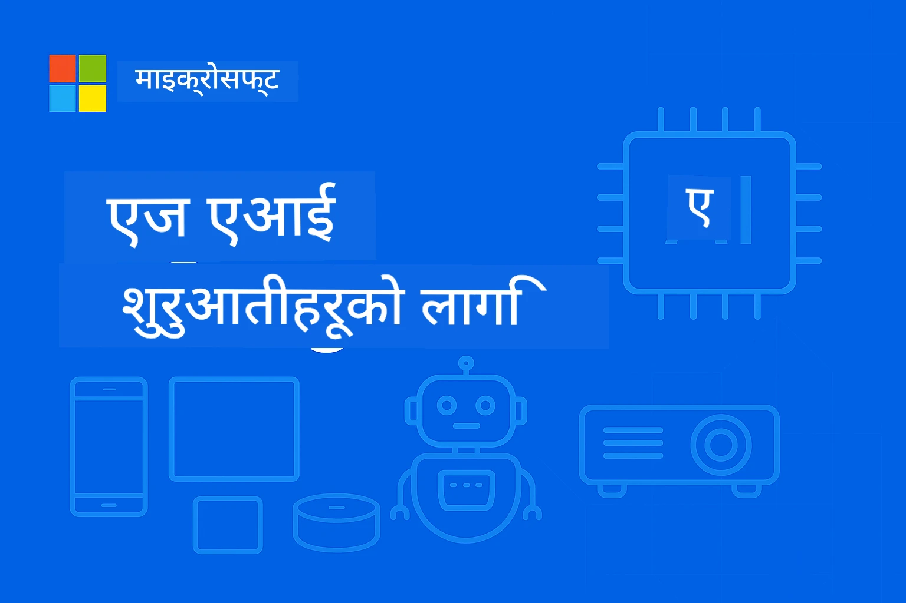

# EdgeAI सुरु गर्नेलाई 




[](https://GitHub.com/microsoft/edgeai-for-beginners/graphs/contributors)
[](https://GitHub.com/microsoft/edgeai-for-beginners/issues)
[](https://GitHub.com/microsoft/edgeai-for-beginners/pulls)
[](http://makeapullrequest.com)

[](https://GitHub.com/microsoft/edgeai-for-beginners/watchers)
[](https://GitHub.com/microsoft/edgeai-for-beginners/fork)
[](https://GitHub.com/microsoft/edgeai-for-beginners/stargazers)


[](https://discord.gg/nTYy5BXMWG)

यी स्रोतहरू प्रयोग गर्न सुरु गर्न यी चरणहरू पालना गर्नुहोस्:

1. **प्रतिलिपि बनाउनुहोस्**: क्लिक गर्नुहोस् [](https://GitHub.com/microsoft/edgeai-for-beginners/fork)
2. **प्रतिलिपि डाउनलोड गर्नुहोस्**:   `git clone https://github.com/microsoft/edgeai-for-beginners.git`
3. [**Azure AI Foundry Discord मा सामेल हुनुहोस् र विशेषज्ञ तथा साथी विकासकर्ताहरूसँग भेट्नुहोस्**](https://discord.com/invite/ByRwuEEgH4)


### 🌐 बहुभाषी समर्थन

#### GitHub Action मार्फत समर्थित (स्वचालित र सधैं अद्यावधिक)

<!-- CO-OP TRANSLATOR LANGUAGES TABLE START -->
[Arabic](../ar/README.md) | [Bengali](../bn/README.md) | [Bulgarian](../bg/README.md) | [Burmese (Myanmar)](../my/README.md) | [Chinese (Simplified)](../zh-CN/README.md) | [Chinese (Traditional, Hong Kong)](../zh-HK/README.md) | [Chinese (Traditional, Macau)](../zh-MO/README.md) | [Chinese (Traditional, Taiwan)](../zh-TW/README.md) | [Croatian](../hr/README.md) | [Czech](../cs/README.md) | [Danish](../da/README.md) | [Dutch](../nl/README.md) | [Estonian](../et/README.md) | [Finnish](../fi/README.md) | [French](../fr/README.md) | [German](../de/README.md) | [Greek](../el/README.md) | [Hebrew](../he/README.md) | [Hindi](../hi/README.md) | [Hungarian](../hu/README.md) | [Indonesian](../id/README.md) | [Italian](../it/README.md) | [Japanese](../ja/README.md) | [Kannada](../kn/README.md) | [Korean](../ko/README.md) | [Lithuanian](../lt/README.md) | [Malay](../ms/README.md) | [Malayalam](../ml/README.md) | [Marathi](../mr/README.md) | [Nepali](./README.md) | [Nigerian Pidgin](../pcm/README.md) | [Norwegian](../no/README.md) | [Persian (Farsi)](../fa/README.md) | [Polish](../pl/README.md) | [Portuguese (Brazil)](../pt-BR/README.md) | [Portuguese (Portugal)](../pt-PT/README.md) | [Punjabi (Gurmukhi)](../pa/README.md) | [Romanian](../ro/README.md) | [Russian](../ru/README.md) | [Serbian (Cyrillic)](../sr/README.md) | [Slovak](../sk/README.md) | [Slovenian](../sl/README.md) | [Spanish](../es/README.md) | [Swahili](../sw/README.md) | [Swedish](../sv/README.md) | [Tagalog (Filipino)](../tl/README.md) | [Tamil](../ta/README.md) | [Telugu](../te/README.md) | [Thai](../th/README.md) | [Turkish](../tr/README.md) | [Ukrainian](../uk/README.md) | [Urdu](../ur/README.md) | [Vietnamese](../vi/README.md)

> **स्थानीय रूपमा क्लोन गर्न चाहनुहुन्छ?**

> यस रिपोजिटरीमा ५० भन्दा बढी भाषाहरूको अनुवादहरू समावेश छन् जसले डाउनलोड साइजलाई निकै बढाउँछ। अनुवादहरू बिना क्लोन गर्न, sparse checkout प्रयोग गर्नुहोस्:
> ```bash
> git clone --filter=blob:none --sparse https://github.com/microsoft/edgeai-for-beginners.git
> cd edgeai-for-beginners
> git sparse-checkout set --no-cone '/*' '!translations' '!translated_images'
> ```
> यसले तपाईंलाई कोर्स पूरा गर्न आवश्यक सबै सामग्री छिटो डाउनलोड गर्न सहयोग पुर्‍याउँछ।
<!-- CO-OP TRANSLATOR LANGUAGES TABLE END -->

**यदि थप अनुवाद भाषाहरू समर्थन गर्न चाहनुहुन्छ भने [यहाँ](https://github.com/Azure/co-op-translator/blob/main/getting_started/supported-languages.md) सूचीकृत छन्।**
## परिचय

**EdgeAI for Beginners** मा स्वागत छ – तपाईँको विस्तृत यात्रा Edge कृत्रिम बौद्धिकताको रुपान्तरणशील संसारमा। यो कोर्स शक्तिशाली AI क्षमताहरू र व्यावहारिक, वास्तविक संसारमा एज उपकरणहरूमा तैनाथीकरणबीचको दूरीलाई पुरा गर्दछ, तपाईँलाई डेटा उत्पादन हुने ठाउँमा नै सिधै AI को संभावनालाई उपयोग गर्न सशक्त बनाउँछ।

### तपाईंले के सिक्नुहुनेछ

यो कोर्स आधारभूत अवधारणाहरूबाट उत्पादन-तयार कार्यान्वयनहरूसम्म लैजान्छ, समेट्दै:
- **एज तैनाथीकरणको लागि अनुकूलित साना भाषा मोडेलहरू (SLMs)**
- **विविध प्लेटफर्महरूमा हार्डवेयर-जागरुक अनुकूलन**
- **गोपनीयता-सुरक्षित क्षमता सहित वास्तविक-समय अनुमानों**
- **उद्यम अनुप्रयोगहरूको लागि उत्पादन तैनाथीरण रणनीतिहरू**

### किन EdgeAI महत्वपूर्ण छ

Edge AI एक नवीन अवधारणा हो जसले आधुनिक चुनौतीहरू समाधान गर्दछ:
- **गोपनीयता र सुरक्षा**: संवेदनशील डेटा स्थानीय रूपमा प्रक्रिया गर्नुहोस्, क्लाउडमा नपठाई
- **वास्तविक-समय प्रदर्शन**: समय-महत्त्वपूर्ण अनुप्रयोगहरूसँग नेटवर्क ढिलाइ हटाउनुहोस्
- **लागत कुशलता**: ब्यान्डविड्थ र क्लाउड कम्प्युटिङ खर्च घटाउनुहोस्
- **दृढ सञ्चालन**: नेटवर्क अवरोध पर्दा समेत कार्यक्षमता कायम राख्नुहोस्
- **नियमितता अनुपालन**: डेटा सार्वभौमिकताको आवश्यकताहरू पूरा गर्नुहोस्

### Edge AI के हो

Edge AI ले AI एल्गोरिदमहरू र भाषा मोडेलहरूलाई स्थानीय रुपमा हार्डवेयरमा सञ्चालन गर्ने जनाउँछ, जहाँ डेटा उत्पन्न हुन्छ त्यहीं नजिक, क्लाउड स्रोतहरूमा निर्भर नहुनु। यसले ढिलाइ कम गर्छ, गोपनीयता बढाउँछ, र वास्तविक-समय निर्णय लिन सक्षम बनाउँछ।

### प्रमुख सिद्धान्तहरू:
- **एज उपकरणमा निष्कर्षण**: AI मोडेलहरू एज उपकरणहरू (फोन, राउटर, माइक्रोकन्ट्रोलर, औद्योगिक PC) मा चल्छन्
- **अफलाइन क्षमता**: निरन्तर इन्टरनेट जडान बिना कार्य चल्ने
- **कम ढिलाइ**: वास्तविक-समय प्रणालीहरूका लागि तत्पर प्रतिक्रिया
- **डेटा सार्वभौमिकता**: संवेदनशील डेटा स्थानीय राख्ने, सुरक्षा र अनुपालन सुधार्ने

### साना भाषा मोडेलहरू (SLMs)

Phi-4, Mistral-7B, र Gemma जस्ता SLM हरू ठूला LLM हरूको अनुकूलित संस्करणहरू हुन् - प्रशिक्षित वा सघन गरिएको, जसले:
- **कम मेमोरी खपत**: सीमित एज उपकरणको मेमोरी कुशल प्रयोग
- **कम कम्प्युट आवश्यकताहरू**: CPU र एज GPU प्रदर्शनका लागि अनुकूलित
- **छिटो सुरु समय**: सहज प्रतिक्रिया दिने अनुप्रयोगहरूको लागि द्रुत पहल

यीले शक्तिशाली NLP क्षमता प्रदान गर्छन् र यी सीमाहरू पूरा गर्छन्:
- **एम्बेडेड प्रणालीहरू**: IoT उपकरण र औद्योगिक कन्ट्रोलरहरू
- **मोबाइल उपकरणहरू**: स्मार्टफोन र ट्याब्लेटहरू सहित अफलाइन क्षमता
- **IoT उपकरणहरू**: सीमित स्रोत भएका सेन्सर र स्मार्ट उपकरणहरू
- **एज सर्भरहरू**: सीमित GPU स्रोत भएका स्थानीय प्रशोधन उपकरणहरू
- **व्यक्तिगत कम्प्युटरहरू**: डेस्कटप र ल्यापटप तैनाथीकरण

## कोर्स मोड्युलहरू & नेभिगेसन

| मोड्युल | विषय | फोकस क्षेत्र | मुख्य सामग्री | स्तर | अवधि |
|--------|-------|------------|-------------|--------|----------|
| [📖 00 ](./introduction.md) | [EdgeAI परिचय](./introduction.md) | आधार र सन्दर्भ | EdgeAI अवलोकन • उद्योग अनुप्रयोगहरू • SLM परिचय • सिकाइ लक्ष्यहरू | सुरु गर्ने | 1-2 घण्टा |
| [📚 01](../../Module01) | [EdgeAI आधारभूत कुरा](./Module01/README.md) | क्लाउड र एज AI तुलना | EdgeAI आधारभूत कुरा • वास्तविक विश्व केस अध्ययन • कार्यान्वयन मार्गदर्शन • एज तैनाथीकरण | सुरु गर्ने | 3-4 घण्टा |
| [🧠 02](../../Module02) | [SLM मोडेल आधारहरू](./Module02/README.md) | मोडेल परिवार र वास्तुकला | Phi परिवार • Qwen परिवार • Gemma परिवार • BitNET • μModel • Phi-Silica | सुरु गर्ने | 4-5 घण्टा |
| [🚀 03](../../Module03) | [SLM तैनाथीकरण अभ्यास](./Module03/README.md) | स्थानीय र क्लाउड तैनाथीकरण | उन्नत सिकाइ • स्थानीय वातावरण • क्लाउड तैनाथीकरण | मध्यम | 4-5 घण्टा |
| [⚙️ 04](../../Module04) | [मोडेल अनुकूलन उपकरण](./Module04/README.md) | क्रस-प्लेटफर्म अनुकूलन | परिचय • Llama.cpp • Microsoft Olive • OpenVINO • Apple MLX • कार्य प्रवाह संश्लेषण | मध्यम | 5-6 घण्टा |
| [🔧 05](../../Module05) | [SLMOps उत्पादन](./Module05/README.md) | उत्पादन सञ्चालन | SLMOps परिचय • मोडेल सघनकरण • फाइन-ट्यूनिङ • उत्पादन तैनाथीकरण | उन्नत | 5-6 घण्टा |
| [🤖 06](../../Module06) | [AI एजेन्ट र फंक्शन कलिङ्](./Module06/README.md) | एजेन्ट फ्रेमवर्क र MCP | एजेन्ट परिचय • फंक्शन कलिङ् • मोडेल सन्दर्भ प्रोटोकल | उन्नत | 4-5 घण्टा |
| [💻 07](../../Module07) | [प्लेटफर्म कार्यान्वयन](./Module07/README.md) | क्रस-प्लेटफर्म नमूनाहरू | AI उपकरण • Foundry Local • Windows विकास | उन्नत | 3-4 घण्टा |
| [🏭 08](../../Module08) | [Foundry Local उपकरण](./Module08/README.md) | उत्पादन-तयार नमूनाहरू | नमूना अनुप्रयोगहरू (तल विवरण हेर्नुहोस्) | विशेषज्ञ | 8-10 घण्टा |

### 🏭 **मोड्युल ०८: नमूना अनुप्रयोगहरू**

- [०१: REST चैट क्विकस्टार्ट](./Module08/samples/01/README.md)
- [०२: OpenAI SDK एकीकरण](./Module08/samples/02/README.md)
- [०३: मोडेल खोज र बेंचमार्किङ्](./Module08/samples/03/README.md)
- [०४: Chainlit RAG अनुप्रयोग](./Module08/samples/04/README.md)
- [०५: मल्टि-एजेन्ट समन्वय](./Module08/samples/05/README.md)
- [०६: मोडेल-ए-टूल्स राउटर](./Module08/samples/06/README.md)
- [०७: प्रत्यक्ष API क्लाइन्ट](./Module08/samples/07/README.md)
- [०८: Windows 11 चैट एप](./Module08/samples/08/README.md)
- [०९: उन्नत मल्टि-एजेन्ट प्रणाली](./Module08/samples/09/README.md)
- [१०: Foundry उपकरण फ्रेमवर्क](./Module08/samples/10/README.md)

### 🎓 **कार्यशाला: व्यावहारिक सिकाइ मार्ग**

उत्पादन-तयार कार्यान्वयनसहित व्यापक व्यावहारिक कार्यशाला सामग्री:

- **[कार्यशाला मार्गदर्शक](./Workshop/Readme.md)** - पूरा सिकाइ लक्ष्यहरू, परिणामहरू, र स्रोत नेभिगेसन
- **Python नमूनाहरू** (६ सत्रहरू) - राम्रो अभ्यास, त्रुटि सम्हाल्ने, र पूर्ण कागजातसहित अपडेट गरिएको
- **Jupyter नोटबुकहरू** (८ अन्तरक्रियात्मक) - चरण-बद्ध ट्यूटोरियलहरू, बेंचमार्कहरू र प्रदर्शन अनुगमन सहित
- **सत्र मार्गदर्शकहरू** - प्रत्येक कार्यशाला सत्रको विस्तृत मार्कडाउन मार्गदर्शक
- **प्रमाणीकरण उपकरणहरू** - कोड गुणस्तर जाँच्न र स्मोक टेस्टहरू चलाउन स्क्रिप्टहरू

**तपाईँले के बनाउनुहुनेछ:**
- स्ट्रिमिङ समर्थनसहित स्थानीय AI चैट एपहरू
- गुणस्तर मूल्याङ्कनसहित RAG पाइपलाइनहरू (RAGAS)
- बहु-मोडेल बेंचमार्किङ् र तुलना उपकरणहरू
- बहु-एजेन्ट समन्वय प्रणालीहरू
- कार्य-आधारित चयनसहित बुद्धिमान मोडेल राउटिङ

### 🎙️ **एजेन्टिकका लागि कार्यशाला: व्यावहारिक - AI पोड्कास्ट स्टुडियो**

शून्यबाट AI-सञ्चालित पोडकास्ट उत्पादन पाइपलाइन निर्माण गर्नुहोस्! यो गहिरो कार्यशालाले तपाईँलाई बहु-एजेन्ट प्रणाली बनाउन सिकाउँछ जुन विचारहरूलाई व्यावसायिक पोडकास्ट एपिसोडहरूमा रूपान्तरण गर्छ।
**[🎬 AI पोडकास्ट स्टुडियो कार्यशाला सुरु गर्नुहोस्](./WorkshopForAgentic/README.md)**

**तपाईको मिशन**: "Future Bytes" सुरु गर्नुहोस् — एक प्राविधिक पोडकास्ट जुन पूर्णरूपले तपाईँले आफैं निर्माण गर्ने AI एजेन्टहरूले चलाउनेछन्। कुनै क्लाउड निर्भरता छैन, कुनै API लागत छैन — सबै कुरा तपाईँको मेसिनमा लोकल रूपमा चल्छ।

**के यसलाई अनौठो बनाउँछ:**
- **🤖 वास्तविक बहु-एजेन्ट समन्वय** - विशेषज्ञ AI एजेन्टहरू बनाउनुहोस् जो अनुसन्धान, लेखन, र अडियो उत्पादन गर्छन्
- **🎯 पूर्ण उत्पादन पाइपलाइन** - विषय चयनदेखि अन्तिम पोडकास्ट अडियो उत्पादनसम्म
- **💻 १००% लोकल डिप्लोयमेन्ट** - पूर्ण गोपनीयता र नियन्त्रणको लागि Ollama र स्थानीय मोडेलहरू (Qwen-3-8B) प्रयोग गर्दछ
- **🎤 टेक्स्ट-टु-स्पीच एकीकरण** - स्क्रिप्टलाई प्राकृतिक आवाज भएका बहु-भोक्ताहरूको संवादमा रूपान्तरण गर्नुहोस्
- **✋ मानव-इन-द-लूप कार्यप्रवाहहरू** - स्वीकृति गेटहरूले गुणस्तर सुनिश्चित गर्दछन् र स्वचालितता कायम राख्छन्

**त्रि-अङ्कनै सिकाइ यात्रा:**

| अङ्क | फोकस | मुख्य सीपहरू | अवधि |
|-----|-------|------------|----------|
| **[अङ्क १: आफ्नो AI सहायकहरूलाई चिनौं](./WorkshopForAgentic/md/01.BuildAIAgentWithSLM.md)** | आफ्नो पहिलो AI एजेन्ट बनाउनुहोस् | उपकरण एकीकरण • वेब खोज • समस्या समाधान • एजेन्टिक तर्क | २-३ घण्टा |
| **[अङ्क २: आफ्नो उत्पादन टोली जुटाउनुहोस्](./WorkshopForAgentic/md/02.AIAgentOrchestrationAndWorkflows.md)** | बहु एजेन्टहरू समन्वय गर्नुहोस् | टोली समन्वय • स्वीकृति कार्यप्रवाहहरू • DevUI इन्टरफेस • मानव निरीक्षण | ३-४ घण्टा |
| **[अङ्क ३: आफ्नो पोडकास्टलाई जीवित बनाउनुहोस्](./WorkshopForAgentic/md/03.Multi-SpeakerPodcastGenerationWithVibeVoice.md)** | पोडकास्ट अडियो उत्पादन गर्नुहोस् | टेक्स्ट-टु-स्पीच • बहु-भोक्ता संश्लेषण • लामो स्वरूप अडियो • पूर्ण स्वचालन | २-३ घण्टा |

**प्रयोग गरिएका प्रविधिहरू:**
- **Microsoft Agent Framework** - बहु-एजेन्ट समन्वय र समन्वय
- **Ollama** - स्थानीय AI मोडेल रनटाइम (क्लाउड आवश्यक छैन)
- **Qwen-3-8B** - एजेन्टिक कार्यहरूको लागि अनुकूलित खुला स्रोत भाषा मोडेल
- **टेक्स्ट-टु-स्पीच APIहरू** - पोडकास्ट उत्पादनका लागि प्राकृतिक आवाज संश्लेषण

**हार्डवेयर समर्थन:**
- ✅ **CPU मोड** - कुनै पनि आधुनिक कम्प्युटरमा काम गर्छ (८GB+ RAM सिफारिस)
- 🚀 **GPU एकसेलरेशन** - NVIDIA/AMD GPUहरूको साथ उल्लेखनीय छिटो निष्पादन
- ⚡ **NPU समर्थन** - नयाँ पुस्ताको न्यूरल प्रोसेसिङ युनिट एकसेलरेशन

**पर्फेक्ट लागि:**
- बहु-एजेन्ट AI प्रणालीहरू सिक्ने विकासकर्ताहरू
- AI स्वचालन र कार्यप्रवाहहरूमा रुचि राख्ने जो कोही
- AI-सहायता उत्पादनमा अनुसन्धान गर्ने सामग्री सिर्जनाकर्ताहरू
- व्यावहारिक AI समन्वय ढाँचाहरू अध्ययन गरिरहेका विद्यार्थीहरू

**बनाउन सुरु गर्नुहोस्**: [🎙️ AI पोडकास्ट स्टुडियो कार्यशाला →](./WorkshopForAgentic/README.md)

### 📊 **सिकाइ मार्ग सारांश**
- **कूल अवधि**: ३६-४५ घण्टा
- **शुरुवाती मार्ग**: मोड्युलहरू ०१-०२ (७-९ घण्टा)  
- **मध्यम मार्ग**: मोड्युलहरू ०३-०४ (९-११ घण्टा)
- **उन्नत मार्ग**: मोड्युलहरू ०५-०७ (१२-१५ घण्टा)
- **विशेषज्ञ मार्ग**: मोड्युल ०८ (८-१० घण्टा)

## तपाईँले बनाउने कुरा

### 🎯 मुख्य दक्षताहरू
- **एज AI वास्तुकला**: स्थानीय-प्रथम AI प्रणालीहरू डिजाइन गर्नुहोस् क्लाउड एकीकरणसहित
- **मोडेल अनुकूलन**: एज तैनातीको लागि मोडेलहरू क्वान्टाइज र कम्प्रेस गर्नुहोस् (८५% गति वृद्धि, ७५% साइज कमी)
- **बहु-प्लाटफर्म तैनाती**: विन्डोज, मोबाइल, एम्बेडेड, र क्लाउड-एज हाइब्रिड प्रणालीहरू
- **उत्पादन सञ्चालन**: एज AI को मनिटरिङ, स्केलिङ, र मर्मतसम्भार

### 🏗️ व्यावहारिक परियोजनाहरू
- **Foundry स्थानीय च्याट एपहरू**: मोडेल स्विचिङ सहित विन्डोज ११ नेटिभ एप्लिकेशन
- **बहु-एजेन्ट प्रणालीहरू**: जटिल कार्यप्रवाहहरूको लागि समन्वयक र विशेषज्ञ एजेन्टहरू  
- **RAG एपहरू**: स्थानीय कागजात प्रशोधन सम्पूर्ण वेक्टर खोजसहित
- **मोडेल राउटरहरू**: कार्य विश्लेषणमा आधारित मोडेलहरू बीच बुद्धिमानी चयन
- **API फ्रेमवर्कहरू**: स्ट्रिमिङ र स्वास्थ्य मनिटरिङसहित उत्पादन-तयार क्लाइएन्टहरू
- **क्रस-प्लाटफर्म उपकरणहरू**: LangChain/Semantic Kernel एकीकरण ढाँचाहरू

### 🏢 उद्योग अनुप्रयोगहरू
**निर्माण** • **स्वास्थ्य सेवा** • **स्वायत्त सवारीहरू** • **स्मार्ट शहरहरू** • **मोबाइल एपहरू**

## छिटो सुरु गर्नुहोस्

**सिफारिस गरिने सिकाइ मार्ग** (कूल २०-३० घण्टा):

0. **📖 परिचय** ([Introduction.md](./introduction.md)): EdgeAI आधार + उद्योग सन्दर्भ + सिकाइ फ्रेमवर्क
1. **📚 आधार** (मोड्युल ०१-०२): EdgeAI अवधारणाहरू + SLM मोडेल परिवारहरू
2. **⚙️ अनुकूलन** (मोड्युल ०३-०४): तैनाती + क्वान्टाइजेसन फ्रेमवर्कहरू  
3. **🚀 उत्पादन** (मोड्युल ०५-०६): SLMOps + AI एजेन्टहरू + फङ्क्शन कलिङ
4. **💻 कार्यान्वयन** (मोड्युल ०७-०८): प्लेटफर्म नमूनाहरू + Foundry लोकल टूलकिट

हरेक मोड्युलमा सैद्धान्तिक ज्ञान, व्यवहारिक अभ्यास, र उत्पादन-तयार कोड नमूनाहरू समावेश छन्।

## करियर प्रभाव

**प्राविधिक भूमिकाहरू**: EdgeAI समाधान वास्तुविद् • ML इन्जिनियर (एज) • IoT AI विकासकर्ता • मोबाइल AI विकासकर्ता

**उद्योग क्षेत्रहरू**: निर्माण ४.० • स्वास्थ्य प्रविधि • स्वायत्त प्रणालीहरू • फिनटेक • उपभोक्ता इलेक्ट्रोनिक्स

**पोर्टफोलियो परियोजनाहरू**: बहु-एजेन्ट प्रणालीहरू • उत्पादन RAG एपहरू • क्रस-प्लाटफर्म तैनाती • प्रदर्शन अनुकूलन

## रिपोजिटोरी संरचना

```
edgeai-for-beginners/
├── 📖 introduction.md  # Foundation: EdgeAI Overview & Learning Framework
├── 📚 Module01-04/     # Fundamentals → SLMs → Deployment → Optimization  
├── 🔧 Module05-06/     # SLMOps → AI Agents → Function Calling
├── 💻 Module07/        # Platform Samples (VS Code, Windows, Jetson, Mobile)
├── 🏭 Module08/        # Foundry Local Toolkit + 10 Comprehensive Samples
│   ├── samples/01-06/  # Foundation: REST, SDK, RAG, Agents, Routing
│   └── samples/07-10/  # Advanced: API Client, Windows App, Enterprise Agents, Tools
├── 🌐 translations/    # Multi-language support (8+ languages)
└── 📋 STUDY_GUIDE.md   # Structured learning paths & time allocation
```

## पाठ्यक्रम मुख्य बुँदाहरू

✅ **प्रगतिशील सिकाइ**: सैद्धान्तिक → व्यवहारिक → उत्पादन तैनाती  
✅ **वास्तविक केस अध्ययनहरू**: माइक्रोसफ्ट, जापान एयरलाइन्स, उद्यम कार्यान्वयनहरू  
✅ **हात-कलम नमूनाहरू**: ५०+ उदाहरणहरू, १० व्यापक Foundry Local डेमोहरू  
✅ **प्रस्तुतीकरण केन्द्रित**: ८५% गतिको सुधार, ७५% स्थान घटाउने  
✅ **बहु-प्लाटफर्म**: विन्डोज, मोबाइल, एम्बेडेड, क्लाउड-एज हाइब्रिड  
✅ **उत्पादन तयार**: मोनिटरिङ, स्केलिङ, सुरक्षा, अनुपालन फ्रेमवर्कहरू

📖 **[अध्ययन मार्गदर्शक उपलब्ध](STUDY_GUIDE.md)**: समय आवंटन निर्देशन र आत्म-मूल्याङ्कन उपकरणहरूको साथ संरचित २०-घण्टे सिकाइ मार्ग।

---

**EdgeAI AI तैनातीको भविष्य हो**: स्थानीय-प्रथम, गोपनीयता संरक्षण गर्ने, र दक्ष। यी सीपहरूमा निपुण बन्नुहोस् र बुद्धिमान अनुप्रयोगहरूको अर्को पुस्ता निर्माण गर्नुहोस्।

## अन्य पाठ्यक्रमहरू

हाम्रो टोलीले अन्य पाठ्यक्रमहरू उत्पादन गर्छ! हेर्नुहोस्:

<!-- CO-OP TRANSLATOR OTHER COURSES START -->
### LangChain
[](https://aka.ms/langchain4j-for-beginners)
[](https://aka.ms/langchainjs-for-beginners?WT.mc_id=m365-94501-dwahlin)

---

### Azure / Edge / MCP / Agents
[](https://github.com/microsoft/AZD-for-beginners?WT.mc_id=academic-105485-koreyst)
[](https://github.com/microsoft/edgeai-for-beginners?WT.mc_id=academic-105485-koreyst)
[](https://github.com/microsoft/mcp-for-beginners?WT.mc_id=academic-105485-koreyst)
[](https://github.com/microsoft/ai-agents-for-beginners?WT.mc_id=academic-105485-koreyst)

---
 
### Generative AI Series
[](https://github.com/microsoft/generative-ai-for-beginners?WT.mc_id=academic-105485-koreyst)
[-9333EA?style=for-the-badge&labelColor=E5E7EB&color=9333EA)](https://github.com/microsoft/Generative-AI-for-beginners-dotnet?WT.mc_id=academic-105485-koreyst)
[-C084FC?style=for-the-badge&labelColor=E5E7EB&color=C084FC)](https://github.com/microsoft/generative-ai-for-beginners-java?WT.mc_id=academic-105485-koreyst)
[-E879F9?style=for-the-badge&labelColor=E5E7EB&color=E879F9)](https://github.com/microsoft/generative-ai-with-javascript?WT.mc_id=academic-105485-koreyst)

---
 
### Core Learning
[](https://aka.ms/ml-beginners?WT.mc_id=academic-105485-koreyst)
[](https://aka.ms/datascience-beginners?WT.mc_id=academic-105485-koreyst)
[](https://aka.ms/ai-beginners?WT.mc_id=academic-105485-koreyst)
[](https://github.com/microsoft/Security-101?WT.mc_id=academic-96948-sayoung)
[](https://aka.ms/webdev-beginners?WT.mc_id=academic-105485-koreyst)
[](https://aka.ms/iot-beginners?WT.mc_id=academic-105485-koreyst)
[](https://github.com/microsoft/xr-development-for-beginners?WT.mc_id=academic-105485-koreyst)

---
 
### Copilot Series
[](https://aka.ms/GitHubCopilotAI?WT.mc_id=academic-105485-koreyst)
[](https://github.com/microsoft/mastering-github-copilot-for-dotnet-csharp-developers?WT.mc_id=academic-105485-koreyst)
[](https://github.com/microsoft/CopilotAdventures?WT.mc_id=academic-105485-koreyst)
<!-- CO-OP TRANSLATOR OTHER COURSES END -->

## सहयोग प्राप्त गर्ने

यदि तपाईं अड्किनुभयो वा AI अनुप्रयोगहरू निर्माण गर्दा कुनै प्रश्न छ भने, सामेल हुनुहोस्:

[](https://discord.gg/nTYy5BXMWG)

यदि तपाईंलाई उत्पादन प्रतिक्रियाहरु वा त्रुटिहरु छन् भने दौर्जन गर्दा यहाँ जानुहोस्:

[](https://aka.ms/foundry/forum)

---

<!-- CO-OP TRANSLATOR DISCLAIMER START -->
**अस्वीकरण**:  
यस दस्तावेजलाई AI अनुवाद सेवा [Co-op Translator](https://github.com/Azure/co-op-translator) प्रयोग गरी अनुवाद गरिएको हो। हामी शुद्धताका लागि प्रयासरत छौँ, तर कृपया ध्यान दिनुहोस् कि स्वचालित अनुवादमा त्रुटिहरू वा अशुद्धता हुन सक्दछ। मूल दस्तावेज आफ्नो स्वदेशी भाषामा अधिकृत स्रोतको रूपमा लिनुपर्छ। महत्वपूर्ण सूचनाको लागि व्यावसायिक मानव अनुवाद सिफारिस गरिन्छ। यस अनुवादको प्रयोगबाट उत्पन्न हुने कुनै पनि गलतफहमी वा गलत व्याख्याहरूको लागि हामी जिम्मेवार छैनौं।
<!-- CO-OP TRANSLATOR DISCLAIMER END -->