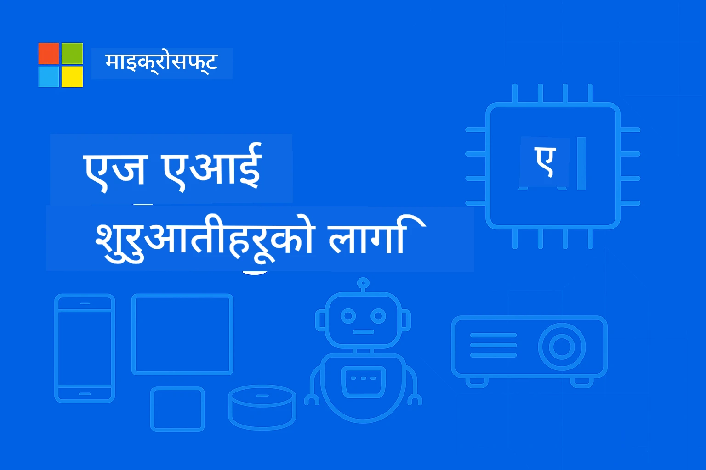

# EdgeAI for Beginners 




[](https://GitHub.com/microsoft/edgeai-for-beginners/graphs/contributors)
[](https://GitHub.com/microsoft/edgeai-for-beginners/issues)
[](https://GitHub.com/microsoft/edgeai-for-beginners/pulls)
[](http://makeapullrequest.com)

[](https://GitHub.com/microsoft/edgeai-for-beginners/watchers)
[](https://GitHub.com/microsoft/edgeai-for-beginners/fork)
[](https://GitHub.com/microsoft/edgeai-for-beginners/stargazers)


[](https://discord.gg/nTYy5BXMWG)

Follow these steps to get started using these resources:

1. **Fork the Repository**: Click [](https://GitHub.com/microsoft/edgeai-for-beginners/fork)
2. **Clone the Repository**:   `git clone https://github.com/microsoft/edgeai-for-beginners.git`
3. [**Join The Azure AI Foundry Discord and meet experts and fellow developers**](https://discord.com/invite/ByRwuEEgH4)


### 🌐 Multi-Language Support

#### Supported via GitHub Action (Automated & Always Up-to-Date)

<!-- CO-OP TRANSLATOR LANGUAGES TABLE START -->
[Arabic](../ar/README.md) | [Bengali](../bn/README.md) | [Bulgarian](../bg/README.md) | [Burmese (Myanmar)](../my/README.md) | [Chinese (Simplified)](../zh-CN/README.md) | [Chinese (Traditional, Hong Kong)](../zh-HK/README.md) | [Chinese (Traditional, Macau)](../zh-MO/README.md) | [Chinese (Traditional, Taiwan)](../zh-TW/README.md) | [Croatian](../hr/README.md) | [Czech](../cs/README.md) | [Danish](../da/README.md) | [Dutch](../nl/README.md) | [Estonian](../et/README.md) | [Finnish](../fi/README.md) | [French](../fr/README.md) | [German](../de/README.md) | [Greek](../el/README.md) | [Hebrew](../he/README.md) | [Hindi](../hi/README.md) | [Hungarian](../hu/README.md) | [Indonesian](../id/README.md) | [Italian](../it/README.md) | [Japanese](../ja/README.md) | [Kannada](../kn/README.md) | [Khmer](../km/README.md) | [Korean](../ko/README.md) | [Lithuanian](../lt/README.md) | [Malay](../ms/README.md) | [Malayalam](../ml/README.md) | [Marathi](../mr/README.md) | [Nepali](./README.md) | [Nigerian Pidgin](../pcm/README.md) | [Norwegian](../no/README.md) | [Persian (Farsi)](../fa/README.md) | [Polish](../pl/README.md) | [Portuguese (Brazil)](../pt-BR/README.md) | [Portuguese (Portugal)](../pt-PT/README.md) | [Punjabi (Gurmukhi)](../pa/README.md) | [Romanian](../ro/README.md) | [Russian](../ru/README.md) | [Serbian (Cyrillic)](../sr/README.md) | [Slovak](../sk/README.md) | [Slovenian](../sl/README.md) | [Spanish](../es/README.md) | [Swahili](../sw/README.md) | [Swedish](../sv/README.md) | [Tagalog (Filipino)](../tl/README.md) | [Tamil](../ta/README.md) | [Telugu](../te/README.md) | [Thai](../th/README.md) | [Turkish](../tr/README.md) | [Ukrainian](../uk/README.md) | [Urdu](../ur/README.md) | [Vietnamese](../vi/README.md)

> **Prefer to Clone Locally?**
>
> This repository includes 50+ language translations which significantly increases the download size. To clone without translations, use sparse checkout:
>
> **Bash / macOS / Linux:**
> ```bash
> git clone --filter=blob:none --sparse https://github.com/microsoft/edgeai-for-beginners.git
> cd edgeai-for-beginners
> git sparse-checkout set --no-cone '/*' '!translations' '!translated_images'
> ```
>
> **CMD (Windows):**
> ```cmd
> git clone --filter=blob:none --sparse https://github.com/microsoft/edgeai-for-beginners.git
> cd edgeai-for-beginners
> git sparse-checkout set --no-cone "/*" "!translations" "!translated_images"
> ```
>
> This gives you everything you need to complete the course with a much faster download.
<!-- CO-OP TRANSLATOR LANGUAGES TABLE END -->

**If you wish to have additional translations languages supported are listed [here](https://github.com/Azure/co-op-translator/blob/main/getting_started/supported-languages.md)**
## परिचय

**EdgeAI for Beginners** मा स्वागत छ – एज आर्टिफिसियल इंटेलिजेन्सको रुपान्तरणकारी संसारमा तपाईंको व्यापक यात्रा। यो कोर्सले शक्तिशाली AI क्षमताहरू र एज उपकरणहरूमा व्यवहारिक, वास्तविक-जीवन कार्यान्वयन बीचको अंतरलाई पाट्छ, जसले तपाईंलाई डेटा उत्पन्न हुने र निर्णय लिनु पर्ने ठाउँमै AI को क्षमता प्रयोग गर्न सशक्त बनाउँछ।

### तपाईंले के सिक्नुहुनेछ

यो कोर्सले तपाईंलाई आधारभूत अवधारणाहरूबाट उत्पादन-तैयार कार्यान्वयनसम्म लैजान्छ, जसमा समावेश छन्:
- एज डिप्लोयमेन्टको लागि अनुकूलित **सानो भाषा मोडेलहरू (SLMs)**
- विभिन्न प्लेटफार्महरूको लागि **हार्डवेयर-सचेत अनुकूलन**
- **गोपनीयता सुरक्षित गर्नेहरू साथ रियल-टाइम पूर्वानुमान**
- एन्त्रप्राइज अनुप्रयोगहरूको लागि **उत्पादन डिप्लोयमेन्ट रणनीतिहरू**

### किन EdgeAI महत्वपूर्ण छ

Edge AI एउटा नयाँ सोच हो जसले महत्वपूर्ण आधुनिक चुनौतीहरूलाई सम्बोधन गर्छ:
- **गोपनीयता र सुरक्षा**: संवेदनशील डेटा स्थानीय रूपमा प्रशोधन गर्नुहोस् र क्लाउड पहुँचबाट बच्नुहोस्
- **रियल-टाइम प्रदर्शन**: समय-सम्बन्धी अत्यावश्यक अनुप्रयोगहरूका लागि नेटवर्क ढिलाइ हटाउनुहोस्
- **लागत दक्षता**: ब्यान्डविथ र क्लाउड कम्प्युटिंग खर्च घटाउनुहोस्
- **धैर्यशील सञ्चालनहरू**: नेटवर्क बाधा हुँदा पनि कार्यक्षमता कायम राख्नुहोस्
- **नियमहरू पालन**: डेटा संप्रभुता आवश्यकताहरू पूरा गर्नुहोस्

### Edge AI

Edge AI भनेको AI एल्गोरिदम र भाषा मोडेलहरूलाई हार्डवेयरमा स्थानीय रूपमा चलाउनु हो, जहाँ डेटा उत्पन्न हुन्छ, त्यहाँ नै। यसले क्लाउड स्रोतहरूमा निर्भर नगरी पूर्वानुमान सञ्चालन गर्ने क्षमता दिन्छ। यसले विलम्बता कम गर्छ, गोपनीयता सुधार्छ, र रियल-टाइम निर्णय क्षमता दिन्छ।

### मुख्य सिद्धान्तहरू:
- **डिभाइसमा नै पूर्वानुमान**: AI मोडेलहरू एज उपकरणहरूमा (फोन, राउटर, माइक्रोकन्ट्रोलर, औद्योगिक पीसी) चल्छन्
- **अफलाइन क्षमता**: निरन्तर इन्टरनेट कनेक्टिविटी बिना काम गर्न सक्छ
- **कम विलम्बता**: रियल-टाइम सिस्टमहरूका लागि तुरुन्त प्रतिक्रिया
- **डेटा संप्रभुता**: संवेदनशील डेटा स्थानीय राख्छ, सुरक्षा र नियम पालना सुधार्छ

### साना भाषा मोडेलहरू (SLMs)

Phi-4, Mistral-7B, र Gemma जस्ता SLMs ठूलो LLMs को अनुकूलित संस्करणहरू हुन्—तयार वा संकुचित गरिएको जसले:
- **संस्मृति खपत कम**: सीमित एज डिभाइस मेमोरीको कुशल प्रयोग
- **कम कम्प्युट आवश्यकताहरू**: CPU र एज GPU प्रदर्शनका लागि अनुकूलित
- **ब्राण्ड अप समय छिटो**: प्रतिक्रियाशील अनुप्रयोगहरूको लागि छिटो सुरुवात

यीले शक्तिशाली NLP क्षमता प्रदान गर्छन् र निम्न कुराहरूसँग मेल खान्छन्:
- **एम्बेडेड सिस्टमहरू**: IoT उपकरण र औद्योगिक नियन्त्रकहरू
- **मोबाइल उपकरणहरू**: स्मार्टफोन र ट्याब्लेटहरू जसमा अफलाइन सुविधाहरू छन्
- **IoT उपकरणहरू**: सीमित स्रोत भएका सेन्सर र स्मार्ट उपकरणहरू
- **एज सर्भरहरू**: सीमित GPU संसाधन भएका स्थानीय प्रशोधन युनिटहरू
- **व्यक्तिगत कम्प्युटरहरू**: डेस्कटप र ल्यापटप डिप्लोयमेन्ट परिस्थितिहरू

## कोर्स मोड्युलहरू र नेभिगेसन

| मोड्युल | विषय | केन्द्र बिन्दु | मुख्य सामग्री | स्तर | अवधि |
|--------|-------|------------|-------------|--------|----------|
| [📖 00 ](./introduction.md) | [EdgeAI परिचय](./introduction.md) | आधार र सन्दर्भ | EdgeAI अवलोकन • उद्योग अनुप्रयोगहरू • SLM परिचय • सिकाइ उद्देश्यहरू | सुरु गर्ने | १-२ घण्टा |
| [📚 01](../../Module01) | [EdgeAI आधारभूत सिद्धान्तहरू](./Module01/README.md) | क्लाउड र एज AI तुलना | EdgeAI आधारभूत • वास्तविक संसार केस अध्ययनहरू • कार्यान्वयन गाइड • एज डिप्लोयमेन्ट | सुरु गर्ने | ३-४ घण्टा |
| [🧠 02](../../Module02) | [SLM मोडेल आधारहरू](./Module02/README.md) | मोडेल परिवार र संरचना | Phi परिवार • Qwen परिवार • Gemma परिवार • BitNET • μModel • Phi-Silica | सुरु गर्ने | ४-५ घण्टा |
| [🚀 03](../../Module03) | [SLM डिप्लोयमेन्ट अभ्यास](./Module03/README.md) | स्थानीय र क्लाउड डिप्लोयमेन्ट | उन्नत सिकाइ • स्थानीय वातावरण • क्लाउड डिप्लोयमेन्ट | मध्यम | ४-५ घण्टा |
| [⚙️ 04](../../Module04) | [मोडेल अनुकूलन उपकरण किट](./Module04/README.md) | क्रस-प्लेटफर्म अनुकूलन | परिचय • Llama.cpp • Microsoft Olive • OpenVINO • Apple MLX • Workflow संश्लेषण | मध्यम | ५-६ घण्टा |
| [🔧 05](../../Module05) | [SLMOps उत्पादन](./Module05/README.md) | उत्पादन सञ्चालनहरू | SLMOps परिचय • मोडेल संकुचन • फाइन-ट्यूनिङ • उत्पादन डिप्लोयमेन्ट | उन्नत | ५-६ घण्टा |
| [🤖 06](../../Module06) | [AI एजेन्ट र फंक्शन कलिङ](./Module06/README.md) | एजेन्ट फ्रेमवर्क र MCP | एजेन्ट परिचय • फंक्शन कलिङ • मोडेल सन्दर्भ प्रोटोकल | उन्नत | ४-५ घण्टा |
| [💻 07](../../Module07) | [प्लेटफर्म कार्यान्वयन](./Module07/README.md) | क्रस-प्लेटफर्म नमूना | AI उपकरण किट • फाउन्ड्री लोकल • विन्डोज विकास | उन्नत | ३-४ घण्टा |
| [🏭 08](../../Module08) | [फाउन्ड्री लोकल उपकरण किट](./Module08/README.md) | उत्पादन-तयार नमूना | नमूना अनुप्रयोगहरू (तल विवरण हेर्नुहोस्) | विशेषज्ञ | ८-१० घण्टा |

### 🏭 **मोड्युल ०८: नमूना अनुप्रयोगहरू**

- [०१: REST च्याट क्विकस्टार्ट](./Module08/samples/01/README.md)
- [०२: OpenAI SDK एकीकरण](./Module08/samples/02/README.md)
- [०३: मोडेल डिस्कभरी र बेंचमार्किङ](./Module08/samples/03/README.md)
- [०४: Chainlit RAG अनुप्रयोग](./Module08/samples/04/README.md)
- [०५: बहु एजेन्ट समन्वय](./Module08/samples/05/README.md)
- [०६: मोडेल्स-एज-टुल्स राउटर](./Module08/samples/06/README.md)
- [०७: डाइरेक्ट API क्लाइन्ट](./Module08/samples/07/README.md)
- [०८: विन्डोज ११ च्याट एप](./Module08/samples/08/README.md)
- [०९: उन्नत बहु एजेन्ट प्रणाली](./Module08/samples/09/README.md)
- [१०: फाउन्ड्री टूल्स फ्रेमवर्क](./Module08/samples/10/README.md)

### 🎓 **वर्कशप: व्यावहारिक सिकाइ मार्ग**

व्यावसायिक-तयार कार्यान्वयनसहित व्यापक व्यावहारिक वर्कशप सामग्री:

- **[वर्कशप गाइड](./Workshop/Readme.md)** - पूर्ण सिकाइ उद्देश्यहरू, परिणामहरू, र स्रोत नेभिगेसन
- **पाइथन नमूना** (६ सत्र) - उत्तम अभ्यास, त्रुटि ह्यान्डलिङ, र व्यापक कागजात सहित अद्यावधिक
- **जुपिटर नोटबुकहरू** (८ अन्तरक्रियाशील) - बेंचमार्क र प्रदर्शन अनुगमन सहित चरण-द्वारा-चरण ट्युटोरियलहरू
- **सत्र गाइडहरू** - प्रत्येक वर्कशप सत्रका लागि विस्तृत मार्कडाउन गाइडहरू
- **प्रमाणिकरण उपकरणहरू** - कोड गुणस्तर पुष्टि गर्न र स्मोक परीक्षण चलाउनका लागि स्क्रिप्टहरू

**तपाईंले के बनाउनु हुनेछ:**
- स्ट्रीमिङ समर्थनसहित स्थानीय AI च्याट अनुप्रयोगहरू
- गुणस्तर मूल्याङ्कन (RAGAS) संग RAG पाइपलाइनहरू
- बहु-मोडेल बेंचमार्किङ र तुलना उपकरणहरू
- बहु-एजेन्ट समन्वय प्रणालीहरू
- कार्य-आधारित चयनको साथ बौद्धिक मोडेल राउटिङ

### 🎙️ **एजेन्टिकको लागि वर्कशप: व्यावहारिक - AI पोडकास्ट स्टुडियो**
शून्यबाट AI-सञ्चालित पोडकास्ट उत्पादन पाइपलाइन निर्माण गर्नुहोस्! यो डुबुल्की कार्यशालाले तपाईंलाई एउटा पूर्ण बहु-एजेन्ट प्रणाली सिर्जना गर्न सिकाउँछ जसले विचारहरूलाई व्यावसायिक पोडकास्ट एपिसोडहरूमा रूपान्तरण गर्दछ।

**[🎬 AI पोडकास्ट स्टुडियो कार्यशाला सुरु गर्नुहोस्](./WorkshopForAgentic/README.md)**

**तपाईंको मिशन**: "Future Bytes" सुरु गर्नुहोस् — एक प्रविधि पोडकास्ट जुन पूर्ण रूपमा तपाईंले आफैंले निर्माण गर्ने AI एजेन्टहरूले सञ्चालित छ। कुनै क्लाउड निर्भरता छैन, कुनै API खर्च छैन — सबै तपाईंको मेसिनमा स्थानीय रूपमा चल्छ।

**यो विशेष के बनाउँछ:**
- **🤖 वास्तविक बहु-एजेन्ट व्यवस्थापन** - अनुसन्धान, लेखन, र अडियो उत्पादन गर्ने विशेष AI एजेन्टहरू निर्माण गर्नुहोस्
- **🎯 पूर्ण उत्पादन पाइपलाइन** - विषय चयनदेखि अन्तिम पोडकास्ट अडियो उत्पादनसम्म
- **💻 १००% स्थानीय परिनियोजन** - पूर्ण गोपनीयता र नियन्त्रणका लागि Ollama र स्थानीय मोडेलहरू (Qwen-3-8B) को उपयोग
- **🎤 पाठ-देखि-उत्सव एकीकृतकरण** - स्क्रिप्टहरूलाई प्राकृतिक आवाजमा बहु-प्रवक्ता संवादहरूमा रूपान्तरण गर्नुहोस्
- **✋ मानव-इन-लूप कार्यप्रवाहहरू** - स्वीकृति प्रक्रिया क्वालिटी सुनिश्चित गर्छ जबकि स्वत: संचालन कायम रहन्छ

**तीन-एक्ट सिकाइ यात्रा:**

| एक्ट | ध्यान | मुख्य सिपहरू | अवधि |
|-----|-------|--------------|----------|
| **[एक्ट १: तपाईंका AI सहायकहरूलाई भेट्नुहोस्](./WorkshopForAgentic/md/01.BuildAIAgentWithSLM.md)** | तपाईंको पहिलो AI एजेन्ट बनाउनुहोस् | उपकरण एकीकरण • वेब खोज • समस्या समाधान • एजेन्टिक तर्क | २-३ घण्टा |
| **[एक्ट २: तपाईंको उत्पादन टोली असेंबल गर्नुहोस्](./WorkshopForAgentic/md/02.AIAgentOrchestrationAndWorkflows.md)** | बहु एजेन्टहरू समन्वय गर्नुहोस् | टोली समन्वय • स्वीकृति कार्यप्रवाह • DevUI इन्टरफेस • मानव निगरानी | ३-४ घण्टा |
| **[एक्ट ३: तपाईंको पोडकास्टलाई जीवन्त बनाउनुहोस्](./WorkshopForAgentic/md/03.Multi-SpeakerPodcastGenerationWithVibeVoice.md)** | पोडकास्ट अडियो उत्पादन गर्नुहोस् | पाठ-देखि-उत्सव • बहु-प्रवक्ता संश्लेषण • लामो-रूप अडियो • पूर्ण स्वत: परिचालन | २-३ घण्टा |

**प्रयोग गरिएको प्रविधिहरू:**
- **Microsoft Agent Framework** - बहु-एजेन्ट व्यवस्थापन र समन्वय
- **Ollama** - स्थानीय AI मोडेल रनटाइम (क्लाउड आवश्यक छैन)
- **Qwen-3-8B** - एजेन्टिक कार्यहरूको लागि अनुकूलित खुला स्रोत भाषा मोडेल
- **Text-to-Speech APIs** - पोडकास्ट उत्पादनका लागि प्राकृतिक आवाज संश्लेषण

**हार्डवेयर समर्थन:**
- ✅ **CPU मोड** - कुनै पनि आधुनिक कम्प्युटरमा काम गर्छ (८GB+ RAM सिफारिस गरिएको)
- 🚀 **GPU एक्सेलेरेसन** - NVIDIA/AMD GPU हरूसँग उल्लेखनीय छिटो एनफेरेन्स
- ⚡ **NPU समर्थन** - अर्को पुस्ताको न्यूरल प्रोसेसिङ युनिट एक्सेलेरेसन

**उपयुक्त छ:**
- बहु-एजेन्ट AI प्रणाली सिक्न चाहने विकासकर्ताहरू
- AI स्वचालन र कार्यप्रवाहहरूमा रुचि राख्ने जुनसुकै व्यक्ति
- AI-सहायता प्राप्त उत्पादनमा रुचि राख्ने सामग्री सिर्जनाकर्ताहरू
- व्यावहारिक AI व्यवस्थापन ढाँचाहरू अध्ययन गर्ने विद्यार्थीहरू

**निर्माण सुरु गर्नुहोस्**: [🎙️ AI पोडकास्ट स्टुडियो कार्यशाला →](./WorkshopForAgentic/README.md)

### 📊 **सिकाइ मार्ग सारांश**
- **कुल अवधि**: ३६-४५ घण्टा
- **शुरुवाती मार्ग**: मोड्युल ०१-०२ (७-९ घण्टा)  
- **मध्यम मार्ग**: मोड्युल ०३-०४ (९-११ घण्टा)
- **उन्नत मार्ग**: मोड्युल ०५-०७ (१२-१५ घण्टा)
- **विशेषज्ञ मार्ग**: मोड्युल ०८ (८-१० घण्टा)

## तपाईंले के बनाउनुहुनेछ

### 🎯 मुख्य क्षमताहरू
- **एज AI आर्किटेक्चर**: क्लाउड एकीकरणसहित स्थानीय-प्रथम AI प्रणाली डिजाइन
- **मोडेल अप्टिमाइजेसन**: एज परिनियोजनका लागि मोडेल क्वान्टाइज र कम्प्रेस गर्नुहोस् (८५% गति बृद्धि, ७५% आकार कमी)
- **बहु-प्लेटफर्म परिनियोजन**: विन्डोज, मोबाइल, इम्बेडेड, र क्लाउड-एज हाइब्रिड प्रणालीहरू
- **उत्पादन सञ्चालनहरू**: उत्पादनमा एज AI को निगरानी, स्केलिङ, र मर्मत

### 🏗️ व्यावहारिक परियोजनाहरू
- **Foundry स्थानीय च्याट एपहरू**: मोडेल स्विचिङसहित विन्डोज ११ नेटिभ एप्लिकेसन
- **बहु-एजेन्ट प्रणालीहरू**: जटिल कार्यप्रवाहका लागि विशेषज्ञ एजेन्टहरू सहित समन्वयकर्ता  
- **RAG एप्स**: स्थानीय दस्तावेज प्रशोधन र भेक्टर खोज
- **मोडेल राउटरहरू**: कार्य विश्लेषणको आधारमा मोडेलहरूको चयन
- **API फ्रेमवर्कहरू**: स्ट्रिमिङ र स्वास्थ्य निगरानी सहित उत्पादन-तयार क्लाइन्टहरू
- **क्रस-प्लेटफर्म टूलहरू**: LangChain/Semantic Kernel एकीकरण ढाँचाहरू

### 🏢 उद्योग अनुप्रयोगहरू
**निर्माण** • **स्वास्थ्य सेवा** • **स्वायत्त वाहनहरू** • **स्मार्ट सिटीज** • **मोबाइल एप्स**

## छिटो सुरु

**सिफारिस गरिएको सिकाइ मार्ग** (कुल २०-३० घण्टा):

०. **📖 परिचय** ([Introduction.md](./introduction.md)): EdgeAI आधार + उद्योग सन्दर्भ + सिकाइ ढाँचा  
१. **📚 आधार** (मोड्युल ०१-०२): EdgeAI अवधारणाहरू + SLM मोडेल परिवारहरू  
२. **⚙️ अप्टिमाइजेसन** (मोड्युल ०३-०४): परिनियोजन + क्वान्टाइजेसन फ्रेमवर्कहरू  
३. **🚀 उत्पादन** (मोड्युल ०५-०६): SLMOps + AI एजेन्टहरू + फंक्शन कलिंग  
४. **💻 कार्यान्वयन** (मोड्युल ०७-०८): प्लेटफर्म नमूनाहरू + Foundry स्थानीय टूलकिट

प्रत्येक मोड्युलमा सिद्धान्त, व्यावहारिक अभ्यासहरू, र उत्पादन-तयार कोड नमूनाहरू समाविष्ट छन्।

## करियर प्रभाव

**प्राविधिक भूमिकाहरू**: EdgeAI सोलुसन आर्किटेक्ट • ML इन्जिनियर (एज) • IoT AI विकासकर्ता • मोबाइल AI विकासकर्ता

**उद्योग क्षेत्रहरू**: निर्माण ४.० • स्वास्थ्य प्रविधि • स्वायत्त प्रणालीहरू • फिनटेक • उपभोक्ता इलेक्ट्रोनिक्स

**पोर्टफोलियो परियोजनाहरू**: बहु-एजेन्ट प्रणालीहरू • उत्पादन RAG एपहरू • क्रस-प्लेटफर्म परिनियोजन • प्रदर्शन अप्टिमाइजेसन

## रिपोजिटोरी संरचना

```
edgeai-for-beginners/
├── 📖 introduction.md  # Foundation: EdgeAI Overview & Learning Framework
├── 📚 Module01-04/     # Fundamentals → SLMs → Deployment → Optimization  
├── 🔧 Module05-06/     # SLMOps → AI Agents → Function Calling
├── 💻 Module07/        # Platform Samples (VS Code, Windows, Jetson, Mobile)
├── 🏭 Module08/        # Foundry Local Toolkit + 10 Comprehensive Samples
│   ├── samples/01-06/  # Foundation: REST, SDK, RAG, Agents, Routing
│   └── samples/07-10/  # Advanced: API Client, Windows App, Enterprise Agents, Tools
├── 🌐 translations/    # Multi-language support (8+ languages)
└── 📋 STUDY_GUIDE.md   # Structured learning paths & time allocation
```

## कोर्स मुख्य आकर्षणहरू

✅ **प्रगतिशील सिकाइ**: सिद्धान्त → अभ्यास → उत्पादन परिनियोजन  
✅ **वास्तविक केस अध्ययनहरू**: Microsoft, Japan Airlines, उद्यम कार्यान्वयन  
✅ **व्यावहारिक नमूनाहरू**: ५०+ उदाहरणहरू, १० पूर्ण Foundry स्थानीय डेमोहरू  
✅ **प्रदर्शन केन्द्रित**: ८५% गति सुधार, ७५% आकार कटौती  
✅ **बहु-प्लेटफर्म**: विन्डोज, मोबाइल, इम्बेडेड, क्लाउड-एज हाइब्रिड  
✅ **उत्पादन तयार**: निगरानी, स्केलिङ, सुरक्षा, अनुपालन फ्रेमवर्कहरू

📖 **[अध्ययन मार्गदर्शक उपलब्ध](STUDY_GUIDE.md)**: समय आवंटन निर्देशन र आत्म-निर्णय उपकरणहरूसहित संरचित २०-घण्टा सिकाइ मार्ग।

---

**EdgeAI AI परिनियोजनको भविष्य हो**: स्थानीय-प्रथम, गोपनीयता संरक्षण गर्ने, र प्रभावकारी। यी सिपहरूमा दक्षता हासिल गरी अर्को पुस्ताका बुद्धिमान अनुप्रयोगहरू निर्माण गर्नुहोस्।

## अन्य कोर्सहरू

हाम्रो टोलीले अन्य कोर्सहरू पनि उत्पादन गर्छ! हेर्नुहोस्:

<!-- CO-OP TRANSLATOR OTHER COURSES START -->
### LangChain
[](https://aka.ms/langchain4j-for-beginners)
[](https://aka.ms/langchainjs-for-beginners?WT.mc_id=m365-94501-dwahlin)
[](https://github.com/microsoft/langchain-for-beginners?WT.mc_id=m365-94501-dwahlin)
---

### Azure / Edge / MCP / Agents
[](https://github.com/microsoft/AZD-for-beginners?WT.mc_id=academic-105485-koreyst)
[](https://github.com/microsoft/edgeai-for-beginners?WT.mc_id=academic-105485-koreyst)
[](https://github.com/microsoft/mcp-for-beginners?WT.mc_id=academic-105485-koreyst)
[](https://github.com/microsoft/ai-agents-for-beginners?WT.mc_id=academic-105485-koreyst)

---
 
### Generative AI Series
[](https://github.com/microsoft/generative-ai-for-beginners?WT.mc_id=academic-105485-koreyst)
[-9333EA?style=for-the-badge&labelColor=E5E7EB&color=9333EA)](https://github.com/microsoft/Generative-AI-for-beginners-dotnet?WT.mc_id=academic-105485-koreyst)
[-C084FC?style=for-the-badge&labelColor=E5E7EB&color=C084FC)](https://github.com/microsoft/generative-ai-for-beginners-java?WT.mc_id=academic-105485-koreyst)
[-E879F9?style=for-the-badge&labelColor=E5E7EB&color=E879F9)](https://github.com/microsoft/generative-ai-with-javascript?WT.mc_id=academic-105485-koreyst)

---
 
### Core Learning
[](https://aka.ms/ml-beginners?WT.mc_id=academic-105485-koreyst)
[](https://aka.ms/datascience-beginners?WT.mc_id=academic-105485-koreyst)
[](https://aka.ms/ai-beginners?WT.mc_id=academic-105485-koreyst)
[](https://github.com/microsoft/Security-101?WT.mc_id=academic-96948-sayoung)
[](https://aka.ms/webdev-beginners?WT.mc_id=academic-105485-koreyst)
[](https://aka.ms/iot-beginners?WT.mc_id=academic-105485-koreyst)
[](https://github.com/microsoft/xr-development-for-beginners?WT.mc_id=academic-105485-koreyst)

---
 
### Copilot Series

[](https://aka.ms/GitHubCopilotAI?WT.mc_id=academic-105485-koreyst)
[](https://github.com/microsoft/mastering-github-copilot-for-dotnet-csharp-developers?WT.mc_id=academic-105485-koreyst)
[](https://github.com/microsoft/CopilotAdventures?WT.mc_id=academic-105485-koreyst)
<!-- CO-OP TRANSLATOR OTHER COURSES END -->

## मद्दत प्राप्त गर्नुहोस्

यदि तपाईं अड्किनुभयो वा AI एपहरू निर्माण गर्ने बारे कुनै प्रश्न छ भने, सहभागी हुनुहोस्:

[](https://discord.gg/nTYy5BXMWG)

यदि तपाईंसँग उत्पादन प्रतिक्रिया वा निर्माण गर्दा त्रुटिहरू छन् भने भ्रमण गर्नुहोस्:

[](https://aka.ms/foundry/forum)

---

<!-- CO-OP TRANSLATOR DISCLAIMER START -->
**अस्वीकरण**:  
यस दस्तावेजलाई AI अनुवाद सेवा [Co-op Translator](https://github.com/Azure/co-op-translator) प्रयोग गरी अनुवाद गरिएको छ। हामी शुद्धतामा प्रयासरत छौं भने पनि, कृपया ध्यान दिनुहोस् कि स्वचालित अनुवादमा त्रुटिहरू वा गलतफहमीहरू हुनसक्छन्। मूल भाषामा रहेको दस्तावेजलाई मौलिक स्रोतको रूपमा मान्नुपर्छ। महत्वपूर्ण जानकारीको लागि, पेशेवर मानवीय अनुवाद सिफारिस गरिन्छ। यस अनुवादको प्रयोगबाट उत्पन्न कुनै पनि गलत बुझाइ वा गलत व्याख्याका लागि हामी जिम्मेवार छैनौं।
<!-- CO-OP TRANSLATOR DISCLAIMER END -->