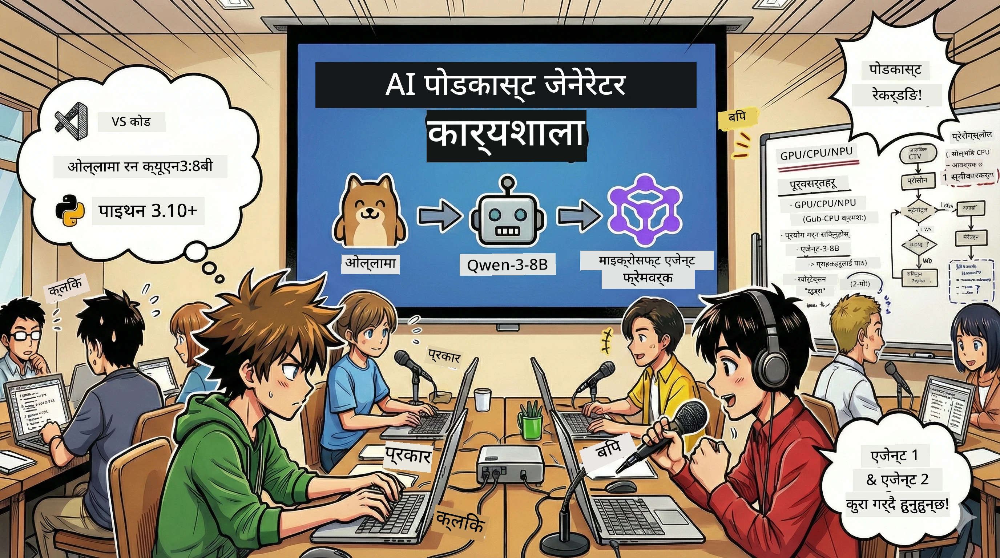
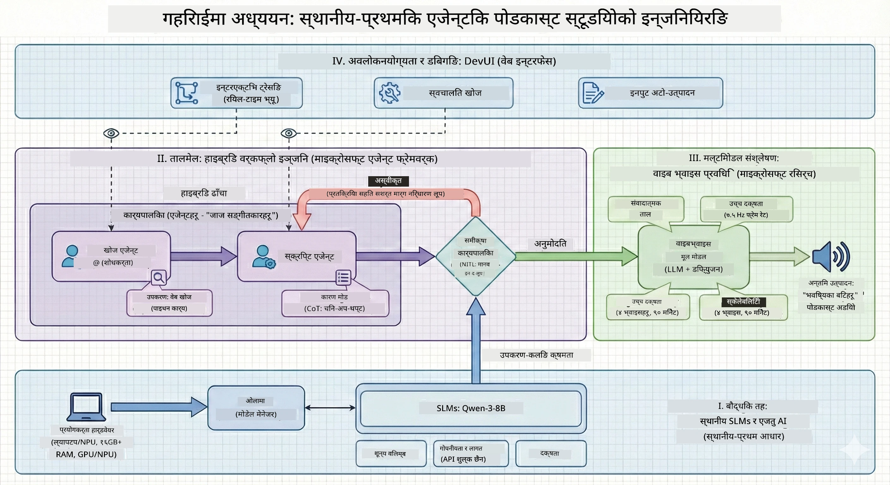

# 🎙️ एआई पोडकास्ट स्टुडियो कार्यशाला

> 🌏 [中文版 (Chinese Version)](translation/zh-cn/README.md)



## तपाईंको मिशन

**द AI पोडकास्ट स्टुडियो** मा स्वागत छ! तपाईंले “Future Bytes” नामक आफ्नो टेक पोडकास्ट सुरु गर्न लाग्नुभएको छ — तर यहाँ ट्विस्ट छ: तपाईं यसलाई निर्माण गर्न एआई-संचालित उत्पादन टोली बनाउनु हुनेछ। अब अनन्त घण्टाहरू अनुसन्धान, स्क्रिप्ट लेखन, र अडियो सम्पादनमा लाग्न पर्दैन। यसको सट्टा, तपाईं एआई सुपरपावरसहितको पोडकास्ट निर्माता बन्न कोडिङ गर्नुहुनेछ।

## कथा

कल्पना गर्नुहोस्: तपाईं र तपाईंका साथीहरूले सबैभन्दा रोचक टेक ट्रेन्डहरूको बारेमा पोडकास्ट सुरु गर्न चाहनुहुन्छ, तर सबैजना विद्यालय, काम, वा बस जीवनमा व्यस्त छन्। के भए अर्को तपाईंले एक एआई एजेन्टहरूको टोली बनाउनु सक्नुहुन्छ जसले भारी काम गर्छ? एउटा एजेन्ट विषयहरू अनुसन्धान गर्छ, अर्को आकर्षक स्क्रिप्टहरू लेख्छ, र तेस्रोले पाठलाई प्राकृतिक संवादहरूमा परिणत गर्छ। साई-फाई जस्तो लाग्छ? अहिले यसलाई वास्तविक बनाऔं।

## तपाईंले के सिक्नुहुनेछ

यस कार्यशालाको अन्त्यसम्म तपाईं जान्नुहुनेछ कसरी:
- 🤖 आफ्नै स्थानीय एआई मोडेल तैनाथ गर्ने (कुनै API खर्च होइन, कुनै क्लाउड निर्भरता होइन!)
- 🔧 विशेष एआई एजेन्टहरू निर्माण गर्ने जुन वास्तविकमा सँगै काम गर्छन्
- 🎬 विचारबाट अडियोसम्म पूर्ण पोडकास्ट उत्पादन पाइपलाइन सिर्जना गर्ने

## तपाईंको यात्रा: तीन अंशहरू



उत्तम कथाको जस्तै, हामीसँग तीन अंशहरू छन्। प्रत्येकले तपाईंको एआई पोडकास्ट स्टुडियो भाग-by-भाग निर्माण गर्छ:

| एपिसोड | तपाईंको खोज | के हुन्छ | सिक्ने सीपहरू |
|---------|-------------|----------|---------------|
| **अंश १** | [तपाईंका एआई सहायकहरूलाई भेट्नुहोस्](md/01.BuildAIAgentWithSLM.md) | तपाईंले कसरी एआई एजेन्टहरू सिर्जना गर्ने पत्ता लगाउनुहुनेछ जसले संवाद गर्न सक्छन्, वेब खोज्न सक्छन्, र समस्या समाधान गर्न सक्छन्। तिनीहरूलाई तपाईंका अनुसन्धाता इन्टर्नहरू जस्तो सम्झनुहोस् जसले कहिल्यै सुत्दैनन्। | 🎯 पहिलो एजेन्ट बनाउनुहोस्<br>🛠️ यसलाई सुपरपावर (साधनहरू) दिनुहोस्<br>🧠 यसलाई सोच्न सिकाउनुहोस्<br>🌐 इन्टरनेटमा जडान गर्नुहोस् |
| **अंश २** | [तपाईंको उत्पादन टोली गठन गर्नुहोस्](md/02.AIAgentOrchestrationAndWorkflows.md) | अब कुरा रोचक हुन्छ! तपाईंले धेरै एआई एजेन्टहरूलाई एक घुत्तै पोडकास्ट टोली जस्तै सँगै काम गराउन समन्वय गर्नुहुनेछ। एउटा अनुसन्धान गर्छ, अर्को लेख्छ, तपाईं अनुमोदन गर्नुहुन्छ — टोली कार्यले सपनालाई साकार पार्छ। | 🎭 धेरै एजेन्टहरू समन्वय गर्ने<br>🔄 अनुमोदन कार्यप्रवाह बनाउने<br>🖥️ DevUI इन्टरफेससँग परीक्षण गर्ने<br>✋ मान्छेहरूलाई नियन्त्रणमा राख्ने |
| **अंश ३** | [तपाईंको पोडकास्टलाई जीवन्त बनाउनुहोस्](md/03.Multi-SpeakerPodcastGenerationWithVibeVoice.md) | अन्तिम भाग! तपाईंका स्क्रिप्टहरूलाई यथार्थवादी आवाज र प्राकृतिक संवादहरूसहित वास्तविक पोडकास्ट अडियोमा परिवर्तन गर्नुहोस्। तपाईंको “Future Bytes” पोडकास्ट पठाउन तयार छ! | 🎤 पाठ-देखि-ध्वनि जादू<br>👥 बहु वक्ता आवाजहरू<br>⏱️ लामो स्वरूप अडियो<br>🚀 पूर्ण स्वचालन |

हरेक अंशले नयाँ क्षमताहरू खोल्छ। तपाईं बहादुर हुनुहुन्छ भने अघिल्लो भाग छोड्न सक्नुहुन्छ, तर हामी कथालाई पालना गर्न सिफारिस गर्छौं!

## वातावरण आवश्यकताहरू

यस कार्यशालाले विभिन्न हार्डवेयर वातावरणलाई समर्थन गर्दछ:
- **CPU**: परीक्षण र सानो स्केल प्रयोगका लागि उपयुक्त
- **GPU**: उत्पादन वातावरणका लागि सिफारिस गरिएको, धेरै रूपमा इन्फरेन्स गति सुधार्छ
- **NPU**: आगामी पुस्ताको न्यूरल प्रशोधन इकाई प्रवर्धनलाई समर्थन गर्दछ

## तपाईंलाई के चाहिन्छ

### सफ्टवेयर जाँचसूची ✅
- **Python 3.10+** (तपाईंको कोडिङ भाषा)
- **Ollama** (तपाईंको मेसिनमा एआई मोडेल चलाउने)
- **VS Code** (तपाईंको कोड सम्पादक)
- **Python Extension** (VS Code लाई बढी स्मार्ट बनाउने)
- **Git** (कोड तान्न)

### हार्डवेयर जाँच 💻
- **म यसलाई चलाउन सक्छु?**: 8GB RAM, 10GB खाली ठाउँ (चल्छ, तर विस्तारै हुनसक्छ)
- **आदर्श सेटअप**: 16GB+ RAM, राम्रो GPU (सुगम यात्रा!)
- **NPU छ?**: अझ राम्रो! अर्को पीढीको प्रदर्शन अनलक 🚀

## तपाईंको स्टुडियो सेटअप गर्नुहोस् 🎬

### चरण १: Python पावर-अप

पक्का गर्नुहोस् तपाईं सँग Python 3.10 वा नयाँ संस्करण छ:

```bash
python --version
# Python 3.10.x वा उच्च देखाउनुपर्नेछ
```

पाइथन छैन? [python.org](https://python.org) बाट लिनुहोस् — यो निःशुल्क छ!

### चरण २: Ollama प्राप्त गर्नुहोस् (तपाईंको एआई मोडेल रनर)

तपाईंको OS का लागि [ollama.ai](https://ollama.ai) मा जानुहोस् र Ollama डाउनलोड गर्नुहोस्। यसलाई तपाईंले स्थानीय रूपमा एआई मोडेलहरू चलाउने इन्जिनको रूपमा सोच्नुहोस्।

यो तयार छ कि छैन जाँच्नुहोस्:

```bash
ollama --version
```

### चरण ३: तपाईंको AI दिमाग डाउनलोड गर्नुहोस् 🧠

Qwen-3-8B मोडेल लिनुहोस् (यो तपाईंको पहिलो AI सहायकलाई नियुक्त गर्ने जस्तै हो):

```bash
ollama pull qwen3:8b
```

*यसले केही मिनेट लाग्न सक्छ। कफी ब्रेकको लागि उत्तम समय! ☕*

### चरण ४: VS Code सेटअप गर्नुहोस्

यदि तपाईंसँग छैन भने [Visual Studio Code](https://code.visualstudio.com/) लिनुहोस्। यो सबैभन्दा राम्रो कोड सम्पादक हो (लड्न तयार हुनुहोस् 😄)।

### चरण ५: Python एक्सटेन्सन

VS Code मा:
1. `Ctrl+Shift+X` थिच्नुहोस् (वा Mac मा `Cmd+Shift+X`)
2. "Python" खोज्नुहोस्
3. आधिकारिक Microsoft Python एक्सटेन्सन इन्स्टल गर्नुहोस्

### चरण ६: तपाईं तयार हुनुहुन्छ! 🎉

साँचो कुरा भन्नुपर्दा, तपाईं तयार हुनुहुन्छ। एआई जादु निर्माण गरौं!

### चरण ७: Microsoft Agent Framework र सम्बद्ध प्याकेजहरू इन्स्टल गर्नुहोस् 📦

कार्यशालाका लागि आवश्यक सबै निर्भरता इन्स्टल गर्नुहोस्:

```bash
pip install -r ./Installations/requirements.txt -U
```

*यसले Microsoft Agent Framework र सबै आवश्यक प्याकेजहरु इन्स्टल गर्छ। पहिले सेटअपले केही समय लाग्न सक्छ — कफी लिनुहोस्! ☕*

## कार्यशाला निर्देशनहरू

बिस्तृत परियोजना संरचना, कन्फिगरेसन चरणहरू, र कार्यान्वयन विधिहरू कार्यशालाको समयमा चरणबद्ध रूपमा व्याख्या गरिनेछ।

## समस्या समाधान (जब केही गलत हुन्छ) 🔧

### "उफ, मोडेल डाउनलोड धेरै समय लिँदैछ!"
**समाधान**: VPN प्रयोग गर्नुहोस् वा Ollama लाई मिरर स्रोतसँग कन्फिगर गर्नुहोस्। कहिले काँहि इन्टरनेट ले हामीलाई घृणा गर्छ।

### "मेरो कम्प्युटर मरिरहेको छ! मेमोरी फुर्सद छैन!"
**समाधान**: सानो मोडेलमा स्विच गर्नुहोस् वा `num_ctx` सेटिङ कम गर्नुहोस्। यसलाई एआईलाई डायटमा राख्ने जस्तो सोच्नुहोस्।

### "म मेरो GPU सँग यो छिटो बनाउन सक्छु?"
**समाधान**: Ollama ले GPU स्वचालित पत्ता लगाउँछ! तपाईंको GPU ड्राइभर अपडेट छ भनेर पक्का गर्नुहोस्। निःशुल्क स्पीड बूस्ट! 🏎️

## थप स्रोतहरू (जिज्ञासुहरूको लागि) 📚

- [Ollama Docs](https://github.com/ollama/ollama) — स्थानीय एआई मोडेलहरूको गहिराइमा जानुहोस्
- [Microsoft Agent Framework](https://microsoft.github.io/autogen/) — एजेन्ट टिमहरू बनाउने बारे थप जान्नुहोस्
- [Qwen Model Info](https://qwenlm.github.io/) — तपाईंको एआई सहायकको दिमागलाई चिनौं

## लाइसेन्स

MIT लाइसेन्स — राम्रा कुराहरू बनाउनुहोस्, साझा गर्नुहोस्, संसारलाई राम्रो बनाउनुहोस्! 🌍

## योगदान गर्न चाहनुहुन्छ?

बग भेट्नुभयो? कुनै आइडिया छ? Issue वा PR पठाउनुहोस्! हामी सामुदायिक वातावरणलाई मन पराउँछौं। ✨

---

<!-- CO-OP TRANSLATOR DISCLAIMER START -->
**अस्वीकरण**:
यो दस्तावेज [Co-op Translator](https://github.com/Azure/co-op-translator) नामक एआई अनुवाद सेवा प्रयोग गरेर अनुवाद गरिएको हो। हामी शुद्धताको लागि प्रयास गर्दछौं, तर कृपया ध्यान दिनुहोस् कि स्वचालित अनुवादमा त्रुटिहरू वा असंगतिहरू हुन सक्छन्। मूल दस्तावेज यसको मूल भाषामा नै अधिकारिक स्रोत मान्नुपर्छ। महत्वपूर्ण जानकारीको लागि व्यावसायिक मानव अनुवाद सिफारिस गरिन्छ। यस अनुवादको प्रयोगबाट कुनै पनि गलतफहमी वा गलत व्याख्या भएमा हामी जिम्मेवार हौंैनौं।
<!-- CO-OP TRANSLATOR DISCLAIMER END -->