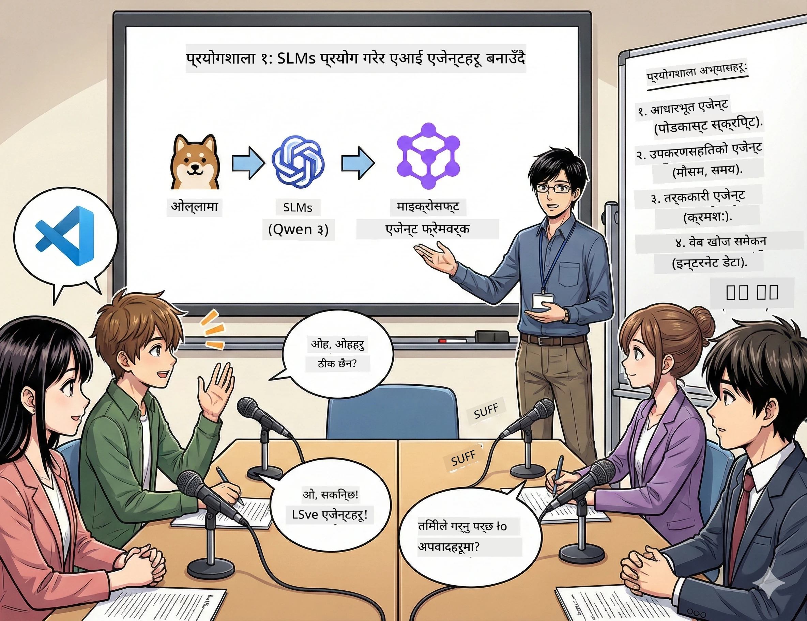

<!--
CO_OP_TRANSLATOR_METADATA:
{
  "original_hash": "7868fa418386aa7167bea3ff5ba8390b",
  "translation_date": "2026-01-05T12:53:29+00:00",
  "source_file": "WorkshopForAgentic/md/01.BuildAIAgentWithSLM.md",
  "language_code": "ne"
}
-->
# एक्ट १: तपाईंको AI अनुसन्धान सहायकसँग परिचय 🤖

## चुनौती

तपाईंले "फ्युचर बाइट्स" सुरु गर्दै हुनुहुन्छ, तपाईंको नयाँ टेक पोडकास्ट। एपिसोड १ ताजा AI प्रगति बारे हो, तर तपाईं सँग २४ घण्टा छ:
1. विषय अनुसन्धान गर्न
2. विश्वसनीय स्रोतहरू खोज्न
3. रोचक स्क्रिप्ट लेख्न
4. प्राकृतिक सुनिने बनाउन

**पात्र परिवर्तन**: तपाईंलाई यो एक्लैले गर्नु पर्दैन। तपाईं आफ्नो पहिलो AI सहायक बनाउँदै हुनुहुन्छ जसले यी सबैमा मदद गर्नेछ। उनीहरूको नाम राखौं एलेक्स — तपाईंको लगातार अनुसन्धान गर्ने साथी जसलाई कहिल्यै निद्रा चाहिंदैन।

## किन साना भाषा मोडेलहरू? (स्पोइलर: तिनीहरू उत्कृष्ट छन्)

सानो भाषा मोडेलहरू (SLMs) लाई तपाईंको व्यक्तिगत AI भनेर सोच्नुहोस् जुन *तपाईंको* कम्प्युटरमा बस्छ। कुनै क्लाउड छैन, कुनै मासिक शुल्क छैन, कुनै शङ्कास्पद डेटा साझा गर्ने छैन।

**किन SLMs 🔥 छन्:**
- **🏠 तपाईंको मेसिनमा चल्छ**: ल्यापटप, डेस्कटप, वा एक शक्तिशाली रास्पबेरी पाइमा
- **💸 कुनै निरन्तर खर्च छैन**: कुनै API शुल्कले तपाईंको पैसा खान्न
- **🔒 निजता पहिले**: तपाईंको डेटा कहिल्यै उपकरणबाट बाहिर जान्नँ
- **⚡ धेरै छिटो**: इन्टरनेटको ढिलाइ छैन, तुरुन्त प्रतिक्रिया
- **🪦 हल्का**: १B-१०B प्यारामिटरहरू बनाम ठूला मोडेलका १००B+

**लोकप्रिय SLMs**: Qwen 3, Phi-4, Gemma 3 (हामी यस कार्यशालामा Qwen प्रयोग गर्दैछौं)

## तपाईंको उपकरण सेट

### Ollama: तपाईंको AI मोडेल प्रबन्धक

[Ollama](https://ollama.com/) AI मोडेलहरूको लागि Steam जस्तै हो। सजिलो कमाण्डहरूबाट मोडेलहरू डाउनलोड, चलाउन र व्यवस्थापन गर्न सकिन्छ।

**यो किन उत्कृष्ट छ:**
- कुनै पनि मोडेल डाउनलोड र चलाउन एक कमाण्ड
- Mac, Windows, Linux मा काम गर्छ
- तपाईंको GPU छ भने स्वतः प्रयोग गर्छ
- अत्यन्त मेमोरी-मित्रवत

### Microsoft Agent Framework: जहाँ जादु हुन्छ

[Microsoft Agent Framework](https://github.com/microsoft/agent-framework) तपाईंको AI एजेन्टहरू निर्माण गर्ने मैदान हो जसले:

- 💬 कुरा गर्न र कुराकानी सम्झन सक्छ
- 🛠️ कस्टम उपकरणहरू प्रयोग गर्न सक्छ (जस्तै वेब खोज्न वा मौसम जाँच गर्न)
- 🧠 जटिल समस्याहरू चरण-द्वारा-चरण सोच्न सक्छ
- 🤝 अन्य एजेन्टहरूसँग टिममा काम गर्न सक्छ
- 🔌 विभिन्न AI प्रदायकहरूसँग जडान हुन सक्छ (OpenAI, Ollama, Azure)

**निर्माणका आधारहरू:**
- **एजेन्टहरू**: तपाईंका AI सहायकहरू विशिष्ट कामका लागि
- **उपकरणहरू**: तपाईंले दिने विशेष क्षमता
- **स्मृति**: कुराकानी बिर्सन नदिन
- **तर्क**: तिनीहरूलाई सोच्न सिकाउने, मात्र जवाफ दिन होइन

## तपाईंको प्रशिक्षण कथा: ४ मिसनहरू

### मिसन १: तपाईंको पहिलो एजेन्ट बनाउनुहोस्

📓 [नोटबुक खोल्नुहोस्](../code/01.BasicAgent/00.BasicAgent-agent.ipynb)

**दौडान्वेषण**: एलेक्स बनाउनुहोस्, तपाईंको पोडकास्ट स्क्रिप्ट लेखक AI। एलेक्सले दुई होस्टहरूबीच टेक कुराकानीको संवाद सिर्जना गर्नुपर्छ।

**तपाईं के सिक्नुहुन्छ**:
- AI एजेन्ट कसरी जागृत गर्ने (सोमवार जाग्न भन्दा सजिलो)
- यसलाई व्यक्तित्व र निर्देशन दिने
- वास्तविक पोडकास्ट स्क्रिप्ट उत्पादन गर्ने बनाउन
- यसको जवाफ बुझ्ने

**विजय सर्त**: एलेक्सले "फ्युचर बाइट्स" पाइलट एपिसोडको AI बारे स्क्रिप्ट बनाउँछ! 🎯

### मिसन २: एलेक्सलाई सुपरपावर्स (उपकरणहरू) दिनुहोस्!

📓 [नोटबुक खोल्नुहोस्](../code/01.BasicAgent/01.BasicAgent-tools.ipynb)

**दौडान्वेषण**: एलेक्स धेरै बुद्धिमान छ, तर यसले आजको मौसम वा समय थाहा पाउदैन। अब उपकरणहरूले त्यो सुधारौं!

**तपाईं के सिक्नुहुन्छ**:
- "उपकरण" को रूपमा कस्टम Python फंक्शनहरू बनाउने
- एलेक्सले कहिले कुन उपकरण प्रयोग गर्ने निर्णय गर्न दिने
- स्वायत्त रूपमा समस्या समाधान गरिरहेको हेर्ने
- जटिल कार्यहरूको लागि धेरै उपकरणहरू संयोजन गर्ने

**विजय सर्त**: "टोकियोको मौसम कस्तो छ?" सोध्दा एलेक्स आफैं थाहा पाउँछ! ☁️

### मिसन ३: एलेक्सलाई सोच्न सिकाउनुहोस्

📓 [नोटबुक खोल्नुहोस्](../code/01.BasicAgent/02.BasicAgent-reasoning.ipynb)

**दौडान्वेषण**: एलेक्सले आफ्नो काम देखाओस्। समस्याहरू समाधान गर्दा केवल उत्तर होइन, कसरी सोच्दैछ भन्ने देख्न चाहिन्छ।

**तपाईं के सिक्नुहुन्छ**:
- "तर्क मोड" सक्रिय गर्ने (यो गणित क्लासजस्तो तपाईंको काम देखाउनु जस्तै)
- एलेक्सको चरण-द्वारा-चरण सोच प्रक्रिया हेर्ने
- चेन-ऑफ-थट प्रम्प्टिङ बुझ्ने
- एलेक्स अलमलमा परेमा डिबग गर्ने

**विजय सर्त**: गाह्रो गणित प्रश्न सोध्नुहोस् र एलेक्सले सोचिरहेको हेर्नुहोस्! 🧠

### मिसन ४: एलेक्सलाई इन्टरनेट जडान गराउनुहोस्

📓 [नोटबुक खोल्नुहोस्](../code/01.BasicAgent/03.BasicAgent-websearch.ipynb)

**दौडान्वेषण**: एलेक्सको ज्ञानमा कटअफ मिति छ। वास्तविक-समय जानकारीका लागि यसलाई वेबसँग जडान गरौं!

**तपाईं के सिक्नुहुन्छ**:
- कस्टम वेब खोज उपकरण बनाउने
- बाह्य API हरूसँग एकीकृत गर्ने
- नेटवर्क त्रुटिहरू सजिलै सम्हाल्ने
- एलेक्सको प्रशिक्षण डेटा भन्दा बाहिर जानकारी प्राप्त गर्ने

**विजय सर्त**: आजको टेक समाचार बारे सोध्नुहोस् र ताजा परिणामहरू पाउनुहोस्! 📰

## सुरु गर्नु अघि 🚀

**आवश्यक उपकरणहरू**:
- Python ३.१०+ इन्स्टल गरिएको
- Ollama चलिरहेको ( `ollama --version` संग जाँच)
- VS Code मा Python एक्सटेन्सन
- कम्तिमा ८GB RAM (१६GB भए राम्रो अनुभव)

## मिसन क्रम

पूरा कथा तर्फ नोटबुकहरू अनुक्रममा पालना गर्नुहोस्:

1. [00.BasicAgent-agent.ipynb](../code/01.BasicAgent/00.BasicAgent-agent.ipynb) — एलेक्ससँग भेट्नुहोस् (तपाईंको पहिलो एजेन्ट)
2. [01.BasicAgent-tools.ipynb](../code/01.BasicAgent/01.BasicAgent-tools.ipynb) — शक्ति वृद्धि समय!
3. [02.BasicAgent-reasoning.ipynb](../code/01.BasicAgent/02.BasicAgent-reasoning.ipynb) — एलेक्सलाई सोच्न सिकाउनुहोस्
4. [03.BasicAgent-websearch.ipynb](../code/01.BasicAgent/03.BasicAgent-websearch.ipynb) — इन्टरनेट पहुँच खुल्यो!

## तपाईंले के मास्टर गर्नुहुनेछ

एक्ट १ पछि, तपाईं सक्षम हुनुहुनेछ:

- ✅ आफ्नै हार्डवेयरमा AI मोडेलहरू चलाउन (क्लाउड आवश्यक छैन!)
- ✅ एजेन्टहरूलाई कस्टम व्यक्तित्व र सीपका साथ बनाउने
- ✅ एजेन्टहरूलाई वास्तविक समस्याहरू समाधान गर्न उपकरण दिने
- ✅ एजेन्टहरूलाई तिनीहरूको तर्क प्रक्रिया देखाउन लगाउने
- ✅ एजेन्टहरूलाई बाह्य डेटा स्रोतसँग जडान गर्ने
- ✅ समस्याहरू आउँदा डिबग गर्ने

## जब कुराहरू बिग्रन्छन् (र कसरी समाधान गर्ने) 🔧

### "एलेक्स लोड हुँदैन! मेमोरी कम छ!"
**समाधान**: तपाईंको कम्प्युटर संघर्ष गर्दैछ। अन्य एपहरू बन्द गर्न प्रयास गर्नुहोस् अथवा सानो मोडेलमा स्विच गर्नुहोस्। ८GB RAM न्यूनतम हो।

### "एलेक्स धेरै स्लो छ"
**समाधान**: Ollama सेटिङ्समा GPU एक्सेलेरेसन सक्षम गर्नुहोस्। वा कन्टेक्स्ट विन्डोको साइज घटाउनुहोस्। गति देवता मोड सक्रिय! 🏎️

### "उपकरणहरू काम गरिरहेका छैनन्!"
**समाधान**: तपाईंको फंक्शन सिग्नेचरहरू दुईपटक जाँच गर्नुहोस्। एलेक्सले उपकरणले के गर्छ भन्ने बुझ्न सहि प्रकार संकेत चाहिन्छ। यसलाई स्पष्ट निर्देशन दिनुहोस् जस्तो सोच्नुहोस्।

## सहयोगी लिंकहरू 🔗

- [Agent Framework Docs](https://github.com/microsoft/agent-framework) — आधिकारिक मार्गदर्शक र उदाहरणहरू
- [Ollama Model Library](https://ollama.com/library) — उपलब्ध सबै मोडेलहरू ब्राउज गर्नुहोस्
- [Qwen Model](https://ollama.com/library/qwen3) — तपाईंको AI को मस्तिष्कसँग परिचय
- [Code Examples](https://github.com/microsoft/agent-framework/tree/main/python/samples) — यहाँबाट विचार चोरी गर्नुहोस्

## अर्को: एक्ट २ 🎬

तपाईंसँग एउटा एजेन्ट छ। तर के हुन्छ यदि तपाईं सँग *एजेन्टहरूको टोली* सँगै काम गर्दैछ? एक्ट २ मा, तपाईं आफ्नो पुरा पोडकास्ट उत्पादन टोली बनाउनु हुनेछ:
- **अनुसन्धानकर्ता एजेन्ट**: सबैभन्दा राम्रो स्रोतहरू फेला पार्ने
- **लेखक एजेन्ट**: उत्तम स्क्रिप्ट तयार गर्ने
- **सम्पादक (तपाईं!)**: स्वीकृति दिने वा परिवर्तन माग्ने

आउनुहोस् केहि AI जादू मिलाऔं! → [Act 2: Assemble Your Production Team](02.AIAgentOrchestrationAndWorkflows.md)

---

**अड्किनुभयो?** कार्यशालामा प्रश्न सोध्नुहोस्। हामी सबै सँगै सिक्दैछौं! 🙌

---

<!-- CO-OP TRANSLATOR DISCLAIMER START -->
**अस्वीकरण**:  
यो दस्तावेज एआई अनुवाद सेवा [Co-op Translator](https://github.com/Azure/co-op-translator) प्रयोग गरेर अनुवाद गरिएको हो। हामी शुद्धताका लागि प्रयासरत भए तापनि, कृपया ध्यान दिनुहोस् कि स्वचालित अनुवादमा त्रुटि वा असंगतिहरू हुन सक्छन्। मूल दस्तावेज यसको मातृभाषामा नै अधिकारप्राप्त स्रोत मानिनेछ। महत्वपूर्ण जानकारीको लागि व्यावसायिक मानवीय अनुवाद सिफारिस गरिन्छ। यस अनुवादको प्रयोगबाट उत्पन्न कुनै पनि गलतफहमी वा गलत व्याख्याको लागि हामी जिम्मेवार छैनौं।
<!-- CO-OP TRANSLATOR DISCLAIMER END -->