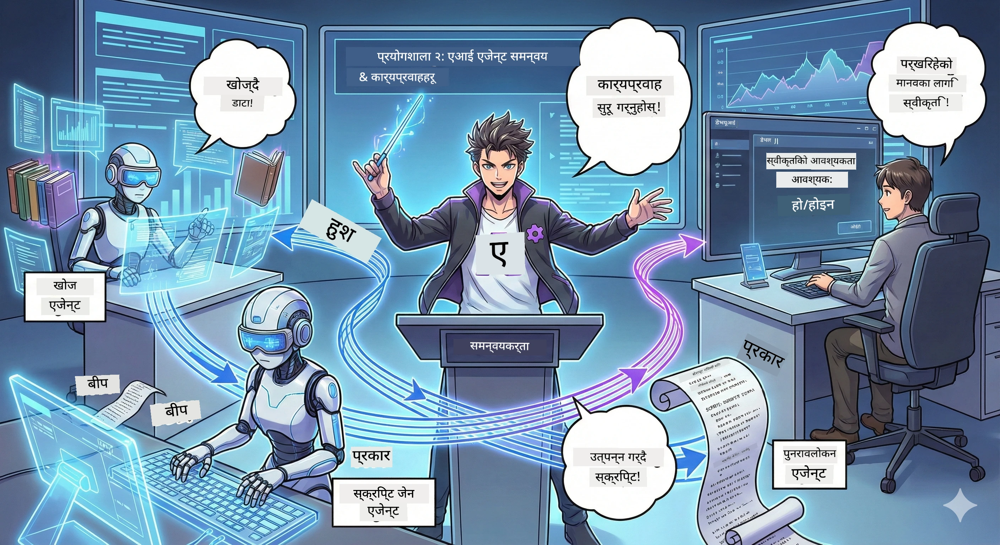

# एक्ट २: तपाईँको पोडकास्ट उत्पादन टोली बनाएर जुटाउनुहोस् 🎬



## कथानक थप गहिरो हुँदैछ

एलेक्स (एउटा AI सहायक जुन एक्ट १ बाट छ) त निकै राम्रो छ, तर एक जना एजेन्टले एउटा पूरै पोडकास्ट स्टुडियो चलाउन सक्दैन। तपाईँलाई *टोली* चाहिन्छ:
- 🔍 **अनुसन्धान एजेन्ट**: नयाँ जानकारीको लागि इन्टरनेटमा खोजी गर्छ
- ✍️ **स्क्रिप्ट एजेन्ट**: अनुसन्धानलाई रोचक संवादमा परिणत गर्छ
- 👤 **तपाईँ (सम्पादक)**: स्क्रिप्टहरू स्वीकृत गर्नुहोस् वा पुनः लेखनका लागि फर्काउनुहोस्

स्वागत छ **AI एजेन्ट आयोजकता** मा — जहाँ तपाईँ आफ्नै AI टोलीको निर्देशक बन्नुहुन्छ। अवेन्जरहरूको जस्तो, तर पोडकास्ट उत्पादनको लागि।

## एजेन्ट आयोजकता के हो? (सजिलो संस्करण)

कल्पना गर्नुहोस् तपाईँ रेस्टुरेन्ट चलाउँदै हुनुहुन्छ। तपाईँ आफै सबै गर्नुहुन्न, हैन र? तपाईँसँग छ:
- 🍳 भान्से जसले खाना पकाउछ
- 👨‍🍳 सह-भान्से जसले तयारी गर्छ
- 👩‍🍳 सेर्भर जसले सेवा दिन्छ

एजेन्ट आयोजकता पनि त्यही हो, तर AI सँग। प्रत्येक एजेन्टसँग एउटा विशेषता हुन्छ, र तपाईँले उनीहरूलाई ठूला लक्ष्य पूरा गर्न समन्वय गर्नुहुन्छ। कुनै एकल एजेन्ट थाक्दैन, र काम छिटो सम्पादित हुन्छ।

### ब्याण्डसँग तुलना 🎸

तपाईँका AI एजेन्टहरू एक संगीत बाँड जस्ता छन्:
- **मुख्य गायक**: मुख्य एजेन्ट जो ग्राहकसँग संवाद गर्छ
- **ढोलक बाजा**: ताल मिलाउँछ, पृष्ठभूमि प्रक्रिया गर्छ  
- **बास प्लेयर**: सबैलाई सहयोग गर्छ, डेटा ल्याउँछ
- **तपाईँ (ब्यान्ड प्रबन्धक)**: सबैलाई समन्वय गर्नुहुन्छ!

समन्वयबिना? मात्र हल्ला। आयोजकतासँग? सुन्दर संगीत।

### किन यो महत्त्वपूर्ण छ

एक AI एजेन्टले सबै काम गर्ने प्रयास गर्ने = जल्ने। विशेष एजेन्टहरूले सँगसँगै काम गर्ने = दक्षता खुल्यो! 🚀

**सच कुरा**: एक्लैले अनुसन्धान, लेखन र सम्पादन गर्दा कति गाह्रो भएको याद छ? हुन्छ नि। आयोजकतासँग, हरेक एजेन्टले आफ्नो सबभन्दा राम्रो काम गर्छ। तपाईँ अन्तिम निर्णय गर्नुहुन्छ।

**व्यवहारिक उदाहरण**: ग्राहक सेवा बोटहरू जुन कहिले बिलिङ, कहिले प्राविधिक समस्या सम्हाल्छन्, र कहिले मानिसलाई बोलाउँछन्। त्यो हो आयोजकता!

## एजेन्ट र कार्यप्रवाह (Workflow): के फरक?

यसरी सोच्नुहोस्:

### 🤖 AI एजेन्ट = जेझ संगीतकार
- **बिना तयारी निर्णय लिन्छ** जुन कुरा सुन्छ त्यसका आधारमा
- ** improvises (अमेरिकी भाषामा) समाधान गर्छ** आफ्नो उपकरणहरू प्रयोग गरेर
- **सोच्छ** LLM मस्तिष्कको प्रयोग गरेर
- **अनुकूल्य हुन्छ** जुन कुरा दिन्छ त्यही अनुसार

### 🎵 कार्यप्रवाह = शास्त्रीय संगीत बज्ने अरोकेस्ट्रा  
- **स्कोर पछ्याउँछ** (पूर्वनिर्धारित चरणहरू)
- **पूर्वानुमानित** कार्यान्वयन बाटो
- **समन्वय गर्छ** धेरै एजेन्ट, मानिस र प्रणालीहरूलाई
- **संरचित** जस्तो कुनै पकाउने विधि

**जादू**: कार्यप्रवाहहरूले *एजेन्टहरूलाई आयोजक* गर्छन्! तपाईँ workflow बनाउनुहुन्छ जुन एजेन्टहरूलाई आफ्नो भाग कब बजाउन भनेर बताउँछ। दुई दुनियाँको उत्कृष्ठता। 🎭

## तपाईँको AI टोली समन्वय गर्ने तीन तरिका

### १. 🎯 केन्द्रीयकृत (तपाईँ नेता हुनुहुन्छ)

एक मुख्य एजेन्टले सबै निर्णय लिन्छ। यो तपाईँले टोली व्यवस्थापन गर्ने जस्तो — को के गर्छ र कहिले गर्छ भनेर तपाईँले निर्णय गर्नुहुन्छ।

**फाइदा**:
- ✅ स्पष्ट नेतृत्व (कुनै भ्रम छैन)
- ✅ सुसंगत निर्णय
- ✅ सजिलो डिबग

**प्रयोग गर्नुहोस्**:
- ग्राहक सेवा रुटिंग ("यो बिलिङ हो या प्राविधिक समर्थन?")
- सामग्री अनुमोदन कार्यप्रवाह ("यो स्क्रिप्ट पारित भयो?")
- पोडकास्ट उत्पादन (ठ्याक्कै हामी जुन बनाउँदैछौं!)

### २. 🤝 विकेन्द्रित (एजेन्टहरूले आफूहरू मिलेर काम गर्छन्)

एजेन्टहरूले सिधै एकआपसमा कुरा गर्छन् र समूहका रूपमा निर्णय गर्छन्। जस्तै समूह च्याट जहाँ सबै मिलेर समन्वय गर्छन्।

**फाइदा**:
- ✅ सजिलै विस्तार हुन्छ (जब जहिले पनि एजेन्ट थप्न सकिन्छ)
- ✅ कुनै एकल असफलता बिन्दु हुँदैन
- ✅ एजेन्टहरू स्वाभाविक रूपमा सहकार्य गर्छन्

**प्रयोग गर्नुहोस्**:
- अनुसन्धान टोलीहरू (जसमा प्रत्येक एजेन्ट फरक स्रोतहरू अन्वेषण गर्छ)
- विचार सत्रहरू
- वितरण गरिएका समस्या समाधान

### ३. 🔀 हाइब्रिड (दुबैको सर्वोत्तम)

तपाईँले समग्र दिशा निर्धारण गर्नुहुन्छ, तर एजेन्टहरूले स्वतन्त्र रूपमा आफ्नो काम मिलाउँछन्। जस्तै CEO जसले आफ्नो टोलीमा विश्वास गर्छ।

**उत्तम**: जटिल परियोजनाहरू जहाँ नियन्त्रण र लचिलोपन दुवै आवश्यक छ।

## Microsoft Agent Framework: तपाईँको आयोजकता उपकरण 🧰

अब बनाउने समय! यहाँ तपाईँले प्रयोग गर्नुहुनेछ:

### निर्माणका अंगहरू

#### १. 🧱 कार्यान्वयकहरू (तपाईँका कामदारहरू)
- **के हुन्**: व्यक्तिगत प्रक्रिया इकाईहरू — एजेन्ट वा कस्टम तर्क हुन सक्छन्
- **के गर्छन्**: इनपुट लिन्छन्, काम गर्छन्, आउटपुट दिन्छन्
- **कल्पना गर्नुहोस्**: असेंबली लाइनका स्टेशनहरू जत्ति

#### २. ➡️ कनेक्शनहरू (जोडने तारहरू)
- **के हुन्**: कार्यान्वयकहरू बीचका बाटोहरू
- **के गर्छन्**: सन्देश प्रवाह नियन्त्रण गर्छ ("A पछि B मा जानु")
- **कल्पना गर्नुहोस्**: फ्लोचार्टमा भएका तीरहरू जस्ता

#### ३. 🗺️ कार्यप्रवाहहरू (मुख्य योजना)
- **के हुन्**: कार्यान्वयक + कनेक्शनहरूको पूर्ण ग्राफ
- **के गर्छन्**: सुरु देखि अन्तसम्म सम्पूर्ण प्रक्रिया परिभाषित गर्छ
- **कल्पना गर्नुहोस्**: तपाईँको उत्पादन पाइपलाइनको ब्लूप्रिन्ट

### रमाइला विशेषताहरू जुन तपाईँले मन पराउनु हुनेछ

**🛡️ प्रकार सुरक्षा**: एजेन्टहरू बीच सन्देशहरू प्रकार जाँच हुन्छ। “ओह, गलत डाटा प्रकार” आश्चर्य हुँदैन।

**🔀 लचिलो मार्गनिर्देशन**: 
- यदि-त्यसपछि सर्तहरू ("यदि स्वीकृत भयो, प्रकाशन; नत्र, पुनः लेखन")
- समानान्तर प्रक्रिया (धेरै एजेन्ट एकैसाथ काम गर्छन्)
- गतिशील बाटाहरू (परिणामअनुसार workflow अनुकूल हुन्छ)

**🔌 बाह्य एकीकरण**:
- API हरूमा जडान गर्न
- मानव-इन-द-लूप checkpoints थप्न (प्रकाशन अघि अनुमोदन गर्न)
- अनुरोध/प्रतिक्रिया प्रवाहहरू बनाउने

**💾 चेकपोइन्टिङ**: प्रगति सुरक्षित गर्नुहोस्! केहि बिग्रिएमा बिचबाट फेरि शुरु गर्न सकिन्छ।

**🤝 बहु-एजेन्ट समन्वय**:
- एजेन्टहरू क्रमबद्ध (A → B → C)
- समानान्तर रुपमा चलाउने (A + B + C एकसाथ)
- एजेन्टहरू बीच हस्तान्तरण
- सहकार्य प्रक्रियाहरू

## उत्कृष्ट अभ्यासहरू (प्रो टिप्स) 🎯

### १. मोडुलर राख्नुहोस्
प्रत्येक एजेन्टले एउटा कुरा राम्रोसँग गर्नु पर्छ। सबै कुरा गर्ने "सुपर एजेन्ट" नबनाउनुहोस् — डिबग गर्दा पछुताउनुहुनेछ।

### २. असफलताको योजना बनाएर राख्नुहोस्
एजेन्टहरूले गल्ती गर्छन्। नेटवर्क विफल हुन्छ। त्रुटि ह्यान्डलिङ र ब्याकअप योजना बनाउनुहोस्। भविष्यको तपाईँले धन्यवाद दिनुहुनेछ।

### ३. सबै कुरा अनुगमन गर्नुहोस्
एजेन्टहरूले जे गर्दै छन् ट्रयाक गर्नुहोस्। DevUI प्रयोग गर्नुहोस् (यो पनि हामीले हेर्ने छौं!) र workflow हरूलाई जाँच गर्नुहोस्।

### ४. सन्देश आकार अनुकूल बनाउनुहोस्
एजेन्टहरू बीच ठूलो फाइल नपठाउनुहोस्। सन्देशहरू छोटो र छिटो राख्नुस्।

### ५. सही नमुना छनौट गर्नुहोस्
नियन्त्रण चाहिन्छ? केन्द्रीयकृत जानुहोस्। विस्तार चाहिन्छ? विकेन्द्रित जानुहोस्। निर्णय गर्न सक्नु भएन? हाइब्रिड!

## DevUI: तपाईँको कार्यप्रवाह डिबगर 🔍

### DevUI के हो?

DevUI तपाईँका एजेन्ट र workflow हरू परीक्षण गर्न खेल मैदान जस्तो हो। यो वेब इन्टरफेस हो जहाँ तपाईँ गर्न सक्नुहुन्छ:
- 👀 तपाईँको workflow लाई क्रियाशील देख्नुहोस्
- 💬 एजेन्टहरूसँग सिधै कुरा गर्नुहोस्
- 🔍 समस्या आउँदा डिबग गर्नुहोस्
- 📊 ट्रेस र प्रदर्शन मेट्रिक्स हेर्नुहोस्

> **महत्त्वपूर्ण**: DevUI विकासकालागि मात्र! उत्पादनमा नचलाउनुहोस्। यो तपाईँको स्थानीय परीक्षण वातावरण हो।

### यसलाई उत्कृष्ट बनाउने कुराहरू

- **🖥️ अन्तरक्रियात्मक वेब UI**: क्लिक गर्नुहोस्, टाइप गर्नुहोस्, परीक्षण गर्नुहोस् — कमान्ड लाइन चाहिँदैन
- **📁 ड्र्याग एण्ड ड्रप तयार**: फाइलहरू अपलोड गर्नुहोस्, फरक इनपुटहरूसँग परीक्षण गर्नुहोस्
- **📂 स्वचालित पत्ता लगाउने**: फोल्डर दिएको खण्डमा सबै एजेन्ट स्वतः फेला पार्छ
- **📋 सेटअप नगर्ने मोड**: कोडमा एजेन्ट दर्ता गर्नुहोस्, फोल्डर संरचना आवश्यक छैन
- **🔌 OpenAI उपयुक्त**: OpenAI SDK सँग काम गर्छ (सुसंगतता FTW!)
- **👁️ ट्रेसिङ बिल्ट-इन**: एजेन्टहरूले के गर्दैछन् ठीक हेर्नुहोस्

### इनपुट कसरी काम गर्छ

DevUI इनपुटका लागि स्मार्ट छ:

- **एजेन्टहरू परीक्षण गर्दै हुनुहुन्छ?** तपाईँलाई टेक्स्ट बक्स र फाइल अपलोड बटनहरू मिल्छन्
- **कार्यप्रवाह परीक्षण गर्दै हुनुहुन्छ?** UI ले workflow ले चाहेको इनपुटहरूनुसार स्वचालित इनपुट क्षेत्रहरू बनाउँछ

यो जादूजस्तो छ, तर यो मात्र राम्रो कोड हो। ✨

## तपाईँका मिसनहरू: पोडकास्ट स्टुडियो बनाउनुहोस् 🎬

### मिसन १: DevUI सँग एउटा एजेन्ट बनाउनुहोस्

📂 [01.AgentDevUI](../../../../WorkshopForAgentic/code/02.Workflow/01.AgentDevUI)

**चुनौती**: एउटा पूरै टोली बनाउनु अघि, DevUI को साथमा एउटा एजेन्ट परीक्षण गरौं: वेब खोज विशेषज्ञ।

**तपाईँ जे बनाउँदै हुनुहुन्छ**:
एउटा अनुसंधान एजेन्ट जसले पोडकास्ट विषयको लागि इन्टरनेटमा खोजी गर्छ। तपाईँ DevUI को वेब इन्टरफेसमा `http://localhost:8090` बाट परीक्षण गर्नुहुनेछ।

**तपाईँले सिक्ने सीपहरू**:
- 🚀 DevUI मा एजेन्टहरू सुरु गर्ने
- 🔍 वास्तविक-समयमा एजेन्ट प्रतिक्रिया परीक्षण गर्ने
- 🛠️ कस्टम उपकरणहरू निर्माण गर्ने (वेब खोज)
- 📊 समस्या समाधानका लागि ट्रेसिङ सक्षम गर्ने
- 🖥️ अन्तरक्रियात्मक वेब UI प्रयोग गर्ने

**कोड**:
- `agent.py`: तपाईँको SearchAgent वेब खोज सुपरपावर सहित
- OllamaChatClient प्रयोग गरेर Qwen सँग जडान
- `web_search()` उपकरण कार्यान्वयन
- `serve()` प्रयोग गरेर DevUI स्वचालित रुपमा खोल्छ

**बिजय शर्त**: तपाईँको एजेन्टलाई सोध्नुहोस् "AI मा के ट्रेन्डमा छ?" र हेर्नुहोस् त्यसले इन्टरनेट खोजेको! 🎉

### मिसन २: बहु-एजेन्ट कार्यप्रवाह बनाउनुहोस्

📂 [02.WorkflowDevUI](../../../../WorkshopForAgentic/code/02.Workflow/02.WorkflowDevUI)

**चुनौती**: अब साँचो रमाइलो सुरु हुन्छ! पूरा पोडकास्ट उत्पादन workflow बनाउनुहोस्:
1. 🔍 **खोज एजेन्ट** → तपाईँको विषय अनुसन्धान गर्छ
2. ✍️ **स्क्रिप्ट एजेन्ट** → दुई होस्टका बीच संवाद लेख्छ (चिनीया भाषामा!)
3. 👤 **समिक्षा कार्यान्वयक** → तपाईँलाई स्वीकृति वा अस्वीकृति सोध्छ
4. 🔄 **फेरि फर्काउने** → अस्वीकृत भए, तपाईँको प्रतिक्रिया अनुसार puna-लेखन गर्छ

**तपाईँले सिक्ने सीपहरू**:
- 🧱 फरक कामका लागि विशेषज्ञ एजेन्टहरू बनाउने
- 🔗 एजेन्टहरूलाई WorkflowBuilder बाट जडान गर्ने
- 🔀 अनुमोदन लूप (मानव-इन-द-लूप) लागू गर्ने
- 🚦 सर्तबद्ध मार्गनिर्देशन (स्वीकृत वा अस्वीकृत)
- 🔧 व्यावसायिक तर्कका लागि कस्टम कार्यान्वयक बनाउने

**कार्यप्रवाह**:
```
SearchAgent → ScriptAgent → ReviewExecutor
                             ↑          ↓ (if rejected)
                             ←─────────
```

**कोड**:
- `search_agent/agent.py`: तपाईँको अनुसन्धान विशेषज्ञ
- `generate_script_agent/agent.py`: तपाईँको पटकथा लेखक (चिनीया भाषामा लेख्ने)
- `workflow/workflow.py`: यहाँ आयोजकताको जादू हुन्छ
- `main.py`: सबै कुरा DevUI मा सुरु गर्छ

**बिजय शर्त**: विषय दिनुहोस्, स्क्रिप्ट समीक्षा गर्नुहोस्, लूप परीक्षणका लागि एक पटक अस्वीकृत गर्नुहोस्, त्यसपछि स्वीकृति दिनुहोस्! 🎉

### मिसन ३: कन्सोल एप बनाउनुहोस्

📂 [03.Application](../../../../WorkshopForAgentic/code/02.Workflow/03.Application)

**चुनौती**: DevUI बाट workflow लिएर राम्रो टर्मिनल एप बनाउनुहोस् जसमा रंगीन आउटकम, लोडिङ स्पिनरहरू, र फाइलमा बचत गर्ने सुविधा छ। यो तयार उत्पादन सामग्री हो!

**तपाईँले सिक्ने सीपहरू**:
- ⚡ प्रोग्राम्याटिकली workflow चलाउने (DevUI बिना)
- 📡 स्ट्रीमिङ सहित घटना-आधारित संरचना
- 🎨 राम्रा टर्मिनल UI बनाउने (रंग, स्पिनर, प्रगति पट्टीहरू)
- 💾 अन्तिम स्क्रिप्टहरू फाइलमा बचत गर्ने
- 🔄 Python को asyncio सँग असिंक्रोनस workflow ह्यान्डल गर्ने

**के गर्छ**:
1. तपाईँलाई पोडकास्ट विषय सोध्छ
2. वास्तविक समयमा प्रगति देखाउँछ ("खोज एजेन्ट काम गर्दै...")
3. रंगीन स्क्रिप्ट देखाउँछ
4. स्वीकृति माग्छ
5. स्वीकृत स्क्रिप्ट `podcast.txt` मा बचत गर्छ

**कोड**:
- `podcast_app.py`: तपाईँको मुख्य एप घटना ह्यान्डलिङसहित
- `workflow.py`: मिशन २ को workflow पुन: प्रयोग
- घटनाहरू ह्यान्डल गर्छ: `AgentRunUpdateEvent`, `RequestInfoEvent`, `WorkflowOutputEvent`
- ANSI रंगहरू प्रयोग गर्दछ टर्मिनल स्टाइलिङका लागि

**बिजय शर्त**: एप चलाउनुहोस्, पोडकास्ट स्क्रिप्ट बनाउनुहोस् र बचत भएको हेर्नुहोस्! तपाईँले एउटा वास्तविक उपकरण बनाउनुभयो। 🚀

## तपाईँले के सिक्नुभयो 🏆

अक्ट २ पछि, तपाईँ सक्षम हुनुहुन्छ:

- ✅ धेरै AI एजेन्टहरूलाई एकजुट गरेर समन्वय गर्न
- ✅ क्रमबद्ध र सर्तबद्ध तार्किक कार्यप्रवाहहरू बनाउन
- ✅ मानव स्वीकृति checkpoints थप्न
- ✅ DevUI प्रयोग गरेर workflow हरू परीक्षण र डिबग गर्न
- ✅ उत्पादन तयार कन्सोल एपlications बनाउन
- ✅ जटिल प्रणालीमा त्रुटि राम्रोसँग ह्यान्डल गर्न
- ✅ कुनै पनि परियोजनाको लागि सही आयोजकता नमुना छनौट गर्न

## समस्या आएमा कसरी समाधान गर्ने 🔧

### "मेरो workflow धेरै जटिल छ!"
**समाधान**: यसलाई साना उप-कार्यप्रवाहहरूमा तोड्नुहोस्। प्रत्येक workflow एउटा मुख्य काम राम्रो गरिराख्नुपर्छ। आवश्यकता अनुसार तिनलाई जोड्नुहोस्।

### "मैले के हुँदैछ भनि ट्रयाक गर्न सक्दिन!"
**समाधान**: workflow checkpointing प्रयोग गरेर अवस्था सुरक्षित गर्नुहोस्। DevUI मा ट्रेसिङ सक्षम गर्नुहोस् सबै चरण हेर्न।

### "एउटा एजेन्टको त्रुटिले सबै बिगार्छ!"
**समाधान**: त्रुटि सीमाहरू थप्नुहोस्। प्रत्येक एजेन्टले आफ्नै गल्ती सहनु पर्छ र फालब्याक व्यवहार हुनुपर्छ।

### "यो धेरै ढिलो छ"
**समाधान**: कुनै एजेन्टहरू समानान्तर चल्न सक्छन्? क्रमबद्ध workflow सजिलो हो तर ढिलो। समानान्तरताका अवसरहरू खोज्नुहोस्!

## सहयोगी स्रोतहरू 🔗

- [Workflow Docs](https://learn.microsoft.com/en-us/agent-framework/user-guide/workflows/overview) — Microsoft का आधिकारिक मार्गदर्शनहरू
- [Orchestration Patterns](https://www.ibm.com/think/topics/ai-agent-orchestration) — IBM को दृष्टिकोण
- [Agent Framework GitHub](https://github.com/microsoft/agent-framework) — स्रोत कोड ब्राउज गर्नुहोस्
- [Code Examples](https://github.com/microsoft/agent-framework/tree/main/python/samples) — यहाँबाट ढाँचाहरू चोरी गर्नुहोस्

---

**अन्त्यको लागि तयार हुनुहुन्छ?** तपाईंले तपाईंको स्क्रिप्ट पाउनुभयो। अब यसलाई वास्तविक अडियोमा परिणत गरौं! → [Act 3: Bring Your Podcast to Life](03.Multi-SpeakerPodcastGenerationWithVibeVoice.md) 🎤

---

**अड्किएका छौं? अलमलमा छौं? उत्साहित छौं?** कार्यशाला च्याटमा शेयर गर्नुहोस्! हामी सबै सँगसँगै सिक्दैछौं। 🚀

---

<!-- CO-OP TRANSLATOR DISCLAIMER START -->
**अस्वीकरण**:  
यो दस्तावेज़ AI अनुवाद सेवा [Co-op Translator](https://github.com/Azure/co-op-translator) को प्रयोग गरेर अनुवाद गरिएको हो। हामी शुद्धताको लागि प्रयासरत छौं, तर कृपया बुझ्नुहोस् कि स्वचालित अनुवादमा त्रुटि वा असंगतिहरू हुन सक्छन्। मूल दस्तावेज़ यसको मूल भाषामा आधिकारिक स्रोत मानिनु पर्दछ। महत्वपूर्ण जानकारीको लागि, पेशेवर मानवीय अनुवाद सिफारिस गरिन्छ। यस अनुवादको प्रयोगबाट उत्पन्न हुने कुनै पनि गलतफहमी वा गलत व्याख्याहरूको लागि हामी जिम्मेवार छैनौं।
<!-- CO-OP TRANSLATOR DISCLAIMER END -->