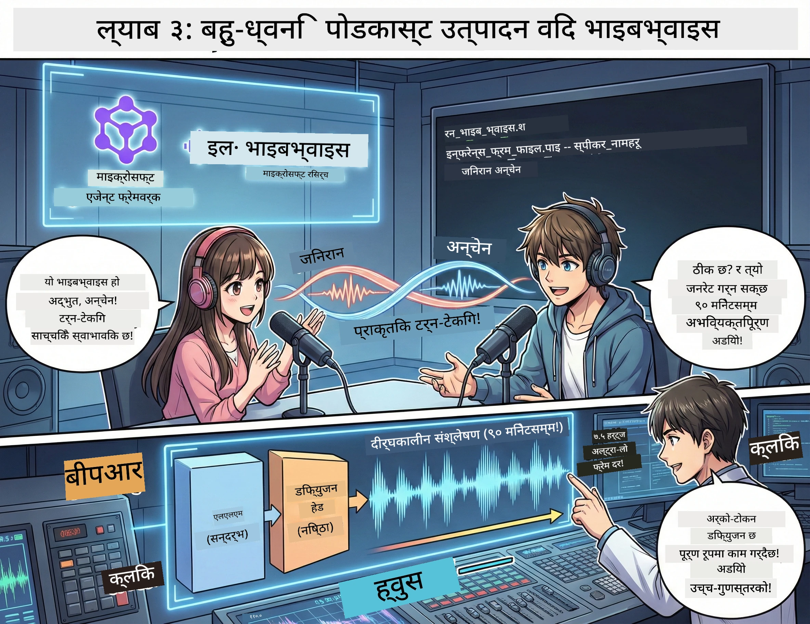

<!--
CO_OP_TRANSLATOR_METADATA:
{
  "original_hash": "d5c8bb53a007e77e7f8afe3067e64c55",
  "translation_date": "2026-01-05T15:54:34+00:00",
  "source_file": "WorkshopForAgentic/translation/zh-cn/03.Multi-SpeakerPodcastGenerationWithVibeVoice.md",
  "language_code": "ne"
}
-->
# तेस्रो幕：तपाईंको पोडकास्टलाई जिउंतो बनाउनुहोस् 🎤



## अन्तिम नतिजा

तपाईंले विषय अनुसन्धान गर्नुभयो। तपाईंले पटकथा लेख्नुभयो। अब अलंकृत गर्ने बेला: वास्तविक आवाजले तपाईंको पाठलाई वास्तविक पोडकास्ट अडियोमा रूपान्तर गर्नुहोस्!

पुग्नुहोस् **VibeVoice** —— माइक्रोसफ्ट रिसर्चको खुला स्रोत TTS (पाठदेखि आवाज) जादू, जसले सिर्जना गर्छ:
- 🎭 प्राकृतिक र सहज संवाद
- 👥 धेरै वक्ताहरू (अधिकतम ४ जना!)
- ⏱️ लामो अवधि अडियो (अधिकतम ९० मिनेट!)
- 🎵 अभिव्यक्तिपूर्ण प्रस्तुती (रोबोट आवाज होइन!)

यो पोडकास्ट संश्लेषणको पछाडि प्रविधि हो। आउँ प्रेरित गरौं तपाईंलाई!

## VibeVoice के हो? (शानदार कुरा)

VibeVoice माइक्रोसफ्ट रिसर्चले संसारलाई दिएको उपहार हो। यो विशेष गरी पोडकास्ट शैलीको संवाद अडियोलाई लक्षित गरेर डिजाइन गरिएको छ।

### किन यो उत्कृष्ट छ 🔥

* **⏱️ म्याराथन सेसनहरू**: लगातार ९० मिनेटसम्मको आवाज उत्पादन गर्न सक्ने (पूरै पोडकास्ट एपिसोड जस्तै!)
* **👥 बहुवक्ता जादू**: अधिकतम ४ भिन्न आवाजहरू, एकै व्यक्तित्वसहित
* **⚡ अत्यन्त प्रभावकारी**: ७.५ Hz को अत्यन्त कम फ्रेम दर प्रयोग गरेर कम्प्युटिङ बचत गर्ने
* **🧠 बुद्धिमान अडियो**: LLM (सन्दर्भ बुझ्ने) र डिफ्युजन मोडेल (यथार्थवादी अडियो सिर्जना गर्ने) को संयोजन
* **🎭 प्राकृतिक र सहज**: स्वचालित रूपले पालो पालो बोल्नु, विरामहरू र संवादको ताल सम्हाल्छ

**सरल भाषामा**: VibeVoice केवल तपाईंको पटकथालाई पढ्दैन — यो मानवजस्तै *अभिनय* गर्छ।

---

## सुरु गर्नु अघि 🚀

**के चाहिन्छ**:

* 🐍 **Python 3.10+** (तपाईंले पहिलो र दोस्रो幕बाट यो छ)
* 🚀 **uv** (एक छिटो Python प्याकेज प्रबन्धक —— हामी यसलाई स्थापना गर्नेछौं)
* 📝 **तपाईंको पटकथा**: दोस्रो幕को `podcast.txt` फाइल (स्थान `../03.Application/` भित्र)

**पेशेवर सुझाव**: यो चरणका लागि राम्रो इन्टरनेट जडान आवश्यक हुन्छ पूर्व-प्रशिक्षित मोडेलहरू डाउनलोड गर्न। कप कफी खानुहोस्!☕

---

## सुरु गरौं! सजिलो तरिका 🎬

हामी यो निकै सजिलो बनाएका छौं। एउटा शेल स्क्रिप्टले सबै काम गर्दछ।

### प्रक्रिया

1. **इसे चलाउन योग्य बनाउनुहोस्**:
```bash
chmod +x run_vibe_voice.sh
```

2. **यसलाई चलाउनुहोस्**:
```bash
./run_vibe_voice.sh
```

3. **जादूको प्रतिक्षा गर्नुहोस्** (पहिलो पटकमा केही मिनेट लाग्न सक्छ)

### पछि के हुन्छ 🎭

स्क्रिप्ट तपाईंको स्वचालित अडियो इन्जिनियर जस्तै छ:

1. **📥 VibeVoice डाउनलोड गर्नुहोस्**: GitHub बाट आधिकारिक रिपोजिटरी क्लोन गर्नुहोस्
2. **📦 निर्भरता स्थापना गर्नुहोस्**: `uv pip` को प्रयोगले छिटो प्याकेज इन्स्टल गर्नुहोस्
3. **🎬 अडियो उत्पादन गर्नुहोस्**: इन्फरेन्स स्क्रिप्ट चलाउनुहोस्, प्रयोग गरेर:
   * `--model_path`：पूर्व-प्रशिक्षित VibeVoice-7B मोडेल
   * `--txt_path`：तपाईंको `podcast.txt` पटकथा
   * `--speaker_names`：आवाज वितरण (पूर्वनिर्धारित Xinran र Anchen)

**परिणाम**: तपाईंको पटकथाले वास्तविक पोडकास्ट एपिसोड बन्छ! 🎉

---

## तपाईंको कार्य 🎯

यो रमाइलो बनाऔं:

### कार्य १：सामग्री सिर्जना गर्नुहोस्
`../03.Application/podcast.txt` मा दुई व्यक्तिबीचको संवाद सम्पादित गर्नुहोस्। यो प्रविधि, रुचि वा जुनसुकै विषयमा हुन सक्छ! केवल संवादात्मक बनाउनुहोस्।

**ढाँचाको उदाहरण**:
```
说话人 1：嘿！你听说新的 AI 模型了吗？
说话人 2：不会吧！告诉我更多！
说话人 1：它叫...
```

### कार्य २：अडियो उत्पादन गर्नुहोस्
स्क्रिप्ट चलाउनुहोस् र जादू हेर्नुहोस्। पहिलो पटक लामो समय लाग्न सक्छ (मोडेल डाउनलोड हुँदैछ)।

### कार्य ३：सुनुवाइ र विश्लेषण
- आवाज प्राकृतिक छ कि छैन?
- वक्ताहरूका आवाज फरक छन् कि छैनन्?
- बोल्ने पालो सहज छ?
- रोबोटिक क्षणहरू छन् कि छैनन्?

### कार्य ४：प्रयोग गर्नुहोस् (साहसीहरूका लागि)
`run_vibe_voice.sh` सम्पादन गरी `--speaker_names` परिवर्तन गरेर विभिन्न आवाज संयोजनहरू प्रयास गर्नुहोस्। VibeVoice मा धेरै पूर्व-प्रशिक्षित आवाजहरू छन्!

**इनाम चुनौती**: ३ वक्ताहरूको संवाद प्रयास गर्नुहोस्! 🎆

---

## थप जान्न 📚

* **🏠 परियोजना गृहपृष्ठ**：[VibeVoice आधिकारिक वेबसाइट](https://microsoft.github.io/VibeVoice/)
* **🤗 पूर्व-प्रशिक्षित मोडेलहरू**：[Hugging Face - VibeVoice-7B](https://huggingface.co/vibevoice/VibeVoice-7B)
* **📖 अनुसन्धान कागजपत्र**: प्रविधिलाई अझ गहिराइमा बुझ्न (यदि तपाईं इच्छुक हुनुहुन्छ भने)

> **⚠️ जिम्मेवार AI सम्झौता**: VibeVoice शक्तिशाली छ। यसको नैतिक प्रयोग गर्नुहोस्! गहिरा नकली वा भ्रामक सामग्री नबनाउनुहोस्। मानिसहरूको मद्दत गर्ने चिजहरू सिर्जना गर्नुहोस्।🙏

---

## 🏆 बधाई! तपाईंले गर्नुभयो!

तपाईंले सम्पूर्ण प्रक्रिया पूरा गर्नुभयो:
1. ✅ **पहिलो幕**: अनुकूलित उपकरणहरू प्रयोग गरेर AI एजेन्ट बनाउनुहोस्
2. ✅ **दोस्रो幕**: बहु एजेन्ट कार्यप्रवाह समन्वय गर्नुहोस्
3. ✅ **तेस्रो幕**：वास्तविक पोडकास्ट अडियो बनाउनुहोस्

**अब तपाईं सँग छ**:
- एक प्रभावकारी AI अनुसन्धान सहयोगी
- एक पूर्ण पोडकास्ट निर्माण कार्यप्रवाह
- वास्तविक अडियो फाइल जसलाई तपाईं साझा गर्न सक्नुहुन्छ

### अर्को कदम? 🚀

**आफ्नो पोडकास्ट सुरु गर्नुहोस्!**
- पोडकास्ट प्लेटफर्ममा अपलोड गर्नुहोस्
- सामाजिक संजालमा साझा गर्नुहोस्
- पुनरावृत्ति र सुधार गर्नुहोस्

**निर्माण जारी राख्नुहोस्!**
- विभिन्न विषयहरू प्रयास गर्नुहोस्
- थप वक्ताहरूको प्रयोग गर्नुहोस्
- पृष्ठभूमि संगीत थप्नुहोस्
- वेब इन्टरफेस विकास गर्नुहोस्
- सम्पूर्ण प्रक्रिया स्वचालित गर्नुहोस्

**आफ्नो सिर्जना साझा गर्नुहोस्!**
हामीलाई ट्याग गर्नुहोस्! विश्वलाई तपाईंले बनाएको कुरा देखाउनुहोस्। AI पोडकास्ट क्रान्ति तपाईंबाट शुरू हुन्छ।🎙️

---

**प्रश्नहरू? विचारहरू? सफलता कथाहरू?** कार्यशालाको च्याटमा सोध्नुहोस्!

**सामग्री सिर्जनाको भविष्यमा स्वागत छ।** 🌟

---

<!-- CO-OP TRANSLATOR DISCLAIMER START -->
**अस्वीकरण**:
यो दस्तावेज AI अनुवाद सेवा [Co-op Translator](https://github.com/Azure/co-op-translator) प्रयोग गरी अनुवाद गरिएको हो। हामी शुद्धतामा प्रयत्नरत छौं, तर कृपया ध्यान दिनुहोस् कि स्वतः अनुवादमा त्रुटिहरू वा असम्बद्धताहरू हुन सक्दछन्। मूल कागजात यसको मूल भाषामा नै आधिकारिक स्रोत मानिनु पर्छ। महत्वपूर्ण जानकारीका लागि व्यावसायिक मानव अनुवाद सिफारिस गरिन्छ। यस अनुवादको प्रयोगबाट उत्पन्न कुनै पनि गलत बुझाइ वा गलत व्याख्याका लागि हामी जिम्मेवार हुनेछैनौं।
<!-- CO-OP TRANSLATOR DISCLAIMER END -->