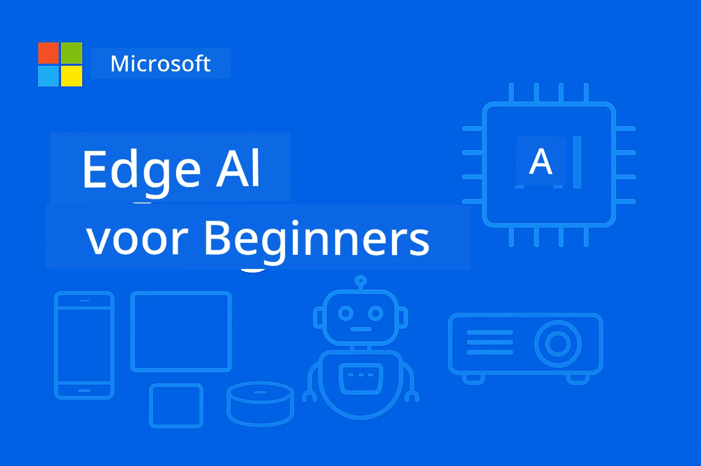

<!--
CO_OP_TRANSLATOR_METADATA:
{
  "original_hash": "ac31463ae3ed21a0ce83b0a351c23dd4",
  "translation_date": "2026-01-05T09:37:10+00:00",
  "source_file": "README.md",
  "language_code": "nl"
}
-->
# EdgeAI voor Beginners 




[](https://GitHub.com/microsoft/edgeai-for-beginners/graphs/contributors)
[](https://GitHub.com/microsoft/edgeai-for-beginners/issues)
[](https://GitHub.com/microsoft/edgeai-for-beginners/pulls)
[](http://makeapullrequest.com)

[](https://GitHub.com/microsoft/edgeai-for-beginners/watchers)
[](https://GitHub.com/microsoft/edgeai-for-beginners/fork)
[](https://GitHub.com/microsoft/edgeai-for-beginners/stargazers)


[](https://discord.gg/nTYy5BXMWG)

Volg deze stappen om te beginnen met het gebruik van deze bronnen:

1. **Fork de Repository**: Klik [](https://GitHub.com/microsoft/edgeai-for-beginners/fork)
2. **Clone de Repository**:   `git clone https://github.com/microsoft/edgeai-for-beginners.git`
3. [**Word lid van The Azure AI Foundry Discord en ontmoet experts en mede-ontwikkelaars**](https://discord.com/invite/ByRwuEEgH4)


### 🌐 Meertalige Ondersteuning

#### Ondersteund via GitHub Action (Geautomatiseerd & Altijd Up-to-Date)

<!-- CO-OP TRANSLATOR LANGUAGES TABLE START -->
[Arabisch](../ar/README.md) | [Bengaals](../bn/README.md) | [Bulgaars](../bg/README.md) | [Birmaans (Myanmar)](../my/README.md) | [Chinees (Vereenvoudigd)](../zh/README.md) | [Chinees (Traditioneel, Hong Kong)](../hk/README.md) | [Chinees (Traditioneel, Macau)](../mo/README.md) | [Chinees (Traditioneel, Taiwan)](../tw/README.md) | [Kroatisch](../hr/README.md) | [Tsjechisch](../cs/README.md) | [Deens](../da/README.md) | [Nederlands](./README.md) | [Ests](../et/README.md) | [Fins](../fi/README.md) | [Frans](../fr/README.md) | [Duits](../de/README.md) | [Grieks](../el/README.md) | [Hebreeuws](../he/README.md) | [Hindi](../hi/README.md) | [Hongaars](../hu/README.md) | [Indonesisch](../id/README.md) | [Italiaans](../it/README.md) | [Japans](../ja/README.md) | [Kannada](../kn/README.md) | [Koreaans](../ko/README.md) | [Litouws](../lt/README.md) | [Maleis](../ms/README.md) | [Malayalam](../ml/README.md) | [Marathi](../mr/README.md) | [Nepalees](../ne/README.md) | [Nigeriaans Pidgin](../pcm/README.md) | [Noors](../no/README.md) | [Perzisch (Farsi)](../fa/README.md) | [Pools](../pl/README.md) | [Portugees (Brazilië)](../br/README.md) | [Portugees (Portugal)](../pt/README.md) | [Punjabi (Gurmukhi)](../pa/README.md) | [Roemeens](../ro/README.md) | [Russisch](../ru/README.md) | [Servisch (Cyrillisch)](../sr/README.md) | [Slowaaks](../sk/README.md) | [Sloveens](../sl/README.md) | [Spaans](../es/README.md) | [Swahili](../sw/README.md) | [Zweeds](../sv/README.md) | [Tagalog (Filipijns)](../tl/README.md) | [Tamil](../ta/README.md) | [Telugu](../te/README.md) | [Thai](../th/README.md) | [Turks](../tr/README.md) | [Oekraïens](../uk/README.md) | [Urdu](../ur/README.md) | [Vietnamees](../vi/README.md)

> **Verkies je lokaal te clonen?**

> Deze repository bevat meer dan 50 taalvertalingen die de downloadgrootte aanzienlijk vergroten. Om te clonen zonder vertalingen, gebruik sparse checkout:
> ```bash
> git clone --filter=blob:none --sparse https://github.com/microsoft/edgeai-for-beginners.git
> cd edgeai-for-beginners
> git sparse-checkout set --no-cone '/*' '!translations' '!translated_images'
> ```
> Dit geeft je alles wat je nodig hebt om de cursus te voltooien met een veel snellere download.
<!-- CO-OP TRANSLATOR LANGUAGES TABLE END -->

**Als je extra vertalingen wilt laten ondersteunen, staan de ondersteunde talen [hier](https://github.com/Azure/co-op-translator/blob/main/getting_started/supported-languages.md) listed**
## Introductie

Welkom bij **EdgeAI voor Beginners** – jouw uitgebreide reis in de transformerende wereld van Edge Kunstmatige Intelligentie. Deze cursus overbrugt de kloof tussen krachtige AI-mogelijkheden en praktische, real-world implementatie op edge-apparaten, waarmee je AI direct kunt benutten waar data wordt gegenereerd en beslissingen moeten worden genomen.

### Wat je zult beheersen

Deze cursus neemt je mee van fundamentele concepten tot productieklare implementaties, met onder andere:
- **Kleine taalmodellen (SLM's)** geoptimaliseerd voor edge-implementatie
- **Hardware-bewuste optimalisatie** over diverse platforms
- **Real-time inferentie** met privacybeschermende functies
- **Productie-implementatiestrategieën** voor enterprise-toepassingen

### Waarom EdgeAI belangrijk is

Edge AI vertegenwoordigt een paradigmaverschuiving die kritieke moderne uitdagingen aanpakt:
- **Privacy & Veiligheid**: Verwerk gevoelige data lokaal zonder blootstelling aan de cloud
- **Real-time prestaties**: Elimineren van netwerkvertraging voor tijdkritische toepassingen
- **Kostenbesparing**: Verminder bandbreedte en cloud computing kosten
- **Robuuste operaties**: Behoud functionaliteit tijdens netwerkuitval
- **Naleving van regelgeving**: Voldoe aan data-soevereiniteitseisen

### Edge AI

Edge AI verwijst naar het lokaal uitvoeren van AI-algoritmen en taalmodellen op hardware, dicht bij waar data wordt gegenereerd, zonder afhankelijk te zijn van cloud resources voor inferentie. Het vermindert latentie, verbetert privacy en maakt real-time besluitvorming mogelijk.

### Kernprincipes:
- **On-device inferentie**: AI-modellen draaien op edge-apparaten (telefoons, routers, microcontrollers, industriële pc's)
- **Offline functionaliteit**: Werkt zonder voortdurende internetverbinding
- **Lage latentie**: Onmiddellijke reacties geschikt voor real-time systemen
- **Data-soevereiniteit**: Houdt gevoelige data lokaal, verbetert beveiliging en naleving

### Kleine Taalmodellen (SLM's)

SLM's zoals Phi-4, Mistral-7B en Gemma zijn geoptimaliseerde versies van grotere LLM's – getraind of gedistilleerd voor:
- **Verminderde geheugendruk**: Efficiënt gebruik van het beperkte geheugen van edge-apparaten
- **Lagere rekenkracht vereiste**: Geoptimaliseerd voor CPU en edge GPU prestaties
- **Snellere opstarttijden**: Snelle initialisatie voor responsieve toepassingen

Ze ontsluiten krachtige NLP-mogelijkheden terwijl ze voldoen aan de beperkingen van:
- **Ingebedde systemen**: IoT-apparaten en industriële controllers
- **Mobiele apparaten**: Smartphones en tablets met offline mogelijkheden
- **IoT-apparaten**: Sensoren en slimme apparaten met beperkte resources
- **Edge-servers**: Lokale verwerkingsunits met beperkte GPU-resources
- **Persoonlijke computers**: Desktop- en laptopimplementatiescenario's

## Cursusmodules & Navigatie

| Module | Onderwerp | Focusgebied | Belangrijkste Inhoud | Niveau | Duur |
|--------|-----------|-------------|---------------------|--------|-------|
| [📖 00 ](./introduction.md) | [Introductie tot EdgeAI](./introduction.md) | Basis & Context | EdgeAI Overzicht • Industry Applications • SLM Introductie • Leerdoelen | Beginner | 1-2 uur |
| [📚 01](../../Module01) | [EdgeAI Basisprincipes](./Module01/README.md) | Cloud vs Edge AI vergelijking | EdgeAI Basisprincipes • Praktijkvoorbeelden • Implementatie Gids • Edge Deployment | Beginner | 3-4 uur |
| [🧠 02](../../Module02) | [SLM Model Fundamenten](./Module02/README.md) | Modelfamilies & architectuur | Phi Family • Qwen Family • Gemma Family • BitNET • μModel • Phi-Silica | Beginner | 4-5 uur |
| [🚀 03](../../Module03) | [SLM Deploy Praktijk](./Module03/README.md) | Lokale & cloud implementatie | Gevorderd leren • Lokale omgeving • Cloud implementatie | Gevorderd beginner | 4-5 uur |
| [⚙️ 04](../../Module04) | [Model Optimalisatie Toolkit](./Module04/README.md) | Cross-platform optimalisatie | Introductie • Llama.cpp • Microsoft Olive • OpenVINO • Apple MLX • Workflow Synthese | Gevorderd beginner | 5-6 uur |
| [🔧 05](../../Module05) | [SLMOps Productie](./Module05/README.md) | Productieoperaties | SLMOps Introductie • Model Distillatie • Fine-tuning • Productie Deploy | Gevorderd | 5-6 uur |
| [🤖 06](../../Module06) | [AI Agents & Function Calling](./Module06/README.md) | Agent frameworks & MCP | Agent Introductie • Function Calling • Model Context Protocol | Gevorderd | 4-5 uur |
| [💻 07](../../Module07) | [Platform Implementatie](./Module07/README.md) | Cross-platform voorbeelden | AI Toolkit • Foundry Local • Windows Development | Gevorderd | 3-4 uur |
| [🏭 08](../../Module08) | [Foundry Local Toolkit](./Module08/README.md) | Productieklaar voorbeelden | Voorbeeldapplicaties (zie details hieronder) | Expert | 8-10 uur |

### 🏭 **Module 08: Voorbeeldapplicaties**

- [01: REST Chat Quickstart](./Module08/samples/01/README.md)
- [02: OpenAI SDK Integratie](./Module08/samples/02/README.md)
- [03: Model Discovery & Benchmarking](./Module08/samples/03/README.md)
- [04: Chainlit RAG Applicatie](./Module08/samples/04/README.md)
- [05: Multi-Agent Orkestratie](./Module08/samples/05/README.md)
- [06: Models-as-Tools Router](./Module08/samples/06/README.md)
- [07: Directe API Client](./Module08/samples/07/README.md)
- [08: Windows 11 Chat App](./Module08/samples/08/README.md)
- [09: Geavanceerd Multi-Agent Systeem](./Module08/samples/09/README.md)
- [10: Foundry Tools Framework](./Module08/samples/10/README.md)

### 🎓 **Workshop: Praktische Leerroute**

Uitgebreide workshopmaterialen met productieklare implementaties:

- **[Workshop Gids](./Workshop/Readme.md)** - Volledige leerdoelen, resultaten en resource navigatie
- **Python Voorbeelden** (6 sessies) - Bijgewerkt met best practices, foutafhandeling en uitgebreide documentatie
- **Jupyter Notebooks** (8 interactieve) - Stapsgewijze tutorials met benchmarks en prestatietoezicht
- **Sessie Gidsen** - Gedetailleerde markdown gidsen voor elke workshopsessie
- **Validatie Tools** - Scripts om codekwaliteit te controleren en smoke tests uit te voeren

**Wat je bouwt:**
- Lokale AI chatapplicaties met streaming ondersteuning
- RAG pipelines met kwaliteitsbeoordeling (RAGAS)
- Benchmark- en vergelijkingstools voor multimodellen
- Multi-agent orkestratiesystemen
- Intelligente modelroutering met taakgebaseerde selectie

### 🎙️ **Workshop voor Agentic: Hands-On - The AI Podcast Studio**

Bouw vanaf nul een AI-gedreven podcast-productiepipeline! Deze meeslepende workshop leert je een compleet multi-agent systeem te creëren dat ideeën omzet in professionele podcastafleveringen.
**[🎬 Start de AI Podcast Studio Workshop](./WorkshopForAgentic/README.md)**

**Jouw Missie**: Lanceer "Future Bytes" — een techpodcast volledig aangedreven door AI-agenten die jij zelf bouwt. Geen cloudafhankelijkheden, geen API-kosten — alles draait lokaal op jouw machine.

**Wat Dit Uniek Maakt:**
- **🤖 Echte Multi-Agent Orkestratie** - Bouw gespecialiseerde AI-agenten die onderzoek doen, schrijven en audio produceren
- **🎯 Compleet Productieproces** - Van onderwerpselectie tot de uiteindelijke podcast audio-uitvoer
- **💻 100% Lokale Implementatie** - Maakt gebruik van Ollama en lokale modellen (Qwen-3-8B) voor volledige privacy en controle
- **🎤 Tekst-naar-Spraak Integratie** - Zet scripts om in natuurlijk klinkende gesprekken met meerdere sprekers
- **✋ Mens-in-de-Lus Werkstromen** - Goedkeuringspoorten garanderen kwaliteit terwijl automatisering wordt behouden

**Drie-Act Leertraject:**

| Act | Focus | Belangrijke Vaardigheden | Duur |
|-----|-------|--------------------------|-------|
| **[Act 1: Ontmoet Je AI Assistants](./WorkshopForAgentic/md/01.BuildAIAgentWithSLM.md)** | Bouw je eerste AI-agent | Toolintegratie • Webzoekmachine • Probleemoplossing • Agentisch redeneren | 2-3 uur |
| **[Act 2: Stel Je Productieteam Samen](./WorkshopForAgentic/md/02.AIAgentOrchestrationAndWorkflows.md)** | Orkestreer meerdere agenten | Teamcoördinatie • Goedkeuringswerkstromen • DevUI-interface • Menselijk toezicht | 3-4 uur |
| **[Act 3: Breng Je Podcast Tot Leven](./WorkshopForAgentic/md/03.Multi-SpeakerPodcastGenerationWithVibeVoice.md)** | Genereer podcast audio | Tekst-naar-spraak • Synthese met meerdere sprekers • Langdurige audio • Volledige automatisering | 2-3 uur |

**Gebruikte Technologieën:**
- **Microsoft Agent Framework** - Multi-agent orkestratie en coördinatie
- **Ollama** - Lokale AI model runtime (geen cloud nodig)
- **Qwen-3-8B** - Open source taalmodel geoptimaliseerd voor agentische taken
- **Tekst-naar-Spraak API’s** - Natuurlijke synthetische stemmen voor podcast productie

**Hardware Ondersteuning:**
- ✅ **CPU-modus** - Werkt op elke moderne computer (8GB+ RAM aanbevolen)
- 🚀 **GPU-versnelling** - Significante snellere inferentie met NVIDIA/AMD GPU’s
- ⚡ **NPU-ondersteuning** - Versnelling met next-gen neurale verwerkingsunits

**Perfect Voor:**
- Ontwikkelaars die multi-agent AI-systemen willen leren
- Iedereen geïnteresseerd in AI-automatisering en werkstromen
- Content creators die AI-geassisteerde productie verkennen
- Studenten die praktische AI-orkestratiepatronen bestuderen

**Begin Met Bouwen**: [🎙️ De AI Podcast Studio Workshop →](./WorkshopForAgentic/README.md)

### 📊 **Samenvatting Leertraject**
- **Totale Duur**: 36-45 uur
- **Beginnerspad**: Modules 01-02 (7-9 uur)  
- **Middenniveau Pad**: Modules 03-04 (9-11 uur)
- **Gevorderd Pad**: Modules 05-07 (12-15 uur)
- **Expertpad**: Module 08 (8-10 uur)

## Wat Je Gaat Bouwen

### 🎯 Kerncompetenties
- **Edge AI Architectuur**: Ontwerp lokaal-primair AI-systemen met cloudintegratie
- **Modeloptimalisatie**: Kwantisatie en compressie van modellen voor edge-deployments (85% snelheidsverbetering, 75% verkleining)
- **Multi-Platform Implementatie**: Windows, mobiel, embedded en cloud-edge hybride systemen
- **Productie Operaties**: Monitoring, schalen en onderhouden van edge AI in productie

### 🏗️ Praktische Projecten
- **Foundry Local Chat Apps**: Windows 11 native toepassing met modelwisselopties
- **Multi-Agent Systemen**: Coördinator met specialistische agenten voor complexe werkstromen  
- **RAG Applicaties**: Lokale documentverwerking met vectorzoekfunctie
- **Model Routers**: Intelligente selectie tussen modellen op basis van taak-analyse
- **API Frameworks**: Productieklaar clients met streaming en health monitoring
- **Cross-Platform Tools**: Integratiepatronen LangChain/Semantic Kernel

### 🏢 Industrie Toepassingen
**Productie** • **Gezondheidszorg** • **Autonome Voertuigen** • **Slimme Steden** • **Mobiele Apps**

## Snel Beginnen

**Aanbevolen Leertraject** (20-30 uur totaal):

0. **📖 Introductie** ([Introduction.md](./introduction.md)): Basis EdgeAI + industrieel kader + leerframework  
1. **📚 Fundament** (Modules 01-02): EdgeAI-concepten + SLM modelfamilies  
2. **⚙️ Optimalisatie** (Modules 03-04): Deployment + kwantisatie frameworks  
3. **🚀 Productie** (Modules 05-06): SLMOps + AI-agenten + functie-aanroepen  
4. **💻 Implementatie** (Modules 07-08): Platformvoorbeelden + Foundry Local toolkit

Elke module bevat theorie, praktische oefeningen en productieklaar codevoorbeeld.

## Carrière-impact

**Technische Rollen**: EdgeAI Solution Architect • ML Engineer (Edge) • IoT AI Developer • Mobiele AI Ontwikkelaar

**Industriesectoren**: Manufacturing 4.0 • HealthTech • Autonome Systemen • FinTech • Consumentenelektronica

**Portfolio Projecten**: Multi-agent systemen • Productie RAG-apps • Cross-platform implementatie • Prestatie-optimalisatie

## Repository Structuur

```
edgeai-for-beginners/
├── 📖 introduction.md  # Foundation: EdgeAI Overview & Learning Framework
├── 📚 Module01-04/     # Fundamentals → SLMs → Deployment → Optimization  
├── 🔧 Module05-06/     # SLMOps → AI Agents → Function Calling
├── 💻 Module07/        # Platform Samples (VS Code, Windows, Jetson, Mobile)
├── 🏭 Module08/        # Foundry Local Toolkit + 10 Comprehensive Samples
│   ├── samples/01-06/  # Foundation: REST, SDK, RAG, Agents, Routing
│   └── samples/07-10/  # Advanced: API Client, Windows App, Enterprise Agents, Tools
├── 🌐 translations/    # Multi-language support (8+ languages)
└── 📋 STUDY_GUIDE.md   # Structured learning paths & time allocation
```

## Hoogtepunten van de Cursus

✅ **Geleidelijke Leerprogressie**: Theorie → Praktijk → Productie-implementatie  
✅ **Echte Casestudies**: Microsoft, Japan Airlines, enterprise implementaties  
✅ **Hands-on Voorbeelden**: 50+ voorbeelden, 10 uitgebreide Foundry Local demo’s  
✅ **Prestatiefocus**: 85% snelheidsverbeteringen, 75% verkleining  
✅ **Multi-Platform**: Windows, mobiel, embedded, cloud-edge hybride  
✅ **Productieklaar**: Monitoring, schalen, beveiliging, compliance frameworks

📖 **[Studiegids Beschikbaar](STUDY_GUIDE.md)**: Gestructureerd 20-uur leertraject met tijdsplanning en zelfevaluatie-instrumenten.

---

**EdgeAI vertegenwoordigt de toekomst van AI-implementatie**: lokaal-primair, privacy-beschermend en efficiënt. Beheers deze vaardigheden om de volgende generatie intelligente applicaties te bouwen.

## Andere Cursussen

Ons team maakt ook andere cursussen! Bekijk:

<!-- CO-OP TRANSLATOR OTHER COURSES START -->
### LangChain
[](https://aka.ms/langchain4j-for-beginners)
[](https://aka.ms/langchainjs-for-beginners?WT.mc_id=m365-94501-dwahlin)

---

### Azure / Edge / MCP / Agents
[](https://github.com/microsoft/AZD-for-beginners?WT.mc_id=academic-105485-koreyst)
[](https://github.com/microsoft/edgeai-for-beginners?WT.mc_id=academic-105485-koreyst)
[](https://github.com/microsoft/mcp-for-beginners?WT.mc_id=academic-105485-koreyst)
[](https://github.com/microsoft/ai-agents-for-beginners?WT.mc_id=academic-105485-koreyst)

---
 
### Generatieve AI Serie
[](https://github.com/microsoft/generative-ai-for-beginners?WT.mc_id=academic-105485-koreyst)
[-9333EA?style=for-the-badge&labelColor=E5E7EB&color=9333EA)](https://github.com/microsoft/Generative-AI-for-beginners-dotnet?WT.mc_id=academic-105485-koreyst)
[-C084FC?style=for-the-badge&labelColor=E5E7EB&color=C084FC)](https://github.com/microsoft/generative-ai-for-beginners-java?WT.mc_id=academic-105485-koreyst)
[-E879F9?style=for-the-badge&labelColor=E5E7EB&color=E879F9)](https://github.com/microsoft/generative-ai-with-javascript?WT.mc_id=academic-105485-koreyst)

---
 
### Kernleren
[](https://aka.ms/ml-beginners?WT.mc_id=academic-105485-koreyst)
[](https://aka.ms/datascience-beginners?WT.mc_id=academic-105485-koreyst)
[](https://aka.ms/ai-beginners?WT.mc_id=academic-105485-koreyst)
[](https://github.com/microsoft/Security-101?WT.mc_id=academic-96948-sayoung)
[](https://aka.ms/webdev-beginners?WT.mc_id=academic-105485-koreyst)
[](https://aka.ms/iot-beginners?WT.mc_id=academic-105485-koreyst)
[](https://github.com/microsoft/xr-development-for-beginners?WT.mc_id=academic-105485-koreyst)

---
 
### Copilot Serie
[](https://aka.ms/GitHubCopilotAI?WT.mc_id=academic-105485-koreyst)
[](https://github.com/microsoft/mastering-github-copilot-for-dotnet-csharp-developers?WT.mc_id=academic-105485-koreyst)
[](https://github.com/microsoft/CopilotAdventures?WT.mc_id=academic-105485-koreyst)
<!-- CO-OP TRANSLATOR OTHER COURSES END -->

## Hulp krijgen

Als je vastloopt of vragen hebt over het bouwen van AI-apps, sluit je dan aan bij:

[](https://discord.gg/nTYy5BXMWG)

Als je productfeedback of fouten hebt tijdens het bouwen, bezoek dan:

[](https://aka.ms/foundry/forum)

---

<!-- CO-OP TRANSLATOR DISCLAIMER START -->
**Disclaimer**:
Dit document is vertaald met behulp van de AI-vertalingsdienst [Co-op Translator](https://github.com/Azure/co-op-translator). Hoewel we streven naar nauwkeurigheid, verzoeken wij u er rekening mee te houden dat geautomatiseerde vertalingen fouten of onnauwkeurigheden kunnen bevatten. Het oorspronkelijke document in de moedertaal dient als de gezaghebbende bron te worden beschouwd. Voor kritieke informatie wordt een professionele menselijke vertaling aanbevolen. Wij zijn niet aansprakelijk voor eventuele misverstanden of verkeerde interpretaties die voortvloeien uit het gebruik van deze vertaling.
<!-- CO-OP TRANSLATOR DISCLAIMER END -->