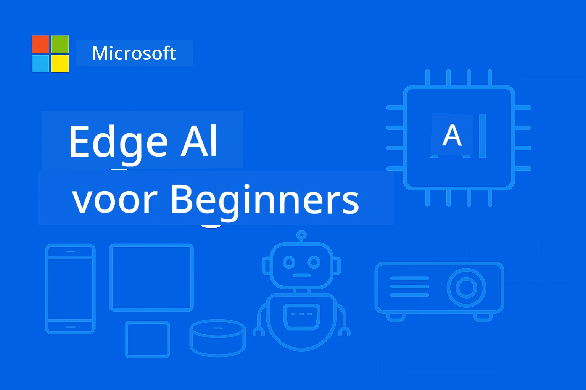

# EdgeAI voor Beginners 




[](https://GitHub.com/microsoft/edgeai-for-beginners/graphs/contributors)
[](https://GitHub.com/microsoft/edgeai-for-beginners/issues)
[](https://GitHub.com/microsoft/edgeai-for-beginners/pulls)
[](http://makeapullrequest.com)

[](https://GitHub.com/microsoft/edgeai-for-beginners/watchers)
[](https://GitHub.com/microsoft/edgeai-for-beginners/fork)
[](https://GitHub.com/microsoft/edgeai-for-beginners/stargazers)


[](https://discord.gg/nTYy5BXMWG)

Volg deze stappen om aan de slag te gaan met deze bronnen:

1. **Fork de Repository**: Klik [](https://GitHub.com/microsoft/edgeai-for-beginners/fork)
2. **Clone de Repository**:   `git clone https://github.com/microsoft/edgeai-for-beginners.git`
3. [**Word lid van The Azure AI Foundry Discord en ontmoet experts en mededevelopers**](https://discord.com/invite/ByRwuEEgH4)


### 🌐 Meertalige Ondersteuning

#### Ondersteund via GitHub Action (Geautomatiseerd & Altijd Up-to-Date)

<!-- CO-OP TRANSLATOR LANGUAGES TABLE START -->
[Arabic](../ar/README.md) | [Bengali](../bn/README.md) | [Bulgarian](../bg/README.md) | [Burmese (Myanmar)](../my/README.md) | [Chinese (Simplified)](../zh-CN/README.md) | [Chinese (Traditional, Hong Kong)](../zh-HK/README.md) | [Chinese (Traditional, Macau)](../zh-MO/README.md) | [Chinese (Traditional, Taiwan)](../zh-TW/README.md) | [Croatian](../hr/README.md) | [Czech](../cs/README.md) | [Danish](../da/README.md) | [Dutch](./README.md) | [Estonian](../et/README.md) | [Finnish](../fi/README.md) | [French](../fr/README.md) | [German](../de/README.md) | [Greek](../el/README.md) | [Hebrew](../he/README.md) | [Hindi](../hi/README.md) | [Hungarian](../hu/README.md) | [Indonesian](../id/README.md) | [Italian](../it/README.md) | [Japanese](../ja/README.md) | [Kannada](../kn/README.md) | [Khmer](../km/README.md) | [Korean](../ko/README.md) | [Lithuanian](../lt/README.md) | [Malay](../ms/README.md) | [Malayalam](../ml/README.md) | [Marathi](../mr/README.md) | [Nepali](../ne/README.md) | [Nigerian Pidgin](../pcm/README.md) | [Norwegian](../no/README.md) | [Persian (Farsi)](../fa/README.md) | [Polish](../pl/README.md) | [Portuguese (Brazil)](../pt-BR/README.md) | [Portuguese (Portugal)](../pt-PT/README.md) | [Punjabi (Gurmukhi)](../pa/README.md) | [Romanian](../ro/README.md) | [Russian](../ru/README.md) | [Serbian (Cyrillic)](../sr/README.md) | [Slovak](../sk/README.md) | [Slovenian](../sl/README.md) | [Spanish](../es/README.md) | [Swahili](../sw/README.md) | [Swedish](../sv/README.md) | [Tagalog (Filipino)](../tl/README.md) | [Tamil](../ta/README.md) | [Telugu](../te/README.md) | [Thai](../th/README.md) | [Turkish](../tr/README.md) | [Ukrainian](../uk/README.md) | [Urdu](../ur/README.md) | [Vietnamese](../vi/README.md)

> **Liever lokaal clonen?**
>
> Deze repository bevat meer dan 50 taalvertalingen, wat de downloadgrootte aanzienlijk vergroot. Om zonder vertalingen te clonen, gebruik sparse checkout:
>
> **Bash / macOS / Linux:**
> ```bash
> git clone --filter=blob:none --sparse https://github.com/microsoft/edgeai-for-beginners.git
> cd edgeai-for-beginners
> git sparse-checkout set --no-cone '/*' '!translations' '!translated_images'
> ```
>
> **CMD (Windows):**
> ```cmd
> git clone --filter=blob:none --sparse https://github.com/microsoft/edgeai-for-beginners.git
> cd edgeai-for-beginners
> git sparse-checkout set --no-cone "/*" "!translations" "!translated_images"
> ```
>
> Dit geeft je alles wat je nodig hebt om de cursus te voltooien met een veel snellere download.
<!-- CO-OP TRANSLATOR LANGUAGES TABLE END -->

**Als je extra vertaalsupport wenst, zijn ondersteunde talen hier vermeld [hier](https://github.com/Azure/co-op-translator/blob/main/getting_started/supported-languages.md)**
## Introductie

Welkom bij **EdgeAI voor Beginners** – jouw uitgebreide reis in de transformerende wereld van Edge Kunstmatige Intelligentie. Deze cursus slaat de brug tussen krachtige AI-capaciteiten en praktische, real-world implementaties op edge-apparaten, waarmee je AI’s potentieel direct kunt benutten waar data wordt gegenereerd en beslissingen moeten worden genomen.

### Wat Je Zult Beheersen

Deze cursus neemt je mee van fundamentele concepten tot productieklaar implementaties, met inbegrip van:
- **Kleine taalmodellen (SLM's)** geoptimaliseerd voor edge-implementatie
- **Hardware-bewuste optimalisatie** op diverse platformen
- **Realtime inferentie** met privacybeschermende mogelijkheden
- **Productie-implementatiestrategieën** voor enterprise toepassingen

### Waarom EdgeAI Ertoe Doet

Edge AI vertegenwoordigt een paradigmaverschuiving die kritieke moderne uitdagingen aanpakt:
- **Privacy & Veiligheid**: Verwerk gevoelige data lokaal zonder blootstelling aan de cloud
- **Realtime Prestaties**: Elimineer netwerkvertraging voor tijdkritieke applicaties
- **Kostenbesparing**: Verminder bandbreedte en cloud computing kosten
- **Veerkrachtige Operaties**: Behoud functionaliteit tijdens netwerkstoringen
- **Naleving van Regelgeving**: Voldoen aan eisen rond datasoevereiniteit

### Edge AI

Edge AI verwijst naar het uitvoeren van AI-algoritmen en taalmodellen lokaal op hardware, dicht bij waar data gegenereerd wordt, zonder afhankelijk te zijn van cloudbronnen voor inferentie. Het vermindert latentie, verbetert privacy en maakt realtime besluitvorming mogelijk.

### Kernprincipes:
- **On-device inferentie**: AI-modellen draaien op edge-apparaten (telefoons, routers, microcontrollers, industriële pc’s)
- **Offline functionaliteit**: Werkt zonder permanente internetverbinding
- **Lage latentie**: Onmiddellijke reacties geschikt voor realtime systemen
- **Datasoevereiniteit**: Houdt gevoelige data lokaal, verbetert veiligheid en compliance

### Kleine Taalmodellen (SLM's)

SLM's zoals Phi-4, Mistral-7B en Gemma zijn geoptimaliseerde versies van grotere LLM's—getraind of gedistilleerd voor:
- **Verminderde geheugenvraag**: Efficiënt gebruik van het beperkte geheugen van edge-apparaten
- **Lagere rekeneisen**: Geoptimaliseerd voor CPU- en edge GPU-prestaties
- **Snellere opstarttijden**: Snelle initialisatie voor responsieve applicaties

Ze ontsluiten krachtige NLP-capaciteiten terwijl ze voldoen aan de beperkingen van:
- **Ingebedde systemen**: IoT-apparaten en industriële controllers
- **Mobiele apparaten**: Smartphones en tablets met offline mogelijkheden
- **IoT-apparaten**: Sensoren en slimme apparaten met beperkte middelen
- **Edge-servers**: Lokale verwerkingsunits met beperkte GPU-bronnen
- **Persoonlijke computers**: Desktop- en laptopimplementatiescenario’s

## Cursusmodules & Navigatie

| Module | Onderwerp | Focusgebied | Belangrijkste Inhoud | Niveau | Duur |
|--------|-----------|-------------|---------------------|--------|------|
| [📖 00 ](./introduction.md) | [Introductie tot EdgeAI](./introduction.md) | Fundament & Context | EdgeAI Overzicht • Toepassingen in de industrie • Introductie SLM • Leerdoelen | Beginner | 1-2 uur |
| [📚 01](../../Module01) | [EdgeAI Fundamenten](./Module01/README.md) | Cloud versus Edge AI vergelijking | EdgeAI Fundamenten • Praktijkcases • Implementatiehandleiding • Edge Deployment | Beginner | 3-4 uur |
| [🧠 02](../../Module02) | [SLM Model Fundamenten](./Module02/README.md) | Modelfamilies & architectuur | Phi Family • Qwen Family • Gemma Family • BitNET • μModel • Phi-Silica | Beginner | 4-5 uur |
| [🚀 03](../../Module03) | [SLM Deployment Praktijk](./Module03/README.md) | Lokale & cloud implementatie | Gevorderd leren • Lokale omgeving • Cloud deployment | Gemiddeld | 4-5 uur |
| [⚙️ 04](../../Module04) | [Model Optimalisatie Toolkit](./Module04/README.md) | Cross-platform optimalisatie | Introductie • Llama.cpp • Microsoft Olive • OpenVINO • Apple MLX • Workflow Synthese | Gemiddeld | 5-6 uur |
| [🔧 05](../../Module05) | [SLMOps Productie](./Module05/README.md) | Productie-operaties | SLMOps Introductie • Modeldistillatie • Fine-tuning • Productie-implementatie | Gevorderd | 5-6 uur |
| [🤖 06](../../Module06) | [AI Agents & Function Calling](./Module06/README.md) | Agent frameworks & MCP | Agent Introductie • Function Calling • Model Context Protocol | Gevorderd | 4-5 uur |
| [💻 07](../../Module07) | [Platform Implementatie](./Module07/README.md) | Cross-platform voorbeelden | AI Toolkit • Foundry Local • Windows Development | Gevorderd | 3-4 uur |
| [🏭 08](../../Module08) | [Foundry Local Toolkit](./Module08/README.md) | Productieklaar voorbeelden | Voorbeeldapplicaties (zie details hieronder) | Expert | 8-10 uur |

### 🏭 **Module 08: Voorbeeldapplicaties**

- [01: REST Chat Quickstart](./Module08/samples/01/README.md)
- [02: OpenAI SDK Integratie](./Module08/samples/02/README.md)
- [03: Model Discovery & Benchmarking](./Module08/samples/03/README.md)
- [04: Chainlit RAG Applicatie](./Module08/samples/04/README.md)
- [05: Multi-Agent Orkestratie](./Module08/samples/05/README.md)
- [06: Models-as-Tools Router](./Module08/samples/06/README.md)
- [07: Directe API Client](./Module08/samples/07/README.md)
- [08: Windows 11 Chat App](./Module08/samples/08/README.md)
- [09: Geavanceerd Multi-Agent Systeem](./Module08/samples/09/README.md)
- [10: Foundry Tools Framework](./Module08/samples/10/README.md)

### 🎓 **Workshop: Hands-On Leertraject**

Uitgebreide hands-on workshopmaterialen met productieklaar implementaties:

- **[Workshop Gids](./Workshop/Readme.md)** - Complete leerdoelen, uitkomsten en bronnennavigatie
- **Python Voorbeelden** (6 sessies) - Bijgewerkt met best practices, foutafhandeling en uitgebreide documentatie
- **Jupyter Notebooks** (8 interactieve) - Stapsgewijze tutorials met benchmarks en prestatiemonitoring
- **Sessiehandleidingen** - Gedetailleerde markdown-gidsen voor elke workshopsessie
- **Validatietools** - Scripts om codekwaliteit te verifiëren en smoke tests uit te voeren

**Wat Je Bouwt:**
- Lokale AI-chatapplicaties met streamingondersteuning
- RAG-pijplijnen met kwaliteitsbeoordeling (RAGAS)
- Multi-model benchmarking en vergelijkingstools
- Multi-agent orkestratiesystemen
- Intelligente modelroutering met taakgerichte selectie

### 🎙️ **Workshop Voor Agentic: Hands-On - The AI Podcast Studio**
Bouw een AI-gestuurde podcastproductie-pijplijn helemaal vanaf nul! Deze meeslepende workshop leert je een compleet multi-agentensysteem te creëren dat ideeën omzet in professionele podcastepisodes.

**[🎬 Start De AI Podcast Studio Workshop](./WorkshopForAgentic/README.md)**

**Jouw Missie**: Lanceer "Future Bytes" — een tech-podcast die volledig wordt aangedreven door AI-agents die jij zelf bouwt. Geen cloudafhankelijkheden, geen API-kosten — alles draait lokaal op jouw machine.

**Wat Dit Uniek Maakt:**
- **🤖 Echte Multi-Agent Orkestratie** - Bouw gespecialiseerde AI-agents die onderzoeken, schrijven en audio produceren
- **🎯 Complete Productiepijplijn** - Van onderwerpkeuze tot uiteindelijke podcastaudio-uitvoer
- **💻 100% Lokale Implementatie** - Gebruikt Ollama en lokale modellen (Qwen-3-8B) voor volledige privacy en controle
- **🎤 Integratie Tekst-naar-Spraak** - Zet scripts om in natuurlijk klinkende meerstemgesprekken
- **✋ Mens-in-de-Lus Workflows** - Goedkeuringspoorten verzekeren kwaliteit en automatisering

**Leerreis in Drie Actes:**

| Act | Focus | Kernvaardigheden | Duur |
|-----|-------|------------------|------|
| **[Act 1: Ontmoet Je AI-Assistenten](./WorkshopForAgentic/md/01.BuildAIAgentWithSLM.md)** | Bouw je eerste AI-agent | Toolintegratie • Websearch • Probleemoplossing • Agentisch redeneren | 2-3 uur |
| **[Act 2: Stel Je Productieteam Samen](./WorkshopForAgentic/md/02.AIAgentOrchestrationAndWorkflows.md)** | Orkestreer meerdere agents | Teamcoördinatie • Goedkeuringsworkflows • DevUI-interface • Menselijke supervisie | 3-4 uur |
| **[Act 3: Breng Je Podcast Tot Leven](./WorkshopForAgentic/md/03.Multi-SpeakerPodcastGenerationWithVibeVoice.md)** | Genereer podcastaudio | Tekst-naar-spraak • Meersprekersynthese • Langdurige audio • Volledige automatisering | 2-3 uur |

**Gebruikte Technologieën:**
- **Microsoft Agent Framework** - Multi-agent orkestratie en coördinatie
- **Ollama** - Lokale AI model runtime (geen cloud nodig)
- **Qwen-3-8B** - Open-source taalmodel geoptimaliseerd voor agentische taken
- **Tekst-naar-Spraak API's** - Natuurlijke stemsynthetisatie voor podcastproductie

**Hardwareondersteuning:**
- ✅ **CPU Modus** - Werkt op elke moderne computer (8GB+ RAM aanbevolen)
- 🚀 **GPU Versnelling** - Veel snellere inferentie met NVIDIA/AMD GPU’s
- ⚡ **NPU Ondersteuning** - Versnelling met next-gen neurale verwerkingsunits

**Perfect Voor:**
- Ontwikkelaars die multi-agent AI-systemen leren
- Iedereen geïnteresseerd in AI-automatisering en workflows
- Contentmakers die AI-geassisteerde productie verkennen
- Studenten die praktische AI-orkestratiepatronen bestuderen

**Begin Met Bouwen**: [🎙️ De AI Podcast Studio Workshop →](./WorkshopForAgentic/README.md)

### 📊 **Overzicht Leertraject**
- **Totale Duur**: 36-45 uur
- **Beginnerstraject**: Modules 01-02 (7-9 uur)  
- **Gemiddeld Niveau**: Modules 03-04 (9-11 uur)
- **Gevorderd Traject**: Modules 05-07 (12-15 uur)
- **Experttraject**: Module 08 (8-10 uur)

## Wat Je Gaat Bouwen

### 🎯 Kerncompetenties
- **Edge AI Architectuur**: Ontwerp lokaal-eerst AI-systemen met cloudintegratie
- **Modeloptimalisatie**: Kwantiseer en comprimeer modellen voor edge-implementatie (85% snelheidsverbetering, 75% volumevermindering)
- **Multi-platform Implementatie**: Windows, mobiel, embedded en cloud-edge hybride systemen
- **Productieoperaties**: Monitoring, schalen en onderhouden van edge AI in productie

### 🏗️ Praktische Projecten
- **Foundry Lokale Chat Apps**: Windows 11 native applicatie met modellenswitching
- **Multi-Agent Systemen**: Coördinator met specialistische agents voor complexe workflows  
- **RAG Applicaties**: Lokale documentverwerking met vectorzoekfunctie
- **Model Routers**: Intelligente selectie tussen modellen op taak-analyse
- **API Frameworks**: Productieklaar met streaming en health-monitoring
- **Cross-Platform Tools**: LangChain/Semantic Kernel integratiepatronen

### 🏢 Industrie Toepassingen
**Fabrikage** • **Gezondheidszorg** • **Autonome Voertuigen** • **Slimme Steden** • **Mobiele Apps**

## Snel Aan de Slag

**Aanbevolen Leerroute** (20-30 uur totaal):

0. **📖 Introductie** ([Introduction.md](./introduction.md)): EdgeAI basis + industrieel kader + leerframework
1. **📚 Fundament** (Modules 01-02): EdgeAI concepten + SLM modelfamilies
2. **⚙️ Optimalisatie** (Modules 03-04): Deployment + kwantisatie frameworks  
3. **🚀 Productie** (Modules 05-06): SLMOps + AI agents + functieaanroepen
4. **💻 Implementatie** (Modules 07-08): Platformsamples + Foundry Local toolkit

Elke module bevat theorie, praktische oefeningen, en productieklaar codevoorbeelden.

## Carrière Effect

**Technische Rollen**: EdgeAI Solutions Architect • ML Engineer (Edge) • IoT AI Developer • Mobiele AI Developer

**Industriesectoren**: Fabriek 4.0 • Gezondheidstechnologie • Autonome Systemen • FinTech • Consumentenelektronica

**Portfolio Projecten**: Multi-agent systemen • Productie RAG apps • Cross-platform deployment • Prestatieoptimalisatie

## Repositorium Structuur

```
edgeai-for-beginners/
├── 📖 introduction.md  # Foundation: EdgeAI Overview & Learning Framework
├── 📚 Module01-04/     # Fundamentals → SLMs → Deployment → Optimization  
├── 🔧 Module05-06/     # SLMOps → AI Agents → Function Calling
├── 💻 Module07/        # Platform Samples (VS Code, Windows, Jetson, Mobile)
├── 🏭 Module08/        # Foundry Local Toolkit + 10 Comprehensive Samples
│   ├── samples/01-06/  # Foundation: REST, SDK, RAG, Agents, Routing
│   └── samples/07-10/  # Advanced: API Client, Windows App, Enterprise Agents, Tools
├── 🌐 translations/    # Multi-language support (8+ languages)
└── 📋 STUDY_GUIDE.md   # Structured learning paths & time allocation
```

## Hoogtepunten van de Cursus

✅ **Progressief Leren**: Theorie → Praktijk → Productie-implementatie  
✅ **Echte Casestudies**: Microsoft, Japan Airlines, enterprise implementaties  
✅ **Hands-on Voorbeelden**: 50+ voorbeelden, 10 uitgebreide Foundry Local demos  
✅ **Prestatiegericht**: 85% snelheidsverbetering, 75% volumevermindering  
✅ **Multi-Platform**: Windows, mobiel, embedded, cloud-edge hybride  
✅ **Productieklaar**: Monitoring, schalen, beveiliging, compliance frameworks

📖 **[Studiegids Beschikbaar](STUDY_GUIDE.md)**: Gestructureerde 20-urige leerroute met tijdadvies en zelfevaluatie-instrumenten.

---

**EdgeAI vertegenwoordigt de toekomst van AI-implementatie**: lokaal-eerst, privacybewust en efficiënt. Beheers deze vaardigheden om de volgende generatie intelligente toepassingen te bouwen.

## Andere Cursussen

Ons team maakt meer cursussen! Bekijk:

<!-- CO-OP TRANSLATOR OTHER COURSES START -->
### LangChain
[](https://aka.ms/langchain4j-for-beginners)
[](https://aka.ms/langchainjs-for-beginners?WT.mc_id=m365-94501-dwahlin)
[](https://github.com/microsoft/langchain-for-beginners?WT.mc_id=m365-94501-dwahlin)
---

### Azure / Edge / MCP / Agents
[](https://github.com/microsoft/AZD-for-beginners?WT.mc_id=academic-105485-koreyst)
[](https://github.com/microsoft/edgeai-for-beginners?WT.mc_id=academic-105485-koreyst)
[](https://github.com/microsoft/mcp-for-beginners?WT.mc_id=academic-105485-koreyst)
[](https://github.com/microsoft/ai-agents-for-beginners?WT.mc_id=academic-105485-koreyst)

---
 
### Generatieve AI Serie
[](https://github.com/microsoft/generative-ai-for-beginners?WT.mc_id=academic-105485-koreyst)
[-9333EA?style=for-the-badge&labelColor=E5E7EB&color=9333EA)](https://github.com/microsoft/Generative-AI-for-beginners-dotnet?WT.mc_id=academic-105485-koreyst)
[-C084FC?style=for-the-badge&labelColor=E5E7EB&color=C084FC)](https://github.com/microsoft/generative-ai-for-beginners-java?WT.mc_id=academic-105485-koreyst)
[-E879F9?style=for-the-badge&labelColor=E5E7EB&color=E879F9)](https://github.com/microsoft/generative-ai-with-javascript?WT.mc_id=academic-105485-koreyst)

---
 
### Kernleren
[](https://aka.ms/ml-beginners?WT.mc_id=academic-105485-koreyst)
[](https://aka.ms/datascience-beginners?WT.mc_id=academic-105485-koreyst)
[](https://aka.ms/ai-beginners?WT.mc_id=academic-105485-koreyst)
[](https://github.com/microsoft/Security-101?WT.mc_id=academic-96948-sayoung)
[](https://aka.ms/webdev-beginners?WT.mc_id=academic-105485-koreyst)
[](https://aka.ms/iot-beginners?WT.mc_id=academic-105485-koreyst)
[](https://github.com/microsoft/xr-development-for-beginners?WT.mc_id=academic-105485-koreyst)

---
 
### Copilot Serie
[](https://aka.ms/GitHubCopilotAI?WT.mc_id=academic-105485-koreyst)
[](https://github.com/microsoft/mastering-github-copilot-for-dotnet-csharp-developers?WT.mc_id=academic-105485-koreyst)
[](https://github.com/microsoft/CopilotAdventures?WT.mc_id=academic-105485-koreyst)
<!-- CO-OP TRANSLATOR OTHER COURSES END -->

## Hulp krijgen

Als je vastloopt of vragen hebt over het bouwen van AI-apps, sluit je aan bij:

[](https://discord.gg/nTYy5BXMWG)

Als je productfeedback hebt of fouten tegenkomt tijdens het bouwen, bezoek dan:

[](https://aka.ms/foundry/forum)

---

<!-- CO-OP TRANSLATOR DISCLAIMER START -->
**Disclaimer**:  
Dit document is vertaald met behulp van de AI-vertalingsservice [Co-op Translator](https://github.com/Azure/co-op-translator). Hoewel we streven naar nauwkeurigheid, dient u er rekening mee te houden dat automatische vertalingen fouten of onnauwkeurigheden kunnen bevatten. Het originele document in de oorspronkelijke taal geldt als de gezaghebbende bron. Voor kritieke informatie wordt professionele menselijke vertaling aanbevolen. Wij zijn niet aansprakelijk voor misverstanden of verkeerde interpretaties die voortvloeien uit het gebruik van deze vertaling.
<!-- CO-OP TRANSLATOR DISCLAIMER END -->