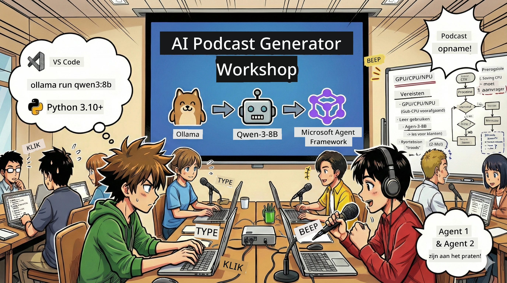
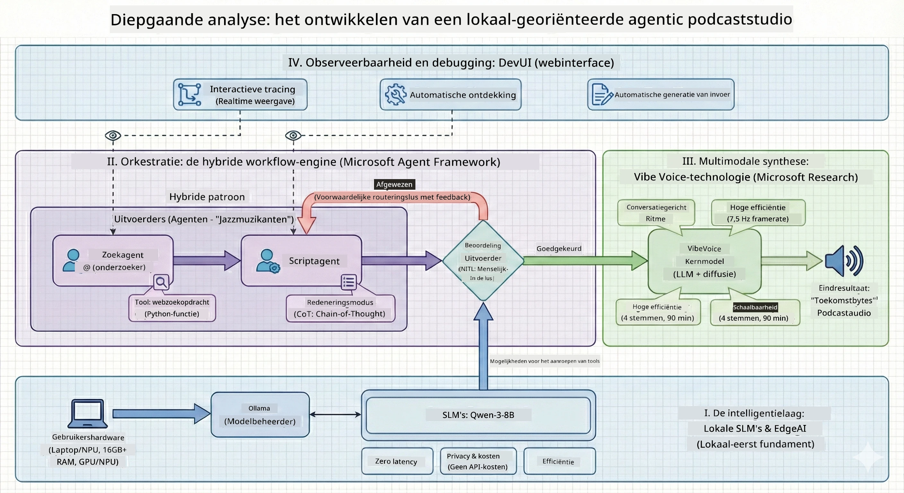

<!--
CO_OP_TRANSLATOR_METADATA:
{
  "original_hash": "f94e745264597bc5d8df967ead2eff97",
  "translation_date": "2026-01-05T10:43:26+00:00",
  "source_file": "WorkshopForAgentic/README.md",
  "language_code": "nl"
}
-->
# 🎙️ The AI Podcast Studio Workshop

> 🌏 [中文版 (Chinese Version)](translation/zh-cn/README.md)



## Jouw Missie

Welkom bij **The AI Podcast Studio**! Je staat op het punt je eigen tech-podcast te lanceren genaamd "Future Bytes" — maar hier is de twist: je bouwt een productie team aangedreven door AI om je te helpen het te maken. Geen eindeloze uren meer onderzoek, scripts schrijven en audio bewerken. In plaats daarvan programmeer je jezelf naar een podcastproducent met AI superkrachten.

## Het Verhaal

Stel je voor: jij en je vrienden willen een podcast starten over de gaafste technologische trends, maar iedereen is druk met school, werk of gewoon het leven. Wat als je een team van AI-agenten kon bouwen om het zware werk te doen? De ene agent onderzoekt onderwerpen, de andere schrijft boeiende scripts, en een derde zet tekst om in natuurlijke gesprekken. Klinkt als sci-fi? Laten we het werkelijkheid maken.

## Wat Je Zal Leren

Aan het einde van deze workshop weet je hoe je:
- 🤖 Je eigen lokale AI-model inzet (geen API-kosten, geen cloud afhankelijkheid!)
- 🔧 Gespecialiseerde AI-agenten bouwt die daadwerkelijk samenwerken
- 🎬 Een complete podcast productielijn maakt van idee tot audio

## Jouw Reis: Drie Acts



Zoals elk goed verhaal hebben we drie acts. Elk bouwt je AI podcaststudio stukje bij beetje op:

| Aflevering | Jouw Queeste | Wat Gebeurt Er | Vaardigheden Ontgrendeld |
|---------|-----------|--------------|----------------|
| **Act 1** | [Ontmoet Je AI Assistenten](md/01.BuildAIAgentWithSLM.md) | Je ontdekt hoe je AI-agenten kunt creëren die kunnen chatten, het web doorzoeken en zelfs problemen oplossen. Zie ze als je onderzoeksstagiairs die nooit slapen. | 🎯 Bouw je eerste agent<br>🛠️ Voorzie hem van superkrachten (tools!)<br>🧠 Leer hem nadenken<br>🌐 Verbind hem met het internet |
| **Act 2** | [Stel Je Productieteam Samen](md/02.AIAgentOrchestrationAndWorkflows.md) | Nu wordt het interessant! Je orkestreert meerdere AI-agenten zodat ze samenwerken als een echt podcastteam. Eén onderzoekt, één schrijft, jij keurt goed — teamwork makes the dream work. | 🎭 Coördineer meerdere agenten<br>🔄 Bouw goedkeuringsworkflows<br>🖥️ Test met DevUI interface<br>✋ Houd mensen in controle |
| **Act 3** | [Breng Je Podcast tot Leven](md/03.Multi-SpeakerPodcastGenerationWithVibeVoice.md) | De finale! Transformeer je tekstscripts in daadwerkelijke podcastaudio met realistische stemmen en natuurlijke gesprekken. Je "Future Bytes"-podcast is klaar om te verzenden! | 🎤 Tekst-naar-spraak magie<br>👥 Meerdere sprekerstemmen<br>⏱️ Lange audio<br>🚀 Volledige automatisering |

Elke act ontgrendelt nieuwe vaardigheden. Sla gerust over als je durft, maar we raden aan het verhaal te volgen!

## Omgevingsvereisten

Deze workshop ondersteunt diverse hardwareomgevingen:
- **CPU**: Geschikt voor testen en kleinschalig gebruik
- **GPU**: Aanbevolen voor productieomgevingen, verbetert inferentiesnelheid aanzienlijk
- **NPU**: Ondersteunt next-generation neural processing unit versnelling

## Wat Je Nodig Hebt

### Software Checklist ✅
- **Python 3.10+** (Je programmeertaal)
- **Ollama** (Draait AI-modellen lokaal)
- **VS Code** (Je code-editor)
- **Python Extensie** (Maakt VS Code slimmer)
- **Git** (Voor code te downloaden)

### Hardware Check 💻
- **Kan ik dit draaien?**: 8GB RAM, 10GB vrije ruimte (werkt, maar kan traag zijn)
- **Ideale setup**: 16GB+ RAM, een degelijke GPU (vlot!)
- **Heb je een NPU?**: Nog beter! Next-gen prestaties ontgrendeld 🚀

## Zet Je Studio Op 🎬

### Stap 1: Python Kracht

Zorg dat je Python 3.10 of nieuwer hebt:

```bash
python --version
# Moet Python 3.10.x of hoger tonen
```
  
Geen Python? Haal het van [python.org](https://python.org) — het is gratis!

### Stap 2: Download Ollama (Je AI Model Runner)

Ga naar [ollama.ai](https://ollama.ai) en download Ollama voor jouw besturingssysteem. Zie het als de motor die je AI modellen lokaal laat draaien.

Check of het klaar is:

```bash
ollama --version
```
  
### Stap 3: Download Je AI Brein 🧠

Het is tijd om het Qwen-3-8B model te halen (het is alsof je je eerste AI-assistent inhuurt):

```bash
ollama pull qwen3:8b
```
  
*Dit kan een paar minuten duren. Perfect moment voor een koffiepauze! ☕*

### Stap 4: Zet VS Code op

Download [Visual Studio Code](https://code.visualstudio.com/) als je het nog niet hebt. Het is de beste code-editor die er is (daag me uit 😄).

### Stap 5: Python Extensie

In VS Code:
1. Druk op `Ctrl+Shift+X` (of `Cmd+Shift+X` op Mac)
2. Zoek "Python"
3. Installeer de officiële Python-extensie van Microsoft

### Stap 6: Je Bent Klaar! 🎉

Serieus, je bent klaar om te knallen. Laten we wat AI-magie bouwen!

### Stap 7: Installeer Microsoft Agent Framework en Gerelateerde Pakketten 📦

Installeer alle benodigde afhankelijkheden voor de workshop:

```bash
pip install -r ./Installations/requirements.txt -U
```
  
*Dit installeert Microsoft Agent Framework en alle benodigde pakketten. Pak een koffie — de eerste setup kan een paar minuten duren! ☕*

## Workshop Instructies

De gedetailleerde projectstructuur, configuratiestappen en uitvoeringsmethoden worden tijdens de workshop stap-voor-stap uitgelegd.

## Probleemoplossing (Wanneer het misgaat) 🔧

### "Ugh, het downloaden van het model duurt eeuwig!"
**Oplossing**: Gebruik een VPN of configureer Ollama met een mirror bron. Soms heeft het internet gewoon een hekel aan ons.

### "Mijn computer geeft het op! Geen geheugen meer!"
**Oplossing**: Schakel over naar een kleiner model of pas de instelling `num_ctx` aan om minder geheugen te gebruiken. Zie het als een dieet voor je AI.

### "Kan ik dit versnellen met mijn GPU?"
**Oplossing**: Ollama detecteert GPU's automatisch! Zorg er wel voor dat je GPU-stuurprogramma's up-to-date zijn. Gratis snelheidsboost! 🏎️

## Extra Bronnen (Voor de Nieuwsgierigen) 📚

- [Ollama Docs](https://github.com/ollama/ollama) — Diepgaande info over lokale AI-modellen  
- [Microsoft Agent Framework](https://microsoft.github.io/autogen/) — Leer meer over het bouwen van agent-teams  
- [Qwen Model Info](https://qwenlm.github.io/) — Ontmoet het brein van je AI-assistent

## Licentie

MIT-licentie — Bouw gave dingen, deel ze, maak de wereld beter! 🌍

## Wil je Bijdragen?

Een bug gevonden? Een idee? Laat een Issue of PR achter! We houden van community vibes. ✨

---

<!-- CO-OP TRANSLATOR DISCLAIMER START -->
**Disclaimer**:  
Dit document is vertaald met behulp van de AI-vertalingsdienst [Co-op Translator](https://github.com/Azure/co-op-translator). Hoewel we streven naar nauwkeurigheid, dient u er rekening mee te houden dat geautomatiseerde vertalingen fouten of onnauwkeurigheden kunnen bevatten. Het originele document in de oorspronkelijke taal moet als het gezaghebbende referentie worden beschouwd. Voor kritieke informatie wordt professionele menselijke vertaling aanbevolen. Wij zijn niet aansprakelijk voor misverstanden of verkeerde interpretaties die voortvloeien uit het gebruik van deze vertaling.
<!-- CO-OP TRANSLATOR DISCLAIMER END -->