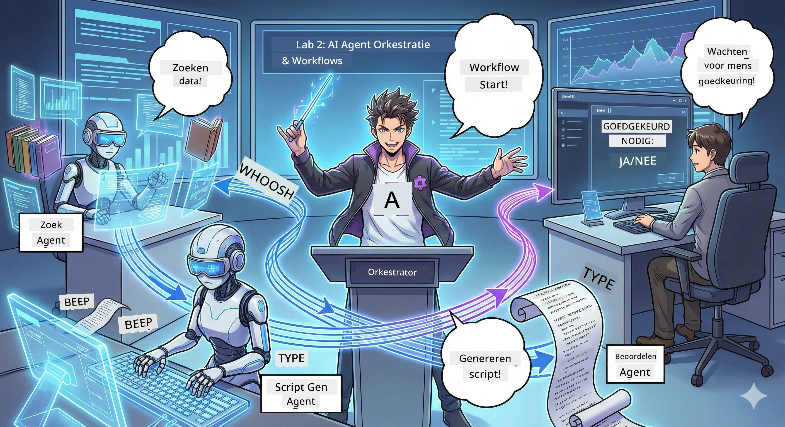

# Act 2: Stel Je Podcast Productieteam Samen 🎬



## Het Verhaal Wordt Spannender

Alex (je AI-assistent uit Act 1) is geweldig, maar één agent kan niet een hele podcaststudio runnen. Je hebt een *team* nodig:
- 🔍 **Onderzoeksagent**: Speurt het internet af naar verse info
- ✍️ **Scriptagent**: Zet onderzoek om in boeiende dialogen
- 👤 **Jij (De Editor)**: Keurt scripts goed of stuurt ze terug voor herschrijvingen

Welkom bij **AI Agent Orchestratie** — waar jij de regisseur wordt van je eigen AI-crew. Denk aan Avengers, maar dan voor podcastproductie.

## Wat is Agent Orchestratie? (De Simpele Versie)

Stel je voor dat je een restaurant runt. Je doet niet alles zelf, toch? Je hebt:
- 🍳 Een chef die kookt
- 👨‍🍳 Een souschef die voorbereidt
- 👩‍🍳 Een ober die serveert

Agent orchestratie is hetzelfde idee, maar dan met AI. Elke agent heeft een specialiteit en jij coördineert ze om grotere doelen te bereiken. Geen enkele agent wordt overweldigd en het werk gaat sneller.

### De Band Metafoor 🎸

Je AI-agents zijn als een band:
- **Leadzanger**: De hoofdagent die klantgerichte taken uitvoert
- **Drummer**: Houdt het ritme aan, verwerkt achtergrondtaken  
- **Basgitarist**: Ondersteunt iedereen, haalt data op
- **Jij (Bandmanager)**: Coördineert alles!

Zonder coördinatie? Alleen maar lawaai. Met orchestratie? Prachtige muziek.

### Waarom Dit Belangrijk Is

Één AI-agent die alles probeert = burn-out. Gespecialiseerde agents die samenwerken = maximale efficiëntie! 🚀

**Eerlijk gezegd**: Herinner je je nog hoe het was om alleen te moeten onderzoeken, schrijven én editen? Ja, dat is niet leuk. Met orchestratie doet elke agent waar hij het beste in is. Jij neemt alleen de eindbeslissingen.

**Reëel Voorbeeld**: Klantenservicebots die weten wanneer ze facturering, technische issues afhandelen of wanneer ze een mens moeten inschakelen. Dat is orchestratie!

## Agent vs. Workflow: Wat is het Verschil?

Denk er zo over na:

### 🤖 AI Agent = Jazzmuzikant
- **Beslist ter plekke** op basis van wat hij hoort
- **Improviseert** oplossingen met zijn tools
- **Denkt** met een LLM-brein
- **Past zich aan** aan alles wat jij hem geeft

### 🎵 Workflow = Orkest dat Klassieke Muziek Speelt  
- **Volgt een partituur** (vooraf gedefinieerde stappen)
- **Voorspelbaar** uitvoeringspad
- **Coördineert** meerdere agents, mensen, systemen
- **Gestructureerd** als een recept

**De Magie**: Workflows *orkestreren* agents! Jij bouwt een workflow die agents vertelt wanneer ze hun rol moeten spelen. Het beste van twee werelden. 🎭

## Drie Manieren om Je AI-Crew te Coördineren

### 1. 🎯 Gecentraliseerd (Jij bent de Baas)

Één hoofdagent bepaalt alles. Zie het als het managen van een team — jij bepaalt wie wat en wanneer doet.

**Voordelen**:
- ✅ Duidelijke leiding (geen verwarring)
- ✅ Consistente beslissingen
- ✅ Makkelijk te debuggen

**Gebruik het voor**:
- Klantenservice routing ("Gaat het over facturering of technische ondersteuning?")
- Workflow voor contentgoedkeuring ("Is dit script goedgekeurd?")
- Podcastproductie (precies wat we bouwen!)

### 2. 🤝 Gedecentraliseerd (Agents Organiseren Zichzelf)

Agents communiceren direct met elkaar en lossen samen zaken op. Net als een groepschat waar iedereen coördineert.

**Voordelen**:
- ✅ Gemakkelijk schaalbaar (voeg op elk moment agents toe)
- ✅ Geen enkel falenpunt
- ✅ Agents werken natuurlijk samen

**Gebruik het voor**:
- Onderzoeksteams (ieder agent verkent andere bronnen)
- Brainstormsessies
- Gedistribueerd probleemoplossen

### 3. 🔀 Hybride (Het Beste van Twee Werelden)

Jij zet de algemene koers uit, maar agents krijgen vrijheid om taken zelf te organiseren. Net als een CEO die zijn team vertrouwt.

**Perfect voor**: Complexe projecten die zowel controle als flexibiliteit nodig hebben.

## Microsoft Agent Framework: Je Orkestratie Toolkit 🧰

Tijd om te bouwen! Dit ga je gebruiken:

### De Bouwstenen

#### 1. 🧱 Executors (Je Werkers)
- **Wat ze zijn**: Individuele verwerkingsunits — kunnen agents of custom logica zijn
- **Wat ze doen**: Nemen input, werken, produceren output
- **Denk aan hen als**: Stations op een assemblagelijn

#### 2. ➡️ Edges (De Verbindingen)
- **Wat ze zijn**: Paden tussen executors
- **Wat ze doen**: Beheren de berichtstroom ("Na A, ga naar B")
- **Denk aan hen als**: Pijlen op een stroomdiagram

#### 3. 🗺️ Workflows (Het Grote Plan)
- **Wat ze zijn**: De volledige grafiek van executors + edges
- **Wat ze doen**: Definiëren het hele proces van begin tot eind
- **Denk aan hen als**: Jouw blauwdruk voor de productielijn

### Coole Features Die Je Gaat Waarderen

**🛡️ Typeveiligheid**: Berichten tussen agents worden getypecheckt. Geen "Oeps, verkeerd datatype" verrassingen.

**🔀 Flexibele Routing**: 
- If-then voorwaarden ("Als goedgekeurd, publiceer; anders herschrijf")
- Parallelle verwerking (meerdere agents werken tegelijk)
- Dynamische paden (workflow past zich aan op basis van resultaten)

**🔌 Externe Integratie**:
- Koppel met API’s
- Voeg mens-in-de-lus checkpunten toe (jij keurt goed voor publicatie)
- Bouw request/response flows

**💾 Checkpointing**: Sla voortgang op! Als iets crasht, ga door waar je was gebleven.

**🤝 Multi-Agent Coördinatie**:
- Agents in volgorde laten draaien (A → B → C)
- Ze tegelijk laten draaien (A + B + C in parallel)
- Overdracht tussen agents
- Samenwerkende verwerking

## Best Practices (Pro Tips) 🎯

### 1. Houd Het Modulaire
Elke agent doet ÉÉN ding echt goed. Maak geen “superagent” die alles doet — daar krijg je spijt van bij debuggen.

### 2. Plan Voor Fouten
Agents maken fouten. Netwerken haperen. Bouw foutafhandeling en backup-plannen in. Je toekomstige ik zal je dankbaar zijn.

### 3. Monitor Alles
Houd bij wat je agents doen. Gebruik DevUI (komen we zo op) om workflows in actie te zien.

### 4. Optimaliseer Berichtgrootte
Stuur geen gigantische bestanden tussen agents. Houd berichten klein en snel.

### 5. Kies Het Juiste Patroon
Wil je controle? Kies gecentraliseerd. Wil je schaal? Kies gedecentraliseerd. Twijfel je? Ga hybride!

## DevUI: Je Workflow Debugger 🔍

### Wat is DevUI?

DevUI is een speelveld om je agents en workflows te testen. Het is een webinterface waar je kunt:
- 👀 Je workflow live zien draaien
- 💬 Direct chatten met agents
- 🔍 Debuggen wanneer iets misgaat
- 📊 Traces en performance metrics bekijken

> **Belangrijk**: DevUI is alleen voor ontwikkeling! Gebruik het niet in productie. Zie het als je lokale testomgeving.

### Wat Het Geweldig Maakt

- **🖥️ Interactieve Web UI**: Klikken, typen, testen — geen command line nodig
- **📁 Drag-en-Drop Klaar**: Upload bestanden, test met verschillende inputs
- **📂 Auto-Discovery**: Richt het op een map, het vindt automatisch al je agents
- **📋 Geen Setup Modus**: Registreer agents in code, geen mappenstructuur nodig
- **🔌 OpenAI Compatibel**: Werkt met OpenAI SDK (compatibiliteit FTW!)
- **👁️ Tracing Ingebouwd**: Zie precies wat je agents doen

### Hoe Input Werkt

DevUI is slim met inputs:

- **Agents testen?** Je krijgt tekstvakken en knopjes om bestanden te uploaden
- **Workflows testen?** De UI maakt inputvelden automatisch aan op basis van wat de workflow verwacht

Het lijkt magie, maar het is gewoon goede code. ✨

## Jouw Missies: Bouw een Podcaststudio 🎬

### Missie 1: Maak Een Enkele Agent met DevUI

📂 [01.AgentDevUI](../../../../WorkshopForAgentic/code/02.Workflow/01.AgentDevUI)

**De Uitdaging**: Voordat je een heel team bouwt, testen we DevUI met één agent: een websearch specialist.

**Wat Je Bouwt**:
Een onderzoeksagent die het internet kan doorzoeken voor podcastonderwerpen. Je test hem via DevUI’s webinterface op `http://localhost:8090`.

**Vaardigheden die je Leert**:
- 🚀 Agents lanceren in DevUI
- 🔍 Agentreacties in realtime testen
- 🛠️ Custom tools bouwen (web search)
- 📊 Tracing aanzetten om issues te debuggen
- 🖥️ De interactieve web UI gebruiken

**De Code**:
- `agent.py`: Jouw SearchAgent met superkrachten voor websearch
- Gebruikt OllamaChatClient om te verbinden met Qwen
- Implementeert de functie `web_search()`
- Start met `serve()` — opent DevUI automatisch

**Succescriteria**: Vraag je agent "Wat is trending in AI?" en zie hem het web doorzoeken! 🎉

### Missie 2: Bouw Een Multi-Agent Workflow

📂 [02.WorkflowDevUI](../../../../WorkshopForAgentic/code/02.Workflow/02.WorkflowDevUI)

**De Uitdaging**: Nu wordt het echt leuk! Bouw een complete podcastproductie workflow met:
1. 🔍 **Search Agent** → Onderzoekt je onderwerp
2. ✍️ **Script Agent** → Schrijft een dialoog tussen twee hosts (in het Chinees!)
3. 👤 **Review Executor** → Vraagt JOU om goed te keuren of af te wijzen
4. 🔄 **Loop Back** → Bij afwijzing, herschrijft op basis van jouw feedback

**Vaardigheden die je Leert**:
- 🧱 Gespecialiseerde agents maken voor verschillende taken
- 🔗 Agents verbinden met WorkflowBuilder
- 🔀 Goedkeuringsloops maken (mens-in-de-lus!)
- 🚦 Voorwaardelijke routing (goedgekeurd vs afgewezen)
- 🔧 Custom executors bouwen voor bedrijfslogica

**De Workflow**:
```
SearchAgent → ScriptAgent → ReviewExecutor
                             ↑          ↓ (if rejected)
                             ←─────────
```

**De Code**:
- `search_agent/agent.py`: Jouw onderzoeksspecialist
- `generate_script_agent/agent.py`: Jouw scenarioschrijver (schrijft in het Chinees!)
- `workflow/workflow.py`: Hier gebeurt de orkestratie magie
- `main.py`: Start alles in DevUI

**Succescriteria**: Geef een onderwerp, review het script, wijs één keer af om de loop te testen, en keur dan goed! 🎉

### Missie 3: Bouw Een Console App

📂 [03.Application](../../../../WorkshopForAgentic/code/02.Workflow/03.Application)

**De Uitdaging**: Neem je workflow uit DevUI en maak er een strakke terminalapp van met gekleurde output, laad-animaties en file saving. Dit is klaar voor productie!

**Vaardigheden die je Leert**:
- ⚡ Workflows programma-matig draaien (zonder DevUI)
- 📡 Event-driven architectuur met streaming
- 🎨 Mooie terminal UI maken (kleuren, spinners, progress bars)
- 💾 Finale scripts naar bestanden opslaan
- 🔄 Async workflows afhandelen met Python’s asyncio

**Wat Het Doet**:
1. Vraagt om een podcastonderwerp
2. Laat realtime voortgang zien ("Search Agent is bezig…")
3. Toont het gegenereerde script met kleuren
4. Vraagt je goedkeuring
5. Slaat goedgekeurd script op als `podcast.txt`

**De Code**:
- `podcast_app.py`: Jouw hoofdapp met event handling
- `workflow.py`: Hergebruikt de workflow van Missie 2
- Handelt events af: `AgentRunUpdateEvent`, `RequestInfoEvent`, `WorkflowOutputEvent`
- Gebruikt ANSI-kleuren voor styling in terminal

**Succescriteria**: Run de app, maak een podcastscript en zie het opgeslagen worden! Je hebt een echt tool gebouwd. 🚀

## Wat Je Beheerst Nu 🏆

Na Act 2 kun je:

- ✅ Meerdere AI agents orkestreren als een baas
- ✅ Workflows bouwen met sequentiële én voorwaardelijke logica
- ✅ Menselijke goedkeuring checkpoints toevoegen
- ✅ DevUI gebruiken om workflows te testen en debuggen
- ✅ Productieklare console applicaties maken
- ✅ Fouten netjes afhandelen in complexe systemen
- ✅ Het juiste orchestratiepatroon kiezen voor elk project

## Als Dingen Misgaan 🔧

### "Mijn workflow is te ingewikkeld!"
**Oplossing**: Breek hem op in kleinere sub-workflows. Elke workflow doet ÉÉN ding goed. Koppel ze aan elkaar indien nodig.

### "Ik kan niet volgen wat er gebeurt!"
**Oplossing**: Gebruik workflow checkpointing om status op te slaan. Zet tracing aan in DevUI om elke stap te zien.

### "De fout van één agent laat alles crashen!"
**Oplossing**: Voeg foutafhandelingsgrenzen toe. Elke agent moet zijn eigen fouten afvangen en fallback gedrag hebben.

### "Dit duurt zóóó lang"
**Oplossing**: Kunnen agents parallel draaien? Sequentiële workflows zijn makkelijk maar traag. Zoek kansen voor parallelisatie!

## Handige Bronnen 🔗

- [Workflow Docs](https://learn.microsoft.com/en-us/agent-framework/user-guide/workflows/overview) — Officiële Microsoft handleidingen
- [Orchestration Patterns](https://www.ibm.com/think/topics/ai-agent-orchestration) — IBM’s visie hierop
- [Agent Framework GitHub](https://github.com/microsoft/agent-framework) — Bekijk de broncode
- [Codevoorbeelden](https://github.com/microsoft/agent-framework/tree/main/python/samples) — Steel hier patronen

---

**Klaar voor de finale?** Je hebt je script. Laten we het nu omzetten in echte audio! → [Act 3: Breng je podcast tot leven](03.Multi-SpeakerPodcastGenerationWithVibeVoice.md) 🎤

---

**Vastgelopen? Verward? Enthousiast?** Deel het in de workshopchat! We leren allemaal samen. 🚀

---

<!-- CO-OP TRANSLATOR DISCLAIMER START -->
**Disclaimer**:
Dit document is vertaald met behulp van de AI-vertalingsservice [Co-op Translator](https://github.com/Azure/co-op-translator). Hoewel we streven naar nauwkeurigheid, dient u er rekening mee te houden dat automatische vertalingen fouten of onnauwkeurigheden kunnen bevatten. Het originele document in de oorspronkelijke taal moet worden beschouwd als de gezaghebbende bron. Voor kritieke informatie wordt een professionele menselijke vertaling aanbevolen. Wij zijn niet aansprakelijk voor eventuele misverstanden of verkeerde interpretaties die voortvloeien uit het gebruik van deze vertaling.
<!-- CO-OP TRANSLATOR DISCLAIMER END -->