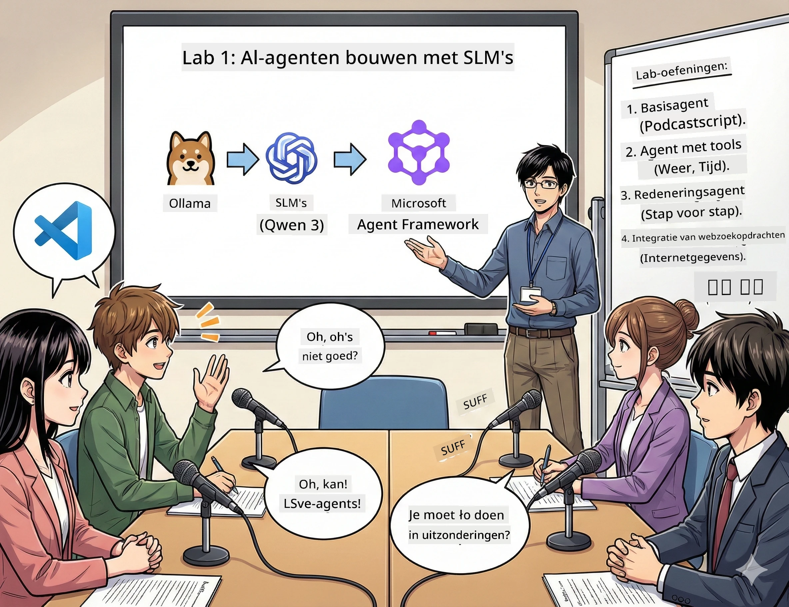

# Eerste Akte: Maak kennis met je AI-onderzoeksassistent 🤖

## Uitdaging

Je lanceert "Future Bytes", je nieuwe tech-podcast. De eerste aflevering gaat over de nieuwste AI-doorbraken, maar je hebt slechts 24 uur om:
1. Het onderwerp te onderzoeken
2. Betrouwbare bronnen te vinden
3. Een boeiend script te schrijven
4. Het natuurlijk te laten klinken

**Plotwending**: je hoeft dit niet alleen te doen. Je staat op het punt je eerste AI-assistent te bouwen die je hiermee kan helpen. Laten we hem Alex noemen – je onvermoeibare onderzoekspartner die nooit slaap nodig heeft.

## Waarom kiezen voor kleine taalmodellen? (Spoiler: ze zijn geweldig)

Zie kleine taalmodellen (SLM) als persoonlijke AI die op *jouw* computer draait. Geen cloud, geen maandelijkse kosten, geen twijfelachtige data-uitwisseling.

**Waarom SLM zo🔥 zijn:**
- **🏠 Draait op jouw apparaat**: laptop, desktop of zelfs een krachtige Raspberry Pi
- **💸 Geen doorlopende kosten**: geen API-kosten die je geld opeten
- **🔒 Privacy eerst**: je data verlaat je apparaat nooit
- **⚡ Razendsnel**: geen netwerkvertraging, directe reacties
- **🪦 Lichtgewicht**: 1-10 miljard parameters vs. grote modellen met 100 miljard+

**Populaire SLM's**: Qwen 3, Phi-4, Gemma 3 (dit workshop gebruikt Qwen)

## Je toolkit

### Ollama: je AI-modelmanager

[Ollama](https://ollama.com/) is als Steam voor AI-modellen. Download, run en beheer modellen met eenvoudige commando’s.

**Wat het zo cool maakt:**
- Download en run elk model met één commando
- Werkt op Mac, Windows, Linux
- Gebruikt automatisch GPU als je die hebt
- Super geheugenbesparend

### Microsoft Agent Framework: waar de magie gebeurt

[Microsoft Agent Framework](https://github.com/microsoft/agent-framework) is de speeltuin waarin je AI-agents bouwt die kunnen:

- 💬 Chatten en onthouden wat jullie bespreken
- 🛠️ Aangepaste tools gebruiken (zoals web zoeken of het weer checken)
- 🧠 Complexe problemen stap voor stap overdenken
- 🤝 Samenwerken als team met andere agents
- 🔌 Verbinden met verschillende AI-providers (OpenAI, Ollama, Azure)

**Bouwstenen:**
- **Agents**: AI-assistenten met specifieke taken
- **Tools**: speciale vaardigheden die je aan ze geeft
- **Memory**: zodat ze je gesprekken niet vergeten
- **Reasoning**: ze leren nadenken, niet alleen reageren

## Je trainingsmontage: 4 taken

### Taak 1: Maak je eerste agent

📓 [Open Notebook](../../code/01.BasicAgent/00.BasicAgent-agent.ipynb)

**Opdracht**: Bouw Alex, je AI-scriptschrijver voor je podcast. Alex moet een dialoog schrijven tussen twee hosts die technologiethema’s bespreken.

**Wat je leert:**
- Hoe je een AI-agent wakker maakt (makkelijker dan wakker worden op maandag)
- Geef hem persoonlijkheid en instructies
- Laat hem echte podcastscripts genereren
- Begrijp zijn antwoorden

**Succescriterium**: Alex maakt het script voor je pilotaflevering van "Future Bytes" over AI! 🎯

### Taak 2: Geef Alex superkrachten (Tools!)

📓 [Open Notebook](../../code/01.BasicAgent/01.BasicAgent-tools.ipynb)

**Opdracht**: Alex is slim, maar weet niet wat het weer is of hoe laat het is. Laten we hem dat geven via tools!

**Wat je leert:**
- Maak aangepaste Python-functies als “tools”
- Laat Alex zelf bepalen *wanneer* hij welke tool gebruikt
- Bekijk hoe hij problemen zelfstandig oplost
- Combineer meerdere tools voor complexe taken

**Succescriterium**: Vraag “Hoe is het weer in Tokio?” en Alex zoekt het zelf op! ☁️

### Taak 3: Leer Alex nadenken

📓 [Open Notebook](../../code/01.BasicAgent/02.BasicAgent-reasoning.ipynb)

**Opdracht**: Laat Alex zijn denkproces tonen. Bij een probleem wil je zien *hoe* hij denkt, niet alleen het antwoord.

**Wat je leert:**
- Zet “reasoning mode” aan (zoals je werk uitschrijven in wiskunde)
- Zie Alex’ stapsgewijze denkproces
- Begrijp chain-of-thought prompts
- Debug als Alex het moeilijk heeft

**Succescriterium**: Stel een pittige wiskundige vraag en zie Alex nadenken! 🧠

### Taak 4: Verbind Alex met het internet

📓 [Open Notebook](../../code/01.BasicAgent/03.BasicAgent-websearch.ipynb)

**Opdracht**: Alex’ kennis stopt op een bepaald moment. Laten we hem verbinden met het web voor real-time info!

**Wat je leert:**
- Bouw een aangepaste webzoektool
- Integreer externe API’s
- Handel netjes om met netwerkfouten
- Krijg info die buiten Alex’ trainingsdata ligt

**Succescriterium**: Vraag naar het technologienieuws van vandaag en krijg de laatste updates! 📰

## Voordat je begint 🚀

**Vereiste uitrusting**:
- Python 3.10+ geïnstalleerd
- Ollama draait (controleer met `ollama --version`)
- VS Code met Python-extensie
- Minstens 8GB RAM (voor soepel werken liever 16GB)

## Volgorde van taken

Volg de notebooks op volgorde voor de volledige ervaring:

1. [00.BasicAgent-agent.ipynb](../../code/01.BasicAgent/00.BasicAgent-agent.ipynb) — Ontmoet Alex (je eerste agent)
2. [01.BasicAgent-tools.ipynb](../../code/01.BasicAgent/01.BasicAgent-tools.ipynb) — Tijd voor upgrades!
3. [02.BasicAgent-reasoning.ipynb](../../code/01.BasicAgent/02.BasicAgent-reasoning.ipynb) — Leer Alex nadenken
4. [03.BasicAgent-websearch.ipynb](../../code/01.BasicAgent/03.BasicAgent-websearch.ipynb) — Ontgrendel internettoegang!

## Wat je zult beheersen

Na de eerste akte kun je:

- ✅ AI-modellen draaien op je eigen hardware (geen cloud nodig!)
- ✅ Agents bouwen met aangepaste persoonlijkheid en vaardigheden
- ✅ Agents tools geven om echte problemen op te lossen
- ✅ Agents hun redeneerproces laten tonen
- ✅ Agents verbinden met externe databronnen
- ✅ Debuggen als er iets misgaat

## Als er iets misgaat (en hoe op te lossen) 🔧

### "Alex laadt niet! Niet genoeg geheugen!"
**Oplossing**: Je computer worstelt. Probeer andere apps te sluiten of een kleiner model te kiezen. 8GB is het minimum.

### "Alex is te langzaam"
**Oplossing**: Zet GPU-versnelling aan in Ollama-instellingen. Of verklein de contextwindow. Speed demon modus aan! 🏎️

### "Tools werken niet!"
**Oplossing**: Controleer zorgvuldig je functiesignatuur. Alex heeft correcte type-aanduidingen nodig om tools te begrijpen. Zie het als het geven van duidelijke instructies.

## Nuttige links 🔗

- [Agent Framework documentatie](https://github.com/microsoft/agent-framework) — Officiële gids en voorbeelden
- [Ollama modellenbibliotheek](https://ollama.com/library) — Bekijk alle beschikbare modellen
- [Qwen model](https://ollama.com/library/qwen3) — Leer het brein van je AI-assistent kennen
- [Codevoorbeelden](https://github.com/microsoft/agent-framework/tree/main/python/samples) — Steel ideeën hier vandaan

## Wat’s next: Tweede Akte 🎬

Je hebt een agent. Maar wat als je *een team* agents samen laat werken? In de tweede akte bouw je een complete podcastproductiecrew:
- **Research agents**: vinden de beste bronnen
- **Script agents**: maken het perfecte script
- **Editor (jij!)**: keurt goed of vraagt om wijzigingen

Laten we wat AI-magie orkestreren! → [Tweede Akte: Stel je productieteam samen](02.AIAgentOrchestrationAndWorkflows.md)

---

**Vastgelopen?** Stel vragen tijdens de workshop. We leren samen! 🙌

---

<!-- CO-OP TRANSLATOR DISCLAIMER START -->
**Disclaimer**:  
Dit document is vertaald met behulp van de AI vertaaldienst [Co-op Translator](https://github.com/Azure/co-op-translator). Hoewel wij streven naar nauwkeurigheid, dient u er rekening mee te houden dat geautomatiseerde vertalingen fouten of onnauwkeurigheden kunnen bevatten. Het originele document in de oorspronkelijke taal geldt als de gezaghebbende bron. Voor cruciale informatie wordt een professionele menselijke vertaling aanbevolen. Wij zijn niet aansprakelijk voor eventuele misverstanden of verkeerde interpretaties die voortvloeien uit het gebruik van deze vertaling.
<!-- CO-OP TRANSLATOR DISCLAIMER END -->