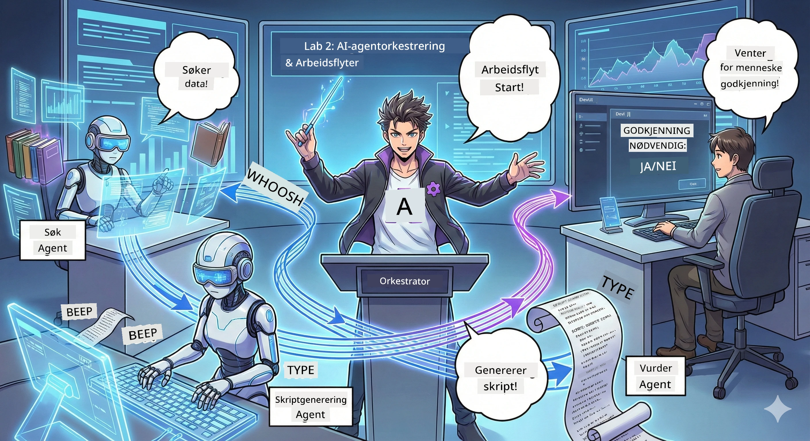

# Akt 2: Sett sammen podcast-produksjonsteamet ditt 🎬



## Plottet tetter seg til

Alex (din AI-assistent fra Akt 1) er fantastisk, men én agent kan ikke drive et helt podcast-studio alene. Du trenger et *team*:
- 🔍 **Forskningsagent**: Leter på nettet etter fersk info
- ✍️ **Manusagent**: Gjør forskning om til engasjerende dialog
- 👤 **Du (Redaktøren)**: Godkjenner manus eller sender dem tilbake for omskriving

Velkommen til **AI Agent Orkestrering** — der du blir regissøren for ditt eget AI-team. Tenk Avengers, men for podcast-produksjon.

## Hva er agentorkestrering? (Den enkle versjonen)

Se for deg at du driver en restaurant. Du gjør ikke alt selv, ikke sant? Du har:
- 🍳 En kokk som lager maten
- 👨‍🍳 En soussjef som forbereder
- 👩‍🍳 En servitør som serverer

Agentorkestrering er samme idé, men med AI. Hver agent har et spesialfelt, og du koordinerer dem for å nå større mål. Ingen enkelt agent blir overveldet, og arbeidet blir gjort raskere.

### Bandanalogien 🎸

Dine AI-agenter er som et band:
- **Forsanger**: Hovedagent som håndterer kundevendte oppgaver
- **Trommeslager**: Holder rytmen, håndterer bakgrunnsprosesser  
- **Bassist**: Støtter alle, henter data
- **Du (Band Manager)**: Koordinerer det hele!

Uten koordinering? Bare støy. Med orkestrering? Vakkert samspill.

### Hvorfor dette betyr noe

Én AI-agent som prøver å gjøre alt = utbrenthet. Spesialiserte agenter som jobber sammen = effektivitet låst opp! 🚀

**Realistisk**: Husker du da du prøvde å forske, skrive OG redigere podcasten alene? Ja, det suger. Med orkestrering gjør hver agent det den er best på. Du tar de endelige avgjørelsene.

**Virkelig eksempel**: Kundestøtteboter som vet når de skal håndtere fakturering vs. tekniske problemer vs. når de skal ringe inn et menneske. Det er orkestrering!

## Agent vs. arbeidsflyt: Hva er forskjellen?

Se på det slik:

### 🤖 AI-agent = Jazzmusiker
- **Tar avgjørelser på sparket** basert på det den hører
- **Improviser** løsninger med sine verktøy
- **Tenker** med en LLM-hjerne
- **Tilpasser seg** alt du gir den

### 🎵 Arbeidsflyt = Orkester som spiller klassisk musikk  
- **Følger en partitur** (forhåndsdefinerte trinn)
- **Forutsigbar** gjennomføringsvei
- **Koordinerer** flere agenter, mennesker, systemer
- **Strukturert** som en oppskrift

**Magien**: Arbeidsflyter *orkestrerer* agenter! Du bygger en arbeidsflyt som forteller agentene når de skal spille sin rolle. Det beste av begge verdener. 🎭

## Tre måter å koordinere AI-teamet ditt på

### 1. 🎯 Sentralisert (Du er sjefen)

Én hovedagent tar alle avgjørelser. Tenk det som at du leder et team — du bestemmer hvem som gjør hva og når.

**Fordeler**:
- ✅ Klart lederskap (ingen forvirring)
- ✅ Konsistente avgjørelser
- ✅ Lett å feilsøke

**Bruk det til**:
- Kundeserviceruting ("Er dette fakturering eller teknisk støtte?")
- Godkjenningsarbeidsflyter for innhold ("Godkjenner dette manuset?")
- Podcast-produksjon (akkurat det vi bygger!)

### 2. 🤝 Desentralisert (Agenter selvorganiserer seg)

Agenter snakker direkte med hverandre og finner ut av ting som en gruppe. Som en gruppechat der alle koordinerer.

**Fordeler**:
- ✅ Skalerer lett (legg til flere agenter når som helst)
- ✅ Ingen enkelt feilpunkt
- ✅ Agenter samarbeider naturlig

**Bruk det til**:
- Forskningslag (hver agent utforsker ulike kilder)
- Idémyldringer
- Distribuert problemløsning

### 3. 🔀 Hybrid (Det beste fra begge verdener)

Du setter den overordnede retningen, men agentene har frihet til å organisere seg selv på oppgaver. Som en CEO som stoler på teamet sitt.

**Perfekt for**: Komplekse prosjekter som trenger både kontroll og fleksibilitet.

## Microsoft Agent Framework: Ditt orkestreringsverktøy 🧰

Tid for bygging! Her er hva du skal bruke:

### Byggesteinene

#### 1. 🧱 Kjørere (Dine arbeidere)
- **Hva de er**: Enkeltprosesseringsenheter — kan være agenter eller egendefinert logikk
- **Hva de gjør**: Tar input, gjør arbeid, produserer output
- **Tenk på dem som**: Stasjoner i en samlebåndslinje

#### 2. ➡️ Kanter (Forbindelsene)
- **Hva de er**: Veier mellom kjørere
- **Hva de gjør**: Kontrollerer meldingstrøm ("Etter A, gå til B")
- **Tenk på dem som**: Piler på et flytskjema

#### 3. 🗺️ Arbeidsflyter (Hovedplanen)
- **Hva de er**: Det komplette nettverket av kjørere + kanter
- **Hva de gjør**: Definerer hele prosessen fra start til slutt
- **Tenk på dem som**: Blueprinten for produksjonspipelinen din

### Kule funksjoner du vil elske

**🛡️ Typesikkerhet**: Meldinger mellom agenter er typekontrollert. Ingen "Oops, feil datatype"-overraskelser.

**🔀 Fleksibel ruting**: 
- Hvis-da betingelser ("Hvis godkjent, publiser; ellers, skriv om")
- Parallelle prosesser (flere agenter jobber samtidig)
- Dynamiske stier (arbeidsflyten tilpasser seg basert på resultat)

**🔌 Ekstern integrasjon**:
- Koble til API-er
- Legg til menneskelig godkjenningspunkter (du godkjenner før publisering)
- Bygg forespørsels-/responssflyter

**💾 Sjekkpunkter**: Lagre fremdriften! Hvis noe krasjer, fortsett der du slapp.

**🤝 Multi-agent koordinering**:
- Kjør agenter i rekkefølge (A → B → C)
- Kjør dem parallelt (A + B + C samtidig)
- Overfør mellom agenter
- Samarbeidende prosessering

## Beste praksis (Pro-tips) 🎯

### 1. Hold det modulært  
Hver agent bør gjøre ÉN ting skikkelig bra. Ikke lag en "superagent" som gjør alt — du vil angre når du feilsøker.

### 2. Planlegg for feil  
Agenter feiler. Nettverk feiler. Bygg inn feilhåndtering og backupløsninger. Fremtidige deg vil takke deg.

### 3. Overvåk alt  
Følg med på hva agentene dine gjør. Bruk DevUI (vi skal komme tilbake til det!) for å se arbeidsflyter i aksjon.

### 4. Optimaliser meldingsstørrelse  
Ikke send store filer mellom agenter. Hold meldingene slanke og raske.

### 5. Velg riktig mønster  
Trenger du kontroll? Gå for sentralisert. Trenger du skala? Gå desentralisert. Klarer du ikke å bestemme? Velg hybrid!

## DevUI: Din arbeidsflyt-feilsøker 🔍

### Hva er DevUI?

DevUI er som en lekeplass for å teste agentene og arbeidsflytene dine. Det er et nettgrensesnitt der du kan:
- 👀 Se arbeidsflyten i aksjon
- 💬 Chatte direkte med agenter
- 🔍 Feilsøke når noe går galt
- 📊 Se spor og ytelsesstatistikk

> **Viktig**: DevUI er kun for utvikling! Ikke bruk det i produksjon. Tenk på det som ditt lokale testmiljø.

### Hva gjør det fantastisk

- **🖥️ Interaktivt web-UI**: Klikk, skriv, test — ingen kommandolinje nødvendig
- **📁 Dra-og-slipp klar**: Last opp filer, test med ulik input
- **📂 Automatisk oppdagelse**: Pek på en mappe, så finner det alle agentene dine automatisk
- **📋 Ingen oppsett-modus**: Registrer agenter i kode, ingen mappekrav
- **🔌 OpenAI-kompatibelt**: Fungerer med OpenAI SDK (kompatibilitet FTW!)
- **👁️ Innebygd sporing**: Se nøyaktig hva agentene dine gjør

### Hvordan input fungerer

DevUI er smart med input:

- **Tester du agenter?** Du får tekstbokser og filopplasting
- **Tester du arbeidsflyter?** UI genererer automatisk inputfelt basert på hva arbeidsflyten forventer

Det er som magi, men bare god kode. ✨

## Oppdragene dine: Bygg et podcast-studio 🎬

### Oppdrag 1: Lag en enkelt agent med DevUI

📂 [01.AgentDevUI](../../../../WorkshopForAgentic/code/02.Workflow/01.AgentDevUI)

**Utfordringen**: Før du bygger et helt team, la oss teste DevUI med én agent: en web-søk spesialist.

**Hva du bygger**:  
En forskningsagent som kan søke på internett etter podcast-emner. Du tester den via DevUIs webgrensesnitt på `http://localhost:8090`.

**Ferdigheter du lærer**:  
- 🚀 Starte agenter i DevUI  
- 🔍 Teste agentrespons i sanntid  
- 🛠️ Bygge egendefinerte verktøy (web-søk)  
- 📊 Aktivere sporing for feilsøking  
- 🖥️ Bruke det interaktive web-UIet

**Koden**:  
- `agent.py`: Din SearchAgent med superkrefter for nettsøk  
- Bruker OllamaChatClient for å koble til Qwen  
- Implementerer `web_search()` verktøyfunksjon  
- Starter med `serve()` — åpner DevUI automatisk

**Seiersbetingelse**: Spør agenten din "Hva trender innen AI?" og se den søke på nettet! 🎉

### Oppdrag 2: Bygg en arbeidsflyt med flere agenter

📂 [02.WorkflowDevUI](../../../../WorkshopForAgentic/code/02.Workflow/02.WorkflowDevUI)

**Utfordringen**: Nå begynner moroa! Bygg en komplett arbeidsflyt for podcast-produksjon med:  
1. 🔍 **Søkeagent** → Forsker på emnet ditt  
2. ✍️ **Manusagent** → Skriver en dialog mellom to verter (på kinesisk!)  
3. 👤 **Gjennomgangsutfører** → Ber DEG godkjenne eller avvise  
4. 🔄 **Løkke tilbake** → Hvis avvist, skriver om basert på tilbakemeldingen din

**Ferdigheter du lærer**:  
- 🧱 Lage spesialiserte agenter for forskjellige jobber  
- 🔗 Koble agenter med WorkflowBuilder  
- 🔀 Implementere godkjenningsløkker (menneske-i-løkken!)  
- 🚦 Betinget ruting (godkjent vs. avvist)  
- 🔧 Lage egendefinerte utførere for forretningslogikk

**Arbeidsflyten**:  
```
SearchAgent → ScriptAgent → ReviewExecutor
                             ↑          ↓ (if rejected)
                             ←─────────
```
  
**Koden**:  
- `search_agent/agent.py`: Din forskningsekspert  
- `generate_script_agent/agent.py`: Din manusforfatter (skriver på kinesisk!)  
- `workflow/workflow.py`: Orkestreringsmagien skjer her  
- `main.py`: Starter alt i DevUI

**Seiersbetingelse**: Gi et emne, gjennomgå manus, avvis det en gang for å teste løkka, så godkjenn! 🎉

### Oppdrag 3: Lag en konsollapp

📂 [03.Application](../../../../WorkshopForAgentic/code/02.Workflow/03.Application)

**Utfordringen**: Ta arbeidsflyten din fra DevUI og gjør det til en stilig terminalapp med fargede utskrifter, lastespinnere og fil-lagring. Dette er produksjonsklart!

**Ferdigheter du lærer**:  
- ⚡ Kjøre arbeidsflyter programmessig (uten DevUI)  
- 📡 Hendelsesdrevet arkitektur med streaming  
- 🎨 Lage flotte terminal-UIer (farger, spinnere, fremdriftslinjer)  
- 💾 Lagre sluttmanus til filer  
- 🔄 Håndtere asynkrone arbeidsflyter med Python asyncio

**Hva den gjør**:  
1. Spør etter et podcast-emne  
2. Viser fremdrift i sanntid ("Søkeagent jobber...")  
3. Viser generert manus med farger  
4. Spør etter din godkjenning  
5. Lagre godkjent manus til `podcast.txt`

**Koden**:  
- `podcast_app.py`: Hovedappen din med hendelseshåndtering  
- `workflow.py`: Gjenbruker arbeidsflyten fra Oppdrag 2  
- Håndterer hendelser: `AgentRunUpdateEvent`, `RequestInfoEvent`, `WorkflowOutputEvent`  
- Bruker ANSI-farger for terminalstil

**Seiersbetingelse**: Kjør appen, lag et podcast-manus og se det lagret! Du har laget et ekte verktøy. 🚀

## Hva du har mestret 🏆

Etter Akt 2 kan du:

- ✅ Orkestrere flere AI-agenter som en sjef  
- ✅ Bygge arbeidsflyter med både sekvensiell og betinget logikk  
- ✅ Legge til menneskelige godkjenningspunkter  
- ✅ Bruke DevUI for å teste og feilsøke arbeidsflyter  
- ✅ Lage produksjonsklare konsollapplikasjoner  
- ✅ Håndtere feil elegant i komplekse systemer  
- ✅ Velge riktig orkestreringsmønster for ethvert prosjekt

## Når ting går galt 🔧

### "Arbeidsflyten min er for komplisert!"  
**Løsningen**: Del den opp i mindre underarbeidsflyter. Hver arbeidsflyt bør gjøre ÉN ting skikkelig bra. Knytt dem sammen ved behov.

### "Jeg klarer ikke å holde oversikt over hva som skjer!"  
**Løsningen**: Bruk arbeidsflytsjekkpunkter for å lagre status. Aktiver sporing i DevUI for å se hvert steg.

### "En agents feil krasjer alt!"  
**Løsningen**: Legg til feilgjerder. Hver agent skal håndtere egne feil og ha fallback-logikk.

### "Dette går sååå tregt"  
**Løsningen**: Kan noen agenter kjøre parallelt? Sekvensielle arbeidsflyter er enkle, men trege. Se etter muligheter for parallellisering!

## Nyttige ressurser 🔗

- [Workflow Docs](https://learn.microsoft.com/en-us/agent-framework/user-guide/workflows/overview) — Offisielle Microsoft-guider  
- [Orchestration Patterns](https://www.ibm.com/think/topics/ai-agent-orchestration) — IBMs syn på det  
- [Agent Framework GitHub](https://github.com/microsoft/agent-framework) — Se gjennom kildekoden
- [Kodeeksempler](https://github.com/microsoft/agent-framework/tree/main/python/samples) — Stjel mønstre herfra

---

**Klar for finalen?** Du har fått skriptet ditt. Nå la oss gjøre det om til faktisk lyd! → [Akt 3: Gi podcasten din liv](03.Multi-SpeakerPodcastGenerationWithVibeVoice.md) 🎤

---

**Fast? Forvirret? Spent?** Del i workshop-chatten! Vi lærer alle sammen. 🚀

---

<!-- CO-OP TRANSLATOR DISCLAIMER START -->
**Ansvarsfraskrivelse**:
Dette dokumentet er oversatt ved hjelp av AI-oversettelsestjenesten [Co-op Translator](https://github.com/Azure/co-op-translator). Selv om vi streber etter nøyaktighet, vennligst vær oppmerksom på at automatiske oversettelser kan inneholde feil eller unøyaktigheter. Det opprinnelige dokumentet på originalsproget bør betraktes som den autoritative kilden. For kritisk informasjon anbefales profesjonell menneskelig oversettelse. Vi påtar oss ikke ansvar for misforståelser eller feiltolkninger som oppstår som følge av bruk av denne oversettelsen.
<!-- CO-OP TRANSLATOR DISCLAIMER END -->