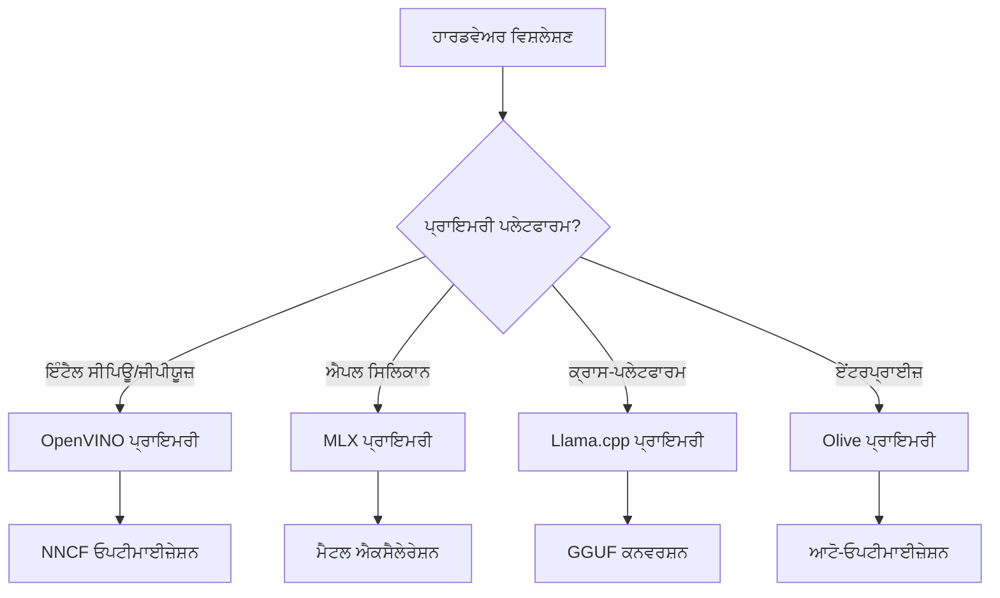
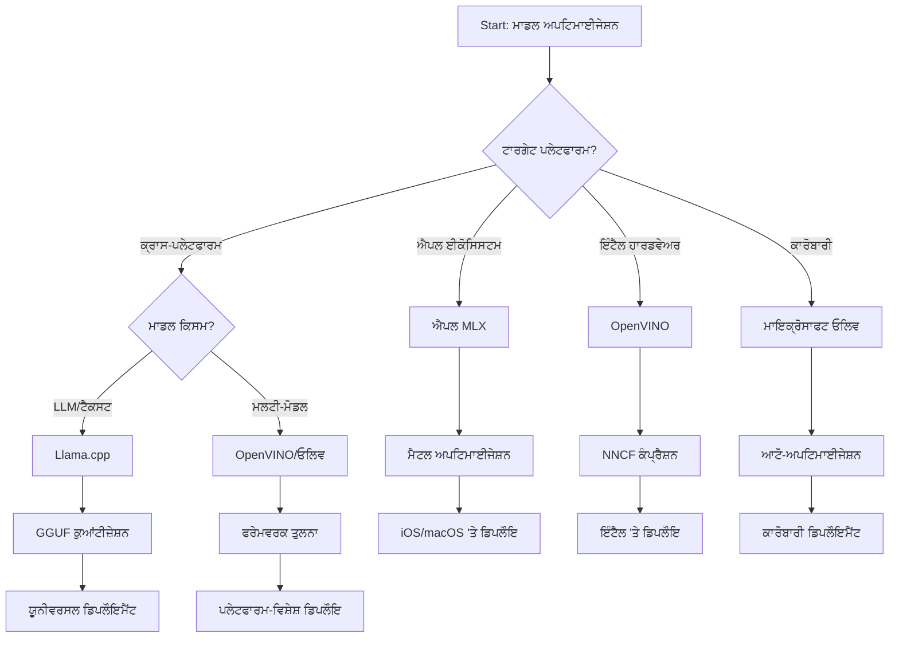
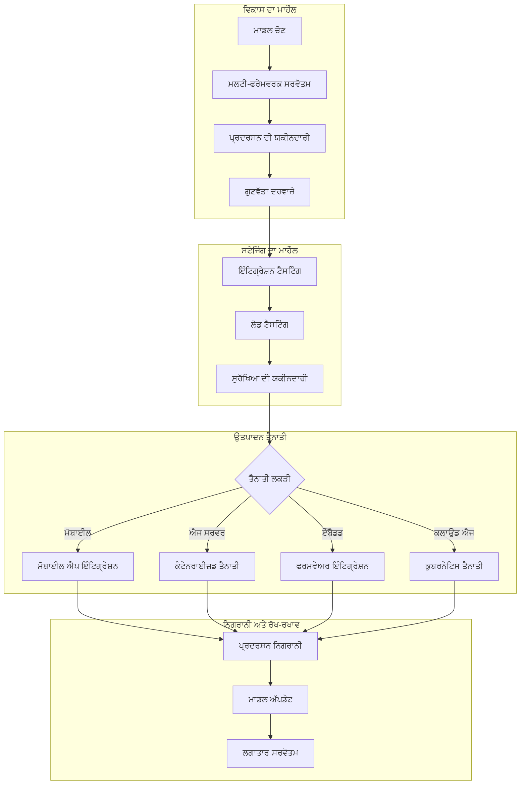

# ਭਾਗ 6: ਐਜ਼ ਐਆਈ ਵਿਕਾਸ ਵਰਕਫਲੋ ਸਿੰਥੇਸਿਸ

## ਸਮੱਗਰੀ ਸਾਰਣੀ
1. [ਪ੍ਰਸਤਾਵਨਾ](#ਪ੍ਰਸਤਾਵਨਾ)
2. [ਸਿੱਖਣ ਦੇ ਉਦੇਸ਼](#ਸਿੱਖਣ-ਦੇ-ਉਦੇਸ਼)
3. [ਇਕਸਾਰ ਵਰਕਫਲੋ ਜਾਇਜ਼ਾ](#ਇਕਸਾਰ-ਵਰਕਫਲੋ-ਜਾਇਜ਼ਾ)
4. [ਫਰੇਮਵਰਕ ਚੋਣ ਮੈਟ੍ਰਿਕਸ](#ਫਰੇਮਵਰਕ-ਚੋਣ-ਮੈਟ੍ਰਿਕਸ)
5. [ਸ੍ਰੇਸ਼ਠ ਅਭਿਆਸ ਸਿੰਥੇਸਿਸ](#ਵਧੀਆ-ਅਭਿਆਸ-ਸਿੰਥੇਸਿਸ)
6. [ਡਿਪਲੋਇਮੈਂਟ ਰਣਨੀਤੀ ਗਾਈਡ](#ਤਾਇਨਾਤੀ-ਰਣਨੀਤੀ-ਮਾਰਗਦਰਸ਼ਨ)
7. [ਕਾਰਗੁਜ਼ਾਰੀ ਸੁਧਾਰ ਵਰਕਫਲੋ](#ਕਾਰਗੁਜ਼ਾਰੀ-ਦੁਰੁਸਤਗੀ-ਵਰਕਫਲੋ)
8. [ਉਤਪਾਦਨ ਤਿਆਰੀ ਚੈੱਕਲਿਸਟ](#ਪੈਦਾਵਾਰੀ-ਤਿਆਰੀ-ਚੈਕਲਿਸਟ)
9. [ਸਮੱਸਿਆ-ਸੁਧਾਰ ਅਤੇ ਨਿਗਰਾਨੀ](#ਮੁਸ਼ਕਲ-ਸੁਲਝਾਉਣਾ-ਅਤੇ-ਮਾਨੀਟਰਿੰਗ)
10. [ਆਪਣੇ ਐਜ਼ ਐਆਈ ਪਾਈਪਲਾਈਨ ਦਾ ਭਵਿੱਖ-ਸੁਰੱਖਿਆ](#ਆਪਣੀ-ਏਜ-ai-ਪਾਈਪਲਾਈਨ-ਲਈ-ਭਵਿੱਖ-ਸਾਬਤ-ਕਦਮ)

## ਪ੍ਰਸਤਾਵਨਾ

ਐਜ਼ ਐਆਈ ਵਿਕਾਸ ਲਈ ਬਹੁਤ ਸਾਰੇ ਸੁਧਾਰ ਫਰੇਮਵਰਕ, ਡਿਪਲੋਇਮੈਂਟ ਰਣਨੀਤੀਆਂ ਅਤੇ ਹਾਰਡਵੇਅਰ ਵਿਚਾਰਾਂ ਦੀ ਸੁਧੀ ਹਾਂਸ਼ਿਲ ਜਰੂਰੀ ਹੈ। ਇਹ ਵਿਆਪਕ ਸਿੰਥੇਸਿਸ Llama.cpp, Microsoft Olive, OpenVINO ਅਤੇ Apple MLX ਤੋਂ ਗਿਆਨ ਨੂੰ ਇਕੱਠਾ ਕਰਦਾ ਹੈ ਤांकि ਇੱਕ ਇਕਸਾਰ ਵਰਕਫਲੋ ਤਿਆਰ ਕੀਤਾ ਜਾ ਸਕੇ ਜੋ ਕੁੱਲ ਦੱਖਲ ਨੂੰ ਵੱਧ ਤੋਂ ਵੱਧ ਕਰਦਾ ਹੈ, ਗੁਣਵੱਤਾ ਬਣਾਈ ਰੱਖਦਾ ਹੈ, ਅਤੇ ਉਤਪਾਦਨ ਡਿਪਲੋਇਮੈਂਟ ਨੂੰ ਸਫਲ ਬਣਾਉਂਦਾ ਹੈ।

ਇਸ ਕੋਰਸ ਦੌਰਾਨ, ਅਸੀਂ ਵੱਖ-ਵੱਖ ਸੁਧਾਰ ਫਰੇਮਵਰਕ ਦੀਆਂ ਖਾਸ ਤਾਕਤਾਂ ਅਤੇ ਵਿਸ਼ੇਸ਼ ਵਰਤੋਂ ਦੇ ਕੇਸਾਂ ਨੂੰ ਵੇਖਿਆ ਹੈ। ਪਰ, ਅਸਲੀ ਦੁਨੀਆ ਦੇ ਐਜ਼ ਐਆਈ ਪ੍ਰੋਜੈਕਟ ਅਕਸਰ ਵੱਖ-ਵੱਖ ਫਰੇਮਵਰਕਾਂ ਤੋਂ ਤਕਨੀਕਾਂ ਨੂੰ ਮਿਲਾਉਣ ਜਾਂ ਇਕ ਰਣਨੀਤੀਗਤ ਫੈਸਲਾ ਕਰਨ ਦੀ ਲੋੜ ਹੁੰਦੀ ਹੈ ਕਿ ਕਿਹੜਾ ਪਹੁੰਚ ਕੁਝ ਵਿਸ਼ੇਸ਼ ਸੀਮਾਵਾਂ ਅਤੇ ਜ਼ਰੂਰਤਾਂ ਲਈ ਸਭ ਤੋਂ ਵਧੀਆ ਨਤੀਜੇ ਦੇਵੇਗਾ।

ਇਹ ਭਾਗ ਸਾਰੇ ਫਰੇਮਵਰਕਾਂ ਤੋਂ ਇਕੱਠੇ ਗਿਆਨ ਨੂੰ ਕਾਰਗਰ ਵਰਕਫਲੋ, ਫੈਸਲਾ ਦਰਖ਼ਤ ਅਤੇ ਸ੍ਰੇਸ਼ਠ ਅਭਿਆਸ ਵਿਚ ਡਿੱਲਦਾ ਹੈ ਜੋ ਤੁਹਾਨੂੰ ਉਤਪਾਦਨ-ਤਿਆਰ ਐਜ਼ ਐਆਈ ਹੱਲਾਂ ਨੂੰ ਪ੍ਰਭਾਵਸ਼ਾਲੀ ਢੰਗ ਨਾਲ ਤਿਆਰ ਕਰਨ ਦੀ ਯੋਗਤਾ ਦੇਂਦਾ ਹੈ। ਭਾਵੇਂ ਤੁਸੀਂ ਮੋਬਾਈਲ ਡਿਵਾਈਸੇਜ਼, ਐਂਬੈੱਡਡ ਪ੍ਰਣਾਲੀਆਂ ਜਾਂ ਐਜ਼ ਸਰਵਰਾਂ ਲਈ ਸੁਧਾਰ ਕਰ ਰਹੇ ਹੋ, ਇਹ ਗਾਈਡ ਤੁਹਾਡੇ ਵਿਕਾਸ ਜੀਵਨਚੱਕਰ ਦੇ ਦੌਰਾਨ ਜਾਣਕਾਰ ਫੈਸਲੇ ਕਰਨ ਲਈ ਰਣਨੀਤੀਗਤ ਢਾਂਚਾ ਪ੍ਰਦਾਨ ਕਰਦੀ ਹੈ।

## ਸਿੱਖਣ ਦੇ ਉਦੇਸ਼

ਇਸ ਭਾਗ ਦੇ ਅੰਤ ਤੱਕ, ਤੁਸੀਂ ਸਮਰੱਥ ਹੋਵੋਗੇ:

### ਰਣਨੀਤੀਗਤ ਫੈਸਲਾ ਲੈਣਾ
- **ਪ੍ਰਾਜੈਕਟ ਦੀਆਂ ਜ਼ਰੂਰਤਾਂ, ਹਾਰਡਵੇਅਰ ਸੀਮਾਵਾਂ ਅਤੇ ਡਿਪਲੋਇਮੈਂਟ ਸਥਿਤੀਆਂ ਅਨੁਸਾਰ ਵਧੀਆ ਸੁਧਾਰ ਫਰੇਮਵਰਕ ਦਾ ਮੁਲਾਂਕਣ ਅਤੇ ਚੋਣ ਕਰੋ**
- **ਵੱਧ ਤੋਂ ਵੱਧ ਕੁशलਤਾ ਲਈ ਕਈ ਸੁਧਾਰ ਤਕਨੀਕਾਂ ਨੂੰ ਮਿਲਾ ਕੇ ਵਿਆਪਕ ਵਰਕਫਲੋ ਡਿਜ਼ਾਈਨ ਕਰੋ**
- **ਮਾਡਲ ਦੀ ਸ਼ੁੱਧਤਾ, ਅਨੁਮਾਨ ਗਤੀ, ਮੈਮੋਰੀ ਖਪਤ ਅਤੇ ਡਿਪਲੋਇਮੈਂਟ ਦੀ ਜਟਿਲਤਾ ਵੱਲੋਂ ਵੱਖ-ਵੱਖ ਫਰੇਮਵਰਕਾਂ ਵਿੱਚ ਟਰੇਡ-ਆਫ਼ ਦਾ ਮੁਲਾਂਕਣ ਕਰੋ**

### ਵਰਕਫਲੋ ਏਕੀਕਰਨ
- **ਕਈ ਸੁਧਾਰ ਫਰੇਮਵਰਕਾਂ ਦੀਆਂ ਤਾਕਤਾਂ ਨੂੰ ਵਰਤ ਕੇ ਇਕਸਾਰ ਵਿਕਾਸ ਪਾਈਪਲਾਈਨ ਲਾਗੂ ਕਰੋ**
- **ਮਾਡਲ ਦੇ ਸੁਧਾਰ ਅਤੇ ਡਿਪਲੋਇਮੈਂਟ ਲਈ ਪ੍ਰਤੀਚਾਰਯੋਗ ਵਰਕਫਲੋ ਤਿਆਰ ਕਰੋ**
- **ਉਤਪਾਦਨ ਦੀਆਂ ਜ਼ਰੂਰਤਾਂ ਪੂਰੀਆਂ ਕਰਨ ਲਈ ਗੁਣਵੱਤਾ ਦਰਵਾਜ਼ੇ ਅਤੇ ਤਸਦੀਕ ਪ੍ਰਕਿਰਿਆਵਾਂ ਸਥਾਪਤ ਕਰੋ**

### ਕਾਰਗੁਜ਼ਾਰੀ ਸੁਧਾਰ
- **ਕੋਅੰਟੀਜੇਸ਼ਨ, ਪ੍ਰੂਨਿੰਗ ਅਤੇ ਹਾਰਡਵੇਅਰ-ਖਾਸ ਤਤਕਾਲ ਗਤੀਕਾਰ ਤਕਨੀਕਾਂ ਦੀ ਵਰਤੋਂ ਕਰਕੇ ਵਿਧਿਸ਼ਾਸ਼ਤਰ ਸੁਧਾਰ ਰਣਨੀਤੀਆਂ ਲਾਗੂ ਕਰੋ**
- **ਵੱਖ-ਵੱਖ ਸੁਧਾਰ ਪੱਧਰਾਂ ਅਤੇ ਡਿਪਲੋਇਮੈਂਟ ਟਾਰਗੇਟਾਂ ‘ਤੇ ਮਾਡਲ ਦਾ ਨਿਰੀक्षण ਅਤੇ ਬੈਂਚਮਾਰਕ ਕਰੋ**
- **ਸੀਪੀਯੂ, ਜੀਪੀਆਈਉ, ਐਨਪੀਆਈਉ ਅਤੇ ਖਾਸ ਐਜ਼ ਤਤਕਾਲਕਾਂ ਲਈ ਸੁਧਾਰ ਕਰੋ**

### ਉਤਪਾਦਨ ਡਿਪਲੋਇਮੈਂਟ
- **ਕਈ ਮਾਡਲ ਫਾਰਮੈਟ ਅਤੇ ਅਨੁਮਾਨ ਇੰਜਿਨਾਂ ਨੂੰ ਸਹਿਣਯੋਗ ਬਣਾਉਣ ਵਾਲੀ ਵਿਆਪਕ ਡਿਪਲੋਇਮੈਂਟ ਢਾਂਚਿਆਂ ਦਾ ਡਿਜ਼ਾਈਨ ਕਰੋ**
- **ਉਤਪਾਦਨ ਵਾਤਾਵਰਨ ਵਿੱਚ ਐਜ਼ ਐਆਈ ਐਪਲੀਕੇਸ਼ਨਾਂ ਲਈ ਨਿਗਰਾਨੀ ਅਤੇ ਨਜ਼ਰਅੰਦਾਜ਼ੀ ਲਾਗੂ ਕਰੋ**
- **ਮਾਡਲ ਅੱਪਡੇਟ, ਕਾਰਗੁਜ਼ਾਰੀ ਨਿਗਰਾਨੀ ਅਤੇ ਪ੍ਰਣਾਲੀ ਸੁਧਾਰ ਲਈ ਰਖਰਖਾਅ ਵਰਕਫਲੋ ਸਥਾਪਤ ਕਰੋ**

### ਕ੍ਰਾਸ-ਪਲੇਟਫਾਰਮ ਸ਼੍ਰੇਸ਼ਠਤਾ
- **ਵੱਖ-ਵੱਖ ਹਾਰਡਵੇਅਰ ਪਲੇਟਫਾਰਮਾਂ ‘ਤੇ ਸੁਧਾਰਤ ਮਾਡਲ ਡਿਪਲੋਇਮੈਂਟ ਕੀਤਾ ਜਾਵੇ ਜਦੋ ਕਿ ਕਾਰਗੁਜ਼ਾਰੀ ਲਗਾਤਾਰ ਬਣਾਈ ਰੱਖੀ ਜਾਵੇ**
- **Windows, macOS, Linux, ਮੋਬਾਈਲ ਅਤੇ ਐਂਬੈੱਡਡ ਪ੍ਰਣਾਲੀਆਂ ਲਈ ਖਾਸ-ਪਲੇਟਫਾਰਮ ਸੁਧਾਰਾਂ ਨੂੰ ਸੰਭਾਲੋ**
- **ਵੱਖ-ਵੱਖ ਐਜ਼ ਵਾਤਾਵਰਨਾਂ ‘ਚ ਸਤਤ ਡਿਪਲੋਇਮੈਂਟ ਨੂੰ ਯੋਗ ਬਣਾਉਣ ਵਾਲੇ ਐਬਸਟ੍ਰੈਕਸ਼ਨ ਲੇਅਰ ਬਣਾਓ**

## ਇਕਸਾਰ ਵਰਕਫਲੋ ਜਾਇਜ਼ਾ

### ਚਰਣ 1: ਜ਼ਰੂਰਤਾਂ ਦਾ ਵਿਸ਼ਲੇਸ਼ਣ ਅਤੇ ਫਰੇਮਵਰਕ ਚੋਣ

ਸਫਲ ਐਜ਼ ਐਆਈ ਡਿਪਲੋਇਮੈਂਟ ਦਾ ਬੁਨਿਆਦੀ ਅਧਾਰ ਧਾਰਾਵਾਹਿਕ ਜ਼ਰੂਰਤਾਂ ਦੀ ਵਿਸ਼ਲੇਸ਼ਣ ਹੁੰਦੀ ਹੈ ਜੋ ਫਰੇਮਵਰਕ ਚੋਣ ਅਤੇ ਸੁਧਾਰ ਰਣਨੀਤੀ ਨੂੰ ਜਾਣੂ ਕਰਵਾਉਂਦੀ ਹੈ।

#### 1.1 ਹਾਰਡਵੇਅਰ ਮੂਲਾਂਕਣ


**ਮੁੱਖ ਵਿਚਾਰ:**
- **ਸੀਪੀਯੂ ਆਰਕੀਟੈਕਚਰ**: x86, ARM, Apple Silicon ਸਮਰੱਥਾਵਾਂ
- **ਐਕਸਲੇਰੇਟਰ ਉਪਲਬਧਤਾ**: ਜੀਪੀਆਈਉ, ਐਨ ਪੀਆਈਉ, ਵੀ ਪੀਆਈਉ, ਖਾਸ ਐਆਈ ਚਿਪਸ
- **ਮੈਮੋਰੀ ਸੀਮਾਵਾਂ**: ਰੈਮ ਸੀਮਾਵਾਂ, ਸਟੋਰੇਜ ਸਮਰੱਥਾ
- **ਪਾਵਰ ਬਜਟ**: ਬੈਟਰੀ ਲਾਈਫ, ਤਾਪਮਾਨ ਸੀਮਾਵਾਂ
- **ਕਨੈਕਟਿਵਿਟੀ**: ਆਫਲਾਈਨ ਜ਼ਰੂਰਤਾਂ, ਬੈਂਡਵਿਡਥ ਸੀਮਾਵਾਂ

#### 1.2 ਐਪਲੀਕੇਸ਼ਨ ਜ਼ਰੂਰਤ ਮੈਟ੍ਰਿਕਸ

| ਜ਼ਰੂਰਤ | Llama.cpp | Microsoft Olive | OpenVINO | Apple MLX |
|-------------|-----------|-----------------|----------|-----------|
| ਕ੍ਰਾਸ-ਪਲੇਟਫਾਰਮ | ✅ ਸ਼ਾਨਦਾਰ | ⚡ ਚੰਗਾ | ⚡ ਚੰਗਾ | ❌ ਸਿਰਫ਼ ਐਪਲ |
| ਐਂਟਰਪ੍ਰਾਈਜ਼ ਏਕੀਕਰਨ | ⚡ ਬੁਨਿਆਦੀ | ✅ ਸ਼ਾਨਦਾਰ | ✅ ਸ਼ਾਨਦਾਰ | ⚡ ਸੀਮਤ |
| ਮੋਬਾਈਲ ਡਿਪਲੋਇਮੈਂਟ | ✅ ਸ਼ਾਨਦਾਰ | ⚡ ਚੰਗਾ | ⚡ ਚੰਗਾ | ✅ iOS ਸ਼ਾਨਦਾਰ |
| ਰੀਅਲ-ਟਾਈਮ ਅਨੁਮਾਨ | ✅ ਸ਼ਾਨਦਾਰ | ✅ ਸ਼ਾਨਦਾਰ | ✅ ਸ਼ਾਨਦਾਰ | ✅ ਸ਼ਾਨਦਾਰ |
| ਮਾਡਲ ਬਹੁਤਰੀ | ✅ LLM ਫੋਕਸ | ✅ ਸਾਰੇ ਮਾਡਲ | ✅ ਸਾਰੇ ਮਾਡਲ | ✅ LLM ਫੋਕਸ |
| ਵਰਤੋਂ ਦੀ ਸੁਵਿਧਾ | ✅ ਸੌਖਾ | ✅ ਸਵੈਚਾਲਿਤ | ⚡ ਦਰਮਿਆਨਾ | ✅ ਸੌਖਾ |

### ਚਰਣ 2: ਮਾਡਲ ਤਿਆਰੀ ਅਤੇ ਸੁਧਾਰ

#### 2.1 ਯੂਨੀਵਰਸਲ ਮਾਡਲ ਮੂਲਾਂਕਣ ਪ੍ਰਣਾਲੀ

```python
# ਯੂਨੀਵਰਸਲ ਮਾਡਲ ਮੂਲਾਂਕਣ ਢਾਂਚਾ
class EdgeAIModelAssessment:
    def __init__(self, model_path, target_hardware):
        self.model_path = model_path
        self.target_hardware = target_hardware
        self.optimization_frameworks = []
        
    def assess_model_characteristics(self):
        """Analyze model size, architecture, and complexity"""
        return {
            'model_size': self.get_model_size(),
            'parameter_count': self.get_parameter_count(),
            'architecture_type': self.detect_architecture(),
            'quantization_compatibility': self.check_quantization_support()
        }
    
    def recommend_optimization_strategy(self):
        """Recommend optimal frameworks and techniques"""
        characteristics = self.assess_model_characteristics()
        
        if self.target_hardware.startswith('apple'):
            return self.mlx_optimization_strategy(characteristics)
        elif self.target_hardware.startswith('intel'):
            return self.openvino_optimization_strategy(characteristics)
        elif characteristics['model_size'] > 7_000_000_000:  # 7B+ ਪੈਰਾਮੀਟਰਜ਼
            return self.enterprise_optimization_strategy(characteristics)
        else:
            return self.lightweight_optimization_strategy(characteristics)
```

#### 2.2 ਬਹੁ-ਫਰੇਮਵਰਕ ਸੁਧਾਰ ਪ੍ਰਣਾਲੀ

**ਅਨੁਕ੍ਰਮਿਕ ਸੁਧਾਰ ਪਹੁੰਚ:**
1. **ਸ਼ੁਰੂਆਤੀ ਰੂਪਾਂਤਰਨ**: ਮੱਧਵਰਤ ਫਾਰਮੈਟ (ਸੰਭਵ ਤੌਰ ਤੇ ONNX) ਵਿਚ ਬਦਲੋ
2. **ਫਰੇਮਵਰਕ-ਖਾਸ ਸੁਧਾਰ**: ਵਿਸ਼ੇਸ਼ ਤਕਨੀਕਾਂ ਲਗਾਓ
3. **ਪਾਰ-ਮੂਲਾਂਕਣ**: ਟਾਰਗੇਟ ਪਲੇਟਫਾਰਮਾਂ ‘ਤੇ ਕਾਰਗੁਜ਼ਾਰੀ ਦੀ ਜਾਂਚ ਕਰੋ
4. **ਅੰਤਮ ਪੈਕਿੰਗ**: ਡਿਪਲੋਇਮੈਂਟ ਲਈ ਤਿਆਰ ਕਰੋ

```bash
# ਬਹੁ-ਫਰੇਮਵਰਕ ਅਪਟੀਮਾਈਜ਼ੇਸ਼ਨ ਸਕ੍ਰਿਪਟ
#!/bin/bash

MODEL_NAME="phi-3-mini"
BASE_MODEL="microsoft/Phi-3-mini-4k-instruct"

# ਚਰਣ 1: ONNX ਰੂਪਾਂਤਰਣ (ਯੂਨੀਵਰਸਲ)
python convert_to_onnx.py --model $BASE_MODEL --output models/onnx/

# ਚਰਣ 2: ਪਲੇਟਫਾਰਮ-ਵਿਸ਼ੇਸ਼ ਅਪਟੀਮਾਈਜ਼ੇਸ਼ਨ
if [[ "$TARGET_PLATFORM" == "intel" ]]; then
    # OpenVINO ਅਪਟੀਮਾਈਜ਼ੇਸ਼ਨ
    python optimize_openvino.py --input models/onnx/ --output models/openvino/
elif [[ "$TARGET_PLATFORM" == "apple" ]]; then
    # MLX ਅਪਟੀਮਾਈਜ਼ੇਸ਼ਨ
    python optimize_mlx.py --input $BASE_MODEL --output models/mlx/
elif [[ "$TARGET_PLATFORM" == "cross" ]]; then
    # Llama.cpp ਅਪਟੀਮਾਈਜ਼ੇਸ਼ਨ
    python convert_to_gguf.py --input models/onnx/ --output models/gguf/
fi

# ਚਰਣ 3: ਪ੍ਰਮਾਣੀਕਰਨ
python validate_optimization.py --original $BASE_MODEL --optimized models/$TARGET_PLATFORM/
```

### ਚਰਣ 3: ਕਾਰਗੁਜ਼ਾਰੀ ਤਸਦੀਕ ਅਤੇ ਬੈਂਚਮਾਰਕਿੰਗ

#### 3.1 ਵਿਸ਼ਤਰੀਤ ਬੈਂਚਮਾਰਕਿੰਗ ਫਰੇਮਵਰਕ

```python
class EdgeAIBenchmark:
    def __init__(self, optimized_models):
        self.models = optimized_models
        self.metrics = {
            'inference_time': [],
            'memory_usage': [],
            'accuracy_score': [],
            'throughput': [],
            'energy_consumption': []
        }
    
    def run_comprehensive_benchmark(self):
        """Execute standardized benchmarks across all optimized models"""
        test_inputs = self.generate_test_inputs()
        
        for model_framework, model_path in self.models.items():
            print(f"Benchmarking {model_framework}...")
            
            # ਲੇਟੈਂਸੀ ਟੈਸਟਿੰਗ
            latency = self.measure_inference_latency(model_path, test_inputs)
            
            # ਮੈਮੋਰੀ ਪ੍ਰੋਫਾਇਲਿੰਗ
            memory = self.profile_memory_usage(model_path)
            
            # ਸ਼ੁੱਧਤਾ ਪ੍ਰਮਾਣਿਕਤਾ
            accuracy = self.validate_model_accuracy(model_path, test_inputs)
            
            # ਥਰੂਪੁੱਟ ਵਿਸ਼ਲੇਸ਼ਣ
            throughput = self.measure_throughput(model_path)
            
            self.record_metrics(model_framework, latency, memory, accuracy, throughput)
    
    def generate_optimization_report(self):
        """Create comprehensive comparison report"""
        report = {
            'recommendations': self.analyze_performance_trade_offs(),
            'deployment_guidance': self.generate_deployment_recommendations(),
            'monitoring_requirements': self.define_monitoring_metrics()
        }
        return report
```

## ਫਰੇਮਵਰਕ ਚੋਣ ਮੈਟ੍ਰਿਕਸ

### ਫਰੇਮਵਰਕ ਚੋਣ ਲਈ ਫੈਸਲਾ ਦਰਖ਼ਤ



### ਵਿਸ਼ਤਰੀਤ ਚੋਣ ਮਾਪਦੰਡ

#### 1. ਮੁੱਖ ਵਰਤੋਂ ਕيس ਦਾ ਮੇਲ

**ਵੱਡੇ ਭਾਸ਼ਾ ਮਾਡਲ (LLMs):**
- **Llama.cpp**: ਸੀਪੀਯੂ ਕੇਂਦਰਿਤ, ਕ੍ਰਾਸ-ਪਲੇਟਫਾਰਮ ਡਿਪਲੋਇਮੈਂਟ ਲਈ ਸਭ ਤੋਂ ਵਧੀਆ
- **Apple MLX**: ਐਪਲ ਸਿਲੀਕਨ ਲਈ ਉੱਤਮ, ਇਕਸਾਰ ਮੈਮੋਰੀ ਨਾਲ
- **OpenVINO**: ਇੰਟਲ ਹਾਰਡਵੇਅਰ ਲਈ ਸ਼ਾਨਦਾਰ, NNCF ਸੁਧਾਰ ਨਾਲ
- **Microsoft Olive**: ਆਟੋਮੇਸ਼ਨ ਨਾਲ ਐਂਟਰਪ੍ਰਾਈਜ਼ ਵਰਕਫਲੋ ਲਈ ਆਦਰਸ਼

**ਬਹੁ-ਮੋਡਲ ਮਾਡਲ:**
- **OpenVINO**: ਦ੍ਰਿਸ਼ਟੀ, ਆਡੀਓ ਅਤੇ ਟੈਕਸਟ ਲਈ ਵਿਆਪਕ ਸਹਾਇਤਾ
- **Microsoft Olive**: ਜਟਿਲ ਪਾਈਪਲਾਈਨਾਂ ਲਈ ਐਂਟਰਪ੍ਰਾਈਜ਼-ਗਰੇਡ ਸੁਧਾਰ
- **Llama.cpp**: ਸਿਰਫ ਟੈਕਸਟ-ਆਧਾਰਿਤ ਮਾਡਲਾਂ ਲਈ ਸੀਮਤ
- **Apple MLX**: ਬਹੁ-ਮੋਡਲ ਐਪਲੀਕੇਸ਼ਨਾਂ ਲਈ ਵਧ ਰਹੀ ਸਹਾਇਤਾ

#### 2. ਹਾਰਡਵੇਅਰ ਪਲੇਟਫਾਰਮ ਮੈਟ੍ਰਿਕਸ

| ਪਲੇਟਫਾਰਮ | ਮੁੱਖ ਫਰੇਮਵਰਕ | ਦੂਸਰਾ ਵਿਕਲਪ | ਖਾਸ ਵਿਸ਼ੇਸ਼ਤਾਵਾਂ |
|----------|------------------|------------------|---------------------|
| ਇੰਟਲ ਸੀਪੀਯੂ/ਜੀਪੀਆਈਉ | OpenVINO | Microsoft Olive | NNCF ਕੰਪਰੇਸ਼ਨ, ਇੰਟਲ ਸੁਧਾਰ |
| NVIDIA ਜੀਪੀਆਈਉ | Microsoft Olive | OpenVINO | CUDA ਤੇਜ਼ੀ, ਐਂਟਰਪ੍ਰਾਈਜ਼ ਵਿਸ਼ੇਸ਼ਤਾਵਾਂ |
| ਐਪਲ ਸਿਲੀਕਨ | Apple MLX | Llama.cpp | ਮੈਟਲ ਸ਼ੇਡਰ, ਇਕਸਾਰ ਮੈਮੋਰੀ |
| ARM ਮੋਬਾਈਲ | Llama.cpp | OpenVINO | ਕ੍ਰਾਸ-ਪਲੇਟਫਾਰਮ, ਘੱਟ ਨਿਰਭਰਤਾ |
| ਐਜ਼ ਟੀਪਿਯੂ | OpenVINO | Microsoft Olive | ਖਾਸ ਐਕਸਲੇਰੇਟਰ ਸਹਾਇਤਾ |
| ਐਂਬੈੱਡਡ ARM | Llama.cpp | OpenVINO | ਘੱਟ ਫੁੱਟਪ੍ਰਿੰਟ, ਕੁਸ਼ਲਤਾ ਅਨੁਮਾਨ |

#### 3. ਵਿਕਾਸ ਵਰਕਫਲੋ ਪREFERੈਂਸ

**ਤੇਜ਼ ਪ੍ਰੋਟੋਟਾਇਪਿੰਗ:**
1. **Llama.cpp**: ਸਭ ਤੋਂ ਤੇਜ਼ ਸੈਟਅਪ, ਤੁਰੰਤ ਨਤੀਜੇ

2. **Apple MLX**: ਸਧਾਰਣ ਪਾਈਥਨ API, ਤੇਜ਼ ਇਤਰਾਟੀ
3. **Microsoft Olive**: ස්ਵੈච ਲਾਲਣ, ਘੱਟ سے ਘੱਟ ਸੰਰਚਨਾ
4. **OpenVINO**: ਹੋਰ ਜਟਿਲ ਸੈਟਅਪ, ਵਿਸ਼ਤ੍ਰਿਤ ਵਿਸ਼ੇਸ਼ਤਾਵਾਂ

**ਉਦਯੋਗ ਪੈਦਾਵਾਰ:**
1. **Microsoft Olive**: ਉਦਯੋਗ ਵਿਸ਼ੇਸ਼ਤਾਵਾਂ, Azure ਇੰਟਿਗਰੇਸ਼ਨ
2. **OpenVINO**: ਇੰਟੈਲ ਇਕੋਸਿਸਟਮ, ਵਿਸ਼ਤ੍ਰਿਤ ਸੰਦ
3. **Apple MLX**: ਐਪਲ-ਖਾਸ ਉਦਯੋਗ ਅਰਜ਼ੀਆਂ
4. **Llama.cpp**: ਸਧਾਰਣ ਤਾਇਨਾਤੀ, ਸੀਮਿਤ ਉਦਯੋਗ ਵਿਸ਼ੇਸ਼ਤਾਵਾਂ

## ਵਧੀਆ ਅਭਿਆਸ ਸਿੰਥੇਸਿਸ

### ਵਿਸ਼ਵ ਵਿਆਪੀ ਦੁਰੁਸਤਗੀ ਦੇ ਸਿਧਾਂਤ

#### 1. ਪ੍ਰਗਟਸ਼ੀਲ ਦੁਰੁਸਤਗੀ ਰਣਨੀਤੀ

```python
class ProgressiveOptimization:
    def __init__(self, base_model):
        self.base_model = base_model
        self.optimization_stages = [
            'baseline_measurement',
            'format_conversion',
            'quantization_optimization',
            'hardware_acceleration',
            'production_validation'
        ]
    
    def execute_progressive_optimization(self):
        """Apply optimization techniques incrementally"""
        
        # ਮੰਜਿਲ 1: ਬੇਸਲਾਈਨ ਮਾਪ
        baseline_metrics = self.measure_baseline_performance()
        
        # ਮੰਜਿਲ 2: ਫਾਰਮੈਟ ਬਦਲੀ
        converted_model = self.convert_to_optimal_format()
        conversion_metrics = self.measure_performance(converted_model)
        
        # ਮੰਜਿਲ 3: ਕੁਆਂਟੀਜੇਸ਼ਨ
        quantized_model = self.apply_quantization(converted_model)
        quantization_metrics = self.measure_performance(quantized_model)
        
        # ਮੰਜਿਲ 4: ਹਾਰਡਵੇਅਰ ਤੇਜ਼ੀ
        accelerated_model = self.enable_hardware_acceleration(quantized_model)
        acceleration_metrics = self.measure_performance(accelerated_model)
        
        # ਮੰਜਿਲ 5: ਸਹੀਗਿਆਨ
        production_ready = self.validate_for_production(accelerated_model)
        
        return self.compile_optimization_report(
            baseline_metrics, conversion_metrics, 
            quantization_metrics, acceleration_metrics
        )
```

#### 2. ਗੁਣਵੱਤਾ ਗੇਟ ਕਾਰਜਨਵਯ

**ਸਹੀਤਾ ਸੰਭਾਲ ਗੇਟ:**
- ਮੂਲ ਮਾਡਲ ਸਹੀਤਾ ਦਾ >95% ਸੰਭਾਲੋ
- ਪ੍ਰਤिनिधੀ ਟੈਸਟ ਡੇਟਾਸੈੱਟ ਨਾਲ ਜਾਅਚ ਕਰੋ
- ਪੈਦਾਵਾਰ ਦੀ ਜ਼ਾਹਿਰਾਣ ਲਈ A/B ਟੈਸਟਿੰਗ ਲਾਗੂ ਕਰੋ

**ਕਾਰਗੁਜ਼ਾਰੀ ਸੁਧਾਰ ਗੇਟ:**
- ਘੱਟੋ-ਘੱਟ 2 ਗੁਣਾ ਤੇਜ਼ੀ ਪ੍ਰਾਪਤ ਕਰੋ
- ਘੱਟੋ-ਘੱਟ 50% ਮੈਮੋਰੀ ਖਪਤ ਘਟਾਓ
- ਅਨੁਮਾਨ ਸਮੇਂ ਦੀ ਸਥਿਰਤਾ ਦੀ ਪੁਸ਼ਟੀ ਕਰੋ

**ਪੈਦਾਵਾਰ ਤਿਆਰੀ ਗੇਟ:**
- ਲੋਡ ਹੇਠ ਸਟਰੈਸ ਟੈਸਟਿੰਗ ਪਾਸ ਕਰੋ
- ਸਮੇਂ ਨਾਲ ਸਥਿਰ ਕਾਰਗੁਜ਼ਾਰੀ ਦਰਸਾਓ
- ਸੁਰੱਖਿਆ ਅਤੇ ਗੋਪਨੀਯਤਾ ਮਿਆਰਾਂ ਦੀ ਜਾਂਚ ਕਰੋ

### ਫਰੇਮਵਰਕ-ਖਾਸ ਵਧੀਆ ਅਭਿਆਸ ਇੰਟੀਗ੍ਰੇਸ਼ਨ

#### 1. ਮਾਤਰਾ ਘਟਾਉਣ ਰਣਨੀਤੀ ਸਿੰਥੇਸਿਸ

```python
# ਇਕੀਕ੍ਰਿਤ ਮਾਤਰਾ ਅੰਦਾਜ਼ਾ ਪদ্ধਤੀ
class UnifiedQuantizationStrategy:
    def __init__(self, model, target_platform):
        self.model = model
        self.platform = target_platform
        
    def select_optimal_quantization(self):
        """Choose best quantization based on platform and requirements"""
        
        if self.platform == 'apple_silicon':
            return self.mlx_quantization_strategy()
        elif self.platform == 'intel_hardware':
            return self.openvino_quantization_strategy()
        elif self.platform == 'cross_platform':
            return self.llamacpp_quantization_strategy()
        else:
            return self.olive_quantization_strategy()
    
    def mlx_quantization_strategy(self):
        """Apple MLX-specific quantization"""
        return {
            'method': 'mlx_quantize',
            'precision': 'int4',
            'group_size': 64,
            'optimization_target': 'unified_memory'
        }
    
    def openvino_quantization_strategy(self):
        """OpenVINO NNCF quantization"""
        return {
            'method': 'nncf_quantize',
            'precision': 'int8',
            'calibration_method': 'post_training',
            'optimization_target': 'intel_hardware'
        }
```

#### 2. ਹਾਰਡਵੇਅਰ ਤਿਵਰਤਾ ਦੁਰੁਸਤਗੀ

**CPU ਦੁਰੁਸਤਗੀ ਸਿੰਥੇਸਿਸ:**
- **SIMD ਦਿਸ਼ਾ-ਨਿਰਦੇਸ਼ਾਂ**: ਫਰੇਮਵਰਕਾਂ ਵਿਚ ਅਪਟਮਾਈਜ਼ਡ ਕਰਨਲ ਲਾਗੂ ਕਰੋ
- **ਮੈਮੋਰੀ ਬੈਂਡਵਿਡਥ**: ਕੈਸ਼ ਕੁਸ਼ਲਤਾ ਲਈ ਡਾਟਾ ਲੇਆਉਟ ਅਪਟਮਾਈਜ਼ ਕਰੋ
- **ਥ੍ਰੇਡਿੰਗ**: ਸੰਸਾਧਨਾਂ ਦੀ ਮਰਿਆਦਾਵਾਰੀ ਨਾਲ ਪੈਰਾਲਲਿਜ਼ਮ ਸੰਤੁਲਿਤ ਕਰੋ

**GPU ਤਿਵਰਤਾ ਵਧੀਆ ਅਭਿਆਸ:**
- **ਬੈਚ ਪ੍ਰੋਸੈਸਿੰਗ**: ਉਚਿਤ ਬੈਚ ਆਕਾਰ ਨਾਲ ਪ੍ਰਵਾਹ ਬਢ਼ਾਓ
- **ਮੈਮੋਰੀ ਪ੍ਰਬੰਧਨ**: GPU ਮੈਮੋਰੀ ਵਰਤੋਂ ਅਤੇ ਟਰਾਂਸਫ਼ਰਾਂ ਦਾ ਅਪਟਮਾਈਜ਼ੇਸ਼ਨ ਕਰੋ
- **ਸਹੀਤਾ**: ਬਿਹਤਰ ਕਾਰਗੁਜ਼ਾਰੀ ਲਈ ਜਦੋਂ ਸਮਰਥਿਤ ਹੋ FP16 ਵਰਤੋ

**NPU/ਖਾਸ ਤਿਵਰਕਤਾ ਦੁਰੁਸਤਗੀ:**
- **ਮਾਡਲ ਆਰਕੀਟੈਕਚਰ**: ਤਿਵਰਤਾ સਮਰਥਾਵਾਂ ਨਾਲ ਅਨੁਕੂਲਤਾ ਯਕੀਨੀ ਬਣਾਓ
- **ਡਾਟਾ ਫਲੋ**: ਤਿਵਰਤਾ ਦੁਰੁਸਤਗੀ ਲਈ ਇਨਪੁੱਟ/ਆਉਟਪੁੱਟ ਪਾਇਪਲਾਈਨ ਅਪਟਮਾਈਜ਼ ਕਰੋ
- **ਫੈਲਬੈਕ ਰਣਨੀਤੀਆਂ**: ਅਸਮਰਥ ਓਪਰੇਸ਼ਨਾਂ ਲਈ CPU ਫੈਲਬੈਕ ਲਾਗੂ ਕਰੋ

## ਤਾਇਨਾਤੀ ਰਣਨੀਤੀ ਮਾਰਗਦਰਸ਼ਨ

### ਵਿਸ਼ਵ ਵਿਆਪੀ ਤਾਇਨਾਤੀ ਢਾਂਚਾ



### ਪਲੇਟਫਾਰਮ-ਖਾਸ ਤਾਇਨਾਤੀ ਨਮੂਨੇ

#### 1. ਮੋਬਾਈਲ ਤਾਇਨਾਤੀ ਰਣਨੀਤੀ

```yaml
# Mobile Deployment Configuration
mobile_deployment:
  ios:
    framework: apple_mlx
    optimization:
      quantization: int4
      memory_mapping: true
      background_execution: limited
    packaging:
      format: mlx
      bundle_size: <50MB
      
  android:
    framework: llama_cpp
    optimization:
      quantization: q4_k_m
      threading: android_optimized
      memory_management: conservative
    packaging:
      format: gguf
      apk_size: <100MB
      
  cross_platform:
    framework: onnx_runtime
    optimization:
      quantization: int8
      execution_provider: cpu
    packaging:
      format: onnx
      shared_libraries: minimal
```

#### 2. ਏਜ ਸਰਵਰ ਤਾਇਨਾਤੀ

```yaml
# Edge Server Deployment Configuration
edge_server:
  intel_based:
    framework: openvino
    optimization:
      quantization: int8
      acceleration: cpu_gpu_auto
      batch_processing: dynamic
    deployment:
      container: openvino_runtime
      orchestration: kubernetes
      scaling: horizontal
      
  nvidia_based:
    framework: microsoft_olive
    optimization:
      quantization: int4
      acceleration: cuda
      tensor_parallelism: true
    deployment:
      container: nvidia_triton
      orchestration: kubernetes
      scaling: gpu_aware
```

### ਕੰਟੇਨਰਾਈਜ਼ੇਸ਼ਨ ਵਧੀਆ ਅਭਿਆਸ

```dockerfile
# Multi-Framework Edge AI Container
FROM ubuntu:22.04 as base

# Install common dependencies
RUN apt-get update && apt-get install -y \
    python3 \
    python3-pip \
    build-essential \
    cmake \
    && rm -rf /var/lib/apt/lists/*

# Framework-specific stages
FROM base as openvino
RUN pip install openvino nncf optimum[intel]

FROM base as llamacpp
RUN git clone https://github.com/ggerganov/llama.cpp.git \
    && cd llama.cpp && make LLAMA_OPENBLAS=1

FROM base as olive
RUN pip install olive-ai[auto-opt] onnxruntime-genai

# Production stage with selected framework
FROM openvino as production
COPY models/ /app/models/
COPY src/ /app/src/
WORKDIR /app

EXPOSE 8080
CMD ["python3", "src/inference_server.py"]
```

## ਕਾਰਗੁਜ਼ਾਰੀ ਦੁਰੁਸਤਗੀ ਵਰਕਫਲੋ

### ਪ੍ਰਣਾਲੀਗਤ ਕਾਰਗੁਜ਼ਾਰੀ ਟਿਊਨਿੰਗ

#### 1. ਕਾਰਗੁਜ਼ਾਰੀ ਪ੍ਰੋਫਾਈਲਿੰਗ ਪਾਈਪਲਾਈਨ

```python
class EdgeAIPerformanceProfiler:
    def __init__(self, model_path, framework):
        self.model_path = model_path
        self.framework = framework
        self.profiling_results = {}
    
    def comprehensive_profiling(self):
        """Execute comprehensive performance analysis"""
        
        # ਸੀਪੀਯੂ ਪ੍ਰੋਫਾਇਲਿੰਗ
        cpu_profile = self.profile_cpu_usage()
        
        # ਮੈਮੋਰੀ ਪ੍ਰੋਫਾਇਲਿੰਗ
        memory_profile = self.profile_memory_usage()
        
        # ਨਿਰਣਯ ਜਟਿਲਤਾ
        latency_profile = self.profile_inference_latency()
        
        # ਥਰੂਪੁੱਟ ਵਿਸ਼ਲੇਸ਼ਣ
        throughput_profile = self.profile_throughput()
        
        # ਊਰਜਾ ਖਪਤ (ਜਿੱਥੇ ਉਪਲਬਧ ਹੋਵੇ)
        energy_profile = self.profile_energy_consumption()
        
        return self.compile_performance_report(
            cpu_profile, memory_profile, latency_profile,
            throughput_profile, energy_profile
        )
    
    def identify_bottlenecks(self):
        """Automatically identify performance bottlenecks"""
        bottlenecks = []
        
        if self.profiling_results['cpu_utilization'] > 80:
            bottlenecks.append('cpu_bound')
        
        if self.profiling_results['memory_usage'] > 90:
            bottlenecks.append('memory_bound')
        
        if self.profiling_results['inference_variance'] > 20:
            bottlenecks.append('inconsistent_performance')
        
        return self.generate_optimization_recommendations(bottlenecks)
```

#### 2. ਸਵੈਚਾਲਿਤ ਦੁਰੁਸਤਗੀ ਪਾਈਪਲਾਈਨ

```python
class AutomatedOptimizationPipeline:
    def __init__(self, base_model, target_constraints):
        self.base_model = base_model
        self.constraints = target_constraints
        self.optimization_history = []
    
    def execute_optimization_search(self):
        """Systematically search optimization space"""
        
        optimization_candidates = [
            {'quantization': 'int8', 'pruning': 0.1},
            {'quantization': 'int4', 'pruning': 0.2},
            {'quantization': 'int8', 'acceleration': 'gpu'},
            {'quantization': 'int4', 'acceleration': 'npu'}
        ]
        
        best_configuration = None
        best_score = 0
        
        for config in optimization_candidates:
            optimized_model = self.apply_optimization(config)
            score = self.evaluate_optimization(optimized_model)
            
            if score > best_score and self.meets_constraints(optimized_model):
                best_score = score
                best_configuration = config
            
            self.optimization_history.append({
                'config': config,
                'score': score,
                'model': optimized_model
            })
        
        return best_configuration, self.optimization_history
```

### ਬਹੁ-ਉਦੇਸ਼ੀ ਦੁਰੁਸਤਗੀ

#### 1. ਏਜ AI ਲਈ ਪਾਰੇਟੋ ਦੁਰੁਸਤਗੀ

```python
class ParetoOptimization:
    def __init__(self, objectives=['speed', 'accuracy', 'memory']):
        self.objectives = objectives
        self.pareto_frontier = []
    
    def find_pareto_optimal_solutions(self, optimization_results):
        """Identify Pareto-optimal configurations"""
        
        for result in optimization_results:
            is_dominated = False
            
            for frontier_point in self.pareto_frontier:
                if self.dominates(frontier_point, result):
                    is_dominated = True
                    break
            
            if not is_dominated:
                # ਸਿਮਰਣ ਵਾਲੇ ਬਿੰਦੂਆਂ ਨੂੰ ਫਰੰਟੀਅਰ ਤੋਂ ਹਟਾਓ
                self.pareto_frontier = [
                    point for point in self.pareto_frontier 
                    if not self.dominates(result, point)
                ]
                
                self.pareto_frontier.append(result)
        
        return self.pareto_frontier
    
    def recommend_configuration(self, user_preferences):
        """Recommend configuration based on user preferences"""
        
        weighted_scores = []
        for config in self.pareto_frontier:
            score = sum(
                user_preferences[obj] * config['metrics'][obj] 
                for obj in self.objectives
            )
            weighted_scores.append((score, config))
        
        return max(weighted_scores, key=lambda x: x[0])[1]
```

## ਪੈਦਾਵਾਰੀ ਤਿਆਰੀ ਚੈਕਲਿਸਟ

### ਵਿਸ਼ਤ੍ਰਿਤ ਪੈਦਾਵਾਰੀ ਪੁਸ਼ਟੀਕਰਨ

#### 1. ਮਾਡਲ ਗੁਣਵੱਤਾ ਨਿਸ਼ਚਿਤੀ

```python
class ProductionReadinessValidator:
    def __init__(self, optimized_model, production_requirements):
        self.model = optimized_model
        self.requirements = production_requirements
        self.validation_results = {}
    
    def validate_model_quality(self):
        """Comprehensive model quality validation"""
        
        # ਸਹੀਤਾ ਦੀ ਪੁਸ਼ਟੀ
        accuracy_result = self.validate_accuracy()
        
        # ਪ੍ਰਦਰਸ਼ਨ ਦੀ ਪੁਸ਼ਟੀ
        performance_result = self.validate_performance()
        
        # ਮਜ਼ਬੂਤੀ ਦੀ ਜਾਂਚ
        robustness_result = self.validate_robustness()
        
        # ਸੁਰੱਖਿਆ ਮੁਲਾਂਕਣ
        security_result = self.validate_security()
        
        # ਅਨੁਕੂਲਤਾ ਦੀ ਜਾਂਚ
        compliance_result = self.validate_compliance()
        
        return self.compile_validation_report(
            accuracy_result, performance_result, robustness_result,
            security_result, compliance_result
        )
    
    def generate_certification_report(self):
        """Generate production certification report"""
        return {
            'model_signature': self.generate_model_signature(),
            'validation_timestamp': datetime.now(),
            'validation_results': self.validation_results,
            'deployment_approval': self.check_deployment_approval(),
            'monitoring_requirements': self.define_monitoring_requirements()
        }
```

#### 2. ਪੈਦਾਵਾਰੀ ਤਾਇਨਾਤੀ ਚੈਕਲਿਸਟ

**ਤਾਇਨਾਤੀ ਤੋਂ ਪਹਿਲਾਂ ਪੁਸ਼ਟੀਕਰਨ:**
- [ ] ਮਾਡਲ ਸਹੀਤਾ ਘੱਟੋ-ਘੱਟ ਲੋੜਾਂ ਨੂੰ ਪੂਰਾ ਕਰਦੀ ਹੈ (>95% ਬੇਸਲਾਈਨ)
- [ ] ਕਾਰਗੁਜ਼ਾਰੀ ਟੀਚੇ ਪ੍ਰਾਪਤ (ਲ_ie_nਸੀ, ਥਰੂਪੁੱਟ, ਮੈਮੋਰੀ)
- [ ] ਸੁਰੱਖਿਆ ਖਤਰਨਾਕੀਆਂ ਦਾ ਅੰਦਾਜ਼ਾ ਅਤੇ ਘਟਾਓ
- [ ] ਉਮੀਦ ਕੀਤੇ ਲੋਡ ਹੇਠ ਸਟਰੈਸ ਟੈਸਟਿੰਗ ਮੁਕੰਮਲ
- [ ] ਫੇਲਿਅਰ ਪਰੀਖਣ ਅਤੇ ਬਹਾਲੀ ਪ੍ਰਕਿਰਿਆਵਾਂ ਦੀ ਪੁਸ਼ਟੀਕਰਨ
- [ ] ਮਾਨੀਟਰਿੰਗ ਅਤੇ ਅਲਾਰਟ ਸਿਸਟਮਾਂ ਦੀ ਸੰਰਚਨਾ ਕੀਤੀ ਗਈ
- [ ] ਰੋਲਬੈਕ ਪ੍ਰਕਿਰਿਆਵਾਂ ਦੀ ਪਰੀਖਿਆ ਅਤੇ ਦਸਤਾਵੇਜ਼ੀਕਰਨ ਕੀਤੀ ਗਈ

**ਤਾਇਨਾਤੀ ਪ੍ਰਕਿਰਿਆ:**
- [ ] ਨੀਲਾ-ਹਰਾ ਤਾਇਨਾਤੀ ਰਣਨੀਤੀ ਲਾਗੂ ਕੀਤੀ ਗਈ
- [ ] ਧੀਰੇ-ਧੀਰੇ ਟਰੈਫਿਕ ਵਾਧਾ ਸੰਰਚਿਤ
- [ ] ਹਕੀਕਤੀ-ਸਮੇਂ ਮਾਨੀਟਰਿੰਗ ਡੈਸ਼ਬੋਰਡ ਸਰਗਰਮ
- [ ] ਕਾਰਗੁਜ਼ਾਰੀ ਬੇਸਲਾਈਨ ਸਥਾਪਤ
- [ ] ਗਲਤੀ ਦਰ ਸੀਮਾ ਨਿਰਧਾਰਿਤ
- [ ] ਸਵੈਚਾਲਿਤ ਰੋਲਬੈਕ ਟ੍ਰਿਗਰਾਂ ਦੀ ਸੰਰਚਨਾ ਕੀਤੀ

**ਤਾਇਨਾਤੀ ਤੋਂ ਬਾਅਦ ਮਾਨੀਟਰਿੰਗ:**
- [ ] ਮਾਡਲ ਡ੍ਰਿਫਟ ਪਛਾਣ ਸਰਗਰਮ
- [ ] ਕਾਰਗੁਜ਼ਾਰੀ ਘਟਾਓ ਅਲਾਰਟ ਸੰਰਚਿਤ
- [ ] ਸਰੋਤ ਵਰਤੋਂ ਮਾਨੀਟਰਿੰਗ ਯੋਗ
- [ ] ਉਪਭੋਗਤਾ ਅਨੁਭਵ ਮੈਟਰਿਕਸ ਟ੍ਰੈਕ ਕੀਤੇ ਗਏ
- [ ] ਮਾਡਲ ਵਰਜਨਿੰਗ ਅਤੇ ਵੰਸ਼ਾਵਲੀ ਸੰਭਾਲੀ ਗਈ
- [ ] ਨਿਯਮਤ ਮਾਡਲ ਕਾਰਗੁਜ਼ਾਰੀ ਸਮੀਖਿਆਵਾਂ ਅਯੋਜਿਤ

### ਲਗਾਤਾਰ ਇੰਟੀਗ੍ਰੇਸ਼ਨ/ਲਗਾਤਾਰ ਤਾਇਨਾਤੀ (CI/CD)

```yaml
# Edge AI CI/CD Pipeline Configuration
edge_ai_pipeline:
  stages:
    - model_validation
    - optimization
    - testing
    - staging_deployment
    - production_deployment
    - monitoring
  
  model_validation:
    accuracy_threshold: 0.95
    performance_baseline: required
    security_scan: enabled
    
  optimization:
    frameworks:
      - llama_cpp
      - openvino
      - microsoft_olive
    validation:
      cross_validation: enabled
      performance_comparison: required
      
  testing:
    unit_tests: comprehensive
    integration_tests: full_pipeline
    load_tests: production_scale
    security_tests: comprehensive
    
  deployment:
    strategy: blue_green
    traffic_ramping: gradual
    rollback: automatic
    monitoring: real_time
```

## ਮੁਸ਼ਕਲ ਸੁਲਝਾਉਣਾ ਅਤੇ ਮਾਨੀਟਰਿੰਗ

### ਵਿਸ਼ਵ ਵਿਆਪੀ ਮੁਸ਼ਕਲ ਸੁਲਝਾਉਣ ਵਾਲਾ ਫਰੇਮਵਰਕ

#### 1. ਆਮ ਸਮੱਸਿਆਵਾਂ ਅਤੇ ਹੱਲ

**ਕਾਰਗੁਜ਼ਾਰੀ ਸਮੱਸਿਆਵਾਂ:**
```python
class PerformanceTroubleshooter:
    def __init__(self, model_metrics):
        self.metrics = model_metrics
        
    def diagnose_performance_issues(self):
        """Systematic performance issue diagnosis"""
        
        issues = []
        
        # ਵੱਡੀ ਲੇਟੈਂਸੀ ਵਿਸ਼ਲੇਸ਼ਣ
        if self.metrics['avg_latency'] > self.metrics['target_latency']:
            issues.append(self.diagnose_latency_issues())
        
        # ਮੈਮੋਰੀ ਦੀ ਵਰਤੋਂ ਦਾ ਵਿਸ਼ਲੇਸ਼ਣ
        if self.metrics['memory_usage'] > self.metrics['memory_limit']:
            issues.append(self.diagnose_memory_issues())
        
        # ਥਰੂਪੁੱਟ ਵਿਸ਼ਲੇਸ਼ਣ
        if self.metrics['throughput'] < self.metrics['target_throughput']:
            issues.append(self.diagnose_throughput_issues())
        
        return self.generate_resolution_plan(issues)
    
    def diagnose_latency_issues(self):
        """Specific latency troubleshooting"""
        potential_causes = []
        
        if self.metrics['cpu_utilization'] > 80:
            potential_causes.append('cpu_bottleneck')
        
        if self.metrics['memory_bandwidth'] > 90:
            potential_causes.append('memory_bandwidth_limit')
        
        if self.metrics['model_size'] > self.metrics['optimal_size']:
            potential_causes.append('model_too_large')
        
        return {
            'issue': 'high_latency',
            'causes': potential_causes,
            'solutions': self.generate_latency_solutions(potential_causes)
        }
```

**ਫਰੇਮਵਰਕ-ਖਾਸ ਮੁਸ਼ਕਲ ਸੁਲਝਾਉਣ:**

| ਸਮੱਸਿਆ | Llama.cpp | Microsoft Olive | OpenVINO | Apple MLX |
|-------|-----------|-----------------|----------|-----------|
| ਮੈਮੋਰੀ ਸਮੱਸਿਆਵਾਂ | ਸੰਦਰਭ ਲੰਬਾਈ ਘਟਾਓ | ਬੈਚ ਆਕਾਰ ਘਟਾਓ | ਕੈਸ਼ਿੰਗ ਯੋਗ ਕਰੋ | ਮੈਮੋਰੀ ਮੈਪਿੰਗ ਵਰਤੋ |
| ਹੌਲੀ ਅਨੁਮਾਨ | SIMD ਯੋਗ ਕਰੋ | ਮਾਤਰਾ ਘਟਾਉਣ ਜਾਂਚੋ | ਥ੍ਰੇਡਿੰਗ ਅਪਟਮਾਈਜ਼ ਕਰੋ | Metal ਯੋਗ ਕਰੋ |
| ਸਹੀਤਾ ਘਾਟ | ਵੱਧ ਮਾਤਰਾ ਘਟਾਉਣ | QAT ਨਾਲ ਦੁਬਾਰਾ ਸਿੱਖੋ | ਕੈਲੀਬਰੇਸ਼ਨ ਵਧਾਓ | ਪੋਸਟ-ਕਵਾਂਟਾਈਜ਼ੇਸ਼ਨ ਫਾਈਨ-ਟਿਊਨ |
| ਅਨੁਕੂਲਤਾ | ਮਾਡਲ ਫਾਰਮੈਟ ਜਾਂਚੋ | ਫਰੇਮਵਰਕ ਵਰਜ਼ਨ ਪੁਸ਼ਟੀ ਕਰੋ | ਡਰਾਇਵਰ ਅਪਡੇਟ ਕਰੋ | macOS ਵਰਜ਼ਨ ਜਾਂਚੋ |

#### 2. ਪੈਦਾਵਾਰ ਮਾਨੀਟਰਿੰਗ ਰਣਨੀਤੀ

```python
class EdgeAIMonitoring:
    def __init__(self, deployment_config):
        self.config = deployment_config
        self.metrics_collectors = []
        self.alerting_rules = []
    
    def setup_comprehensive_monitoring(self):
        """Configure comprehensive monitoring for Edge AI deployment"""
        
        # ਮਾਡਲ ਪ੍ਰਦਰਸ਼ਨ ਨਿਗਰਾਨੀ
        self.setup_model_performance_monitoring()
        
        # ਢਾਂਚਾ ਨਿਗਰਾਨੀ
        self.setup_infrastructure_monitoring()
        
        # ਵਪਾਰਕ ਮਾਪਦੰਡ ਨਿਗਰਾਨੀ
        self.setup_business_metrics_monitoring()
        
        # ਸੁਰੱਖਿਆ ਨਿਗਰਾਨੀ
        self.setup_security_monitoring()
    
    def setup_model_performance_monitoring(self):
        """Model-specific performance monitoring"""
        metrics = [
            'inference_latency_p50',
            'inference_latency_p95',
            'inference_latency_p99',
            'model_accuracy_drift',
            'prediction_confidence_distribution',
            'error_rate',
            'throughput_requests_per_second'
        ]
        
        for metric in metrics:
            self.add_metric_collector(metric)
            self.add_alerting_rule(metric)
    
    def detect_model_drift(self):
        """Automated model drift detection"""
        drift_indicators = [
            self.statistical_drift_detection(),
            self.performance_drift_detection(),
            self.data_distribution_shift_detection()
        ]
        
        return self.aggregate_drift_signals(drift_indicators)
```

### ਸਵੈਚਾਲਿਤ ਸਮੱਸਿਆ ਸੰਗ੍ਰਹਿਤੀ

```python
class AutomatedIssueResolution:
    def __init__(self, monitoring_system):
        self.monitoring = monitoring_system
        self.resolution_strategies = {}
    
    def handle_performance_degradation(self, alert):
        """Automated performance issue resolution"""
        
        if alert['type'] == 'high_latency':
            return self.resolve_latency_issue(alert)
        elif alert['type'] == 'high_memory_usage':
            return self.resolve_memory_issue(alert)
        elif alert['type'] == 'accuracy_drift':
            return self.resolve_accuracy_issue(alert)
        
    def resolve_latency_issue(self, alert):
        """Automated latency issue resolution"""
        resolution_steps = [
            'increase_cpu_allocation',
            'enable_model_caching',
            'reduce_batch_size',
            'switch_to_quantized_model'
        ]
        
        for step in resolution_steps:
            if self.apply_resolution_step(step):
                return f"Resolved latency issue with: {step}"
        
        return "Escalating to human operator"
```

## ਆਪਣੀ ਏਜ AI ਪਾਈਪਲਾਈਨ ਲਈ ਭਵਿੱਖ-ਸਾਬਤ ਕਦਮ

### ਨਵੀਆਂ ਤਕਨਾਲੋਜੀਆਂ ਦਾ ਇੰਟੀਗ੍ਰੇਸ਼ਨ

#### 1. ਅਗਲੀ ਪੀੜੀ ਦਾ ਹਾਰਡਵੇਅਰ ਸਮਰਥਨ

```python
class FutureHardwareIntegration:
    def __init__(self):
        self.supported_accelerators = [
            'npu_next_gen',
            'quantum_processors',
            'neuromorphic_chips',
            'optical_processors'
        ]
    
    def design_adaptive_pipeline(self):
        """Create hardware-agnostic optimization pipeline"""
        
        pipeline = {
            'model_preparation': self.universal_model_preparation(),
            'hardware_detection': self.dynamic_hardware_detection(),
            'optimization_selection': self.adaptive_optimization_selection(),
            'performance_validation': self.hardware_agnostic_validation()
        }
        
        return pipeline
    
    def adaptive_optimization_selection(self):
        """Dynamically select optimization based on available hardware"""
        
        def optimize_for_hardware(model, available_hardware):
            if 'npu' in available_hardware:
                return self.npu_optimization(model)
            elif 'quantum' in available_hardware:
                return self.quantum_optimization(model)
            elif 'neuromorphic' in available_hardware:
                return self.neuromorphic_optimization(model)
            else:
                return self.fallback_optimization(model)
        
        return optimize_for_hardware
```

#### 2. ਮਾਡਲ ਆਰਕੀਟੈਕਚਰ ਵਿਕਾਸ

**ਨਵੀਂ ਬਣਤਾਂ ਲਈ ਸਮਰਥਨ:**
- **ਮਿਸ਼ਰਨ ਮਾਹਿਰ (MoE)**: ਕੁਸ਼ਲਤਾ ਲਈ ਖੁੰਝਲੀ ਮਾਡਲ ਬਣਤਰ
- **ਰੀਟਰੀਵਲ-ਆਗਮੰਤ ਉਤਪੱਤੀ**: ਮਿਲੀ-ਜੁਲੀ ਮਾਡਲ + ਗਿਆਨ ਅਧਾਰ ਪ੍ਰਣਾਲੀ
- **ਬਹੁਮੋਡਲ ਮਾਡਲ**: ਵਿਜ਼ਨ + ਭਾਸ਼ਾ + ਆਡੀਓ ਇੱਕੀਕਰਨ
- **ਫੈਡਰੇਟਿਡ ਲਰਨਿੰਗ**: ਵੰਡਿਆ ਟ੍ਰੇਨਿੰਗ ਅਤੇ ਦੁਰੁਸਤਗੀ

```python
class NextGenModelSupport:
    def __init__(self):
        self.architecture_handlers = {
            'moe': self.handle_mixture_of_experts,
            'rag': self.handle_retrieval_augmented,
            'multimodal': self.handle_multimodal,
            'federated': self.handle_federated_learning
        }
    
    def handle_mixture_of_experts(self, model):
        """Optimize Mixture of Experts models for edge deployment"""
        optimization_strategy = {
            'expert_pruning': True,
            'routing_optimization': True,
            'expert_quantization': 'per_expert',
            'load_balancing': 'dynamic'
        }
        return self.apply_moe_optimization(model, optimization_strategy)
```

### ਲਗਾਤਾਰ ਸਿੱਖਣ ਅਤੇ ਅਨੁਕੂਲਨ

#### 1. ਔਨਲਾਈਨ ਸਿੱਖਣਾ ਇੰਟੀਗ੍ਰੇਸ਼ਨ

```python
class EdgeOnlineLearning:
    def __init__(self, base_model, learning_rate=0.001):
        self.base_model = base_model
        self.learning_rate = learning_rate
        self.adaptation_buffer = []
    
    def continuous_adaptation(self, new_data, feedback):
        """Continuously adapt model based on edge data"""
        
        # ਪਰਦੇਦਾਰੀ ਸੰਰੱਖਣ ਵਾਲੀ ਸਥਾਨਕ ਢਾਲਣ
        local_updates = self.compute_local_gradients(new_data, feedback)
        
        # ਸੀਮਾਵਾਂ ਨਾਲ ਅਪਡੇਟਸ ਲਾਗੂ ਕਰੋ
        adapted_model = self.apply_constrained_updates(
            self.base_model, local_updates
        )
        
        # ਢਾਲਣ ਦੀ ਗੁਣਵੱਤਾ ਦੀ ਜਾਂਚ ਕਰੋ
        if self.validate_adaptation(adapted_model):
            self.base_model = adapted_model
            return True
        
        return False
    
    def federated_learning_participation(self):
        """Participate in federated learning while preserving privacy"""
        
        # ਸਥਾਨਕ ਮਾਡਲ ਅਪਡੇਟਸ ਦੀ ਲਗਤ ਕਰੋ
        local_updates = self.compute_private_updates()
        
        # ਫਰਕਾਤਮਕ ਪਰਦੇਦਾਰੀ ਸੁਰੱਖਿਆ
        private_updates = self.apply_differential_privacy(local_updates)
        
        # ਸੰਗਠਿਤ ਸਿੱਖਿਆ ਕੋਆਰਡੀਨੇਟਰ ਨਾਲ ਸਾਂਝਾ ਕਰੋ
        return self.share_updates(private_updates)
```

#### 2. ਸਥਿਰਤਾ ਅਤੇ ਹਰਾ AI

```python
class GreenEdgeAI:
    def __init__(self, sustainability_targets):
        self.targets = sustainability_targets
        self.energy_monitor = EnergyMonitor()
    
    def optimize_for_sustainability(self, model):
        """Optimize model for minimal environmental impact"""
        
        optimization_objectives = [
            'minimize_energy_consumption',
            'maximize_hardware_utilization',
            'reduce_model_training_cost',
            'extend_device_lifetime'
        ]
        
        return self.multi_objective_green_optimization(
            model, optimization_objectives
        )
    
    def carbon_aware_deployment(self):
        """Deploy models considering carbon footprint"""
        
        deployment_strategy = {
            'prefer_renewable_energy_regions': True,
            'optimize_for_energy_efficiency': True,
            'minimize_data_transfer': True,
            'lifecycle_carbon_accounting': True
        }
        
        return deployment_strategy
```

## ਨਤੀਜਾ

ਇਹ ਵਿਸ਼ਤ੍ਰਿਤ ਵਰਕਫਲੋ ਸਿੰਥੇਸਿਸ ਏਜ AI ਦੁਰੁਸਤਗੀ ਗਿਆਨ ਦਾ ਸੰਗ੍ਰਹਿ ਹੈ, ਜੋ ਸਾਰੇ ਪ੍ਰਮੁੱਖ ਦੁਰੁਸਤਗੀ ਫਰੇਮਵਰਕਾਂ ਦੀਆਂ ਵਧੀਆ ਅਭਿਆਸਾਂ ਨੂੰ ਇੱਕ ਇਕਾਈ, ਪੈਦਾਵਾਰ-ਤਿਆਰ ਪਹੁੰਚ ਵਿੱਚ ਜੋੜਦਾ ਹੈ। ਇਹ ਹੁਕਮਾਂ ਦਾ ਪਾਲਣ ਕਰਕੇ, ਤੁਸੀਂ ਸਮਰੱਥ ਹੋਵੋਗੇ:

**ਉਤਕ੍ਰਿਸ਼ਟ ਕਾਰਗੁਜ਼ਾਰੀ ਪ੍ਰਾਪਤ ਕਰੋ**: ਪ੍ਰਣਾਲੀਗਤ ਫਰੇਮਵਰਕ ਚੋਣ, ਪ੍ਰਗਟਸ਼ੀਲ ਦੁਰੁਸਤਗੀ ਅਤੇ ਵਿਸ਼ਤ੍ਰਿਤ ਪੁਸ਼ਟੀਕਰਨ ਰਾਹੀਂ ਇਹ ਯਕੀਨੀ ਬਣਾਓ ਕਿ ਤੁਹਾਡੇ ਏਜ AI ਐਪਲੀਕੇਸ਼ਨ ਵਧੀਆ ਕੁਸ਼ਲਤਾ ਪ੍ਰਦਾਨ ਕਰਨ।

**ਪੈਦਾਵਾਰੀ ਤਿਆਰੀ ਨੂੰ ਯਕੀਨੀ ਬਣਾਓ**: ਪੂਰਨ ਟੈਸਟਿੰਗ, ਮਾਨੀਟਰਿੰਗ ਅਤੇ ਗੁਣਵੱਤਾ ਗੇਟਾਂ ਨਾਲ ਜੋ ਭਰੋਸੇਯੋਗ ਤਾਇਨਾਤੀ ਅਤੇ ਆਪਰੇਸ਼ਨ ਦੀ ਗਰੰਟੀ ਦਿੰਦੀਆਂ ਹਨ।

**ਦਿrFerਦੀ ਸਫਲਤਾ ਬਚਾਓ**: ਲਗਾਤਾਰ ਮਾਨੀਟਰਿੰਗ, ਸਵੈਚਾਲਿਤ ਸਮੱਸਿਆ ਸੰਧਾਨ ਅਤੇ ਅਨੁਕੂਲਨ ਰਣਨੀਤੀਆਂ ਰਾਹੀਂ ਜੋ ਤੁਹਾਡੇ ਏਜ AI ਹੱਲਾਂ ਨੂੰ ਕੁਸ਼ਲ ਅਤੇ ਸਮਰੱਥ ਬਣਾਈ ਰੱਖਦੀਆਂ ਹਨ।

**ਤੁਹਾਡੇ ਨਿਵੇਸ਼ ਨੂੰ ਭਵਿੱਖ-ਸਾਬਤ ਕਰੋ**: ਲਚਕੀਲੇ, ਹਾਰਡਵੇਅਰ-ਅਜੇਨਸਟਿਕ ਪਾਈਪਲਾਈਨਾਂ ਦੀ ਡਿਜ਼ਾਈਨਿੰਗ ਕਰਕੇ ਜੋ ਨਵੀਆਂ ਤਕਨਾਲੋਜੀਆਂ ਅਤੇ ਲੋੜਾਂ ਦੇ ਨਾਲ ਵਿਕਸਤ ਹੋ ਸਕਦੀਆਂ ਹਨ।

ਏਜ AI ਦ੍ਰਿਸ਼ ਹੇਠਾਂ ਤੇਜ਼ੀ ਨਾਲ ਵਿਕਾਸ ਕਰਦਾ ਰਹਿੰਦਾ ਹੈ, ਨਵੀਆਂ ਹਾਰਡਵੇਅਰ ਪਲੇਟਫਾਰਮਾਂ, ਦੁਰੁਸਤगी ਤਕਨਾਲੋਜੀਆਂ ਅਤੇ ਤਾਇਨਾਤੀ ਰਣਨੀਤੀਆਂ ਹਮੇਸ਼ਾ ਆਉਂਦੀਆਂ ਰਹਿੰਦੀਆਂ ਹਨ। ਇਹ ਸਿੰਥੇਸਿਸ ਇਸ ਗੁੰਝਲਦਾਰੀ ਵਿੱਚ ਨੇਵਿਗੇਸ਼ਨ ਕਰਨ ਲਈ ਨੀਵ ਦਿੰਦਾ ਹੈ ਜਦੋਂ ਕਿ ਮਜ਼ਬੂਤ, ਕੁਸ਼ਲ ਅਤੇ ਸੰਭਾਲਯੋਗ ਏਜ AI ਹੱਲ ਦੀ ਰਚਨਾ ਕਰ ਲੈਂਦਾ ਹੈ ਜੋ ਵਾਸਤਵਿਕ ਜ਼ਿੰਦਗੀ ਦੇ ਵਿਕਾਸ ਵਿੱਚ ਵਰਤੋਂਯੋਗ ਹੋਵੇ।

ਯਾਦ ਰੱਖੋ ਕਿ ਵਧੀਆ ਦੁਰੁਸਤਗੀ ਰਣਨੀਤੀ ਉਹੀ ਹੈ ਜੋ ਤੁਹਾਡੇ ਖਾਸ ਲੋੜਾਂ ਨੂੰ ਪੂਰਾ ਕਰਦੀ ਹੈ ਅਤੇ ਜਦੋਂ ਉਹ ਲੋੜਾਂ ਬਦਲਦੀਆਂ ਹਨ ਤਦ ਉਸਨੂੰ ਅਨੁਕੂਲ ਕਰਨ ਦੀ ਲਚਕ ਵੀ ਰੱਖਦੀ ਹੈ। ਇਸ ਮਾਰਗਦਰਸ਼ਨ ਨੂੰ ਜਾਣਕਾਰੀ ਪ੍ਰਦਾਨ ਕਰਨ ਵਾਲੇ ਫਰੇਮਵਰਕ ਵੱਜੋਂ ਵਰਤੋ, ਪਰ ਆਪਣੇ ਫੈਸਲੇ ਐਮਪੀਰਿਕਲ ਟੈਸਟਿੰਗ ਅਤੇ ਵਾਸਤਵ ਕੰਜ ਰਾਇਜ਼ ਦੇ ਅਨੁਭਵ ਰਾਹੀਂ ਹਮੇਸ਼ਾ ਪਰਖੋ।


## ➡️ ਅਗਲਾ ਕੀ ਹੈ


- [07: Qualcomm QNN ਫ੍ਰੇਮਵਰਕ ਡੀਪ ਡਾਈਵ](./07.QualcommQNN.md)

---

<!-- CO-OP TRANSLATOR DISCLAIMER START -->
**ਅਸਵੀਕਾਰੋਪਣ**:
ਇਸ ਦਸਤਾਵੇਜ਼ ਦਾ ਅਨੁਵਾਦ ਏਆਈ ਅਨੁਵਾਦ ਸੇਵਾ [Co-op Translator](https://github.com/Azure/co-op-translator) ਦੀ ਵਰਤੋਂ ਕਰਕੇ ਕੀਤਾ ਗਿਆ ਹੈ। ਜਦੋਂ ਕਿ ਅਸੀਂ ਸਹੀਤਾਵਾਂ ਲਈ ਯਤਨਸ਼ੀਲ ਹਾਂ, ਕਿਰਪਾ ਕਰਕੇ ਧਿਆਨ ਰੱਖੋ ਕਿ ਸਵੈਚਾਲਿਤ ਅਨੁਵਾਦਾਂ ਵਿੱਚ ਗਲਤੀਆਂ ਜਾਂ ਅਸਮੱਤਿਆਵਾਂ ਹੋ ਸਕਦੀਆਂ ਹਨ। ਮੂਲ ਦਸਤਾਵੇਜ਼ ਆਪਣੀ ਮੂਲ ਭਾਸ਼ਾ ਵਿੱਚ ਅਧਿਕਾਰਕ ਸਰੋਤ ਮੰਨਿਆ ਜਾਣਾ ਚਾਹੀਦਾ ਹੈ। ਜਰੂਰੀ ਜਾਣਕਾਰੀ ਲਈ, ਪੇਸ਼ੇਵਰ ਮਨੁੱਖੀ ਅਨੁਵਾਦ ਦੀ ਸਿਫ਼ਾਰਸ਼ ਕੀਤੀ ਜਾਂਦੀ ਹੈ। ਅਸੀਂ ਇਸ ਅਨੁਵਾਦ ਦੇ ਉਪਯੋਗ ਤੋਂ ਪੈਦਾ ਹੋਣ ਵਾਲੀਆਂ ਕਿਸੇ ਵੀ ਗਲਤਫਹਿਮੀਆਂ ਜਾਂ ਗਲਤ ਵਿਆਖਿਆਵਾਂ ਲਈ ਜਵਾਬਦੇਹ ਨਹੀਂ ਹਾਂ।
<!-- CO-OP TRANSLATOR DISCLAIMER END -->