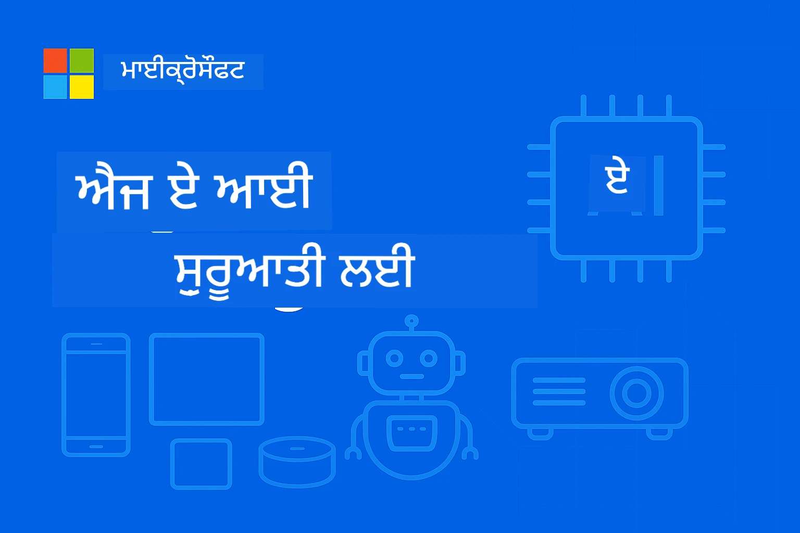

# EdgeAI for Beginners 




[](https://GitHub.com/microsoft/edgeai-for-beginners/graphs/contributors)
[](https://GitHub.com/microsoft/edgeai-for-beginners/issues)
[](https://GitHub.com/microsoft/edgeai-for-beginners/pulls)
[](http://makeapullrequest.com)

[](https://GitHub.com/microsoft/edgeai-for-beginners/watchers)
[](https://GitHub.com/microsoft/edgeai-for-beginners/fork)
[](https://GitHub.com/microsoft/edgeai-for-beginners/stargazers)


[](https://discord.gg/nTYy5BXMWG)

Follow these steps to get started using these resources:

1. **ਫੋਰਕ ਰೆਪੋਜ਼ਿਟਰੀ ਕਰੋ**: Click [](https://GitHub.com/microsoft/edgeai-for-beginners/fork)
2. **ਰੈਪੋਜ਼ਿਟਰੀ ਕਲੋਨ ਕਰੋ**:   `git clone https://github.com/microsoft/edgeai-for-beginners.git`
3. [**Azure AI Foundry Discord ਵਿਚ شامل ਹੋਵੋ ਅਤੇ ਮਾਹਿਰਾਂ ਅਤੇ ਹੋਰ ਡਿਵੈਲਪਰਾਂ ਨਾਲ ਮਿਲੋ**](https://discord.com/invite/ByRwuEEgH4)


### 🌐 ਬਹੁ-ਭਾਸ਼ਾ ਸਮਰਥਨ

#### GitHub ਐਕਸ਼ਨ ਰਾਹੀਂ ਸਮਰਥਿਤ (ਆਟੋਮੈਟਿਡ ਅਤੇ ਹਮੇਸ਼ਾਂ ਅਪ-ਟੂ-ਡੇਟ)

<!-- CO-OP TRANSLATOR LANGUAGES TABLE START -->
[Arabic](../ar/README.md) | [Bengali](../bn/README.md) | [Bulgarian](../bg/README.md) | [Burmese (Myanmar)](../my/README.md) | [Chinese (Simplified)](../zh-CN/README.md) | [Chinese (Traditional, Hong Kong)](../zh-HK/README.md) | [Chinese (Traditional, Macau)](../zh-MO/README.md) | [Chinese (Traditional, Taiwan)](../zh-TW/README.md) | [Croatian](../hr/README.md) | [Czech](../cs/README.md) | [Danish](../da/README.md) | [Dutch](../nl/README.md) | [Estonian](../et/README.md) | [Finnish](../fi/README.md) | [French](../fr/README.md) | [German](../de/README.md) | [Greek](../el/README.md) | [Hebrew](../he/README.md) | [Hindi](../hi/README.md) | [Hungarian](../hu/README.md) | [Indonesian](../id/README.md) | [Italian](../it/README.md) | [Japanese](../ja/README.md) | [Kannada](../kn/README.md) | [Korean](../ko/README.md) | [Lithuanian](../lt/README.md) | [Malay](../ms/README.md) | [Malayalam](../ml/README.md) | [Marathi](../mr/README.md) | [Nepali](../ne/README.md) | [Nigerian Pidgin](../pcm/README.md) | [Norwegian](../no/README.md) | [Persian (Farsi)](../fa/README.md) | [Polish](../pl/README.md) | [Portuguese (Brazil)](../pt-BR/README.md) | [Portuguese (Portugal)](../pt-PT/README.md) | [Punjabi (Gurmukhi)](./README.md) | [Romanian](../ro/README.md) | [Russian](../ru/README.md) | [Serbian (Cyrillic)](../sr/README.md) | [Slovak](../sk/README.md) | [Slovenian](../sl/README.md) | [Spanish](../es/README.md) | [Swahili](../sw/README.md) | [Swedish](../sv/README.md) | [Tagalog (Filipino)](../tl/README.md) | [Tamil](../ta/README.md) | [Telugu](../te/README.md) | [Thai](../th/README.md) | [Turkish](../tr/README.md) | [Ukrainian](../uk/README.md) | [Urdu](../ur/README.md) | [Vietnamese](../vi/README.md)

> **ਕੀ ਤੁਸੀਂ ਲੋਕਲ ਕਲੋਨ ਕਰਨਾ ਪਸੰਦ ਕਰੋਗੇ?**

> ਇਸ ਰੈਪੋਜ਼ਿਟਰੀ ਵਿੱਚ 50+ ਭਾਸ਼ਾਵਾਂ ਦਾ ਅਨੁਵਾਦ ਸ਼ਾਮਿਲ ਹੈ ਜੋ ਡਾਊਨਲੋਡ ਦਾ ਆਕਾਰ ਵੱਧਾ ਦਿੰਦਾ ਹੈ। ਅਨੁਵਾਦਾਂ ਦੇ ਬਿਨਾਂ ਕਲੋਨ ਕਰਨ ਲਈ, sparse checkout ਦੀ ਵਰਤੋਂ ਕਰੋ:
> ```bash
> git clone --filter=blob:none --sparse https://github.com/microsoft/edgeai-for-beginners.git
> cd edgeai-for-beginners
> git sparse-checkout set --no-cone '/*' '!translations' '!translated_images'
> ```
> ਇਹ ਤੁਹਾਨੂੰ ਕੋਰਸ ਪੂਰਾ ਕਰਨ ਲਈ ਹਰ ਚੀਜ਼ ਵਧੀਆ ਅਤੇ ਤੇਜ਼ ਡਾਊਨਲੋਡ ਦੇ ਨਾਲ ਦਿੰਦਾ ਹੈ।
<!-- CO-OP TRANSLATOR LANGUAGES TABLE END -->

**ਜੇ ਤੁਸੀਂ ਹੋਰ ਅਨੁਵਾਦ ਭਾਸ਼ਾਵਾਂ ਦੀ ਸਹਾਇਤਾ ਚਾਹੁੰਦੇ ਹੋ ਤਾਂ ਉਹ [ਇੱਥੇ](https://github.com/Azure/co-op-translator/blob/main/getting_started/supported-languages.md) ਦਿੱਤੀ ਗਈ ਹੈ।**
## ਜਾਣ ਪਹਚਾਣ

**EdgeAI for Beginners ਵਿੱਚ ਤੁਹਾਡਾ ਸਵਾਗਤ ਹੈ** – ਏਡਜ ਆਰਟੀਫੀਸ਼ੀਅਲ ਇੰਟੈਲੀਜੈਂਸ ਦੀ ਬਦਲਦੀ ਦੁਨੀਆਂ ਵਿੱਚ ਤੁਹਾਡੀ ਵਿਸਥਾਰਤ ਯਾਤਰਾ। ਇਹ ਕੋਰਸ ਸ਼ਕਤੀਸ਼ਾਲੀ ਏਆਈ ਸਮਰੱਥਾਵਾਂ ਅਤੇ ਏਡਜ ਡਿਵਾਈਸਜ਼ 'ਤੇ ਅਮਲੀ, ਅਸਲ ਦੁਨੀਆਂ ਦੇ ਵਿੱਚ ਤैनਾਤੀ ਦੇ ਵਿਚਕਾਰ ਦਾ ਫਾਸਲਾ ਘਟਾਉਂਦਾ ਹੈ, ਤੁਹਾਨੂੰ ਸਿੱਧਾ ਉਸ ਥਾਂ ਤੋਂ ਏਆਈ ਦੀ ਸਮਰੱਥਾ ਵਰਤਣ ਲਈ ਸ੍ਰਜਨਾਤਮਕ ਬਣਾਕੇ ਜਿੱਥੇ ਡਾਟਾ ਬਣਦਾ ਹੈ ਅਤੇ ਫੈਸਲੇ ਲੈਣੇ ਲੋੜੀਂਦੇ ਹਨ।

### ਤੁਸੀਂ ਕੀ ਸਿੱਖੋਗੇ

ਇਹ ਕੋਰਸ ਤੁਹਾਨੂੰ ਮੂਲ ਭਾਵਨਾਵਾਂ ਤੋਂ ਲੈ ਕੇ ਉਤਪਾਦਨ-ਤਿਆਰ ਅਮਲਾਂਦਾਜ਼ੀ ਤੱਕ ਲੈ ਜਾਂਦਾ ਹੈ, ਜਿਸ ਵਿੱਚ ਸ਼ਾਮਿਲ ਹਨ:
- **ਛੋਟੇ ਭਾਸ਼ਾ ਮਾਡਲ (SLMs)** ਜੋ ਏਡਜ ਮੋਹਰੀਅਤ ਲਈ ਅਨੁਕੂਲ ਹਨ
- **ਹੁਕਮ-ਆਧਾਰਿਤ ਅਨੁਕੂਲਤਾ** ਵੱਖ-ਵੱਖ ਪਲੇਟਫਾਰਮਾਂ ਲਈ
- **ਰਿਅਲ-ਟਾਈਮ ਅਨੁਮਾਨ** ਗੋਪਨੀਯਤਾ ਸੰਭਾਲਣ ਵਾਲੀਆਂ ਖੁਬੀਆਂ ਨਾਲ
- **ਉਤਪਾਦਨ ਤੈਨਾਤੀ** ਉਦਯੋਗਲਈ ਕਾਰਜਾਂ ਲਈ ਰਣਨੀਤੀਆਂ

### EdgeAI ਕਿਉਂ ਜਰੂਰੀ ਹੈ

Edge AI ਇੱਕ ਨਵਾਂ ਤਰੀਕਾ ਹੈ ਜੋ ਮੌਜੂਦਾ ਗੰਭੀਰ ਚੁਣੌਤੀਆਂ ਦਾ ਹੱਲ ਕਰਦਾ ਹੈ:
- **ਗੋਪਨੀਯਤਾ ਅਤੇ ਸੁਰੱਖਿਆ**: ਸੰਵੇਦਨਸ਼ੀਲ ਡਾਟਾ ਸਥਾਨਕ ਤੌਰ 'ਤੇ ਵਿਚਾਰੋ ਜ਼ਰੂਰੀ ਬਿਨਾਂ ਕਲਾਉਡ ਦੇ
- **ਤੁਰੰਤ ਪ੍ਰਦਰਸ਼ਨ**: ਸਮੇਂ-ਸੰਵੇਦਨਸ਼ੀਲ ਐਪਲੀਕੇਸ਼ਨਾਂ ਲਈ ਨੈੱਟਵਰਕ ਲੇਟੈਂਸੀ ਖਤਮ ਕਰੋ
- **ਲਾਗਤ ਦਰੁਸਤ**: ਬੈਂਡਵਿਡਥ ਅਤੇ ਕਲਾਉਡ ਕੰਪਿਊਟਿੰਗ ਖਰਚਾਂ ਨੂੰ ਘਟਾਓ
- **ਟਿਕਾਊ ਕਾਰਜ**: ਨੈੱਟਵਰਕ ਖਰਾਬੀਆਂ ਦੌਰਾਨ ਕਾਰਜ ਹੋਰ ਠੀਕ ਰਹੇ
- **ਨਿਯਮਾਂ ਦੀ ਪਾਲਨਾ**: ਡਾਟਾ ਸਮਰਾਜਤਾ ਦੀਆਂ ਲੋੜਾਂ ਪੂਰੀਆਂ ਕਰੋ

### Edge AI

Edge AI ਦਾ ਅਰਥ ਹੈ ਕਿ ਏਆਈ ਅਲਗੋਰਿਦਮ ਅਤੇ ਭਾਸ਼ਾ ਮਾਡਲ ਸਥਾਨਕ ਤੌਰ 'ਤੇ, ਡਾਟਾ ਬਣਨ ਵਾਲੀ ਥਾਂ ਦੇ ਨੇੜੇ ਚਲਾਏ ਜਾਂਦੇ ਹਨ ਬਿਨਾਂ ਕਲਾਉਡ ਸਰੋਤਾਂ 'ਤੇ ਨਿਰਭਰ ਹੋਏ ਅਨੁਮਾਨ ਲਈ। ਇਹ ਲੇਟੈਂਸੀ ਨੂੰ ਘਟਾਉਂਦਾ ਹੈ, ਗੋਪਨੀਯਤਾ ਨੂੰ ਬਹਿਤਰ ਕਰਦਾ ਹੈ ਅਤੇ ਰਿਅਲ-ਟਾਈਮ ਫੈਸਲੇ ਲੈਣਾ ਯੋਗ ਬਣਾਉਂਦਾ ਹੈ।

### ਮੁੱਖ ਸਿਧਾਂਤ:
- **ਡਿਵਾਈਸ ਤੇ ਅਨੁਮਾਨ**: AI ਮਾਡਲ ਏਡਜ ਡਿਵਾਈਸਜ਼ (ਫੋਨ, ਰਾਊਟਰ, ਮਾਈਕਰੋਕਨਟਰੋਲਰ, ਇੰਡਸਟਰੀਅਲ ਪੀਸੀ) 'ਤੇ ਚਲਾਉਂਦੇ ਹਨ
- **ਆਫਲਾਈਨ ਸਮਰੱਥਾ**: ਬਿਨਾਂ ਕਾਂਟਿਨਿਊਅਸ ਇੰਟਰਨੈੱਟ ਕਨੈਕਸ਼ਨ ਦੇ ਕੰਮ ਕਰਦਾ ਹੈ
- **ਘੱਟ ਲੇਟੈਂਸੀ**: ਇਮਮੀਡੀਏਟ ਜਵਾਬ, ਰਿਅਲ-ਟਾਈਮ ਸਿਸਟਮਾਂ ਲਈ ਉਚਿਤ
- **ਡਾਟਾ ਸਮਰਾਜਤਾ**: ਸੰਵੇਦਨਸ਼ੀਲ ਡਾਟਾ ਸਥਾਨਕ ਹੀ ਰੱਖਦਾ ਹੈ, ਸੁਰੱਖਿਆ ਅਤੇ ਪਾਲਨਾ ਨੂੰ ਸਧਾਰਦਾ ਹੈ

### ਛੋਟੇ ਭਾਸ਼ਾ ਮਾਡਲ (SLMs)

Phi-4, Mistral-7B ਅਤੇ Gemma ਵਰਗੇ SLMs ਵੱਡੇ LLMs ਦੇ ਅਨੁਕੂਲਿਤ ਸੰਸਕਰਣ ਹਨ - ਜੋ ਟ੍ਰੇਨ ਕੀਤੇ ਜਾਂ ਡਿਸਟਲ ਕੀਤੇ ਜਾਂਦੇ ਹਨ ਲਈ:
- **ਘੱਟ ਮੈਮੋਰੀ ਫੁੱਟਪ੍ਰਿੰਟ**: ਸੀਮਤ ਏਡਜ ਡਿਵਾਈਸ ਦੀ ਮੈਮੋਰੀ ਦੇ ਕੁਸ਼ਲ ਉਪਯੋਗ ਲਈ
- **ਘੱਟ ਕਮਪਿਊਟ ਮੰਗ**: CPU ਅਤੇ ਏਡਜ GPU ਪ੍ਰਦਰਸ਼ਨ ਲਈ ਅਨੁਕੂਲਿਤ
- **ਤੇਜ਼ ਸ਼ੁਰੂਆਤ ਸਮੇਂ**: ਜਲਦੀ ਸ਼ੁਰੂਆਤ ਲਈ, ਜਵਾਬੀ ਐਪਲੀਕੇਸ਼ਨਾਂ ਲਈ

ਇਹ ਸ਼ਕਤੀਸ਼ਾਲੀ NLP ਸਮਰੱਥਾਵਾਂ ਨੂੰ ਖੋਲ੍ਹਦੇ ਹਨ ਜਦ ਕਿ ਹੇਠਾਂ ਦਿੱਤੀਆਂ ਸੀਮਾਵਾਂ ਪੂਰੀਆਂ ਕਰਦੇ ਹਨ:
- **ਐਂਬੇਡਡ ਸਿਸਟਮ**: IoT ਡਿਵਾਈਸਜ਼ ਅਤੇ ਉਦਯੋਗਕ ਨਿਯੰਤਰਕ
- **ਮੋਬਾਈਲ ਡਿਵਾਈਸز**: ਸਮਾਰਟਫੋਨ ਅਤੇ ਟੈਬਲੇਟ ਜਿਨ੍ਹਾਂ ਕੋਲ ਆਫਲਾਈਨ ਖੁਬੀਆਂ ਹਨ
- **IoT ਡਿਵਾਈਸਜ਼**: ਸੀੰਸਰ ਅਤੇ ਸਮਾਰਟ ਡਿਵਾਈਸਾਂ ਜੋ ਸੀਮਤ ਸਰੋਤਾਂ ਨਾਲ
- **ਏਡਜ ਸਰਵਰ**: ਸੀਮਿਤ GPU ਸਰੋਤਾਂ ਵਾਲੇ ਸਥਾਨਕ ਪ੍ਰੋਸੈਸਿੰਗ ਯੂਨਿਟ
- **ਪرسਨਲ ਕੰਪਿਊਟਰ**: ਡੈਸਕਟਾਪ ਅਤੇ ਲੈਪਟਾਪ ਵਿੱਚ ਤੈਨਾਤੀ ਸਥਿਤੀਆਂ

## ਕੋਰਸ ਮਾਡਿਊਲ ਅਤੇ ਨੇਵਿਗੇਸ਼ਨ

| Module | ਵਿਸ਼ਾ | ਧਿਆਨ ਖੇਤਰ | ਮੁੱਖ ਸਮੱਗਰੀ | ਸਤਰ | ਅਵਧੀ |
|--------|-------|------------|-------------|--------|----------|
| [📖 00 ](./introduction.md) | [EdgeAI ਦਾ ਪਰਿਚય](./introduction.md) | ਬੁਨਿਆਦੀ ਜਾਣਕਾਰੀ ਅਤੇ ਸੰਦਰਭ | EdgeAI ਝਲਕ • ਉਦਯੋਗ ਲਾਗੂਆਂ • SLM ਪਰਿਚਯ • ਸਿੱਖਣ ਦੇ ਉਦੇਸ਼ | ਸ਼ੁਰੂਆਤੀ | 1-2 ਘੰਟੇ |
| [📚 01](../../Module01) | [EdgeAI ਮੁਢਲਾ ਸਿੱਖਿਆ](./Module01/README.md) | ਕਲਾਉਡ ਵਸਾਬਰ ਕੇ ਏਡਜ ਏਆਈ | EdgeAI ਮੁਢਲਾ • ਅਸਲੀ ਦੁਨੀਆ ਦੇ ਮਾਮਲੇ • ਲਾਗੂਗਾਈਨ ਗਿਆਨ • ਏਡਜ ਤੈਨਾਤੀ | ਸ਼ੁਰੂਆਤੀ | 3-4 ਘੰਟੇ |
| [🧠 02](../../Module02) | [SLM ਮਾਡਲ ਦੀ ਬੁਨਿਆਦ](./Module02/README.md) | ਮਾਡਲ ਪਰਿਵਾਰ ਅਤੇ ਬਣਤਰ | Phi ਪਰਿਵਾਰ • Qwen ਪਰਿਵਾਰ • Gemma ਪਰਿਵਾਰ • BitNET • μModel • Phi-Silica | ਸ਼ੁਰੂਆਤੀ | 4-5 ਘੰਟੇ |
| [🚀 03](../../Module03) | [SLM ਤੈਨਾਤੀ ਅਭਿਆਸ](./Module03/README.md) | ਸਥਾਨਕ ਅਤੇ ਕਲਾਉਡ ਤੈਨਾਤੀ | ਉੱਚ ਸਿੱਖਿਆ • ਸਥਾਨਕ ਵਾਤਾਵਰਨ • ਕਲਾਉਡ ਤੈਨਾਤੀ | ਦਰਮਿਆਨਾ | 4-5 ਘੰਟੇ |
| [⚙️ 04](../../Module04) | [ਮਾਡਲ ਅਨੁਕੂਲਨ ਸੰਦ](./Module04/README.md) | ਸਾਰਥਕ ਪਲੇਟਫਾਰਮ ਅਨੁਕੂਲਤਾ | ਪਰਿਚਯ • Llama.cpp • Microsoft Olive • OpenVINO • Apple MLX • ਵਰਕਫਲੋ ਸੰਸ਼ਲੇਸ਼ਣ | ਦਰਮਿਆਨਾ | 5-6 ਘੰਟੇ |
| [🔧 05](../../Module05) | [SLMOps ਉਤਪਾਦਨ](./Module05/README.md) | ਉਤਪਾਦਨ ਕਾਰਜ | SLMOps ਪਰਿਚਯ • ਮਾਡਲ ਡਿਸਟਿਲੇਸ਼ਨ • ਫਾਈਨ-ਟਿਊਨਿੰਗ • ਉਤਪਾਦਨ ਤੈਨਾਤੀ | ਅੱਗੇ ਵਧਿਆ | 5-6 ਘੰਟੇ |
| [🤖 06](../../Module06) | [AI ਏਜੰਟ ਅਤੇ ਫੰਕਸ਼ਨ ਕਾਲਿੰਗ](./Module06/README.md) | ਏਜੰਟ ਫ੍ਰੇਮਵਰਕ ਅਤੇ MCP | ਏਜੰਟ ਪਰਿਚਯ • ਫੰਕਸ਼ਨ ਕਾਲਿੰਗ • ਮਾਡਲ ਸੰਦਰਭ ਪ੍ਰੋਟੋਕੋਲ | ਅੱਗੇ ਵਧਿਆ | 4-5 ਘੰਟੇ |
| [💻 07](../../Module07) | [ਪਲੇਟਫਾਰਮ ਲਾਗੂਗਾਈ](./Module07/README.md) | ਸਾਰਥਕ ਪਲੇਟਫਾਰਮ ਨਮੂਨੇ | AI ਸੰਦ • Foundry Local • Windows ਵਿਕਾਸ | ਅੱਗੇ ਵਧਿਆ | 3-4 ਘੰਟੇ |
| [🏭 08](../../Module08) | [Foundry Local ਸੰਦ](./Module08/README.md) | ਉਤਪਾਦਨ-ਤਿਆਰ ਨਮੂਨੇ | ਨਮੂਨਾ ਐਪਲੀਕੇਸ਼ਨ (ਹੇਠਾਂ ਵੇਰਵੇ ਦੇਖੋ) | ਮਾਹਿਰ | 8-10 ਘੰਟੇ |

### 🏭 **ਮਾਡਿਊਲ 08: ਨਮੂਨਾ ਐਪਲੀਕੇਸ਼ਨ**

- [01: REST ਚੈਟ ਕਵਿਕਸਟਾਰਟ](./Module08/samples/01/README.md)
- [02: OpenAI SDK ਇੰਟੀਗ੍ਰੇਸ਼ਨ](./Module08/samples/02/README.md)
- [03: ਮਾਡਲ ਖੋਜ ਅਤੇ ਬੈਂਚਮਾਰਕਿੰਗ](./Module08/samples/03/README.md)
- [04: Chainlit RAG ਐਪਲੀਕੇਸ਼ਨ](./Module08/samples/04/README.md)
- [05: ਮਲਟੀ-ਏਜੰਟ ਆਰਕੇਸੇਸਟਰਸ਼ਨ](./Module08/samples/05/README.md)
- [06: ਮਾਡਲਾਂ-ਜਿਵੇਂ-ਸੰਦ ਰਾਊਟਰ](./Module08/samples/06/README.md)
- [07: ਸਿੱਧਾ API ਕਲਾਇੰਟ](./Module08/samples/07/README.md)
- [08: Windows 11 ਚੈਟ ਐਪ](./Module08/samples/08/README.md)
- [09: ਉੱਚ ਪ੍ਰਗਟ ਪਹੁੰਚ ਵਾਲੀ ਮਲਟੀ-ਏਜੰਟ ਸਿਸਟਮ](./Module08/samples/09/README.md)
- [10: Foundry Tools ਫ੍ਰੇਮਵਰਕ](./Module08/samples/10/README.md)

### 🎓 **ਵਰਕਸ਼ਾਪ: ਹਥਿਆਰ ਬਣਾ ਕੇ ਸਿੱਖਣ ਦਾ ਰਾਸ਼ਤਾ**

ਉਤਪਾਦਨ-ਤਿਆਰ ਅਮਲਾਂਦਾਜ਼ੀ ਸਮੇਤ ਵਿਸਥਾਰਤ ਹੱਥ-ਵੱਲ ਵਰਕਸ਼ਾਪ ਸਮੱਗਰੀ:

- **[ਵਰਕਸ਼ਾਪ ਗਾਈਡ](./Workshop/Readme.md)** - ਪੂਰੇ ਸਿੱਖਣ ਦੇ ਲਕੜੇ, ਨਤੀਜੇ, ਅਤੇ ਸਰੋਤਾਂ ਦੀ ਰਾਹਦਾਰੀ
- **Python ਨਮੂਨੇ** (6 ਸੈਸ਼ਨ) - ਬਿਹਤਰ ਅਭਿਆਸ, ਗਲਤੀ ਸੰਭਾਲ, ਅਤੇ ਵਿਸਥਾਰਤ ਦਸਤਾਵੇਜ਼ੀਕਰਨ ਨਾਲ ਅਪਡੇਟ
- **Jupyter ਨੋਟਬੁੱਕਸ** (8 ਇੰਟਰਐਕਟਿਵ) - ਕਦਮ ਦਰ ਕਦਮ ਟਿਊਟੋਰਿਅਲ ਸੰਗ ਬੈਂਚਮਾਰਕ ਅਤੇ ਪ੍ਰਦਰਸ਼ਨ ਨਿਗਰਾਨੀ
- **ਸੈਸ਼ਨ ਗਾਈਡਸ** - ਹਰ ਵਰਕਸ਼ਾਪ ਸੈਸ਼ਨ ਲਈ ਵਿਸਥਾਰਤ ਮਾਰਕਡਾਊਨਗਾਈਡਸ
- **ਵੈਰੀਫਿਕੇਸ਼ਨ ਸੰਦ** - ਕੋਡ ਗੁਣਵੱਤਾ ਜਾਂਚਨ ਲਈ ਸਕ੍ਰਿਪਟ ਅਤੇ ਸSmoke ਟੈਸਟ

**ਤੁਸੀਂ ਕੀ ਤਿਆਰ ਕਰੋਗੇ:**
- ਸਥਾਨਕ AI ਚੈਟ ਐਪਲੀਕੇਸ਼ਨ ਸਟ੍ਰੀਮਿੰਗ ਸਹਾਇਤਾ ਨਾਲ
- RAG ਪਾਈਪਲਾਈਨਸ ਗੁਣਵੱਤਾ ਮੁਲਾਂਕਣ ਸਮੇਤ (RAGAS)
- ਮਲਟੀ-ਮਾਡਲ ਬੈਂਚਮਾਰਕ ਅਤੇ ਤੁਲਨਾ ਸੰਦ
- ਮਲਟੀ-ਏਜੰਟ ਆਰਕੇਸੇਸਟਰਸ਼ਨ ਪ੍ਰਣਾਲੀ
- ਟਾਸਕ-ਅਧਾਰਤ ਚੋਣ ਨਾਲ ਬੁੱਧਿਮਾਨ ਮਾਡਲ ਰਾਊਟਿੰਗ

### 🎙️ **Agentic ਲਈ ਵਰਕਸ਼ਾਪ: ਹੱਥ-ਵੱਲ - AI ਪਾਡਕਾਸਟ ਸਟੁਡੀਓ**

ਸ਼ੁਰੂ ਤੋਂ ਇੱਕ AI-ਸੰਚਾਲਿਤ ਪਾਡਕਾਸਟ ਉਤਪਾਦਨ ਪਾਈਪਲਾਈਨ ਬਣਾਓ! ਇਹ ਡੂੰਘਾ ਵਰਕਸ਼ਾਪ ਤੁਹਾਨੂੰ ਪੂਰਾ ਮਲਟੀ-ਏਜੰਟ ਸਿਸਟਮ ਬਨਾਉਣਾ ਸਿਖਾਉਂਦਾ ਹੈ ਜੋ ਵਿਚਾਰਾਂ ਨੂੰ ਪੇਸ਼ੇਵਰ ਪਾਡਕਾਸਟ ਐਪੀਸੋਡਾਂ ਵਿੱਚ ਤਬਦੀਲ ਕਰਦਾ ਹੈ।
**[🎬 AI ਪੋਡਕਾਸਟ ਸਟੂਡੀਓ ਵਰਕਸ਼ਾਪ ਸ਼ੁਰੂ ਕਰੋ](./WorkshopForAgentic/README.md)**

**ਤੁਹਾਡਾ ਮਿਸ਼ਨ**: "Future Bytes" ਲਾਂਚ ਕਰੋ — ਇਕ ਟੈਕਨਾਲੋਜੀ ਪੋਡਕਾਸਟ ਜੋ ਪੂਰੀ ਤਰ੍ਹਾਂ ਤੁਹਾਡੇ ਬਣਾਏ ਗਏ AI ਏਜੰਟਾਂ ਦੁਆਰਾ ਚਲਾਇਆ ਜਾਏ। ਕੋਈ ਕਲਾਉਡ ਨਿਰਭਰਤਾ ਨਹੀਂ, ਕੋਈ API ਖਰਚ ਨਹੀਂ — ਸਾਰੀ ਚੀਜ਼ ਤੁਹਾਡੇ ਕੰਪიუჟਰ 'ਤੇ ਸਥਾਨਕ ਤੌਰ 'ਤੇ ਚੱਲਦੀ ਹੈ।

**ਇਹ ਵਿਲੱਖਣ ਕੀ ਬਣਾਉਂਦਾ ਹੈ:**
- **🤖 ਅਸਲੀ ਮਲਟੀ-ਏਜੰਟ ਆਰਕੈਸਟ੍ਰੇਸ਼ਨ** - ਖੋਜ ਕਰਨ, ਲਿਖਣ ਅਤੇ ਆਡੀਓ ਉਤਪਾਦਨ ਕਰਨ ਵਾਲੇ ਵਿਸ਼ੇਸ਼ AI ਏਜੰਟ ਬਣਾਓ
- **🎯 ਪੂਰੀ ਉਤਪਾਦਨ ਪਾਈਪਲਾਈਨ** - ਵਿਸ਼ਾ ਚੋਣ ਤੋਂ ਲੈ ਕੇ ਅੰਤਿਮ ਪੋਡਕਾਸਟ ਆਡੀਓ ਤੱਕ
- **💻 100% ਸਥਾਨਕ ਡਿਪਲੋਇਮੈਂਟ** - ਪੂਰੀ ਗੋਪਨੀਯਤਾ ਅਤੇ ਕੰਟਰੋਲ ਲਈ Ollama ਅਤੇ ਸਥਾਨਕ ਮਾਡਲ (Qwen-3-8B) ਦੀ ਵਰਤੋਂ ਕਰਦਾ ਹੈ
- **🎤 ਟੈਕਸਟ-ਟੂ-ਸਪੀਚ ਇੰਟੀਗ੍ਰੇਸ਼ਨ** - ਸਕ੍ਰਿਪਟਾਂ ਨੂੰ ਕੁਦਰਤੀ ਸੁਨਾਈ ਦੇਣ ਵਾਲੇ ਮਲਟੀ-ਸਪੀਕਰ ਗੱਲਬਾਤਾਂ ਵਿੱਚ ਬਦਲੋ
- **✋ ਮਨੁੱਖ-ਦੀ-ਲੂਪ ਵਰਕਫਲੋਜ਼** - ਮਨਜ਼ੂਰੀ ਦਰਵਾਜ਼ੇ ਗੁਣਵੱਤਾ ਨੂੰ ਯਕੀਨੀ ਬਨਾਉਂਦੇ ਹਨ ਜਦੋਂ ਕਿ ਆਟੋਮੇਸ਼ਨ ਜਾਰੀ ਰੱਖਦੇ ਹਨ

**ਤਿੰਨ-ਅੰਕ ਸਿੱਖਿਆ ਯਾਤਰਾ:**

| ਅੰਕ | ਫੋਕਸ | ਮੁੱਖ ਹੁਨਰ | ਸਮਾਂ |
|-----|-------|------------|----------|
| **[ਅੰਕ 1: ਆਪਣੇ AI ਸਹਾਇਕਾਂ ਨੂੰ ਮਿਲੋ](./WorkshopForAgentic/md/01.BuildAIAgentWithSLM.md)** | ਆਪਣਾ ਪਹਿਲਾ AI ਏਜੰਟ ਬਣਾਓ | ਟੂਲ ਇੰਟੀਗ੍ਰੇਸ਼ਨ • ਵੈੱਬ ਖੋਜ • ਸਮੱਸਿਆ ਹੱਲ • ਏਜੰਟਿਕ ਤਰਕ | 2-3 ਘੰਟੇ |
| **[ਅੰਕ 2: ਆਪਣੀ ਉਤਪਾਦਨ ਟੀਮ ਇਕੱਠੀ ਕਰੋ](./WorkshopForAgentic/md/02.AIAgentOrchestrationAndWorkflows.md)** | ਕਈ ਏਜੰਟਾਂ ਦਾ ਆਰਕੈਸਟ੍ਰੇਸ਼ਨ ਕਰੋ | ਟੀਮ ਸੰਜੋੜ • ਮਨਜ਼ੂਰੀ ਵਰਕਫਲੋਜ਼ • DevUI ਇੰਟਰਫੇਸ • ਮਨੁੱਖੀ ਨਿਗਰਾਨੀ | 3-4 ਘੰਟੇ |
| **[ਅੰਕ 3: ਆਪਣੇ ਪੋਡਕਾਸਟ ਨੂੰ ਜੀਵਤ ਬਨਾਓ](./WorkshopForAgentic/md/03.Multi-SpeakerPodcastGenerationWithVibeVoice.md)** | ਪੋਡਕਾਸਟ ਆਡੀਓ ਬਣਾਓ | ਟੈਕਸਟ-ਟੂ-ਸਪੀਚ • ਮਲਟੀ-ਸਪੀਕਰ ਸਿੰਥੇਸਿਸ • ਲੰਬੇ ਰੂਪ ਦਾ ਆਡੀਓ • ਪੂਰੀ ਆਟੋਮੇਸ਼ਨ | 2-3 ਘੰਟੇ |

**ਵਰਤੀਆਂ ਗਈਆਂ ਤਕਨੀਕਾਂ:**
- **Microsoft Agent Framework** - ਮਲਟੀ-ਏਜੰਟ ਆਰਕੈਸਟ੍ਰੇਸ਼ਨ ਅਤੇ ਸਮਨਵਯ
- **Ollama** - ਸਥਾਨਕ AI ਮਾਡਲ ਰਨਟਾਈਮ (ਕੋਈ ਕਲਾਉਡ ਲੋੜੀਂਦਾ ਨਹੀਂ)
- **Qwen-3-8B** - ਏਜੰਟਿਕ ਕੰਮਾਂ ਲਈ ਬੇਹਤਰ ਖੁੱਲ੍ਹਾ ਸਰੋਤ ਭਾਸ਼ਾ ਮਾਡਲ
- **ਟੈਕਸਟ-ਟੂ-ਸਪੀਚ APIs** - ਪੋਡਕਾਸਟ ਬਣਾਉਣ ਲਈ ਕੁਦਰਤੀ ਆਵਾਜ਼ ਸਿੰਥੇਸਿਸ

**ਹਾਰਡਵੇਅਰ ਸਪੋਰਟ:**
- ✅ **CPU ਮੋਡ** - ਕਿਸੇ ਵੀ ਆਧੁਨਿਕ ਕੰਪਿਊਟਰ 'ਤੇ ਚਲਦਾ ਹੈ (8GB+ RAM ਦੀ ਸਿਫਾਰਸ਼ ਕੀਤੀ ਜਾਂਦੀ ਹੈ)
- 🚀 **GPU ਐਕਸਲੇਰੇਸ਼ਨ** - NVIDIA/AMD GPU ਨਾਲ ਕਾਫ਼ੀ ਤੇਜ਼ ਇੰਫਰੈਂਸ
- ⚡ **NPU ਸਪੋਰਟ** - ਅਗਲੀ ਪੀੜ੍ਹੀ ਨਿਊਰਲ ਪ੍ਰੋਸੈਸਿੰਗ ਯੂਨਿਟ ਐਕਸਲੇਰੇਸ਼ਨ

**ਸਰਵੋਤਮ ਲਈ:**
- ਮਲਟੀ-ਏਜੰਟ AI ਸਿਸਟਮਾਂ ਸਿੱਖ ਰਹੇ ਵਿਕਾਸਕਾਰ
- ਕਿਸੇ ਵੀ ਵਿਅਕਤੀ ਨੂੰ ਜੋ AI ਆਟੋਮੇਸ਼ਨ ਅਤੇ ਵਰਕਫਲੋਜ਼ ਵਿੱਚ ਦਿਲਚਸਪੀ ਰੱਖਦਾ ਹੈ
- ਸਮੱਗਰੀ ਨਿਰਮਾਤਾ ਜੋ AI-ਸਹਾਇਤ ਉਤਪਾਦਨ ਖੋਜਦੇ ਹਨ
- ਵਿਦਿਆਰਥੀ ਜੋ ਪ੍ਰਯੋਗਿਕ AI ਆਰਕੈਸਟ੍ਰੇਸ਼ਨ ਪੈਟਰਨ ਡੂੰਘਾਈ ਨਾਲ ਸਿੱਖ ਰਹੇ ਹਨ

**ਸ਼ੁਰੂਆਤ ਕਰੋ ਬਣਾਉਣਾ**: [🎙️ AI ਪੋਡਕਾਸਟ ਸਟੂਡੀਓ ਵਰਕਸ਼ਾਪ →](./WorkshopForAgentic/README.md)

### 📊 **ਸਿੱਖਣ ਦਾ ਪਾਥ ਸੰਖੇਪ**
- **ਕੁੱਲ ਸਮਾਂ**: 36-45 ਘੰਟੇ
- **ਸ਼ੁਰੂਆਤੀ ਰਾਸਤਾ**: ਮੋਡੀਊਲ 01-02 (7-9 ਘੰਟੇ)  
- **ਵਿਚਕਾਰਲਾ ਰਾਸਤਾ**: ਮੋਡੀਊਲ 03-04 (9-11 ਘੰਟੇ)
- **ਉੱਚ ਪੱਧਰ ਰਾਸਤਾ**: ਮੋਡੀਊਲ 05-07 (12-15 ਘੰਟੇ)
- **ਮਾਹਰ ਰਾਸਤਾ**: ਮੋਡੀਊਲ 08 (8-10 ਘੰਟੇ)

## ਤੁਸੀਂ ਕੀ ਬਣਾਵੋਗੇ

### 🎯 ਮੁੱਖ ਹੁਨਰ
- **ਐਡਜ AI ਆਰਕੀਟੈਕਚਰ**: ਕਲਾਉਡ ਇੰਟੀਗ੍ਰੇਸ਼ਨ ਨਾਲ ਸਥਾਨਕ-ਪਹਿਲਾ AI ਸਿਸਟਮ ਡਿਜ਼ਾਈਨ ਕਰੋ
- **ਮਾਡਲ ਓਪਟੀਮਾਈਜ਼ੇਸ਼ਨ**: ਐਡਜ ਡਿਪਲੋਇਮੈਂਟ ਲਈ ਮਾਡਲਾਂ ਨੂੰ ਕਵਾਂਟਾਈਜ਼ ਅਤੇ ਸੰਗ੍ਰਹਿਤ ਕਰੋ (85% ਤੇਜ਼, 75% ਛੋਟ)
- **ਮਲਟੀ-ਪਲੇਟਫਾਰਮ ਡਿਪਲੋਇਮੈਂਟ**: ਵਿੰਡੋਜ਼, ਮੋਬਾਈਲ, ਐਮਬੈੱਡਿਡ ਅਤੇ ਕਲਾਉਡ-ਐਡਜ ਹਾਈਬ੍ਰਿਡ ਸਿਸਟਮ
- **ਉਤਪਾਦਨ ਪਰਿਚਾਲਨਾ**: ਐਡਜ AI ਦੀ ਮਾਨੀਟਰਿੰਗ, ਸਕੇਲਿੰਗ ਅਤੇ ਸੰਭਾਲ

### 🏗️ ਪ੍ਰਯੋਗਿਕ ਪ੍ਰੋਜੈਕਟ
- **ਫਾਉਂਡਰੀ ਸਥਾਨਕ ਚੈਟ ਐਪਸ**: ਮਾਡਲ ਸੁਇਚਿੰਗ ਦੇ ਨਾਲ Windows 11 ਨੇਟਿਵ ਐਪਲੀਕੇਸ਼ਨ
- **ਮਲਟੀ-ਏਜੰਟ ਸਿਸਟਮ**: ਕੰਪਲੈਕਸ ਵਰਕਫਲੋਜ਼ ਲਈ ਵਿਸ਼ੇਸ਼ਤਾਵਾਂ ਵਾਲੇ ਏਜੰਟਾਂ ਦਾ ਕੋਆਰਡੀਨੇਟਰ  
- **RAG ਐਪਲੀਕੇਸ਼ਨ**: ਸਥਾਨਕ ਦਸਤਾਵੇਜ਼ ਪ੍ਰੋਸੈਸਿੰਗ ਨਾਲ ਵੇਕਟਰ ਖੋਜ
- **ਮਾਡਲ ਰਾਊਟਰਜ਼**: ਕੰਮ ਵਿਸ਼ਲੇਸ਼ਣ ਅਧਾਰਿਤ ਮਾਡਲਾਂ ਵਿਚਕਾਰ ਸਿਆਣੀ ਚੋਣ
- **API ਫ੍ਰੇਮਵਰਕ**: ਪ੍ਰੋਡਕਸ਼ਨ-ਤਿਆਰ ਕਲਾਇੰਟ ਸਟ੍ਰੀਮਿੰਗ ਅਤੇ ਸਿਹਤ ਮਾਨੀਟਰਿੰਗ ਨਾਲ
- **ਕ੍ਰਾਸ-ਪਲੇਟਫਾਰਮ ਟੂਲਜ਼**: LangChain/Semantic Kernel ਇੰਟੀਗ੍ਰੇਸ਼ਨ ਪੈਟਰਨ

### 🏢 ਉਦਯੋਗਿਕ ਐਪਲੀਕੇਸ਼ਨ
**ਉਤਪਾਦਨ** • **ਹੈਲਥਕੇਅਰ** • **ਆਟੋਨੋਮਸ ਵਾਹਨ** • **ਸਮਾਰਟ ਸ਼ਹਿਰ** • **ਮੋਬਾਈਲ ਐਪਸ**

## ਤੁਰੰਤ ਸ਼ੁਰੂਆਤ

**ਸਿਫਾਰਸ਼ੀ ਸਿੱਖਣ ਦਾ ਪਾਥ** (ਕੁੱਲ 20-30 ਘੰਟੇ):

0. **📖 ਪਰਿਚਯ** ([Introduction.md](./introduction.md)): EdgeAI ਬੁਨਿਆਦ + ਉਦਯੋਗ ਪ੍ਰਸੰਗ + ਸਿੱਖਣ ਫ੍ਰੇਮਵਰਕ
1. **📚 ਬੁਨਿਆਦ** (ਮੋਡੀਊਲ 01-02): EdgeAI ਧਾਰਣਾਵਾਂ + SLM ਮਾਡਲ ਪਰਿਵਾਰ
2. **⚙️ ਓਪਟੀਮਾਈਜ਼ੇਸ਼ਨ** (ਮੋਡੀਊਲ 03-04): ਡਿਪਲੋਇਮੈਂਟ + ਕਵਾਂਟਾਈਜ਼ੇਸ਼ਨ ਫ੍ਰੇਮਵਰਕ  
3. **🚀 ਉਤਪਾਦਨ** (ਮੋਡੀਊਲ 05-06): SLMOps + AI ਏਜੰਟ + ਫੰਕਸ਼ਨ ਕਾਲਿੰਗ
4. **💻 ਲਾਗੂਕਰਨ** (ਮੋਡੀਊਲ 07-08): ਪਲੇਟਫਾਰਮ ਨਮੂਨੇ + ਫਾਉਂਡਰੀ ਸਥਾਨਕ ਟੂਲਕਿਟ

ਹਰ ਮੋਡੀਊਲ ਵਿੱਚ ਸਿਧਾਂਤ, ਹੱਥ-ਅਨ ਅਭਿਆਸ ਅਤੇ ਉਤਪਾਦਨ-ਤਿਆਰ ਕੋਡ ਨਮੂਨੇ ਸ਼ਾਮਲ ਹਨ।

## ਕਰੀਅਰ ਪ੍ਰਭਾਵ

**ਤਕਨੀਕੀ ਭੂਮਿਕਾਵਾਂ**: EdgeAI ਸਾਲ਼ੂਸ਼ਨਜ਼ ਆਰਕੀਟੈਕਟ • ML ਇੰਜੀਨੀਅਰ (ਐਡਜ) • IoT AI ਵਿਕਾਸਕਾਰ • ਮੋਬਾਈਲ AI ਵਿਕਾਸਕਾਰ

**ਉਦਯੋਗਿਕ ਖੇਤਰ**: ਉਤਪਾਦਨ 4.0 • ਹੈਲਥਕੇਅਰ ਟੈਕ • ਸਵੈ-ਚਾਲਿਤ ਸਿਸਟਮ • ਫਿਨਟੈਕ • ਉਪਭੋਗਤਾ ਇਲੈਕਟ੍ਰਾਨਿਕਸ

**ਪੋਰਟਫੋਲਿਓ ਪ੍ਰੋਜੈਕਟ**: ਮਲਟੀ-ਏਜੰਟ ਸਿਸਟਮ • ਉਤਪਾਦਨ RAG ਐਪ • ਕ੍ਰਾਸ-ਪਲੇਟਫਾਰਮ ਡਿਪਲੋਇਮੈਂਟ • ਪਰਫਾਰਮੈਂਸ ਓਪਟੀਮਾਈਜ਼ੇਸ਼ਨ

## ਰਿਪੋਜ਼ਿਟਰੀ ਸੰਰਚਨਾ

```
edgeai-for-beginners/
├── 📖 introduction.md  # Foundation: EdgeAI Overview & Learning Framework
├── 📚 Module01-04/     # Fundamentals → SLMs → Deployment → Optimization  
├── 🔧 Module05-06/     # SLMOps → AI Agents → Function Calling
├── 💻 Module07/        # Platform Samples (VS Code, Windows, Jetson, Mobile)
├── 🏭 Module08/        # Foundry Local Toolkit + 10 Comprehensive Samples
│   ├── samples/01-06/  # Foundation: REST, SDK, RAG, Agents, Routing
│   └── samples/07-10/  # Advanced: API Client, Windows App, Enterprise Agents, Tools
├── 🌐 translations/    # Multi-language support (8+ languages)
└── 📋 STUDY_GUIDE.md   # Structured learning paths & time allocation
```

## ਕੋਰਸ ਹਾਈਲਾਈਟਸ

✅ **ਤਰੱਕੀਬੱਧ ਸਿੱਖਿਆ**: ਸਿਧਾਂਤ → ਅਭਿਆਸ → ਉਤਪਾਦਨ ਡਿਪਲੋਇਮੈਂਟ  
✅ **ਅਸਲੀ ਕੇਸ ਅਧਿਐਨ**: Microsoft, Japan Airlines, ਉਦਯੋਗਤਮ ਲਾਗੂ ਕਰਨ  
✅ **ਹੱਥ-ਅਨ ਨਮੂਨੇ**: 50+ ਉਦਾਹਰਣਾਂ, 10 ਵਿਸਥਾਰਿਤ ਫਾਉਂਡਰੀ ਸਥਾਨਕ ਡੈਮੋ  
✅ **ਕਾਰਗੁਜ਼ਾਰੀ ਤੇ ਧਿਆਨ**: 85% ਤੇਜ਼ੀ ਨਾਲ ਸੁਧਾਰ, 75% ਆਕਾਰ ਘਟਾਓ  
✅ **ਮਲਟੀ-ਪਲੇਟਫਾਰਮ**: Windows, ਮੋਬਾਈਲ, ਐਮਬੈੱਡਿਡ, ਕਲਾਉਡ-ਐਡਜ ਹਾਈਬ੍ਰਿਡ  
✅ **ਉਤਪਾਦਨ ਤਿਆਰ**: ਨਿਗਰਾਨੀ, ਸਕੇਲਿੰਗ, ਸੁਰੱਖਿਆ, ਅਨੁਕੂਲਤਾ ਦੇ ਫ੍ਰੇਮਵਰਕ

📖 **[ਅਧਿਐਨ ਮਾਰਗਦਰਸ਼ਿਕ ਉਪਲਬਧ ਹੈ](STUDY_GUIDE.md)**: ਸਮੇਂ ਦੇ ਵੰਡ ਅਤੇ ਸਵਯੰ-ਮੁਲਾਂਕਣ ਸੰਦਾਂ ਨਾਲ 20-ਘੰਟੇ ਦਾ ਢਾਂਚਾਬੱਧ ਸਿੱਖਣ ਦਾ ਪਾਥ।

---

**EdgeAI AI ਡਿਪਲੋਇਮੈਂਟ ਦਾ ਭਵਿੱਖ ਹੈ**: ਸਥਾਨਕ-ਪਹਿਲਾ, ਗੋਪਨੀਯਤਾ-ਸੰਰੱਖਣ, ਅਤੇ ਪ੍ਰਭਾਵਸ਼ਾਲੀ। ਇਹ ਹੁਨਰ ਪ੍ਰਾਪਤ ਕਰੋ ਅਤੇ ਅਗਲੀ ਪੀੜ੍ਹੀ ਦੇ ਵਿਦਵਾਨ ਐਪਲੀਕੇਸ਼ਨ ਬਣਾਉ।

## ਹੋਰ ਕੋਰਸ

ਸਾਡੀ ਟੀਮ ਹੋਰ ਕੋਰਸ ਬਣਾਉਂਦੀ ਹੈ! ਵੇਖੋ:

<!-- CO-OP TRANSLATOR OTHER COURSES START -->
### LangChain
[](https://aka.ms/langchain4j-for-beginners)
[](https://aka.ms/langchainjs-for-beginners?WT.mc_id=m365-94501-dwahlin)

---

### Azure / Edge / MCP / Agents
[](https://github.com/microsoft/AZD-for-beginners?WT.mc_id=academic-105485-koreyst)
[](https://github.com/microsoft/edgeai-for-beginners?WT.mc_id=academic-105485-koreyst)
[](https://github.com/microsoft/mcp-for-beginners?WT.mc_id=academic-105485-koreyst)
[](https://github.com/microsoft/ai-agents-for-beginners?WT.mc_id=academic-105485-koreyst)

---
 
### Generative AI Series
[](https://github.com/microsoft/generative-ai-for-beginners?WT.mc_id=academic-105485-koreyst)
[-9333EA?style=for-the-badge&labelColor=E5E7EB&color=9333EA)](https://github.com/microsoft/Generative-AI-for-beginners-dotnet?WT.mc_id=academic-105485-koreyst)
[-C084FC?style=for-the-badge&labelColor=E5E7EB&color=C084FC)](https://github.com/microsoft/generative-ai-for-beginners-java?WT.mc_id=academic-105485-koreyst)
[-E879F9?style=for-the-badge&labelColor=E5E7EB&color=E879F9)](https://github.com/microsoft/generative-ai-with-javascript?WT.mc_id=academic-105485-koreyst)

---
 
### Core Learning
[](https://aka.ms/ml-beginners?WT.mc_id=academic-105485-koreyst)
[](https://aka.ms/datascience-beginners?WT.mc_id=academic-105485-koreyst)
[](https://aka.ms/ai-beginners?WT.mc_id=academic-105485-koreyst)
[](https://github.com/microsoft/Security-101?WT.mc_id=academic-96948-sayoung)
[](https://aka.ms/webdev-beginners?WT.mc_id=academic-105485-koreyst)
[](https://aka.ms/iot-beginners?WT.mc_id=academic-105485-koreyst)
[](https://github.com/microsoft/xr-development-for-beginners?WT.mc_id=academic-105485-koreyst)

---
 
### Copilot Series
[](https://aka.ms/GitHubCopilotAI?WT.mc_id=academic-105485-koreyst)
[](https://github.com/microsoft/mastering-github-copilot-for-dotnet-csharp-developers?WT.mc_id=academic-105485-koreyst)
[](https://github.com/microsoft/CopilotAdventures?WT.mc_id=academic-105485-koreyst)
<!-- CO-OP TRANSLATOR OTHER COURSES END -->

## ਮਦਦ ਪ੍ਰਾਪਤ ਕਰਨਾ

ਜੇ ਤੁਸੀਂ ਫਸ ਜਾਂਦੇ ਹੋ ਜਾਂ AI ਐਪ ਬਣਾਉਣ ਬਾਰੇ ਕੋਈ ਸਵਾਲ ਹਨ, ਤਾਂ ਸ਼ਾਮਲ ਹੋਵੋ:

[](https://discord.gg/nTYy5BXMWG)

ਜੇ ਤੁਹਾਡੇ ਕੋਲ ਉਤਪਾਦ ਪ੍ਰਤੀਕਿਰਿਆ ਜਾਂ ਗਲਤੀਆਂ ਹਨ ਤਾਂ ਦੌਰਾਨ ਬਣਾਉਣ ਸਮੇਂ ਵਿਜ਼ਿਟ ਕਰੋ:

[](https://aka.ms/foundry/forum)

---

<!-- CO-OP TRANSLATOR DISCLAIMER START -->
**ਡਿਸਕਲੇਮਰ**:
ਇਹ ਦਸਤਾਵੇਜ਼ ਇੱਕ ਏਆਈ ਅਨੁਵਾਦ ਸੇਵਾ [Co-op Translator](https://github.com/Azure/co-op-translator) ਦੀ ਵਰਤੋਂ ਕਰਕੇ ਅਨੁਵਾਦ ਕੀਤਾ ਗਿਆ ਹੈ। ਜਿਵੇਂ ਕਿ ਅਸੀਂ ਸਹੀਅਤ ਲਈ ਪ੍ਰਯਤਨਸ਼ੀਲ ਹਾਂ, ਕਿਰਪਾ ਕਰਕੇ ਇਹ ਜ਼ਾਹਿਰ ਰਹੇ ਕਿ ਸਵੈਚਲਿਤ ਅਨੁਵਾਦਾਂ ਵਿੱਚ ਗਲਤੀਆਂ ਜਾਂ ਅਣਸਚਾਈਆਂ ਹੋ ਸਕਦੀਆਂ ਹਨ। ਮੂਲ ਦਸਤਾਵੇਜ਼ ਆਪਣੀ ਮੂਲ ਭਾਸ਼ਾ ਵਿੱਚ ਹੀ ਪ੍ਰਮਾਣਿਕ ਸਰੋਤ ਮੰਨਿਆ ਜਾਣਾ ਚਾਹੀਦਾ ਹੈ। ਮਹੱਤਵਪੂਰਨ ਜਾਣਕਾਰੀ ਲਈ, ਪ੍ਰੋਫੈਸ਼ਨਲ ਮਨੁੱਖੀ ਅਨੁਵਾਦ ਦੀ ਸਿਫਾਰਸ਼ ਕੀਤੀ ਜਾਂਦੀ ਹੈ। ਇਸ ਅਨੁਵਾਦ ਦੀ ਵਰਤੋਂ ਨਾਲ ਉੱਪਜਣ ਵਾਲੀਆਂ ਕਿਸੇ ਵੀ ਗਲਤਫਹਿਮੀਆਂ ਜਾਂ ਗਲਤ ਵਿਅਖਿਆਵਾਂ ਲਈ ਅਸੀਂ ਜ਼ਿੰਮੇਵਾਰ ਨਹੀਂ ਹਾਂ।
<!-- CO-OP TRANSLATOR DISCLAIMER END -->