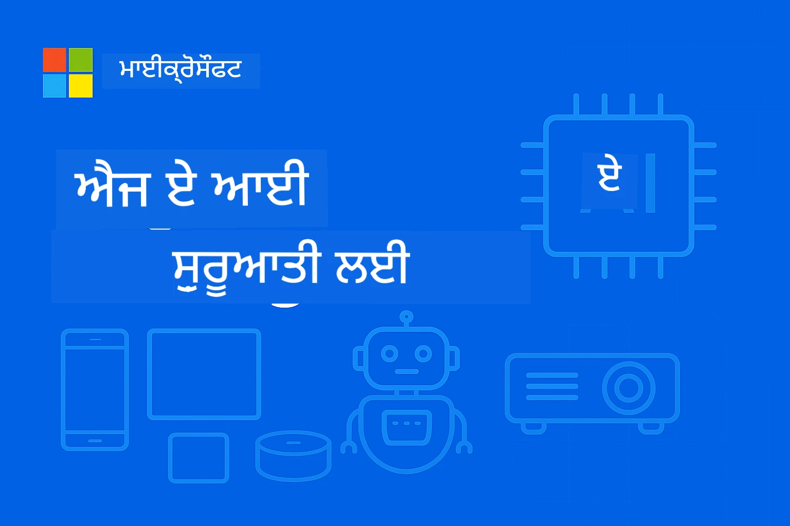

# EdgeAI for Beginners 




[](https://GitHub.com/microsoft/edgeai-for-beginners/graphs/contributors)
[](https://GitHub.com/microsoft/edgeai-for-beginners/issues)
[](https://GitHub.com/microsoft/edgeai-for-beginners/pulls)
[](http://makeapullrequest.com)

[](https://GitHub.com/microsoft/edgeai-for-beginners/watchers)
[](https://GitHub.com/microsoft/edgeai-for-beginners/fork)
[](https://GitHub.com/microsoft/edgeai-for-beginners/stargazers)


[](https://discord.gg/nTYy5BXMWG)

ਇਹ ਸਾਧਨਾਂ ਦੀ ਵਰਤੋਂ ਸ਼ੁਰੂ ਕਰਨ ਲਈ ਇਹ ਕਦਮ ਪਾਲਣਾ ਕਰੋ:

1. **ਰੀਪੋਜ਼ਿਟਰੀ ਫੋਰਕ ਕਰੋ**: Click [](https://GitHub.com/microsoft/edgeai-for-beginners/fork)
2. **ਰੀਪੋਜ਼ਿਟਰੀ ਕਲੋਨ ਕਰੋ**:   `git clone https://github.com/microsoft/edgeai-for-beginners.git`
3. [**Azure AI Foundry Discord ਵਿੱਚ ਸ਼ਾਮਲ ਹੋਵੋ ਅਤੇ ਵਿਸ਼ੇਸ਼ਜਿਆਂ ਅਤੇ ਹੋਰ ਵਿਕਾਸਕਾਰਾਂ ਨਾਲ ਮਿਲੋ**](https://discord.com/invite/ByRwuEEgH4)


### 🌐 ਬਹੁ-ਭਾਸ਼ਾ ਸਹਿਯੋਗ

#### GitHub ਐਕਸ਼ਨ ਦੁਆਰਾ ਸਮਰਥਿਤ (ਆਟੋਮੇਟਿਕ ਅਤੇ ਹਮੇਸ਼ਾਂ ਅੱਪ-ਟੂ-ਡੇਟ)

<!-- CO-OP TRANSLATOR LANGUAGES TABLE START -->
[Arabic](../ar/README.md) | [Bengali](../bn/README.md) | [Bulgarian](../bg/README.md) | [Burmese (Myanmar)](../my/README.md) | [Chinese (Simplified)](../zh-CN/README.md) | [Chinese (Traditional, Hong Kong)](../zh-HK/README.md) | [Chinese (Traditional, Macau)](../zh-MO/README.md) | [Chinese (Traditional, Taiwan)](../zh-TW/README.md) | [Croatian](../hr/README.md) | [Czech](../cs/README.md) | [Danish](../da/README.md) | [Dutch](../nl/README.md) | [Estonian](../et/README.md) | [Finnish](../fi/README.md) | [French](../fr/README.md) | [German](../de/README.md) | [Greek](../el/README.md) | [Hebrew](../he/README.md) | [Hindi](../hi/README.md) | [Hungarian](../hu/README.md) | [Indonesian](../id/README.md) | [Italian](../it/README.md) | [Japanese](../ja/README.md) | [Kannada](../kn/README.md) | [Khmer](../km/README.md) | [Korean](../ko/README.md) | [Lithuanian](../lt/README.md) | [Malay](../ms/README.md) | [Malayalam](../ml/README.md) | [Marathi](../mr/README.md) | [Nepali](../ne/README.md) | [Nigerian Pidgin](../pcm/README.md) | [Norwegian](../no/README.md) | [Persian (Farsi)](../fa/README.md) | [Polish](../pl/README.md) | [Portuguese (Brazil)](../pt-BR/README.md) | [Portuguese (Portugal)](../pt-PT/README.md) | [Punjabi (Gurmukhi)](./README.md) | [Romanian](../ro/README.md) | [Russian](../ru/README.md) | [Serbian (Cyrillic)](../sr/README.md) | [Slovak](../sk/README.md) | [Slovenian](../sl/README.md) | [Spanish](../es/README.md) | [Swahili](../sw/README.md) | [Swedish](../sv/README.md) | [Tagalog (Filipino)](../tl/README.md) | [Tamil](../ta/README.md) | [Telugu](../te/README.md) | [Thai](../th/README.md) | [Turkish](../tr/README.md) | [Ukrainian](../uk/README.md) | [Urdu](../ur/README.md) | [Vietnamese](../vi/README.md)

> **ਛੇਤੀ ਕਲੋਨ ਕਰਨਾ ਪਸੰਦ ਹੈ?**
>
> ਇਸ ਰੀਪੋਜ਼ਿਟਰੀ ਵਿੱਚ 50+ ਭਾਸ਼ਾ ਅਨੁਵਾਦ ਸ਼ਾਮਲ ਹਨ, ਜੋ ਡਾਊਨਲੋਡ ਆਕਾਰ ਵਧਾਉਂਦੇ ਹਨ। ਬਿਨਾਂ ਅਨੁਵਾਦਾਂ ਦੇ ਕਲੋਨ ਕਰਨ ਲਈ, sparse checkout ਦੀ ਵਰਤੋਂ ਕਰੋ:
>
> **Bash / macOS / Linux:**
> ```bash
> git clone --filter=blob:none --sparse https://github.com/microsoft/edgeai-for-beginners.git
> cd edgeai-for-beginners
> git sparse-checkout set --no-cone '/*' '!translations' '!translated_images'
> ```
>
> **CMD (Windows):**
> ```cmd
> git clone --filter=blob:none --sparse https://github.com/microsoft/edgeai-for-beginners.git
> cd edgeai-for-beginners
> git sparse-checkout set --no-cone "/*" "!translations" "!translated_images"
> ```
>
> ਇਹ ਤੁਹਾਨੂੰ ਕੋਰਸ ਮੁਕੰਮਲ ਕਰਨ ਲਈ ਸਭ ਕੁਝ ਤੇਜ਼ ਡਾਊਨਲੋਡ ਨਾਲ ਦਿੰਦਾ ਹੈ।
<!-- CO-OP TRANSLATOR LANGUAGES TABLE END -->

**ਜੇ ਤੁਸੀਂ ਹੋਰ ਅਨੁਵਾਦ ਭਾਸ਼ਾਵਾਂ ਚਾਹੁੰਦੇ ਹੋ, ਤਾਂ ਉਹ [ਇੱਥੇ](https://github.com/Azure/co-op-translator/blob/main/getting_started/supported-languages.md) ਦਰਜ ਹਨ।**
## ਪਰਿਚਯ

ਤੁਹਾਡਾ ਸਵਾਗਤ ਹੈ **EdgeAI for Beginners** ਵਿੱਚ – ਐਜ ਕ੍ਰਿਤ੍ਰਿਮ ਬੁੱਧੀ ਦੇ ਬਦਲਦੇ ਸੰਸਾਰ ਵਿੱਚ ਤੁਹਾਡੀ ਵਿਸਤ੍ਰਿਤ ਯਾਤਰਾ। ਇਹ ਕੋਰਸ ਸ਼ਕਤੀਸ਼ਾਲੀ ਐਆਈ ਸਮਰੱਥਾਵਾਂ ਅਤੇ ਪ੍ਰਯੋਗਕਰਤਾ-ਵਾਸਤਵਿਕ ਤੌਰ ਤੇ ਏਜ ਡਿਵਾਈਸਾਂ ‘ਤੇ ਡਿਪਲੋਇਮੈਂਟ ਵਿਚਕਾਰ ਦੇ ਫਰਕ ਨੂੰ ਮਿਟਾਉਂਦਾ ਹੈ, ਜੋ ਤੁਹਾਨੂੰ ਡਾਟਾ ਬਣਾਈ ਜਾਂਦੀ ਥਾਂ ਤੇ ਅਤੇ ਫੈਸਲੇ ਲੈਣ ਦੀ ਲੋੜ ਵਾਲੀ ਥਾਂ ਤੇ ਸਿੱਧਾ ਐਆਈ ਦੀ ਸਮਰੱਥਾ ਵਰਤਣ ਲਈ ਸਮਰੱਥ ਬਣਾਉਂਦਾ ਹੈ।

### ਤੁਹਾਡੇ ਕੁਝ ਯੋਗਤਾ ਪ੍ਰਾਪਤ ਕਰਨਗੇ

ਇਹ ਕੋਰਸ ਤੁਹਾਨੂੰ ਮੁੱਢਲੀ ਧਾਰਨਾਵਾਂ ਤੋਂ ਲੈ ਕੇ ਉਤਪਾਦ ਦੀ ਤਿਆਰੀ ਤੱਕ ਦੇ ਇੰਪਲੀਮੈਂਟੇਸ਼ਨਾਂ ਤੱਕ ਲੈ ਜਾਂਦਾ ਹੈ, ਜਿਸ ਵਿੱਚ ਸ਼ਾਮਲ ਹੈ:
- **ਸਮਾਲ ਲੈਂਗਵੇਜ ਮਾਡਲਜ਼ (SLMs)** ਜੋ ਏਜ ਡਿਪਲੋਇਮੈਂਟ ਲਈ ਅਪਟਿਮਾਈਜ਼ਡ ਹਨ
- **ਹਾਰਡਵੇਅਰ-ਆਵਰ ਸੰਵਰਧਨ** ਵੱਖ-ਵੱਖ ਪਲੇਟਫਾਰਮਾਂ ਲਈ
- **ਰਿਆਲ-ਟਾਈਮ ਇੰਫਰੰਸ** ਪ੍ਰਾਈਵੇਸੀ ਸੁਰੱਖਿਆ ਸਮਰੱਥਾਵਾਂ ਨਾਲ
- **ਉਤਪਾਦਨ ਡਿਪਲੋਇਮੈਂਟ** ਰਣਨੀਤੀਆਂ ਉਦਯੋਗਕ ਐਪਲੀਕੇਸ਼ਨਾਂ ਲਈ

### EdgeAI ਕਿਉਂ ਮਹੱਤਵਪੂਰਨ ਹੈ

ਏਜ ਐਆਈ ਇੱਕ ਇੰਨਾ ਵੱਡਾ ਬਦਲਾਵ ਹੈ ਜੋ ਆਧੁਨਿਕ ਮੁਸ਼ਕਲਾਂ ਦਾ ਸਮਾਧਾਨ ਕਰਦਾ ਹੈ:
- **ਪ੍ਰਾਈਵੇਸੀ ਅਤੇ ਸੁਰੱਖਿਆ**: ਸੰਵੇਦਨਸ਼ੀਲ ਡਾਟਾ ਨੂੰ ਲੋਕਲ ਤੌਰ ਤੇ ਪ੍ਰੋਸੈਸ ਕਰੋ ਬਿਨਾਂ ਕਲਾਉਡ ਮਾਰਫਤ ਪਰਦਰਸ਼ਿਤ ਹੋਣ ਦੇ
- **ਰਿਆਲ-ਟਾਈਮ ਪ੍ਰਦਰਸ਼ਨ**: ਸਮੇਂ-ਸੰਵੇਦਨਸ਼ੀਲ ਐਪਲੀਕੇਸ਼ਨਾਂ ਲਈ ਨੈੱਟਵਰਕ ਦੇਰਾ ਖਤਮ ਕਰੋ
- **ਖਰਚੇ ਦੀ ਬਚਤ**: ਬੈਂਡਵਿਡਥ ਅਤੇ ਕਲਾਉਡ ਕਮਪਿਊਟਿੰਗ ਖ਼ਰਚੇ ਘਟਾਓ
- **ਟਿਕਾਊ ਕਾਰਜ**: ਨੈੱਟਵਰਕ ਗੜਬੜਾਂ ਦੌਰਾਨ ਕਾਰਜਕੁਸ਼ਲਤਾ ਬਣਾਈ ਰੱਖੋ
- **ਨਿਯਮਕ ਅਨੁਕੂਲਤਾ**: ਡਾਟਾ ਸਾਰਥਿਕਤਾ ਦੀਆਂ ਲੋੜਾਂ ਪੂਰੀਆਂ ਕਰੋ

### Edge AI

Edge AI ਦਾ ਅਰਥ ਹੈ ਕਿ AI ਅਲਗੋਰਿਦਮ ਅਤੇ ਭਾਸ਼ਾ ਮਾਡਲ ਨੂੰ ਲੋਕਲ ਹਾਰਡਵੇਅਰ ਤੇ, ਜਿੱਥੇ ਡਾਟਾ ਬਣਦਾ ਹੈ, ਉਥੇ ਚਲਾਇਆ ਜਾਣਾ ਬਿਨਾਂ ਕਲਾਉਡ ਸਾਧਨਾਂ ਦੇ ਭਰੋਸੇ ਤੇ। ਇਸ ਨਾਲ ਲੇਟੈਂਸੀ ਘਟਦੀ ਹੈ, ਪ੍ਰਾਈਵੇਸੀ ਵਧਦੀ ਹੈ ਅਤੇ ਤੁਰੰਤ ਫੈਸਲੇ ਲੈਣ ਦੀ ਸਮਰੱਥਾ ਹੁੰਦੀ ਹੈ।

### ਮੁੱਖ ਨਿਯਮ:
- **ਉਪਕਰਣ ਤੇ ਇੰਫਰੰਸ**: ਐਆਈ ਮਾਡਲ ਏਜ ਯੰਤਰਾਂ (ਫੋਨ, ਰਾਊਟਰ, ਮਾਇਕ੍ਰੋਕੰਟਰੋਲਰ, ਉਦਯੋਗਕ ਪੀਸੀ) ‘ਤੇ ਚਲਦੇ ਹਨ
- **ਆਫਲਾਈਨ ਸਮਰੱਥਾ**: ਇਹ ਸਥਿਰ ਇੰਟਰਨੈੱਟ ਕਨੈਕਸ਼ਨ ਤੋਂ ਬਿਨਾਂ ਕੰਮ ਕਰਦਾ ਹੈ
- **ਘੱਟ ਲੇਟੈਂਸੀ**: ਤੁਰੰਤ ਜਵਾਬ ਜੋ ਰਿਆਲ-ਟਾਈਮ ਪ੍ਰਣਾਲੀਆਂ ਲਈ ਉਚਿਤ ਹੈ
- **ਡਾਟਾ ਸਰੋਤ ਦਾ ਨਿਯੰਤਰਣ**: ਸੰਵੇਦਨਸ਼ੀਲ ਡਾਟਾ ਨੂੰ ਸਥਾਨਕ ਰੱਖਦਾ ਹੈ, ਸੁਰੱਖਿਆ ਅਤੇ ਅਨੁਕੂਲਤਾ ਵਧਾਉਂਦਾ ਹੈ

### ਸਮਾਲ ਲੈਂਗਵੇਜ ਮਾਡਲਜ਼ (SLMs)

SLMs ਜਿਵੇਂ ਕਿ Phi-4, Mistral-7B, ਅਤੇ Gemma ਵੱਡੇ LLMs ਦੇ ਅਪਟਿਮਾਈਜ਼ਡ ਵਰਜਨ ਹਨ—ਜੋ ਤਿਆਰ ਕੀਤੇ ਜਾਂ ਡਿਸਟੀਲ ਕੀਤੇ ਜਾਂਦੇ ਹਨ:
- **ਘੱਟ ਮੇਮੋਰੀ ਖਪਤ**: ਸੀਮਿਤ ਏਜ ਯੰਤਰ ਦੀ ਯਾਦ ਦੀ ਕੁਸ਼ਲ ਵਰਤੋਂ
- **ਘੱਟ ਕਮਪਿਊਟ ਮੰਗ**: CPU ਅਤੇ ਏਜ GPU ਪ੍ਰਦਰਸ਼ਨ ਲਈ ਅਪਟਿਮਾਈਜ਼ਡ
- **ਤੁਰੰਤ ਸ਼ੁਰੂਆਤ ਸਮਾਂ**: ਜ਼ਰੂਰੀ ਐਪਲੀਕੇਸ਼ਨਾਂ ਲਈ ਤੇਜ਼ ਸ਼ੁਰੂਅਾਤ

ਇਹ ਸ਼ਕਤੀਸ਼ਾਲੀ NLP ਸਮਰੱਥਾਵਾਂ ਨੂੰ ਖੋਲ੍ਹਦੇ ਹਨ ਜਦੋਂਕਿ ਇਹ ਸੀਮਾਵਾਂ ਨੂੰ ਪੂਰਾ ਕਰਦੇ ਹਨ:
- **ਐਂਬੈਡਡ ਸਿਸਟਮ**: IoT ਯੰਤਰ ਅਤੇ ਉਦਯੋਗਕ ਕੰਟਰੋਲਰ
- **ਮੋਬਾਈਲ ਯੰਤਰ**: ਸਮਾਰਟਫੋਨ ਅਤੇ ਟੈਬਲੇਟ ਸਾਫ਼ ਆਫਲਾਈਨ ਸਮਰੱਥਾਵਾਂ ਨਾਲ
- **IoT ਯੰਤਰ**: ਸੀਮਾ ਵਾਲੇ ਸਰੋਤਾਂ ਦੇ ਨਾਲ ਸੈਂਸਰ ਅਤੇ ਸਮਾਰਟ ਯੰਤਰ
- **ਏਜ ਸਰਵਰ**: ਸੀਮਿਤ GPU ਵਾਲੇ ਸਥਾਨਕ ਪ੍ਰੋਸੈਸਿੰਗ ਯੂਨਿਟ
- **ਪर्सਨਲ ਕੰਪਿੂਟਰ**: ਡੈਸਕਟਾਪ ਅਤੇ ਲੈਪਟਾਪ ਡਿਪਲੋਇਮੈਂਟ ਸਥਿਤੀਆਂ

## ਕੋਰਸ ਮੋਡੀਊਲ ਅਤੇ ਨੈਵੀਗੇਸ਼ਨ

| ਮੋਡੀਊਲ | ਵਿਸ਼ਾ | ਧਿਆਨ ਖੇਤਰ | ਪ੍ਰਮੁੱਖ ਸਮਗਰੀ | ਪੱਧਰ | ਅਵਧੀ |
|--------|-------|------------|-------------|--------|----------|
| [📖 00 ](./introduction.md) | [EdgeAI ਦਾ ਪਰਿਚਯ](./introduction.md) | ਬੁਨਿਆਦ ਅਤੇ ਸੰਦਰਭ | EdgeAI ਦਾ ਸੰਖੇਪ • ਉਦਯੋਗ ਐਪਲੀਕੇਸ਼ਨ • SLM ਦਾ ਪਰਿਚਯ • ਸਿੱਖਣ ਦੇ ਉਦੇਸ਼ | ਸ਼ੁਰੂਆਤੀ | 1-2 ਘੰਟੇ |
| [📚 01](../../Module01) | [EdgeAI ਮੁਲਤਾਨ](./Module01/README.md) | ਕਲਾਉਡ ਵਿਰੁੱਧ Edge AI ਦੀ ਤੁਲਨਾ | EdgeAI ਦੇ ਨਿਯਮ • ਅਸਲੀ ਦੁਨੀਆਂ ਦੇ ਕੇਸ ਸਟੱਡੀ • ਇੰਪਲੀਮੈਂਟੇਸ਼ਨ ਗਾਈਡ • ਏਜ ਡਿਪਲੋਇਮੈਂਟ | ਸ਼ੁਰੂਆਤੀ | 3-4 ਘੰਟੇ |
| [🧠 02](../../Module02) | [SLM ਮਾਡਲ ਦੀਆਂ ਬੁਨਿਆਦਾਂ](./Module02/README.md) | ਮਾਡਲ ਪਰਿਵਾਰ ਤੇ ਬਣਤਰ | Phi ਪਰਿਵਾਰ • Qwen ਪਰਿਵਾਰ • Gemma ਪਰਿਵਾਰ • BitNET • μModel • Phi-Silica | ਸ਼ੁਰੂਆਤੀ | 4-5 ਘੰਟੇ |
| [🚀 03](../../Module03) | [SLM ਡਿਪਲੋਇਮੈਂਟ ਅਭਿਆਸ](./Module03/README.md) | ਲੋਕਲ ਅਤੇ ਕਲਾਉਡ ਡਿਪਲੋਇਮੈਂਟ | ਅੱਗੇ ਦੀ ਸਿੱਖਿਆ • ਲੋਕਲ ਮਾਹੌਲ • ਕਲਾਉਡ ਡਿਪਲੋਇਮੈਂਟ | ਦਰਮਿਆਨਾ | 4-5 ਘੰਟੇ |
| [⚙️ 04](../../Module04) | [ਮਾਡਲ ਸੰਵਰਧਨ ਟੂਲਕਿਟ](./Module04/README.md) | ਕ੍ਰਾਸ-ਪਲੇਟਫਾਰਮ ਸੰਵਰਧਨ | ਪਰਿਚਯ • Llama.cpp • Microsoft Olive • OpenVINO • Apple MLX • ਕੰਮਕਾਰ ਪ੍ਰਕਿਰਿਆ ਸੰਯੋਜਨ | ਦਰਮਿਆਨਾ | 5-6 ਘੰਟੇ |
| [🔧 05](../../Module05) | [SLMOps ਉਤਪਾਦਨ](./Module05/README.md) | ਉਤਪਾਦਨ ਸੰਚਾਲਨ | SLMOps ਪਰਿਚਯ • ਮਾਡਲ ਡਿਸਟੀਲੇਸ਼ਨ • ਫਾਈਨ-ਟਿਊਨਿੰਗ • ਉਤਪਾਦਨ ਡਿਪਲੋਇਮੈਂਟ | ਉੱਚ ਪੱਧਰ | 5-6 ਘੰਟੇ |
| [🤖 06](../../Module06) | [AI ਏਜੰਟ ਅਤੇ ਫੰਕਸ਼ਨ ਕਾਲਿੰਗ](./Module06/README.md) | ਏਜੰਟ ਫਰੇਮਵਰਕ ਅਤੇ MCP | ਏਜੰਟ ਪਰਿਚਯ • ਫੰਕਸ਼ਨ ਕਾਲਿੰਗ • ਮਾਡਲ ਸੰਦਰਭ ਪ੍ਰੋਟੋਕੋਲ | ਉੱਚ ਪੱਧਰ | 4-5 ਘੰਟੇ |
| [💻 07](../../Module07) | [ਪਲੇਟਫਾਰਮ ਇੰਪਲੀਮੈਂਟੇਸ਼ਨ](./Module07/README.md) | ਕ੍ਰਾਸ-ਪਲੇਟਫਾਰਮ ਨਮੂਨੇ | AI ਟੂਲਕਿਟ • Foundry ਲੋਕਲ • Windows ਵਿਕਾਸ | ਉੱਚ ਪੱਧਰ | 3-4 ਘੰਟੇ |
| [🏭 08](../../Module08) | [Foundry ਲੋਕਲ ਟੂਲਕਿਟ](./Module08/README.md) | ਉਤਪਾਦਨ-ਤਿਆਰ ਨਮੂਨੇ | ਨਮੂਨਾ ਐਪਲੀਕੇਸ਼ਨ (ਹੇਠ ਲਿਖਿਆ ਵੇਰਵਾ ਦੇਖੋ) | ਵਿਸ਼ੇਸ਼ਗਿਆ | 8-10 ਘੰਟੇ |

### 🏭 **ਮੋਡੀਊਲ 08: ਨਮੂਨਾ ਐਪਲੀਕੇਸ਼ਨ**

- [01: REST ਚੈਟ ਕਵਿਕਸਟਾਰਟ](./Module08/samples/01/README.md)
- [02: OpenAI SDK ਇੰਟਿਗ੍ਰੇਸ਼ਨ](./Module08/samples/02/README.md)
- [03: ਮਾਡਲ ਡਿਸਕਵਰੀ ਅਤੇ ਬੇਨਚਮਾਰਕਿੰਗ](./Module08/samples/03/README.md)
- [04: Chainlit RAG ਐਪਲੀਕੇਸ਼ਨ](./Module08/samples/04/README.md)
- [05: ਮਲਟੀ-ਏਜੰਟ ਓਰਕੈਸਟਰੈਸ਼ਨ](./Module08/samples/05/README.md)
- [06: ਮਾਡਲਜ਼-ਅਜ਼-ਟੂਲਜ਼ ਰਾਊਟਰ](./Module08/samples/06/README.md)
- [07: ਡਾਇਰੈਕਟ API ਕਲਾਇੰਟ](./Module08/samples/07/README.md)
- [08: Windows 11 ਚੈਟ ਐਪ](./Module08/samples/08/README.md)
- [09: ਅਡਵਾਂਸਡ ਮਲਟੀ-ਏਜੰਟ ਸਿਸਟਮ](./Module08/samples/09/README.md)
- [10: Foundry ਟੂਲਜ਼ ਫਰੇਮਵਰਕ](./Module08/samples/10/README.md)

### 🎓 **ਵਰਕਸ਼ਾਪ: ਹੱਥ-ਅਨ ਲਰਨਿੰਗ ਪਾਥ**

ਉਤਪਾਦਨ-ਤਿਆਰ ਇੰਪਲੀਮੈਂਟੇਸ਼ਨਾਂ ਨਾਲ ਵਿਸਤ੍ਰਿਤ ਹੱਥ-ਅਨ ਵਰਕਸ਼ਾਪ ਸਮੱਗਰੀ:

- **[ਵਰਕਸ਼ਾਪ ਗਾਈਡ](./Workshop/Readme.md)** - ਪੂਰੇ ਸਿੱਖਣ ਦੇ ਉਦੇਸ਼, ਨਤੀਜੇ ਅਤੇ ਸਾਧਨ ਨੈਵੀਗੇਸ਼ਨ
- **ਪਾਇਥਨ ਨਮੂਨੇ** (6 ਸੈਸ਼ਨ) - ਵਧੀਆ ਅਭਿਆਸਾਂ, ਤ੍ਰੁੱਟੀ ਹਲ ਕਰਨ ਅਤੇ ਵਿਸਤ੍ਰਿਤ ਦਸਤਾਵੇਜ਼ੀਕਰਨ ਨਾਲ ਅੱਪਡੇਟ ਕੀਤੇ
- **ਜੁਪਾਈਟਰ ਨੋਟਬੁੱਕਸ** (8 ਇੰਟਰਐਕਟਿਵ) - ਕਦਮ-ਦਰ-ਕਦਮ ਟਿਊਟੋਰਿਯਲਸ, ਬੇਨਚਮਾਰਕ ਅਤੇ ਪ੍ਰਦਰਸ਼ਨ ਨਿਗਰਾਨੀ ਨਾਲ
- **ਸੈਸ਼ਨ ਗਾਈਡਸ** - ਹਰ ਵਰਕਸ਼ਾਪ ਸੈਸ਼ਨ ਲਈ ਵਿਸਤ੍ਰਿਤ ਮਾਰਕਡਾਊਨ ਗਾਈਡਜ਼
- **ਵੈਧਤਾ ਟੂਲਜ਼** - ਕੋਡ ਕੁਆਲਿਟੀ ਦੀ ਪੜਤਾਲ ਅਤੇ ਸਮੋਕ ਟੈਸਟ ਚਲਾਉਣ ਲਈ ਸਕ੍ਰਿਪਟ

**ਤੁਸੀਂ ਇਹ ਬਣਾਉਂਦੇ ਹੋ:**
- ਸਟ੍ਰੀਮਿੰਗ ਸਹਾਇਤਾ ਨਾਲ ਲੋਕਲ ਐਆਈ ਚੈਟ ਐਪਲੀਕੇਸ਼ਨ
- ਗੁਣਵੱਤਾ ਮੁਲਾਂਕਣ ਨਾਲ RAG ਪਾਈਪਲਾਈਨਾਂ (RAGAS)
- ਮਲਟੀ-ਮਾਡਲ ਬੇਨਚਮਾਰਕਿੰਗ ਅਤੇ ਤੁਲਨਾਤਮਕ ਸੰਦ
- ਮਲਟੀ-ਏਜੰਟ ਓਰਕੈਸਟਰੈਸ਼ਨ ਸਿਸਟਮ
- ਕੰਮ-ਆਧਾਰਿਤ ਚੋਣ ਨਾਲ ਬੁੱਧੀਮਾਨ ਮਾਡਲ ਰਾਊਟਿੰਗ

### 🎙️ **ਵਰਕਸ਼ਾਪ ਫਾਰ ਏਜੈਂਟਿਕ: ਹੱਥ-ਅਨ - ਦ ਐਆਈ ਪੋਡਕਾਸਟ ਸਟੂਡੀਓ**
ਸ਼ੁਰੂ ਤੋਂ ਇੱਕ AI-ਸੰਚਾਲਿਤ ਪੋਡਕਾਸਟ ਨਿਰਮਾਣ ਪਾਈਪਲਾਈਨ ਬਣਾਓ! ਇਹ ਗਹਿਰੀ ਵਰਕਸ਼ਾਪ ਤੁਹਾਨੂੰ ਇੱਕ ਪੂਰੀ ਮਲਟੀ-ਏਜੰਟ ਸਿਸਟਮ ਬਣਾਉਣੀ ਸਿਖਾਉਂਦੀ ਹੈ ਜੋ ਵਿਚਾਰਾਂ ਨੂੰ ਪ੍ਰੋਫੈਸ਼ਨਲ ਪੋਡਕਾਸਟ ਐਪੀਸੋਡਾਂ ਵਿੱਚ ਬਦਲਦਾ ਹੈ।

**[🎬 The AI Podcast Studio Workshop ਸ਼ੁਰੂ ਕਰੋ](./WorkshopForAgentic/README.md)**

**ਤੁਹਾਡਾ ਮਿਸ਼ਨ**: "Future Bytes" ਲਾਂਚ ਕਰੋ — ਇੱਕ ਟੈਕ ਪੋਡਕਾਸਟ ਜੋ ਪੂਰੀ ਤਰ੍ਹਾਂ ਤੁਹਾਡੇ ਦੁਆਰਾ ਬਣਾਏ ਗਏ AI ਏਜੰਟਾਂ ਦੁਆਰਾ ਚੱਲਦਾ ਹੈ। ਕੋਈ ਕਲਾਉਡ ਨਿਰਭਰਤਾ ਨਹੀਂ, ਕੋਈ API ਖਰਚੇ ਨਹੀਂ — ਸਭ ਕੁਝ ਤੁਹਾਡੇ ਮਸ਼ੀਨ ਤੇ ਸਥਾਨਕ ਤੌਰ ਤੇ ਚੱਲਦਾ ਹੈ।

**ਇਹ ਵੱਖਰਾ ਕੀ ਬਣਾਉਂਦਾ ਹੈ:**
- **🤖 ਅਸਲੀ ਮਲਟੀ-ਏਜੰਟ ਆਰਕੀਸਟ੍ਰੇਸ਼ਨ** - ਵਿਸ਼ੇਸ਼ AI ਏਜੰਟ ਬਣਾਓ ਜੋ ਸੰਦਰਭ ਖੋਜ, ਲਿਖਣ ਅਤੇ ਆਡੀਓ ਉਤਪਾਦਨ ਕਰਦੇ ਹਨ
- **🎯 ਪੂਰੀ ਪ੍ਰੋਡਕਸ਼ਨ ਪਾਈਪਲਾਈਨ** - ਵਿਸ਼ਾ ਚੋਣ ਤੋਂ ਲੈ ਕੇ ਆਖਰੀ ਪੋਡਕਾਸਟ ਆਡੀਓ ਆਉਟਪੁੱਟ ਤੱਕ
- **💻 100% ਸਥਾਨਕ ਤੈਨਾਤੀ** - Ollama ਅਤੇ ਸਥਾਨਕ ਮਾਡਲਾਂ (Qwen-3-8B) ਦੀ ਵਰਤੋਂ ਨਾਲ ਪੂਰੀ ਗੋਪਨੀਯਤਾ ਅਤੇ ਕੰਟਰੋਲ
- **🎤 ਟੈਕਸਟ-ਟੂ-ਸਪੀਚ ਇੰਟੀਗ੍ਰੇਸ਼ਨ** - ਸਕ੍ਰਿਪਟਾਂ ਨੂੰ ਪ੍ਰਾਕ਼੍ਰਿਤਿਕ-ਸੁਨਣ ਵਾਲੇ ਮਲਟੀ-ਸਪੀਕਰ ਗੱਲਬਾਤਾਂ ਵਿੱਚ ਬਦਲੋ
- **✋ ਮਨੁੱਖ-ਇਨ-ਦ-ਲੂਪ ਵਰਕਫਲੋਜ਼** - ਮਨਜ਼ੂਰੀ ਦੇ ਦਰਵਾਜੇ ਗੁਣਵੱਤਾ ਨੂੰ ਯਕੀਨੀ ਬਨਾਉਂਦੇ ਹੋਏ ਆਟੋਮੇਸ਼ਨ ਨੂੰ ਕਾਇਮ ਰੱਖਦੇ ਹਨ

**ਤਿੰਨ-ਅਧਿਆਇ ਸਿੱਖਣ ਯਾਤਰਾ:**

| ਅਧਿਆਇ | ਧਿਆਨ | ਮੁੱਖ ਹੁਨਰ | ਸਮਾਂ |
|-----|-------|------------|----------|
| **[ਅਧਿਆਇ 1: ਆਪਣੇ AI ਸਹਾਇਕਾਂ ਨਾਲ ਮਿਲੋ](./WorkshopForAgentic/md/01.BuildAIAgentWithSLM.md)** | ਆਪਣਾ ਪਹਿਲਾ AI ਏਜੰਟ ਬਣਾਓ | ਟੂਲ ਇੰਟੀਗ੍ਰੇਸ਼ਨ • ਵੈੱਬ ਖੋਜ • ਸਮੱਸਿਆ ਹੱਲ • ਏਜੰਟਿਕ ਤਰਕ | 2-3 ਘੰਟੇ |
| **[ਅਧਿਆਇ 2: ਆਪਣੀ ਉਤਪਾਦਨ ਟੀਮ ਇਕੱਠੀ ਕਰੋ](./WorkshopForAgentic/md/02.AIAgentOrchestrationAndWorkflows.md)** | ਕਈ ਏਜੰਟਾਂ ਨੂੰ ਆਰਕੀਸਟ੍ਰੇਟ ਕਰੋ | ਟੀਮ ਸਮਨ્વਯ • ਮਨਜ਼ੂਰੀ ਵਰਕਫਲੋਜ਼ • DevUI ਇੰਟਰਫੇਸ • ਮਨੁੱਖੀ ਨਿਗਰਾਨੀ | 3-4 ਘੰਟੇ |
| **[ਅਧਿਆਇ 3: ਆਪਣੇ ਪੋਡਕਾਸਟ ਨੂੰ ਜੀਵੰਤ ਬਣਾਓ](./WorkshopForAgentic/md/03.Multi-SpeakerPodcastGenerationWithVibeVoice.md)** | ਪੋਡਕਾਸਟ ਆਡੀਓ ਬਣਾਓ | ਟੈਕਸਟ-ਟੂ-ਸਪੀਚ • ਮਲਟੀ-ਸਪੀਕਰ ਸਿੰਥੈਸਿਸ • ਲੰਮੀ ਆਖਰ ਵਾਲਾ ਆਡੀਓ • ਪੂਰਾ ਆਟੋਮੇਸ਼ਨ | 2-3 ਘੰਟੇ |

**ਵਰਤੇ ਗਏ ਤਕਨਾਲੋਜੀ:**
- **Microsoft Agent Framework** - ਮਲਟੀ-ਏਜੰਟ ਆਰਕੀਸਟ੍ਰੇਸ਼ਨ ਅਤੇ ਕੋਆਰਡੀਨੇਸ਼ਨ
- **Ollama** - ਸਥਾਨਕ AI ਮਾਡਲ ਰਨਟਾਈਮ (ਕੋਈ ਕਲਾਉਡ ਲੋੜੀਂਦਾ ਨਹੀਂ)
- **Qwen-3-8B** - ਏਜੰਟਿਕ ਕੰਮਾਂ ਲਈ ਅਨੁਕੂਲਿਤ ਉਪਲਬਧ-ਸਰੋਤ ਭਾਸ਼ਾ ਮਾਡਲ
- **ਟੈਕਸਟ-ਟੂ-ਸਪੀਚ APIs** - ਪੋਡਕਾਸਟ ਨਿਰਮਾਣ ਲਈ ਪ੍ਰਾਕ਼੍ਰਿਤਿਕ ਆਵਾਜ਼ ਸਿੰਥੈਸਿਸ

**ਹਾਰਡਵੇਅਰ ਸਹਿਯੋਗ:**
- ✅ **CPU ਮੋਡ** - ਕਿਸੇ ਵੀ ਆਧੁਨਿਕ ਕੰਪਿਊਟਰ ਤੇ ਚੱਲਦਾ ਹੈ (8GB+ ਰੈਮ ਸੁਝਾਇਆ ਗਿਆ)
- 🚀 **GPU ਤੇਜ਼ੀ** - NVIDIA/AMD GPUs ਨਾਲ ਬਹੁਤ ਤੇਜ਼ ਇੰਫ਼ਰੈਂਸ
- ⚡ **NPU ਸਹਿਯੋਗ** - ਅਗਲੀ ਪੀੜੀ ਦਾ ਨਿਊਰਲ ਪ੍ਰੋਸੈਸਿੰਗ ਯੂਨਿਟ ਤੇਜ਼ੀ

**ਪੂਰੀ ਤਰ੍ਹਾਂ ਲਈ:**
- ਮਲਟੀ-ਏਜੰਟ AI ਸਿਸਟਮ ਸਿੱਖ ਰਹੇ ਵਿਕਾਸਕਾਰ
- AI ਆਟੋਮੇਸ਼ਨ ਅਤੇ ਵਰਕਫਲੋਜ਼ ਵਿਚ ਰੁਚੀ ਰੱਖਣ ਵਾਲੇ
- ਸਮੱਗਰੀ ਨਿਰਮਾਤਾ ਜੋ AI-ਸਹਾਇਤ ਪ੍ਰੋਡਕਸ਼ਨ ਟੂਲ ਖੋਜ ਰਹੇ ਹਨ
- ਵਿਦਿਆਰਥੀ ਜੋ ਪ੍ਰਾਇਗਮਿਕ AI ਆਰਕੀਸਟ੍ਰੇਸ਼ਨ ਪੈਟਰਨ ਸਿੱਖ ਰਹੇ ਹਨ

**ਬਣਾਉਣਾ ਸ਼ੁਰੂ ਕਰੋ**: [🎙️ The AI Podcast Studio Workshop →](./WorkshopForAgentic/README.md)

### 📊 **ਸਿੱਖਣ ਰਾਹ ਦਾ ਸਾਰਾਂਸ਼**
- **ਕੁੱਲ ਸਮਾਂ**: 36-45 ਘੰਟੇ
- **ਸ਼ੁਰੂਆਤੀ ਰਾਹ**: ਮੋਡਿਊਲ 01-02 (7-9 ਘੰਟੇ)  
- **ਦਰਮਿਆਨਾ ਰਾਹ**: ਮੋਡਿਊਲ 03-04 (9-11 ਘੰਟੇ)
- **ਅਡਵਾਂਸਡ ਰਾਹ**: ਮੋਡਿਊਲ 05-07 (12-15 ਘੰਟੇ)
- **ਮਾਹਿਰ ਰਾਹ**: ਮੋਡਿਊਲ 08 (8-10 ਘੰਟੇ)

## ਤੁਸੀਂ ਕੀ ਬਣਾਉਂਗੇ

### 🎯 ਮੁੱਖ ਦੱਖਲ
- **Edge AI ਇਮਾਰਤ**: ਕਲਾਉਡ ਇੰਟੀਗ੍ਰੇਸ਼ਨ ਵਾਲੇ ਸਥਾਨਕ-ਪਹਿਲਾਂ AI ਸਿਸਟਮ ਨੂੰ ਡਿਜ਼ਾਈਨ ਕਰੋ
- **ਮਾਡਲ ਅਨੁਕੂਲਨ**: ਐੱਜ ਤੈਨਾਤੀ ਲਈ ਮਾਡਲਾਂ ਨੂੰ ਗੁਣਵਤਮਕ ਬਨਾਉਣਾ ਅਤੇ ਕੱਸਪ੍ਰੈੱਸ ਕਰਨਾ (85% ਤੇਜ਼ੀ, 75% ਆਕਾਰ ਘਟਾਓ)
- **ਮਲਟੀ-ਪਲੇਟਫਾਰਮ ਤੈਨਾਤੀ**: ਵਿਂਡੋਜ, ਮੋਬਾਈਲ, ਐਂਬੈਡਡ ਅਤੇ ਕਲਾਉਡ-ਏਜ ਹਾਈਬ੍ਰਿਡ ਸਿਸਟਮ
- **ਪ੍ਰੋਡਕਸ਼ਨ ਓਪਰੇਸ਼ਨਜ਼**: ਐੱਜ AI ਦਾ ਨਿਗਰਾਨੀ, ਪਰੇਮਾਣ, ਅਤੇ ਰਖ-ਰਖਾਅ

### 🏗️ ਪ੍ਰਭਾਵਸ਼ਾਲੀ ਪ੍ਰੋਜੈਕਟ
- **Foundry ਸਥਾਨਕ ਚੈਟ ਐਪਸ**: ਵਿਂਡੋਜ 11 ਦੇ ਕੂਲ ਐਪ ਨਾਲ ਮਾਡਲ ਸਵਿੱਚਿੰਗ
- **ਮਲਟੀ-ਏਜੰਟ ਸਿਸਟਮ**: ਜਟਿਲ ਵਰਕਫਲੋਜ਼ ਲਈ ਕੋਆਰਡੀਨੇਟਰ ਅਤੇ ਖਾਸ ਏਜੰਟ  
- **RAG ਐਪਲੀਕੇਸ਼ਨਜ਼**: ਸਥਾਨਕ ਦਸਤਾਵੇਜ਼ ਪ੍ਰੋਸੈਸਿੰਗ ਅਤੇ ਵੈਕਟਰ ਖੋਜ
- **ਮਾਡਲ ਰਾਊਟਰਜ਼**: ਕੰਮ ਦਾ ਵਿਸ਼ਲੇਸ਼ਣ ਕਰਕੇ ਇੰਟੈਲੀਜੈਂਟ ਮਾਡਲ ਚੋਣ
- **API ਫਰੇਮਵਰਕਸ**: ਸਟਰੀਮਿੰਗ ਅਤੇ ਸਿਹਤ ਨਿਗਰਾਨੀ ਸਮੇਤ ਪ੍ਰੋਡਕਸ਼ਨ-ਤਿਆਰ ਕਲਾਇੰਟ
- **ਕ੍ਰਾਸ-ਪਲੇਟਫਾਰਮ ਟੂਲਜ਼**: LangChain/ਸੈਮਾਂਟਿਕ ਕੇਰਨਲ ਏਕਤਾ ਪੈਟਰਨ

### 🏢 ਉਦਯੋਗਿਕ ਲਾਗੂ
**ਮੈਨੂਫੈਕਚਰਿੰਗ** • **ਹੈਲਥਕੇਅਰ** • **ਆਟੋਨੋਮਸ ਵਾਹਨ** • **ਸਮਾਰਟ ਸ਼ਹਿਰ** • **ਮੋਬਾਈਲ ਐਪ**

## ਫਟਾਫਟ ਸ਼ੁਰੂਆਤ

**ਸਿਫ਼ਾਰਸ਼ੀ ਸਿੱਖਣ ਰਾਹ** (ਕੁੱਲ 20-30 ਘੰਟੇ):

0. **📖 ਪਰਿਚਯ** ([Introduction.md](./introduction.md)): EdgeAI ਮੂਢ + ਉਦਯੋਗ ਸੰਦਰਭ + ਸਿੱਖਣ ਫਰੇਮਵਰਕ  
1. **📚 ਬੁਨਿਆਦ** (ਮੋਡਿਊਲ 01-02): EdgeAI ਵਿਚਾਰ + SLM ਮਾਡਲ ਪਰਿਵਾਰ  
2. **⚙️ ਅਨੁਕੂਲਨ** (ਮੋਡਿਊਲ 03-04): ਤੈਨਾਤੀ + ਕਵਾਂਟਾਈਜ਼ੇਸ਼ਨ ਫਰੇਮਵਰਕ  
3. **🚀 ਪ੍ਰੋਡਕਸ਼ਨ** (ਮੋਡਿਊਲ 05-06): SLMOps + AI ਏਜੰਟ + ਫੰਕਸ਼ਨ ਕਾਲਿੰਗ  
4. **💻 ਕਾਰਜਨਵਾਈ** (ਮੋਡਿਊਲ 07-08): ਪਲੇਟਫਾਰਮ ਨਮੂਨੇ + Foundry ਸਥਾਨਕ ਟੂਲਕਿੱਟ  

ਹਰ ਮੋਡਿਊਲ ਵਿਚ ਸਿਧਾਂਤ, ਪ੍ਰਯੋਗ ਅਤੇ ਪ੍ਰੋਡਕਸ਼ਨ-ਤਿਆਰ ਕੋਡ ਨਮੂਨੇ ਸ਼ਾਮਲ ਹਨ।

## ਕਰੀਅਰ ਪ੍ਰਭਾਵ

**ਤਕਨੀਕੀ ਭੂਮਿਕਾਵਾਂ**: EdgeAI ਸਾਲੂਸ਼ਨ ਆਰਕੀਟੈਕਟ • ML ਇੰਜੀਨੀਅਰ (ਐੱਜ) • IoT AI ਡਿਵੈਲਪਰ • ਮੋਬਾਈਲ AI ਡਿਵੈਲਪਰ

**ਉਦਯੋਗ ਖੰਡ**: ਮੈਨੂਫੈਕਚਰਿੰਗ 4.0 • ਹੈਲਥਕੇਅਰ ਟੈਕ • ਆਟੋਨੋਮਸ ਸਿਸਟਮ • ਫਿਨਟੈਕ • ਉਪਭੋਗਤਾ ਇਲੈਕਟ੍ਰਾਨਿਕਸ

**ਪੋਰਟਫੋਲਿਓ ਪ੍ਰੋਜੈਕਟ**: ਮਲਟੀ-ਏਜੰਟ ਸਿਸਟਮ • ਪ੍ਰੋਡਕਸ਼ਨ RAG ਐਪ • ਕ੍ਰਾਸ-ਪਲੇਟਫਾਰਮ ਤੈਨਾਤੀ • ਪ੍ਰਦਰਸ਼ਨ ਅਨੁਕੂਲਨ

## ਰੈਪੋਜ਼ਟਰੀ ਸੰਰਚਨਾ

```
edgeai-for-beginners/
├── 📖 introduction.md  # Foundation: EdgeAI Overview & Learning Framework
├── 📚 Module01-04/     # Fundamentals → SLMs → Deployment → Optimization  
├── 🔧 Module05-06/     # SLMOps → AI Agents → Function Calling
├── 💻 Module07/        # Platform Samples (VS Code, Windows, Jetson, Mobile)
├── 🏭 Module08/        # Foundry Local Toolkit + 10 Comprehensive Samples
│   ├── samples/01-06/  # Foundation: REST, SDK, RAG, Agents, Routing
│   └── samples/07-10/  # Advanced: API Client, Windows App, Enterprise Agents, Tools
├── 🌐 translations/    # Multi-language support (8+ languages)
└── 📋 STUDY_GUIDE.md   # Structured learning paths & time allocation
```

## ਕੋਰਸ ਦੇ ਮੁੱਖ ਬਿੰਦੂ

✅ **ਕ੍ਰਮਵੱਧ ਸਿੱਖਿਆ**: ਸਿਧਾਂਤ → ਅਭਿਆਸ → ਪ੍ਰੋਡਕਸ਼ਨ ਤੈਨਾਤੀ  
✅ **ਅਸਲੀ ਕੇਸ ਅਧਿਐਨ**: Microsoft, ਜਪਾਨ ਏਅਰਲਾਈਨਜ਼, ਉਦਯੋਗ ਲਾਗੂ  
✅ **ਹੱਥੋਂ ਨਮੂਨੇ**: 50+ ਉਦਾਹਰਨਾਂ, 10 ਵਿਸਤ੍ਰਿਤ Foundry ਸਥਾਨਕ ਡੈਮੋ  
✅ **ਪਰਦਰਸ਼ਨ ਥਾਣਾ**: 85% ਤੇਜ਼ੀ, 75% ਆਕਾਰ ਵਿੱਚ ਕਮੀ  
✅ **ਮਲਟੀ-ਪਲੇਟਫਾਰਮ**: ਵਿਂਡੋਜ਼, ਮੋਬਾਈਲ, ਐਂਬੈਡਡ, ਕਲਾਉਡ-ਏਜ ਹਾਈਬ੍ਰਿਡ  
✅ **ਪ੍ਰੋਡਕਸ਼ਨ ਤਿਆਰ**: ਨਿਗਰਾਨੀ, ਪਰੇਮਾਣ, ਸੁਰੱਖਿਆ, ਅਨੁਕੂਲਨਾ ਫਰੇਮਵਰਕ

📖 **[ਸਟੱਡੀ ਗਾਈਡ ਉਪਲਬਧ](STUDY_GUIDE.md)**: 20-ਘੰਟੇ ਦਾ ਢਾਂਚਾਓ ਸਿੱਖਣ ਰਾਹ ਸਮੇਂ ਦੀ ਰਾਹ-ਮੁਖ਼ੀ ਸਲਾਹ ਅਤੇ ਸਵੈ-ਮੂਲਾਂਕਣ ਟੂਲਾਂ ਸਹਿਤ।

---

**EdgeAI AI ਤੈਨਾਤੀ ਦਾ ਭਵਿੱਖ ਹੈ**: ਸਥਾਨਕ-ਪਹਿਲਾਂ, ਨਿੱਜਤਾ-ਪ੍ਰਤੀਰੋਧਕ ਅਤੇ ਪ੍ਰਭਾਵਸ਼ਾਲੀ। ਇਨਾਂ ਹੁਨਰਾਂ ਵਿੱਚ ਮਹਿਰਤ ਹਾਸਲ ਕਰੋ, ਤੇ ਅਗਲੀ ਪੀੜ੍ਹੀ ਦੀ ਸਮਰਥ ਐਪਲੀਕੇਸ਼ਨ ਬਣਾਉ।

## ਹੋਰ ਕੋਰਸ

ਸਾਡੀ ਟੀਮ ਹੋਰ ਕੋਰਸ ਬਣਾਉਂਦੀ ਹੈ! ਵੇਖੋ:

<!-- CO-OP TRANSLATOR OTHER COURSES START -->
### LangChain
[](https://aka.ms/langchain4j-for-beginners)
[](https://aka.ms/langchainjs-for-beginners?WT.mc_id=m365-94501-dwahlin)
[](https://github.com/microsoft/langchain-for-beginners?WT.mc_id=m365-94501-dwahlin)
---

### Azure / Edge / MCP / Agents
[](https://github.com/microsoft/AZD-for-beginners?WT.mc_id=academic-105485-koreyst)
[](https://github.com/microsoft/edgeai-for-beginners?WT.mc_id=academic-105485-koreyst)
[](https://github.com/microsoft/mcp-for-beginners?WT.mc_id=academic-105485-koreyst)
[](https://github.com/microsoft/ai-agents-for-beginners?WT.mc_id=academic-105485-koreyst)

---
 
### ਸਿਰਜਣਹਾਰ AI ਸੀਰੀਜ਼
[](https://github.com/microsoft/generative-ai-for-beginners?WT.mc_id=academic-105485-koreyst)
[-9333EA?style=for-the-badge&labelColor=E5E7EB&color=9333EA)](https://github.com/microsoft/Generative-AI-for-beginners-dotnet?WT.mc_id=academic-105485-koreyst)
[-C084FC?style=for-the-badge&labelColor=E5E7EB&color=C084FC)](https://github.com/microsoft/generative-ai-for-beginners-java?WT.mc_id=academic-105485-koreyst)
[-E879F9?style=for-the-badge&labelColor=E5E7EB&color=E879F9)](https://github.com/microsoft/generative-ai-with-javascript?WT.mc_id=academic-105485-koreyst)

---
 
### ਕੋਰ ਸਿੱਖਣ
[](https://aka.ms/ml-beginners?WT.mc_id=academic-105485-koreyst)
[](https://aka.ms/datascience-beginners?WT.mc_id=academic-105485-koreyst)
[](https://aka.ms/ai-beginners?WT.mc_id=academic-105485-koreyst)
[](https://github.com/microsoft/Security-101?WT.mc_id=academic-96948-sayoung)
[](https://aka.ms/webdev-beginners?WT.mc_id=academic-105485-koreyst)
[](https://aka.ms/iot-beginners?WT.mc_id=academic-105485-koreyst)
[](https://github.com/microsoft/xr-development-for-beginners?WT.mc_id=academic-105485-koreyst)

---
 
### ਕੋਪਾਇਲਟ ਸੀਰੀਜ਼
[](https://aka.ms/GitHubCopilotAI?WT.mc_id=academic-105485-koreyst)
[](https://github.com/microsoft/mastering-github-copilot-for-dotnet-csharp-developers?WT.mc_id=academic-105485-koreyst)
[](https://github.com/microsoft/CopilotAdventures?WT.mc_id=academic-105485-koreyst)
<!-- CO-OP TRANSLATOR OTHER COURSES END -->

## ਸਹਾਇਤਾ ਪ੍ਰਾਪਤ ਕਰਨਾ

ਜੇ ਤੁਸੀਂ ਫਸ ਜਾਂਦੇ ਹੋ ਜਾਂ AI ਐਪ ਬਣਾਉਣ ਬਾਰੇ ਕੋਈ ਸਵਾਲ ਹੈ, ਤਾਂ ਜੁੜੋ:

[](https://discord.gg/nTYy5BXMWG)

ਜੇ ਤੁਹਾਡੇ ਕੋਲ ਪ੍ਰੋਡਕਟ ਫੀਡਬੈਕ ਜਾਂ ਗਲਤੀਆਂ ਹਨ ਬਣਾਉਣ ਸਮੇਂ ਤਾਂ ਵੇਖੋ:

[](https://aka.ms/foundry/forum)

---

<!-- CO-OP TRANSLATOR DISCLAIMER START -->
**ਅਸਥਿਰਤਾ**:  
ਇਸ ਦਸਤਾਵੇਜ਼ ਨੂੰ AI ਅਨੁਵਾਦ ਸੇਵਾ [Co-op Translator](https://github.com/Azure/co-op-translator) ਦੀ ਵਰਤੋਂ ਕਰਕੇ ਅਨੁਵਾਦ ਕੀਤਾ ਗਿਆ ਹੈ। ਜਦੋਂ ਕਿ ਅਸੀਂ ਸਹੀਤਾ ਲਈ ਕੋਸ਼ਿਸ਼ ਕਰਦੇ ਹਾਂ, ਕਿਰਪਾ ਕਰਕੇ ਧਿਆਨ ਦਿਓ ਕਿ ਸਵੈਚਾਲਿਤ ਅਨੁਵਾਦਾਂ ਵਿੱਚ ਗਲਤੀਆਂ ਜਾਂ ਅਸੰਤੁਲਨ ਹੋ ਸਕਦੇ ਹਨ। ਮੂਲ ਦਸਤਾਵੇਜ਼ ਆਪਣੇ ਮੂਲ ਭਾਸ਼ਾ ਵਿੱਚ ਹੀ ਪ੍ਰਮਾਣਿਕ ਸਰੋਤ ਵਜੋਂ ਲਿਆ ਜਾਣਾ ਚਾਹੀਦਾ ਹੈ। ਜਰੂਰੀ ਜਾਣਕਾਰੀ ਲਈ, ਪੇਸ਼ੇਵਰ ਮਨੁੱਖੀ ਅਨੁਵਾਦ ਸਲਾਹਯੋਗ ਹੈ। ਇਸ ਅਨੁਵਾਦ ਦੀ ਵਰਤੋਂ ਤੋਂ ਉਤਪੰਨ ਕਿਸੇ ਵੀ ਗਲਤਫਹਮੀ ਜਾਂ ਗਲਤ ਅਰਥ ਲੱਗਾਉਣ ਲਈ ਅਸੀਂ ਜ਼ਿੰਮੇਵਾਰ ਨਹੀਂ ਹਾਂ।
<!-- CO-OP TRANSLATOR DISCLAIMER END -->