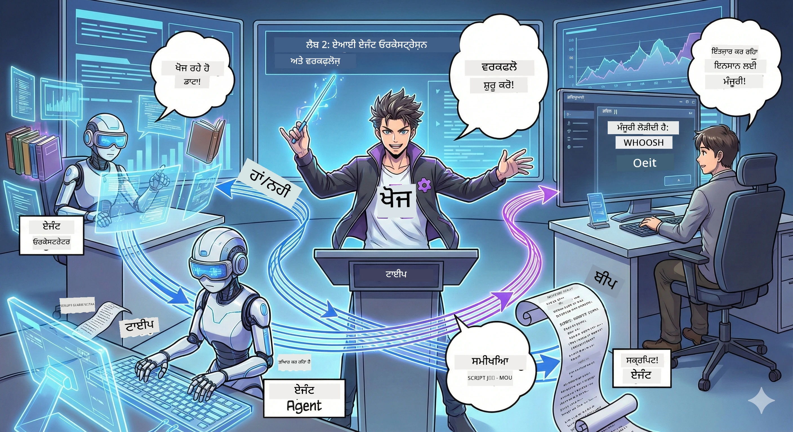

# ਅਧਿਆਇ 2: ਆਪਣੇ ਪੌਡਕਾਸਟ ਪ੍ਰੋਡਕਸ਼ਨ ਟੀਮ ਦਾ ਢਾਂਚਾ ਬਣਾਓ 🎬



## ਕਹਾਣੀ ਹੋ ਰਹੀ ਹੈ ਗੂੰਝਦਾਰ

ਅਲੇਕਸ (ਤੁਹਾਡਾ ਐਕਟ 1 ਤੋਂ AI ਸਹਾਇਕ) ਬਹੁਤ ਵਧੀਆ ਹੈ, ਪਰ ਇੱਕ ਏਜੰਟ ਪੂਰੇ ਪੌਡਕਾਸਟ ਸਟੂਡੀਓ ਨੂੰ ਨਹੀਂ ਚਲਾ ਸਕਦਾ। ਤੁਹਾਨੂੰ ਇੱਕ *ਟੀਮ* ਦੀ ਲੋੜ ਹੈ:
- 🔍 **ਰਿਸਰਚ ਏਜੰਟ**: ਤਾਜ਼ਾ ਜਾਣਕਾਰੀ ਲਈ ਇੰਟਰਨੈੱਟ ਖੰਗਾਲਦਾ ਹੈ
- ✍️ **ਸਕ੍ਰਿਪਟ ਏਜੰਟ**: ਰਿਸਰਚ ਨੂੰ ਮਨੋਹਰ ਸੰਵਾਦ ਵਿੱਚ ਬਦਲਦਾ ਹੈ
- 👤 **ਤੁਸੀਂ (ਸੰਪਾਦਕ)**: ਸਕ੍ਰਿਪਟਾਂ ਮਨਜ਼ੂਰ ਕਰਦੇ ਹੋ ਜਾਂ ਮੁੜ ਲਿਖਾਈ ਲਈ ਭੇਜਦੇ ਹੋ

ਸਵਾਗਤ ਹੈ **AI ਏਜੰਟ ਸੰਚਾਲਨ** ਵਿੱਚ — ਜਿੱਥੇ ਤੁਸੀਂ ਆਪਣੀ AI ਟੀਮ ਦੇ ਨਿਰਦੇਸ਼ਕ ਬਣ ਜਾਂਦੇ ਹੋ। ਸੋਚੋ Avengers ਵਰਗੇ, ਪਰ ਪੌਡਕਾਸਟ ਪ੍ਰੋਡਕਸ਼ਨ ਲਈ।

## ਏਜੰਟ ਸੰਚਾਲਨ ਕੀ ਹੈ? (ਸਰਲ ਵਰਜਨ)

ਕਲਪਨਾ ਕਰੋ ਤੁਸੀਂ ਇੱਕ ਰੈਸਟੋਰੈਂਟ ਚਲਾ ਰਹੇ ਹੋ। ਤੁਸੀਂ ਸਭ ਕੁਝ ਖੁਦ ਨਹੀਂ ਕਰਦੇ, ਹੈ ਨਾ? ਤੁਹਾਡੇ ਕੋਲ ਹਨ:
- 🍳 ਇੱਕ ਸ਼ੈਫ ਜੋ ਖਾਣਾ ਬਣਾਉਂਦਾ ਹੈ
- 👨‍🍳 ਇੱਕ ਸੂ ਸ਼ੈਫ ਜੋ ਤਿਆਰੀ ਕਰਦਾ ਹੈ
- 👩‍🍳 ਇੱਕ ਸਰਵਰ ਜੋ ਖਾਣਾ ਲੈ ਜਾਂਦਾ ਹੈ

ਏਜੰਟ ਸੰਚਾਲਨ ਵੀ ਉਹੀ ਖ਼ਿਆਲ ਹੈ, ਪਰ AI ਨਾਲ। ਹਰ ਏਜੰਟ ਦੀ ਇੱਕ ਵਿਸ਼ੇਸ਼ਤਾ ਹੁੰਦੀ ਹੈ, ਅਤੇ ਤੁਸੀਂ ਉਨ੍ਹਾਂ ਨੂੰ ਮੁਹੱਈਆ ਕਰਦੇ ਹੋ ਤਾਂ ਕਿ ਵੱਡੇ ਲਕੜਾਂ ਹਾਸਲ ਕੀਤੇ ਜਾ ਸਕਣ। ਕੋਈ ਵੀ ਏਜੰਟ ਝਿਜਕਦਾ ਨਹੀਂ, ਤੇ ਕੰਮ ਤੇਜ਼ ਹੁੰਦਾ ਹੈ।

### ਬੈਂਡ analogy 🎸

ਤੁਹਾਡੇ AI ਏਜੰਟ ਇੱਕ ਬੈਂਡ ਵਰਗੇ ਹਨ:
- **ਲੀਡ ਸਿੰਗਰ**: ਮੁੱਖ ਏਜੰਟ ਜੋ ਗਾਹਕ-ਸੰਬੰਧਿਤ ਕੰਮ ਸੰਭਾਲਦਾ ਹੈ
- **ਡਰੱਮਰ**: ਤਾਲਮੈਲ ਬਣਾਈ ਰੱਖਦਾ ਹੈ, ਪਿਛੋਕੜ ਪ੍ਰੋਸੈਸਿੰਗ ਕਰਦਾ ਹੈ
- **ਬਾਸ ਪਲੇਅਰ**: ਸਾਰੇ ਦਾ ਸਹਾਰਾ ਕਰਦਾ ਹੈ, ਡੇਟਾ ਲਿਆਉਂਦਾ ਹੈ
- **ਤੁਸੀਂ (ਬੈਂਡ ਮੈਨੇਜਰ)**: ਸਭ ਨੂੰ ਕੋਆਰਡੀਨੇਟ ਕਰਦੇ ਹੋ!

ਬਿਨਾਂ ਕੋਆਰਡੀਨੇਸ਼ਨ ਦੇ? ਸਿਰਫ਼ ਸ਼ੋਰ। ਕੋਆਰਡੀਨੇਸ਼ਨ ਨਾਲ? ਸੁਹਣਾ ਸੰਗੀਤ।

### ਇਹ ਮਹੱਤਵਪੂਰਣ ਕਿਉਂ ਹੈ

ਇੱਕ AI ਏਜੰਟ ਸਾਰੇ ਕੰਮ ਕਰਨ ਦੀ ਕੋਸ਼ਿਸ਼ ਕਰੇ = ਥਕਾਵਟ। ਵਿਸ਼ੇਸ਼ਾਜ्ञ ਏਜੰਟ ਇਕੱਠੇ ਕੰਮ ਕਰਨ = ਕੁਸ਼ਲਤਾ ਖੁਲਦੀ ਹੈ! 🚀

**ਅਸਲੀ ਗੱਲ**: ਯਾਦ ਹੈ ਤੂੰ ਆਪਣੇ ਪੌਡਕਾਸਟ ਦੀਖੋੜੀ ਖੋਜ, ਲਿਖਾਈ ਅਤੇ ਸੰਪਾਦਨ ਸਭ ਖੁਦ ਕਰ ਰਹਿਆ ਸੀ? ਹਾਂ, ਉਹ ਬੜਾ ਮੁਸ਼ਕਿਲ ਸੀ। ਸੰਚਾਲਨ ਨਾਲ, ਹਰ ਏਜੰਟ ਉਸ ਕੰਮ ਨੂੰ ਸੰਭਾਲਦਾ ਜਿੱਥੇ ਉਹ ਸਭ ਤੋਂ ਵਧੀਆ ਹੈ। ਤੁਸੀਂ ਸਿਰਫ਼ ਅੰਤਿਮ ਫੈਸਲੇ ਲੈਂਦੇ ਹੋ।

**ਅਸਲੀ ਦੁਨੀਆ ਉਦਾਹਰਨ**: ਗਾਹਕ ਸਹਾਇਤਾ ਬੋਟ ਜਿਹੜੇ ਹਰਮਸ਼ਾ ਜਾਣਦੇ ਹਨ ਕਿ ਕਦੋਂ ਬਿਲਿੰਗ ਨੂੰ ਹੱਲ ਕਰਨਾ ਹੈ, ਕਦੋਂ ਟੈਕਨੀਕਲ ਸਮੱਸਿਆਵਾਂ ਨੂੰ ਅਤੇ ਕਦੋਂ ਇਨਸਾਨ ਨੂੰ ਕਾਲ ਕਰਨਾ। ਇਹ ਹੈ ਸੰਚਾਲਨ!

## ਏਜੰਟ ਅਤੇ ਵਰਕਫਲੋ: ਫਰਕ ਕੀ ਹੈ?

ਇਸ ਤਰੀਕੇ ਨਾਲ ਸੋਚੋ:

### 🤖 AI ਏਜੰਟ = ਜੈਜ਼ ਮਿਊਜ਼ੀਸ਼ਨ
- **ਫੈਸਲੇ ਫੌਰਨ ਕਰਦਾ ਹੈ** ਜੋ ਕੁਝ ਉਹ ਸੁਣਦਾ ਹੈ ਉਸ ਅਧਾਰ 'ਤੇ
- **ਉਪਕਰਣਾਂ ਦੀ ਵਰਤੋਂ ਕਰਕੇ ਸੁਝਾਅ ਬਨਾਉਂਦਾ ਹੈ**
- **LLM ਦਿਮਾਗ ਨਾਲ ਸੋਚਦਾ ਹੈ**
- **ਤੁਰੇ ਹੋਏ ਕੰਮ ਨੁਝ ਦਾਰਦਾ ਹੈ**

### 🎵 ਵਰਕਫਲੋ = ਆਰਕੀਸਟਰਾ ਕਲਾਸੀਕੀ ਸੰਗੀਤ ਵਜਾ ਰਹੀ ਹੈ  
- **ਇੱਕ ਸਕੋਰ (ਪੂਰਵ-ਪ੍ਰਤਿਬੰਧਿਤ ਕਦਮ) ਦੀ ਪਾਲਣਾ ਕਰਦਾ ਹੈ**
- **ਪ੍ਰੇਖਣਯੋਗ ਕਾਰਜ ਰਾਹ**
- **ਬਹੁਤ ਸਾਰੇ ਏਜੰਟਾਂ, ਮਨੁੱਖਾਂ, ਪ੍ਰਣਾਲੀਆਂ ਨੂੰ ਕੂਆਰਡੀਨੇਟ ਕਰਦਾ ਹੈ**
- **ਇਕ ਰੇਸਿਪੀ ਵਾਂਗ ਸੰਰਚਿਤ**

**ਜਾਦੂ**: ਵਰਕਫਲੋ *ਏਜੰਟਾਂ ਨੂੰ ਸੰਚਾਲਿਤ* ਕਰਦੇ ਹਨ! ਤੁਸੀਂ ਇੱਕ ਵਰਕਫਲੋ ਬਨਾਉਂਦੇ ਹੋ ਜੋ ਏਜੰਟਾਂ ਨੂੰ ਦੱਸਦਾ ਹੈ ਕਦੋਂ ਆਪਣਾ ਭਾਗ ਨਿਭਾਉਣਾ ਹੈ। ਦੋਨੋ ਦੁਨੀਆਂ ਦਾ ਸਾਰਾ ਬੇਹਤਰੀਨ। 🎭

## ਆਪਣੇ AI ਟੀਮ ਨੂੰ ਕੋਆਰਡੀਨੇਟ ਕਰਨ ਦੇ ਤਿੰਨ ਤਰੀਕੇ

### 1. 🎯 ਕੇਂਦਰੀਕ੍ਰਿਤ (ਤੁਸੀਂ ਬਾਅਸ ਹੋ)

ਇੱਕ ਮੁੱਖ ਏਜੰਟ ਸਾਰੀਆਂ ਫ਼ੈਸਲਾਵਾਂ ਲੈਂਦਾ ਹੈ। ਇਹੋ ਜਿਹਾ ਹੈ ਜਿਵੇਂ ਤੁਸੀਂ ਟੀਮ ਸਮਭਾਲਦੇ ਹੋ — ਤੁਸੀਂ ਫੈਸਲਾ ਕਰਦੇ ਹੋ ਕਿ ਕੌਣ ਕੀ ਕਰੇ।

**ਫਾਇਦੇ**:
- ✅ ਸਾਫ ਸਲਾਹਕਾਰ (ਕੋਈ ਭ੍ਰਮ ਨਹੀਂ)
- ✅ ਮੁਕੰਮਲ ਫੈਸਲੇ
- ✅ ਸੌਖਾ ਡਿਬੱਗ ਕਰਨਾ

**ਇਸ ਲਈ ਵਰਤੋਂ**:
- ਗਾਹਕ ਸੇਵਾ ਰੂਟੀੰਗ ("ਕੀ ਇਹ ਬਿਲਿੰਗ ਹੈ ਜਾਂ ਟੈਕ ਸਹਾਇਤਾ?")
- ਸਮਗਰੀ ਮਨਜ਼ੂਰੀ ਵਰਕਫਲੋ ("ਕੀ ਇਹ ਸਕ੍ਰਿਪਟ ਪਾਸ ਕਰਦਾ ਹੈ?")
- ਪੌਡਕਾਸਟ ਪ੍ਰੋਡਕਸ਼ਨ (ਵਾਹਿਗੁਰੂ! ਇਹ ਜਦੋਂ ਅਸੀਂ ਬਣਾਉਂਦੇ ਹਾਂ!)

### 2. 🤝 ਡੀਸੈਂਟਰਲਾਈਜ਼ਡ (ਏਜੰਟ ਖੁਦ-ਆਯੋਜਿਤ ਹੋਂਦੇ ਹਨ)

ਏਜੰਟ ਸਿੱਧਾ ਆਪਸ ਵਿੱਚ ਗੱਲ ਕਰਦੇ ਹਨ ਅਤੇ ਗਰੁੱਪ ਵਾਂਗ ਸਮੱਸਿਆਵਾਂ ਨੂੰ ਸੁਲਝਾਉਂਦੇ ਹਨ। ਜਿਵੇਂ ਇੱਕ ਗਰੁੱਪ ਚੈਟ ਜਿੱਥੇ ਹਰ ਕੋਈ ਕੋਆਰਡੀਨੇਟ ਕਰਦਾ ਹੈ।

**ਫਾਇਦੇ**:
- ✅ ਸੌਖਾ ਸਕੇਲ (ਹੁਣੇ ਵੀ ਹੋਰ ਏਜੰਟ ਜੋੜੋ)
- ✅ ਕੋਈ ਇਕਲੌਤਾ ਫੇਲਿਊਰ ਪੁਆਇੰਟ ਨਹੀਂ
- ✅ ਏਜੰਟ ਕੁਦਰਤੀ ਤੌਰ 'ਤੇ ਸਹਿਯੋਗੀ ਹੋਂਦੇ ਹਨ

**ਇਸ ਲਈ ਵਰਤੋਂ**:
- ਰਿਸਰਚ ਟੀਮਾਂ (ਹਰ ਏਜੰਟ ਵੱਖ-ਵੱਖ ਸਰੋਤ ਖੋਜਦਾ ਹੈ)
- ਬ੍ਰੇਨਸਟਾਰਮਿੰਗ ਸੈਸ਼ਨਾਂ
- ਵੰਡੇ ਹੋਏ ਸਮੱਸਿਆ-ਸੁਲਝਾਅ

### 3. 🔀 ਹਾਈਬ੍ਰਿਡ (ਦੋਹਾਂ ਦੁਨੀਆਂ ਦਾ ਬੇਹਤਰੀਨ)

ਤੁਸੀਂ ਕੁੱਲ ਦਿਸ਼ਾ ਨਿਰਦੇਸ਼ ਕਰਦੇ ਹੋ, ਪਰ ਏਜੰਟਾਂ ਨੂੰ ਖੁਦ ਨੂੰ ਕਾਰਜਾਂ 'ਤੇ ਆਯੋਜਿਤ ਕਰਨ ਦੀ ਆਜ਼ਾਦੀ ਹੈ। ਵਾਂਗ ਜਿਵੇਂ ਇੱਕ CEO ਜੋ ਆਪਣੀ ਟੀਮ 'ਤੇ ਭਰੋਸਾ ਕਰਦਾ ਹੈ।

**ਸਿਰਫ਼ ਉੱਚੇ ਪੱਧਰ ਦੇ ਪ੍ਰਾਜੈਕਟ ਲਈ**: ਜਿੱਥੇ ਦੋਹਾਂ ਕੰਟਰੋਲ ਅਤੇ ਲਚਕੀਲਾਪਨ ਦੀ ਲੋੜ ਹੈ।

## Microsoft Agent Framework: ਤੁਹਾਡਾ ਸੰਚਾਲਨ ਟੂਲਕਿੱਟ 🧰

ਬਣਾਉਣਾ ਸ਼ੁਰੂ ਕਰੋ! ਇਹ ਹਨ ਉਹ ਸਮਾਨ ਜੋ ਤੁਸੀਂ ਵਰਤੋਗੇ:

### ਬਣਾਉਣ ਵਾਲੇ ਹਿੱਸੇ

#### 1. 🧱 ਐਗਜ਼ੀਕਿਊਟਰ (ਤੁਹਾਡੇ ਵਰਕਰ)
- **ਕੀ ਹਨ**: ਵੱਖ-ਵੱਖ ਪ੍ਰੋਸੈਸਿੰਗ ਯੂਨਿਟ — ਹੋ ਸਕਦਾ ਹੈ ਏਜੰਟ ਜਾਂ ਕਸਟਮ ਲਾਜਿਕ
- **ਕੀ ਕਰਦੇ ਹਨ**: ਇਨਪੁੱਟ ਲੈ ਕੇ ਕੰਮ ਕਰਦੇ ਹਨ ਅਤੇ ਆਉਟਪੁੱਟ ਬਣਾਉਂਦੇ ਹਨ
- **ਇਨ੍ਹਾ ਨੂੰ ਸੋਚੋ**: ਅਸੰਬਲੀ ਲਾਈਨ ਵਿੱਚ ਸਟੇਸ਼ਨਾਂ ਵਾਂਗ

#### 2. ➡️ ਐਡਜ (ਜੋੜ)
- **ਕੀ ਹਨ**: ਐਗਜ਼ੀਕਿਊਟਰਾਂ ਵਿਚਕਾਰ ਰਾਹ
- **ਕੀ ਕਰਦੇ ਹਨ**: ਸੁਨੇਹਾ ਦਾ ਬਹਾਉਂ ਸੰਭਾਲਦੇ ਹਨ ("A ਤੋਂ ਬਾਅਦ B ਤੇ ਜਾਓ")
- **ਇਨ੍ਹਾ ਨੂੰ ਸੋਚੋ**: ਫਲੋਚਾਰਟ ਵਿੱਚ ਤੀਰਾਂ ਵਾਂਗ

#### 3. 🗺️ ਵਰਕਫਲੋ (ਮਾਸਟਰ ਯੋਜਨਾ)
- **ਕੀ ਹਨ**: ਪੂਰਾ ਗ੍ਰਾਫ ਐਗਜ਼ੀਕਿਊਟਰ ਅਤੇ ਐਡਜ ਦਾ
- **ਕੀ ਕਰਦੇ ਹਨ**: ਸ਼ੁਰੂ ਤੋਂ ਅੰਤ ਤੱਕ ਪੂਰਾ ਪ੍ਰਕਿਰਿਆ ਨਿਰਧਾਰਿਤ ਕਰਦੇ ਹਨ
- **ਇਨ੍ਹਾ ਨੂੰ ਸੋਚੋ**: ਤੁਹਾਡੀ ਪ੍ਰੋਡਕਸ਼ਨ ਅੰਗੀਠੀ ਦਾ ਖਾਕਾ

### ਕੋਈ ਸ਼ਾਨਦਾਰ ਫੀਚਰ ਜੋ ਤੁਸੀਂ ਪਸੰਦ ਕਰੋਗੇ

**🛡️ ਟਾਈਪ ਸੁਰੱਖਿਆ**: ਏਜੰਟਾਂ ਵਿਚਕਾਰ ਸੁਨੇਹਿਆਂ ਦਾ ਟਾਈਪ-ਚੈੱਕ ਹੋਂਦਾ ਹੈ। "ਔਪਸ, ਗਲਤ ਡੇਟਾ ਟਾਈਪ" ਨਹੀਂ।

**🔀 ਲਚਕੀਲਾ ਰੂਟਿੰਗ**: 
- ਜੇ-ਤਾਂ ਸ਼ਰਤਾਂ ("ਜੇ ਮਨਜ਼ੂਰ ਹੋਇਆ, ਪ੍ਰਕਾਸ਼ਿਤ ਕਰੋ; ਨਹੀਂ ਤਾਂ ਮੁੜ ਲਿਖੋ")
- ਸਮਾਂਤਰੀ ਪ੍ਰੋਸੈਸਿੰਗ (ਕਈ ਏਜੰਟ ਇਕੱਠੇ ਕੰਮ ਕਰਦੇ ਹਨ)
- ਡਾਇਨਾਮਿਕ ਰਾਹ (ਵਰਕਫਲੋ ਨਤੀਜਿਆਂ ਦੇ ਆਧਾਰ ਤੇ ਬਦਲਦਾ ਹੈ)

**🔌 ਬਾਹਰੀ ਇਕੱਠਾਪਣ**:
- APIs ਨਾਲ ਕਨੈਕਟ ਕਰੋ
- ਮਨੁੱਖ ਨੂੰ ਸ਼ਾਮਲ ਕਰਨ ਵਾਲੇ ਚੈੱਕਪੌਇੰਟ (ਤੁਸੀਂ ਪ੍ਰਕਾਸ਼ਿਤ ਤੋਂ ਪਹਿਲਾਂ ਮਨਜ਼ੂਰ ਕਰਦੇ ਹੋ)
- ਬੇਨਤੀ/ਜਵਾਬ ਵਹਾਵਾਂ ਬਣਾ ਕੇ

**💾 ਚੈੱਕਪੌਇੰਟਿੰਗ**: ਪ੍ਰਗਤੀ ਸੰਭਾਲ਼ੋ! ਜੇ ਕੁਝ ਕਰੈਸ਼ ਕਰਦਾ ਹੈ, ਜਿੱਥੋਂ ਛੱਡਿਆ ਸੀ ਉੱਥੋਂ ਸ਼ੁਰੂ ਕਰੋ।

**🤝 ਬਹੁ-ਏਜੰਟ ਕੋਆਰਡੀਨੇਸ਼ਨ**:
- ਏਜੰਟਾਂ ਨੂੰ ਕ੍ਰਮਹਾਰ ਵਿਚ ਚਲਾੳੁ (A → B → C)
- ਉਨ੍ਹਾਂ ਨੂੰ ਸਮਾਂਤਰੀ ਚਲਾਉ (A + B + C ਇਕੱਠੇ)
- ਏਜੰਟਾਂ ਵਿਚਕਾਰ ਹਥਿਆਰੁਦਾਰੀ
- ਸਹਿਯੋਗੀ ਪ੍ਰੋਸੈਸਿੰਗ

## ਬਿਹਤਰ ਅਭਿਆਸ (ਮਾਹਿਰ ਸੁਝਾਅ) 🎯

### 1. ਇਸਨੂੰ ਮੋਡਿਊਲਰ ਰੱਖੋ
ਹਰ ਏਜੰਟ ਨੂੰ ਇੱਕ ਕੰਮ ਮਨੁੱਖੀ ਤਰ੍ਹਾਂ ਚੰਗੀ ਤਰ੍ਹਾਂ ਕਰਨਾ ਚਾਹੀਦਾ ਹੈ। "ਸੁਪਰ ਏਜੰਟ" ਨਾ ਬਣਾਓ ਜੋ ਸਭ ਕੁਝ ਕਰੇ — ਡਿਬੱਗ ਕਰਦਿਆਂ ਬਾਅਦ ਅਫਸੋਸ ਹੋਵੇਗਾ।

### 2. ਫੇਲਿਊਰ ਦੇ ਲਈ ਯੋਜਨਾ ਬਣਾਓ
ਏਜੰਟ ਗਲਤੀਆਂ ਕਰਦੇ ਹਨ। ਨੈਟਵਰਕ ਫੇਲ੍ਹ ਹੁੰਦੇ ਹਨ। ਤਰਤੀਬ ਨਾਲ ਐਰਰ ਹੈਂਡਲਿੰਗ ਅਤੇ ਬੈਕਅਪ ਯੋਜਨਾਵਾਂ ਬਣਾਓ। ਭਵਿੱਖ ਵਿੱਚ ਤੁਸੀਂ ਧੰਨਵਾਦ ਕਰੋਗੇ।

### 3. ਸਭ ਕੁਝ ਮਾਨੀਟਰ ਕਰੋ
ਦੇਖੋ ਕਿ ਤੁਹਾਡੇ ਏਜੰਟ ਕੀ ਕਰ ਰਹੇ ਹਨ। DevUI ਵਰਤੋਂ (ਅਸੀਂ ਇਸ ਚਰਚਾ ਕਰਾਂਗੇ!) ਵਰਕਫਲੋ ਨੂੰ ਚਲਦੇ ਵੇਖਣ ਲਈ।

### 4. ਸੁਨੇਹੇ ਦਾ ਆਕਾਰ ਠੀਕ ਕਰੋ
ਵੱਡੀਆਂ ਫਾਈਲਾਂ ਏਜੰਟਾਂ ਵਿਚਕਾਰ ਨਾ ਭੇਜੋ। ਸੁਨੇਹੇ ਛੋਟੇ ਤੇ ਤੇਜ਼ ਰੱਖੋ।

### 5. ਸਹੀ ਪੈਟਰਨ ਚੁਣੋ
ਕੰਟਰੋਲ ਚਾਹੀਦਾ? ਕੇਂਦਰੀਕ੍ਰਿਤ ਜਾਓ। ਸਕੇਲ ਚਾਹੀਦਾ? ਡੀਸੈਂਟਰਲਾਈਜ਼ਡ ਜਾਓ। ਫੈਸਲਾ ਨਹੀਂ ਹੋ ਰਿਹਾ? ਹਾਈਬ੍ਰਿਡ ਵਰਤੋਂ।

## DevUI: ਤੁਹਾਡਾ ਵਰਕਫਲੋ ਡਿਬੱਗਰ 🔍

### DevUI ਕੀ ਹੈ?

DevUI ਇੱਕ ਖੇਡ-ਜ਼ਗ੍ਹਾ ਵਾਂਗ ਹੈ ਜਿੱਥੇ ਤੁਸੀਂ ਆਪਣੇ ਏਜੰਟ ਅਤੇ ਵਰਕਫਲੋਜ਼ ਦੀ ਟੈਸਟਿੰਗ ਕਰ ਸਕਦੇ ਹੋ। ਇਹ ਇੱਕ ਵੈੱਬ ਇੰਟਰਫੇਸ ਹੈ ਜਿੱਥੇ ਤੁਸੀਂ:
- 👀 ਆਪਣਾ ਵਰਕਫਲੋ ਚੱਲਦੇ ਵੇਖ ਸਕਦੇ ਹੋ
- 💬 ਸਿੱਧਾ ਏਜੰਟਾਂ ਨਾਲ ਗੱਲਬਾਤ ਕਰ ਸਕਦੇ ਹੋ
- 🔍 ਗਲਤ ਹੋਣ 'ਤੇ ਡਿਬੱਗ ਕਰ ਸਕਦੇ ਹੋ
- 📊 ਟਰੇਸ ਅਤੇ ਪ੍ਰਦਰਸ਼ਨ ਮੈਟਰਿਕਸ ਵੇਖ ਸਕਦੇ ਹੋ

> **ਜ਼ਰੂਰੀ**: DevUI ਸਿਰਫ ਵਿਕਾਸ ਲਈ! ਪ੍ਰੋਡਕਸ਼ਨ ਵਿੱਚ ਇਸ ਨੂੰ ਨਾ ਵਰਤੋ। ਇਹ ਤੁਹਾਡਾ ਸਥਾਨਕ ਟੈਸਟਿੰਗ ਵਾਤਾਵਰਨ ਹੈ।

### ਇਹ ਕਿਵੇਂ ਸ਼ਾਨਦਾਰ ਹੈ

- **🖥️ ਇੰਟਰਐਕਟਿਵ ਵੈੱਬ UI**: ਕਲਿੱਕ ਕਰੋ, ਲਿਖੋ, ਟੈਸਟ ਕਰੋ — ਕੋਈ ਕਮਾਂਡ ਲਾਈਨ ਨਹੀਂ ਚਾਹੀਦੀ
- **📁 ਡਰੈਗ-ਐਂਡ-ਡ੍ਰੌਪ ਤਿਆਰ**: ਫਾਈਲਾਂ ਅਪਲੋਡ ਕਰੋ, ਵੱਖ-ਵੱਖ ਇਨਪੁੱਟ ਨਾਲ ਟੈਸਟ ਕਰੋ
- **📂 ਆਟੋ-ਖੋਜ**: ਕਿਸੇ ਫੋਲਡਰ ਨੂੰ ਪਾਇੰਟ ਕਰੋ, ਇਹ ਆਪਣੇ ਆਪ ਸਾਰੇ ਏਜੰਟ ਲੱਭ ਲੈਂਦਾ ਹੈ
- **📋 ਕੋਡ ਵਿੱਚ ਰਜਿਸਟਰ ਕਰੋ**: ਕੋਈ ਫੋਲਡਰ ਢਾਂਚਾ ਲੋੜ ਨਹੀਂ
- **🔌 OpenAI ਸੰਗਤ ਹੈ**: OpenAI SDK ਨਾਲ ਕੰਮ ਕਰਦਾ ਹੈ (ਸੰਗਤਿਤਾ FTW!)
- **👁️ ਟਰੇਸਿੰਗ ਬਿਲਟ-ਇਨ**: ਤੁਹਾਨੂੰ ਦੇਖ ਸਕਦਾ ਹੈ ਕਿ ਤੁਹਾਡੇ ਏਜੰਟ ਕੀ ਕਰ ਰਹੇ ਹਨ

### ਇਨਪੁੱਟ ਕਿਵੇਂ ਕੰਮ ਕਰਦਾ ਹੈ

DevUI ਇਨਪੁੱਟ ਲਈ ਸਮਾਰਟ ਹੈ:

- **ਏਜੰਟਾਂ ਨੂੰ ਟੈਸਟ ਕਰ ਰਹੇ ਹੋ?** ਤੁਹਾਨੂੰ ਟੈਕਸਟ ਬਾਕਸ ਅਤੇ ਫਾਈਲ ਅਪਲੋਡ ਬਟਨ ਮਿਲਣਗੇ
- **ਵਰਕਫਲੋ ਨੂੰ ਟੈਸਟ ਕਰ ਰਹੇ ਹੋ?** UI ਆਪਣੇ ਆਪ ਇਨਪੁੱਟ ਫੀਲਡ ਬਣਾਉਂਦਾ ਹੈ ਜੋ ਤੁਹਾਡਾ ਵਰਕਫਲੋ ਉਮੀਦ ਕਰਦਾ ਹੈ

ਇਹ ਜਾਦੂ ਵਾਂਗ ਹੈ, ਪਰ ਜ਼ਰੂਰੀ ਤੌਰ 'ਤੇ ਵਧੀਆ ਕੋਡ ਹੈ। ✨

## ਤੁਹਾਡੇ ਮਿਸ਼ਨ: ਇੱਕ ਪੌਡਕਾਸਟ ਸਟੂਡੀੋ ਬਣਾਉਣਾ 🎬

### ਮਿਸ਼ਨ 1: DevUI ਨਾਲ ਇੱਕ ਏਕਲ ਏਜੰਟ ਬਣਾਓ

📂 [01.AgentDevUI](../../../../WorkshopForAgentic/code/02.Workflow/01.AgentDevUI)

**ਚੁਣੌਤੀ**: ਪੂਰੀ ਟੀਮ ਬਣਾਉਣ ਤੋਂ ਪਹਿਲਾਂ DevUI ਨਾਲ ਇੱਕ ਏਜੰਟ ਦੀ ਟੈਸਟਿੰਗ ਕਰੋ: ਵੈੱਬ ਖੋਜ ਵਿਸ਼ੇਸ਼ਜ્ઞ।

**ਤੁਸੀਂ ਜੋ ਬਣਾਉਣ ਜਾ ਰਹੇ ਹੋ**:
ਇੱਕ ਰਿਸਰਚ ਏਜੰਟ ਜੋ ਪੌਡਕਾਸਟ ਵਿਸ਼ਿਆਂ ਲਈ ਇੰਟਰਨੈੱਟ ਖੋਜ ਕਰ ਸਕਦਾ ਹੈ। ਤੁਸੀਂ ਇਸ ਨੂੰ DevUI ਦੇ ਵੈੱਬ ਇੰਟਰਫੇਸ ’ਤੇ http://localhost:8090 ’ਤੇ ਟੈਸਟ ਕਰੋਗੇ।

**ਸਿਖਿਆਵਾਂ ਜੋ ਤੁਸੀਂ ਲਵੋਗੇ**:
- 🚀 DevUI ਵਿੱਚ ਏਜੰਟ ਲਾਂਚ ਕਰਨਾ
- 🔍 ਏਜੰਟ ਦੇ ਤੁਰੰਤ ਜਵਾਬ ਟੈਸਟ ਕਰਨਾ
- 🛠️ ਕਸਟਮ ਟੂਲ ਬਣਾਉਣਾ (ਵੈੱਬ ਖੋਜ)
- 📊 ਡਿਬੱਗ ਕਰਨ ਲਈ ਟਰੇਸਿੰਗ ਚਾਲੂ ਕਰਨਾ
- 🖥️ ਇੰਟਰਐਕਟਿਵ ਵੈੱਬ UI ਵਰਤਣਾ

**ਕੋਡ**:
- `agent.py`: ਤੁਹਾਡਾ SearchAgent ਵੈੱਬ ਖੋਜ ਦੀ ਸ਼ਕਤਿ ਨਾਲ
- OllamaChatClient ਨਾਲ Qwen ਕੋਨੈਕਟ ਕਰਦਾ ਹੈ
- `web_search()` ਟੂਲ ਫੰਕਸ਼ਨ ਨੂੰ ਲਾਗੂ ਕਰਦਾ ਹੈ
- `serve()` ਨਾਲ ਲਾਂਚ ਕਰਦਾ ਹੈ — DevUI ਆਪਣੇ ਆਪ ਖੁਲਦਾ ਹੈ

**ਜਿੱਤ ਦੀ ਸ਼ਰਤ**: ਆਪਣੇ ਏਜੰਟ ਨੂੰ ਪੁੱਛੋ "AI ਵਿੱਚ ਕੀ ਟ੍ਰੇਂਡਿੰਗ ਹੈ?" ਅਤੇ ਦੇਖੋ ਕਿਵੇਂ ਉਹ ਵੈੱਬ ਖੋਜਦਾ ਹੈ! 🎉

### ਮਿਸ਼ਨ 2: ਬਹੁ-ਏਜੰਟ ਵਰਕਫਲੋ ਬਣਾਓ

📂 [02.WorkflowDevUI](../../../../WorkshopForAgentic/code/02.Workflow/02.WorkflowDevUI)

**ਚੁਣੌਤੀ**: ਹੁਣ ਅਸਲ ਮਜ਼ਾ ਸ਼ੁਰੂ ਹੁੰਦਾ ਹੈ! ਇੱਕ ਪੂਰਾ ਪੌਡਕਾਸਟ ਪ੍ਰੋਡਕਸ਼ਨ ਵਰਕਫਲੋ ਬਣਾਓ ਜਿਸ ਵਿੱਚ ਹਨ:
1. 🔍 **ਸਰਚ ਏਜੰਟ** → ਤੁਹਾਡੇ ਵਿਸ਼ੇ ਦੀ ਖੋਜ ਕਰਦਾ ਹੈ
2. ✍️ **ਸਕ੍ਰਿਪਟ ਏਜੰਟ** → ਦੋ ਮੇਜ਼ਬਾਨਾਂ ਵਿਚ ਵਾਰਤਾਲਾਪ ਲਿਖਦਾ ਹੈ (ਚੀਨੀ ਵਿੱਚ!)
3. 👤 **ਰੀਵਿਊ ਐਗਜ਼ੀਕਿਊਟਰ** → ਤੈਨੂੰ ਮਨਜ਼ੂਰੀ ਜਾਂ ਨਾਕਾਰਾ ਕਰਨ ਲਈ ਪੁੱਛਦਾ ਹੈ
4. 🔄 **ਲੂਪ ਬੈਕ** → ਜੇ ਨਾਕਾਰਾ ਹੋਇਆ, ਤਾਂ ਤੁਹਾਡੇ ਫੀਡਬੈਕ 'ਤੇ ਮੁੜ ਲਿਖਦਾ ਹੈ

**ਤੁਸੀਂ ਜੋ ਸਿਖੋਗੇ**:
- 🧱 ਵੱਖ-ਵੱਖ ਕੰਮਾਂ ਦੇ ਲਈ ਵਿਸ਼ੇਸ਼ ਏਜੰਟ ਬਣਾਉਣਾ
- 🔗 ਵਰਕਫਲੌਬਿਲਡਰ ਨਾਲ ਏਜੰਟਾਂ ਨੂੰ ਜੋੜਨਾ
- 🔀 ਮਨੁੱਖ-ਇਨ-ਦਾ-ਲੂਪ ਹਵਾਲੇ ਨਾਲ ਮਨਜ਼ੂਰੀ ਦੇ ਲੂਪ ਲਗਾਉਣਾ
- 🚦 ਸ਼ਰਤੀ ਰੂਟਿੰਗ (ਜੇ ਮਨਜ਼ੂਰ, ਜਾਂ ਨਾਕਾਰਾ ਹੋਇਆ)
- 🔧 ਕਾਰੋਬਾਰੀ ਲਾਜਿਕ ਲਈ ਕਸਟਮ ਐਗਜ਼ੀਕਿਊਟਰ ਬਣਾਉਣਾ

**ਵਰਕਫਲੋ**:  
```
SearchAgent → ScriptAgent → ReviewExecutor
                             ↑          ↓ (if rejected)
                             ←─────────
```
  
**ਕੋਡ**:  
- `search_agent/agent.py`: ਤੁਹਾਡਾ ਖੋਜ ਵਿਸ਼ੇਸ਼ਜ्ञ  
- `generate_script_agent/agent.py`: ਤੁਹਾਡਾ ਸਕ੍ਰਿਪਟ ਲੇਖਕ (ਚੀਨੀ ਵਿੱਚ ਲਿਖਦਾ ਹੈ!)  
- `workflow/workflow.py`: ਇਥੇ ਸੰਚਾਲਨਵਾਦ ਦਾ ਜਾਦੂ ਹੁੰਦਾ ਹੈ  
- `main.py`: ਸਭ ਕੁਝ DevUI ਵਿੱਚ ਲਾਂਚ ਕਰਦਾ ਹੈ  

**ਜਿੱਤ ਦੀ ਸ਼ਰਤ**: ਇੱਕ ਵਿਸ਼ਾ ਦਿਓ, ਸਕ੍ਰਿਪਟ ਦੀ ਸਮੀਖਿਆ ਕਰੋ, ਇੱਕ ਵਾਰੀ ਨਾਕਾਰਾ ਕਰੋ ਜਾਂਚ ਲਈ, ਫਿਰ ਮਨਜ਼ੂਰ ਕਰੋ! 🎉

### ਮਿਸ਼ਨ 3: ਇੱਕ ਕੰਸੋਲ ਐਪ ਬਣਾਓ

📂 [03.Application](../../../../WorkshopForAgentic/code/02.Workflow/03.Application)

**ਚੁਣੌਤੀ**: DevUI ਤੋਂ ਆਪਣੇ ਵਰਕਫਲੋ ਨੂੰ ਲੈ ਕੇ ਇੱਕ ਫੈਨਸੀ ਟਰਮੀਨਲ ਐਪ ਬਣਾਓ ਜਿਸ ਵਿੱਚ ਰੰਗ ਬਰੰਗਾ ਆਉਟਪੁੱਟ, ਲੋਡਿੰਗ ਸਪਿੰਨਰ ਅਤੇ ਫਾਈਲ ਸੇਵਿੰਗ ਹੈ। ਇਹ ਤਿਆਰ-ਪੈਦਾWAR ਹਨ!

**ਤੁਸੀਂ ਜੋ ਸਿਖੋਗੇ**:
- ⚡ ਕਾਰਜਕ੍ਰਮ ਵਜੋਂ ਵਰਕਫਲੋ ਚਲਾਉਣਾ (DevUI ਤੋਂ ਬਿਨਾਂ)
- 📡 ਸਟ੍ਰੀਮਿੰਗ ਨਾਲ ਘਟਨਾ ਦੀਆ ਸੰਰਚਨਾ
- 🎨 ਖੂਬਸੂਰਤ ਟਰਮੀਨਲ UI ਬਣਾਉਣਾ (ਰੰਗ, ਸਪਿੰਨਰ, ਪ੍ਰਗਟੀ ਬਾਰ)
- 💾 ਅੰਤਿਮ ਸਕ੍ਰਿਪਟ ਫਾਈਲਾਂ ਵਿੱਚ ਸੇਵ ਕਰਨਾ
- 🔄 Python ਦੀ asyncio ਨਾਲ ਐਸਿੰਕ ਵਰਕਫਲੋ ਹੈਂਡਲਿੰਗ

**ਕੀ ਕਰਦਾ ਹੈ**:
1. ਤੁਹਾਡੇ ਤੋਂ ਪੌਡਕਾਸਟ ਵਿਸ਼ਾ ਪੁੱਛਦਾ ਹੈ
2. ਤੁਰੰਤ ਪ੍ਰਗਤੀ ਦਿਖਾਉਂਦਾ ਹੈ ("ਸਰਚ ਏਜੰਟ ਕੰਮ ਕਰ ਰਿਹਾ ਹੈ...")
3. ਥਾਪਿਆ ਹੋਇਆ ਸਕ੍ਰਿਪਟ ਰੰਗਦਾਰ ਦਿਖਾਉਂਦਾ ਹੈ
4. ਤੁਹਾਡੇ ਮਨਜ਼ੂਰੀ ਲਈ ਪੁੱਛਦਾ ਹੈ
5. ਮਨਜ਼ੂਰ ਕੀਤਾ ਸਕ੍ਰਿਪਟ `podcast.txt` ਵਿਚ ਸੇਵ ਕਰਦਾ ਹੈ

**ਕੋਡ**:
- `podcast_app.py`: ਤੁਹਾਡਾ ਮੁੱਖ ਐਪ ਇਵੈਂਟ ਹੈਂਡਲਿੰਗ ਨਾਲ  
- `workflow.py`: ਮਿਸ਼ਨ 2 ਤੋਂ ਵਰਕਫਲੋ ਦੁਬਾਰਾ ਵਰਤਦਾ ਹੈ  
- ਇਵੈਂਟ ਸੰਭਾਲਦਾ: `AgentRunUpdateEvent`, `RequestInfoEvent`, `WorkflowOutputEvent`  
- ਟਰਮੀਨਲ ਸਟਾਈਲਿੰਗ ਲਈ ANSI ਰੰਗ ਵਰਤਦਾ ਹੈ  

**ਜਿੱਤ ਦੀ ਸ਼ਰਤ**: ਐਪ ਚਲਾਓ, ਇੱਕ ਪੌਡਕਾਸਟ ਸਕ੍ਰਿਪਟ ਬਣਾਓ, ਅਤੇ ਵੇਖੋ ਕਿ ਇਹ ਸੇਵ ਹੋ ਗਿਆ! ਤੁਸੀਂ ਇੱਕ ਅਸਲੀ ਟੂਲ ਬਣਾਇਆ ਹੈ। 🚀

## ਤੁਸੀਂ ਕੀ ਮਾਹਰਤਾ ਹਾਸਲ ਕੀਤੀ ਹੈ 🏆

ਅਧਿਆਇ 2 ਤੋਂ ਬਾਅਦ, ਤੁਸੀਂ ਕਰ ਸਕਦੇ ਹੋ:

- ✅ ਕਈ AI ਏਜੰਟਾਂ ਨੂੰ ਬਾਅਸ ਵਾਂਗ ਸੰਚਾਲਿਤ ਕਰਨਾ
- ✅ ਸਤਰਬੱਧ ਅਤੇ ਸ਼ਰਤਾਂ ਵਾਲੇ ਲਾਜਿਕ ਨਾਲ ਵਰਕਫਲੋ ਬਣਾਉਣਾ
- ✅ ਮਨੁੱਖੀ ਮਨਜ਼ੂਰੀ ਚੈੱਕਪੌਇੰਟ ਸ਼ਾਮਿਲ ਕਰਨਾ
- ✅ DevUI ਨਾਲ ਵਰਕਫਲੋਜ਼ ਦੀ ਟੈਸਟਿੰਗ ਅਤੇ ਡਿਬੱਗ ਕਰਨਾ
- ✅ ਪ੍ਰੋਡਕਸ਼ਨ-ਤਿਆਰ ਕੰਸੋਲ ਐਪਲੀਕੇਸ਼ਨ ਬਣਾਉਣਾ
- ✅ ਜਟਿਲ ਪ੍ਰਣਾਲੀਆਂ ਵਿੱਚ ਗਲਤੀਆਂ ਨੂੰ ਸੋਹਣੇ ਤਰੀਕੇ ਨਾਲ ਸੰਭਾਲਣਾ
- ✅ ਕਿਸੇ ਵੀ ਪ੍ਰੋਜੈਕਟ ਲਈ ਠੀਕ ਸੰਚਾਲਨ ਪੈਟਰਨ ਚੁਣਨਾ

## ਜਦੋਂ ਗਲਤੀਆਂ ਹੁੰਦੀਆਂ ਹਨ 🔧

### "ਮੇਰਾ ਵਰਕਫਲੋ ਬਹੁਤ ਜਟਿਲ ਹੈ!"
**ਸੁਧਾਰ**: ਇਸਨੂੰ ਛੋਟੇ ਛੋਟੇ ਸਬ-ਵਰਕਫਲੋਜ਼ ਵਿੱਚ ਵੰਡੋ। ਹਰ ਵਰਕਫਲੋ ਇੱਕ ਕੰਮ ਚੰਗੀ ਤਰ੍ਹਾਂ ਕਰੇ। ਜਰੂਰਤ ਹੋਵੇ ਤਾਂ ਉਨ੍ਹਾਂ ਨੂੰ ਜੋੜੋ।

### "ਮੈਨੂੰ ਸਮਝ ਨਹੀਂ ਆ ਰਿਹਾ ਕਿ ਕੀ ਹੋ ਰਿਹਾ ਹੈ!"
**ਸੁਧਾਰ**: ਵਰਕਫਲੋ ਚੈਕਪੌਇੰਟਿੰਗ ਵਰਤ ਕੇ ਸਥਿਤੀ ਸੰਭਾਲੋ। DevUI 'ਚ ਟਰੇਸਿੰਗ ਚਾਲੂ ਕਰੋ ਤਾਂ ਜੋ ਹਰ ਕਦਮ ਦੇਖ ਸਕੋ।

### "ਇੱਕ ਏਜੰਟ ਦੀ ਗਲਤੀ ਨਾਲ ਸਾਰਾ ਸਿਸਟਮ ਡਿੱਗ ਜਾਂਦਾ ਹੈ!"
**ਸੁਧਾਰ**: ਐਰਰ ਬਾਊਂਡਰੀਜ਼ ਸ਼ਾਮਿਲ ਕਰੋ। ਹਰ ਏਜੰਟ ਨੂੰ ਆਪਣੀਆਂ ਗਲਤੀਆਂ ਸੰਭਾਲਣੀਆਂ ਚਾਹੀਦੀਆਂ ਹਨ ਅਤੇ ਫਾਲਬੈਕ ਵਿਹਾਰ ਹੋਣਾ ਚਾਹੀਦਾ ਹੈ।

### "ਇਹ ਬਹੁਤ ਧੀਮਾ ਹੈ"
**ਸੁਧਾਰ**: ਕੀ ਕੋਈ ਏਜੰਟ ਸਮਾਂਤਰ ਚੱਲ ਸਕਦੇ ਹਨ? ਕ੍ਰਮਿਕ ਵਰਕਫਲੋਜ਼ ਆਸਾਨ ਪਰ ਧੀਮੇ ਹਨ। ਸਮਾਂਤਰੀ ਚਲਾਉਣ ਦੇ ਮੌਕੇ ਲੱਭੋ!

## ਮਦਦਗਾਰ ਸਰੋਤ 🔗

- [Workflow Docs](https://learn.microsoft.com/en-us/agent-framework/user-guide/workflows/overview) — ਮਾਈਕਰੋਸੌਫਟ ਦੇ ਅਧਿਕਾਰਤ ਗਾਈਡ
- [Orchestration Patterns](https://www.ibm.com/think/topics/ai-agent-orchestration) — IBM ਵੱਲੋਂ ਇਸ ਬਾਰੇ ਜਾਣਕਾਰੀ
- [Agent Framework GitHub](https://github.com/microsoft/agent-framework) — ਸੋਰਸ ਕੋਡ ਵੇਖੋ
- [ਕੋਡ ਉਦਾਹਰਨਾਂ](https://github.com/microsoft/agent-framework/tree/main/python/samples) — ਇੱਥੋਂ ਨਮੂਨੇ ਚੋਰੀ ਕਰੋ

---

**ਅਖੀਰਲੇ ਲਈ ਤਿਆਰ?** ਤੁਹਾਡੇ ਕੋਲ ਆਪਣੀ ਸਕ੍ਰਿਪਟ ਹੈ। ਹੁਣ ਚਲੋ ਇਸਨੂੰ ਅਸਲ ਆਡੀਓ ਵਿੱਚ ਬਦਲਦੇ ਹਾਂ! → [ਅਧਿਆਇ 3: ਆਪਣਾ ਪਾਡਕਾਸਟ ਜੀਵੰਤ ਬਣਾਓ](03.Multi-SpeakerPodcastGenerationWithVibeVoice.md) 🎤

---

**ਅਟਕ ਗਏ? ਗੁੰਝਲਦਾਰ? ਉਤਸ਼ਾਹਿਤ?** ਵਰਕਸ਼ਾਪ ਚੈਟ ਵਿੱਚ ਸਾਂਝਾ ਕਰੋ! ਅਸੀਂ ਸਭ ਇਕੱਠੇ ਸਿੱਖ ਰਹੇ ਹਾਂ। 🚀

---

<!-- CO-OP TRANSLATOR DISCLAIMER START -->
**ਅਸਵੀਕਾਰਨਾ**:  
ਇਹ ਦਸਤਾਵੇਜ਼ ਏਆਈ ਅਨੁਵਾਦ ਸੇਵਾ [ਕੋ-ਆਪ ਟ੍ਰਾਂਸਲੇਟਰ](https://github.com/Azure/co-op-translator) ਦੀ ਵਰਤੋਂ ਕਰਕੇ ਅਨੁਵਾਦ ਕੀਤਾ ਗਿਆ ਹੈ। ਜਦੋਂ ਕਿ ਅਸੀਂ ਸਟਹਿਤ ਲਈ ਧਿਆਨ ਦਿੰਦੇ ਹਾਂ, ਕਿਰਪਾ ਕਰਕੇ ਧਿਆਨ ਰੱਖੋ ਕਿ ਸਵੈਚਲਿਤ ਅਨੁਵਾਦਾਂ ਵਿੱਚ ਤਰੁਟੀਆਂ ਜਾਂ ਗਲਤੀਆਂ ਹੋ ਸਕਦੀਆਂ ਹਨ। ਮੂਲ ਦਸਤਾਵੇਜ਼ ਆਪਣੇ ਮੂਲ ਭਾਸ਼ਾ ਵਿੱਚ ਪ੍ਰਮਾਣਿਕ ਸਰੋਤ ਮੰਨਿਆ ਜਾਣਾ ਚਾਹੀਦਾ ਹੈ। ਜ਼ਰੂਰੀ ਜਾਣਕਾਰੀ ਲਈ, ਪੇਸ਼ੇਵਰ ਮਨੁੱਖੀ ਅਨੁਵਾਦ ਦੀ ਸਿਫ਼ਾਰਸ਼ ਕੀਤੀ ਜਾਂਦੀ ਹੈ। ਇਸ ਅਨੁਵਾਦ ਦੀ ਵਰਤੋਂ ਨਾਲ ਹੋਣ ਵਾਲੀਆਂ ਕਿਸੇ ਵੀ ਗਲਤਫਹਿਮੀਆਂ ਜਾਂ ਅਸਮਝਾਂ ਲਈ ਅਸੀਂ ਜ਼ਿੰਮੇਵਾਰ ਨਹੀਂ ਹਾਂ।
<!-- CO-OP TRANSLATOR DISCLAIMER END -->