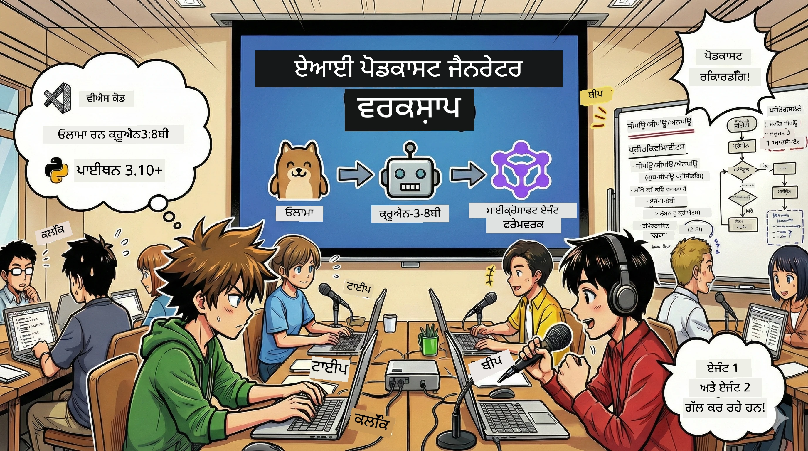

<!--
CO_OP_TRANSLATOR_METADATA:
{
  "original_hash": "aa775a734bda4590ecbe3a94a3b62197",
  "translation_date": "2026-01-05T17:36:08+00:00",
  "source_file": "WorkshopForAgentic/translation/zh-cn/README.md",
  "language_code": "pa"
}
-->
# 🎙️ ਏਆਈ ਪੌਡਕਾਸਟ ਸਟੂਡੀਓ ਵਰਕਸ਼ਾਪ



## ਤੁਹਾਡਾ ਕੰਮ

ਸੁਆਗਤ ਹੈ **ਏਆਈ ਪੌਡਕਾਸਟ ਸਟੂਡੀਓ** ਵਿੱਚ! ਤੁਸੀਂ ਆਪਣਾ ਖੁਦ ਦਾ ਟੈਕਨੋਲੋਜੀ ਪੌਡਕਾਸਟ «ਭਵਿੱਖ ਦੇ ਬਾਈਟ» ਸ਼ੁਰੂ ਕਰਨ ਜਾ ਰਹੇ ਹੋ — ਪਰ ਇੱਥੇ ਇੱਕ ਮੋੜ ਹੈ: ਤੁਸੀਂ ਇੱਕ ਏਆਈ ਦੁਆਰਾ ਚਲਾਇਆ ਗਿਆ ਪ੍ਰੋਡਕਸ਼ਨ ਟੀਮ ਬਣਾਓਗੇ ਜੋ ਤੁਹਾਡੀ ਮਦਦ ਕਰੇਗਾ ਇਸਨੂੰ ਬਣਾਉਣ ਵਿੱਚ। ਹੁਣ ਲਗਾਤਾਰ ਖੋਜ ਕਰਨ, ਸਕ੍ਰਿਪਟ ਲਿਖਣ ਅਤੇ ਆਡੀਓ ਸੰਪਾਦਨ ਕਰਨ ਦੀ ਲੋੜ ਨਹੀਂ। ਇਸ ਦੀ ਥਾਂ, ਤੁਸੀਂ ਪ੍ਰੋਗ੍ਰਾਮਿੰਗ ਰਾਹੀਂ ਏਆਈ ਦੀਆਂ ਸੁਪਰ ਸ਼ਕਤੀਆਂ ਵਾਲਾ ਪੌਡਕਾਸਟ ਪ੍ਰੋਡਿਊਸਰ ਬਣ ਜਾਵੋਗੇ।

## ਕਹਾਣੀ ਦੀ ਪਿਠਭੂਮੀ

ਕਲਪਨਾ ਕਰੋ: ਤੁਸੀਂ ਤੇ ਤੁਹਾਡੇ ਦੋਸਤ ਸਭ ਤੋਂ ਕੂਲ ਟੈਕਨੋਲੋਜੀ ਰੁਝਾਨਾਂ 'ਤੇ ਇੱਕ ਪੌਡਕਾਸਟ ਸ਼ੁਰੂ ਕਰਨਾ ਚਾਹੁੰਦੇ ਹੋ, ਪਰ ਹਰ ਕੋਈ ਪੜ੍ਹਾਈ, ਕੰਮ ਜਾਂ ਜੀਵਨ ਵਿੱਚ ਵਿਆਸਤ ਹੈ। ਜੇ ਤੁਸੀਂ ਇੱਕ ਏਆਈ ਸਮਝਦਾਰ ਏਜੰਟ ਦੀ ਟੀਮ ਬਣਾਉ ਜੋ ਮਿਹਨਤੀ ਕੰਮ ਕਰ ਸਕਦੀ ਹੋਵੇ, ਤਾਂ ਕੀ ਹੋਵੇਗਾ? ਇੱਕ ਏਜੰਟ ਵਿਸ਼ੇ ਦੀ ਖੋਜ ਲਈ, ਦੂਜਾ ਮਨਮੋਹਕ ਸਕ੍ਰਿਪਟ ਲਿਖਣ ਲਈ, ਤੇ ਤੀਜਾ ਟੈਕਸਟ ਨੂੰ ਕੁਦਰਤੀ ਅਤੇ ਪ੍ਰਵਾਹਸ਼ੀਲ ਗੱਲਬਾਤ ਵਿੱਚ ਬਦਲਣ ਲਈ। ਇਹ ਸਾਈ-ਫਾਈ ਲੱਗਦਾ ਹੈ? ਆਓ ਇਸਨੂੰ ਹਕੀਕਤ ਬਣਾਈਏ।

## ਤੁਸੀਂ ਕੀ ਸਿੱਖੋਗੇ

ਇਸ ਵਰਕਸ਼ਾਪ ਦੇ ਅੰਤ ਵਿੱਚ, ਤੁਸੀਂ ਜਾਣੋਗੇ ਕਿਵੇਂ:
- 🤖 ਆਪਣਾ ਖੁਦ ਦਾ ਲੋਕਲ ਏਆਈ ਮਾਡਲ ਡਿਪਲੋਇਟ ਕਰਨਾ (ਕੋਈ ਏਪੀਆਈ ਖਰਚਾ ਨਹੀਂ, ਕੋਈ ਕਲਾਉਡ ਡਿਪੈਂਡेंसी ਨਹੀਂ!)
- 🔧 ਅਸਲੀ ਸਮੰਵਯੋਗੀ ਮਾਹਿਰ ਏਆਈ ਏਜੰਟ ਬਣਾਉਣਾ
- 🎬 ਵਿਚਾਰ ਤੋਂ ਆਡੀਓ ਤੱਕ ਪੂਰੇ ਪੌਡਕਾਸਟ ਪ੍ਰੋਡਕਸ਼ਨ ਫਲੋਜ਼ ਬਣਾਉਣਾ

## ਤੁਹਾਡਾ ਸਫਰ: ਤਿੰਨ ਅੰਕ

ਜਿਵੇਂ ਕਿਸੇ ਵੀ ਵਧੀਆ ਕਹਾਣੀ ਵਾਂਗ, ਸਾਡੇ ਕੋਲ ਤਿੰਨ ਅੰਕ ਹਨ। ਹਰ ਅੰਕ ਤੁਹਾਡੇ ਏਆਈ ਪੌਡਕਾਸਟ ਸਟੂਡੀਓ ਨੂੰ ਕਦਮ ਦਰ ਕਦਮ ਬਣਾਏਗਾ:

| ਅਧਿਆਇ | ਤੁਹਾਡਾ ਕੰਮ | ਕੀ ਹੋਵੇਗਾ | ਖੁਲਣ ਵਾਲੀ ਕੁਸ਼ਲਤਾ |
|---------|------------|------------|----------------|
| **ਪਹਿਲਾ ਅੰਕ** | [ਤੁਹਾਡੇ ਏਆਈ ਸਹਾਇਕ ਨੂੰ ਜਾਣੋ](01.BuildAIAgentWithSLM.md) | ਤੁਸੀਂ ਸਿੱਖੋਗੇ ਕਿਵੇਂ ਚੈਟ ਕਰਨ ਵਾਲੇ, ਵੈੱਬ ਖੋਜ ਕਰਨ ਵਾਲੇ ਅਤੇ ਸਮੱਸਿਆਵਾਂ ਹਲ ਕਰਨ ਵਾਲੇ ਏਆਈ ਏਜੰਟ ਬਣਾਉਣੇ ਹਨ। ਉਨ੍ਹਾਂ ਨੂੰ ਕਦੇ ਨਾ ਸੋਣ ਵਾਲੇ ਖੋਜ ਅਧਿਆਪਕਾਂ ਵਾਂਗ ਸੋਚੋ। | 🎯 ਆਪਣਾ ਪਹਿਲਾ ਏਜੰਟ ਬਣਾਉ<br>🛠️ ਇਸਨੂੰ ਸੁਪਰ ਪਾਵਰ (ਉਪਕਰਣ!) ਦੇਵੋ<br>🧠 ਇਸ ਨੂੰ ਸੋਚਣਾ ਸਿਖਾਓ<br>🌐 ਇੰਟਰਨੈਟ ਨਾਲ ਜੁੜੋ |
| **ਦੂਜਾ ਅੰਕ** | [ਆਪਣੀ ਪ੍ਰੋਡਕਸ਼ਨ ਟੀਮ ਬਣਾਉ](02.AIAgentOrchestrationAndWorkflows.md) | ਹੁਣ ਮਜ਼ੇਦਾਰ ਗੱਲ ਆਈ! ਤੁਸੀਂ ਕਈ ਏਆਈ ਏਜੰਟਾਂ ਨੂੰ ਇੱਕ ਪੌਡਕਾਸਟ ਟੀਮ ਵਾਂਗ ਸਮੰਵਿਤ ਕਰੋਗੇ। ਇੱਕ ਖੋਜ ਕਰੇ, ਇੱਕ ਲਿਖੇ, ਤੁਸੀਂ ਮਨਜ਼ੂਰ ਕਰੋ — ਟੀਮ ਵਰਕ ਨਾਲ ਸਪਨੇ ਸੱਚ ਹੋਣਗੇ। | 🎭 ਕਈ ਏਜੰਟਾਂ ਨੂੰ ਕੋਆਰਡੀਨੇਟ ਕਰੋ<br>🔄 ਮਨਜ਼ੂਰੀ ਵਰਕਫਲੋ ਬਣਾਓ<br>🖥️ DevUI ਇੰਟਰਫੇਸ ਨਾਲ ਟੈਸਟ ਕਰੋ<br>✋ ਇਨਸਾਨੀ ਨਿਯੰਤਰਣ ਬਣਾਈ ਰੱਖੋ |
| **ਤੀਜਾ ਅੰਕ** | [ਆਪਣਾ ਪੌਡਕਾਸਟ ਜ਼ਿੰਦਾ ਕਰੋ](03.Multi-SpeakerPodcastGenerationWithVibeVoice.md) | ਅੰਤ ਮੋੜ! ਆਪਣੀ ਲਿਖਤੀ ਸਕ੍ਰਿਪਟ ਨੂੰ ਹਕੀਕਤੀ ਪੌਡਕਾਸਟ ਆਡੀਓ ਵਿੱਚ ਬਦਲੋ ਜਿਨ੍ਹਾਂ ਦੀ ਆਵਾਜ਼ ਪ੍ਰाकृतिक ਤੇ ਜ਼ਿੰਦਾ ਲੱਗਦੀ ਹੈ। ਤੁਹਾਡਾ «ਭਵਿੱਖ ਦੇ ਬਾਈਟ» ਪੌਡਕਾਸਟ ਰਿਲੀਜ਼ ਲਈ ਤਿਆਰ ਹੈ! | 🎤 ਟੈਕਸਟ ਤੋਂ ਵੌਇਸ ਮੈਜਿਕ<br>👥 ਬਹੁ-ਵਕਤਾਨਕਾਰਾਂ ਦੀਆਂ ਆਵਾਜ਼ਾਂ<br>⏱️ ਲੰਬੇ ਫਾਰਮੈਟ ਆਡੀਓ<br>🚀 ਪੂਰੀ ਤਰ੍ਹਾਂ ਆਟੋਮੈਟਿਕ |

ਹਰ ਅੰਕ ਨਵੀਂ ਸਮਰੱਥਾ ਖੋਲ੍ਹਦਾ ਹੈ। ਜੇਕਰ ਤੁਸੀਂ ਹਿੰਮਤਵਾਲੇ ਹੋ ਤਾਂ ਛੱਡ ਛੱਡ ਕੇ ਵੀ ਵੇਖ ਸਕਦੇ ਹੋ, ਪਰ ਅਸੀਂ ਸਿਫਾਰਸ਼ ਕਰਦੇ ਹਾਂ ਕਿ ਕ੍ਰਮ ਨਾਲ ਸਿੱਖੋ।

## ਵਾਤਾਵਰਣ ਦੀ ਲੋੜ

ਇਹ ਵਰਕਸ਼ਾਪ ਵੱਖ-ਵੱਖ ਹਾਰਡਵੇਅਰ ਸੈਟਿੰਗਾਂ ਨੂੰ ਸਹਿਯੋਗ ਦਿੰਦਾ ਹੈ:
- **CPU**: ਟੈਸਟ ਅਤੇ ਛੋਟੇ ਪੱਧਰ ਦੀ ਵਰਤੋਂ ਲਈ موزੂں
- **GPU**: ਉਤਪਾਦਨ ਵਾਤਾਵਰਣ ਲਈ ਸਿਫਾਰਸ਼ ਕੀਤਾ, ਜੋ ਪ੍ਰੋਸੈਸਿੰਗ ਸਪੀਡ ਨੁੂੰ ਬਹੁਤ ਵਧਾਉਂਦਾ ਹੈ
- **NPU**: ਅਗਲੀ ਪੀੜ੍ਹੀ ਦੇ ਨਿਊਰਲ ਪ੍ਰੋਸੈਸਿੰਗ ਯੂਨਿਟ ਤੇਜ਼ੀ ਲਈ ਸਹਯੋਗ

## ਤੁਹਾਨੂੰ ਕੀ ਚਾਹੀਦਾ ਹੈ

### ਸਾਫਟਵੇਅਰ ਸੂਚੀ ✅
- **Python 3.10+** (ਤੁਹਾਡੀ ਪ੍ਰੋਗ੍ਰਾਮਿੰਗ ਭਾਸ਼ਾ)
- **Ollama** (ਤੁਹਾਡੇ ਮਸ਼ੀਨ 'ਤੇ ਏਆਈ ਮਾਡਲ ਚਲਾਉਣ ਲਈ)
- **VS Code** (ਤੁਹਾਡਾ ਕੋਡ ਐਡੀਟਰ)
- **Python ਐਕਸਟੈਂਸ਼ਨ** (VS Code ਨੂੰ ਹੋਰ ਇੰਟੈਲੀਜੈਂਟ ਬਣਾਉਂਦਾ ਹੈ)
- **Git** (ਕੋਡ ਲੈਣ ਲਈ)

### ਹਾਰਡਵੇਅਰ ਜਾਂਚ 💻
- **ਕੀ ਮੈਂ ਚਲਾ ਸਕਦਾ ਹਾਂ?**: 8GB ਰੈਮ, 10GB ਖਾਲੀ ਸਟੋਰੇਜ (ਯੋਗ ਹੈ, ਪਰ ਸ਼ਾਇਦ ਥੋੜਾ ਸੁਸਤ)
- **ਆਦਰਸ਼ ਸੈਟਅੱਪ**: 16GB+ ਰੈਮ, ਇੱਕ ਵਧੀਆ GPU (ਸਾਮੱਗਰੀ ਸੁਚਾਰੂ ਚਲਦੀ ਹੈ!)
- **NPU ਹੈ?**: ਇਹ ਹੋਰ ਵੀ ਵਧੀਆ! ਅਗਲੀ ਪੀੜ੍ਹੀ ਦੀ ਪ੍ਰਦਰਸ਼ਨ ਖੋਲ੍ਹੋ 🚀

## ਆਪਣਾ ਸਟੂਡੀਓ ਬਣਾਓ 🎬

### ਕਦਮ 1: Python ਅੱਪਗ੍ਰੇਡ ਕਰੋ

ਸੁਨਿਸ਼ਚਿਤ ਕਰੋ ਕਿ ਤੁਸੀਂ Python 3.10 ਜਾਂ ਨਵਾਂ ਵਰਜਨ ਰੱਖਦੇ ਹੋ:

```bash
python --version
# ਇਸਨੂੰ Python 3.10.x ਜਾਂ ਇਸ ਤੋਂ ਉੱਚਾ ਵਰਜਨ ਦਿਖਾਉਣਾ ਚਾਹੀਦਾ ਹੈ
```

ਕੋਈ Python ਨਹੀਂ? [python.org](https://python.org) ਤੋਂ ਲਵੋ — ਇਹ ਮੁਫ਼ਤ ਹੈ!

### ਕਦਮ 2: Ollama ਪ੍ਰਾਪਤ ਕਰੋ (ਤੁਹਾਡਾ ਏਆਈ ਮਾਡਲ ਰਨਰ)

ਆਪਣੇ ਓਪਰੇਟਿੰਗ ਸਿਸਟਮ ਲਈ [ollama.ai](https://ollama.ai) ਤੋਂ ਡਾਊਨਲੋਡ ਕਰੋ। ਇਹ ਇੱਕ ਇੰਜਣ ਹੋਵੇਗਾ ਜੋ ਲੋਕਲ ਮਾਡਲ ਚਲਾਉਂਦਾ ਹੈ।

ਪੱਕਾ ਕਰੋ ਕਿ ਇਹ ਤਿਆਰ ਹੈ:

```bash
ollama --version
```

### ਕਦਮ 3: ਆਪਣਾ ਏਆਈ ਦਿਮਾਗ ਡਾਊਨਲੋਡ ਕਰੋ 🧠

ਹੁਣ Qwen-3-8B ਮਾਡਲ ਲਵੋ (ਜਿਵੇਂ ਤੁਸੀਂ ਆਪਣਾ ਪਹਿਲਾ ਏਆਈ ਸਹਾਇਕ ਕਿਰਾਏ ਤੇ ਲੈ ਰਹੇ ਹੋ):

```bash
ollama pull qwen3:8b
```

*ਇਸ ਵਿੱਚ ਕੁਝ ਮਿੰਟ ਲੱਗ ਸਕਦੇ ਹਨ। ਪੂਰੀ ਕੌਫੀ ਦਾ ਸਮਾਂ! ☕*

### ਕਦਮ 4: VS Code ਸੈੱਟਅੱਪ ਕਰੋ

ਜੇਕਰ ਨਹੀਂ ਹੈ, ਤਾਂ [Visual Studio Code](https://code.visualstudio.com/) ਲਵੋ। ਵਧੀਆ ਕੋਡ ਐਡੀਟਰ ਹੈ (ਇਸਦਾ ਕੋਈ ਮੁਕਾਬਲਾ ਨਹੀਂ 😄)।

### ਕਦਮ 5: Python ਐਕਸਟੈਂਸ਼ਨ ਲਗਾਓ

VS Code ਵਿੱਚ:
1. `Ctrl+Shift+X` ਦਬਾਓ (Mac 'ਤੇ `Cmd+Shift+X`)
2. "Python" ਖੋਜੋ
3. ਮਾਇਕ੍ਰੋਸੋਫਟ ਦੀ ਅਧਿਕਾਰਿਕ Python ਐਕਸਟੈਂਸ਼ਨ ਇੰਸਟਾਲ ਕਰੋ

### ਕਦਮ 6: ਵਾਹ! 🎉

ਸੱਚਮੁੱਚ, ਤੁਸੀਂ ਤਿਆਰ ਹੋ। ਆਓ ਕੁਝ ਏਆਈ ਜਾਦੂ ਬਣਾਈਏ!

### ਕਦਮ 7: Microsoft Agent Framework ਅਤੇ ਲੋੜੀਂਦੇ ਪੈਕੇਜ ਇੰਸਟਾਲ ਕਰੋ 📦

ਵਰਕਸ਼ਾਪ ਲਈ ਸਾਰੀਆਂ ਡਿਪੈਂਡੈਂਸੀਆਂ ਇੰਸਟਾਲ ਕਰੋ:

```bash
pip install -r ./Installations/requirements.txt -U
```

*ਇਸ ਨਾਲ Microsoft Agent Framework ਅਤੇ ਸਾਰੀਆਂ ਲੋੜੀਂਦੀਆਂ ਲਾਇਬ੍ਰੇਰੀਆਂ ਇੰਸਟਾਲ ਹੋਣਗੀਆਂ। ਕੌਫੀ ਲਵੋ — ਪਹਿਲੀ ਵਾਰੀ ਇੰਸਟਾਲੇਸ਼ਨ ਕੁਝ ਮਿੰਟ ਲੈ ਸਕਦੀ ਹੈ! ☕*

## ਵਰਕਸ਼ਾਪ ਨਿਰਦੇਸ਼

ਵਰਕਸ਼ਾਪ ਦੌਰਾਨ ਪ੍ਰਾਜੈਕਟ ਦੀ ਢਾਂਚਾ, ਸੈਟਅੱਪ ਕਦਮ ਅਤੇ ਚਲਾਉਣ ਦੀ ਵਿਸਥਾਰ ਨਾਲ ਜਾਣਕਾਰੀ ਦਿੱਤੀ ਜਾਵੇਗੀ।

## ਸਮੱਸਿਆ ਹੱਲ (ਜਦੋਂ ਕੁਝ ਗਲਤ ਹੋਵੇ) 🔧

### "ਆਹ, ਮਾਡਲ ਡਾਊਨਲੋਡ ਖੂਬ ਹੌਲੀ ਚੱਲ ਰਿਹਾ ਹੈ!"
**ਸਮਾਧਾਨ**: VPN ਵਰਤੋ ਜਾਂ Ollama ਮਿਰਰ ਸਰਵਰ ਕਨਫਿਗਰ ਕਰੋ। ਕਈ ਵਾਰੀ ਨੈੱਟਵਰਕ ਦੋਖੀ ਹੁੰਦਾ ਹੈ।

### "ਮੇਰਾ ਕੰਪਿਊਟਰ ਹੌਲ੍ਹਾ ਹੋ ਰਿਹਾ ਹੈ! ਰੈਮ ਘੱਟ!"
**ਸਮਾਧਾਨ**: ਛੋਟੇ ਮਾਡਲ 'ਤੇ ਸਵਿੱਚ ਕਰੋ ਜਾਂ `num_ctx` ਸੈਟਿੰਗ ਘਟਾਓ ਤਾਂ ਜੋ ਘੱਟ ਰੈਮ ਵਰਤੀ ਜਾਵੇ। ਇਸਨੂੰ ਤੁਹਾਡੇ ਏਆਈ ਲਈ ਡਾਇਟ ਸਮਝੋ।

### "ਕੀ ਮੈਂ GPU ਨਾਲ ਇਸਨੂੰ ਤੇਜ਼ ਕਰ ਸਕਦਾ ਹਾਂ?"
**ਸਮਾਧਾਨ**: Ollama ਖੁਦ ਬਹੁਤ ਸਾਰੇ GPU ਖੋਜਦਾ ਹੈ! ਸਭ ਤੋਂ ਵਧੀਆ ਇਹ ਦੁਖਣਾ ਕਿ ਤੁਹਾਡੇ GPU ਡਰਾਇਵਰ ਨਵੇਂ ਹਨ। ਮੁਫਤ ਤੇਜ਼ੀ! 🏎️

## ਵਾਧੂ ਸਰੋਤ (ਜੋ ਜਾਣਨਾ ਚਾਹੁੰਦਾ ਹੈ) 📚

- [Ollama ਦਸਤਾਵੇਜ਼](https://github.com/ollama/ollama) — ਲੋਕਲ ਏਆਈ ਮਾਡਲ ਬਾਰੇ ਵਿਸਥਾਰ
- [Microsoft Agent Framework](https://microsoft.github.io/autogen/) — ਏਜੰਟ ਟੀਮ ਬਣਾਉਣ ਬਾਰੇ ਹੋਰ ਜਾਣਕਾਰੀ
- [Qwen ਮਾਡਲ ਜਾਣਕਾਰੀ](https://qwenlm.github.io/) — ਆਪਣੇ ਏਆਈ ਸਹਾਇਕ ਦੇ ਦਿਮਾਗ ਨੂੰ ਜਾਣੋ

## ਲਾਈਸੈਂਸ

MIT ਲਾਈਸੈਂਸ — ਸ਼ਾਨਦਾਰ ਚੀਜ਼ਾਂ ਬਣਾਓ, ਸਾਂਝਾ ਕਰੋ ਅਤੇ ਦੁਨੀਆ ਨੂੰ ਹੋਰ ਚੰਗਾ ਬਣਾਓ! 🌍

## ਯੋਗਦਾਨ ਪੈਣਾ ਚਾਹੁੰਦੇ ਹੋ?

ਬੱਗ ਲੱਭਿਆ? ਵਿਚਾਰ ਹੈ? Issue ਜਾਂ PR ਭੇਜੋ! ਅਸੀਂ ਆਪਣੀ ਕਮੇਉਨਿਟੀ ਨੂੰ ਪਿਆਰ ਕਰਦੇ ਹਾਂ। ✨

---

<!-- CO-OP TRANSLATOR DISCLAIMER START -->
**ਅਸਵੀਕਾਰੋਪਠ**:  
ਇਹ ਦਸਤਾਵੇਜ਼ AI ਅਨੁਵਾਦ ਸੇਵਾ [Co-op Translator](https://github.com/Azure/co-op-translator) ਦੀ ਵਰਤੋਂ ਕਰਕੇ ਅਨੁਵਾਦਿਤ ਕੀਤਾ ਗਿਆ ਹੈ। ਜਦੋਂ ਕਿ ਅਸੀਂ ਸਹੀਤਾ ਲਈ ਪੂਰੀ ਕੋਸ਼ਿਸ਼ ਕਰਦੇ ਹਾਂ, ਕਿਰਪਾ ਕਰਕੇ ਧਿਆਨ ਦਿਓ ਕਿ ਸਵੈਚਲਿਤ ਅਨੁਵਾਦਾਂ ਵਿੱਚ ਗਲਤੀਆਂ ਜਾਂ ਅਸਪਸ਼ਟਤਾਵਾਂ ਹੋ ਸਕਦੀਆਂ ਹਨ। ਮੂਲ ਦਸਤਾਵੇਜ਼ ਆਪਣੀ ਮੂਲ ਭਾਸ਼ਾ ਵਿੱਚ ਪ੍ਰਮਾਣਿਕ ਸਰੋਤ ਵਜੋਂ ਲਿਆ ਜਾਣਾ ਚਾਹੀਦਾ ਹੈ। ਮਹੱਤਵਪੂਰਨ ਜਾਣਕਾਰੀ ਲਈ ਪੇਸ਼ੇਵਰ ਮਨੁੱਖੀ ਅਨੁਵਾਦ ਦੀ ਸਿਫਾਰਸ਼ ਕੀਤੀ ਜਾਂਦੀ ਹੈ। ਇਸ ਅਨੁਵਾਦ ਦੀ ਵਰਤੋਂ ਤੋਂ ਪੈਦ੍ਹਾ ਹੋਣ ਵਾਲੀਆਂ ਕਿਸੇ ਵੀ ਗਲਤਫਹਮੀਆਂ ਜਾਂ ਗਲਤ ਵਿਆਖਿਆਵਾਂ ਲਈ ਅਸੀਂ ਜ਼ਿੰਮੇਵਾਰ ਨਹੀਂ ਹਾਂ।
<!-- CO-OP TRANSLATOR DISCLAIMER END -->