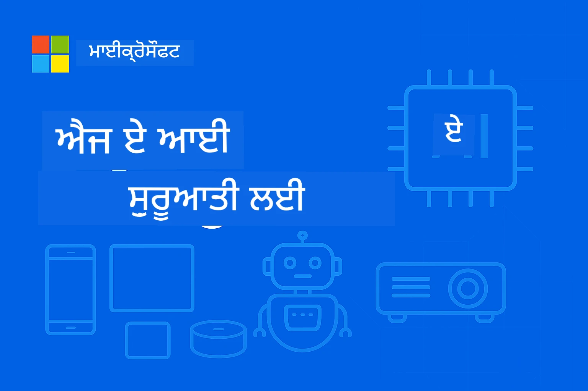

# ਸ਼ੁਰੂਆਤ Edge AI ਲਈ ਬਿਗਿਨਰਜ਼ ਲਈ



ਤੁਹਾਡੇ safar ਵਿੱਚ ਸੁਆਗਤ ਹੈ **Edge ਕ੍ਰਿਤ੍ਰਿਮ ਬੁੱਧਿਮਤਾ** – ਇੱਕ ਇਨਕਲਾਬੀ ਅੰਦਾਜ਼ ਜੋ AI ਦੀ ਤਾਕਤ ਨੂੰ ਸਿੱਧਾ ਉਸ ਜਗ੍ਹਾ 'ਤੇ ਲਿਆਉਂਦਾ ਹੈ ਜਿੱਥੇ ਡਾਟਾ ਬਣਦਾ ਹੈ ਅਤੇ ਫ਼ੈਸਲੇ ਕੀਤੇ ਜਾਂਦੇ ਹਨ। ਇਹ ਜਾਣ ਪਹਿਚਾਣ ਇੱਕ ਮਜ਼ਬੂਤ ਬੁਨਿਆਦ ਪੇਸ਼ ਕਰੇਗੀ ਕਿ ਕਿਉਂ Edge AI ਸਮਝਦਾਰ ਕਮਪਿਊਟਿੰਗ ਦਾ ਭਵਿੱਖ ਹੈ ਅਤੇ ਤੁਸੀਂ ਇਸਦੇ ਲਾਗੂ ਕਰਨ ਵਿੱਚ ਕਿਵੇਂ ਨਿਪੁੰਨ ਹੋ ਸਕਦੇ ਹੋ।

## Edge AI ਕੀ ਹੈ?

Edge AI ਮੂਢ ਵਿੱਚ ਪਾਰੰਪਰਿਕ ਕਲਾਉਡ-ਅਧਾਰਤ AI ਪ੍ਰੋਸੈਸਿੰਗ ਤੋਂ **ਸਥਾਨਕ, ਉਪਕਰਨ-ਅੰਦਰ ਬੁੱਧਿਮੱਤਾ** ਵੱਲ ਬਦਲ ਹੈ। ਦੂਰ ਦਰਾਜ ਸਰਵਰਾਂ ਨੂੰ ਡਾਟਾ ਭੇਜਣ ਦੀ ਬਜਾਏ, Edge AI ਜਾਣਕਾਰੀ ਨੂੰ ਸਿੱਧਾ ਐਜ ਉਪਕਰਨਾਂ ਤੇ ਪ੍ਰੋਸੈਸ ਕਰਦਾ ਹੈ – ਸਮਾਰਟਫੋਨ, IoT ਸੈਂਸਰ, ਉਦਯੋਗਿਕ ਉਪਕਰਨ, ਖੁਦ-ਚਲਾਊ Fahrzeug ਅਤੇ ਐਂਬੈਡਿਡ ਸਿਸਟਮ।

### Edge AI ਮਾਡਲ

```
Traditional AI:     Device → Cloud → Processing → Response → Device
Edge AI:           Device → Local Processing → Immediate Response
```

ਇਹ ਮਾਡਲ ਕਲਾਉਡ ਤੱਕ ਆਵਾਜਾਈ ਨੂੰ ਖਤਮ ਕਰਦਾ ਹੈ, ਜਿਸ ਨਾਲ:
- **ਤੁਰੰਤ ਜਵਾਬ** (ਸਬ-ਮਿਲੀਸੈਕੰਡ ਲੇਟੇੰਸੀ)
- **ਵਧੀਆ ਪ੍ਰਾਈਵੇਸੀ** (ਡਾਟਾ ਕਦੇ ਵੀ ਡਿਵਾਈਸ ਨੂੰ ਨਹੀਂ ਛੱਡਦਾ)
- **ਭਰੋਸੇਯੋਗ ਕੰਮ** (ਇੰਟਰਨੈੱਟ ਕਨੈਕਟਿਵਿਟੀ ਤੋਂ ਬਿਨਾਂ ਕੰਮ ਕਰਦਾ ਹੈ)
- **ਘੱਟ ਖਰਚੇ** (ਘੱਟ ਬੈਂਡਵਿਡਥ ਅਤੇ ਕਲਾਉਡ ਕੰਪਿਊਟ ਵਰਤੋਂ)

## ਕਿਉਂ Edge AI ਅੱਜ ਮੈਟਰ ਕਰਦਾ ਹੈ

### ਇਨੋਵੇਸ਼ਨ ਦੀ ਪਰਫੈਕਟ ਸਟਰਮ

ਤਿੰਨ ਤਕਨੀਕੀ ਰੁਝਾਨਾਂ ਨੇ ਮਿਲ ਕੇ Edge AI ਨੂੰ ਸਿਰਫ਼ ਸੰਭਵ ਨਹੀਂ, ਸਗੋਂ ਜ਼ਰੂਰੀ ਬਣਾ ਦਿੱਤਾ ਹੈ:

1. **ਹਾਰਡਵੇਅਰ ਇਨਕਲਾਬ**: ਆਧੁਨਿਕ ਚਿਪਸੈਟ (Apple Silicon, Qualcomm Snapdragon, NVIDIA Jetson) ਹੁਣ AI ਤੇਜ਼ੀ ਨਾਲ ਕਰਨ ਵਾਲੇ ਛੋਟੇ, ਬਿਜਲੀ-ਬਚਾਉਣ ਵਾਲੇ ਪੈਕੇਜਾਂ ਵਿੱਚ ਸਮਾਿਲੇ ਹੋਏ ਹਨ
2. **ਮੋਡਲ ਓਪਟੀਮਾਈਜ਼ੇਸ਼ਨ**: ਛੋਟੇ ਭਾਸ਼ਾ ਮਾਡਲ (SLMs) ਜਿਵੇਂ Phi-4, Gemma, ਅਤੇ Mistral ਵੱਡੇ ਮਾਡਲ ਦੀ ਕਾਰਗੁਜ਼ਾਰੀ ਦੇ 80-90% ਨੂੰ 10-20% ਆਕਾਰ ਵਿੱਚ ਦਿੰਦੇ ਹਨ
3. **ਅਸਲੀ ਦੁਨੀਆ ਦੀ ਮੰਗ**: ਉਦਯੋਗਾਂ ਨੂੰ ਤੁਰੰਤ, ਨਿੱਜੀ ਅਤੇ ਭਰੋਸੇਯੋਗ AI ਦੀ ਲੋੜ ਹੈ ਜੋ ਕਲਾਉਡ ਹੱਲ ਮੁਹੱਈਆ ਨਹੀਂ ਕਰ ਸਕਦੇ

### ਮੁੱਖ ਕਾਰੋਬਾਰੀ ਪ੍ਰੇਰਕ

**ਪ੍ਰਾਈਵੇਸੀ ਅਤੇ ਅਨੁਕੂਲਤਾ**
- ਸਿਹਤ ਸੰਭਾਲ: ਮਰੀਜ਼ ਦਾ ਡਾਟਾ ਸਥਾਨਕ ਹੀ ਰਹੇ (HIPAA ਅਨੁਕੂਲਤਾ)
- ਵਿੱਤੀ: ਲੈਣ-ਦੇਣ ਪ੍ਰੋਸੈਸਿੰਗ ਲਈ ਡਾਟਾ ਸਰਕਾਰਤਾਂ ਦਾ ਨਿਯੰਤਰਣ
- ਮੈਨੂਫੈਕਚਰਿੰਗ: ਖ਼ਾਸ ਪ੍ਰਕਿਰਿਆਵਾਂ ਨੂੰ ਬਾਹਰ ਲੀਕੇ ਜਾਣ ਤੋਂ ਬਚਾਉਣਾ

**ਕਾਰਗੁਜ਼ਾਰੀ ਦੀ ਲੋੜਾਂ**
- ਸਵੈ-ਚਾਲਕ ਗੱਡੀਆਂ: ਸੈਕਿੰਡ ਦੇ ਅੰਦਰ ਜਾਨ ਫ਼ੈਸਲੇ
- ਉਦਯੋਗਿਕ ਆਟੋਮੇਸ਼ਨ: ਤੁਰੰਤ ਗੁਣਵੱਤਾ ਕੰਟਰੋਲ ਅਤੇ ਸੁਰੱਖਿਆ ਨਿਗਰਾਨੀ
- ਗੇਮਿੰਗ & AR/VR: ਪੂਰੀ ਤਰ੍ਹਾਂ ਡਿੱਗਣਯੋਗ ਲੇਟੇੰਸੀ ਦਾ ਮੰਗ ਕਰਦਾ ਤਜਰਬਾ

**ਆਰਥਿਕ ਕਾਰਗੁਜ਼ਾਰੀ**
- ਟੈਲੀਕਮਯੂਨਿਕੇਸ਼ਨ: ਮੀਲਿਯਨਜ਼ ਆਫ IoT ਸੈਂਸਰ ਰੀਡਿੰਗਜ਼ ਸਥਾਨਕ ਤੌਰ 'ਤੇ ਪ੍ਰੋਸੈਸ ਕਰਨਾ
- ਰੀਟੇਲ: ਦਰਸ਼ਕ-ਪਾਸੇ ਵਿਸ਼ਲੇਸ਼ਣ ਬਿਨਾਂ ਮਹਿੰਗੇ ਬੈਂਡਵਿਡਥ ਖਰਚ
- ਸਮਾਰਟ ਸ਼ਹਿਰ: ਹਜ਼ਾਰਾਂ ਜੁੜੇ ਉਪਕਰਨਾਂ ਵਿੱਚ ਵੰਡੀਆਂ ਹੋਈਆਂ ਬੁੱਧਿਮੱਤਾ

## ਉਦਯੋਗ ਜੋ Edge AI ਨਾਲ ਬਦਲੇ ਗਏ

### 🏭 **ਮੈਨੂਫੈਕਚਰਿੰਗ ਅਤੇ ਇੰਡਸਟਰੀ 4.0**
- **ਪੂਰਵ-ਅੰਦਾਜ਼ੀ ਦਾ ਮੁਰੰਮਤ**: ਉਦਯੋਗਿਕ ਉਪਕਰਨਾਂ 'ਤੇ AI ਮਾਡਲ ਨੁਕਸਾਨਾਂ ਤੋਂ ਪਹਿਲਾਂ ਅੰਦਾਜ਼ਾ ਲਗਾਉਂਦੇ ਹਨ
- **ਗੁਣਵੱਤਾ ਕੰਟਰੋਲ**: ਤੁਰੰਤ ਨੁਕਸਾਨ ਦਾ ਪਤਾ ਲਗਾਉਣਾ ਉਤਪਾਦਨ ਲਾਈਨਾਂ 'ਤੇ
- **ਸੁਰੱਖਿਆ ਨਿਗਰਾਨੀ**: ਤੁਰੰਤ ਖਤਰਾ ਪਛਾਣ ਅਤੇ ਜਵਾਬ
- **ਸਪਲਾਈ ਚੇਨ**: ਹਰ ਨੋਡ 'ਤੇ ਸਿਆਣਾ ਸਟੌਕ ਮੈਨੇਜਮੈਂਟ

**ਅਸਲੀ ਜਗ੍ਹਾ ਤੇ ਪ੍ਰਭਾਵ**: ਸਿਮੈਂਸ Edge AI ਨੂੰ ਪੂਰਵ-ਅੰਦਾਜ਼ਾ ਦੀ ਮੁਰੰਮਤ ਲਈ ਵਰਤਦਾ ਹੈ, ਥਾਂ ਬੰਦ ਹੋਣ ਦਾ ਸਮਾਂ 30-50% ਅਤੇ ਮੁਰੰਮਤ ਦੇ ਖਰਚ 25% ਘਟਾਉਂਦਾ ਹੈ।

### 🏥 **ਸਿਹਤ ਅਤੇ ਮੈਡੀਕਲ ਉਪਕਰਨ**
- **ਨਿਧਾਨਕ ਇਮੇਜਿੰਗ**: ਕਿਤਾਬੀ ਸਥਾਨ 'ਤੇ AI-ਚਾਲਿਤ X-ਰੇ ਅਤੇ MRI ਵਿਸ਼ਲੇਸ਼ਣ
- **ਮਰੀਜ਼ ਦੀ ਨਿਗਰਾਨੀ**: ਜੀਵਨ ਦੇ ਅੰਕੜੇ ਕੱਟੜੀੈਕਾਂ ਰਾਹੀਂ ਲਗਾਤਾਰ ਮੂਲਾਂਕਣ
- **ਸਰਜਰੀ ਸਹਾਇਤਾ**: ਪ੍ਰਕਿਰਿਆਵਾਂ ਦੌਰਾਨ ਤੁਰੰਤ ਮਦਦ
- **ਦਵਾਈ ਦੀ ਖੋਜ**: ਅਣੂ ਸਿਮੂਲੇਸ਼ਨ ਦਾ ਸਥਾਨਕ ਪ੍ਰੋਸੈਸਿੰਗ

**ਅਸਲੀ ਜਗ੍ਹਾ ਤੇ ਪ੍ਰਭਾਵ**: ਫਿਲਿਪਸ ਦੇ Edge AI ਹੱਲ ਤੇਜ਼ੀ ਨਾਲ 40% ਜ਼ਲਦੀ ਨਿਧਾਨ ਕਰਨ ਲਈ ਰੇਡੀਓਲਾਜ਼ਿਸਟਾਂ ਦੀ ਮਦਦ ਕਰਦੇ ਹਨ ਅਤੇ 99% ਸ਼ੁੱਧਤਾ ਬਣਾਉਂਦੇ ਹਨ।

### 🚗 **ਸਵੈ-ਚਾਲਕ ਪ੍ਰਣਾਲੀਆਂ ਅਤੇ ਆਵਾਜਾਈ**
- **ਸਵੈ-ਚੱਲਦੇ ਵਾਹਨ**: ਰਸਤੇ ਅਤੇ ਸੁਰੱਖਿਆ ਲਈ ਆਪਣੀ ਗਤੀ ਨਾਲ ਫੈਸਲਾ ਲੈਣਾ
- **ਟ੍ਰੈਫਿਕ ਪ੍ਰਬੰਧਨ**: ਬੁੱਧਿਮਾਨ ਸੰਘਮ ਨਿਯੰਤਰਣ ਅਤੇ ਵਹਾਵ-ਸੰਪੂਰਣਤਾ
- **ਫਲੀਟ ਸਚਾਲਨ**: ਵਾਸਤਵਿਕ ਸਮੇਂ ਵਿੱਚ ਰਸਤੇ ਦੀ ਸੰਪੂਰਣਤਾ ਅਤੇ ਵਾਹਨ ਦੀ ਸਿਹਤ ਦੀ ਨਿਗਰਾਨੀ
- **ਲਾਜਿਸਟਿਕਸ**: ਸਵੈ-ਚਲਾਊ ਗੋਦਾਮ ਰੋਬੋਟ ਅਤੇ ਡਿਲਿਵਰੀ ਪ੍ਰਣਾਲੀਆਂ

**ਅਸਲੀ ਜਗ੍ਹਾ ਤੇ ਪ੍ਰਭਾਵ**: ਟੈਸਲਾ ਦਾ ਫੁੱਲ ਸਵੈ-ਚালਕ ਸਿਸਟਮ ਸੈਂਸਰ ਡਾਟਾ ਨੂੰ ਸਥਾਨਕ ਤੌਰ 'ਤੇ ਪ੍ਰੋਸੈਸ ਕਰਦਾ ਹੈ, ਹਰ ਸਕਿੰਟ 40+ ਫੈਸਲੇ ਕਰਦਾ ਹੈ ਸੁਰੱਖਿਆ ਵਾਲੀ ਸਵੈ-ਚਾਲਕ ਰਾਹਦਾਰੀ ਲਈ।

### 🏙️ **ਸਮਾਰਟ ਸ਼ਹਿਰ ਅਤੇ ਢਾਂਚਾ**
- **ਜਨਤਕ ਸੁਰੱਖਿਆ**: ਤੁਰੰਤ ਖਤਰੇ ਦੀ ਪਛਾਣ ਅਤੇ ਐਮਰਜੈਂਸੀ ਪ੍ਰਤੀਕ੍ਰਿਆ
- **ਊਰਜਾ ਪ੍ਰਬੰਧਨ**: ਸਮਾਰਟ ਗ੍ਰਿਡ ਸੰਪੂਰਣਤਾ ਅਤੇ ਨਵੀਨੀਕਰਨਯੋਗ ਊਰਜਾ ਦਾ ਇੰਟੀਗ੍ਰੇਸ਼ਨ
- **ਵਾਤਾਵਰਣ ਨਿਗਰਾਨੀ**: ਹਵਾ ਦੀ ਗੁਣਵੱਤਾ, ਸ਼ੋਰ ਪ੍ਰਦੂਸ਼ਣ ਅਤੇ ਮੌਸਮ ਦੀ ਟਰੈਕਿੰਗ
- **ਨਗਰ ਯੋਜਨਾ**: ਟ੍ਰੈਫਿਕ ਵਹਾਵ ਅਤੇ ਢਾਂਚੇ ਦੀ ਸੰਪੂਰਣਤਾ ਦਾ ਵਿਸ਼ਲੇਸ਼ਣ

**ਅਸਲੀ ਜਗ੍ਹਾ ਤੇ ਪ੍ਰਭਾਵ**: ਸੰਗਾਪੁਰ ਦਾ ਸਮਾਰਟ ਸ਼ਹਿਰ ਪਹਿਲ 100,000+ Edge AI ਸੈਂਸਰ ਟ੍ਰੈਫਿਕ ਪ੍ਰਬੰਧਨ ਲਈ ਵਰਤਦਾ ਹੈ, ਆਵਾਜਾਈ ਸਮਾਂ 25% ਘਟਾਉਂਦਾ ਹੈ।

### 📱 **ਖਪਤਕਾਰ ਤਕਨਾਲੋਜੀ ਅਤੇ ਮੋਬਾਈਲ**
- **ਸਮਾਰਟਫੋਨ AI**: ਸੁਧਰਾਈ ਹੋਈ ਫੋਟੋਗ੍ਰਾਫੀ, ਵੌਇਸ ਸਹਾਇਕ ਅਤੇ ਨਿੱਜੀਕਰਨ
- **ਸਮਾਰਟ ਘਰ**: ਬੁੱਧਿਮਾਨ ਆਟੋਮੇਸ਼ਨ ਅਤੇ ਸੁਰੱਖਿਆ ਪ੍ਰਣਾਲੀ
- **ਪਹਿਨਣ ਵਾਲੇ ਉਪਕਰਨ**: ਸਿਹਤ ਨਿਗਰਾਨੀ ਅਤੇ ਫਿੱਟਨੈੱਸ ਸੰਪੂਰਣਤਾ
- **ਗੇਮਿੰਗ**: ਸੱਚਮੁੱਚ ਸਮੇਂ ਗ੍ਰਾਫਿਕ ਸੁਧਾਰ ਅਤੇ ਗੇਮਪਲੇਅ ਸੰਪੂਰਣਤਾ

**ਅਸਲੀ ਜਗ੍ਹਾ ਤੇ ਪ੍ਰਭਾਵ**: ਐਪਲ ਦਾ ਨਿਊਰਲ ਇੰਜਣ ਸਥਾਨਕ ਤੌਰ 'ਤੇ ਪ੍ਰਤੀ ਸੈਕਿੰਡ 15.8 ਟ੍ਰਿਲੀਅਨ ਕਾਰਵਾਈਆਂ ਪ੍ਰੋਸੈਸ ਕਰਦਾ ਹੈ, ਜਿਸ ਨਾਲ ਤੁਰੰਤ ਭਾਸ਼ਾ ਅਨੁਵਾਦ ਅਤੇ ਕੰਪਿਊਟੇਸ਼ਨਲ ਫੋਟੋਗ੍ਰਾਫੀ ਵਰਗੀਆਂ ਵਿਸ਼ੇਸ਼ਤਾਵਾਂ ਸਥਾਪਤ ਹੋਦੀਆਂ ਹਨ।

## ਛੋਟੇ ਭਾਸ਼ਾ ਮਾਡਲ: Edge AI ਦਾ ਇੰਜਣ

### ਛੋਟੇ ਭਾਸ਼ਾ ਮਾਡਲ (SLMs) ਕੀ ਹਨ?

SLMs ਵੱਡੇ ਭਾਸ਼ਾ ਮਾਡਲਾਂ ਦੇ **ਸੰਕੁਚਿਤ, ਓਪਟੀਮਾਈਜ਼ਡ ਵਰਜਨ** ਹਨ, ਜੋ ਖਾਸ ਤੌਰ 'ਤੇ edge ਤੈਅਗੀ ਲਈ ਡਿਜ਼ਾਈਨ ਕੀਤੇ ਗਏ ਹਨ:

- **Phi-4**: 14B ਪੈਰਾਮੀਟਰ, ਤਰਕਸ਼ੀਲ ਅਤੇ ਕੋਡ ਰਚਨਾ ਲਈ ਓਪਟੀਮਾਈਜ਼ਡ
- **Gemma 2B/7B**: Google ਦੇ ਪ੍ਰਭਾਵਸ਼ালী ਮਾਡਲ ਵੱਖ-ਵੱਖ NLP ਕਾਰਜਾਂ ਲਈ
- **Mistral-7B**: ਵਪਾਰਕ-ਅਨੁਕੂਲ ਲਾਈਸੰਸਿੰਗ ਵਾਲਾ ਉੱਚ-ਕਾਰਗੁਜ਼ਾਰੀ ਮਾਡਲ
- **Qwen ਸੀਰੀਜ਼**: Alibaba ਦੇ ਬਹੁ-ਭਾਸ਼ਾਈ ਮਾਡਲ ਮੋਬਾਈਲ ਤੈਅਗੀ ਲਈ ਓਪਟੀਮਾਈਜ਼ਡ

### SLM ਦਾ ਫਾਇਦਾ

| ਸਮਰੱਥਾ | ਵੱਡੇ ਭਾਸ਼ਾ ਮਾਡਲ | ਛੋਟੇ ਭਾਸ਼ਾ ਮਾਡਲ |
|------------|----------------------|----------------------|
| **ਆਕਾਰ** | 70B-405B ਪੈਰਾਮੀਟਰ | 1B-14B ਪੈਰਾਮੀਟਰ |
| **ਮੈਮੋਰੀ** | 40-200GB RAM | 2-16GB RAM |
| **ਨਿਕਾਸ ਦੀ ਗਤੀ** | 2-10 ਸਕਿੰਟ | 50-500ms |
| **ਤੈਅਗੀ** | ਹਾਈ-ਐਂਡ ਸਰਵਰ | ਸਮਾਰਟਫੋਨ, ਐਂਬੈਡਿਡ ਉਪਕਰਨ |
| **ਲਾਗਤ** | $1000s/ਮਹੀਨਾ | ਇਕ ਵਾਰੀ ਹਾਰਡਵੇਅਰ ਲਾਗਤ |
| **ਪ੍ਰਾਈਵੇਸੀ** | ਡਾਟਾ ਕੁਲਾਉਡ ਨੂੰ ਭੇਜਿਆ ਜਾਂਦਾ ਹੈ | ਪ੍ਰੋਸੈਸਿੰਗ ਸਥਾਨਕ ਰਹਿੰਦੀ ਹੈ |

### ਕਾਰਗੁਜ਼ਾਰੀ ਦੀ ਅਸਲੀਅਤ ਚੈਕ

ਆਧੁਨਿਕ SLMਆਂ ਨਿਰਾਲੀ ਸਮਰੱਥਾਵਾਂ ਪ੍ਰਦਾਨ ਕਰਦੀਆਂ ਹਨ:
- ਬਹੁਤ ਸਾਰੇ ਟਾਸਕਾਂ ਵਿੱਚ **GPT-3.5 ਦਾ 90% ਪ੍ਰਦਰਸ਼ਨ**
- **ਰਾਹਤ ਉਪਲਬਧਾਇਕ ਗੱਲਬਾਤ** ਸਮਰੱਥਾ
- **ਕੋਡ ਬਣਾਉਣ ਅਤੇ ਡੀਬੱਗਿੰਗ**
- **ਬਹੁ ਭਾਸ਼ਾਈ ਅਨੁਵਾਦ**
- **ਦਸਤਾਵੇਜ਼ ਵਿਸ਼ਲੇਸ਼ਣ ਅਤੇ ਸਾਰਾਂਸ਼**

## ਸਿੱਖਣ ਦੇ ਉਦੇਸ਼

ਇਸ EdgeAI ਬਿਗਨਰਜ਼ ਕੋਰਸ ਨੂੰ ਪੂਰਾ ਕਰਕੇ, ਤੁਸੀਂ:

### 🎯 **ਮੂਲ ਗਿਆਨ**
- Edge AI ਅਪਣਾਉਣ ਦੇ ਤਕਨੀਕੀ ਅਤੇ ਕਾਰੋਬਾਰੀ ਪ੍ਰੇਰਕ ਸਮਝੋ
- edge ਅਤੇ ਕਲਾਉਡ AI ਆਰਕੀਟੈਕਚਰ ਦੀ ਤੁਲਨਾ ਕਰੋ ਅਤੇ ਉਨ੍ਹਾਂ ਦੇ ਉਚਿਤ ਵਰਤੋਂ ਮਾਮਲੇ ਜਾਣੋ
- ਵੱਖ-ਵੱਖ SLM ਪਰਿਵਾਰਾਂ ਦੀਆਂ ਵਿਸ਼ੇਸ਼ਤਾਵਾਂ ਅਤੇ ਸਮਰੱਥਾਵਾਂ ਪਛਾਨੋ
- edge AI ਤੈਅਗੀ ਲਈ ਹਾਰਡਵੇਅਰ ਦੀ ਜ਼ਰੂਰਤ ਦਾ ਵਿਸ਼ਲੇਸ਼ਣ ਕਰੋ

### 🛠️ **ਤਕਨੀਕੀ ਹੁਨਰ**
- ਵੱਖ-ਵੱਖ ਪਲੇਟਫਾਰਮਾਂ (ਵਿੰਡੋਜ਼, ਮੋਬਾਈਲ, ਐਂਬੈਡਿਡ, ਕਲਾਉਡ-ਐਜ ਹਾਈਬ੍ਰਿਡ) 'ਤੇ SLM ਤੈਅਗ ਕਰਨਾ ਸਿੱਖੋ
- edge ਸੀਮਾਵਾਂ ਲਈ ਮਾਡਲਾਂ ਨੂੰ ਕੁਆੰਟਾਈਜ਼ੇਸ਼ਨ, ਪ੍ਰੂਨਿੰਗ ਅਤੇ ਕੰਪ੍ਰੈਸ਼ਨ ਰਾਹੀਂ ਓਪਟੀਮਾਈਜ਼ ਕਰੋ
- ਨਿਗਰਾਨੀ ਅਤੇ ਸਕੇਲਿੰਗ ਨਾਲ ਪੈਦਾਵਾਰੀ ਯੋਗ Edge AI ਐਪਲੀਕੇਸ਼ਨਾਂ ਦਾ ਲਾਗੂ ਕਰਨ
- ਜਟਿਲ ਕਾਰਜ ਵਹਾਵ ਲਈ ਮਲਟੀ-ਏਜੰਟ ਪ੍ਰਣਾਲੀਆਂ ਅਤੇ ਫੰਕਸ਼ਨ-ਕਾਲਿੰਗ ਫ੍ਰੇਮਵਰਕ ਬਣਾਓ

### 🏗️ **ਵਾਸਤਵਿਕ ਲਾਗੂ ਕਰਨ**
- ਸਥਾਨਕ ਮਾਡਲ ਸਵਿੱਚਿੰਗ ਅਤੇ ਗੱਲਬਾਤ ਪ੍ਰਬੰਧਨ ਨਾਲ ਚੈਟ ਐਪਲੀਕੇਸ਼ਨਾਂ ਬਣਾਓ
- ਸਥਾਨਕ ਦਸਤਾਵੇਜ਼ ਪ੍ਰੋਸੈਸਿੰਗ ਨਾਲ RAG (ਰੀਟਰੀਵਲ-ਆਗਮੈਂਟਿਡ ਜਨਰੇਸ਼ਨ) ਪ੍ਰਣਾਲੀਆਂ ਵਿਕਸਤ ਕਰੋ
- ਖਾਸ AI ਮਾਡਲਾਂ ਵਿੱਚ ਸੁਚੱਜੀ ਚੋਣ ਲਈ ਮਾਡਲ ਰਾਊਟਰ ਬਣਾਓ
- ਸਟ੍ਰੀਮਿੰਗ, ਸਿਹਤ ਨਿਗਰਾਨੀ ਅਤੇ ਤਰੁਟੀਆਂ ਹੱਲ ਕਰਨ ਲਈ API ਫ੍ਰੇਮਵਰਕ ਡਿਜ਼ਾਈਨ ਕਰੋ

### 🚀 **ਪੈਦਾਵਾਰੀ ਤੈਅਗੀ**
- ਮਾਡਲ ਵਰਜ਼ਨੀਕਰਨ, ਜਾਂਚ ਅਤੇ ਤੈਅਗੀ ਲਈ SLMOps ਪਾਈਪਲਾਈਨਾਂ ਸਥਾਪਿਤ ਕਰੋ
- edge AI ਐਪਲੀਕੇਸ਼ਨਾਂ ਲਈ ਸੁਰੱਖਿਆ ਦੇ ਸਭ ਤੋਂ ਵਧੀਆ ਤਰੀਕੇ ਲਾਗੂ ਕਰੋ
- edge ਅਤੇ ਕਲਾਉਡ ਪ੍ਰੋਸੈਸਿੰਗ ਦਾ ਬੈਲੈਂਸ ਰੱਖਣ ਵਾਲੀਆਂ ਸਕੇਲ ਕਰਨਯੋਗ ਆਰਕੀਟੈਕਚਰਾਂ ਦੀ ਰਚਨਾ
- ਪੈਦਾਵਾਰੀ edge AI ਸਿਸਟਮਾਂ ਲਈ ਨਿਗਰਾਨੀ ਅਤੇ ਰੱਖ-ਰਖਾਅ ਦੀਆਂ ਯੋਜਨਾਵਾਂ ਬਣਾਓ

## ਸਿੱਖਣ ਦੇ ਨਤੀਜੇ

ਕੋਰਸ ਪੂਰਾ ਕਰਨ 'ਤੇ, ਤੁਸੀਂ ਯੋਗ ਹੋਵੋਗੇ:

### **ਤਕਨੀਕੀ ਮਾਹਰਤਾ**
✅ ਵਿੰਡੋਜ਼, ਮੋਬਾਈਲ, ਅਤੇ ਐਂਬੈਡਿਡ ਪਲੇਟਫਾਰਮਾਂ 'ਤੇ ਪੈਦਾਵਾਰੀ ਯੋਗ Edge AI ਹੱਲ ਤੈਅਗ ਕਰੋ  
✅ edge ਸੀਮਾਵਾਂ ਲਈ AI ਮਾਡਲਾਂ ਦੀ ਓਪਟੀਮਾਈਜ਼ੇਸ਼ਨ ਕਰੋ ਜੋ 75% ਆਕਾਰ ਘਟਾਉਂਦੀਆਂ ਹਨ ਅਤੇ 85% ਕਾਰਗੁਜ਼ਾਰੀ ਰੱਖਦੀਆਂ ਹਨ  
✅ ਫੰਕਸ਼ਨ ਕਾਲ ਅਤੇ ਮਲਟੀ-ਮਾਡਲ ਸੰਚਾਲਨ ਨਾਲ ਸਿਆਣੇ ਏਜੰਟ ਸਿਸਟਮ ਬਣਾਓ  
✅ ਐਂਟਰਪ੍ਰਾਈਜ਼ ਐਪਲੀਕੇਸ਼ਨਾਂ ਲਈ ਸਕੇਲ ਕਰਨਯੋਗ edge-ਕਲਾਉਡ ਹਾਈਬ੍ਰਿਡ ਆਰਕੀਟੈਕਚਰਾਂ ਬਣਾਓ

### **ਉਦਯੋਗਿਕ ਐਪਲੀਕੇਸ਼ਨ**
✅ ਪੂਰਵ-ਅੰਦਾਜ਼ੀ ਮੁਰੰਮਤ ਅਤੇ ਗੁਣਵੱਤਾ ਕੰਟਰੋਲ ਲਈ ਮੈਨੂਫੈਕਚਰਿੰਗ ਹੱਲ ਡਿਜ਼ਾਈਨ ਕਰੋ  
✅ ਗੋਪਨੀਯਤਾ-ਅਨੁਕੂਲ ਮਰੀਜ਼ ਡਾਟਾ ਪ੍ਰੋਸੈਸਿੰਗ ਨਾਲ ਸਿਹਤ ਸੰਭਾਲ ਐਪਲੀਕੇਸ਼ਨ ਵਿਕਸਤ ਕਰੋ  
✅ ਅਸਲੀ ਸਮੇਂ ਫੈਸਲੇ ਕਰਨ ਅਤੇ ਸੁਰੱਖਿਆ ਲਈ ਆਟੋਮੋਟਿਵ ਸਿਸਟਮ ਬਣਾਓ  
✅ ਟ੍ਰੈਫਿਕ, ਸੁਰੱਖਿਆ ਅਤੇ ਵਾਤਾਵਰਣ ਨਿਗਰਾਨੀ ਲਈ ਸਮਾਰਟ ਸ਼ਹਿਰ ਦਾ ਢਾਂਚਾ ਬਣਾਓ

### **ਕੈਰੀਅਰ ਉਨਤੀ**
✅ EdgeAI Solutions Architect: ਵਿਸ਼ਤ੍ਰਿਤ edge AI ਰਣਨੀਤੀਆਂ ਤਿਆਰ ਕਰੋ  
✅ ML Engineer (Edge ਵਿਸ਼ੇਸ਼ਗਿਆ) : edge ਮਾਹੌਲਾਂ ਲਈ ਮਾਡਲਾਂ ਦੀ ਓਪਟੀਮਾਈਜ਼ ਅਤੇ ਤੈਅਗੀ ਕਰੋ  
✅ IoT AI Developer: ਸਥਾਨਕ ਪ੍ਰੋਸੈਸਿੰਗ ਵਾਲੇ ਸਿਆਣੇ IoT ਸਿਸਟਮ ਬਣਾਓ  
✅ Mobile AI Developer: ਸਥਾਨਕ ਨਿਕਾਸ ਵਾਲੇ AI-ਚਾਲਿਤ ਮੋਬਾਈਲ ਐਪਲੀਕੇਸ਼ਨਾਂ ਬਣਾਓ

## ਕੋਰਸ ਦੀ ਰਚਨਾ

ਇਹ ਕੋਰਸ ਇੱਕ **ਤਰੱਕੀਬੰਦ ਮਾਹਰਤਾ ਪਹੁੰਚ** ਨੂੰ ਫਾਲੋ ਕਰਦਾ ਹੈ:

### **ਫੇਜ਼ 1: ਬੁਨਿਆਦ** (ਮੋਡੀਊਲ 01-02)
ਸਮਝ ਬੁਝ ਬਣਾਓ ਅਤੇ ਮਾਡਲ ਪਰਿਵਾਰਾਂ ਦੀ ਜਾਂਚ ਕਰੋ

### **ਫੇਜ਼ 2: ਲਾਗੂ ਕਰਨ** (ਮੋਡੀਊਲ 03-04) 
ਤੈਅਗੀ ਅਤੇ ਅਪਟੀਮਾਈਜ਼ੇਸ਼ਨ ਤਕਨੀਕਾਂ ਵਿੱਚ ਮਾਹਰ ਬਣੋ

### **ਫੇਜ਼ 3: ਪੈਦਾਵਾਰੀ**
(ਮੋਡੀਊਲ 05-06) SLMOps ਅਤੇ ਅੱਗੇ ਵਧੇ ਏਜੰਟ ਫ੍ਰੇਮਵਰਕ ਸਿੱਖੋ

### **ਫੇਜ਼ 4: ਵਿਸ਼ੇਸ਼ਗਿਆਤਾ**
(ਮੋਡੀਊਲ 07-08) ਪਲੇਟਫਾਰਮ-ਖਾਸ ਲਾਗੂ ਕਰਨ ਅਤੇ ਸੰਪੂਰਨ ਨਮੂਨੇ

## ਸਫਲਤਾ ਦੇ ਮਾਪਦੰਡ

ਆਪਣੇ ਤਰੱਕੀ ਨੂੰ ਇਹਨਾਂ ਮਾਪਦੰਡਾਂ ਨਾਲ ਮਾਪੋ:

- **ਪੋਰਟਫੋਲਿਓ ਪਰਜੈਕਟ**: 10+ ਪੈਦਾਵਾਰੀ ਯੋਗ ਐਪਲੀਕੇਸ਼ਨਾਂ ਜੋ ਕਈ ਉਦਯੋਗਾਂ ਨੂੰ ਕਵਰ ਕਰਦੀਆਂ ਹਨ
- **ਕਾਰਗੁਜ਼ਾਰੀ ਮਾਪਦੰਡ**: ਮਾਡਲ <500ms ਨਿਕਾਸ ਸਮੇਂ ਨਾਲ edge ਉਪਕਰਨਾਂ 'ਤੇ ਚੱਲ ਰਹੇ ਹਨ
- **ਤੈਅਗੀ ਟਾਰਗਟ**: ਐਪਲੀਕੇਸ਼ਨ ਵਿੰਡੋਜ਼, ਮੋਬਾਈਲ ਅਤੇ ਐਂਬੈਡਿਡ ਪਲੇਟਫਾਰਮਾਂ ਉੱਤੇ ਚੱਲ ਰਹੇ ਹਨ
- **ਐਂਟਰਪ੍ਰਾਈਜ਼ ਤਿਆਰੀ**: ਨਿਗਰਾਨੀ, ਸਕੇਲਿੰਗ ਅਤੇ ਸੁਰੱਖਿਆ ਫ੍ਰੇਮਵਰਕਾਂ ਵਾਲੇ ਹੱਲ

## ਸ਼ੁਰੂਆਤ ਕਰਨਾ

AI ਦੀ ਤੈਅਗੀ ਦੀ ਆਪਣੀ ਸਮਝ ਨੂੰ ਬਦਲਣਾ ਚਾਹੁੰਦੇ ਹੋ? ਤੁਹਾਡਾ safar ਸ਼ੁਰੂ ਹੁੰਦਾ ਹੈ **[ਮੋਡੀਊਲ 01: EdgeAI ਮੂਲ ਸਿਧਾਂਤ](./Module01/README.md)** ਨਾਲ, ਜਿੱਥੇ ਤੁਸੀਂ Edge AI ਕੋਲ ਜਾਣ ਲਈ ਤਕਨੀਕੀ ਬੁਨਿਆਦਾਂ ਨੂੰ ਜਾਣੋਗੇ ਅਤੇ ਉਦਯੋਗ ਆਗੂਆਂ ਤੋਂ ਅਸਲੀ ਦੁਨੀਆ ਦੇ ਮਾਮਲੇ ਅਧਿਐਨ ਕਰੋਂਗੇ।

**ਅਗਲਾ ਕਦਮ**: [📚 ਮੋਡੀਊਲ 01 - EdgeAI ਮੂਲ ਸਿਧਾਂਤ →](./Module01/README.md)

---

**AI ਦਾ ਭਵਿੱਖ ਸਥਾਨਕ, ਤੁਰੰਤ ਅਤੇ ਨਿੱਜੀ ਹੈ। ਅਗਲੀ ਪੀੜ੍ਹੀ ਦੇ ਬੁੱਧਿਮਾਨ ਐਪਸ ਬਣਾਉਣ ਲਈ Edge AI ਵਿੱਚ ਮਾਹਰ ਬਣੋ।**

---

<!-- CO-OP TRANSLATOR DISCLAIMER START -->
**ਅਸਵੀਕਾਰੋਪਣ**:
ਇਸ ਦਸਤਾਵੇਜ਼ ਦਾ ਅਨੁਵਾਦ ਏਆਈ ਅਨੁਵਾਦ ਸੇਵਾ [Co-op Translator](https://github.com/Azure/co-op-translator) ਦੀ ਵਰਤੋਂ ਕਰਕੇ ਕੀਤਾ ਗਿਆ ਹੈ। ਜਦੋਂ ਕਿ ਅਸੀਂ ਸਹੀਤਾਵਾਂ ਲਈ ਯਤਨਸ਼ੀਲ ਹਾਂ, ਕਿਰਪਾ ਕਰਕੇ ਧਿਆਨ ਰੱਖੋ ਕਿ ਸਵੈਚਾਲਿਤ ਅਨੁਵਾਦਾਂ ਵਿੱਚ ਗਲਤੀਆਂ ਜਾਂ ਅਸਮੱਤਿਆਵਾਂ ਹੋ ਸਕਦੀਆਂ ਹਨ। ਮੂਲ ਦਸਤਾਵੇਜ਼ ਆਪਣੀ ਮੂਲ ਭਾਸ਼ਾ ਵਿੱਚ ਅਧਿਕਾਰਕ ਸਰੋਤ ਮੰਨਿਆ ਜਾਣਾ ਚਾਹੀਦਾ ਹੈ। ਜਰੂਰੀ ਜਾਣਕਾਰੀ ਲਈ, ਪੇਸ਼ੇਵਰ ਮਨੁੱਖੀ ਅਨੁਵਾਦ ਦੀ ਸਿਫ਼ਾਰਸ਼ ਕੀਤੀ ਜਾਂਦੀ ਹੈ। ਅਸੀਂ ਇਸ ਅਨੁਵਾਦ ਦੇ ਉਪਯੋਗ ਤੋਂ ਪੈਦਾ ਹੋਣ ਵਾਲੀਆਂ ਕਿਸੇ ਵੀ ਗਲਤਫਹਿਮੀਆਂ ਜਾਂ ਗਲਤ ਵਿਆਖਿਆਵਾਂ ਲਈ ਜਵਾਬਦੇਹ ਨਹੀਂ ਹਾਂ।
<!-- CO-OP TRANSLATOR DISCLAIMER END -->