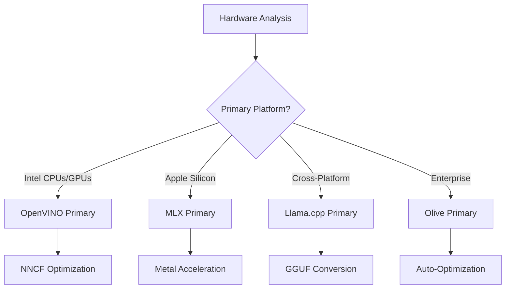
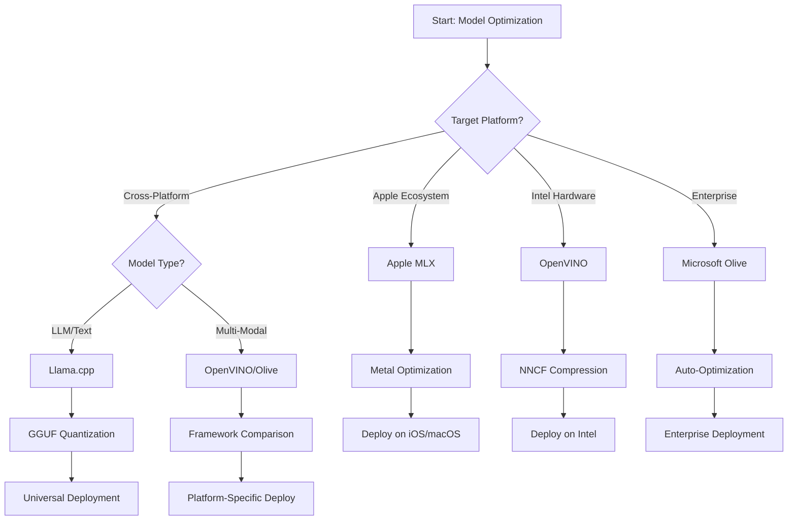
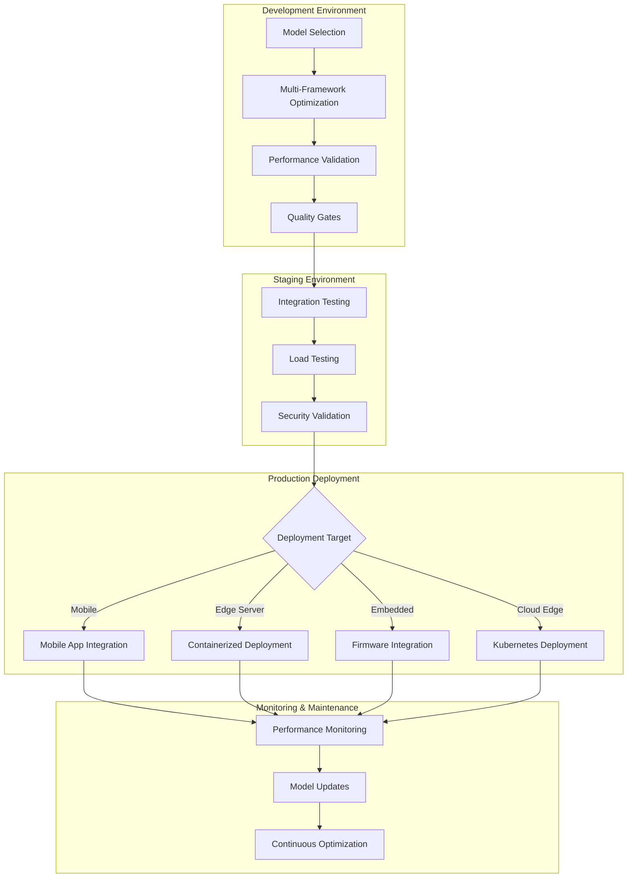

# Section 6: Edge AI Development Workflow Synthesis

## Table of Contents
1. [Introduction](../../../Module04)
2. [Learning Objectives](../../../Module04)
3. [Unified Workflow Overview](../../../Module04)
4. [Framework Selection Matrix](../../../Module04)
5. [Best Practices Synthesis](../../../Module04)
6. [Deployment Strategy Guide](../../../Module04)
7. [Performance Optimization Workflow](../../../Module04)
8. [Production Readiness Checklist](../../../Module04)
9. [Troubleshooting and Monitoring](../../../Module04)
10. [Future-Proofing Your Edge AI Pipeline](../../../Module04)

## Introduction

To develop Edge AI, you go need sabi how to use different optimization frameworks, deployment strategies, and hardware. Dis section go join all di knowledge wey we don learn from Llama.cpp, Microsoft Olive, OpenVINO, and Apple MLX to create one workflow wey go help you work better, keep quality, and make sure say production deployment go dey successful.

For dis course, we don look di different optimization frameworks one by one. Each one get im own strong points and special use cases. But for real-life Edge AI projects, you go need mix techniques from different frameworks or decide which one go work best for di constraints and requirements wey you get.

Dis section go join di wisdom from all di frameworks together into workflows, decision trees, and best practices wey you fit use to build Edge AI solutions wey ready for production. Whether you dey optimize for mobile devices, embedded systems, or edge servers, dis guide go give you di framework wey you need to make better decisions for your development lifecycle.

## Learning Objectives

By di end of dis section, you go fit:

### Strategic Decision Making
- **Choose di best optimization framework** based on wetin your project need, hardware constraints, and deployment scenarios
- **Design workflows wey dey complete** wey go join different optimization techniques to work better
- **Check di trade-offs** between model accuracy, inference speed, memory usage, and deployment complexity for di different frameworks

### Workflow Integration
- **Build development pipelines wey dey unified** wey go use di strong points of different optimization frameworks
- **Create workflows wey fit repeat** so dat model optimization and deployment go dey consistent for different environments
- **Set quality gates** and validation processes to make sure say optimized models dey ready for production

### Performance Optimization
- **Use optimization strategies wey dey systematic** like quantization, pruning, and hardware-specific acceleration techniques
- **Monitor and benchmark** model performance for different optimization levels and deployment targets
- **Optimize for di hardware platforms wey you dey use** like CPU, GPU, NPU, and specialized edge accelerators

### Production Deployment
- **Design deployment architectures wey fit scale** wey go work with different model formats and inference engines
- **Set up monitoring and observability** for Edge AI applications wey dey production
- **Create workflows for maintenance** wey go help with model updates, performance monitoring, and system optimization

### Cross-Platform Excellence
- **Deploy optimized models** for different hardware platforms and still keep performance consistent
- **Handle platform-specific optimizations** for Windows, macOS, Linux, mobile, and embedded systems
- **Build abstraction layers** wey go make deployment easy for different edge environments

## Unified Workflow Overview

### Phase 1: Requirements Analysis and Framework Selection

To deploy Edge AI successfully, you go need to first analyze wetin you need and use am to choose di framework and optimization strategy.

#### 1.1 Hardware Assessment


**Things wey you go consider:**
- **CPU Architecture**: x86, ARM, Apple Silicon capabilities
- **Accelerator Availability**: GPU, NPU, VPU, specialized AI chips
- **Memory Constraints**: RAM limitations, storage capacity
- **Power Budget**: Battery life, thermal constraints
- **Connectivity**: Offline requirements, bandwidth limitations

#### 1.2 Application Requirements Matrix

| Requirement | Llama.cpp | Microsoft Olive | OpenVINO | Apple MLX |
|-------------|-----------|-----------------|----------|-----------|
| Cross-platform | ✅ Excellent | ⚡ Good | ⚡ Good | ❌ Apple Only |
| Enterprise Integration | ⚡ Basic | ✅ Excellent | ✅ Excellent | ⚡ Limited |
| Mobile Deployment | ✅ Excellent | ⚡ Good | ⚡ Good | ✅ iOS Excellent |
| Real-time Inference | ✅ Excellent | ✅ Excellent | ✅ Excellent | ✅ Excellent |
| Model Diversity | ✅ LLM Focus | ✅ All Models | ✅ All Models | ✅ LLM Focus |
| Ease of Use | ✅ Simple | ✅ Automated | ⚡ Moderate | ✅ Simple |

### Phase 2: Model Preparation and Optimization

#### 2.1 Universal Model Assessment Pipeline

```python
# Universal Model Assessment Framework
class EdgeAIModelAssessment:
    def __init__(self, model_path, target_hardware):
        self.model_path = model_path
        self.target_hardware = target_hardware
        self.optimization_frameworks = []
        
    def assess_model_characteristics(self):
        """Analyze model size, architecture, and complexity"""
        return {
            'model_size': self.get_model_size(),
            'parameter_count': self.get_parameter_count(),
            'architecture_type': self.detect_architecture(),
            'quantization_compatibility': self.check_quantization_support()
        }
    
    def recommend_optimization_strategy(self):
        """Recommend optimal frameworks and techniques"""
        characteristics = self.assess_model_characteristics()
        
        if self.target_hardware.startswith('apple'):
            return self.mlx_optimization_strategy(characteristics)
        elif self.target_hardware.startswith('intel'):
            return self.openvino_optimization_strategy(characteristics)
        elif characteristics['model_size'] > 7_000_000_000:  # 7B+ parameters
            return self.enterprise_optimization_strategy(characteristics)
        else:
            return self.lightweight_optimization_strategy(characteristics)
```

#### 2.2 Multi-Framework Optimization Pipeline

**Sequential Optimization Approach:**
1. **Initial Conversion**: Convert to intermediate format (ONNX when possible)
2. **Framework-Specific Optimization**: Apply specialized techniques
3. **Cross-Validation**: Verify performance across target platforms
4. **Final Packaging**: Prepare for deployment

```bash
# Multi-Framework Optimization Script
#!/bin/bash

MODEL_NAME="phi-3-mini"
BASE_MODEL="microsoft/Phi-3-mini-4k-instruct"

# Phase 1: ONNX Conversion (Universal)
python convert_to_onnx.py --model $BASE_MODEL --output models/onnx/

# Phase 2: Platform-Specific Optimization
if [[ "$TARGET_PLATFORM" == "intel" ]]; then
    # OpenVINO Optimization
    python optimize_openvino.py --input models/onnx/ --output models/openvino/
elif [[ "$TARGET_PLATFORM" == "apple" ]]; then
    # MLX Optimization
    python optimize_mlx.py --input $BASE_MODEL --output models/mlx/
elif [[ "$TARGET_PLATFORM" == "cross" ]]; then
    # Llama.cpp Optimization
    python convert_to_gguf.py --input models/onnx/ --output models/gguf/
fi

# Phase 3: Validation
python validate_optimization.py --original $BASE_MODEL --optimized models/$TARGET_PLATFORM/
```

### Phase 3: Performance Validation and Benchmarking

#### 3.1 Comprehensive Benchmarking Framework

```python
class EdgeAIBenchmark:
    def __init__(self, optimized_models):
        self.models = optimized_models
        self.metrics = {
            'inference_time': [],
            'memory_usage': [],
            'accuracy_score': [],
            'throughput': [],
            'energy_consumption': []
        }
    
    def run_comprehensive_benchmark(self):
        """Execute standardized benchmarks across all optimized models"""
        test_inputs = self.generate_test_inputs()
        
        for model_framework, model_path in self.models.items():
            print(f"Benchmarking {model_framework}...")
            
            # Latency Testing
            latency = self.measure_inference_latency(model_path, test_inputs)
            
            # Memory Profiling
            memory = self.profile_memory_usage(model_path)
            
            # Accuracy Validation
            accuracy = self.validate_model_accuracy(model_path, test_inputs)
            
            # Throughput Analysis
            throughput = self.measure_throughput(model_path)
            
            self.record_metrics(model_framework, latency, memory, accuracy, throughput)
    
    def generate_optimization_report(self):
        """Create comprehensive comparison report"""
        report = {
            'recommendations': self.analyze_performance_trade_offs(),
            'deployment_guidance': self.generate_deployment_recommendations(),
            'monitoring_requirements': self.define_monitoring_metrics()
        }
        return report
```

## Framework Selection Matrix

### Decision Tree for Framework Selection



### Comprehensive Selection Criteria

#### 1. Primary Use Case Alignment

**Large Language Models (LLMs):**
- **Llama.cpp**: Best for CPU-focused, cross-platform deployment
- **Apple MLX**: Optimal for Apple Silicon with unified memory
- **OpenVINO**: Excellent for Intel hardware with NNCF optimization
- **Microsoft Olive**: Ideal for enterprise workflows with automation

**Multi-Modal Models:**
- **OpenVINO**: Comprehensive support for vision, audio, and text
- **Microsoft Olive**: Enterprise-grade optimization for complex pipelines
- **Llama.cpp**: Limited to text-based models
- **Apple MLX**: Growing support for multi-modal applications

#### 2. Hardware Platform Matrix

| Platform | Primary Framework | Secondary Option | Specialized Features |
|----------|------------------|------------------|---------------------|
| Intel CPU/GPU | OpenVINO | Microsoft Olive | NNCF compression, Intel optimization |
| NVIDIA GPU | Microsoft Olive | OpenVINO | CUDA acceleration, enterprise features |
| Apple Silicon | Apple MLX | Llama.cpp | Metal shaders, unified memory |
| ARM Mobile | Llama.cpp | OpenVINO | Cross-platform, minimal dependencies |
| Edge TPU | OpenVINO | Microsoft Olive | Specialized accelerator support |
| Embedded ARM | Llama.cpp | OpenVINO | Minimal footprint, efficient inference |

#### 3. Development Workflow Preferences

**Rapid Prototyping:**
1. **Llama.cpp**: Fastest setup, immediate results
2. **Apple MLX**: Simple Python API, quick iteration
3. **Microsoft Olive**: Automated optimization, minimal configuration
4. **OpenVINO**: More complex setup, comprehensive features

**Enterprise Production:**
1. **Microsoft Olive**: Enterprise features, Azure integration
2. **OpenVINO**: Intel ecosystem, comprehensive tools
3. **Apple MLX**: Apple-specific enterprise applications
4. **Llama.cpp**: Simple deployment, limited enterprise features

## Best Practices Synthesis

### Universal Optimization Principles

#### 1. Progressive Optimization Strategy

```python
class ProgressiveOptimization:
    def __init__(self, base_model):
        self.base_model = base_model
        self.optimization_stages = [
            'baseline_measurement',
            'format_conversion',
            'quantization_optimization',
            'hardware_acceleration',
            'production_validation'
        ]
    
    def execute_progressive_optimization(self):
        """Apply optimization techniques incrementally"""
        
        # Stage 1: Baseline Measurement
        baseline_metrics = self.measure_baseline_performance()
        
        # Stage 2: Format Conversion
        converted_model = self.convert_to_optimal_format()
        conversion_metrics = self.measure_performance(converted_model)
        
        # Stage 3: Quantization
        quantized_model = self.apply_quantization(converted_model)
        quantization_metrics = self.measure_performance(quantized_model)
        
        # Stage 4: Hardware Acceleration
        accelerated_model = self.enable_hardware_acceleration(quantized_model)
        acceleration_metrics = self.measure_performance(accelerated_model)
        
        # Stage 5: Validation
        production_ready = self.validate_for_production(accelerated_model)
        
        return self.compile_optimization_report(
            baseline_metrics, conversion_metrics, 
            quantization_metrics, acceleration_metrics
        )
```

#### 2. Quality Gate Implementation

**Accuracy Preservation Gates:**
- Maintain >95% of original model accuracy
- Validate against representative test datasets
- Implement A/B testing for production validation

**Performance Improvement Gates:**
- Achieve minimum 2x speed improvement
- Reduce memory footprint by at least 50%
- Validate inference time consistency

**Production Readiness Gates:**
- Pass stress testing under load
- Demonstrate stable performance over time
- Validate security and privacy requirements

### Framework-Specific Best Practices Integration

#### 1. Quantization Strategy Synthesis

```python
# Unified Quantization Approach
class UnifiedQuantizationStrategy:
    def __init__(self, model, target_platform):
        self.model = model
        self.platform = target_platform
        
    def select_optimal_quantization(self):
        """Choose best quantization based on platform and requirements"""
        
        if self.platform == 'apple_silicon':
            return self.mlx_quantization_strategy()
        elif self.platform == 'intel_hardware':
            return self.openvino_quantization_strategy()
        elif self.platform == 'cross_platform':
            return self.llamacpp_quantization_strategy()
        else:
            return self.olive_quantization_strategy()
    
    def mlx_quantization_strategy(self):
        """Apple MLX-specific quantization"""
        return {
            'method': 'mlx_quantize',
            'precision': 'int4',
            'group_size': 64,
            'optimization_target': 'unified_memory'
        }
    
    def openvino_quantization_strategy(self):
        """OpenVINO NNCF quantization"""
        return {
            'method': 'nncf_quantize',
            'precision': 'int8',
            'calibration_method': 'post_training',
            'optimization_target': 'intel_hardware'
        }
```

#### 2. Hardware Acceleration Optimization

**CPU Optimization Synthesis:**
- **SIMD Instructions**: Leverage optimized kernels across frameworks
- **Memory Bandwidth**: Optimize data layouts for cache efficiency
- **Threading**: Balance parallelism with resource constraints

**GPU Acceleration Best Practices:**
- **Batch Processing**: Maximize throughput with appropriate batch sizes
- **Memory Management**: Optimize GPU memory allocation and transfers
- **Precision**: Use FP16 when supported for better performance

**NPU/Specialized Accelerator Optimization:**
- **Model Architecture**: Ensure compatibility with accelerator capabilities
- **Data Flow**: Optimize input/output pipelines for accelerator efficiency
- **Fallback Strategies**: Implement CPU fallback for unsupported operations

## Deployment Strategy Guide

### Universal Deployment Architecture



### Platform-Specific Deployment Patterns

#### 1. Mobile Deployment Strategy

```yaml
# Mobile Deployment Configuration
mobile_deployment:
  ios:
    framework: apple_mlx
    optimization:
      quantization: int4
      memory_mapping: true
      background_execution: limited
    packaging:
      format: mlx
      bundle_size: <50MB
      
  android:
    framework: llama_cpp
    optimization:
      quantization: q4_k_m
      threading: android_optimized
      memory_management: conservative
    packaging:
      format: gguf
      apk_size: <100MB
      
  cross_platform:
    framework: onnx_runtime
    optimization:
      quantization: int8
      execution_provider: cpu
    packaging:
      format: onnx
      shared_libraries: minimal
```

#### 2. Edge Server Deployment

```yaml
# Edge Server Deployment Configuration
edge_server:
  intel_based:
    framework: openvino
    optimization:
      quantization: int8
      acceleration: cpu_gpu_auto
      batch_processing: dynamic
    deployment:
      container: openvino_runtime
      orchestration: kubernetes
      scaling: horizontal
      
  nvidia_based:
    framework: microsoft_olive
    optimization:
      quantization: int4
      acceleration: cuda
      tensor_parallelism: true
    deployment:
      container: nvidia_triton
      orchestration: kubernetes
      scaling: gpu_aware
```

### Containerization Best Practices

```dockerfile
# Multi-Framework Edge AI Container
FROM ubuntu:22.04 as base

# Install common dependencies
RUN apt-get update && apt-get install -y \
    python3 \
    python3-pip \
    build-essential \
    cmake \
    && rm -rf /var/lib/apt/lists/*

# Framework-specific stages
FROM base as openvino
RUN pip install openvino nncf optimum[intel]

FROM base as llamacpp
RUN git clone https://github.com/ggerganov/llama.cpp.git \
    && cd llama.cpp && make LLAMA_OPENBLAS=1

FROM base as olive
RUN pip install olive-ai[auto-opt] onnxruntime-genai

# Production stage with selected framework
FROM openvino as production
COPY models/ /app/models/
COPY src/ /app/src/
WORKDIR /app

EXPOSE 8080
CMD ["python3", "src/inference_server.py"]
```

## Performance Optimization Workflow

### Systematic Performance Tuning

#### 1. Performance Profiling Pipeline

```python
class EdgeAIPerformanceProfiler:
    def __init__(self, model_path, framework):
        self.model_path = model_path
        self.framework = framework
        self.profiling_results = {}
    
    def comprehensive_profiling(self):
        """Execute comprehensive performance analysis"""
        
        # CPU Profiling
        cpu_profile = self.profile_cpu_usage()
        
        # Memory Profiling
        memory_profile = self.profile_memory_usage()
        
        # Inference Latency
        latency_profile = self.profile_inference_latency()
        
        # Throughput Analysis
        throughput_profile = self.profile_throughput()
        
        # Energy Consumption (where available)
        energy_profile = self.profile_energy_consumption()
        
        return self.compile_performance_report(
            cpu_profile, memory_profile, latency_profile,
            throughput_profile, energy_profile
        )
    
    def identify_bottlenecks(self):
        """Automatically identify performance bottlenecks"""
        bottlenecks = []
        
        if self.profiling_results['cpu_utilization'] > 80:
            bottlenecks.append('cpu_bound')
        
        if self.profiling_results['memory_usage'] > 90:
            bottlenecks.append('memory_bound')
        
        if self.profiling_results['inference_variance'] > 20:
            bottlenecks.append('inconsistent_performance')
        
        return self.generate_optimization_recommendations(bottlenecks)
```

#### 2. Automated Optimization Pipeline

```python
class AutomatedOptimizationPipeline:
    def __init__(self, base_model, target_constraints):
        self.base_model = base_model
        self.constraints = target_constraints
        self.optimization_history = []
    
    def execute_optimization_search(self):
        """Systematically search optimization space"""
        
        optimization_candidates = [
            {'quantization': 'int8', 'pruning': 0.1},
            {'quantization': 'int4', 'pruning': 0.2},
            {'quantization': 'int8', 'acceleration': 'gpu'},
            {'quantization': 'int4', 'acceleration': 'npu'}
        ]
        
        best_configuration = None
        best_score = 0
        
        for config in optimization_candidates:
            optimized_model = self.apply_optimization(config)
            score = self.evaluate_optimization(optimized_model)
            
            if score > best_score and self.meets_constraints(optimized_model):
                best_score = score
                best_configuration = config
            
            self.optimization_history.append({
                'config': config,
                'score': score,
                'model': optimized_model
            })
        
        return best_configuration, self.optimization_history
```

### Multi-Objective Optimization

#### 1. Pareto Optimization for Edge AI

```python
class ParetoOptimization:
    def __init__(self, objectives=['speed', 'accuracy', 'memory']):
        self.objectives = objectives
        self.pareto_frontier = []
    
    def find_pareto_optimal_solutions(self, optimization_results):
        """Identify Pareto-optimal configurations"""
        
        for result in optimization_results:
            is_dominated = False
            
            for frontier_point in self.pareto_frontier:
                if self.dominates(frontier_point, result):
                    is_dominated = True
                    break
            
            if not is_dominated:
                # Remove dominated points from frontier
                self.pareto_frontier = [
                    point for point in self.pareto_frontier 
                    if not self.dominates(result, point)
                ]
                
                self.pareto_frontier.append(result)
        
        return self.pareto_frontier
    
    def recommend_configuration(self, user_preferences):
        """Recommend configuration based on user preferences"""
        
        weighted_scores = []
        for config in self.pareto_frontier:
            score = sum(
                user_preferences[obj] * config['metrics'][obj] 
                for obj in self.objectives
            )
            weighted_scores.append((score, config))
        
        return max(weighted_scores, key=lambda x: x[0])[1]
```

## Production Readiness Checklist

### Comprehensive Production Validation

#### 1. Model Quality Assurance

```python
class ProductionReadinessValidator:
    def __init__(self, optimized_model, production_requirements):
        self.model = optimized_model
        self.requirements = production_requirements
        self.validation_results = {}
    
    def validate_model_quality(self):
        """Comprehensive model quality validation"""
        
        # Accuracy Validation
        accuracy_result = self.validate_accuracy()
        
        # Performance Validation
        performance_result = self.validate_performance()
        
        # Robustness Testing
        robustness_result = self.validate_robustness()
        
        # Security Assessment
        security_result = self.validate_security()
        
        # Compliance Verification
        compliance_result = self.validate_compliance()
        
        return self.compile_validation_report(
            accuracy_result, performance_result, robustness_result,
            security_result, compliance_result
        )
    
    def generate_certification_report(self):
        """Generate production certification report"""
        return {
            'model_signature': self.generate_model_signature(),
            'validation_timestamp': datetime.now(),
            'validation_results': self.validation_results,
            'deployment_approval': self.check_deployment_approval(),
            'monitoring_requirements': self.define_monitoring_requirements()
        }
```

#### 2. Production Deployment Checklist

**Pre-Deployment Validation:**
- [ ] Model accuracy meets minimum requirements (>95% of baseline)
- [ ] Performance targets achieved (latency, throughput, memory)
- [ ] Security vulnerabilities assessed and mitigated
- [ ] Stress testing completed under expected load
- [ ] Failure scenarios tested and recovery procedures validated
- [ ] Monitoring and alerting systems configured
- [ ] Rollback procedures tested and documented

**Deployment Process:**
- [ ] Blue-green deployment strategy implemented
- [ ] Gradual traffic ramping configured
- [ ] Real-time monitoring dashboards active
- [ ] Performance baselines established
- [ ] Error rate thresholds defined
- [ ] Automated rollback triggers configured

**Post-Deployment Monitoring:**
- [ ] Model drift detection active
- [ ] Performance degradation alerts configured
- [ ] Resource utilization monitoring enabled
- [ ] User experience metrics tracked
- [ ] Model versioning and lineage maintained
- [ ] Regular model performance reviews scheduled

### Continuous Integration/Continuous Deployment (CI/CD)

```yaml
# Edge AI CI/CD Pipeline Configuration
edge_ai_pipeline:
  stages:
    - model_validation
    - optimization
    - testing
    - staging_deployment
    - production_deployment
    - monitoring
  
  model_validation:
    accuracy_threshold: 0.95
    performance_baseline: required
    security_scan: enabled
    
  optimization:
    frameworks:
      - llama_cpp
      - openvino
      - microsoft_olive
    validation:
      cross_validation: enabled
      performance_comparison: required
      
  testing:
    unit_tests: comprehensive
    integration_tests: full_pipeline
    load_tests: production_scale
    security_tests: comprehensive
    
  deployment:
    strategy: blue_green
    traffic_ramping: gradual
    rollback: automatic
    monitoring: real_time
```

## Troubleshooting and Monitoring

### Universal Troubleshooting Framework

#### 1. Common Issues and Solutions

**Performance Issues:**
```python
class PerformanceTroubleshooter:
    def __init__(self, model_metrics):
        self.metrics = model_metrics
        
    def diagnose_performance_issues(self):
        """Systematic performance issue diagnosis"""
        
        issues = []
        
        # High latency diagnosis
        if self.metrics['avg_latency'] > self.metrics['target_latency']:
            issues.append(self.diagnose_latency_issues())
        
        # Memory usage diagnosis
        if self.metrics['memory_usage'] > self.metrics['memory_limit']:
            issues.append(self.diagnose_memory_issues())
        
        # Throughput diagnosis
        if self.metrics['throughput'] < self.metrics['target_throughput']:
            issues.append(self.diagnose_throughput_issues())
        
        return self.generate_resolution_plan(issues)
    
    def diagnose_latency_issues(self):
        """Specific latency troubleshooting"""
        potential_causes = []
        
        if self.metrics['cpu_utilization'] > 80:
            potential_causes.append('cpu_bottleneck')
        
        if self.metrics['memory_bandwidth'] > 90:
            potential_causes.append('memory_bandwidth_limit')
        
        if self.metrics['model_size'] > self.metrics['optimal_size']:
            potential_causes.append('model_too_large')
        
        return {
            'issue': 'high_latency',
            'causes': potential_causes,
            'solutions': self.generate_latency_solutions(potential_causes)
        }
```

**Framework-Specific Troubleshooting:**

| Issue | Llama.cpp | Microsoft Olive | OpenVINO | Apple MLX |
|-------|-----------|-----------------|----------|-----------|
| Memory Issues | Reduce context length | Lower batch size | Enable caching | Use memory mapping |
| Slow Inference | Enable SIMD | Check quantization | Optimize threading | Enable Metal |
| Accuracy Loss | Higher quantization | Retrain with QAT | Increase calibration | Fine-tune post-quant |
| Compatibility | Check model format | Verify framework version | Update drivers | Check macOS version |

#### 2. Production Monitoring Strategy

```python
class EdgeAIMonitoring:
    def __init__(self, deployment_config):
        self.config = deployment_config
        self.metrics_collectors = []
        self.alerting_rules = []
    
    def setup_comprehensive_monitoring(self):
        """Configure comprehensive monitoring for Edge AI deployment"""
        
        # Model Performance Monitoring
        self.setup_model_performance_monitoring()
        
        # Infrastructure Monitoring
        self.setup_infrastructure_monitoring()
        
        # Business Metrics Monitoring
        self.setup_business_metrics_monitoring()
        
        # Security Monitoring
        self.setup_security_monitoring()
    
    def setup_model_performance_monitoring(self):
        """Model-specific performance monitoring"""
        metrics = [
            'inference_latency_p50',
            'inference_latency_p95',
            'inference_latency_p99',
            'model_accuracy_drift',
            'prediction_confidence_distribution',
            'error_rate',
            'throughput_requests_per_second'
        ]
        
        for metric in metrics:
            self.add_metric_collector(metric)
            self.add_alerting_rule(metric)
    
    def detect_model_drift(self):
        """Automated model drift detection"""
        drift_indicators = [
            self.statistical_drift_detection(),
            self.performance_drift_detection(),
            self.data_distribution_shift_detection()
        ]
        
        return self.aggregate_drift_signals(drift_indicators)
```

### Automated Issue Resolution

```python
class AutomatedIssueResolution:
    def __init__(self, monitoring_system):
        self.monitoring = monitoring_system
        self.resolution_strategies = {}
    
    def handle_performance_degradation(self, alert):
        """Automated performance issue resolution"""
        
        if alert['type'] == 'high_latency':
            return self.resolve_latency_issue(alert)
        elif alert['type'] == 'high_memory_usage':
            return self.resolve_memory_issue(alert)
        elif alert['type'] == 'accuracy_drift':
            return self.resolve_accuracy_issue(alert)
        
    def resolve_latency_issue(self, alert):
        """Automated latency issue resolution"""
        resolution_steps = [
            'increase_cpu_allocation',
            'enable_model_caching',
            'reduce_batch_size',
            'switch_to_quantized_model'
        ]
        
        for step in resolution_steps:
            if self.apply_resolution_step(step):
                return f"Resolved latency issue with: {step}"
        
        return "Escalating to human operator"
```

## Future-Proofing Your Edge AI Pipeline

### Emerging Technologies Integration

#### 1. Next-Generation Hardware Support

```python
class FutureHardwareIntegration:
    def __init__(self):
        self.supported_accelerators = [
            'npu_next_gen',
            'quantum_processors',
            'neuromorphic_chips',
            'optical_processors'
        ]
    
    def design_adaptive_pipeline(self):
        """Create hardware-agnostic optimization pipeline"""
        
        pipeline = {
            'model_preparation': self.universal_model_preparation(),
            'hardware_detection': self.dynamic_hardware_detection(),
            'optimization_selection': self.adaptive_optimization_selection(),
            'performance_validation': self.hardware_agnostic_validation()
        }
        
        return pipeline
    
    def adaptive_optimization_selection(self):
        """Dynamically select optimization based on available hardware"""
        
        def optimize_for_hardware(model, available_hardware):
            if 'npu' in available_hardware:
                return self.npu_optimization(model)
            elif 'quantum' in available_hardware:
                return self.quantum_optimization(model)
            elif 'neuromorphic' in available_hardware:
                return self.neuromorphic_optimization(model)
            else:
                return self.fallback_optimization(model)
        
        return optimize_for_hardware
```

#### 2. Model Architecture Evolution

**Support for Emerging Architectures:**
- **Mixture of Experts (MoE)**: Sparse model architectures for efficiency
- **Retrieval-Augmented Generation**: Hybrid model + knowledge base systems
- **Multimodal Models**: Vision + Language + Audio integration
- **Federated Learning**: Distributed training and optimization

```python
class NextGenModelSupport:
    def __init__(self):
        self.architecture_handlers = {
            'moe': self.handle_mixture_of_experts,
            'rag': self.handle_retrieval_augmented,
            'multimodal': self.handle_multimodal,
            'federated': self.handle_federated_learning
        }
    
    def handle_mixture_of_experts(self, model):
        """Optimize Mixture of Experts models for edge deployment"""
        optimization_strategy = {
            'expert_pruning': True,
            'routing_optimization': True,
            'expert_quantization': 'per_expert',
            'load_balancing': 'dynamic'
        }
        return self.apply_moe_optimization(model, optimization_strategy)
```

### Continuous Learning and Adaptation

#### 1. Online Learning Integration

```python
class EdgeOnlineLearning:
    def __init__(self, base_model, learning_rate=0.001):
        self.base_model = base_model
        self.learning_rate = learning_rate
        self.adaptation_buffer = []
    
    def continuous_adaptation(self, new_data, feedback):
        """Continuously adapt model based on edge data"""
        
        # Privacy-preserving local adaptation
        local_updates = self.compute_local_gradients(new_data, feedback)
        
        # Apply updates with constraints
        adapted_model = self.apply_constrained_updates(
            self.base_model, local_updates
        )
        
        # Validate adaptation quality
        if self.validate_adaptation(adapted_model):
            self.base_model = adapted_model
            return True
        
        return False
    
    def federated_learning_participation(self):
        """Participate in federated learning while preserving privacy"""
        
        # Compute local model updates
        local_updates = self.compute_private_updates()
        
        # Differential privacy protection
        private_updates = self.apply_differential_privacy(local_updates)
        
        # Share with federated learning coordinator
        return self.share_updates(private_updates)
```

#### 2. Sustainability and Green AI

```python
class GreenEdgeAI:
    def __init__(self, sustainability_targets):
        self.targets = sustainability_targets
        self.energy_monitor = EnergyMonitor()
    
    def optimize_for_sustainability(self, model):
        """Optimize model for minimal environmental impact"""
        
        optimization_objectives = [
            'minimize_energy_consumption',
            'maximize_hardware_utilization',
            'reduce_model_training_cost',
            'extend_device_lifetime'
        ]
        
        return self.multi_objective_green_optimization(
            model, optimization_objectives
        )
    
    def carbon_aware_deployment(self):
        """Deploy models considering carbon footprint"""
        
        deployment_strategy = {
            'prefer_renewable_energy_regions': True,
            'optimize_for_energy_efficiency': True,
            'minimize_data_transfer': True,
            'lifecycle_carbon_accounting': True
        }
        
        return deployment_strategy
```

## Conclusion

Dis workflow synthesis na di summary of all di Edge AI optimization knowledge wey we don gather. E join di best practices from all di major optimization frameworks into one approach wey dey ready for production. If you follow dis guidelines, you go fit:

**Get Better Performance**: By choosing di right framework, optimizing step by step, and validating well, your Edge AI applications go dey efficient.

**Make Sure Say Production Ready**: With testing, monitoring, and quality gates wey go make sure say deployment dey reliable for real-life environments.

**Keep Long-term Success**: With monitoring, automated issue resolution, and strategies wey go help you adapt, your Edge AI solutions go dey perform well and stay relevant.

**Prepare for di Future**: By designing pipelines wey dey flexible and hardware-agnostic, you go fit adapt to new technologies and requirements.

Di Edge AI world dey change fast, with new hardware platforms, optimization techniques, and deployment strategies dey show up regularly. Dis synthesis na di foundation wey go help you handle di complexity and build Edge AI solutions wey dey strong, efficient, and dey work well for production.
Make sure say di best way to optimize na di one wey go fit your own needs well well, and e go still get space to change as your needs dey change. Use dis guide as framework to help you make better decisions, but always test wetin you choose for real-life setup and experience.

## ➡️ Wetin next

- [07: Qualcomm QNN Framework Deep Dive](./07.QualcommQNN.md)

---

<!-- CO-OP TRANSLATOR DISCLAIMER START -->
**Disclaimer**:  
Dis dokyument don translate wit AI translation service [Co-op Translator](https://github.com/Azure/co-op-translator). Even as we dey try make am accurate, abeg sabi say automated translations fit get mistake or no correct well. Di original dokyument for im native language na di main source wey you go trust. For important information, e good make professional human translation dey use. We no go fit take blame for any misunderstanding or wrong interpretation wey fit happen because you use dis translation.
<!-- CO-OP TRANSLATOR DISCLAIMER END -->