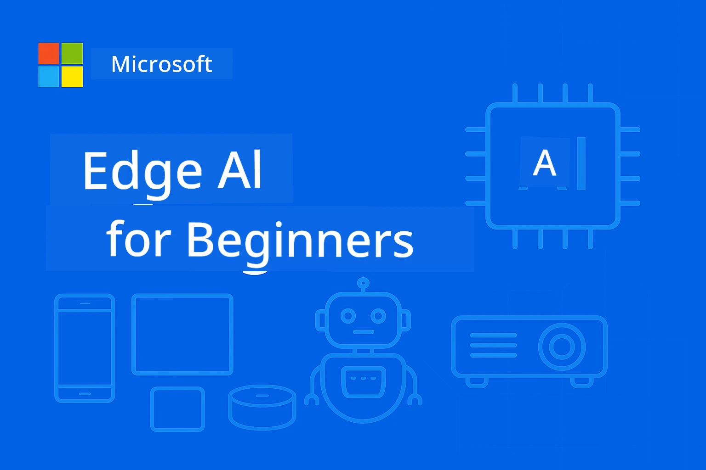

# EdgeAI for Beginners 




[](https://GitHub.com/microsoft/edgeai-for-beginners/graphs/contributors)
[](https://GitHub.com/microsoft/edgeai-for-beginners/issues)
[](https://GitHub.com/microsoft/edgeai-for-beginners/pulls)
[](http://makeapullrequest.com)

[](https://GitHub.com/microsoft/edgeai-for-beginners/watchers)
[](https://GitHub.com/microsoft/edgeai-for-beginners/fork)
[](https://GitHub.com/microsoft/edgeai-for-beginners/stargazers)


[](https://discord.gg/nTYy5BXMWG)

Follow dis steps to start to use dis resources:

1. **Fork di Repository**: Click [](https://GitHub.com/microsoft/edgeai-for-beginners/fork)
2. **Clone di Repository**:   `git clone https://github.com/microsoft/edgeai-for-beginners.git`
3. [**Join The Azure AI Foundry Discord and meet experts and fellow developers**](https://discord.com/invite/ByRwuEEgH4)


### 🌐 Multi-Language Support

#### Supported via GitHub Action (Automated & Always Up-to-Date)

<!-- CO-OP TRANSLATOR LANGUAGES TABLE START -->
[Arabic](../ar/README.md) | [Bengali](../bn/README.md) | [Bulgarian](../bg/README.md) | [Burmese (Myanmar)](../my/README.md) | [Chinese (Simplified)](../zh-CN/README.md) | [Chinese (Traditional, Hong Kong)](../zh-HK/README.md) | [Chinese (Traditional, Macau)](../zh-MO/README.md) | [Chinese (Traditional, Taiwan)](../zh-TW/README.md) | [Croatian](../hr/README.md) | [Czech](../cs/README.md) | [Danish](../da/README.md) | [Dutch](../nl/README.md) | [Estonian](../et/README.md) | [Finnish](../fi/README.md) | [French](../fr/README.md) | [German](../de/README.md) | [Greek](../el/README.md) | [Hebrew](../he/README.md) | [Hindi](../hi/README.md) | [Hungarian](../hu/README.md) | [Indonesian](../id/README.md) | [Italian](../it/README.md) | [Japanese](../ja/README.md) | [Kannada](../kn/README.md) | [Khmer](../km/README.md) | [Korean](../ko/README.md) | [Lithuanian](../lt/README.md) | [Malay](../ms/README.md) | [Malayalam](../ml/README.md) | [Marathi](../mr/README.md) | [Nepali](../ne/README.md) | [Nigerian Pidgin](./README.md) | [Norwegian](../no/README.md) | [Persian (Farsi)](../fa/README.md) | [Polish](../pl/README.md) | [Portuguese (Brazil)](../pt-BR/README.md) | [Portuguese (Portugal)](../pt-PT/README.md) | [Punjabi (Gurmukhi)](../pa/README.md) | [Romanian](../ro/README.md) | [Russian](../ru/README.md) | [Serbian (Cyrillic)](../sr/README.md) | [Slovak](../sk/README.md) | [Slovenian](../sl/README.md) | [Spanish](../es/README.md) | [Swahili](../sw/README.md) | [Swedish](../sv/README.md) | [Tagalog (Filipino)](../tl/README.md) | [Tamil](../ta/README.md) | [Telugu](../te/README.md) | [Thai](../th/README.md) | [Turkish](../tr/README.md) | [Ukrainian](../uk/README.md) | [Urdu](../ur/README.md) | [Vietnamese](../vi/README.md)

> **You Wan Clone Am For Your Machine?**
>
> Dis repo get 50+ language translations wey dey make di download size big. To clone without translations, use sparse checkout:
>
> **Bash / macOS / Linux:**
> ```bash
> git clone --filter=blob:none --sparse https://github.com/microsoft/edgeai-for-beginners.git
> cd edgeai-for-beginners
> git sparse-checkout set --no-cone '/*' '!translations' '!translated_images'
> ```
>
> **CMD (Windows):**
> ```cmd
> git clone --filter=blob:none --sparse https://github.com/microsoft/edgeai-for-beginners.git
> cd edgeai-for-beginners
> git sparse-checkout set --no-cone "/*" "!translations" "!translated_images"
> ```
>
> Dis go give you everything wey you need to finish di course quick quick.
<!-- CO-OP TRANSLATOR LANGUAGES TABLE END -->

**If you want make dem add more translations dey listed [here](https://github.com/Azure/co-op-translator/blob/main/getting_started/supported-languages.md)**
## Introduction

Welcome to **EdgeAI for Beginners** – your full guide to di big big work wey Edge Artificial Intelligence fit do. Dis course go join di strong AI power with real practical use for edge devices, make you fit use AI power directly for where data dey come from and where decisions gats to happen.

### Wetin You Go Learn

Dis course go carry you from basic tori dem go go reach how to run am for production, e cover:
- **Small Language Models (SLMs)** wey dem optimize for edge deploy
- **Hardware-aware optimization** for different platform dem
- **Real-time inference** with privacy protection
- **Production deployment** way dem use for big company apps

### Why EdgeAI Important

Edge AI na big change way dey solve important problem dem for now:
- **Privacy & Security**: You fit process sensitive data for your machine without put am for cloud
- **Real-time Performance**: No delay from network for apps wey time dey important
- **Cost Efficiency**: Save money for bandwidth and cloud computing
- **Resilient Operations**: System still dey work if network go down
- **Regulatory Compliance**: E dey follow law wen dem talk about who get data

### Edge AI

Edge AI mean say AI algorithm and language models dey run for local hardware, near where data come from, no need to dey depend on cloud for inference. E reduce delay, keep privacy safe, and fit make decisions sharp sharp.

### Core Principles:
- **On-device inference**: AI models dey run for edge devices (phone, routers, microcontrollers, industrial PC)
- **Offline capability**: E fit work without internet wey dey constant
- **Low latency**: Fast response wey go fit real-time systems
- **Data sovereignty**: E keep sensitive data local, make security and compliance better

### Small Language Models (SLMs)

SLMs like Phi-4, Mistral-7B, and Gemma na small versions wey dem optimize of big LLMs—wey dem train or distill for:
- **Reduced memory footprint**: Make memory use small for edge devices
- **Lower compute demand**: Optimized for CPU and edge GPU
- **Faster startup times**: Quick to start so app go dey responsive

Dem fit give you strong NLP power but still fit di limitation dem:
- **Embedded systems**: IoT device and industrial controllers
- **Mobile devices**: Smartphones and tablets wey fit work offline
- **IoT Devices**: Sensors and smart devices wey get small resource
- **Edge servers**: Local processing unit with small GPU power
- **Personal Computers**: Desktop and laptop way dem fit deploy am

## Course Modules & Navigation

| Module | Topic | Focus Area | Key Content | Level | Duration |
|--------|-------|------------|-------------|--------|----------|
| [📖 00 ](./introduction.md) | [Introduction to EdgeAI](./introduction.md) | Foundation & Context | EdgeAI Overview • Industry Applications • SLM Introduction • Learning Objectives | Beginner | 1-2 hrs |
| [📚 01](../../Module01) | [EdgeAI Fundamentals](./Module01/README.md) | Cloud vs Edge AI comparison | EdgeAI Fundamentals • Real World Case Studies • Implementation Guide • Edge Deployment | Beginner | 3-4 hrs |
| [🧠 02](../../Module02) | [SLM Model Foundations](./Module02/README.md) | Model families & architecture | Phi Family • Qwen Family • Gemma Family • BitNET • μModel • Phi-Silica | Beginner | 4-5 hrs |
| [🚀 03](../../Module03) | [SLM Deployment Practice](./Module03/README.md) | Local & cloud deployment | Advanced Learning • Local Environment • Cloud Deployment | Intermediate | 4-5 hrs |
| [⚙️ 04](../../Module04) | [Model Optimization Toolkit](./Module04/README.md) | Cross-platform optimization | Introduction • Llama.cpp • Microsoft Olive • OpenVINO • Apple MLX • Workflow Synthesis | Intermediate | 5-6 hrs |
| [🔧 05](../../Module05) | [SLMOps Production](./Module05/README.md) | Production operations | SLMOps Introduction • Model Distillation • Fine-tuning • Production Deployment | Advanced | 5-6 hrs |
| [🤖 06](../../Module06) | [AI Agents & Function Calling](./Module06/README.md) | Agent frameworks & MCP | Agent Introduction • Function Calling • Model Context Protocol | Advanced | 4-5 hrs |
| [💻 07](../../Module07) | [Platform Implementation](./Module07/README.md) | Cross-platform samples | AI Toolkit • Foundry Local • Windows Development | Advanced | 3-4 hrs |
| [🏭 08](../../Module08) | [Foundry Local Toolkit](./Module08/README.md) | Production-ready samples | Sample applications (see details below) | Expert | 8-10 hrs |

### 🏭 **Module 08: Sample Applications**

- [01: REST Chat Quickstart](./Module08/samples/01/README.md)
- [02: OpenAI SDK Integration](./Module08/samples/02/README.md)
- [03: Model Discovery & Benchmarking](./Module08/samples/03/README.md)
- [04: Chainlit RAG Application](./Module08/samples/04/README.md)
- [05: Multi-Agent Orchestration](./Module08/samples/05/README.md)
- [06: Models-as-Tools Router](./Module08/samples/06/README.md)
- [07: Direct API Client](./Module08/samples/07/README.md)
- [08: Windows 11 Chat App](./Module08/samples/08/README.md)
- [09: Advanced Multi-Agent System](./Module08/samples/09/README.md)
- [10: Foundry Tools Framework](./Module08/samples/10/README.md)

### 🎓 **Workshop: Hands-On Learning Path**

Complete hands-on workshop materials with production-ready implementations:

- **[Workshop Guide](./Workshop/Readme.md)** - Complete learning objectives, outcomes, and resource navigation
- **Python Samples** (6 sessions) - Updated with best practices, error handling, and full documentation
- **Jupyter Notebooks** (8 interactive) - Step-by-step tutorials with benchmarks and performance monitoring
- **Session Guides** - Detailed markdown guides for each workshop session
- **Validation Tools** - Scripts to check code quality and run quick tests

**Wetin You Go Build:**
- Local AI chat apps with streaming support
- RAG pipelines with quality checks (RAGAS)
- Multi-model benchmarking and comparison tools
- Multi-agent orchestration systems
- Smart model routing with task-based selection

### 🎙️ **Workshop For Agentic: Hands-On - The AI Podcast Studio**
Build AI-powered podcast production pipeline from scratch! Dis workshop go teach you how to create complete multi-agent system wey go turn ideas to professional podcast episodes.

**[🎬 Start The AI Podcast Studio Workshop](./WorkshopForAgentic/README.md)**

**Your Mission**: Launch "Future Bytes" — tech podcast powered fully by AI agents wey you go build yourself. No cloud wahala, no API charges — everything dey run local for your machine.

**Wetin Make Dis Different:**
- **🤖 Real Multi-Agent Orchestration** - Build special AI agents wey go do research, write, and produce audio
- **🎯 Complete Production Pipeline** - From topic choice reach final podcast audio output
- **💻 100% Local Deployment** - Use Ollama and local models (Qwen-3-8B) for full privacy and control
- **🎤 Text-to-Speech Integration** - Change scripts to natural-sounding multi-speaker talks
- **✋ Human-in-the-Loop Workflows** - Approval gates wey make sure quality dey while automation dey continue

**Three-Act Learning Journey:**

| Act | Focus | Key Skills | Duration |
|-----|-------|------------|----------|
| **[Act 1: Meet Your AI Assistants](./WorkshopForAgentic/md/01.BuildAIAgentWithSLM.md)** | Build your first AI agent | Tool integration • Web search • Problem-solving • Agentic reasoning | 2-3 hrs |
| **[Act 2: Assemble Your Production Team](./WorkshopForAgentic/md/02.AIAgentOrchestrationAndWorkflows.md)** | Orchestrate multiple agents | Team coordination • Approval workflows • DevUI interface • Human oversight | 3-4 hrs |
| **[Act 3: Bring Your Podcast to Life](./WorkshopForAgentic/md/03.Multi-SpeakerPodcastGenerationWithVibeVoice.md)** | Generate podcast audio | Text-to-speech • Multi-speaker synthesis • Long-form audio • Full automation | 2-3 hrs |

**Technologies We Dey Use:**
- **Microsoft Agent Framework** - Multi-agent orchestration and coordination
- **Ollama** - Local AI model runtime (no need cloud)
- **Qwen-3-8B** - Open-source language model optimized for agentic tasks
- **Text-to-Speech APIs** - Natural voice synthesis for podcast generation

**Hardware Support:**
- ✅ **CPU Mode** - Fit run for any modern computer (8GB+ RAM recommended)
- 🚀 **GPU Acceleration** - Much faster inference with NVIDIA/AMD GPUs
- ⚡ **NPU Support** - Next-generation neural processing unit acceleration

**Perfect For:**
- Developers wey dey learn multi-agent AI systems
- Anybody wey interested for AI automation and workflows
- Content creators wey dey explore AI-assisted production
- Students wey dey study practical AI orchestration patterns

**Start Building**: [🎙️ The AI Podcast Studio Workshop →](./WorkshopForAgentic/README.md)

### 📊 **Learning Path Summary**
- **Total Duration**: 36-45 hours
- **Beginner Path**: Modules 01-02 (7-9 hours)  
- **Intermediate Path**: Modules 03-04 (9-11 hours)
- **Advanced Path**: Modules 05-07 (12-15 hours)
- **Expert Path**: Module 08 (8-10 hours)

## Wetin You Go Build

### 🎯 Core Competencies
- **Edge AI Architecture**: Design local-first AI systems with cloud integration
- **Model Optimization**: Quantize and compress models for edge deployment (85% speed boost, 75% size reduction)
- **Multi-Platform Deployment**: Windows, mobile, embedded, and cloud-edge hybrid systems
- **Production Operations**: Monitoring, scaling, and maintaining edge AI for production

### 🏗️ Practical Projects
- **Foundry Local Chat Apps**: Windows 11 native application wey fit switch models
- **Multi-Agent Systems**: Coordinator with specialist agents for complex workflows  
- **RAG Applications**: Local document processing with vector search
- **Model Routers**: Smart selection between models based on task analysis
- **API Frameworks**: Production-ready clients with streaming and health monitoring
- **Cross-Platform Tools**: LangChain/Semantic Kernel integration patterns

### 🏢 Industry Applications
**Manufacturing** • **Healthcare** • **Autonomous Vehicles** • **Smart Cities** • **Mobile Apps**

## Quick Start

**Recommended Learning Path** (20-30 hours total):

0. **📖 Introduction** ([Introduction.md](./introduction.md)): EdgeAI foundation + industry context + learning framework
1. **📚 Foundation** (Modules 01-02): EdgeAI concepts + SLM model families
2. **⚙️ Optimization** (Modules 03-04): Deployment + quantization frameworks  
3. **🚀 Production** (Modules 05-06): SLMOps + AI agents + function calling
4. **💻 Implementation** (Modules 07-08): Platform samples + Foundry Local toolkit

Every module get theory, hands-on exercises, and production-ready code samples.

## Career Impact

**Technical Roles**: EdgeAI Solutions Architect • ML Engineer (Edge) • IoT AI Developer • Mobile AI Developer

**Industry Sectors**: Manufacturing 4.0 • Healthcare Tech • Autonomous Systems • FinTech • Consumer Electronics

**Portfolio Projects**: Multi-agent systems • Production RAG apps • Cross-platform deployment • Performance optimization

## Repository Structure

```
edgeai-for-beginners/
├── 📖 introduction.md  # Foundation: EdgeAI Overview & Learning Framework
├── 📚 Module01-04/     # Fundamentals → SLMs → Deployment → Optimization  
├── 🔧 Module05-06/     # SLMOps → AI Agents → Function Calling
├── 💻 Module07/        # Platform Samples (VS Code, Windows, Jetson, Mobile)
├── 🏭 Module08/        # Foundry Local Toolkit + 10 Comprehensive Samples
│   ├── samples/01-06/  # Foundation: REST, SDK, RAG, Agents, Routing
│   └── samples/07-10/  # Advanced: API Client, Windows App, Enterprise Agents, Tools
├── 🌐 translations/    # Multi-language support (8+ languages)
└── 📋 STUDY_GUIDE.md   # Structured learning paths & time allocation
```

## Course Highlights

✅ **Progressive Learning**: Theory → Practice → Production deployment  
✅ **Real Case Studies**: Microsoft, Japan Airlines, enterprise implementations  
✅ **Hands-on Samples**: 50+ examples, 10 full Foundry Local demos  
✅ **Performance Focus**: 85% speed improvements, 75% size reductions  
✅ **Multi-Platform**: Windows, mobile, embedded, cloud-edge hybrid  
✅ **Production Ready**: Monitoring, scaling, security, compliance frameworks

📖 **[Study Guide Available](STUDY_GUIDE.md)**: Structured 20-hour learning path with time allocation and self-assessment tools.

---

**EdgeAI na di future of AI deployment**: local-first, privacy-preserving, and efficient. Master dis skill to build next generation of smart apps.

## Other Courses

Our team get other courses! Check am:

<!-- CO-OP TRANSLATOR OTHER COURSES START -->
### LangChain
[](https://aka.ms/langchain4j-for-beginners)
[](https://aka.ms/langchainjs-for-beginners?WT.mc_id=m365-94501-dwahlin)
[](https://github.com/microsoft/langchain-for-beginners?WT.mc_id=m365-94501-dwahlin)
---

### Azure / Edge / MCP / Agents
[](https://github.com/microsoft/AZD-for-beginners?WT.mc_id=academic-105485-koreyst)
[](https://github.com/microsoft/edgeai-for-beginners?WT.mc_id=academic-105485-koreyst)
[](https://github.com/microsoft/mcp-for-beginners?WT.mc_id=academic-105485-koreyst)
[](https://github.com/microsoft/ai-agents-for-beginners?WT.mc_id=academic-105485-koreyst)

---
 
### Generative AI Series
[](https://github.com/microsoft/generative-ai-for-beginners?WT.mc_id=academic-105485-koreyst)
[-9333EA?style=for-the-badge&labelColor=E5E7EB&color=9333EA)](https://github.com/microsoft/Generative-AI-for-beginners-dotnet?WT.mc_id=academic-105485-koreyst)
[-C084FC?style=for-the-badge&labelColor=E5E7EB&color=C084FC)](https://github.com/microsoft/generative-ai-for-beginners-java?WT.mc_id=academic-105485-koreyst)
[-E879F9?style=for-the-badge&labelColor=E5E7EB&color=E879F9)](https://github.com/microsoft/generative-ai-with-javascript?WT.mc_id=academic-105485-koreyst)

---
 
### Core Learning
[](https://aka.ms/ml-beginners?WT.mc_id=academic-105485-koreyst)
[](https://aka.ms/datascience-beginners?WT.mc_id=academic-105485-koreyst)
[](https://aka.ms/ai-beginners?WT.mc_id=academic-105485-koreyst)
[](https://github.com/microsoft/Security-101?WT.mc_id=academic-96948-sayoung)
[](https://aka.ms/webdev-beginners?WT.mc_id=academic-105485-koreyst)
[](https://aka.ms/iot-beginners?WT.mc_id=academic-105485-koreyst)
[](https://github.com/microsoft/xr-development-for-beginners?WT.mc_id=academic-105485-koreyst)

---
 
### Copilot Series
[](https://aka.ms/GitHubCopilotAI?WT.mc_id=academic-105485-koreyst)
[](https://github.com/microsoft/mastering-github-copilot-for-dotnet-csharp-developers?WT.mc_id=academic-105485-koreyst)
[](https://github.com/microsoft/CopilotAdventures?WT.mc_id=academic-105485-koreyst)
<!-- CO-OP TRANSLATOR OTHER COURSES END -->

## How to Get Help

If you jam or get any question for how to build AI apps, make una join:

[](https://discord.gg/nTYy5BXMWG)

If you get feedback or you see any error wen you dey build, make you visit:

[](https://aka.ms/foundry/forum)

---

<!-- CO-OP TRANSLATOR DISCLAIMER START -->
**Disclaimer**:  
Dis document don be translate wit AI translation service [Co-op Translator](https://github.com/Azure/co-op-translator). Even tho we dey try make am accurate, abeg make you sabi say automated translations fit get some errors or wahala. The original document wey dey for e own language na the main correct source. For important mata, e better make professional human translation do am. We no go responsible for any misunderstanding or wrong meaning wey fit come from dis translation.
<!-- CO-OP TRANSLATOR DISCLAIMER END -->