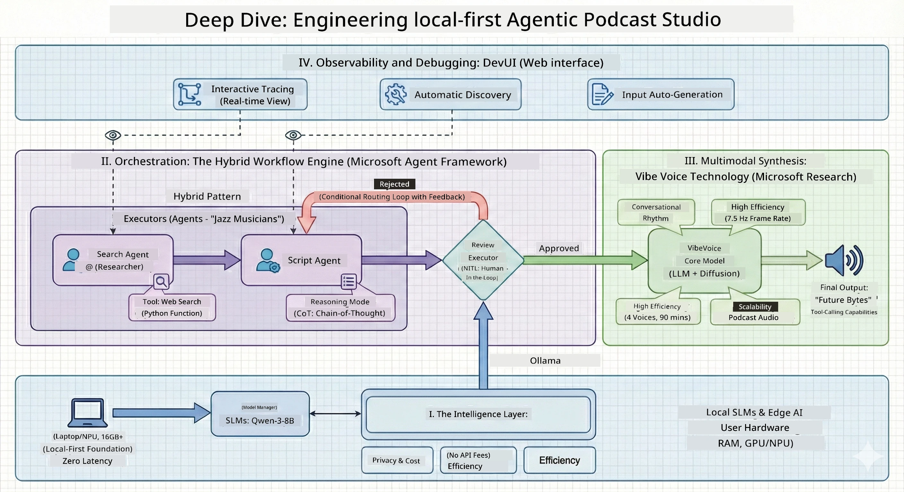

<!--
CO_OP_TRANSLATOR_METADATA:
{
  "original_hash": "f94e745264597bc5d8df967ead2eff97",
  "translation_date": "2026-01-05T11:01:31+00:00",
  "source_file": "WorkshopForAgentic/README.md",
  "language_code": "pcm"
}
-->
# 🎙️ Di AI Podcast Studio Workshop

> 🌏 [中文版 (Chinese Version)](translation/zh-cn/README.md)


## Your Mission

Welcome to **Di AI Podcast Studio**! You go soon start your own tech podcast wey dem dey call "Future Bytes" — but di gbege be say: you go build AI-powered production team wey go help you create am. No more wahala of endless hours of research, scriptwriting, and audio editing. E be like say you go code your way become podcast producer with AI superpowers.

## Di Story

Imagine dis one: You and your friends wan start podcast about di coolest tech trends, but everybody dey busy with school, work, or just life. How e go be if you fit build team of AI agents to carry all di heavy work? One agent go dey research topics, another go dey write beta scripts, and one go turn text into natural-sounding talk. E dey sound like sci-fi? Make we make am real.

## Wetin You Go Learn

By di end of dis workshop, you go sabi how to:
- 🤖 Deploy your own local AI model (no API cost, no need cloud!)
- 🔧 Build specialized AI agents wey go sabi work together
- 🎬 Create complete podcast production pipeline from idea go reach audio

## Your Journey: Three Acts



Like any correct story, we get three acts. Each one go build your AI podcast studio piece by piece:

| Episode | Your Quest | Wetin Dey Happen | Skills Unlocked |
|---------|-----------|------------------|-----------------|
| **Act 1** | [Meet Your AI Assistants](md/01.BuildAIAgentWithSLM.md) | You go discover how to create AI agents wey fit chat, search web, and even solve problem. Dem go be like your research interns wey no dey sleep. | 🎯 Build your first agent<br>🛠️ Give am superpowers (tools!)<br>🧠 Teach am to reason<br>🌐 Connect am to internet |
| **Act 2** | [Assemble Your Production Team](md/02.AIAgentOrchestrationAndWorkflows.md) | Now e go dey interesting! You go orchestrate plenty AI agents to work together like real podcast team. One go dey research, one go dey write, you go dey approve — teamwork go make beta result. | 🎭 Coordinate multiple agents<br>🔄 Build approval workflows<br>🖥️ Test with DevUI interface<br>✋ Keep humans inside control |
| **Act 3** | [Bring Your Podcast to Life](md/03.Multi-SpeakerPodcastGenerationWithVibeVoice.md) | Di finale! Transform your text scripts into real podcast audio with voices wey dey realistic and natural talks. Your "Future Bytes" podcast don ready to drop! | 🎤 Text-to-speech magic<br>👥 Multiple speaker voices<br>⏱️ Long-form audio<br>🚀 Full automation |

Each act go unlock new powers. You fit jump waka if you dey gbadun, but we recommend say make you follow di story well!

## Environment Requirements

Dis workshop fit run on different hardware environments:
- **CPU**: Good for testing and small-scale use
- **GPU**: Beta for production environments, e make inference speed plenty faster
- **NPU**: Support next-gen neural processing unit acceleration

## Wetin You Go Need

### Software Checklist ✅
- **Python 3.10+** (Your coding language)
- **Ollama** (Runs AI models for your machine)
- **VS Code** (Your code editor)
- **Python Extension** (Make VS Code sabi beta)
- **Git** (For to grab code)

### Hardware Check 💻
- **Fit I run am?**: 8GB RAM, 10GB free space (e fit work, but e fit slow)
- **Ideal setup**: 16GB+ RAM, beta GPU (yer smooth!)
- **You get NPU?**: Even beta! Next-gen performance unlocked 🚀

## Setup Your Studio 🎬

### Step 1: Python Power-Up

Make sure say you get Python 3.10 or newer:

```bash
python --version
# E suppose show Python 3.10.x or pass dat one
```

No Python? Grab am from [python.org](https://python.org) — e free!

### Step 2: Get Ollama (Your AI Model Runner)

Go [ollama.ai](https://ollama.ai) download Ollama for your OS. Think am as di engine wey dey run your AI models local.

Check if e ready:

```bash
ollama --version
```

### Step 3: Download Your AI Brain 🧠

Time to grab Qwen-3-8B model (e be like to hire your first AI assistant):

```bash
ollama pull qwen3:8b
```

*Dis one fit take few minutes. Perfect time for coffee break! ☕*

### Step 4: Set Up VS Code

Go grab [Visual Studio Code](https://code.visualstudio.com/) if you never get am. E be best code editor (fight me 😄).

### Step 5: Python Extension

For VS Code:
1. Hit `Ctrl+Shift+X` (or `Cmd+Shift+X` for Mac)
2. Search "Python"
3. Install official Microsoft Python extension

### Step 6: You Don Ready! 🎉

Serious, you don ready to run am. Make we start build some AI palava!

### Step 7: Install Microsoft Agent Framework and Related Packages 📦

Install all dependencies wey dis workshop need:

```bash
pip install -r ./Installations/requirements.txt -U
```

*Dis one go install Microsoft Agent Framework plus all necessary packages. Grab coffee — first-time setup fit take small time! ☕*

## Workshop Instructions

We go explain detailed project structure, config steps, plus how to run am step-by-step during workshop.

## Troubleshooting (When Palava Show) 🔧

### "E be like model download dey take too long!"
**Fix**: Use VPN or configure Ollama with mirror source. Sometimes internet just dey play us.

### "My computer dey slow! E no get memory!"
**Fix**: Use smaller model or adjust `num_ctx` setting to use less memory. E be like put your AI for diet.

### "Fit I run am faster with my GPU?"
**Fix**: Ollama dey auto-detect GPU! Just make sure your GPU driver straight. Free speed boost! 🏎️

## Extra Resources (For Curious People) 📚

- [Ollama Docs](https://github.com/ollama/ollama) — Deep dive into local AI models
- [Microsoft Agent Framework](https://microsoft.github.io/autogen/) — Learn more about building agent teams
- [Qwen Model Info](https://qwenlm.github.io/) — Meet your AI assistant brain

## License

MIT License — Build beta things, share am, make di world better! 🌍

## Want to Contribute?

You see bug? Get idea? Drop Issue or PR! We love community vibes. ✨

---

<!-- CO-OP TRANSLATOR DISCLAIMER START -->
**Disclaimer**:  
Dis document na so dem translate am wit AI translation service [Co-op Translator](https://github.com/Azure/co-op-translator). Even though we try make e correct well, abeg sabi say automated translations fit get some errors or wrong tins. Di original document wey dem write for im own language na di correct source. For important matter, better make human professional translator do am. We no go take responsibility if person no understand well or if dem interpret am wrongly because of dis translation.
<!-- CO-OP TRANSLATOR DISCLAIMER END -->