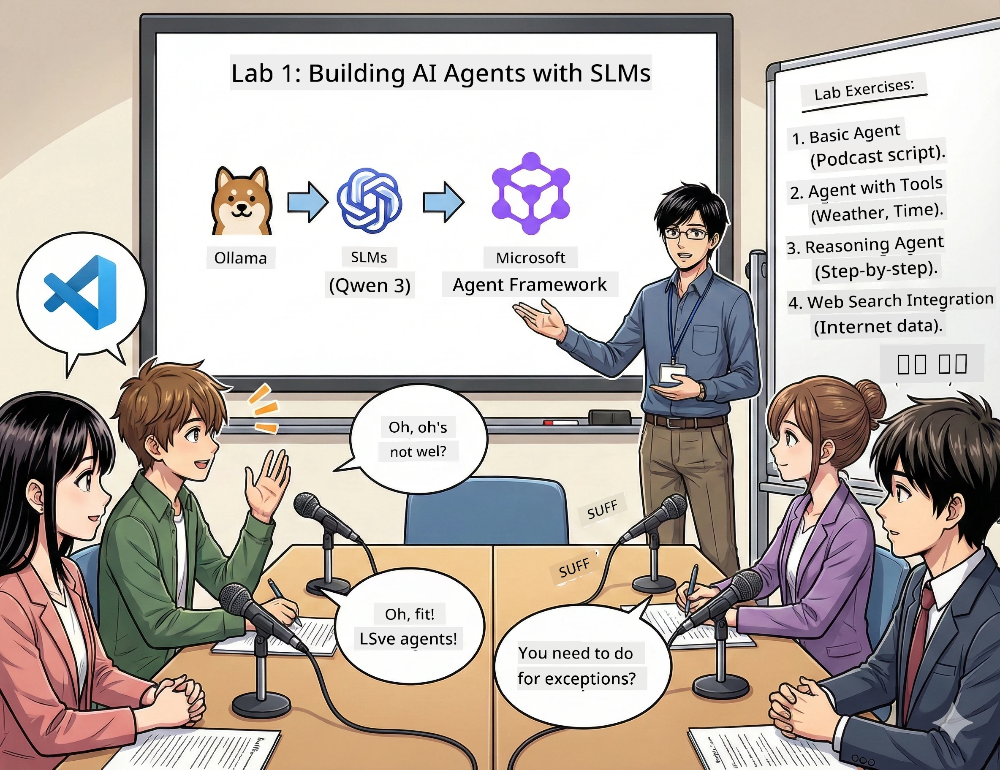

<!--
CO_OP_TRANSLATOR_METADATA:
{
  "original_hash": "7868fa418386aa7167bea3ff5ba8390b",
  "translation_date": "2026-01-05T13:28:06+00:00",
  "source_file": "WorkshopForAgentic/md/01.BuildAIAgentWithSLM.md",
  "language_code": "pcm"
}
-->
# Act 1: Meet Your AI Research Assistant 🤖

## The Challenge

You dey launch "Future Bytes," your new tech podcast. Episode 1 na about the latest AI breakthroughs, but you get 24 hours to:
1. Research the topic
2. Find credible sources
3. Write a compelling script
4. Make am sound natural

**Plot twist**: You no gats do am alone. You go build your first AI assistant wey fit help you for all dis kain work. Make we call am Alex — your tireless research partner wey no dey need sleep.

## Why Small Language Models? (Spoiler: Dem Dey Awesome)

Think Small Language Models (SLMs) as your personal AI wey dey live for *your* computer. No cloud, no monthly fees, no sketchy data sharing.

**Why SLMs dey 🔥:**
- **🏠 Runs on Your Machine**: Laptop, desktop, even one beefy Raspberry Pi
- **💸 Zero Ongoing Costs**: No API fees wey go chop your money
- **🔒 Privacy First**: Your data no go leave your device
- **⚡ Lightning Fast**: No internet lag, instant response
- **🪦 Lightweight**: 1B-10B parameters vs 100B+ wey big guys get

**Popular SLMs**: Qwen 3, Phi-4, Gemma 3 (we dey use Qwen for dis workshop)

## Your Toolkit

### Ollama: Your AI Model Manager

[Ollama](https://ollama.com/) na like Steam for AI models. You go download, run, and manage models with simple commands.

**Wetin make am cool:**
- One command to download plus run any model
- E dey work for Mac, Windows, Linux
- E automatically dey use your GPU if you get am
- Super memory-efficient

### Microsoft Agent Framework: Where the Magic Happens

[Microsoft Agent Framework](https://github.com/microsoft/agent-framework) na your playground for building AI agents wey fit:

- 💬 Chat and remember wetin una talk
- 🛠️ Use custom tools (like searching the web or to check weather)
- 🧠 Think through complex problems step-by-step
- 🤝 Work with other agents as team
- 🔌 Connect to different AI providers (OpenAI, Ollama, Azure)

**The Building Blocks:**
- **Agents**: Your AI assistants wey get special jobs
- **Tools**: Special abilities wey you give dem
- **Memory**: So dem no go forget your conversation
- **Reasoning**: Teach dem to think, no be just to respond

## Your Training Montage: 4 Missions

### Mission 1: Create Your First Agent

📓 [Open Notebook](../code/01.BasicAgent/00.BasicAgent-agent.ipynb)

**The Quest**: Build Alex, your podcast scriptwriter AI. Alex go need to generate dialogue between two hosts wey dey discuss tech topics.

**Wetin You Go Learn**:
- How to wake up AI agent (e easy pass to wake on Monday)
- Give am personality and instructions
- Make am generate real podcast scripts
- Understand wetin e dey yan back to you

**Victory Condition**: Alex go create script for your "Future Bytes" pilot episode about AI! 🎯

### Mission 2: Give Alex Superpowers (Tools!)

📓 [Open Notebook](../code/01.BasicAgent/01.BasicAgent-tools.ipynb)

**The Quest**: Alex smart, but e no sabi today weather or wetin time be. Make we fix am by giving am tools!

**Wetin You Go Learn**:
- Create custom Python functions as "tools"
- Make Alex decide *when* to use which tool
- Watch am solve problems on him own
- Combine plenty tools to solve tough tasks

**Victory Condition**: Ask "Wet weather dey Tokyo?" and Alex go find am alone! ☁️

### Mission 3: Teach Alex to Think

📓 [Open Notebook](../code/01.BasicAgent/02.BasicAgent-reasoning.ipynb)

**The Quest**: Make Alex show how e dey work. When e dey solve problems, you go fit see *how* e think, no be only the answer.

**Wetin You Go Learn**:
- Activate "reasoning mode" (na like showing your work for math class)
- See Alex step-by-step thought process
- Understand chain-of-thought prompting
- Debug when Alex lost brain

**Victory Condition**: Ask tricky math question and watch Alex reason am well! 🧠

### Mission 4: Connect Alex to the Internet

📓 [Open Notebook](../code/01.BasicAgent/03.BasicAgent-websearch.ipynb)

**The Quest**: Alex knowledge get cutoff date. Make we connect am to web for real-time info!

**Wetin You Go Learn**:
- Build custom web search tool
- Integrate external APIs
- Handle network wahala gently
- Get info wey pass Alex training data

**Victory Condition**: Ask about today tech news and get fresh results! 📰

## Before You Start 🚀

**Required Gear**:
- Python 3.10+ installed
- Ollama dey run (check with `ollama --version`)
- VS Code with Python extension
- At least 8GB RAM (16GB if you want smooth vibes)

## Mission Order

Follow notebooks for order for full story:

1. [00.BasicAgent-agent.ipynb](../code/01.BasicAgent/00.BasicAgent-agent.ipynb) — Meet Alex (your first agent)
2. [01.BasicAgent-tools.ipynb](../code/01.BasicAgent/01.BasicAgent-tools.ipynb) — Power-up time!
3. [02.BasicAgent-reasoning.ipynb](../code/01.BasicAgent/02.BasicAgent-reasoning.ipynb) — Teach Alex to think
4. [03.BasicAgent-websearch.ipynb](../code/01.BasicAgent/03.BasicAgent-websearch.ipynb) — Internet access unlocked!

## Wetin You Go Master

After Act 1, you go fit:

- ✅ Run AI models for your own hardware (no cloud needed!)
- ✅ Build agents wey get custom personalities and skills
- ✅ Give agents tools to solve real-world problem
- ✅ Make agents show how dem reason
- ✅ Connect agents to external data sources
- ✅ Debug when things waka anyhow

## When Things Break (And How to Fix Them) 🔧

### "Alex no dey load! Memory don finish!"
**The Fix**: Your computer dey struggle. Try close other apps, or use smaller model. 8GB RAM na bare minimum.

### "Alex slow no be small"
**The Fix**: Enable GPU acceleration for Ollama settings. Or reduce context window size. Speed demon mode activated! 🏎️

### "Tools no dey work!"
**The Fix**: Double-check your function signatures. Alex need correct type hints to understand wetin tool dey do. E be like give clear instructions.

## Helpful Links 🔗

- [Agent Framework Docs](https://github.com/microsoft/agent-framework) — Official guides and examples
- [Ollama Model Library](https://ollama.com/library) — Browse all available models
- [Qwen Model](https://ollama.com/library/qwen3) — Meet your AI brain
- [Code Examples](https://github.com/microsoft/agent-framework/tree/main/python/samples) — Steal ideas from here

## Next Up: Act 2 🎬

You get one agent. But if you get *team* of agents wey dey work together? For Act 2, you go build your full podcast production crew:
- **Researcher Agent**: Finds best sources
- **Writer Agent**: Crafts perfect script  
- **Editor (You!)**: Approves or request changes

Make we run some AI magic! → [Act 2: Assemble Your Production Team](02.AIAgentOrchestrationAndWorkflows.md)

---

**Stuck?** Ask question during workshop. We all dey learn together! 🙌

---

<!-- CO-OP TRANSLATOR DISCLAIMER START -->
**Disclaimer**:
Dis document na wahala wit AI translation service [Co-op Translator](https://github.com/Azure/co-op-translator) make am. Even though we try to make am correct, make you sabi say automated translation fit get some mistake or no too correct. Original document wey dem write for e native language na di real and correct one. If na serious info you want, better make human professional translate am. We no go responsible if anybody con get wahala or wrong understanding from dis translation.
<!-- CO-OP TRANSLATOR DISCLAIMER END -->