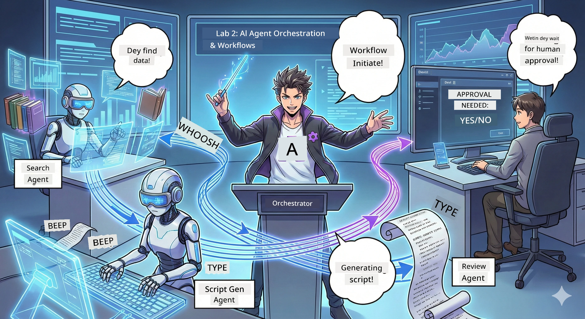

# Act 2: Assemble Your Podcast Production Team 🎬



## The Plot Thickens

Alex (your AI assistant from Act 1) na cool guy, but one pipo no fit run whole podcast studio. You need *team*:
- 🔍 **Research Agent**: Dey find fresh info for internet
- ✍️ **Script Agent**: Dey change research to interesting talk
- 👤 **You (The Editor)**: Dey approve script or send am back to correct

Welcome to **AI Agent Orchestration** — na where you be director for your own AI team. Think Avengers, but for podcast production.

## What's Agent Orchestration? (The Simple Version)

Imagine say you dey run restaurant. You no dey do everything by yourself, abi? You get:
- 🍳 One chef wey dey cook
- 👨‍🍳 One sous chef wey dey prepare
- 👩‍🍳 One server wey dey deliver

Agent orchestration na the same thing, but na AI. Each agent get im specialty, and you dey organize them to achieve big goals. No single agent go tire, and work go quick.

### The Band Analogy 🎸

Your AI agents be like band:
- **Lead singer**: Main agent wey dey do customer-facing work
- **Drummer**: Dey keep rhythm, dey manage background work  
- **Bass player**: Dey support everybody, dey fetch data
- **You (Band Manager)**: Dey coordinate all of them!

If no get coordination? Na noise be dat. But with orchestration? Na sweet music.

### Why This Matters

One AI agent wey wan do everything = burnout. Agents wey specialize dey work together = work dey go fast! 🚀

**Real Talk**: You remember wen you try do research, write script, AND edit podcast by yourself? E bad die. With orchestration, each agent dey do wetin im sabi well. You just make final decision.

**Real-World Example**: Customer support bots wey sabi when dem go handle billing, tech issues, or when to call human. Na orchestration be dat!

## Agent vs. Workflow: What's the Difference?

Think am like dis:

### 🤖 AI Agent = Jazz Musician
- **Dey make quick decisions** based on wetin e hear
- **Dey improvise** solutions using im tools
- **Dey think** with LLM brain
- **Dey adapt** to anything wey you throw at am

### 🎵 Workflow = Orchestra Playing Classical Music  
- **Follows score** (steps wey dem set before)
- **Predictable** way e dey run things
- **Dey coordinate** many agents, humans, systems
- **Structured** like recipe

**The Magic**: Workflows *orchestrate* agents! You go build workflow wey go tell agents when dem go do their part. Na best of both worlds. 🎭

## Three Ways to Coordinate Your AI Crew

### 1. 🎯 Centralized (You be Boss)

One main agent dey control everything. Like say you dey manage team — you dey decide who go do wetin and wen.

**Pros**:
- ✅ Clear leadership (no confusion)
- ✅ Decisions dey consistent
- ✅ Easy to debug

**Use am for**:
- Customer service routing ("Na billing or tech support?")
- Content approval workflows ("This script make sense?")
- Podcast production (wetin we dey build now!)

### 2. 🤝 Decentralized (Agents Self-Organize)

Agents dey talk to each other direct and figure out things as group. Like group chat where everybody dey coordinate.

**Pros**:
- ✅ E fit expand well (add more agents anytime)
- ✅ No one agent go spoil everything
- ✅ Agents dey work together naturally

**Use am for**:
- Research teams (each agent dey check different source)
- Brainstorming sessions
- Distributed problem-solving

### 3. 🔀 Hybrid (Best of Both Worlds)

You dey control overall direction, but agents get freedom to self-organize for tasks. Like CEO wey believe im team.

**Perfect for**: Projects wey complex, need control and flexibility.

## Microsoft Agent Framework: Your Orchestration Toolkit 🧰

Time to build! Na wetin you go use:

### The Building Blocks

#### 1. 🧱 Executors (Your Workers)
- **Wetin dem be**: Individual processing units — fit be agents or custom logic
- **Wetin dem dey do**: Take input, do work, produce output
- **Think am like**: Stations inside assembly line

#### 2. ➡️ Edges (The Connections)
- **Wetin dem be**: Paths between executors
- **Wetin dem dey do**: Control message flow ("After A, go B")
- **Think am like**: Arrows for flowchart

#### 3. 🗺️ Workflows (The Master Plan)
- **Wetin dem be**: Complete graph of executors + edges
- **Wetin dem dey do**: Define full process from start to finish
- **Think am like**: Blueprint for your production pipeline

### Cool Features You'll Love

**🛡️ Type Safety**: Messages between agents dey type-checked. No "Oops, wrong data type" wahala.

**🔀 Flexible Routing**: 
- If-then conditions ("If approved, publish; else, rewrite")
- Parallel processing (many agents dey work same time)
- Dynamic paths (workflow go adjust based on result)

**🔌 External Integration**:
- Connect to APIs
- Add human-in-the-loop checkpoints (you go approve before publishing)
- Build request/response flows

**💾 Checkpointing**: Save progress well-well! If something crash, you fit continue from where e stop.

**🤝 Multi-Agent Coordination**:
- Run agents one-after-anoda (A → B → C)
- Run them all at once (A + B + C)
- Pass work from one agent to anoda
- Work collaborate well

## Best Practices (Pro Tips) 🎯

### 1. Keep It Modular
Make sure each agent dey do ONE thing well. No try make mega "super agent" wey dey do everything — you go regret am when debugging.

### 2. Plan for Failures
Agents fit do error. Network fit fail. Get backup plan and error handling. Your future self go thank you.

### 3. Monitor Everything
Check wetin your agents dey do. Use DevUI (we go talk about am!) to see workflows dey move.

### 4. Optimize Message Size
No dey send big big files between agents. Make messages small small for speed.

### 5. Choose the Right Pattern
Need control? Use centralized. Need scale? Use decentralized. No sure? Use hybrid!

## DevUI: Your Workflow Debugger 🔍

### What's DevUI?

DevUI na playground for testing your agents and workflows. Na web interface wey you fit:
- 👀 Watch your workflow dey run
- 💬 Chat with agents direct
- 🔍 Debug if anything wrong
- 📊 See traces and performance data

> **Important**: DevUI na for development only! No use am for production. Na like your local test environment.

### What Makes It Awesome

- **🖥️ Interactive Web UI**: Click, type, test — no command line needed
- **📁 Drag-and-Drop Ready**: Upload files, test with different input
- **📂 Auto-Discovery**: Point am to folder, e go find all your agents automatically
- **📋 No-Setup Mode**: Register agents in code, no need folder structure
- **🔌 OpenAI Compatible**: Work with OpenAI SDK (compatibility FTW!)
- **👁️ Tracing Built-in**: See wetin your agents dey do exactly

### How Input Works

DevUI sabi inputs well:

- **Testing Agents?** You go get text boxes and file upload buttons
- **Testing Workflows?** UI go make input fields based on wetin your workflow want

Na like magic, but na good code. ✨

## Your Missions: Build a Podcast Studio 🎬

### Mission 1: Create a Single Agent with DevUI

📂 [01.AgentDevUI](../../../../WorkshopForAgentic/code/02.Workflow/01.AgentDevUI)

**The Challenge**: Before we build full team, make we test DevUI with one agent: web search specialist.

**Wetin You Go Build**:
Research agent wey fit search internet for podcast topics. You go test am for DevUI web interface for `http://localhost:8090`.

**Skills You Go Learn**:
- 🚀 How to launch agents in DevUI
- 🔍 How to test agent responses real-time
- 🛠️ How to build custom tools (web search)
- 📊 How to enable tracing to debug wahala
- 🖥️ How to use interactive web UI

**The Code**:
- `agent.py`: Your SearchAgent with web search power
- Use OllamaChatClient to connect Qwen
- Implement `web_search()` tool function
- Launch with `serve()` — DevUI go open automatically

**Victory Condition**: Ask your agent "Wetin dey trend for AI?" and watch am search web! 🎉

### Mission 2: Build a Multi-Agent Workflow

📂 [02.WorkflowDevUI](../../../../WorkshopForAgentic/code/02.Workflow/02.WorkflowDevUI)

**The Challenge**: Now na real fun start! Build full podcast production workflow with:
1. 🔍 **Search Agent** → Dey research your topic
2. ✍️ **Script Agent** → Dey write dialogue between two hosts (for Chinese!)
3. 👤 **Review Executor** → Dey ask YOU to approve or reject
4. 🔄 **Loop Back** → If reject, e go rewrite based on your feedback

**Skills You Go Learn**:
- 🧱 How to create specialized agents for different work
- 🔗 How to connect agents with WorkflowBuilder
- 🔀 How to implement approval loops (human-in-loop!)
- 🚦 How to do conditional routing (if approve or reject)
- 🔧 How to build custom executors for business logic

**The Workflow**:
```
SearchAgent → ScriptAgent → ReviewExecutor
                             ↑          ↓ (if rejected)
                             ←─────────
```

**The Code**:
- `search_agent/agent.py`: Your research expert
- `generate_script_agent/agent.py`: Your scriptwriter (write for Chinese!)
- `workflow/workflow.py`: The orchestration magic dey here
- `main.py`: Launch everything for DevUI

**Victory Condition**: Give topic, review script, reject once for test loop, then approve! 🎉

### Mission 3: Build a Console App

📂 [03.Application](../../../../WorkshopForAgentic/code/02.Workflow/03.Application)

**The Challenge**: Carry your workflow from DevUI come make smooth terminal app with colored outputs, loading spinners, and file saving. This one ready for production!

**Skills You Go Learn**:
- ⚡ How to run workflows programmatically (no DevUI)
- 📡 Event-driven architecture with streaming
- 🎨 How to create fine terminal UI (colors, spinners, progress bars)
- 💾 How to save final scripts to files
- 🔄 How to manage async workflows with Python asyncio

**How E Dey Work**:
1. E go ask you for podcast topic
2. E go show progress live ("Search Agent dey work...")
3. E go display generated script with colors
4. E go ask for your approval
5. E go save approved script to `podcast.txt`

**The Code**:
- `podcast_app.py`: Your main app wey handle events
- `workflow.py`: Reuse workflow from Mission 2
- Handle events: `AgentRunUpdateEvent`, `RequestInfoEvent`, `WorkflowOutputEvent`
- Use ANSI colors for terminal style

**Victory Condition**: Run app, build podcast script, see am save! You don build real tool. 🚀

## What You Don Master 🏆

After Act 2, you fit:

- ✅ Orchestrate many AI agents like boss
- ✅ Build workflows with steps AND conditions
- ✅ Add human approval checkpoints
- ✅ Use DevUI to test and debug workflows
- ✅ Create production-ready console apps
- ✅ Manage errors well for complex system
- ✅ Choose correct orchestration style for any project

## When Things Break 🔧

### "My workflow too complicated!"
**How to Fix am**: Break am small small sub-workflows. Each workflow suppose do ONE thing well. Chain dem if need.

### "I no fit track wetin dey happen!"
**How to Fix am**: Use workflow checkpointing to save status. Turn on tracing inside DevUI to see every step.

### "One agent error spoil everything!"
**How to Fix am**: Add error boundaries. Each agent go handle im own problem and get fallback.

### "E dey slow die"
**How to Fix am**: Any agents fit run parallel? Sequential workflows easy but slow. Find chance to do parallel!

## Helpful Resources 🔗

- [Workflow Docs](https://learn.microsoft.com/en-us/agent-framework/user-guide/workflows/overview) — Official Microsoft guides
- [Orchestration Patterns](https://www.ibm.com/think/topics/ai-agent-orchestration) — IBM take on am
- [Agent Framework GitHub](https://github.com/microsoft/agent-framework) — Check the source code

- [Code Examples](https://github.com/microsoft/agent-framework/tree/main/python/samples) — Steal pattern dem from here

---

**Ready for di finale?** You don get your script. Now make we turn am to real audio! → [Act 3: Bring Your Podcast to Life](03.Multi-SpeakerPodcastGenerationWithVibeVoice.md) 🎤

---

**Stuck? Confused? Excited?** Make you share for di workshop chat! We dey learn together. 🚀

---

<!-- CO-OP TRANSLATOR DISCLAIMER START -->
**Disclaimer**:
Dis kain document na to say AI translation service [Co-op Translator](https://github.com/Azure/co-op-translator) translate am. Even though we dey try make am correct, abeg make you sabi say automated translation fit get some mistake or no too correct. Di original document wey dem write for im original language na di correct one wey you suppose use. If na serious mata, na better person wey sabi translate well you go better use. We no go take any blame if anybody misunderstand or miss-interpret anything for dis translation.
<!-- CO-OP TRANSLATOR DISCLAIMER END -->