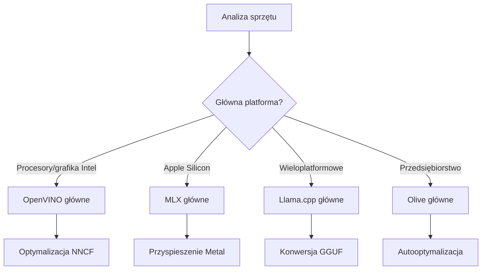
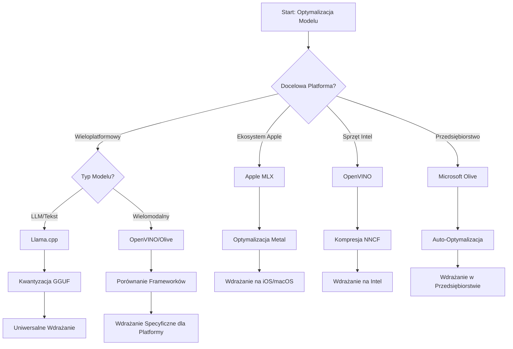
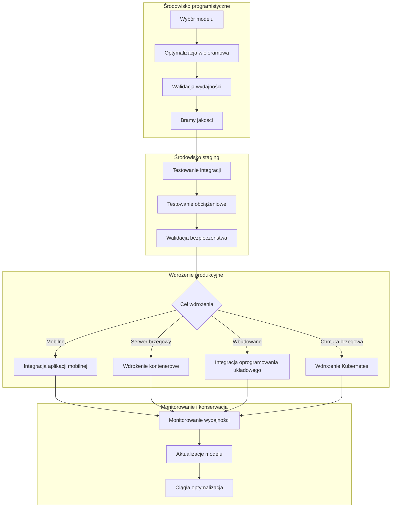

# Sekcja 6: Synteza Workflow Rozwoju Edge AI

## Spis treści
1. [Wprowadzenie](#wprowadzenie)
2. [Cele nauczania](#cele-nauczania)
3. [Przegląd zintegrowanego workflow](#przegląd-zintegrowanego-workflow)
4. [Macierz wyboru frameworka](#macierz-wyboru-frameworka)
5. [Synteza najlepszych praktyk](#synteza-najlepszych-praktyk)
6. [Przewodnik po strategii wdrożeniowej](#przewodnik-po-strategii-wdrożeniowej)
7. [Workflow optymalizacji wydajności](#workflow-optymalizacji-wydajności)
8. [Lista kontrolna gotowości produkcyjnej](#lista-kontrolna-gotowości-produkcyjnej)
9. [Rozwiązywanie problemów i monitoring](#rozwiązywanie-problemów-i-monitoring)
10. [Zabezpieczenie przyszłości Twojego pipeline'u Edge AI](#zabezpieczanie-przyszłości-twojego-pipelineu-edge-ai)

## Wprowadzenie

Rozwój Edge AI wymaga zaawansowanego zrozumienia wielu frameworków optymalizacyjnych, strategii wdrożeniowych i aspektów sprzętowych. Niniejsza kompleksowa synteza łączy wiedzę z Llama.cpp, Microsoft Olive, OpenVINO i Apple MLX, tworząc zintegrowany workflow maksymalizujący efektywność, zachowujący jakość i zapewniający sukces wdrożenia produkcyjnego.

W trakcie tego kursu zgłębiliśmy poszczególne frameworki optymalizacyjne, każdy z unikalnymi mocnymi stronami i specjalistycznymi zastosowaniami. Jednak w realnych projektach Edge AI często konieczne jest łączenie technik z różnych frameworków lub podejmowanie strategicznych decyzji, które podejścia przyniosą najlepsze rezultaty dla określonych ograniczeń i wymagań.

Ta sekcja syntetyzuje zbiorową wiedzę ze wszystkich frameworków w postaci wykonalnych workflow, drzew decyzyjnych i najlepszych praktyk, umożliwiających efektywne i skuteczne budowanie rozwiązań Edge AI gotowych do produkcji. Niezależnie od tego, czy optymalizujesz dla urządzeń mobilnych, systemów wbudowanych czy serwerów edge, ten przewodnik dostarcza strategiczne ramy do podejmowania świadomych decyzji przez cały cykl życia rozwoju.

## Cele nauczania

Po ukończeniu tej sekcji będziesz potrafił:

### Podejmowanie decyzji strategicznych
- **Ocenić i wybrać** optymalny framework optymalizacyjny na podstawie wymagań projektu, ograniczeń sprzętowych i scenariuszy wdrożeniowych
- **Projektować kompleksowe workflow** integrujące wiele technik optymalizacji dla maksymalnej efektywności
- **Ocenić kompromisy** pomiędzy dokładnością modelu, prędkością inferencji, użyciem pamięci i złożonością wdrożenia w różnych frameworkach

### Integracja workflow
- **Wdrożyć zunifikowane pipeline rozwojowe** wykorzystujące mocne strony wielu frameworków optymalizacji
- **Tworzyć powtarzalne workflow** dla spójnej optymalizacji i wdrożeń modeli w różnych środowiskach
- **Ustanowić bramki jakości i procesy walidacji**, aby zapewnić spełnienie wymagań produkcyjnych przez zoptymalizowane modele

### Optymalizacja wydajności
- **Stosować systematyczne strategie optymalizacji** wykorzystując kwantyzację, przycinanie i techniki przyspieszenia specyficzne dla sprzętu
- **Monitorować i przeprowadzać benchmarki** wydajności modeli na różnych poziomach optymalizacji i celach wdrożeniowych
- **Optymalizować dla konkretnych platform sprzętowych**, w tym CPU, GPU, NPU oraz wyspecjalizowanych akceleratorów edge

### Wdrożenie produkcyjne
- **Projektować skalowalne architektury wdrożeniowe** obsługujące różne formaty modeli i silniki inferencyjne
- **Wdrażać monitoring i obserwowalność** aplikacji Edge AI w środowiskach produkcyjnych
- **Ustanowić workflow konserwacji** dla aktualizacji modeli, monitorowania wydajności i optymalizacji systemu

### Doskonałość cross-platformowa
- **Wdrażać zoptymalizowane modele** na różnych platformach sprzętowych, zachowując spójną wydajność
- **Radzić sobie z optymalizacjami specyficznymi dla platform** Windows, macOS, Linux, urządzeń mobilnych i systemów wbudowanych
- **Tworzyć warstwy abstrakcji**, które umożliwiają bezproblemowe wdrażanie w różnych środowiskach edge

## Przegląd zintegrowanego workflow

### Faza 1: Analiza wymagań i wybór frameworka

Podstawą udanego wdrożenia Edge AI jest dokładna analiza wymagań, która prowadzi do wyboru frameworka i strategii optymalizacyjnej.

#### 1.1 Ocena sprzętu


**Kluczowe aspekty:**
- **Architektura CPU**: x86, ARM, możliwości Apple Silicon
- **Dostępność akceleratorów**: GPU, NPU, VPU, specjalistyczne chipy AI
- **Ograniczenia pamięci**: ograniczenia RAM, pojemność magazynu
- **Budżet mocy**: czas pracy na baterii, ograniczenia termiczne
- **Łączność**: wymagania offline, ograniczenia przepustowości

#### 1.2 Macierz wymagań aplikacji

| Wymaganie | Llama.cpp | Microsoft Olive | OpenVINO | Apple MLX |
|-------------|-----------|-----------------|----------|-----------|
| Cross-platform | ✅ Doskonały | ⚡ Dobry | ⚡ Dobry | ❌ Tylko Apple |
| Integracja korporacyjna | ⚡ Podstawowy | ✅ Doskonały | ✅ Doskonały | ⚡ Ograniczony |
| Wdrożenie mobilne | ✅ Doskonały | ⚡ Dobry | ⚡ Dobry | ✅ iOS Doskonały |
| Inferencja w czasie rzeczywistym | ✅ Doskonały | ✅ Doskonały | ✅ Doskonały | ✅ Doskonały |
| Różnorodność modeli | ✅ Skupienie na LLM | ✅ Wszystkie modele | ✅ Wszystkie modele | ✅ Skupienie na LLM |
| Łatwość użycia | ✅ Prosty | ✅ Zautomatyzowany | ⚡ Umiarkowany | ✅ Prosty |

### Faza 2: Przygotowanie i optymalizacja modelu

#### 2.1 Uniwersalny pipeline oceny modelu

```python
# Uniwersalne Ramy Oceny Modelu
class EdgeAIModelAssessment:
    def __init__(self, model_path, target_hardware):
        self.model_path = model_path
        self.target_hardware = target_hardware
        self.optimization_frameworks = []
        
    def assess_model_characteristics(self):
        """Analyze model size, architecture, and complexity"""
        return {
            'model_size': self.get_model_size(),
            'parameter_count': self.get_parameter_count(),
            'architecture_type': self.detect_architecture(),
            'quantization_compatibility': self.check_quantization_support()
        }
    
    def recommend_optimization_strategy(self):
        """Recommend optimal frameworks and techniques"""
        characteristics = self.assess_model_characteristics()
        
        if self.target_hardware.startswith('apple'):
            return self.mlx_optimization_strategy(characteristics)
        elif self.target_hardware.startswith('intel'):
            return self.openvino_optimization_strategy(characteristics)
        elif characteristics['model_size'] > 7_000_000_000:  # Ponad 7 miliardów parametrów
            return self.enterprise_optimization_strategy(characteristics)
        else:
            return self.lightweight_optimization_strategy(characteristics)
```

#### 2.2 Multi-frameworkowy pipeline optymalizacji

**Sekwencyjne podejście do optymalizacji:**
1. **Początkowa konwersja**: konwersja do formatu pośredniego (ONNX, jeśli możliwe)
2. **Optymalizacja specyficzna dla frameworka**: zastosowanie technik specjalistycznych
3. **Walidacja krzyżowa**: weryfikacja wydajności na platformach docelowych
4. **Końcowe pakowanie**: przygotowanie do wdrożenia

```bash
# Skrypt optymalizacji wieloplatformowej
#!/bin/bash

MODEL_NAME="phi-3-mini"
BASE_MODEL="microsoft/Phi-3-mini-4k-instruct"

# Faza 1: Konwersja ONNX (Uniwersalna)
python convert_to_onnx.py --model $BASE_MODEL --output models/onnx/

# Faza 2: Optymalizacja specyficzna dla platformy
if [[ "$TARGET_PLATFORM" == "intel" ]]; then
    # Optymalizacja OpenVINO
    python optimize_openvino.py --input models/onnx/ --output models/openvino/
elif [[ "$TARGET_PLATFORM" == "apple" ]]; then
    # Optymalizacja MLX
    python optimize_mlx.py --input $BASE_MODEL --output models/mlx/
elif [[ "$TARGET_PLATFORM" == "cross" ]]; then
    # Optymalizacja Llama.cpp
    python convert_to_gguf.py --input models/onnx/ --output models/gguf/
fi

# Faza 3: Walidacja
python validate_optimization.py --original $BASE_MODEL --optimized models/$TARGET_PLATFORM/
```

### Faza 3: Walidacja wydajności i benchmarki

#### 3.1 Kompleksowy framework benchmarkowy

```python
class EdgeAIBenchmark:
    def __init__(self, optimized_models):
        self.models = optimized_models
        self.metrics = {
            'inference_time': [],
            'memory_usage': [],
            'accuracy_score': [],
            'throughput': [],
            'energy_consumption': []
        }
    
    def run_comprehensive_benchmark(self):
        """Execute standardized benchmarks across all optimized models"""
        test_inputs = self.generate_test_inputs()
        
        for model_framework, model_path in self.models.items():
            print(f"Benchmarking {model_framework}...")
            
            # Testowanie latencji
            latency = self.measure_inference_latency(model_path, test_inputs)
            
            # Profilowanie pamięci
            memory = self.profile_memory_usage(model_path)
            
            # Walidacja dokładności
            accuracy = self.validate_model_accuracy(model_path, test_inputs)
            
            # Analiza przepustowości
            throughput = self.measure_throughput(model_path)
            
            self.record_metrics(model_framework, latency, memory, accuracy, throughput)
    
    def generate_optimization_report(self):
        """Create comprehensive comparison report"""
        report = {
            'recommendations': self.analyze_performance_trade_offs(),
            'deployment_guidance': self.generate_deployment_recommendations(),
            'monitoring_requirements': self.define_monitoring_metrics()
        }
        return report
```

## Macierz wyboru frameworka

### Drzewo decyzyjne wyboru frameworka



### Kompleksowe kryteria wyboru

#### 1. Dopasowanie do głównego zastosowania

**Duże modele językowe (LLM):**
- **Llama.cpp**: najlepszy do wdrożeń cross-platform z CPU
- **Apple MLX**: optymalny dla Apple Silicon z zunifikowaną pamięcią
- **OpenVINO**: doskonały dla sprzętu Intela z optymalizacją NNCF
- **Microsoft Olive**: idealny do workflow korporacyjnych z automatyzacją

**Modele multimodalne:**
- **OpenVINO**: kompleksowe wsparcie dla wizji, audio i tekstu
- **Microsoft Olive**: korporacyjna optymalizacja dla złożonych pipeline'ów
- **Llama.cpp**: ograniczone do modeli tekstowych
- **Apple MLX**: rosnące wsparcie dla aplikacji multimodalnych

#### 2. Macierz platform sprzętowych

| Platforma | Główny framework | Opcja wtórna | Specjalistyczne funkcje |
|----------|------------------|------------------|---------------------|
| CPU/GPU Intel | OpenVINO | Microsoft Olive | Kompresja NNCF, optymalizacja Intel |
| GPU NVIDIA | Microsoft Olive | OpenVINO | Przyspieszenie CUDA, funkcje korporacyjne |
| Apple Silicon | Apple MLX | Llama.cpp | Shadery Metal, zunifikowana pamięć |
| ARM mobilne | Llama.cpp | OpenVINO | Cross-platform, minimalne zależności |
| Edge TPU | OpenVINO | Microsoft Olive | Wsparcie akceleratorów specjalistycznych |
| Wbudowane ARM | Llama.cpp | OpenVINO | Minimalny ślad pamięci, efektywna inferencja |

#### 3. Preferencje workflow rozwojowego

**Szybkie prototypowanie:**
1. **Llama.cpp**: najszybsza konfiguracja, natychmiastowe wyniki
2. **Apple MLX**: prosty API w Pythonie, szybka iteracja
3. **Microsoft Olive**: automatyczna optymalizacja, minimalna konfiguracja
4. **OpenVINO**: bardziej skomplikowana konfiguracja, obszerne funkcje

**Produkcja korporacyjna:**
1. **Microsoft Olive**: funkcje korporacyjne, integracja z Azure
2. **OpenVINO**: ekosystem Intela, kompleksowe narzędzia
3. **Apple MLX**: aplikacje korporacyjne specyficzne dla Apple
4. **Llama.cpp**: proste wdrożenie, ograniczone funkcje korporacyjne

## Synteza najlepszych praktyk

### Uniwersalne zasady optymalizacji

#### 1. Strategie optymalizacji progresywnej

```python
class ProgressiveOptimization:
    def __init__(self, base_model):
        self.base_model = base_model
        self.optimization_stages = [
            'baseline_measurement',
            'format_conversion',
            'quantization_optimization',
            'hardware_acceleration',
            'production_validation'
        ]
    
    def execute_progressive_optimization(self):
        """Apply optimization techniques incrementally"""
        
        # Etap 1: Pomiar bazowy
        baseline_metrics = self.measure_baseline_performance()
        
        # Etap 2: Konwersja formatu
        converted_model = self.convert_to_optimal_format()
        conversion_metrics = self.measure_performance(converted_model)
        
        # Etap 3: Kwantyzacja
        quantized_model = self.apply_quantization(converted_model)
        quantization_metrics = self.measure_performance(quantized_model)
        
        # Etap 4: Przyspieszenie sprzętowe
        accelerated_model = self.enable_hardware_acceleration(quantized_model)
        acceleration_metrics = self.measure_performance(accelerated_model)
        
        # Etap 5: Walidacja
        production_ready = self.validate_for_production(accelerated_model)
        
        return self.compile_optimization_report(
            baseline_metrics, conversion_metrics, 
            quantization_metrics, acceleration_metrics
        )
```

#### 2. Implementacja bramek jakości

**Bramki zachowania dokładności:**
- Utrzymuj >95% oryginalnej dokładności modelu
- Waliduj na reprezentatywnych zestawach testowych
- Wdrażaj testy A/B dla walidacji produkcyjnej

**Bramki poprawy wydajności:**
- Osiągaj co najmniej 2x przyspieszenie
- Zmniejsz zajętość pamięci co najmniej o 50%
- Waliduj spójność czasu inferencji

**Bramki gotowości produkcyjnej:**
- Przechodź testy obciążeniowe
- Demonstruj stabilną wydajność w czasie
- Waliduj wymogi bezpieczeństwa i prywatności

### Integracja najlepszych praktyk specyficznych dla frameworków

#### 1. Synteza strategii kwantyzacji

```python
# Ujednolicony sposób kwantyzacji
class UnifiedQuantizationStrategy:
    def __init__(self, model, target_platform):
        self.model = model
        self.platform = target_platform
        
    def select_optimal_quantization(self):
        """Choose best quantization based on platform and requirements"""
        
        if self.platform == 'apple_silicon':
            return self.mlx_quantization_strategy()
        elif self.platform == 'intel_hardware':
            return self.openvino_quantization_strategy()
        elif self.platform == 'cross_platform':
            return self.llamacpp_quantization_strategy()
        else:
            return self.olive_quantization_strategy()
    
    def mlx_quantization_strategy(self):
        """Apple MLX-specific quantization"""
        return {
            'method': 'mlx_quantize',
            'precision': 'int4',
            'group_size': 64,
            'optimization_target': 'unified_memory'
        }
    
    def openvino_quantization_strategy(self):
        """OpenVINO NNCF quantization"""
        return {
            'method': 'nncf_quantize',
            'precision': 'int8',
            'calibration_method': 'post_training',
            'optimization_target': 'intel_hardware'
        }
```

#### 2. Optymalizacja przyspieszenia sprzętowego

**Synteza optymalizacji CPU:**
- **Instrukcje SIMD**: wykorzystaj zoptymalizowane jądra w różnych frameworkach
- **Przepustowość pamięci**: optymalizuj układy danych dla efektywności cache
- **Threading**: wyważ równoległość i ograniczenia zasobów

**Najlepsze praktyki przyspieszenia GPU:**
- **Przetwarzanie wsadowe**: maksymalizuj przepustowość odpowiednimi rozmiarami batchy
- **Zarządzanie pamięcią**: optymalizuj alokację i transfery pamięci GPU
- **Precyzja**: stosuj FP16, jeśli jest wspierane dla lepszej wydajności

**Optymalizacja NPU/Wyspecjalizowanych akceleratorów:**
- **Architektura modelu**: zapewnij zgodność z możliwościami akceleratora
- **Przepływ danych**: optymalizuj pipeline wejścia/wyjścia dla efektywności
- **Strategie awaryjne**: implementuj obsługę CPU w przypadku operacji niesupportowanych

## Przewodnik po strategii wdrożeniowej

### Uniwersalna architektura wdrożeniowa



### Wzorce wdrożeniowe specyficzne dla platform

#### 1. Strategia wdrożenia mobilnego

```yaml
# Mobile Deployment Configuration
mobile_deployment:
  ios:
    framework: apple_mlx
    optimization:
      quantization: int4
      memory_mapping: true
      background_execution: limited
    packaging:
      format: mlx
      bundle_size: <50MB
      
  android:
    framework: llama_cpp
    optimization:
      quantization: q4_k_m
      threading: android_optimized
      memory_management: conservative
    packaging:
      format: gguf
      apk_size: <100MB
      
  cross_platform:
    framework: onnx_runtime
    optimization:
      quantization: int8
      execution_provider: cpu
    packaging:
      format: onnx
      shared_libraries: minimal
```

#### 2. Wdrożenie serwerów edge

```yaml
# Edge Server Deployment Configuration
edge_server:
  intel_based:
    framework: openvino
    optimization:
      quantization: int8
      acceleration: cpu_gpu_auto
      batch_processing: dynamic
    deployment:
      container: openvino_runtime
      orchestration: kubernetes
      scaling: horizontal
      
  nvidia_based:
    framework: microsoft_olive
    optimization:
      quantization: int4
      acceleration: cuda
      tensor_parallelism: true
    deployment:
      container: nvidia_triton
      orchestration: kubernetes
      scaling: gpu_aware
```

### Najlepsze praktyki konteneryzacji

```dockerfile
# Multi-Framework Edge AI Container
FROM ubuntu:22.04 as base

# Install common dependencies
RUN apt-get update && apt-get install -y \
    python3 \
    python3-pip \
    build-essential \
    cmake \
    && rm -rf /var/lib/apt/lists/*

# Framework-specific stages
FROM base as openvino
RUN pip install openvino nncf optimum[intel]

FROM base as llamacpp
RUN git clone https://github.com/ggerganov/llama.cpp.git \
    && cd llama.cpp && make LLAMA_OPENBLAS=1

FROM base as olive
RUN pip install olive-ai[auto-opt] onnxruntime-genai

# Production stage with selected framework
FROM openvino as production
COPY models/ /app/models/
COPY src/ /app/src/
WORKDIR /app

EXPOSE 8080
CMD ["python3", "src/inference_server.py"]
```

## Workflow optymalizacji wydajności

### Systematyczne strojenie wydajności

#### 1. Pipeline profilowania wydajności

```python
class EdgeAIPerformanceProfiler:
    def __init__(self, model_path, framework):
        self.model_path = model_path
        self.framework = framework
        self.profiling_results = {}
    
    def comprehensive_profiling(self):
        """Execute comprehensive performance analysis"""
        
        # Profilowanie CPU
        cpu_profile = self.profile_cpu_usage()
        
        # Profilowanie pamięci
        memory_profile = self.profile_memory_usage()
        
        # Opóźnienie wnioskowania
        latency_profile = self.profile_inference_latency()
        
        # Analiza przepustowości
        throughput_profile = self.profile_throughput()
        
        # Zużycie energii (jeśli dostępne)
        energy_profile = self.profile_energy_consumption()
        
        return self.compile_performance_report(
            cpu_profile, memory_profile, latency_profile,
            throughput_profile, energy_profile
        )
    
    def identify_bottlenecks(self):
        """Automatically identify performance bottlenecks"""
        bottlenecks = []
        
        if self.profiling_results['cpu_utilization'] > 80:
            bottlenecks.append('cpu_bound')
        
        if self.profiling_results['memory_usage'] > 90:
            bottlenecks.append('memory_bound')
        
        if self.profiling_results['inference_variance'] > 20:
            bottlenecks.append('inconsistent_performance')
        
        return self.generate_optimization_recommendations(bottlenecks)
```

#### 2. Zautomatyzowany pipeline optymalizacji

```python
class AutomatedOptimizationPipeline:
    def __init__(self, base_model, target_constraints):
        self.base_model = base_model
        self.constraints = target_constraints
        self.optimization_history = []
    
    def execute_optimization_search(self):
        """Systematically search optimization space"""
        
        optimization_candidates = [
            {'quantization': 'int8', 'pruning': 0.1},
            {'quantization': 'int4', 'pruning': 0.2},
            {'quantization': 'int8', 'acceleration': 'gpu'},
            {'quantization': 'int4', 'acceleration': 'npu'}
        ]
        
        best_configuration = None
        best_score = 0
        
        for config in optimization_candidates:
            optimized_model = self.apply_optimization(config)
            score = self.evaluate_optimization(optimized_model)
            
            if score > best_score and self.meets_constraints(optimized_model):
                best_score = score
                best_configuration = config
            
            self.optimization_history.append({
                'config': config,
                'score': score,
                'model': optimized_model
            })
        
        return best_configuration, self.optimization_history
```

### Optymalizacja wielokryterialna

#### 1. Optymalizacja Pareto dla Edge AI

```python
class ParetoOptimization:
    def __init__(self, objectives=['speed', 'accuracy', 'memory']):
        self.objectives = objectives
        self.pareto_frontier = []
    
    def find_pareto_optimal_solutions(self, optimization_results):
        """Identify Pareto-optimal configurations"""
        
        for result in optimization_results:
            is_dominated = False
            
            for frontier_point in self.pareto_frontier:
                if self.dominates(frontier_point, result):
                    is_dominated = True
                    break
            
            if not is_dominated:
                # Usuń zdominowane punkty z frontu
                self.pareto_frontier = [
                    point for point in self.pareto_frontier 
                    if not self.dominates(result, point)
                ]
                
                self.pareto_frontier.append(result)
        
        return self.pareto_frontier
    
    def recommend_configuration(self, user_preferences):
        """Recommend configuration based on user preferences"""
        
        weighted_scores = []
        for config in self.pareto_frontier:
            score = sum(
                user_preferences[obj] * config['metrics'][obj] 
                for obj in self.objectives
            )
            weighted_scores.append((score, config))
        
        return max(weighted_scores, key=lambda x: x[0])[1]
```

## Lista kontrolna gotowości produkcyjnej

### Kompleksowa walidacja produkcyjna

#### 1. Zapewnienie jakości modelu

```python
class ProductionReadinessValidator:
    def __init__(self, optimized_model, production_requirements):
        self.model = optimized_model
        self.requirements = production_requirements
        self.validation_results = {}
    
    def validate_model_quality(self):
        """Comprehensive model quality validation"""
        
        # Walidacja dokładności
        accuracy_result = self.validate_accuracy()
        
        # Walidacja wydajności
        performance_result = self.validate_performance()
        
        # Testowanie odporności
        robustness_result = self.validate_robustness()
        
        # Ocena bezpieczeństwa
        security_result = self.validate_security()
        
        # Weryfikacja zgodności
        compliance_result = self.validate_compliance()
        
        return self.compile_validation_report(
            accuracy_result, performance_result, robustness_result,
            security_result, compliance_result
        )
    
    def generate_certification_report(self):
        """Generate production certification report"""
        return {
            'model_signature': self.generate_model_signature(),
            'validation_timestamp': datetime.now(),
            'validation_results': self.validation_results,
            'deployment_approval': self.check_deployment_approval(),
            'monitoring_requirements': self.define_monitoring_requirements()
        }
```

#### 2. Lista kontrolna wdrożenia produkcyjnego

**Weryfikacja przed wdrożeniem:**
- [ ] Dokładność modelu spełnia minimalne wymagania (>95% bazy)
- [ ] Cele wydajnościowe osiągnięte (latencja, przepustowość, pamięć)
- [ ] Ocena i eliminacja podatności na zagrożenia bezpieczeństwa
- [ ] Testy obciążeniowe wykonane przy oczekiwanym załadunku
- [ ] Scenariusze awarii przetestowane i procedury odzyskiwania zwalidowane
- [ ] Systemy monitoringu i alarmów skonfigurowane
- [ ] Procedury wycofania przetestowane i udokumentowane

**Proces wdrożeniowy:**
- [ ] Wdrożono strategię blue-green deployment
- [ ] Skonfigurowano stopniowe zwiększanie ruchu
- [ ] Aktywne dashboardy monitoringu w czasie rzeczywistym
- [ ] Ustalono bazowe wartości wydajności
- [ ] Zdefiniowano progi błędów
- [ ] Skonfigurowano automatyczne wyzwalacze rollbacku

**Monitoring po wdrożeniu:**
- [ ] Aktywna detekcja dryfu modelu
- [ ] Alerty o degradacji wydajności skonfigurowane
- [ ] Monitorowanie wykorzystania zasobów włączone
- [ ] Śledzenie metryk doświadczenia użytkownika
- [ ] Utrzymanie wersjonowania i pochodzenia modeli
- [ ] Zaplanowane regularne przeglądy wydajności modeli

### Ciągła integracja/Ciągłe wdrożenie (CI/CD)

```yaml
# Edge AI CI/CD Pipeline Configuration
edge_ai_pipeline:
  stages:
    - model_validation
    - optimization
    - testing
    - staging_deployment
    - production_deployment
    - monitoring
  
  model_validation:
    accuracy_threshold: 0.95
    performance_baseline: required
    security_scan: enabled
    
  optimization:
    frameworks:
      - llama_cpp
      - openvino
      - microsoft_olive
    validation:
      cross_validation: enabled
      performance_comparison: required
      
  testing:
    unit_tests: comprehensive
    integration_tests: full_pipeline
    load_tests: production_scale
    security_tests: comprehensive
    
  deployment:
    strategy: blue_green
    traffic_ramping: gradual
    rollback: automatic
    monitoring: real_time
```

## Rozwiązywanie problemów i monitoring

### Uniwersalny framework rozwiązywania problemów

#### 1. Powszechne problemy i rozwiązania

**Problemy z wydajnością:**
```python
class PerformanceTroubleshooter:
    def __init__(self, model_metrics):
        self.metrics = model_metrics
        
    def diagnose_performance_issues(self):
        """Systematic performance issue diagnosis"""
        
        issues = []
        
        # Diagnoza wysokiego opóźnienia
        if self.metrics['avg_latency'] > self.metrics['target_latency']:
            issues.append(self.diagnose_latency_issues())
        
        # Diagnoza wykorzystania pamięci
        if self.metrics['memory_usage'] > self.metrics['memory_limit']:
            issues.append(self.diagnose_memory_issues())
        
        # Diagnoza przepustowości
        if self.metrics['throughput'] < self.metrics['target_throughput']:
            issues.append(self.diagnose_throughput_issues())
        
        return self.generate_resolution_plan(issues)
    
    def diagnose_latency_issues(self):
        """Specific latency troubleshooting"""
        potential_causes = []
        
        if self.metrics['cpu_utilization'] > 80:
            potential_causes.append('cpu_bottleneck')
        
        if self.metrics['memory_bandwidth'] > 90:
            potential_causes.append('memory_bandwidth_limit')
        
        if self.metrics['model_size'] > self.metrics['optimal_size']:
            potential_causes.append('model_too_large')
        
        return {
            'issue': 'high_latency',
            'causes': potential_causes,
            'solutions': self.generate_latency_solutions(potential_causes)
        }
```

**Specyficzne dla frameworka rozwiązywanie problemów:**

| Problem | Llama.cpp | Microsoft Olive | OpenVINO | Apple MLX |
|-------|-----------|-----------------|----------|-----------|
| Problemy z pamięcią | Zmniejsz długość kontekstu | Zmniejsz batch size | Włącz caching | Użyj mapowania pamięci |
| Wolna inferencja | Włącz SIMD | Sprawdź kwantyzację | Optymalizuj wielowątkowość | Włącz Metal |
| Utrata dokładności | Wyższa kwantyzacja | Prześlij ponownie z QAT | Zwiększ kalibrację | Dostosuj po kwantyzacji |
| Kompatybilność | Sprawdź format modelu | Zweryfikuj wersję frameworka | Zaktualizuj sterowniki | Sprawdź wersję macOS |

#### 2. Strategia monitoringu produkcyjnego

```python
class EdgeAIMonitoring:
    def __init__(self, deployment_config):
        self.config = deployment_config
        self.metrics_collectors = []
        self.alerting_rules = []
    
    def setup_comprehensive_monitoring(self):
        """Configure comprehensive monitoring for Edge AI deployment"""
        
        # Monitorowanie wydajności modelu
        self.setup_model_performance_monitoring()
        
        # Monitorowanie infrastruktury
        self.setup_infrastructure_monitoring()
        
        # Monitorowanie wskaźników biznesowych
        self.setup_business_metrics_monitoring()
        
        # Monitorowanie bezpieczeństwa
        self.setup_security_monitoring()
    
    def setup_model_performance_monitoring(self):
        """Model-specific performance monitoring"""
        metrics = [
            'inference_latency_p50',
            'inference_latency_p95',
            'inference_latency_p99',
            'model_accuracy_drift',
            'prediction_confidence_distribution',
            'error_rate',
            'throughput_requests_per_second'
        ]
        
        for metric in metrics:
            self.add_metric_collector(metric)
            self.add_alerting_rule(metric)
    
    def detect_model_drift(self):
        """Automated model drift detection"""
        drift_indicators = [
            self.statistical_drift_detection(),
            self.performance_drift_detection(),
            self.data_distribution_shift_detection()
        ]
        
        return self.aggregate_drift_signals(drift_indicators)
```

### Automatyczne rozwiązywanie problemów

```python
class AutomatedIssueResolution:
    def __init__(self, monitoring_system):
        self.monitoring = monitoring_system
        self.resolution_strategies = {}
    
    def handle_performance_degradation(self, alert):
        """Automated performance issue resolution"""
        
        if alert['type'] == 'high_latency':
            return self.resolve_latency_issue(alert)
        elif alert['type'] == 'high_memory_usage':
            return self.resolve_memory_issue(alert)
        elif alert['type'] == 'accuracy_drift':
            return self.resolve_accuracy_issue(alert)
        
    def resolve_latency_issue(self, alert):
        """Automated latency issue resolution"""
        resolution_steps = [
            'increase_cpu_allocation',
            'enable_model_caching',
            'reduce_batch_size',
            'switch_to_quantized_model'
        ]
        
        for step in resolution_steps:
            if self.apply_resolution_step(step):
                return f"Resolved latency issue with: {step}"
        
        return "Escalating to human operator"
```

## Zabezpieczanie przyszłości Twojego pipeline'u Edge AI

### Integracja emerging technologies

#### 1. Wsparcie dla sprzętu następnej generacji

```python
class FutureHardwareIntegration:
    def __init__(self):
        self.supported_accelerators = [
            'npu_next_gen',
            'quantum_processors',
            'neuromorphic_chips',
            'optical_processors'
        ]
    
    def design_adaptive_pipeline(self):
        """Create hardware-agnostic optimization pipeline"""
        
        pipeline = {
            'model_preparation': self.universal_model_preparation(),
            'hardware_detection': self.dynamic_hardware_detection(),
            'optimization_selection': self.adaptive_optimization_selection(),
            'performance_validation': self.hardware_agnostic_validation()
        }
        
        return pipeline
    
    def adaptive_optimization_selection(self):
        """Dynamically select optimization based on available hardware"""
        
        def optimize_for_hardware(model, available_hardware):
            if 'npu' in available_hardware:
                return self.npu_optimization(model)
            elif 'quantum' in available_hardware:
                return self.quantum_optimization(model)
            elif 'neuromorphic' in available_hardware:
                return self.neuromorphic_optimization(model)
            else:
                return self.fallback_optimization(model)
        
        return optimize_for_hardware
```

#### 2. Ewolucja architektury modelu

**Wsparcie dla nowych architektur:**
- **Mixture of Experts (MoE)**: rzadkie architektury modelu dla efektywności
- **Retrieval-Augmented Generation**: hybrydowe systemy model + baza wiedzy
- **Modele multimodalne**: integracja wizji + języka + audio
- **Federated Learning**: rozproszone trenowanie i optymalizacja

```python
class NextGenModelSupport:
    def __init__(self):
        self.architecture_handlers = {
            'moe': self.handle_mixture_of_experts,
            'rag': self.handle_retrieval_augmented,
            'multimodal': self.handle_multimodal,
            'federated': self.handle_federated_learning
        }
    
    def handle_mixture_of_experts(self, model):
        """Optimize Mixture of Experts models for edge deployment"""
        optimization_strategy = {
            'expert_pruning': True,
            'routing_optimization': True,
            'expert_quantization': 'per_expert',
            'load_balancing': 'dynamic'
        }
        return self.apply_moe_optimization(model, optimization_strategy)
```

### Ciągłe uczenie się i adaptacja

#### 1. Integracja uczenia online

```python
class EdgeOnlineLearning:
    def __init__(self, base_model, learning_rate=0.001):
        self.base_model = base_model
        self.learning_rate = learning_rate
        self.adaptation_buffer = []
    
    def continuous_adaptation(self, new_data, feedback):
        """Continuously adapt model based on edge data"""
        
        # Lokalna adaptacja z zachowaniem prywatności
        local_updates = self.compute_local_gradients(new_data, feedback)
        
        # Zastosuj aktualizacje z ograniczeniami
        adapted_model = self.apply_constrained_updates(
            self.base_model, local_updates
        )
        
        # Zweryfikuj jakość adaptacji
        if self.validate_adaptation(adapted_model):
            self.base_model = adapted_model
            return True
        
        return False
    
    def federated_learning_participation(self):
        """Participate in federated learning while preserving privacy"""
        
        # Oblicz lokalne aktualizacje modelu
        local_updates = self.compute_private_updates()
        
        # Ochrona prywatności różnicowej
        private_updates = self.apply_differential_privacy(local_updates)
        
        # Udostępnij koordynatorowi uczenia federacyjnego
        return self.share_updates(private_updates)
```

#### 2. Zrównoważony rozwój i Zielone AI

```python
class GreenEdgeAI:
    def __init__(self, sustainability_targets):
        self.targets = sustainability_targets
        self.energy_monitor = EnergyMonitor()
    
    def optimize_for_sustainability(self, model):
        """Optimize model for minimal environmental impact"""
        
        optimization_objectives = [
            'minimize_energy_consumption',
            'maximize_hardware_utilization',
            'reduce_model_training_cost',
            'extend_device_lifetime'
        ]
        
        return self.multi_objective_green_optimization(
            model, optimization_objectives
        )
    
    def carbon_aware_deployment(self):
        """Deploy models considering carbon footprint"""
        
        deployment_strategy = {
            'prefer_renewable_energy_regions': True,
            'optimize_for_energy_efficiency': True,
            'minimize_data_transfer': True,
            'lifecycle_carbon_accounting': True
        }
        
        return deployment_strategy
```

## Podsumowanie

Ta kompleksowa synteza workflow stanowi kulminację wiedzy o optymalizacji Edge AI, łącząc najlepsze praktyki ze wszystkich głównych frameworków optymalizacyjnych w jedną, produkcyjnie gotową metodę. Stosując się do tych wytycznych, będziesz w stanie:

**Osiągać optymalną wydajność**: poprzez systematyczny wybór frameworka, progresywną optymalizację i kompleksową walidację, zapewniając maksymalną efektywność aplikacji Edge AI.

**Zapewnić gotowość produkcyjną**: dzięki dokładnym testom, monitoringowi i bramkom jakości gwarantującym niezawodne wdrożenie i działanie w środowiskach produkcyjnych.

**Utrzymać długoterminowy sukces**: przez ciągły monitoring, automatyczne rozwiązywanie problemów i strategie adaptacyjne, które zapewniają wydajność i aktualność rozwiązań Edge AI.

**Zabezpieczyć inwestycję na przyszłość**: projektując elastyczne pipeline'y niezależne od sprzętu, które będą mogły ewoluować wraz z pojawiającymi się technologiami i wymaganiami.

Krajobraz edge AI rozwija się dynamicznie, z nowymi platformami sprzętowymi, technikami optymalizacji i strategiami wdrożeniowymi pojawiającymi się regularnie. Ta synteza stanowi fundament do poruszania się w tej złożoności, jednocześnie budując solidne, efektywne i łatwe w utrzymaniu rozwiązania Edge AI dostarczające realną wartość w środowiskach produkcyjnych.

Pamiętaj, że najlepsza strategia optymalizacji to ta, która spełnia Twoje konkretne wymagania, jednocześnie zachowując elastyczność do adaptacji w miarę ich ewolucji. Użyj tego przewodnika jako ram do podejmowania świadomych decyzji, ale zawsze weryfikuj wybory poprzez empiryczne testy i doświadczenia z rzeczywistego wdrożenia.

## ➡️ Co dalej


- [07: Głębokie zanurzenie w Qualcomm QNN Framework](./07.QualcommQNN.md)

---

<!-- CO-OP TRANSLATOR DISCLAIMER START -->
**Zastrzeżenie**:
Niniejszy dokument został przetłumaczony za pomocą usługi tłumaczenia AI [Co-op Translator](https://github.com/Azure/co-op-translator). Choć dążymy do dokładności, prosimy pamiętać, że automatyczne tłumaczenia mogą zawierać błędy lub niedokładności. Oryginalny dokument w jego języku źródłowym należy uznawać za autorytatywne źródło. W przypadku informacji krytycznych zalecane jest skorzystanie z profesjonalnego tłumaczenia wykonanego przez człowieka. Nie ponosimy odpowiedzialności za jakiekolwiek nieporozumienia lub błędne interpretacje wynikające z użycia tego tłumaczenia.
<!-- CO-OP TRANSLATOR DISCLAIMER END -->