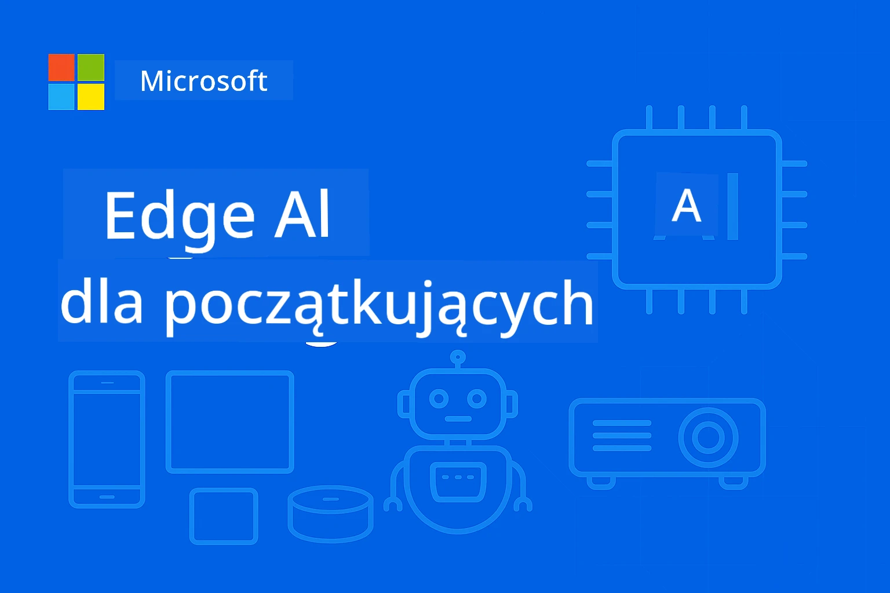

# EdgeAI dla początkujących




[](https://GitHub.com/microsoft/edgeai-for-beginners/graphs/contributors)
[](https://GitHub.com/microsoft/edgeai-for-beginners/issues)
[](https://GitHub.com/microsoft/edgeai-for-beginners/pulls)
[](http://makeapullrequest.com)

[](https://GitHub.com/microsoft/edgeai-for-beginners/watchers)
[](https://GitHub.com/microsoft/edgeai-for-beginners/fork)
[](https://GitHub.com/microsoft/edgeai-for-beginners/stargazers)


[](https://discord.gg/nTYy5BXMWG)

Wykonaj te kroki, aby rozpocząć korzystanie z tych zasobów:

1. **Zrób fork repozytorium**: Kliknij [](https://GitHub.com/microsoft/edgeai-for-beginners/fork)
2. **Sklonuj repozytorium**: `git clone https://github.com/microsoft/edgeai-for-beginners.git`
3. [**Dołącz do Azure AI Foundry Discord i poznaj ekspertów oraz innych deweloperów**](https://discord.com/invite/ByRwuEEgH4)


### 🌐 Wsparcie Wielojęzyczne

#### Obsługiwane przez GitHub Action (Automatyczne i zawsze aktualne)

<!-- CO-OP TRANSLATOR LANGUAGES TABLE START -->
[Arabski](../ar/README.md) | [Bengalski](../bn/README.md) | [Bułgarski](../bg/README.md) | [Birmański (Myanmar)](../my/README.md) | [Chiński (uproszczony)](../zh-CN/README.md) | [Chiński (tradycyjny, Hong Kong)](../zh-HK/README.md) | [Chiński (tradycyjny, Makau)](../zh-MO/README.md) | [Chiński (tradycyjny, Tajwan)](../zh-TW/README.md) | [Chorwacki](../hr/README.md) | [Czeski](../cs/README.md) | [Duński](../da/README.md) | [Niderlandzki](../nl/README.md) | [Estoński](../et/README.md) | [Fiński](../fi/README.md) | [Francuski](../fr/README.md) | [Niemiecki](../de/README.md) | [Grecki](../el/README.md) | [Hebrajski](../he/README.md) | [Hindi](../hi/README.md) | [Węgierski](../hu/README.md) | [Indonezyjski](../id/README.md) | [Włoski](../it/README.md) | [Japoński](../ja/README.md) | [Kannada](../kn/README.md) | [Koreański](../ko/README.md) | [Litewski](../lt/README.md) | [Malajski](../ms/README.md) | [Malajalam](../ml/README.md) | [Marathi](../mr/README.md) | [Nepalski](../ne/README.md) | [Nigeryjski Pidgin](../pcm/README.md) | [Norweski](../no/README.md) | [Perski (Farsi)](../fa/README.md) | [Polski](./README.md) | [Portugalski (Brazylia)](../pt-BR/README.md) | [Portugalski (Portugalia)](../pt-PT/README.md) | [Pendżabski (Gurmukhi)](../pa/README.md) | [Rumuński](../ro/README.md) | [Rosyjski](../ru/README.md) | [Serbski (cyrylica)](../sr/README.md) | [Słowacki](../sk/README.md) | [Słoweński](../sl/README.md) | [Hiszpański](../es/README.md) | [Suahili](../sw/README.md) | [Szwedzki](../sv/README.md) | [Tagalog (Filipiński)](../tl/README.md) | [Tamilski](../ta/README.md) | [Telugu](../te/README.md) | [Tajski](../th/README.md) | [Turecki](../tr/README.md) | [Ukraiński](../uk/README.md) | [Urdu](../ur/README.md) | [Wietnamski](../vi/README.md)

> **Wolisz klonować lokalnie?**

> To repozytorium zawiera ponad 50 tłumaczeń językowych, co znacząco zwiększa rozmiar pobierania. Aby sklonować bez tłumaczeń, użyj sparse checkout:
> ```bash
> git clone --filter=blob:none --sparse https://github.com/microsoft/edgeai-for-beginners.git
> cd edgeai-for-beginners
> git sparse-checkout set --no-cone '/*' '!translations' '!translated_images'
> ```
> Dzięki temu masz wszystko, czego potrzebujesz, aby ukończyć kurs, a pobieranie jest dużo szybsze.
<!-- CO-OP TRANSLATOR LANGUAGES TABLE END -->

**Jeśli chcesz, żeby wspierane były dodatkowe języki tłumaczeń, są one wymienione [tutaj](https://github.com/Azure/co-op-translator/blob/main/getting_started/supported-languages.md)**
## Wprowadzenie

Witamy w **EdgeAI dla początkujących** – twojej kompleksowej podróży do przełomowego świata krawędziowej sztucznej inteligencji. Ten kurs łączy potężne możliwości AI z praktycznym wdrożeniem w rzeczywistych urządzeniach edge, dając ci możliwość wykorzystania potencjału AI bezpośrednio tam, gdzie generowane są dane i podejmowane decyzje.

### Czego się nauczysz

Ten kurs prowadzi od podstawowych pojęć do wdrożeń gotowych do produkcji, obejmując:
- **Małe modele językowe (SLM)** zoptymalizowane pod kątem wdrożeń edge
- **Optymalizację uwzględniającą sprzęt** dla różnych platform
- **Wnioskowanie w czasie rzeczywistym** z funkcjami ochrony prywatności
- **Strategie wdrażania produkcyjnego** dla zastosowań korporacyjnych

### Dlaczego EdgeAI jest ważne

Edge AI to paradygmat zmieniający podejście, odpowiadający na kluczowe współczesne wyzwania:
- **Prywatność i bezpieczeństwo**: Przetwarzaj dane wrażliwe lokalnie bez ekspozycji na chmurę
- **Wydajność w czasie rzeczywistym**: Eliminuj opóźnienia sieciowe dla krytycznych aplikacji czasowych
- **Efektywność kosztowa**: Zmniejsz koszty transferu danych i obliczeń w chmurze
- **Odporność operacyjna**: Zachowaj funkcjonalność podczas awarii sieci
- **Zgodność regulacyjna**: Spełnij wymagania dotyczące suwerenności danych

### Edge AI

Edge AI to uruchamianie algorytmów AI i modeli językowych lokalnie na sprzęcie blisko miejsca generowania danych, bez uzależnienia od zasobów chmurowych podczas inferencji. Redukuje opóźnienia, poprawia prywatność i umożliwia podejmowanie decyzji w czasie rzeczywistym.

### Główne zasady:
- **Inferencja na urządzeniu**: Modele AI działają na urządzeniach edge (telefony, routery, mikrokontrolery, komputery przemysłowe)
- **Tryb offline**: Funkcjonuje bez stałego połączenia z internetem
- **Niskie opóźnienia**: Natychmiastowe reakcje odpowiednie dla systemów czasu rzeczywistego
- **Suwerenność danych**: Przechowuje dane wrażliwe lokalnie, poprawiając bezpieczeństwo i zgodność

### Małe modele językowe (SLM)

SLM takie jak Phi-4, Mistral-7B i Gemma to zoptymalizowane wersje większych LLM — trenowane lub destylowane dla:
- **Zmniejszenia zapotrzebowania na pamięć**: Efektywne wykorzystanie ograniczonej pamięci na urządzeniach edge
- **Niższych wymagań obliczeniowych**: Optymalizacja dla CPU i GPU edge
- **Szybszego uruchamiania**: Szybka inicjalizacja dla responsywnych aplikacji

Otwierają potężne możliwości NLP przy zachowaniu ograniczeń:
- **Systemów wbudowanych**: Urządzenia IoT i kontrolery przemysłowe
- **Urządzeń mobilnych**: Smartfony i tablety z funkcjami offline
- **Urządzeń IoT**: Czujniki i inteligentne urządzenia o ograniczonych zasobach
- **Serwerów edge**: Lokalnych jednostek przetwarzających z ograniczonymi zasobami GPU
- **Komputerów osobistych**: Scenariusze wdrożeń desktopowych i laptopowych

## Moduły kursu i nawigacja

| Moduł | Temat | Obszar fokusowy | Kluczowa zawartość | Poziom | Czas trwania |
|--------|-------|------------|-------------|--------|----------|
| [📖 00 ](./introduction.md) | [Wprowadzenie do EdgeAI](./introduction.md) | Podstawy i kontekst | Przegląd EdgeAI • Zastosowania w przemyśle • Wprowadzenie do SLM • Cele nauki | Początkujący | 1-2 godziny |
| [📚 01](../../Module01) | [Podstawy EdgeAI](./Module01/README.md) | Porównanie Cloud vs Edge AI | Podstawy EdgeAI • Studia przypadków • Przewodnik wdrożenia • Deployment edge | Początkujący | 3-4 godziny |
| [🧠 02](../../Module02) | [Fundamenty modeli SLM](./Module02/README.md) | Rodziny modeli i architektura | Rodzina Phi • Rodzina Qwen • Rodzina Gemma • BitNET • μModel • Phi-Silica | Początkujący | 4-5 godzin |
| [🚀 03](../../Module03) | [Praktyka wdrożeń SLM](./Module03/README.md) | Wdrożenia lokalne i w chmurze | Nauka zaawansowana • Środowisko lokalne • Deployment w chmurze | Średniozaawansowany | 4-5 godzin |
| [⚙️ 04](../../Module04) | [Zestaw narzędzi optymalizacji modeli](./Module04/README.md) | Optymalizacja międzyplatformowa | Wprowadzenie • Llama.cpp • Microsoft Olive • OpenVINO • Apple MLX • Synteza workflow | Średniozaawansowany | 5-6 godzin |
| [🔧 05](../../Module05) | [SLMOps w produkcji](./Module05/README.md) | Operacje produkcyjne | Wprowadzenie do SLMOps • Destylacja modeli • Dostosowywanie • Wdrożenie produkcyjne | Zaawansowany | 5-6 godzin |
| [🤖 06](../../Module06) | [Agenci AI i wywoływanie funkcji](./Module06/README.md) | Frameworki agentów i MCP | Wprowadzenie do agentów • Wywoływanie funkcji • Protokół kontekstowy modelu | Zaawansowany | 4-5 godzin |
| [💻 07](../../Module07) | [Implementacja platformy](./Module07/README.md) | Przykłady wieloplatformowe | Zestaw narzędzi AI • Foundry Local • Rozwój Windows | Zaawansowany | 3-4 godziny |
| [🏭 08](../../Module08) | [Foundry Local Toolkit](./Module08/README.md) | Przykłady gotowe do produkcji | Przykładowe aplikacje (szczegóły poniżej) | Ekspert | 8-10 godzin |

### 🏭 **Moduł 08: Przykładowe aplikacje**

- [01: REST Chat Quickstart](./Module08/samples/01/README.md)
- [02: Integracja OpenAI SDK](./Module08/samples/02/README.md)
- [03: Odkrywanie modeli i benchmarking](./Module08/samples/03/README.md)
- [04: Aplikacja Chainlit RAG](./Module08/samples/04/README.md)
- [05: Orkiestracja Multi-Agent](./Module08/samples/05/README.md)
- [06: Router Models-as-Tools](./Module08/samples/06/README.md)
- [07: Klient bezpośredniego API](./Module08/samples/07/README.md)
- [08: Aplikacja chat Windows 11](./Module08/samples/08/README.md)
- [09: Zaawansowany system Multi-Agent](./Module08/samples/09/README.md)
- [10: Framework narzędzi Foundry](./Module08/samples/10/README.md)

### 🎓 **Warsztaty: Praktyczna ścieżka nauki**

Kompleksowe materiały warsztatowe z implementacjami gotowymi do produkcji:

- **[Przewodnik warsztatowy](./Workshop/Readme.md)** - Kompletny zestaw celów, efektów i nawigacji po zasobach
- **Przykłady w Pythonie** (6 sesji) - Zaktualizowane o najlepsze praktyki, obsługę błędów i pełną dokumentację
- **Notatniki Jupyter** (8 interaktywnych) - Krok po kroku tutoriale z benchmarkami i monitorowaniem wydajności
- **Przewodniki sesji** - Szczegółowe przewodniki markdown dla każdej sesji warsztatowej
- **Narzędzia walidacyjne** - Skrypty do weryfikacji jakości kodu i testów dymnych

**Co zbudujesz:**
- Lokalne aplikacje AI do czatu ze wsparciem streamingu
- Pipeline RAG z oceną jakości (RAGAS)
- Narzędzia benchmarkingowe i porównawcze wielomodelowe
- Systemy orkiestracji multi-agent
- Inteligentne routowanie modeli z wyborem zadań

### 🎙️ **Warsztaty dla agentów: Praktycznie - Studio podcastów AI**

Zbuduj pipeline produkcji podcastów wspierany przez AI od podstaw! Ten immersyjny warsztat nauczy Cię tworzyć kompletny system multi-agent, który przekształca pomysły w profesjonalne odcinki podcastowe.
**[🎬 Rozpocznij Warsztaty AI Podcast Studio](./WorkshopForAgentic/README.md)**

**Twoja Misja**: Uruchom "Future Bytes" — podcast technologiczny w pełni zasilany przez agentów AI, których stworzysz samodzielnie. Bez zależności od chmury, bez kosztów API — wszystko działa lokalnie na Twoim komputerze.

**Co czyni to wyjątkowym:**
- **🤖 Prawdziwa wieloagentowa orkiestracja** - Buduj wyspecjalizowane agenty AI, które badają, piszą i produkują audio
- **🎯 Kompletny pipeline produkcji** - Od wyboru tematu po finalny plik audio podcastu
- **💻 100% lokalne wdrożenie** - Wykorzystuje Ollama i modele lokalne (Qwen-3-8B) zapewniając pełną prywatność i kontrolę
- **🎤 Integracja tekst-na-mowę** - Przekształć skrypty w naturalnie brzmiące rozmowy z wieloma mówcami
- **✋ Przepływy pracy z udziałem człowieka** - Bramy akceptacji zapewniają jakość przy zachowaniu automatyzacji

**Trójaktowa ścieżka nauki:**

| Akt | Temat | Kluczowe umiejętności | Czas trwania |
|-----|-------|-----------------------|--------------|
| **[Akt 1: Poznaj swoich asystentów AI](./WorkshopForAgentic/md/01.BuildAIAgentWithSLM.md)** | Stwórz pierwszego agenta AI | Integracja narzędzi • Wyszukiwanie w sieci • Rozwiązywanie problemów • Rozumowanie agentów | 2-3 godziny |
| **[Akt 2: Stwórz swój zespół produkcyjny](./WorkshopForAgentic/md/02.AIAgentOrchestrationAndWorkflows.md)** | Orkiestruj wielu agentów | Koordynacja zespołu • Przepływy zatwierdzania • Interfejs DevUI • Nadzór człowieka | 3-4 godziny |
| **[Akt 3: Ożyw swój podcast](./WorkshopForAgentic/md/03.Multi-SpeakerPodcastGenerationWithVibeVoice.md)** | Generuj audio podcastu | Tekst-na-mowę • Synteza wielomówcza • Długie audio • Pełna automatyzacja | 2-3 godziny |

**Wykorzystane technologie:**
- **Microsoft Agent Framework** - Orkiestracja i koordynacja wieloagentowa
- **Ollama** - Lokalny runtime modeli AI (bez chmury)
- **Qwen-3-8B** - Otwarty model językowy zoptymalizowany pod zadania agentowe
- **API Tekst-na-Mowę** - Naturalna synteza głosu dla generowania podcastów

**Wsparcie sprzętowe:**
- ✅ **Tryb CPU** - Działa na każdym nowoczesnym komputerze (zalecane 8GB+ RAM)
- 🚀 **Przyspieszenie GPU** - Znacznie szybsza inferencja z GPU NVIDIA/AMD
- ⚡ **Wsparcie NPU** - Przyspieszenie na jednostkach obliczeniowych nowej generacji

**Idealne dla:**
- Programistów uczących się systemów wieloagentowych AI
- Osób zainteresowanych automatyzacją i przepływami AI
- Twórców treści eksplorujących produkcję wspieraną AI
- Studentów studiujących praktyczne wzorce orkiestracji AI

**Zacznij budować**: [🎙️ Warsztaty AI Podcast Studio →](./WorkshopForAgentic/README.md)

### 📊 **Podsumowanie ścieżki nauki**
- **Całkowity czas**: 36-45 godzin
- **Ścieżka początkująca**: Moduły 01-02 (7-9 godzin)  
- **Ścieżka średniozaawansowana**: Moduły 03-04 (9-11 godzin)
- **Ścieżka zaawansowana**: Moduły 05-07 (12-15 godzin)
- **Ścieżka ekspercka**: Moduł 08 (8-10 godzin)

## Co zbudujesz

### 🎯 Kluczowe kompetencje
- **Architektura Edge AI**: Projektuj systemy AI z podejściem lokalnym z integracją chmury
- **Optymalizacja modelu**: Kwantyzacja i kompresja modeli pod wdrożenia edge (85% wzrost prędkości, 75% zmniejszenie rozmiaru)
- **Wdrożenie wieloplatformowe**: Windows, mobile, embedded i hybrydowe systemy chmura-edge
- **Operacje produkcyjne**: Monitorowanie, skalowanie i utrzymanie edge AI w produkcji

### 🏗️ Projekty praktyczne
- **Foundry Local Chat Apps**: Natywna aplikacja Windows 11 z przełączaniem modeli
- **Systemy wieloagentowe**: Koordynator z agentami specjalistycznymi dla złożonych przepływów pracy  
- **Aplikacje RAG**: Lokalna obróbka dokumentów z wyszukiwaniem wektorowym
- **Routery modeli**: Inteligentny wybór modelu na podstawie analizy zadania
- **Frameworki API**: Produkcyjne klienty z transmisją strumieniową i monitorowaniem zdrowia
- **Narzędzia wieloplatformowe**: Wzorce integracji LangChain/Semantic Kernel

### 🏢 Zastosowania w branży
**Produkcja** • **Opieka zdrowotna** • **Pojazdy autonomiczne** • **Smart Cities** • **Aplikacje mobilne**

## Szybki start

**Zalecana ścieżka nauki** (20-30 godzin łącznie):

0. **📖 Wprowadzenie** ([Introduction.md](./introduction.md)): Podstawy EdgeAI + kontekst branżowy + ramy nauki  
1. **📚 Fundamenty** (Moduły 01-02): Koncepcje EdgeAI + rodziny modeli SLM  
2. **⚙️ Optymalizacja** (Moduły 03-04): Wdrożenie + frameworki kwantyzacji  
3. **🚀 Produkcja** (Moduły 05-06): SLMOps + agenty AI + wywoływanie funkcji  
4. **💻 Implementacja** (Moduły 07-08): Przykłady na platformy + zestaw narzędzi Foundry Local

Każdy moduł zawiera teorię, ćwiczenia praktyczne oraz gotowe do produkcji przykłady kodu.

## Wpływ na karierę

**Role techniczne**: Architekt rozwiązań EdgeAI • Inżynier ML (Edge) • Deweloper IoT AI • Deweloper AI mobilnego

**Sektory branżowe**: Manufacturing 4.0 • Technologia zdrowotna • Systemy autonomiczne • FinTech • Elektronika użytkowa

**Projekty w portfolio**: Systemy wieloagentowe • Produkcyjne aplikacje RAG • Wdrożenia wieloplatformowe • Optymalizacja wydajności

## Struktura repozytorium

```
edgeai-for-beginners/
├── 📖 introduction.md  # Foundation: EdgeAI Overview & Learning Framework
├── 📚 Module01-04/     # Fundamentals → SLMs → Deployment → Optimization  
├── 🔧 Module05-06/     # SLMOps → AI Agents → Function Calling
├── 💻 Module07/        # Platform Samples (VS Code, Windows, Jetson, Mobile)
├── 🏭 Module08/        # Foundry Local Toolkit + 10 Comprehensive Samples
│   ├── samples/01-06/  # Foundation: REST, SDK, RAG, Agents, Routing
│   └── samples/07-10/  # Advanced: API Client, Windows App, Enterprise Agents, Tools
├── 🌐 translations/    # Multi-language support (8+ languages)
└── 📋 STUDY_GUIDE.md   # Structured learning paths & time allocation
```

## Najważniejsze punkty kursu

✅ **Progresywna nauka**: Teoria → Praktyka → Wdrożenie produkcyjne  
✅ **Prawdziwe studia przypadków**: Microsoft, Japan Airlines, wdrożenia korporacyjne  
✅ **Przykłady praktyczne**: 50+ przykładów, 10 kompleksowych demonstracji Foundry Local  
✅ **Skupienie na wydajności**: 85% poprawy prędkości, 75% zmniejszenia rozmiaru  
✅ **Wieloplatformowość**: Windows, mobile, embedded, hybryda chmura-edge  
✅ **Gotowość do produkcji**: Monitorowanie, skalowanie, bezpieczeństwo, ramy zgodności

📖 **[Dostępny przewodnik nauki](STUDY_GUIDE.md)**: Ustrukturyzowana 20-godzinna ścieżka z zaleceniami czasowymi i narzędziami samooceny.

---

**EdgeAI to przyszłość wdrożeń AI**: lokalne, z zachowaniem prywatności i wydajne. Opanuj te umiejętności, aby tworzyć kolejne generacje inteligentnych aplikacji.

## Inne kursy

Nasz zespół produkuje również inne kursy! Sprawdź:

<!-- CO-OP TRANSLATOR OTHER COURSES START -->
### LangChain
[](https://aka.ms/langchain4j-for-beginners)
[](https://aka.ms/langchainjs-for-beginners?WT.mc_id=m365-94501-dwahlin)

---

### Azure / Edge / MCP / Agenci
[](https://github.com/microsoft/AZD-for-beginners?WT.mc_id=academic-105485-koreyst)
[](https://github.com/microsoft/edgeai-for-beginners?WT.mc_id=academic-105485-koreyst)
[](https://github.com/microsoft/mcp-for-beginners?WT.mc_id=academic-105485-koreyst)
[](https://github.com/microsoft/ai-agents-for-beginners?WT.mc_id=academic-105485-koreyst)

---
 
### Seria Generatywna AI
[](https://github.com/microsoft/generative-ai-for-beginners?WT.mc_id=academic-105485-koreyst)
[-9333EA?style=for-the-badge&labelColor=E5E7EB&color=9333EA)](https://github.com/microsoft/Generative-AI-for-beginners-dotnet?WT.mc_id=academic-105485-koreyst)
[-C084FC?style=for-the-badge&labelColor=E5E7EB&color=C084FC)](https://github.com/microsoft/generative-ai-for-beginners-java?WT.mc_id=academic-105485-koreyst)
[-E879F9?style=for-the-badge&labelColor=E5E7EB&color=E879F9)](https://github.com/microsoft/generative-ai-with-javascript?WT.mc_id=academic-105485-koreyst)

---
 
### Nauka podstawowa
[](https://aka.ms/ml-beginners?WT.mc_id=academic-105485-koreyst)
[](https://aka.ms/datascience-beginners?WT.mc_id=academic-105485-koreyst)
[](https://aka.ms/ai-beginners?WT.mc_id=academic-105485-koreyst)
[](https://github.com/microsoft/Security-101?WT.mc_id=academic-96948-sayoung)
[](https://aka.ms/webdev-beginners?WT.mc_id=academic-105485-koreyst)
[](https://aka.ms/iot-beginners?WT.mc_id=academic-105485-koreyst)
[](https://github.com/microsoft/xr-development-for-beginners?WT.mc_id=academic-105485-koreyst)

---
 
### Seria Copilot
[](https://aka.ms/GitHubCopilotAI?WT.mc_id=academic-105485-koreyst)
[](https://github.com/microsoft/mastering-github-copilot-for-dotnet-csharp-developers?WT.mc_id=academic-105485-koreyst)
[](https://github.com/microsoft/CopilotAdventures?WT.mc_id=academic-105485-koreyst)
<!-- CO-OP TRANSLATOR OTHER COURSES END -->

## Uzyskiwanie pomocy

Jeśli utkniesz lub masz pytania dotyczące tworzenia aplikacji AI, dołącz do:

[](https://discord.gg/nTYy5BXMWG)

Jeśli masz uwagi dotyczące produktu lub napotkasz błędy podczas tworzenia, odwiedź:

[](https://aka.ms/foundry/forum)

---

<!-- CO-OP TRANSLATOR DISCLAIMER START -->
**Zastrzeżenie**:  
Niniejszy dokument został przetłumaczony przy użyciu usługi tłumaczenia AI [Co-op Translator](https://github.com/Azure/co-op-translator). Mimo że staramy się o dokładność, prosimy mieć na uwadze, że tłumaczenia automatyczne mogą zawierać błędy lub niedokładności. Oryginalny dokument w języku źródłowym powinien być traktowany jako źródło wiarygodne. W przypadku informacji o krytycznym znaczeniu zaleca się skorzystanie z profesjonalnego tłumaczenia wykonanego przez człowieka. Nie ponosimy odpowiedzialności za jakiekolwiek nieporozumienia lub błędne interpretacje wynikające z korzystania z tego tłumaczenia.
<!-- CO-OP TRANSLATOR DISCLAIMER END -->