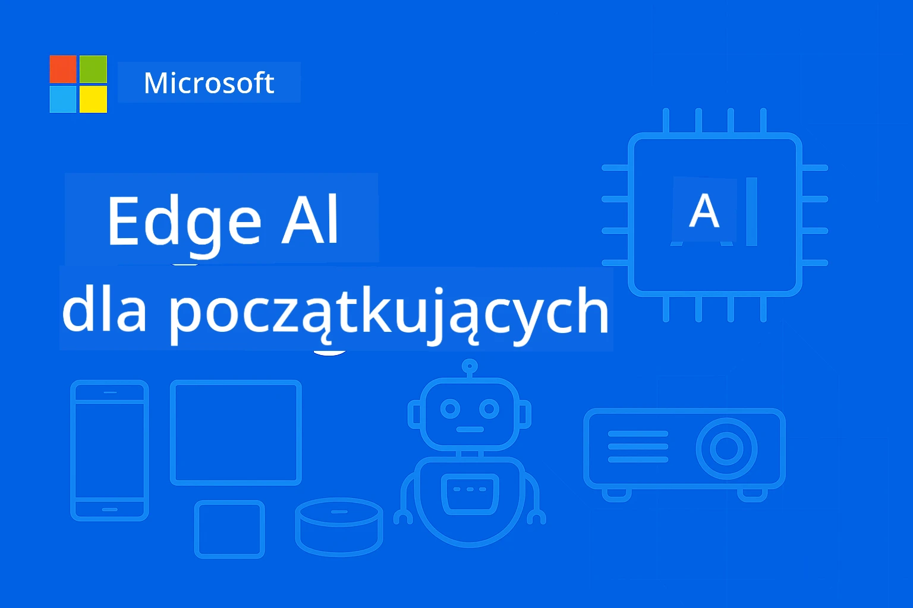

# EdgeAI dla początkujących 




[](https://GitHub.com/microsoft/edgeai-for-beginners/graphs/contributors)
[](https://GitHub.com/microsoft/edgeai-for-beginners/issues)
[](https://GitHub.com/microsoft/edgeai-for-beginners/pulls)
[](http://makeapullrequest.com)

[](https://GitHub.com/microsoft/edgeai-for-beginners/watchers)
[](https://GitHub.com/microsoft/edgeai-for-beginners/fork)
[](https://GitHub.com/microsoft/edgeai-for-beginners/stargazers)


[](https://discord.gg/nTYy5BXMWG)

Postępuj zgodnie z tymi krokami, aby zacząć korzystać z tych zasobów:

1. **Forkuj repozytorium**: Kliknij [](https://GitHub.com/microsoft/edgeai-for-beginners/fork)
2. **Sklonuj repozytorium**:   `git clone https://github.com/microsoft/edgeai-for-beginners.git`
3. [**Dołącz do Azure AI Foundry Discord i poznaj ekspertów oraz innych programistów**](https://discord.com/invite/ByRwuEEgH4)


### 🌐 Wsparcie wielojęzyczne

#### Wspierane za pomocą GitHub Action (automatyczne i zawsze aktualne)

<!-- CO-OP TRANSLATOR LANGUAGES TABLE START -->
[Arabski](../ar/README.md) | [Bengalski](../bn/README.md) | [Bułgarski](../bg/README.md) | [Birmański (Myanmar)](../my/README.md) | [Chiński (uproszczony)](../zh-CN/README.md) | [Chiński (tradycyjny, Hong Kong)](../zh-HK/README.md) | [Chiński (tradycyjny, Makau)](../zh-MO/README.md) | [Chiński (tradycyjny, Tajwan)](../zh-TW/README.md) | [Chorwacki](../hr/README.md) | [Czeski](../cs/README.md) | [Duński](../da/README.md) | [Holenderski](../nl/README.md) | [Estoński](../et/README.md) | [Fiński](../fi/README.md) | [Francuski](../fr/README.md) | [Niemiecki](../de/README.md) | [Grecki](../el/README.md) | [Hebrajski](../he/README.md) | [Hindi](../hi/README.md) | [Węgierski](../hu/README.md) | [Indonezyjski](../id/README.md) | [Włoski](../it/README.md) | [Japoński](../ja/README.md) | [Kannada](../kn/README.md) | [Khmer](../km/README.md) | [Koreański](../ko/README.md) | [Litewski](../lt/README.md) | [Malajski](../ms/README.md) | [Malayalam](../ml/README.md) | [Marathi](../mr/README.md) | [Nepalski](../ne/README.md) | [Nigerski pidgin](../pcm/README.md) | [Norweski](../no/README.md) | [Perski (Farsi)](../fa/README.md) | [Polski](./README.md) | [Portugalski (Brazylia)](../pt-BR/README.md) | [Portugalski (Portugalia)](../pt-PT/README.md) | [Pendżabski (Gurmukhi)](../pa/README.md) | [Rumunski](../ro/README.md) | [Rosyjski](../ru/README.md) | [Serbski (cyrylica)](../sr/README.md) | [Słowacki](../sk/README.md) | [Słoweński](../sl/README.md) | [Hiszpański](../es/README.md) | [Suahili](../sw/README.md) | [Szwedzki](../sv/README.md) | [Tagalog (Filipiński)](../tl/README.md) | [Tamilski](../ta/README.md) | [Telugu](../te/README.md) | [Tajski](../th/README.md) | [Turecki](../tr/README.md) | [Ukraiński](../uk/README.md) | [Urdu](../ur/README.md) | [Wietnamski](../vi/README.md)

> **Wolisz klonować lokalnie?**
>
> To repozytorium zawiera ponad 50 tłumaczeń językowych, co znacząco zwiększa rozmiar pobieranego pliku. Aby klonować bez tłumaczeń, użyj sparse checkout:
>
> **Bash / macOS / Linux:**
> ```bash
> git clone --filter=blob:none --sparse https://github.com/microsoft/edgeai-for-beginners.git
> cd edgeai-for-beginners
> git sparse-checkout set --no-cone '/*' '!translations' '!translated_images'
> ```
>
> **CMD (Windows):**
> ```cmd
> git clone --filter=blob:none --sparse https://github.com/microsoft/edgeai-for-beginners.git
> cd edgeai-for-beginners
> git sparse-checkout set --no-cone "/*" "!translations" "!translated_images"
> ```
>
> Dzięki temu otrzymasz wszystko, co potrzebne do ukończenia kursu, z znacznie szybszym pobieraniem.
<!-- CO-OP TRANSLATOR LANGUAGES TABLE END -->

**Jeśli chcesz dodać dodatkowe języki tłumaczeń, są one wymienione [tutaj](https://github.com/Azure/co-op-translator/blob/main/getting_started/supported-languages.md)**
## Wprowadzenie

Witamy w **EdgeAI dla początkujących** – Twojej kompleksowej podróży do transformującego świata Edge Artificial Intelligence. Ten kurs łączy potężne możliwości AI z praktycznym, rzeczywistym wdrożeniem na urządzeniach brzegowych, umożliwiając Ci wykorzystanie potencjału AI bezpośrednio tam, gdzie generowane są dane i podejmowane są decyzje.

### Co opanujesz

Kurs przeprowadzi Cię od podstawowych koncepcji do wdrożeń gotowych na produkcję, obejmując:
- **Małe modele językowe (SLM)** zoptymalizowane pod kątem wdrożeń brzegowych
- **Optymalizację świadomą sprzętu** na różnych platformach
- **Wnioskowanie w czasie rzeczywistym** z zachowaniem prywatności
- **Strategie wdrożeń produkcyjnych** dla aplikacji korporacyjnych

### Dlaczego EdgeAI ma znaczenie

Edge AI reprezentuje zmianę paradygmatu odpowiadającą na kluczowe wyzwania współczesności:
- **Prywatność i bezpieczeństwo**: Przetwarzaj wrażliwe dane lokalnie bez narażania ich w chmurze
- **Wydajność w czasie rzeczywistym**: Eliminuj opóźnienia sieciowe w aplikacjach krytycznych czasowo
- **Efektywność kosztowa**: Zredukowanie kosztów przepustowości i obliczeń w chmurze
- **Odporne działanie**: Utrzymanie funkcjonalności podczas awarii sieci
- **Zgodność regulacyjna**: Spełnianie wymogów suwerenności danych

### Edge AI

Edge AI oznacza uruchamianie algorytmów AI i modeli językowych lokalnie na sprzęcie, blisko miejsca generowania danych, bez polegania na zasobach chmurowych do wnioskowania. Zmniejsza to opóźnienia, zwiększa prywatność i umożliwia podejmowanie decyzji w czasie rzeczywistym.

### Główne zasady:
- **Wnioskowanie na urządzeniu**: Modele AI działają na urządzeniach brzegowych (telefony, routery, mikrokontrolery, komputery przemysłowe)
- **Możliwość pracy offline**: Funkcjonuje bez stałego połączenia z internetem
- **Niskie opóźnienia**: Natychmiastowe odpowiedzi odpowiednie dla systemów czasu rzeczywistego
- **Suwerenność danych**: Przechowywanie danych wrażliwych lokalnie, co poprawia bezpieczeństwo i zgodność

### Małe modele językowe (SLM)

SLM, takie jak Phi-4, Mistral-7B i Gemma, to zoptymalizowane wersje większych LLM — wytrenowane lub destylowane tak, aby zapewnić:
- **Zmniejszone zużycie pamięci**: Efektywne wykorzystanie ograniczonej pamięci urządzeń brzegowych
- **Niższe zapotrzebowanie na moc obliczeniową**: Optymalizacja pod kątem wydajności CPU i GPU na brzegu sieci
- **Szybsze uruchamianie**: Szybka inicjalizacja dla responsywnych aplikacji

Umożliwiają potężne możliwości NLP, spełniając jednocześnie ograniczenia:
- **Systemów wbudowanych**: Urządzenia IoT i kontrolery przemysłowe
- **Urządzeń mobilnych**: Smartfony i tablety z możliwością pracy offline
- **Urządzeń IoT**: Czujniki i inteligentne urządzenia o ograniczonych zasobach
- **Serwerów brzegowych**: Lokalne jednostki przetwarzające z ograniczonym GPU
- **Komputerów osobistych**: Scenariusze wdrożeń desktopowych i laptopowych

## Moduły kursu i nawigacja

| Moduł | Temat | Obszar | Kluczowa zawartość | Poziom | Czas trwania |
|--------|-------|------------|-------------|--------|----------|
| [📖 00 ](./introduction.md) | [Wprowadzenie do EdgeAI](./introduction.md) | Podstawy i kontekst | Przegląd EdgeAI • Zastosowania w przemyśle • Wprowadzenie do SLM • Cele nauki | Początkujący | 1-2 godziny |
| [📚 01](../../Module01) | [Podstawy EdgeAI](./Module01/README.md) | Porównanie Cloud vs Edge AI | Podstawy EdgeAI • Studium przypadków • Przewodnik implementacyjny • Wdrożenie na brzegu | Początkujący | 3-4 godziny |
| [🧠 02](../../Module02) | [Podstawy modeli SLM](./Module02/README.md) | Rodziny modeli i architektura | Rodzina Phi • Rodzina Qwen • Rodzina Gemma • BitNET • μModel • Phi-Silica | Początkujący | 4-5 godzin |
| [🚀 03](../../Module03) | [Praktyka wdrożenia SLM](./Module03/README.md) | Wdrożenie lokalne i w chmurze | Zaawansowane szkolenie • Środowisko lokalne • Wdrożenie w chmurze | Średniozaawansowany | 4-5 godzin |
| [⚙️ 04](../../Module04) | [Zestaw narzędzi optymalizacji modeli](./Module04/README.md) | Optymalizacja multiplatformowa | Wprowadzenie • Llama.cpp • Microsoft Olive • OpenVINO • Apple MLX • Synteza przepływów pracy | Średniozaawansowany | 5-6 godzin |
| [🔧 05](../../Module05) | [Produkcja SLMOps](./Module05/README.md) | Operacje produkcyjne | Wprowadzenie do SLMOps • Destylacja modeli • Fine-tuning • Wdrożenie produkcyjne | Zaawansowany | 5-6 godzin |
| [🤖 06](../../Module06) | [Agenci AI i wywołania funkcji](./Module06/README.md) | Frameworki agentów i MCP | Wprowadzenie do agentów • Wywoływanie funkcji • Protokół kontekstu modelu | Zaawansowany | 4-5 godzin |
| [💻 07](../../Module07) | [Implementacja platformy](./Module07/README.md) | Przykłady multiplatformowe | Zestaw narzędzi AI • Foundry Local • Programowanie Windows | Zaawansowany | 3-4 godziny |
| [🏭 08](../../Module08) | [Zestaw narzędzi Foundry Local](./Module08/README.md) | Przykłady gotowe do produkcji | Przykładowe aplikacje (szczegóły poniżej) | Ekspert | 8-10 godzin |

### 🏭 **Moduł 08: Przykładowe aplikacje**

- [01: REST Chat Quickstart](./Module08/samples/01/README.md)
- [02: OpenAI SDK Integration](./Module08/samples/02/README.md)
- [03: Odkrywanie modeli i benchmarking](./Module08/samples/03/README.md)
- [04: Aplikacja Chainlit RAG](./Module08/samples/04/README.md)
- [05: Orkiestracja wielu agentów](./Module08/samples/05/README.md)
- [06: Router Modele-jako-Narzędzia](./Module08/samples/06/README.md)
- [07: Bezpośredni klient API](./Module08/samples/07/README.md)
- [08: Aplikacja czatu Windows 11](./Module08/samples/08/README.md)
- [09: Zaawansowany system wielu agentów](./Module08/samples/09/README.md)
- [10: Framework narzędzi Foundry](./Module08/samples/10/README.md)

### 🎓 **Warsztat: Ścieżka nauki praktycznej**

Kompleksowe materiały warsztatowe z wdrożeniami gotowymi do produkcji:

- **[Przewodnik warsztatowy](./Workshop/Readme.md)** - Cele i efekty nauki oraz nawigacja zasobami
- **Przykłady Python** (6 sesji) - Zaktualizowane o najlepsze praktyki, obsługę błędów i pełną dokumentację
- **Notatniki Jupyter** (8 interaktywnych) - Krok po kroku tutoriale z benchmarkami i monitorowaniem wydajności
- **Przewodniki sesji** - Szczegółowe przewodniki markdown dla każdej sesji warsztatowej
- **Narzędzia walidacyjne** - Skrypty do weryfikacji jakości kodu i testów dymnych

**Co zbudujesz:**
- Lokalne aplikacje czatu AI z obsługą streamingu
- Pipeline RAG z oceną jakości (RAGAS)
- Narzędzia benchmarkingu i porównania wielomodelowego
- Systemy orkiestracji wielu agentów
- Inteligentne routowanie modeli z wyborem według zadania

### 🎙️ **Warsztat dla Agentic: Praktyka - Studio podcastowe AI**
Zbuduj od podstaw pipeline produkcji podcastu wspieranego przez AI! Ten immersyjny warsztat nauczy Cię, jak stworzyć kompletny system wieloagentowy, który przekształca pomysły w profesjonalne odcinki podcastów.

**[🎬 Rozpocznij warsztaty AI Podcast Studio](./WorkshopForAgentic/README.md)**

**Twoja misja**: Uruchom "Future Bytes" — podcast technologiczny zasilany w całości przez AI, które sam stworzysz. Bez zależności chmurowych, bez kosztów API — wszystko działa lokalnie na Twoim komputerze.

**Co czyni to wyjątkowym:**
- **🤖 Prawdziwa orkiestracja wieloagentowa** — Buduj specjalistyczne agenty AI, które badają, piszą i produkują audio
- **🎯 Kompletny pipeline produkcyjny** — Od wyboru tematu po finalny plik audio podcastu
- **💻 Wdrożenie w 100% lokalnie** — Wykorzystuje Ollamę i lokalne modele (Qwen-3-8B) dla pełnej prywatności i kontroli
- **🎤 Integracja tekst-na-mowę** — Przekształć skrypty w naturalnie brzmiące rozmowy z udziałem wielu głosów
- **✋ Przepływy pracy z człowiekiem w pętli** — Bramy zatwierdzania zapewniają jakość przy zachowaniu automatyzacji

**Trzyaktowa podróż edukacyjna:**

| Akt | Fokus | Kluczowe umiejętności | Czas trwania |
|-----|-------|-------------------------|--------------|
| **[Akt 1: Poznaj swoich asystentów AI](./WorkshopForAgentic/md/01.BuildAIAgentWithSLM.md)** | Zbuduj swojego pierwszego agenta AI | Integracja narzędzi • Wyszukiwanie w sieci • Rozwiązywanie problemów • Rozumowanie agenta | 2-3 godz. |
| **[Akt 2: Złóż zespół produkcyjny](./WorkshopForAgentic/md/02.AIAgentOrchestrationAndWorkflows.md)** | Orkiestruj wielu agentów | Koordynacja zespołu • Przepływy zatwierdzania • Interfejs DevUI • Nadzór człowieka | 3-4 godz. |
| **[Akt 3: Ożyw swój podcast](./WorkshopForAgentic/md/03.Multi-SpeakerPodcastGenerationWithVibeVoice.md)** | Generuj audio podcastu | Tekst-na-mowę • Synteza wielogłosowa • Długie formy audio • Pełna automatyzacja | 2-3 godz. |

**Używane technologie:**
- **Microsoft Agent Framework** — Orkiestracja i koordynacja wieloagentowa
- **Ollama** — Lokalny runtime modeli AI (bez chmury)
- **Qwen-3-8B** — Otwartoźródłowy model językowy zoptymalizowany do zadań agentowych
- **API tekst-na-mowę** — Naturalna synteza głosu dla generowania podcastów

**Wsparcie sprzętowe:**
- ✅ **Tryb CPU** — Działa na każdym nowoczesnym komputerze (zalecane 8GB+ RAM)
- 🚀 **Przyspieszenie GPU** — Znacznie szybsze wnioskowanie na kartach NVIDIA/AMD
- ⚡ **Wsparcie NPU** — Przyspieszenie dzięki jednostce neuronowej nowej generacji

**Idealne dla:**
- Programistów uczących się systemów wieloagentowych AI
- Osób zainteresowanych automatyzacją AI i przepływami pracy
- Twórców treści eksplorujących produkcję wspieraną przez AI
- Studentów poznających praktyczne wzorce orkiestracji AI

**Zacznij budować**: [🎙️ Warsztaty AI Podcast Studio →](./WorkshopForAgentic/README.md)

### 📊 **Podsumowanie ścieżki nauki**
- **Łączny czas:** 36-45 godzin
- **Ścieżka początkującego:** Moduły 01-02 (7-9 godz.)  
- **Ścieżka średniozaawansowanego:** Moduły 03-04 (9-11 godz.)
- **Ścieżka zaawansowanego:** Moduły 05-07 (12-15 godz.)
- **Ścieżka eksperta:** Moduł 08 (8-10 godz.)

## Co zbudujesz

### 🎯 Kluczowe kompetencje
- **Architektura Edge AI**: Projektuj systemy lokalne z integracją chmurową
- **Optymalizacja modelu**: Kwantyzacja i kompresja modeli do zastosowań edge (85% wzrost prędkości, 75% redukcja rozmiaru)
- **Wieloplatformowe wdrożenia**: Windows, mobile, embedded i hybrydowe systemy chmura-edge
- **Operacje produkcyjne**: Monitorowanie, skalowanie i utrzymanie edge AI w produkcji

### 🏗️ Projekty praktyczne
- **Aplikacje czatu Foundry Local**: Natywna aplikacja Windows 11 ze zmianą modeli
- **Systemy wieloagentowe**: Koordynator z agentami specjalistycznymi do złożonych przepływów pracy  
- **Aplikacje RAG**: Lokalne przetwarzanie dokumentów z wyszukiwaniem wektorowym
- **Routery modeli**: Inteligentny wybór modeli na podstawie analizy zadań
- **Frameworki API**: Gotowe do produkcji klienty ze streamingiem i monitorowaniem stanu
- **Narzędzia wieloplatformowe**: Wzorce integracji LangChain/Semantic Kernel

### 🏢 Zastosowania branżowe
**Produkcja** • **Opieka zdrowotna** • **Pojazdy autonomiczne** • **Inteligentne miasta** • **Aplikacje mobilne**

## Szybki start

**Polecana ścieżka nauki** (20-30 godzin łącznie):

0. **📖 Wprowadzenie** ([Introduction.md](./introduction.md)): Podstawy EdgeAI + kontekst branżowy + framework nauki
1. **📚 Fundamenty** (Moduły 01-02): Koncepcje EdgeAI + rodziny modeli SLM
2. **⚙️ Optymalizacja** (Moduły 03-04): Wdrożenia + frameworki kwantyzacji  
3. **🚀 Produkcja** (Moduły 05-06): SLMOps + agenty AI + wywoływanie funkcji
4. **💻 Implementacja** (Moduły 07-08): Przykłady platformowe + zestaw narzędzi Foundry Local

Każdy moduł zawiera teorię, ćwiczenia praktyczne i przykłady kodu gotowego do produkcji.

## Wpływ na karierę

**Role techniczne**: Architekt rozwiązań EdgeAI • Inżynier ML (Edge) • Developer AI IoT • Mobile AI Developer

**Sektory branżowe**: Przemysł 4.0 • Technologie zdrowotne • Systemy autonomiczne • FinTech • Elektronika użytkowa

**Projekty w portfolio**: Systemy wieloagentowe • Produkcyjne aplikacje RAG • Wieloplatformowe wdrożenia • Optymalizacja wydajności

## Struktura repozytorium

```
edgeai-for-beginners/
├── 📖 introduction.md  # Foundation: EdgeAI Overview & Learning Framework
├── 📚 Module01-04/     # Fundamentals → SLMs → Deployment → Optimization  
├── 🔧 Module05-06/     # SLMOps → AI Agents → Function Calling
├── 💻 Module07/        # Platform Samples (VS Code, Windows, Jetson, Mobile)
├── 🏭 Module08/        # Foundry Local Toolkit + 10 Comprehensive Samples
│   ├── samples/01-06/  # Foundation: REST, SDK, RAG, Agents, Routing
│   └── samples/07-10/  # Advanced: API Client, Windows App, Enterprise Agents, Tools
├── 🌐 translations/    # Multi-language support (8+ languages)
└── 📋 STUDY_GUIDE.md   # Structured learning paths & time allocation
```

## Najważniejsze elementy kursu

✅ **Stopniowa nauka**: Teoria → Praktyka → Wdrożenie produkcyjne  
✅ **Prawdziwe studia przypadków**: Microsoft, Japan Airlines, wdrożenia korporacyjne  
✅ **Próbki praktyczne**: 50+ przykładów, 10 kompleksowych demo Foundry Local  
✅ **Skupienie na wydajności**: 85% przyspieszenia, 75% redukcji rozmiaru  
✅ **Wielo-platformowość**: Windows, mobile, embedded, hybrydy chmura-edge  
✅ **Gotowość do produkcji**: Monitorowanie, skalowanie, bezpieczeństwo, zgodność

📖 **[Dostępny przewodnik nauki](STUDY_GUIDE.md)**: Strukturyzowana 20-godzinna ścieżka z poradami dotyczącymi alokacji czasu i narzędziami samooceny.

---

**EdgeAI to przyszłość wdrażania AI**: lokalność w pierwszej kolejności, ochrona prywatności i efektywność. Opanuj te umiejętności, by budować nową generację inteligentnych aplikacji.

## Inne kursy

Nasz zespół tworzy także inne kursy! Sprawdź:

<!-- CO-OP TRANSLATOR OTHER COURSES START -->
### LangChain
[](https://aka.ms/langchain4j-for-beginners)
[](https://aka.ms/langchainjs-for-beginners?WT.mc_id=m365-94501-dwahlin)
[](https://github.com/microsoft/langchain-for-beginners?WT.mc_id=m365-94501-dwahlin)
---

### Azure / Edge / MCP / Agenci
[](https://github.com/microsoft/AZD-for-beginners?WT.mc_id=academic-105485-koreyst)
[](https://github.com/microsoft/edgeai-for-beginners?WT.mc_id=academic-105485-koreyst)
[](https://github.com/microsoft/mcp-for-beginners?WT.mc_id=academic-105485-koreyst)
[](https://github.com/microsoft/ai-agents-for-beginners?WT.mc_id=academic-105485-koreyst)

---
 
### Seria generatywnej AI
[](https://github.com/microsoft/generative-ai-for-beginners?WT.mc_id=academic-105485-koreyst)
[-9333EA?style=for-the-badge&labelColor=E5E7EB&color=9333EA)](https://github.com/microsoft/Generative-AI-for-beginners-dotnet?WT.mc_id=academic-105485-koreyst)
[-C084FC?style=for-the-badge&labelColor=E5E7EB&color=C084FC)](https://github.com/microsoft/generative-ai-for-beginners-java?WT.mc_id=academic-105485-koreyst)
[-E879F9?style=for-the-badge&labelColor=E5E7EB&color=E879F9)](https://github.com/microsoft/generative-ai-with-javascript?WT.mc_id=academic-105485-koreyst)

---
 
### Podstawy nauki
[](https://aka.ms/ml-beginners?WT.mc_id=academic-105485-koreyst)
[](https://aka.ms/datascience-beginners?WT.mc_id=academic-105485-koreyst)
[](https://aka.ms/ai-beginners?WT.mc_id=academic-105485-koreyst)
[](https://github.com/microsoft/Security-101?WT.mc_id=academic-96948-sayoung)
[](https://aka.ms/webdev-beginners?WT.mc_id=academic-105485-koreyst)
[](https://aka.ms/iot-beginners?WT.mc_id=academic-105485-koreyst)
[](https://github.com/microsoft/xr-development-for-beginners?WT.mc_id=academic-105485-koreyst)

---
 
### Seria Copilot

[](https://aka.ms/GitHubCopilotAI?WT.mc_id=academic-105485-koreyst)
[](https://github.com/microsoft/mastering-github-copilot-for-dotnet-csharp-developers?WT.mc_id=academic-105485-koreyst)
[](https://github.com/microsoft/CopilotAdventures?WT.mc_id=academic-105485-koreyst)
<!-- CO-OP TRANSLATOR OTHER COURSES END -->

## Uzyskiwanie pomocy

Jeśli utkniesz lub masz pytania dotyczące tworzenia aplikacji AI, dołącz do:

[](https://discord.gg/nTYy5BXMWG)

Jeśli masz uwagi dotyczące produktu lub napotykasz błędy podczas tworzenia, odwiedź:

[](https://aka.ms/foundry/forum)

---

<!-- CO-OP TRANSLATOR DISCLAIMER START -->
**Zastrzeżenie**:  
Dokument ten został przetłumaczony przy użyciu usługi tłumaczeń AI [Co-op Translator](https://github.com/Azure/co-op-translator). Mimo że dążymy do dokładności, prosimy pamiętać, że automatyczne tłumaczenia mogą zawierać błędy lub niedokładności. Oryginalny dokument w języku oryginalnym powinien być uważany za autorytatywne źródło. W przypadku informacji krytycznych zalecane jest skorzystanie z profesjonalnego tłumaczenia wykonanego przez człowieka. Nie ponosimy odpowiedzialności za jakiekolwiek nieporozumienia lub błędne interpretacje wynikające z użycia tego tłumaczenia.
<!-- CO-OP TRANSLATOR DISCLAIMER END -->