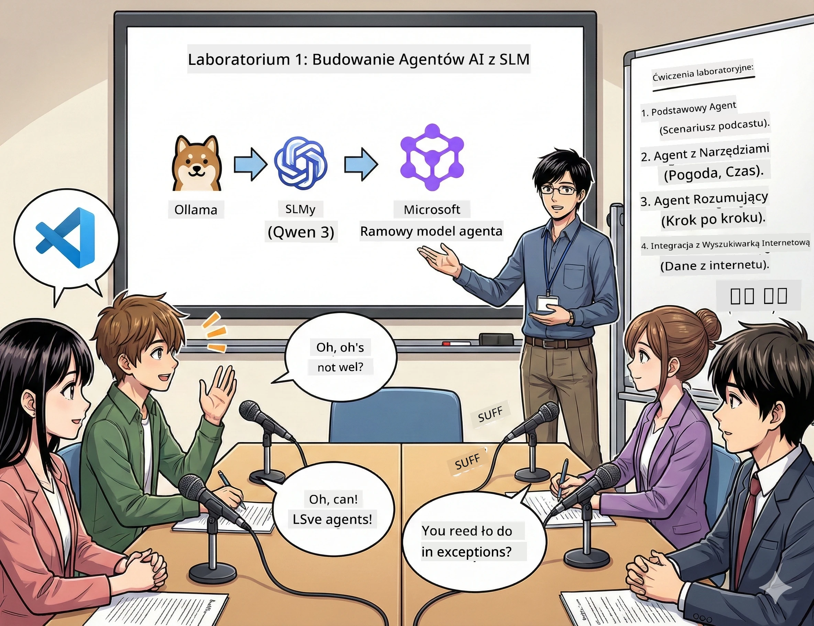

<!--
CO_OP_TRANSLATOR_METADATA:
{
  "original_hash": "7868fa418386aa7167bea3ff5ba8390b",
  "translation_date": "2026-01-05T12:59:11+00:00",
  "source_file": "WorkshopForAgentic/md/01.BuildAIAgentWithSLM.md",
  "language_code": "pl"
}
-->
# Akt 1: Poznaj swojego asystenta AI do badań naukowych 🤖

## Wyzwanie

Uruchamiasz "Future Bytes", swój nowy tech podcast. Odcinek 1 dotyczy najnowszych przełomów w AI, ale masz 24 godziny, aby:
1. Przeprowadzić badania na ten temat
2. Znaleźć wiarygodne źródła
3. Napisać przekonujący scenariusz
4. Sprawić, by brzmiał naturalnie

**Zwrot akcji**: Nie musisz robić tego sam. Zaraz zbudujesz swojego pierwszego asystenta AI, który pomoże we wszystkim. Nazwijmy go Alex — twój niestrudzony partner badawczy, który nigdy nie potrzebuje snu.

## Dlaczego Małe Modele Językowe? (Uwaga: Są świetne)

Pomyśl o Małych Modelach Językowych (SLM) jako o swojej osobistej AI, która mieszka *na twoim* komputerze. Bez chmury, bez miesięcznych opłat, bez podejrzanego udostępniania danych.

**Dlaczego SLM są 🔥:**
- **🏠 Działa na Twojej maszynie**: Laptop, komputer stacjonarny, a nawet wydajny Raspberry Pi
- **💸 Zero bieżących kosztów**: Żadnych opłat API, które zjadają twoje kieszonkowe
- **🔒 Prywatność przede wszystkim**: Twoje dane nigdy nie opuszczają urządzenia
- **⚡ Błyskawiczna szybkość**: Zero opóźnień sieciowych, natychmiastowe odpowiedzi
- **🪦 Lekki**: 1B-10B parametrów w porównaniu do 100B+ u dużych modeli

**Popularne SLM**: Qwen 3, Phi-4, Gemma 3 (my korzystamy z Qwen w tym warsztacie)

## Twój zestaw narzędzi

### Ollama: Twoje narzędzie do zarządzania modelami AI

[Ollama](https://ollama.com/) jest jak Steam dla modeli AI. Pobieraj, uruchamiaj i zarządzaj modelami za pomocą prostych poleceń.

**Co czyni to fajnym:**
- Jedno polecenie, by pobrać i uruchomić dowolny model
- Działa na Mac, Windows i Linux
- Automatycznie korzysta z twojego GPU, jeśli go masz
- Super ekonomiczna pamięć

### Microsoft Agent Framework: Gdzie dzieje się magia

[Microsoft Agent Framework](https://github.com/microsoft/agent-framework) to twoje pole zabaw do budowania agentów AI, którzy potrafią:

- 💬 Rozmawiać i zapamiętywać to, o czym mówiliście
- 🛠️ Korzystać z niestandardowych narzędzi (np. wyszukiwanie w sieci lub sprawdzanie pogody)
- 🧠 Myśleć krok po kroku nad złożonymi problemami
- 🤝 Współpracować z innymi agentami jako zespół
- 🔌 Łączyć się z różnymi dostawcami AI (OpenAI, Ollama, Azure)

**Podstawowe elementy:**
- **Agenci**: Twoi asystenci AI z konkretnymi zadaniami
- **Narzędzia**: Specjalne umiejętności, które im dajesz
- **Pamięć**: By nie zapominali o waszej rozmowie
- **Rozumowanie**: Nauka myślenia, nie tylko odpowiadania

## Twój montaż treningowy: 4 misje

### Misja 1: Stwórz swojego pierwszego agenta

📓 [Otwórz notatnik](../code/01.BasicAgent/00.BasicAgent-agent.ipynb)

**Cel**: Zbuduj Alexa, swojego AI scenarzystę podcastu. Alex ma generować dialogi między dwoma prowadzącymi, którzy dyskutują o tematach technicznych.

**Czego się nauczysz**:
- Jak "obudzić" agenta AI (to łatwiejsze niż w poniedziałek rano)
- Nadać mu osobowość i instrukcje
- Sprawić, by tworzył faktyczne scenariusze podcastu
- Rozumieć, co ci odpowiada

**Warunek zwycięstwa**: Alex tworzy scenariusz pilotażowego odcinka "Future Bytes" o AI! 🎯

### Misja 2: Daj Alexowi supermoce (Narzędzia!)

📓 [Otwórz notatnik](../code/01.BasicAgent/01.BasicAgent-tools.ipynb)

**Cel**: Alex jest bystry, ale nie zna dzisiejszej pogody ani godziny. Naprawmy to, dając mu narzędzia!

**Czego się nauczysz**:
- Tworzyć niestandardowe funkcje Pythona jako "narzędzia"
- Pozwolić Alexowi decydować *kiedy* użyć którego narzędzia
- Obserwować, jak samodzielnie rozwiązuje problemy
- Łączyć wiele narzędzi do złożonych zadań

**Warunek zwycięstwa**: Zapytaj "Jaka jest pogoda w Tokio?" i Alex sam to ustali! ☁️

### Misja 3: Naucz Alexa myśleć

📓 [Otwórz notatnik](../code/01.BasicAgent/02.BasicAgent-reasoning.ipynb)

**Cel**: Spraw, by Alex pokazywał swój tok rozumowania. Przy rozwiązywaniu problemów chcesz widzieć *jak* myśli, nie tylko wynik.

**Czego się nauczysz**:
- Aktywować "tryb rozumowania" (to jak pokazywanie rozwiązania na lekcji matematyki)
- Widzieć krok po kroku proces myślowy Alexa
- Rozumieć łańcuch myślowy w promptach
- Debugować, gdy Alex się myli

**Warunek zwycięstwa**: Zapytaj trudne zadanie matematyczne i obserwuj, jak Alex je rozwiązuje! 🧠

### Misja 4: Połącz Alexa z internetem

📓 [Otwórz notatnik](../code/01.BasicAgent/03.BasicAgent-websearch.ipynb)

**Cel**: Wiedza Alexa ma datę graniczną. Połączmy go z siecią, by mieć informacje w czasie rzeczywistym!

**Czego się nauczysz**:
- Budować niestandardowe narzędzie do wyszukiwania w sieci
- Integracja z zewnętrznymi API
- Radzenie sobie z błędami sieci
- Uzyskać informacje poza danymi treningowymi Alexa

**Warunek zwycięstwa**: Zapytaj o dzisiejsze wiadomości technologiczne i otrzymaj świeże wyniki! 📰

## Zanim zaczniesz 🚀

**Wymagany sprzęt**:
- Zainstalowany Python 3.10+
- Działające Ollama (sprawdź `ollama --version`)
- VS Code z rozszerzeniem Python
- Minimum 8GB RAM (16GB dla płynnej pracy)

## Kolejność misji

Postępuj według notatników w kolejności, by poznać całą historię:

1. [00.BasicAgent-agent.ipynb](../code/01.BasicAgent/00.BasicAgent-agent.ipynb) — Poznaj Alexa (twojego pierwszego agenta)
2. [01.BasicAgent-tools.ipynb](../code/01.BasicAgent/01.BasicAgent-tools.ipynb) — Czas na power-up!
3. [02.BasicAgent-reasoning.ipynb](../code/01.BasicAgent/02.BasicAgent-reasoning.ipynb) — Naucz Alexa myśleć
4. [03.BasicAgent-websearch.ipynb](../code/01.BasicAgent/03.BasicAgent-websearch.ipynb) — Odblokuj dostęp do internetu!

## Co opanujesz

Po Akcie 1 będziesz potrafić:

- ✅ Uruchamiać modele AI na własnym sprzęcie (bez chmury!)
- ✅ Budować agentów z niestandardowymi osobowościami i umiejętnościami
- ✅ Dawać agentom narzędzia do rozwiązywania rzeczywistych problemów
- ✅ Sprawić, by agenci prezentowali swój proces rozumowania
- ✅ Łączyć agentów ze źródłami zewnętrznymi
- ✅ Debugować, gdy coś idzie nie tak

## Gdy coś się zepsuje (i jak to naprawić) 🔧

### "Alex się nie ładuje! Brak pamięci!"
**Naprawa**: Twój komputer ma problemy. Spróbuj zamknąć inne aplikacje albo przejdź na mniejszy model. 8GB RAM to absolutne minimum.

### "Alex jest taaaki powolny"
**Naprawa**: Włącz akcelerację GPU w ustawieniach Ollama. Albo zmniejsz rozmiar okna kontekstu. Tryb demon prędkości aktywowany! 🏎️

### "Narzędzia nie działają!"
**Naprawa**: Sprawdź dwukrotnie sygnatury funkcji. Alex potrzebuje poprawnych wskazówek typów, by zrozumieć, co robi dane narzędzie. To jak dawanie jasnych instrukcji.

## Przydatne linki 🔗

- [Agent Framework Docs](https://github.com/microsoft/agent-framework) — Oficjalne poradniki i przykłady
- [Ollama Model Library](https://ollama.com/library) — Przegląd dostępnych modeli
- [Model Qwen](https://ollama.com/library/qwen3) — Poznaj mózg swojej AI
- [Przykłady kodu](https://github.com/microsoft/agent-framework/tree/main/python/samples) — Podkradnij pomysły stąd

## Co dalej: Akt 2 🎬

Masz jednego agenta. A co, jeśli miałbyś *zespół* agentów pracujących razem? W Akcie 2 zbudujesz cały swój zespół produkcyjny podcastu:
- **Agent Badawczy**: Znajduje najlepsze źródła
- **Agent Piszący**: Tworzy idealny scenariusz  
- **Redaktor (Ty!)**: Akceptuje lub prosi o zmiany

Zorganizujmy trochę magii AI! → [Akt 2: Zbuduj swój zespół produkcyjny](02.AIAgentOrchestrationAndWorkflows.md)

---

**Utknąłeś?** Zadawaj pytania podczas warsztatu. Uczymy się razem! 🙌

---

<!-- CO-OP TRANSLATOR DISCLAIMER START -->
**Zastrzeżenie**:
Niniejszy dokument został przetłumaczony za pomocą usługi tłumaczenia AI [Co-op Translator](https://github.com/Azure/co-op-translator). Mimo że staramy się zapewnić dokładność, prosimy pamiętać, że automatyczne tłumaczenia mogą zawierać błędy lub nieścisłości. Oryginalny dokument w języku źródłowym powinien być uważany za źródło wiarygodne. W przypadku informacji krytycznych zalecane jest skorzystanie z profesjonalnego tłumaczenia wykonywanego przez człowieka. Nie ponosimy odpowiedzialności za jakiekolwiek nieporozumienia lub błędne interpretacje wynikające z korzystania z tego tłumaczenia.
<!-- CO-OP TRANSLATOR DISCLAIMER END -->