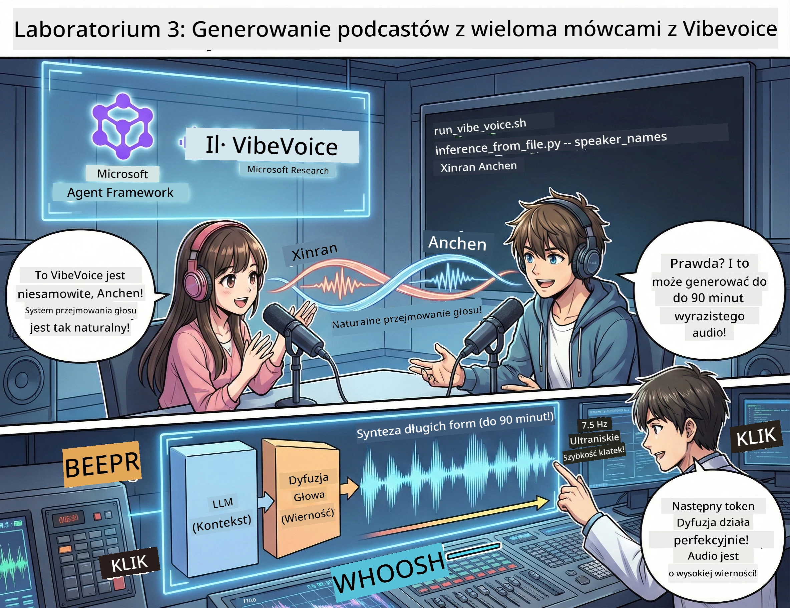

<!--
CO_OP_TRANSLATOR_METADATA:
{
  "original_hash": "bb2a3cf5ebd0ec8211af960a004fc23d",
  "translation_date": "2026-01-05T12:13:43+00:00",
  "source_file": "WorkshopForAgentic/md/03.Multi-SpeakerPodcastGenerationWithVibeVoice.md",
  "language_code": "pl"
}
-->
# Akt 3: Ożyw Swoje Podcasty 🎤



## Wielki Finał

Przeprowadziłeś badania tematów. Napisałeś scenariusze. Teraz wisienka na torcie: przekształcenie tekstu w rzeczywisty podcast z realistycznymi głosami!

Przedstawiamy **VibeVoice** — otwartoźródłową technologię TTS (text-to-speech) Microsoft Research, która tworzy:
- 🎭 Naturalnie brzmiące rozmowy
- 👥 Wielu rozmówców (aż do 4!)
- ⏱️ Długie nagrania (do 90 minut!)
- 🎵 Ekspresyjną interpretację (żadnych robotycznych głosów!)

To technologia stojąca za syntetycznymi podcastami. Stwórzmy Twój!

## Co to jest VibeVoice? (Fajne rzeczy)

VibeVoice to prezent od Microsoft Research dla świata. Został zaprojektowany specjalnie do podcastowych, konwersacyjnych nagrań audio.

### Dlaczego jest świetny 🔥

* **⏱️ Sesje Maratońskie**: Generuje aż do 90 minut ciągłej mowy (czyli cały odcinek podcastu!)
* **👥 Magia Wielu Głosów**: Do 4 różnych głosów z zachowaniem spójnych osobowości
* **⚡ Niesamowita Efektywność**: Używa ultra niskiej częstotliwości ramek 7,5 Hz, by oszczędzać moc obliczeniową
* **🧠 Inteligentne Audio**: Łączy LLM (rozumie kontekst) z modelem dyfuzji (tworzy realistyczne audio)
* **🎭 Naturalny Przepływ**: Automatycznie obsługuje przekazywanie głosu, pauzy i rytm rozmowy

**Tłumaczenie**: VibeVoice nie tylko czyta Twój scenariusz — *wykonuje* go jak prawdziwi ludzie rozmawiający.

---

## Zanim zaczniesz 🚀

**Co potrzebujesz**:

* 🐍 **Python 3.10+** (masz już z aktów 1 i 2)
* 🚀 **uv** (szybki menedżer pakietów Python — zainstalujemy go)
* 📝 **Twój scenariusz**: plik `podcast.txt` z Aktu 2 (w `../03.Application/`)

**Pro Tip**: Ten krok wymaga dobrego połączenia internetowego, by pobrać wytrenowany model. Zaparz sobie kawę! ☕

---

## Zaczynamy! Prosty sposób 🎬

Uprościliśmy to do maksimum. Jeden skrypt shell robi wszystko.

### Proces

1. **Nadaj uprawnienia do uruchomienia**:
```bash
chmod +x run_vibe_voice.sh
```

2. **Uruchom go**:
```bash
./run_vibe_voice.sh
```

3. **Czekaj na magię** (pierwsze uruchomienie może potrwać kilka minut)

### Co dzieje się w tle 🎭

Skrypt to właściwie Twój zautomatyzowany inżynier dźwięku:

1. **📥 Pobiera VibeVoice**: Klonuje oficjalne repozytorium z GitHuba
2. **📦 Instaluje Zależności**: Używa `uv pip` do błyskawicznej instalacji pakietów
3. **🎬 Generuje Audio**: Wykonuje skrypt inferencyjny z:
   * `--model_path`: wytrenowany model VibeVoice-7B
   * `--txt_path`: Twój scenariusz `podcast.txt`
   * `--speaker_names`: przypisuje głosy (domyślnie Xinran i Anchen)

**Efekt**: Twój scenariusz staje się prawdziwym odcinkiem podcastu! 🎉

---

## Twoje zadanie 🎯

Zróbmy to ciekawie:

### Zadanie 1: Stwórz treść
Edytuj `../03.Application/podcast.txt`, tworząc rozmowę między dwiema osobami. Może być o technologiach, hobby, czymkolwiek! Po prostu zrób to konwersacyjnie.

**Przykład formatu**:
```
Speaker 1: Hey! Did you hear about the new AI model?
Speaker 2: No way! Tell me more!
Speaker 1: It's called...
```

### Zadanie 2: Wygeneruj audio
Uruchom skrypt i obserwuj, jak dzieje się magia. Za pierwszym razem zajmie to nieco więcej czasu (pobieranie modelu).

### Zadanie 3: Posłuchaj i przeanalizuj
- Czy brzmi naturalnie?
- Czy głosy rozmówców są wyraźnie różne?
- Czy przekazywanie głosu jest płynne?
- Czy zdarzają się momenty robotyczne?

### Zadanie 4: Eksperymentuj (dla odważnych)
Edytuj `run_vibe_voice.sh` i zmień `--speaker_names`, aby wypróbować różne zestawy głosów. VibeVoice ma wiele wytrenowanych głosów!

**Bonus**: Spróbuj rozmowy 3-osobowej! 🎆

---

## Dowiedz się więcej 📚

* **🏠 Strona projektu**: [VibeVoice Official Site](https://microsoft.github.io/VibeVoice/)
* **🤗 Wytrenowany model**: [Hugging Face - VibeVoice-7B](https://huggingface.co/vibevoice/VibeVoice-7B)
* **📖 Publikacja naukowa**: Zanurz się głębiej w technologię (jeśli Cię to interesuje)

> **⚠️ Przypomnienie o odpowiedzialnym AI**: VibeVoice jest potężny. Używaj go etycznie! Nie twórz deepfake’ów ani wprowadzających w błąd treści. Twórz fajne rzeczy, które pomagają ludziom. 🙏

---

## 🏆 Gratulacje! Udało się!

Właśnie ukończyłeś cały pipeline:
1. ✅ **Akt 1**: Zbudowałeś agentów AI z własnymi narzędziami
2. ✅ **Akt 2**: Sterowałeś wieloagentowym workflow
3. ✅ **Akt 3**: Wygenerowałeś rzeczywiste audio podcastu

**Masz teraz**:
- Działającego asystenta badawczego AI
- Kompletny workflow produkcji podcastu
- Prawdziwy plik audio do udostępnienia

### Co dalej? 🚀

**Uruchom swój podcast!**
- Prześlij na platformy podcastowe
- Podziel się w mediach społecznościowych
- Iteruj i udoskonalaj

**Buduj dalej!**
- Próbuj różnych tematów
- Eksperymentuj z większą liczbą głosów
- Dodaj muzykę w tle
- Zbuduj interfejs webowy
- Zautomatyzuj cały proces

**Podziel się swoją pracą!**
Oznacz nas! Pokaż światu, co stworzyłeś. Rewolucja podcastów AI zaczyna się od Ciebie. 🎙️

---

**Masz pytania? Pomysły? Historie sukcesu?** Rzuć je na czat warsztatowy!

**Witamy w przyszłości tworzenia treści.** 🌟

---

<!-- CO-OP TRANSLATOR DISCLAIMER START -->
**Zastrzeżenie**:
Niniejszy dokument został przetłumaczony za pomocą usługi tłumaczenia AI [Co-op Translator](https://github.com/Azure/co-op-translator). Choć dążymy do jak największej dokładności, prosimy mieć na uwadze, że automatyczne tłumaczenia mogą zawierać błędy lub nieścisłości. Oryginalny dokument w języku źródłowym powinien być uznawany za źródło wiążące. W przypadku informacji krytycznych zaleca się skorzystanie z profesjonalnego tłumaczenia wykonanego przez człowieka. Nie ponosimy odpowiedzialności za jakiekolwiek nieporozumienia lub błędne interpretacje wynikające z korzystania z tego tłumaczenia.
<!-- CO-OP TRANSLATOR DISCLAIMER END -->