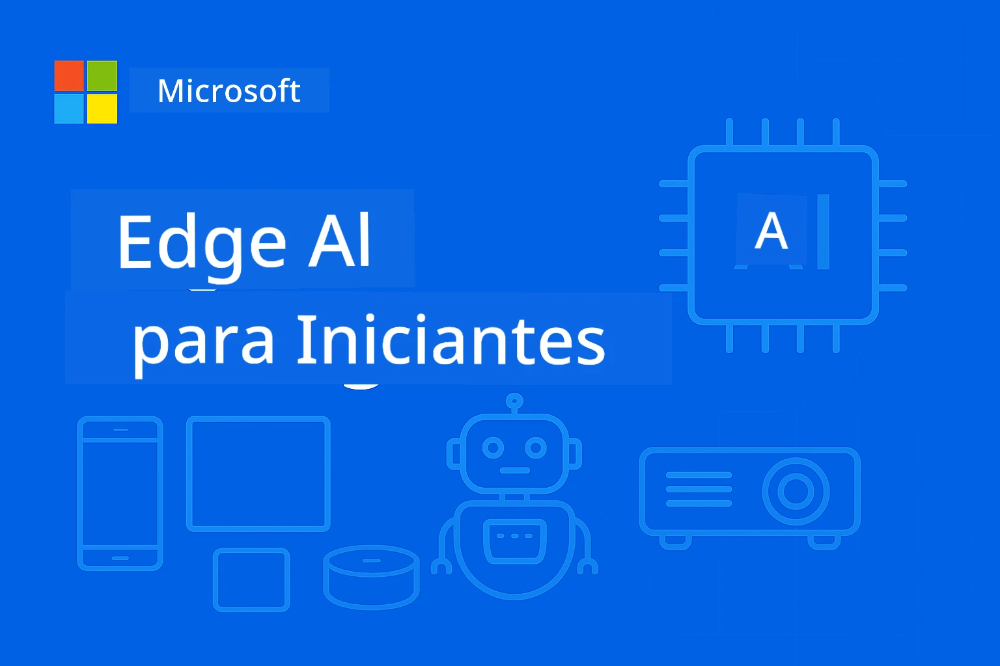

# EdgeAI para Iniciantes 




[](https://GitHub.com/microsoft/edgeai-for-beginners/graphs/contributors)
[](https://GitHub.com/microsoft/edgeai-for-beginners/issues)
[](https://GitHub.com/microsoft/edgeai-for-beginners/pulls)
[](http://makeapullrequest.com)

[](https://GitHub.com/microsoft/edgeai-for-beginners/watchers)
[](https://GitHub.com/microsoft/edgeai-for-beginners/fork)
[](https://GitHub.com/microsoft/edgeai-for-beginners/stargazers)


[](https://discord.gg/nTYy5BXMWG)

Siga estes passos para começar a usar estes recursos:

1. **Faça o Fork do Repositório**: Clique [](https://GitHub.com/microsoft/edgeai-for-beginners/fork)
2. **Clone o Repositório**:   `git clone https://github.com/microsoft/edgeai-for-beginners.git`
3. [**Participe do Azure AI Foundry Discord e conheça especialistas e outros desenvolvedores**](https://discord.com/invite/ByRwuEEgH4)


### 🌐 Suporte Multilíngue

#### Suportado via GitHub Action (Automatizado e Sempre Atualizado)

<!-- CO-OP TRANSLATOR LANGUAGES TABLE START -->
[Árabe](../ar/README.md) | [Bengali](../bn/README.md) | [Búlgaro](../bg/README.md) | [Birmanês (Myanmar)](../my/README.md) | [Chinês (Simplificado)](../zh-CN/README.md) | [Chinês (Tradicional, Hong Kong)](../zh-HK/README.md) | [Chinês (Tradicional, Macau)](../zh-MO/README.md) | [Chinês (Tradicional, Taiwan)](../zh-TW/README.md) | [Croata](../hr/README.md) | [Tcheco](../cs/README.md) | [Dinamarquês](../da/README.md) | [Holandês](../nl/README.md) | [Estoniano](../et/README.md) | [Finlandês](../fi/README.md) | [Francês](../fr/README.md) | [Alemão](../de/README.md) | [Grego](../el/README.md) | [Hebraico](../he/README.md) | [Hindi](../hi/README.md) | [Húngaro](../hu/README.md) | [Indonésio](../id/README.md) | [Italiano](../it/README.md) | [Japonês](../ja/README.md) | [Kannada](../kn/README.md) | [Coreano](../ko/README.md) | [Lituano](../lt/README.md) | [Malaio](../ms/README.md) | [Malaiala](../ml/README.md) | [Marata](../mr/README.md) | [Nepalês](../ne/README.md) | [Pidgin Nigeriano](../pcm/README.md) | [Norueguês](../no/README.md) | [Persa (Farsi)](../fa/README.md) | [Polonês](../pl/README.md) | [Português (Brasil)](./README.md) | [Português (Portugal)](../pt-PT/README.md) | [Punjabi (Gurmukhi)](../pa/README.md) | [Romeno](../ro/README.md) | [Russo](../ru/README.md) | [Sérvio (Cirílico)](../sr/README.md) | [Eslovaco](../sk/README.md) | [Esloveno](../sl/README.md) | [Espanhol](../es/README.md) | [Suaíli](../sw/README.md) | [Sueco](../sv/README.md) | [Tagalog (Filipino)](../tl/README.md) | [Tâmil](../ta/README.md) | [Telugu](../te/README.md) | [Tailandês](../th/README.md) | [Turco](../tr/README.md) | [Ucraniano](../uk/README.md) | [Urdu](../ur/README.md) | [Vietnamita](../vi/README.md)

> **Prefere Clonar Localmente?**

> Este repositório inclui mais de 50 traduções de idiomas que aumentam significativamente o tamanho do download. Para clonar sem as traduções, use sparse checkout:
> ```bash
> git clone --filter=blob:none --sparse https://github.com/microsoft/edgeai-for-beginners.git
> cd edgeai-for-beginners
> git sparse-checkout set --no-cone '/*' '!translations' '!translated_images'
> ```
> Isso fornece tudo o que você precisa para completar o curso com um download muito mais rápido.
<!-- CO-OP TRANSLATOR LANGUAGES TABLE END -->

**Se desejar que idiomas adicionais sejam suportados, eles estão listados [aqui](https://github.com/Azure/co-op-translator/blob/main/getting_started/supported-languages.md)**
## Introdução

Bem-vindo ao **EdgeAI para Iniciantes** – sua jornada completa no mundo transformador da Inteligência Artificial de Borda. Este curso conecta o poder das capacidades de IA com a implementação prática e real em dispositivos de borda, capacitando você a aproveitar o potencial da IA diretamente onde os dados são gerados e decisões precisam ser tomadas.

### O Que Você Vai Dominar

Este curso leva você dos conceitos fundamentais às implementações prontas para produção, cobrindo:
- **Modelos de Linguagem Pequenos (SLMs)** otimizados para implantação na borda
- **Otimização consciente de hardware** em plataformas diversas
- **Inferência em tempo real** com recursos de preservação de privacidade
- **Estratégias de implantação em produção** para aplicações empresariais

### Por Que EdgeAI Importa

Edge AI representa uma mudança de paradigma que atende a desafios modernos críticos:
- **Privacidade & Segurança**: Processa dados sensíveis localmente sem exposição à nuvem
- **Desempenho em Tempo Real**: Elimina latência de rede para aplicações críticas
- **Eficiência de Custo**: Reduz despesas com largura de banda e computação em nuvem
- **Operações Resilientes**: Mantém funcionalidade durante quedas de rede
- **Conformidade Regulamentar**: Atende requisitos de soberania de dados

### Edge AI

Edge AI refere-se à execução de algoritmos de IA e modelos de linguagem localmente no hardware, próximo ao local onde os dados são gerados, sem depender de recursos na nuvem para inferência. Isso reduz latência, melhora a privacidade e possibilita decisões em tempo real.

### Princípios Fundamentais:
- **Inferência no dispositivo**: Modelos de IA rodando em dispositivos de borda (telefones, roteadores, microcontroladores, PCs industriais)
- **Capacidade offline**: Funciona sem conexão persistente com a internet
- **Baixa latência**: Respostas imediatas adequadas para sistemas em tempo real
- **Soberania de dados**: Mantém dados sensíveis localmente, melhorando segurança e conformidade

### Modelos de Linguagem Pequenos (SLMs)

SLMs como Phi-4, Mistral-7B, e Gemma são versões otimizadas de modelos de linguagem grandes — treinados ou destilados para:
- **Redução do uso de memória**: Uso eficiente da memória limitada de dispositivos de borda
- **Menor demanda computacional**: Otimizado para desempenho em CPU e GPU de borda
- **Tempos de inicialização mais rápidos**: Inicialização rápida para aplicações responsivas

Eles desbloqueiam poderosas capacidades de PLN enquanto atendem às restrições de:
- **Sistemas embarcados**: Dispositivos IoT e controladores industriais
- **Dispositivos móveis**: Smartphones e tablets com capacidades offline
- **Dispositivos IoT**: Sensores e dispositivos inteligentes com recursos limitados
- **Servidores de borda**: Unidades de processamento locais com recursos limitados de GPU
- **Computadores pessoais**: Cenários de implantação desktop e laptop

## Módulos do Curso & Navegação

| Módulo | Tópico | Área de Foco | Conteúdo Principal | Nível | Duração |
|--------|-------|------------|-------------|--------|----------|
| [📖 00 ](./introduction.md) | [Introdução ao EdgeAI](./introduction.md) | Fundamentos & Contexto | Visão Geral do EdgeAI • Aplicações na Indústria • Introdução a SLM • Objetivos de Aprendizagem | Iniciante | 1-2 hrs |
| [📚 01](../../Module01) | [Fundamentos do EdgeAI](./Module01/README.md) | Comparação Nuvem vs Edge AI | Fundamentos do EdgeAI • Estudos de Caso do Mundo Real • Guia de Implementação • Implantação na Bord | Iniciante | 3-4 hrs |
| [🧠 02](../../Module02) | [Fundamentos do Modelo SLM](./Module02/README.md) | Famílias de modelos & arquitetura | Família Phi • Família Qwen • Família Gemma • BitNET • μModel • Phi-Silica | Iniciante | 4-5 hrs |
| [🚀 03](../../Module03) | [Prática de Implantação SLM](./Module03/README.md) | Implantação local & na nuvem | Aprendizado Avançado • Ambiente Local • Implantação na Nuvem | Intermediário | 4-5 hrs |
| [⚙️ 04](../../Module04) | [Kit de Ferramentas de Otimização de Modelos](./Module04/README.md) | Otimização multiplataforma | Introdução • Llama.cpp • Microsoft Olive • OpenVINO • Apple MLX • Síntese do Fluxo de Trabalho | Intermediário | 5-6 hrs |
| [🔧 05](../../Module05) | [Produção SLMOps](./Module05/README.md) | Operações de produção | Introdução ao SLMOps • Destilação de Modelos • Fine-tuning • Implantação em Produção | Avançado | 5-6 hrs |
| [🤖 06](../../Module06) | [Agentes de IA & Chamada de Função](./Module06/README.md) | Frameworks de agentes & MCP | Introdução a Agentes • Chamada de Função • Protocolo de Contexto do Modelo | Avançado | 4-5 hrs |
| [💻 07](../../Module07) | [Implementação de Plataforma](./Module07/README.md) | Exemplos multiplataforma | Kit de Ferramentas de IA • Foundry Local • Desenvolvimento Windows | Avançado | 3-4 hrs |
| [🏭 08](../../Module08) | [Kit de Ferramentas Foundry Local](./Module08/README.md) | Exemplos prontos para produção | Aplicações de amostra (veja detalhes abaixo) | Expert | 8-10 hrs |

### 🏭 **Módulo 08: Aplicações de Exemplo**

- [01: REST Chat Quickstart](./Module08/samples/01/README.md)
- [02: Integração OpenAI SDK](./Module08/samples/02/README.md)
- [03: Descoberta & Benchmarking de Modelos](./Module08/samples/03/README.md)
- [04: Aplicação Chainlit RAG](./Module08/samples/04/README.md)
- [05: Orquestração Multi-Agente](./Module08/samples/05/README.md)
- [06: Roteador Modelos-como-Ferramentas](./Module08/samples/06/README.md)
- [07: Cliente API Direto](./Module08/samples/07/README.md)
- [08: Aplicativo de Chat Windows 11](./Module08/samples/08/README.md)
- [09: Sistema Multi-Agente Avançado](./Module08/samples/09/README.md)
- [10: Framework Foundry Tools](./Module08/samples/10/README.md)

### 🎓 **Workshop: Caminho de Aprendizagem Prático**

Materiais completos para workshops práticos com implementações prontas para produção:

- **[Guia do Workshop](./Workshop/Readme.md)** - Objetivos de aprendizagem, resultados e navegação de recursos completos
- **Exemplos em Python** (6 sessões) - Atualizados com melhores práticas, manipulação de erros e documentação abrangente
- **Jupyter Notebooks** (8 interativos) - Tutoriais passo a passo com benchmarks e monitoramento de desempenho
- **Guias de Sessão** - Guias detalhados em markdown para cada sessão do workshop
- **Ferramentas de Validação** - Scripts para verificar qualidade do código e executar testes básicos

**O Que Você Vai Construir:**
- Aplicativos locais de chat AI com suporte a streaming
- Pipelines RAG com avaliação de qualidade (RAGAS)
- Ferramentas de benchmarking e comparação multi-modelo
- Sistemas de orquestração multi-agente
- Roteamento inteligente de modelos com seleção baseada em tarefa

### 🎙️ **Workshop Para Agentic: Hands-On - O Estúdio de Podcast AI**

Construa um pipeline de produção de podcast impulsionado por IA do zero! Este workshop imersivo ensina você a criar um sistema multi-agente completo que transforma ideias em episódios de podcast profissionais.
**[🎬 Comece o Workshop do Estúdio de Podcasts com IA](./WorkshopForAgentic/README.md)**

**Sua Missão**: Lançar "Future Bytes" — um podcast de tecnologia totalmente alimentado por agentes de IA que você mesmo construirá. Sem dependências na nuvem, sem custos de API — tudo roda localmente na sua máquina.

**O Que Torna Isso Único:**
- **🤖 Orquestração Real de Multi-Agentes** - Construa agentes de IA especializados que pesquisam, escrevem e produzem áudio
- **🎯 Pipeline Completo de Produção** - Desde a seleção do tema até a produção final do áudio do podcast
- **💻 Implantação 100% Local** - Usa Ollama e modelos locais (Qwen-3-8B) para total privacidade e controle
- **🎤 Integração de Texto para Fala** - Transforme roteiros em conversas naturais com vários palestrantes
- **✋ Fluxos de Trabalho com Interação Humana** - Portões de aprovação garantem qualidade enquanto mantêm a automação

**Jornada de Aprendizagem em Três Atos:**

| Ato | Foco | Habilidades Chave | Duração |
|-----|-------|--------------------|----------|
| **[Ato 1: Conheça Seus Assistentes de IA](./WorkshopForAgentic/md/01.BuildAIAgentWithSLM.md)** | Construa seu primeiro agente de IA | Integração de ferramentas • Pesquisa na web • Resolução de problemas • Raciocínio agente | 2-3 hrs |
| **[Ato 2: Monte Sua Equipe de Produção](./WorkshopForAgentic/md/02.AIAgentOrchestrationAndWorkflows.md)** | Orquestre múltiplos agentes | Coordenação de equipe • Fluxos de aprovação • Interface DevUI • Supervisão humana | 3-4 hrs |
| **[Ato 3: Dê Vida ao Seu Podcast](./WorkshopForAgentic/md/03.Multi-SpeakerPodcastGenerationWithVibeVoice.md)** | Gere áudio para podcast | Texto para fala • Síntese multi-palestrante • Áudio de longa duração • Automação completa | 2-3 hrs |

**Tecnologias Usadas:**
- **Microsoft Agent Framework** - Orquestração e coordenação multi-agente
- **Ollama** - Tempo de execução de modelo de IA local (sem precisar da nuvem)
- **Qwen-3-8B** - Modelo de linguagem open-source otimizado para tarefas agentes
- **APIs de Texto para Fala** - Síntese de voz natural para geração de podcast

**Suporte de Hardware:**
- ✅ **Modo CPU** - Funciona em qualquer computador moderno (recomenda-se 8GB+ RAM)
- 🚀 **Aceleração GPU** - Inferência significativamente mais rápida com GPUs NVIDIA/AMD
- ⚡ **Suporte NPU** - Aceleração de unidade de processamento neural de próxima geração

**Perfeito Para:**
- Desenvolvedores aprendendo sistemas de IA multi-agentes
- Qualquer pessoa interessada em automação e fluxos de trabalho com IA
- Criadores de conteúdo explorando produção assistida por IA
- Estudantes estudando padrões práticos de orquestração de IA

**Comece a Construir**: [🎙️ Workshop do Estúdio de Podcasts com IA →](./WorkshopForAgentic/README.md)

### 📊 **Resumo do Caminho de Aprendizagem**
- **Duração Total**: 36-45 horas
- **Caminho para Iniciantes**: Módulos 01-02 (7-9 horas)  
- **Caminho Intermediário**: Módulos 03-04 (9-11 horas)
- **Caminho Avançado**: Módulos 05-07 (12-15 horas)
- **Caminho Expert**: Módulo 08 (8-10 horas)

## O Que Você Vai Construir

### 🎯 Competências Principais
- **Arquitetura Edge AI**: Projetar sistemas de IA com prioridade local e integração com nuvem
- **Otimização de Modelos**: Quantizar e comprimir modelos para implantação na borda (85% de aceleração, 75% de redução de tamanho)
- **Implantação Multi-Plataforma**: Windows, mobile, embarcados e sistemas híbridos nuvem-borda
- **Operações de Produção**: Monitoramento, escalonamento e manutenção da IA na borda em produção

### 🏗️ Projetos Práticos
- **Aplicativos Foundry Local Chat**: Aplicativo nativo Windows 11 com troca de modelos
- **Sistemas Multi-Agentes**: Coordenador com agentes especialistas para fluxos de trabalho complexos  
- **Aplicações RAG**: Processamento local de documentos com busca vetorial
- **Roteadores de Modelos**: Seleção inteligente entre modelos baseada em análise de tarefas
- **Frameworks de API**: Clientes prontos para produção com streaming e monitoramento de saúde
- **Ferramentas Cross-Plataforma**: Padrões de integração LangChain/Semantic Kernel

### 🏢 Aplicações na Indústria
**Manufatura** • **Saúde** • **Veículos Autônomos** • **Cidades Inteligentes** • **Apps Mobile**

## Início Rápido

**Caminho Recomendado de Aprendizagem** (20-30 horas no total):

0. **📖 Introdução** ([Introduction.md](./introduction.md)): Fundamentos EdgeAI + contexto da indústria + estrutura de aprendizagem
1. **📚 Fundamentos** (Módulos 01-02): Conceitos EdgeAI + famílias de modelos SLM
2. **⚙️ Otimização** (Módulos 03-04): Implantação + frameworks de quantização  
3. **🚀 Produção** (Módulos 05-06): SLMOps + agentes de IA + chamadas de função
4. **💻 Implementação** (Módulos 07-08): Exemplos de plataforma + kit de ferramentas Foundry Local

Cada módulo inclui teoria, exercícios práticos e exemplos de código prontos para produção.

## Impacto de Carreira

**Papéis Técnicos**: Arquiteto de Soluções EdgeAI • Engenheiro ML (Edge) • Desenvolvedor IoT IA • Desenvolvedor Mobile IA

**Setores da Indústria**: Manufatura 4.0 • Tecnologia em Saúde • Sistemas Autônomos • FinTech • Eletrônicos de Consumo

**Projetos de Portfólio**: Sistemas multi-agentes • Aplicações RAG para produção • Implantação cross-plataforma • Otimização de desempenho

## Estrutura do Repositório

```
edgeai-for-beginners/
├── 📖 introduction.md  # Foundation: EdgeAI Overview & Learning Framework
├── 📚 Module01-04/     # Fundamentals → SLMs → Deployment → Optimization  
├── 🔧 Module05-06/     # SLMOps → AI Agents → Function Calling
├── 💻 Module07/        # Platform Samples (VS Code, Windows, Jetson, Mobile)
├── 🏭 Module08/        # Foundry Local Toolkit + 10 Comprehensive Samples
│   ├── samples/01-06/  # Foundation: REST, SDK, RAG, Agents, Routing
│   └── samples/07-10/  # Advanced: API Client, Windows App, Enterprise Agents, Tools
├── 🌐 translations/    # Multi-language support (8+ languages)
└── 📋 STUDY_GUIDE.md   # Structured learning paths & time allocation
```

## Destaques do Curso

✅ **Aprendizagem Progressiva**: Teoria → Prática → Implantação em produção  
✅ **Estudos de Caso Reais**: Microsoft, Japan Airlines, implementações empresariais  
✅ **Exemplos Práticos**: 50+ exemplos, 10 demos completas Foundry Local  
✅ **Foco em Performance**: Melhorias de velocidade de 85%, reduções de tamanho de 75%  
✅ **Multi-Plataforma**: Windows, mobile, embarcados, híbrido nuvem-borda  
✅ **Pronto para Produção**: Monitoramento, escalonamento, segurança, frameworks de conformidade

📖 **[Guia de Estudo Disponível](STUDY_GUIDE.md)**: Caminho de aprendizagem estruturado de 20 horas com orientação de tempo e ferramentas de autoavaliação.

---

**EdgeAI representa o futuro da implantação de IA**: local-primeiro, preservando privacidade e eficiente. Domine essas habilidades para construir a próxima geração de aplicações inteligentes.

## Outros Cursos

Nossa equipe produz outros cursos! Confira:

<!-- CO-OP TRANSLATOR OTHER COURSES START -->
### LangChain
[](https://aka.ms/langchain4j-for-beginners)
[](https://aka.ms/langchainjs-for-beginners?WT.mc_id=m365-94501-dwahlin)
[](https://github.com/microsoft/langchain-for-beginners?WT.mc_id=m365-94501-dwahlin)
---

### Azure / Edge / MCP / Agentes
[](https://github.com/microsoft/AZD-for-beginners?WT.mc_id=academic-105485-koreyst)
[](https://github.com/microsoft/edgeai-for-beginners?WT.mc_id=academic-105485-koreyst)
[](https://github.com/microsoft/mcp-for-beginners?WT.mc_id=academic-105485-koreyst)
[](https://github.com/microsoft/ai-agents-for-beginners?WT.mc_id=academic-105485-koreyst)

---
 
### Série IA Generativa
[](https://github.com/microsoft/generative-ai-for-beginners?WT.mc_id=academic-105485-koreyst)
[-9333EA?style=for-the-badge&labelColor=E5E7EB&color=9333EA)](https://github.com/microsoft/Generative-AI-for-beginners-dotnet?WT.mc_id=academic-105485-koreyst)
[-C084FC?style=for-the-badge&labelColor=E5E7EB&color=C084FC)](https://github.com/microsoft/generative-ai-for-beginners-java?WT.mc_id=academic-105485-koreyst)
[-E879F9?style=for-the-badge&labelColor=E5E7EB&color=E879F9)](https://github.com/microsoft/generative-ai-with-javascript?WT.mc_id=academic-105485-koreyst)

---
 
### Aprendizagem Core
[](https://aka.ms/ml-beginners?WT.mc_id=academic-105485-koreyst)
[](https://aka.ms/datascience-beginners?WT.mc_id=academic-105485-koreyst)
[](https://aka.ms/ai-beginners?WT.mc_id=academic-105485-koreyst)
[](https://github.com/microsoft/Security-101?WT.mc_id=academic-96948-sayoung)
[](https://aka.ms/webdev-beginners?WT.mc_id=academic-105485-koreyst)
[](https://aka.ms/iot-beginners?WT.mc_id=academic-105485-koreyst)
[](https://github.com/microsoft/xr-development-for-beginners?WT.mc_id=academic-105485-koreyst)

---
 
### Série Copilot
[](https://aka.ms/GitHubCopilotAI?WT.mc_id=academic-105485-koreyst)
[](https://github.com/microsoft/mastering-github-copilot-for-dotnet-csharp-developers?WT.mc_id=academic-105485-koreyst)
[](https://github.com/microsoft/CopilotAdventures?WT.mc_id=academic-105485-koreyst)
<!-- CO-OP TRANSLATOR OTHER COURSES END -->

## Obtendo Ajuda

Se você ficar preso ou tiver alguma dúvida sobre como construir aplicativos de IA, junte-se a:

[](https://discord.gg/nTYy5BXMWG)

Se você tiver feedback sobre o produto ou erros enquanto constrói, visite:

[](https://aka.ms/foundry/forum)

---

<!-- CO-OP TRANSLATOR DISCLAIMER START -->
**Aviso Legal**:  
Este documento foi traduzido utilizando o serviço de tradução por IA [Co-op Translator](https://github.com/Azure/co-op-translator). Embora nos empenhemos para garantir a precisão, esteja ciente de que traduções automatizadas podem conter erros ou imprecisões. O documento original em seu idioma nativo deve ser considerado a fonte autorizada. Para informações críticas, recomenda-se a tradução profissional realizada por humanos. Não nos responsabilizamos por quaisquer mal-entendidos ou interpretações incorretas decorrentes do uso desta tradução.
<!-- CO-OP TRANSLATOR DISCLAIMER END -->