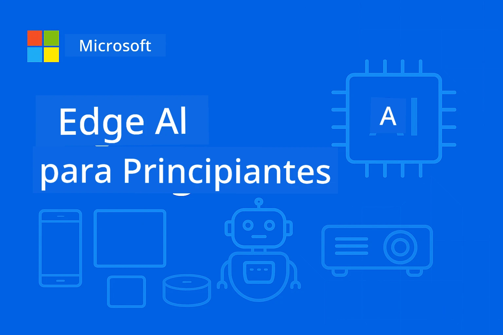

# EdgeAI para Iniciantes 




[](https://GitHub.com/microsoft/edgeai-for-beginners/graphs/contributors)
[](https://GitHub.com/microsoft/edgeai-for-beginners/issues)
[](https://GitHub.com/microsoft/edgeai-for-beginners/pulls)
[](http://makeapullrequest.com)

[](https://GitHub.com/microsoft/edgeai-for-beginners/watchers)
[](https://GitHub.com/microsoft/edgeai-for-beginners/fork)
[](https://GitHub.com/microsoft/edgeai-for-beginners/stargazers)


[](https://discord.gg/nTYy5BXMWG)

Siga estes passos para começar a usar estes recursos:

1. **Faça um Fork do Repositório**: Clique [](https://GitHub.com/microsoft/edgeai-for-beginners/fork)
2. **Clone o Repositório**:   `git clone https://github.com/microsoft/edgeai-for-beginners.git`
3. [**Junte-se ao Azure AI Foundry Discord e conheça especialistas e outros desenvolvedores**](https://discord.com/invite/ByRwuEEgH4)


### 🌐 Suporte Multilíngue

#### Suportado via GitHub Action (Automatizado e Sempre Atualizado)

<!-- CO-OP TRANSLATOR LANGUAGES TABLE START -->
[Árabe](../ar/README.md) | [Bengali](../bn/README.md) | [Búlgaro](../bg/README.md) | [Birmanês (Myanmar)](../my/README.md) | [Chinês (Simplificado)](../zh-CN/README.md) | [Chinês (Tradicional, Hong Kong)](../zh-HK/README.md) | [Chinês (Tradicional, Macau)](../zh-MO/README.md) | [Chinês (Tradicional, Taiwan)](../zh-TW/README.md) | [Croata](../hr/README.md) | [Checo](../cs/README.md) | [Dinamarquês](../da/README.md) | [Holandês](../nl/README.md) | [Estónio](../et/README.md) | [Finlandês](../fi/README.md) | [Francês](../fr/README.md) | [Alemão](../de/README.md) | [Grego](../el/README.md) | [Hebraico](../he/README.md) | [Hindi](../hi/README.md) | [Húngaro](../hu/README.md) | [Indonésio](../id/README.md) | [Italiano](../it/README.md) | [Japonês](../ja/README.md) | [Kannada](../kn/README.md) | [Khmer](../km/README.md) | [Coreano](../ko/README.md) | [Lituano](../lt/README.md) | [Malaio](../ms/README.md) | [Malaiala](../ml/README.md) | [Marata](../mr/README.md) | [Nepali](../ne/README.md) | [Pidgin Nigeriano](../pcm/README.md) | [Norueguês](../no/README.md) | [Persa (Farsi)](../fa/README.md) | [Polaco](../pl/README.md) | [Português (Brasil)](../pt-BR/README.md) | [Português (Portugal)](./README.md) | [Punjabi (Gurmukhi)](../pa/README.md) | [Romeno](../ro/README.md) | [Russo](../ru/README.md) | [Sérvio (Cirílico)](../sr/README.md) | [Eslovaco](../sk/README.md) | [Esloveno](../sl/README.md) | [Espanhol](../es/README.md) | [Suaíli](../sw/README.md) | [Sueco](../sv/README.md) | [Tagalo (Filipino)](../tl/README.md) | [Tamil](../ta/README.md) | [Telugu](../te/README.md) | [Tailandês](../th/README.md) | [Turco](../tr/README.md) | [Ucraniano](../uk/README.md) | [Urdu](../ur/README.md) | [Vietnamita](../vi/README.md)

> **Prefere Clonar Localmente?**
>
> Este repositório inclui mais de 50 traduções de idiomas, o que aumenta significativamente o tamanho do download. Para clonar sem as traduções, utilize o sparse checkout:
>
> **Bash / macOS / Linux:**
> ```bash
> git clone --filter=blob:none --sparse https://github.com/microsoft/edgeai-for-beginners.git
> cd edgeai-for-beginners
> git sparse-checkout set --no-cone '/*' '!translations' '!translated_images'
> ```
>
> **CMD (Windows):**
> ```cmd
> git clone --filter=blob:none --sparse https://github.com/microsoft/edgeai-for-beginners.git
> cd edgeai-for-beginners
> git sparse-checkout set --no-cone "/*" "!translations" "!translated_images"
> ```
>
> Isto fornece tudo o que precisa para completar o curso com um download muito mais rápido.
<!-- CO-OP TRANSLATOR LANGUAGES TABLE END -->

**Se desejar que sejam suportados idiomas de tradução adicionais, estão listados [aqui](https://github.com/Azure/co-op-translator/blob/main/getting_started/supported-languages.md)**
## Introdução

Bem-vindo ao **EdgeAI para Iniciantes** – a sua jornada completa pelo mundo transformador da Inteligência Artificial na Edge. Este curso preenche a lacuna entre as poderosas capacidades da IA e a implementação prática e real em dispositivos edge, capacitando-o a aproveitar o potencial da IA diretamente onde os dados são gerados e as decisões precisam ser tomadas.

### O Que Vai Aprender

Este curso leva-o desde os conceitos fundamentais até implementações prontas para produção, abordando:
- **Modelos de Linguagem Pequenos (SLMs)** otimizados para implementação na edge
- **Otimização consciente do hardware** em plataformas diversas
- **Inferência em tempo real** com capacidades de preservação da privacidade
- **Estratégias de implementação em produção** para aplicações empresariais

### Por Que a EdgeAI é Importante

A Edge AI representa uma mudança de paradigma que aborda desafios críticos da atualidade:
- **Privacidade e Segurança**: Processar dados sensíveis localmente sem exposição na cloud
- **Desempenho em tempo real**: Eliminar a latência da rede para aplicações críticas em tempo
- **Eficiência de custo**: Reduzir despesas com largura de banda e computação na cloud
- **Operações resilientes**: Manter funcionalidade durante interrupções de rede
- **Conformidade regulatória**: Cumprir os requisitos de soberania dos dados

### Edge AI

Edge AI refere-se à execução de algoritmos de IA e modelos de linguagem localmente no hardware, perto do local onde os dados são gerados, sem depender de recursos da cloud para inferência. Reduz a latência, melhora a privacidade e permite tomada de decisão em tempo real.

### Princípios Básicos:
- **Inferência no dispositivo**: Modelos de IA executam-se em dispositivos edge (telemóveis, routers, microcontroladores, PCs industriais)
- **Capacidade offline**: Funciona sem conectividade persistente à internet
- **Baixa latência**: Respostas imediatas adequadas para sistemas em tempo real
- **Soberania dos dados**: Mantém dados sensíveis localmente, melhorando segurança e conformidade

### Modelos de Linguagem Pequenos (SLMs)

SLMs como Phi-4, Mistral-7B e Gemma são versões otimizadas de LLMs maiores — treinados ou destilados para:
- **Reduzir a pegada de memória**: Uso eficiente da memória limitada dos dispositivos edge
- **Menor exigência computacional**: Otimizado para desempenho em CPU e GPU edge
- **Tempos de arranque mais rápidos**: Inicialização rápida para aplicações responsivas

Eles desbloqueiam poderosas capacidades de PNL enquanto cumprem as restrições de:
- **Sistemas embebidos**: Dispositivos IoT e controladores industriais
- **Dispositivos móveis**: Smartphones e tablets com capacidades offline
- **Dispositivos IoT**: Sensores e dispositivos inteligentes com recursos limitados
- **Servidores edge**: Unidades de processamento locais com recursos GPU limitados
- **Computadores pessoais**: Cenários de implementação para desktop e portátil

## Módulos do Curso & Navegação

| Módulo | Tema | Área de Foco | Conteúdo Chave | Nível | Duração |
|--------|-------|------------|-------------|--------|----------|
| [📖 00 ](./introduction.md) | [Introdução à EdgeAI](./introduction.md) | Fundação & Contexto | Visão Geral da EdgeAI • Aplicações na Indústria • Introdução aos SLM • Objetivos de Aprendizagem | Iniciante | 1-2 hrs |
| [📚 01](../../Module01) | [Fundamentos de EdgeAI](./Module01/README.md) | Comparação Cloud vs Edge AI | Fundamentos de EdgeAI • Estudos de Caso Reais • Guia de Implementação • Implementação na Edge | Iniciante | 3-4 hrs |
| [🧠 02](../../Module02) | [Fundamentos do Modelo SLM](./Module02/README.md) | Famílias de modelos & arquitetura | Família Phi • Família Qwen • Família Gemma • BitNET • μModel • Phi-Silica | Iniciante | 4-5 hrs |
| [🚀 03](../../Module03) | [Prática de Implementação SLM](./Module03/README.md) | Implementação local & cloud | Aprendizagem Avançada • Ambiente Local • Implementação Cloud | Intermédio | 4-5 hrs |
| [⚙️ 04](../../Module04) | [Kit de Ferramentas de Otimização de Modelo](./Module04/README.md) | Otimização cross-platform | Introdução • Llama.cpp • Microsoft Olive • OpenVINO • Apple MLX • Síntese de Workflow | Intermédio | 5-6 hrs |
| [🔧 05](../../Module05) | [Produção SLMOps](./Module05/README.md) | Operações em produção | Introdução ao SLMOps • Destilação de Modelos • Ajuste fino • Implementação em produção | Avançado | 5-6 hrs |
| [🤖 06](../../Module06) | [Agentes de IA & Chamada de Função](./Module06/README.md) | Frameworks de agentes & MCP | Introdução a agentes • Chamada de Função • Protocolo de Contexto do Modelo | Avançado | 4-5 hrs |
| [💻 07](../../Module07) | [Implementação na Plataforma](./Module07/README.md) | Exemplos cross-platform | Kit de Ferramentas de IA • Foundry Local • Desenvolvimento Windows | Avançado | 3-4 hrs |
| [🏭 08](../../Module08) | [Kit de Ferramentas Foundry Local](./Module08/README.md) | Exemplos prontos para produção | Aplicações de exemplo (ver detalhes abaixo) | Especialista | 8-10 hrs |

### 🏭 **Módulo 08: Aplicações de Exemplo**

- [01: REST Chat Quickstart](./Module08/samples/01/README.md)
- [02: Integração com OpenAI SDK](./Module08/samples/02/README.md)
- [03: Descoberta e Benchmarking de Modelos](./Module08/samples/03/README.md)
- [04: Aplicação Chainlit RAG](./Module08/samples/04/README.md)
- [05: Orquestração Multi-Agente](./Module08/samples/05/README.md)
- [06: Roteador Models-as-Tools](./Module08/samples/06/README.md)
- [07: Cliente API Direto](./Module08/samples/07/README.md)
- [08: Aplicação de Chat Windows 11](./Module08/samples/08/README.md)
- [09: Sistema Multi-Agente Avançado](./Module08/samples/09/README.md)
- [10: Framework Ferramentas Foundry](./Module08/samples/10/README.md)

### 🎓 **Workshop: Percurso de Aprendizagem Prático**

Material completo para workshops práticos com implementações prontas para produção:

- **[Guia do Workshop](./Workshop/Readme.md)** - Objetivos de aprendizagem, resultados e navegação de recursos completos
- **Exemplos em Python** (6 sessões) - Atualizados com melhores práticas, gestão de erros e documentação abrangente
- **Notebooks Jupyter** (8 interativos) - Tutoriais passo a passo com benchmarks e monitorização de desempenho
- **Guias das Sessões** - Guias detalhados em markdown para cada sessão do workshop
- **Ferramentas de Validação** - Scripts para verificação da qualidade do código e execução de testes básicos

**O Que Vai Construir:**
- Aplicações de chat AI locais com suporte a streaming
- Pipelines RAG com avaliação de qualidade (RAGAS)
- Ferramentas para benchmarking e comparação multi-modelo
- Sistemas de orquestração multi-agente
- Roteamento inteligente de modelos com seleção baseada em tarefa

### 🎙️ **Workshop For Agentic: Prático - The AI Podcast Studio**
Construa uma pipeline de produção de podcast potenciada por IA do zero! Este workshop imersivo ensina-o a criar um sistema multi-agente completo que transforma ideias em episódios de podcast profissionais.

**[🎬 Comece o Workshop AI Podcast Studio](./WorkshopForAgentic/README.md)**

**A Sua Missão**: Lance o "Future Bytes" — um podcast tecnológico totalmente potenciado por agentes de IA que vai construir você mesmo. Sem dependências na cloud, sem custos de API — tudo corre localmente na sua máquina.

**O Que Torna Isto Único:**
- **🤖 Orquestração Real Multi-Agente** - Construa agentes de IA especializados que pesquisam, escrevem e produzem áudio
- **🎯 Pipeline de Produção Completo** - Desde a seleção do tema até à produção final do áudio do podcast
- **💻 Implementação 100% Local** - Utiliza Ollama e modelos locais (Qwen-3-8B) para total privacidade e controlo
- **🎤 Integração de Texto-para-Fala** - Transforme guias em conversas naturais com múltiplos locutores
- **✋ Fluxos de Trabalho com Intervenção Humana** - Portões de aprovação garantem qualidade mantendo a automação

**Jornada de Aprendizagem em Três Atos:**

| Acto | Foco | Competências-Chave | Duração |
|-----|-------|------------|----------|
| **[Acto 1: Conheça os Seus Assistentes de IA](./WorkshopForAgentic/md/01.BuildAIAgentWithSLM.md)** | Construa o seu primeiro agente de IA | Integração de ferramentas • Pesquisa web • Resolução de problemas • Raciocínio agentic | 2-3 hrs |
| **[Acto 2: Monte a Sua Equipa de Produção](./WorkshopForAgentic/md/02.AIAgentOrchestrationAndWorkflows.md)** | Orquestre vários agentes | Coordenação de equipa • Fluxos de aprovação • Interface DevUI • Supervisão humana | 3-4 hrs |
| **[Acto 3: Traga o Seu Podcast à Vida](./WorkshopForAgentic/md/03.Multi-SpeakerPodcastGenerationWithVibeVoice.md)** | Gere áudio para podcast | Texto-para-fala • Síntese multi-locutor • Áudio de longa duração • Automação completa | 2-3 hrs |

**Tecnologias Utilizadas:**
- **Microsoft Agent Framework** - Orquestração e coordenação multi-agente
- **Ollama** - Runtime local de modelos de IA (sem necessidade de cloud)
- **Qwen-3-8B** - Modelo de linguagem open-source otimizado para tarefas agentic
- **APIs de Texto-para-Fala** - Síntese de voz natural para geração de podcast

**Suporte de Hardware:**
- ✅ **Modo CPU** - Funciona em qualquer computador moderno (recomendado 8GB+ RAM)
- 🚀 **Aceleração GPU** - Inferência significativamente mais rápida com GPUs NVIDIA/AMD
- ⚡ **Suporte NPU** - Aceleração por unidade de processamento neural de última geração

**Perfeito Para:**
- Desenvolvedores a aprender sistemas multi-agente de IA
- Qualquer pessoa interessada em automação e fluxos de trabalho IA
- Criadores de conteúdo a explorar produção assistida por IA
- Estudantes a estudar padrões práticos de orquestração IA

**Comece a Construir**: [🎙️ O Workshop AI Podcast Studio →](./WorkshopForAgentic/README.md)

### 📊 **Resumo do Percurso de Aprendizagem**
- **Duração Total**: 36-45 horas
- **Percurso Iniciante**: Módulos 01-02 (7-9 horas)  
- **Percurso Intermédio**: Módulos 03-04 (9-11 horas)
- **Percurso Avançado**: Módulos 05-07 (12-15 horas)
- **Percurso Especialista**: Módulo 08 (8-10 horas)

## O Que Vai Construir

### 🎯 Competências Essenciais
- **Arquitetura Edge AI**: Desenhar sistemas IA local-prioritário com integração cloud
- **Otimização de Modelos**: Quantização e compressão para deployment edge (85% mais rápido, 75% redução de tamanho)
- **Implementação Multi-Plataforma**: Windows, móvel, embebido e sistemas híbridos cloud-edge
- **Operações de Produção**: Monitorização, escalabilidade e manutenção de IA edge em produção

### 🏗️ Projetos Práticos
- **Aplicações de Chat Local Foundry**: Aplicação nativa Windows 11 com troca de modelo
- **Sistemas Multi-Agente**: Coordenador com agentes especialistas para workflows complexos  
- **Aplicações RAG**: Processamento local de documentos com pesquisa vetorial
- **Roteadores de Modelos**: Seleção inteligente entre modelos baseada na análise da tarefa
- **Frameworks de API**: Clientes prontos para produção com streaming e monitorização de saúde
- **Ferramentas Cross-Plataform**: Padrões de integração LangChain/Semantic Kernel

### 🏢 Aplicações na Indústria
**Manufatura** • **Saúde** • **Veículos Autónomos** • **Cidades Inteligentes** • **Apps Móveis**

## Início Rápido

**Percurso de Aprendizagem Recomendado** (20-30 horas no total):

0. **📖 Introdução** ([Introduction.md](./introduction.md)): Fundamentos EdgeAI + contexto industrial + framework de aprendizagem
1. **📚 Fundamentos** (Módulos 01-02): Conceitos EdgeAI + famílias de modelos SLM
2. **⚙️ Otimização** (Módulos 03-04): Deployment + frameworks de quantização  
3. **🚀 Produção** (Módulos 05-06): SLMOps + agentes IA + chamadas de funções
4. **💻 Implementação** (Módulos 07-08): Exemplos de plataformas + toolkit Foundry Local

Cada módulo inclui teoria, exercícios práticos e exemplos de código prontos para produção.

## Impacto na Carreira

**Funções Técnicas**: Arquiteto de Soluções EdgeAI • Engenheiro ML (Edge) • Desenvolvedor IA IoT • Desenvolvedor IA Móvel

**Setores Industriais**: Manufatura 4.0 • Tecnologia de Saúde • Sistemas Autónomos • FinTech • Eletrónica de Consumo

**Projetos de Portefólio**: Sistemas multi-agente • Apps RAG de produção • Deployment cross-platform • Otimização de desempenho

## Estrutura do Repositório

```
edgeai-for-beginners/
├── 📖 introduction.md  # Foundation: EdgeAI Overview & Learning Framework
├── 📚 Module01-04/     # Fundamentals → SLMs → Deployment → Optimization  
├── 🔧 Module05-06/     # SLMOps → AI Agents → Function Calling
├── 💻 Module07/        # Platform Samples (VS Code, Windows, Jetson, Mobile)
├── 🏭 Module08/        # Foundry Local Toolkit + 10 Comprehensive Samples
│   ├── samples/01-06/  # Foundation: REST, SDK, RAG, Agents, Routing
│   └── samples/07-10/  # Advanced: API Client, Windows App, Enterprise Agents, Tools
├── 🌐 translations/    # Multi-language support (8+ languages)
└── 📋 STUDY_GUIDE.md   # Structured learning paths & time allocation
```

## Destaques do Curso

✅ **Aprendizagem Progressiva**: Teoria → Prática → Deployment em produção  
✅ **Estudos de Caso Reais**: Microsoft, Japan Airlines, implementações empresariais  
✅ **Exemplos Práticos**: 50+ exemplos, 10 demos completas Foundry Local  
✅ **Foco em Performance**: Melhorias de velocidade de 85%, reduções de tamanho de 75%  
✅ **Multiplataforma**: Windows, móvel, embebido, híbrido cloud-edge  
✅ **Pronto para Produção**: Monitorização, escalabilidade, segurança, conformidade

📖 **[Guia de Estudo Disponível](STUDY_GUIDE.md)**: Percurso estruturado de 20 horas com orientação de tempo e ferramentas de autoavaliação.

---

**EdgeAI representa o futuro do deployment de IA**: local-prioritário, preservação de privacidade e eficiente. Domine estas competências para construir a próxima geração de aplicações inteligentes.

## Outros Cursos

A nossa equipa produz outros cursos! Veja:

<!-- CO-OP TRANSLATOR OTHER COURSES START -->
### LangChain
[](https://aka.ms/langchain4j-for-beginners)
[](https://aka.ms/langchainjs-for-beginners?WT.mc_id=m365-94501-dwahlin)
[](https://github.com/microsoft/langchain-for-beginners?WT.mc_id=m365-94501-dwahlin)
---

### Azure / Edge / MCP / Agentes
[](https://github.com/microsoft/AZD-for-beginners?WT.mc_id=academic-105485-koreyst)
[](https://github.com/microsoft/edgeai-for-beginners?WT.mc_id=academic-105485-koreyst)
[](https://github.com/microsoft/mcp-for-beginners?WT.mc_id=academic-105485-koreyst)
[](https://github.com/microsoft/ai-agents-for-beginners?WT.mc_id=academic-105485-koreyst)

---
 
### Série IA Generativa
[](https://github.com/microsoft/generative-ai-for-beginners?WT.mc_id=academic-105485-koreyst)
[-9333EA?style=for-the-badge&labelColor=E5E7EB&color=9333EA)](https://github.com/microsoft/Generative-AI-for-beginners-dotnet?WT.mc_id=academic-105485-koreyst)
[-C084FC?style=for-the-badge&labelColor=E5E7EB&color=C084FC)](https://github.com/microsoft/generative-ai-for-beginners-java?WT.mc_id=academic-105485-koreyst)
[-E879F9?style=for-the-badge&labelColor=E5E7EB&color=E879F9)](https://github.com/microsoft/generative-ai-with-javascript?WT.mc_id=academic-105485-koreyst)

---
 
### Aprendizagem Essencial
[](https://aka.ms/ml-beginners?WT.mc_id=academic-105485-koreyst)
[](https://aka.ms/datascience-beginners?WT.mc_id=academic-105485-koreyst)
[](https://aka.ms/ai-beginners?WT.mc_id=academic-105485-koreyst)
[](https://github.com/microsoft/Security-101?WT.mc_id=academic-96948-sayoung)
[](https://aka.ms/webdev-beginners?WT.mc_id=academic-105485-koreyst)
[](https://aka.ms/iot-beginners?WT.mc_id=academic-105485-koreyst)
[](https://github.com/microsoft/xr-development-for-beginners?WT.mc_id=academic-105485-koreyst)

---
 
### Série Copilot

[](https://aka.ms/GitHubCopilotAI?WT.mc_id=academic-105485-koreyst)
[](https://github.com/microsoft/mastering-github-copilot-for-dotnet-csharp-developers?WT.mc_id=academic-105485-koreyst)
[](https://github.com/microsoft/CopilotAdventures?WT.mc_id=academic-105485-koreyst)
<!-- CO-OP TRANSLATOR OTHER COURSES END -->

## Obter Ajuda

Se ficar bloqueado ou tiver alguma dúvida sobre como criar aplicações de IA, junte-se a:

[](https://discord.gg/nTYy5BXMWG)

Se tiver feedback sobre o produto ou erros durante a criação, visite:

[](https://aka.ms/foundry/forum)

---

<!-- CO-OP TRANSLATOR DISCLAIMER START -->
**Aviso Legal**:  
Este documento foi traduzido utilizando o serviço de tradução por IA [Co-op Translator](https://github.com/Azure/co-op-translator). Embora nos esforcemos para garantir a precisão, por favor tenha em conta que traduções automáticas podem conter erros ou imprecisões. O documento original na sua língua nativa deve ser considerado a fonte autorizada. Para informação crítica, recomenda-se a tradução profissional humana. Não nos responsabilizamos por quaisquer mal-entendidos ou interpretações incorretas decorrentes da utilização desta tradução.
<!-- CO-OP TRANSLATOR DISCLAIMER END -->