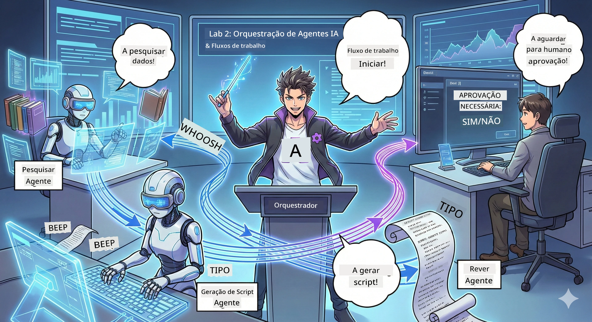

# Acto 2: Reúna a Sua Equipa de Produção de Podcast 🎬



## A Intriga Adensa-se

O Alex (o seu assistente IA do Acto 1) é incrível, mas um agente sozinho não pode comandar todo um estúdio de podcast. Precisa de uma *equipa*:
- 🔍 **Agente de Pesquisa**: Vasculha a internet por informação atualizada
- ✍️ **Agente de Roteiro**: Transforma a pesquisa em diálogos cativantes
- 👤 **Você (O Editor)**: Aprova os roteiros ou devolve para reescrita

Bem-vindo à **Orquestração de Agentes IA** — onde você se torna o diretor da sua própria equipa de IA. Pense nos Vingadores, mas para produção de podcasts.

## O Que é Orquestração de Agentes? (A Versão Simples)

Imagine que está a gerir um restaurante. Você não faz tudo sozinho, certo? Tem:
- 🍳 Um chefe que cozinha
- 👨‍🍳 Um subchefe que prepara
- 👩‍🍳 Um empregado que serve

A orquestração de agentes é a mesma ideia, mas com IA. Cada agente tem uma especialidade, e você coordena-os para alcançar objetivos maiores. Nenhum agente fica sobrecarregado, e o trabalho é feito mais rápido.

### A Analogia da Banda 🎸

Os seus agentes IA são como uma banda:
- **Vocalista principal**: O agente principal que lida com tarefas para os clientes
- **Baterista**: Mantém o ritmo, trata do processamento em segundo plano  
- **Baixista**: Dá suporte a todos, obtém dados
- **Você (O Manager da Banda)**: Coordena tudo!

Sem coordenação? Só há barulho. Com orquestração? Música bonita.

### Porque Isto é Importante

Um agente IA a tentar fazer tudo = esgotamento. Agentes especializados a trabalhar juntos = eficiência desbloqueada! 🚀

**Conversa real**: Lembra-se de tentar pesquisar, escrever E editar seu podcast sozinho? É horrível. Com orquestração, cada agente foca no que faz melhor. Você toma as decisões finais.

**Exemplo real**: Bots de suporte ao cliente que sabem quando tratar de faturação, questões técnicas ou quando chamar um humano. Isso é orquestração!

## Agente vs. Workflow: Qual a Diferença?

Pense assim:

### 🤖 Agente IA = Músico de Jazz
- **Toma decisões espontâneas** com base no que ouve
- **Improvisa** soluções usando as suas ferramentas
- **Pensa** com um cérebro LLM
- **Adapta-se** a tudo o que lhe é apresentado

### 🎵 Workflow = Orquestra a Tocar Música Clássica  
- **Segue uma partitura** (passos pré-definidos)
- Executa de forma **previsível**
- **Coordena** vários agentes, humanos, sistemas
- É **estruturado** como uma receita

**A Magia**: Workflows *orquestram* agentes! Cria um workflow que diz aos agentes quando tocar a sua parte. O melhor dos dois mundos. 🎭

## Três Formas de Coordenar a Sua Equipa IA

### 1. 🎯 Centralizado (Você é o Chefe)

Um agente principal toma todas as decisões. É como gerir uma equipa — você decide quem faz o quê e quando.

**Prós**:
- ✅ Liderança clara (sem confusão)
- ✅ Decisões consistentes
- ✅ Fácil de depurar

**Útil para**:
- Direcionamento de suporte ao cliente ("Isso é faturação ou suporte técnico?")
- Workflows de aprovação de conteúdo ("Este roteiro está aprovado?")
- Produção de podcast (exatamente o que estamos a construir!)

### 2. 🤝 Descentralizado (Agentes Auto-organizados)

Os agentes comunicam diretamente entre si e decidem em grupo. Como num chat de grupo onde todos se coordenam.

**Prós**:
- ✅ Escalabilidade fácil (adicionar mais agentes a qualquer momento)
- ✅ Sem ponto único de falha
- ✅ Colaboração natural entre agentes

**Útil para**:
- Equipas de pesquisa (cada agente explora fontes diferentes)
- Sessões de brainstorming
- Resolução distribuída de problemas

### 3. 🔀 Híbrido (O Melhor dos Dois Mundos)

Você define a direção geral, mas os agentes têm liberdade para se auto-organizarem nas tarefas. Como um CEO que confia na sua equipa.

**Perfeito para**: Projetos complexos que precisam de controlo e flexibilidade.

## Microsoft Agent Framework: A Sua Caixa de Ferramentas para Orquestração 🧰

Hora de construir! Isto é o que vai usar:

### Os Blocos de Construção

#### 1. 🧱 Executors (Os Seus Operários)
- **O que são**: Unidades individuais de processamento — podem ser agentes ou lógica personalizada
- **O que fazem**: Recebem input, fazem o trabalho, produzem output
- **Pense neles como**: Estações numa linha de montagem

#### 2. ➡️ Edges (As Ligações)
- **O que são**: Caminhos entre executores
- **O que fazem**: Controlam o fluxo de mensagens ("Depois do A, ir para B")
- **Pense neles como**: Setas num diagrama de fluxo

#### 3. 🗺️ Workflows (O Plano Mestre)
- **O que são**: O grafo completo de executores + ligações
- **O que fazem**: Definem o processo inteiro do início ao fim
- **Pense neles como**: O esquema da sua pipeline de produção

### Funcionalidades Fixes Que Vai Adorar

**🛡️ Segurança de Tipo**: Mensagens entre agentes são verificadas quanto ao tipo. Nada de surpresas "Ups, tipo de dados errado".

**🔀 Roteamento Flexível**: 
- Condições if-then ("Se aprovado, publica; se não, reescreve")
- Processamento paralelo (vários agentes trabalham em simultâneo)
- Caminhos dinâmicos (workflow adapta-se com base nos resultados)

**🔌 Integração Externa**:
- Ligação a APIs
- Inclusão de pontos de aprovação humana (você aprova antes da publicação)
- Construção de fluxos pedido/resposta

**💾 Checkpointing**: Guarde progresso! Se algo falhar, retoma de onde parou.

**🤝 Coordenação Multi-Agentes**:
- Execute agentes em sequência (A → B → C)
- Execute agentes em paralelo (A + B + C ao mesmo tempo)
- Transfira tarefas entre agentes
- Processamento colaborativo

## Boas Práticas (Dicas de Pro) 🎯

### 1. Mantenha Modular
Cada agente deve fazer UMA coisa muito bem. Não crie um "super agente" que faz tudo — vai arrepender-se quando fizer debugging.

### 2. Planeie para Falhas
Agentes falham. Redes caem. Incorpore tratamento de erros e planos de backup. O seu eu do futuro agradece.

### 3. Monitorize Tudo
Acompanhe o que os seus agentes fazem. Use o DevUI (vamos abordar isto!) para ver os workflows a funcionar.

### 4. Otimize o Tamanho das Mensagens
Não passe ficheiros gigantes entre agentes. Mantenha as mensagens leves para rapidez.

### 5. Escolha o Padrão Certo
Precisa de controlo? Use centralizado. Precisa de escalabilidade? Use descentralizado. Não sabe? Use híbrido!

## DevUI: O Seu Depurador de Workflows 🔍

### O Que é o DevUI?

DevUI é como um laboratório para testar os seus agentes e workflows. É uma interface web onde pode:
- 👀 Ver o seu workflow em ação
- 💬 Conversar diretamente com agentes
- 🔍 Depurar quando algo corre mal
- 📊 Ver traços e métricas de desempenho

> **Importante**: DevUI é só para desenvolvimento! Não use em produção. Pense nele como o seu ambiente local de testes.

### Porque É que É Fabuloso

- **🖥️ UI Web Interativa**: Clique, escreva, teste — nada de linha de comandos
- **📁 Drag-and-Drop**: Carregue ficheiros, teste com diferentes inputs
- **📂 Auto-Descoberta**: Aponte para uma pasta, encontra automaticamente todos os agentes
- **📋 Modo Sem Configuração**: Registe agentes no código, sem precisar de estrutura de pastas
- **🔌 Compatível com OpenAI**: Funciona com o SDK OpenAI (compatibilidade excelente!)
- **👁️ Traços incorporados**: Veja exatamente o que os seus agentes estão a fazer

### Como Funciona o Input

DevUI é inteligente com os inputs:

- **Testa Agentes?** Tem caixas de texto e botões para carregar ficheiros
- **Testa Workflows?** UI gera automaticamente campos de input conforme o workflow espera

Parece magia, mas é só bom código. ✨

## As Suas Missões: Construir um Estúdio de Podcast 🎬

### Missão 1: Criar um Agente Único com DevUI

📂 [01.AgentDevUI](../../../../WorkshopForAgentic/code/02.Workflow/01.AgentDevUI)

**O Desafio**: Antes de construir uma equipa completa, vamos testar o DevUI com um agente: um especialista em pesquisa web.

**O Que Vai Construir**:
Um agente de pesquisa que pode procurar temas de podcast na internet. Vai testá-lo através da interface web do DevUI em `http://localhost:8090`.

**Competências que Vai Aprender**:
- 🚀 Lançar agentes no DevUI
- 🔍 Testar respostas dos agentes em tempo real
- 🛠️ Construir ferramentas personalizadas (pesquisa web)
- 📊 Ativar traços para depurar problemas
- 🖥️ Usar a interface web interativa

**O Código**:
- `agent.py`: O seu SearchAgent com superpoderes de pesquisa web
- Usa OllamaChatClient para ligar ao Qwen
- Implementa a função de ferramenta `web_search()`
- Lança com `serve()` — abre automaticamente o DevUI

**Condição de Vitória**: Pergunte ao seu agente "O que está a ser tendência em IA?" e veja-o pesquisar na web! 🎉

### Missão 2: Construir um Workflow Multi-Agentes

📂 [02.WorkflowDevUI](../../../../WorkshopForAgentic/code/02.Workflow/02.WorkflowDevUI)

**O Desafio**: Agora começa a diversão a sério! Construa um workflow completo de produção de podcast com:
1. 🔍 **Agente de Pesquisa** → Pesquisa o seu tema
2. ✍️ **Agente de Roteiro** → Escreve um diálogo entre dois apresentadores (em chinês!)
3. 👤 **Executor de Revisão** → Pergunta a VOCÊ se aprova ou rejeita
4. 🔄 **Ciclo de Repetição** → Se rejeitado, reescreve com base no seu feedback

**Competências que Vai Aprender**:
- 🧱 Criar agentes especializados para diferentes tarefas
- 🔗 Ligar agentes com WorkflowBuilder
- 🔀 Implementar ciclos de aprovação (humano na cadeia!)
- 🚦 Roteamento condicional (se aprovado vs. rejeitado)
- 🔧 Construir executores customizados para lógica de negócio

**O Workflow**:
```
SearchAgent → ScriptAgent → ReviewExecutor
                             ↑          ↓ (if rejected)
                             ←─────────
```

**O Código**:
- `search_agent/agent.py`: O seu especialista em pesquisa
- `generate_script_agent/agent.py`: O seu roteirista (escreve em chinês!)
- `workflow/workflow.py`: Onde a magia da orquestração acontece
- `main.py`: Lança tudo no DevUI

**Condição de Vitória**: Dê um tema, revise o roteiro, rejeite uma vez para testar o ciclo, depois aprove! 🎉

### Missão 3: Construir uma App de Consola

📂 [03.Application](../../../../WorkshopForAgentic/code/02.Workflow/03.Application)

**O Desafio**: Leve o seu workflow do DevUI e transforme-o numa aplicação terminal elegante com saída a cores, spinners de carregamento e gravação de ficheiros. Isto é pronto para produção!

**Competências que Vai Aprender**:
- ⚡ Executar workflows programaticamente (sem DevUI)
- 📡 Arquitectura orientada a eventos com streaming
- 🎨 Criar interfaces de terminal bonitas (cores, spinners, barras de progresso)
- 💾 Guardar roteiros finais em ficheiros
- 🔄 Gerir workflows assíncronos com asyncio em Python

**O Que Faz**:
1. Pergunta-lhe um tema para podcast
2. Mostra progresso em tempo real ("Agente de Pesquisa a trabalhar...")
3. Exibe o roteiro gerado com cores
4. Pede a sua aprovação
5. Guarda o roteiro aprovado em `podcast.txt`

**O Código**:
- `podcast_app.py`: A sua app principal com gestão de eventos
- `workflow.py`: Reutiliza o workflow da Missão 2
- Trata eventos: `AgentRunUpdateEvent`, `RequestInfoEvent`, `WorkflowOutputEvent`
- Usa cores ANSI para estilização no terminal

**Condição de Vitória**: Execute a app, crie um roteiro de podcast e veja-o guardado! Construíu uma ferramenta real. 🚀

## O Que Você Dominou 🏆

Depois do Acto 2, você consegue:

- ✅ Orquestrar múltiplos agentes IA como um chefe
- ✅ Construir workflows com lógica sequencial E condicional
- ✅ Adicionar pontos de aprovação humana
- ✅ Usar DevUI para testar e depurar workflows
- ✅ Criar aplicações de consola prontas para produção
- ✅ Tratar erros de forma elegante em sistemas complexos
- ✅ Escolher o padrão certo de orquestração para qualquer projeto

## Quando as Coisas Correm Mal 🔧

### "O meu workflow é demasiado complicado!"
**Solução**: Divida em sub-workflows menores. Cada workflow deve fazer UMA coisa bem. Junte-os em cadeia se precisar.

### "Não consigo acompanhar o que está a acontecer!"
**Solução**: Use checkpointing no workflow para guardar estado. Ative o tracing no DevUI para ver cada passo.

### "O erro de um agente derruba tudo!"
**Solução**: Adicione limites de erro. Cada agente deve gerir as suas falhas e ter comportamentos de fallback.

### "Isto é tão lento"
**Solução**: Algum agente pode correr em paralelo? Workflows sequenciais são fáceis mas lentos. Procure oportunidades de paralelização!

## Recursos Úteis 🔗

- [Documentação de Workflow](https://learn.microsoft.com/en-us/agent-framework/user-guide/workflows/overview) — Guias oficiais da Microsoft
- [Padrões de Orquestração](https://www.ibm.com/think/topics/ai-agent-orchestration) — A visão da IBM sobre o tema
- [Agent Framework no GitHub](https://github.com/microsoft/agent-framework) — Explore o código fonte
- [Exemplos de Código](https://github.com/microsoft/agent-framework/tree/main/python/samples) — Roube padrões daqui

---

**Pronto para o final?** Já tem o seu guião. Agora vamos transformá-lo em áudio real! → [Ato 3: Dê Vida ao Seu Podcast](03.Multi-SpeakerPodcastGenerationWithVibeVoice.md) 🎤

---

**Preso? Confuso? Entusiasmado?** Partilhe no chat do workshop! Estamos todos a aprender juntos. 🚀

---

<!-- CO-OP TRANSLATOR DISCLAIMER START -->
**Aviso Legal**:  
Este documento foi traduzido utilizando o serviço de tradução automática [Co-op Translator](https://github.com/Azure/co-op-translator). Embora nos esforcemos por garantir a precisão, por favor tenha em atenção que traduções automáticas podem conter erros ou imprecisões. O documento original na sua língua nativa deve ser considerado a fonte autorizada. Para informações críticas, recomenda-se a tradução profissional realizada por humanos. Não nos responsabilizamos por quaisquer mal-entendidos ou interpretações incorretas resultantes do uso desta tradução.
<!-- CO-OP TRANSLATOR DISCLAIMER END -->