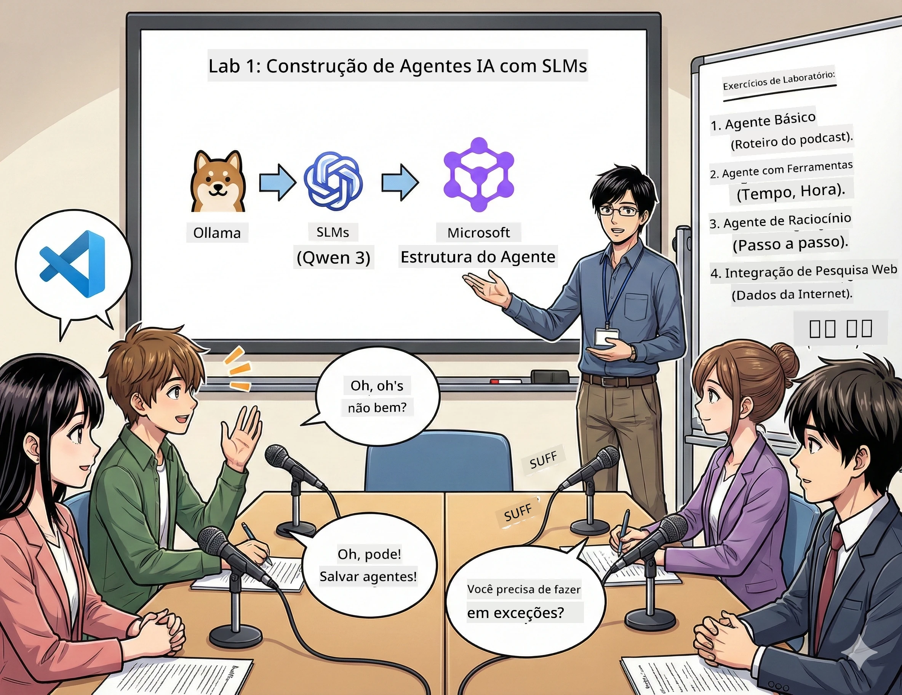

# Ato 1: Conhece o teu Assistente de Pesquisa em IA 🤖

## Desafio

Estás a lançar o "Futuros Bytes", o teu novo podcast de tecnologia. O primeiro episódio é sobre as últimas descobertas em IA, mas só tens 24 horas para:
1. Investigar o tema
2. Encontrar fontes confiáveis
3. Escrever um guião envolvente
4. Fazer com que soe natural

**Reviravolta**: não tens de fazer tudo sozinho. Vais construir o teu primeiro assistente de IA, que pode ajudar com tudo isto. Vamos chamá-lo Alex — o teu parceiro de investigação incansável, que nunca precisa de dormir.

## Por que escolher modelos de linguagem pequenos? (Spoiler: são incríveis)

Pensa nos modelos de linguagem pequenos (SLM) como uma IA pessoal que corre *no teu* computador. Sem nuvem, sem taxas mensais, sem partilha de dados suspeita.

**Por que os SLM são tão 🔥:**
- **🏠 Corre no teu dispositivo**: portátil, desktop, até num Raspberry Pi poderoso
- **💸 Custos contínuos zero**: sem taxas de API a devorar o teu orçamento
- **🔒 Privacidade em primeiro lugar**: os teus dados nunca saem do teu dispositivo
- **⚡ Ultra rápidos**: sem latência de rede, respostas instantâneas
- **🪦 Leves**: 1 a 10 mil milhões de parâmetros vs os 1000 mil milhões dos grandes modelos

**SLM populares**: Qwen 3, Phi-4, Gemma 3 (usamos o Qwen neste workshop)

## A tua caixa de ferramentas

### Ollama: o teu gestor de modelos de IA

[Ollama](https://ollama.com/) é como o Steam para modelos de IA. Usa comandos simples para descarregar, correr e gerir modelos.

**O que o torna fixe:**
- Um só comando para baixar e correr qualquer modelo
- Funciona em Mac, Windows, Linux
- Usa GPU automaticamente, se tiveres uma
- Super eficiente em memória

### Microsoft Agent Framework: onde a magia acontece

[Microsoft Agent Framework](https://github.com/microsoft/agent-framework) é o parque de diversões para construir agentes de IA, que podem:

- 💬 Conversar e lembrar o que discutem
- 🛠️ Usar ferramentas personalizadas (como pesquisar na internet ou ver o tempo)
- 🧠 Pensar passo a passo em problemas complexos
- 🤝 Trabalhar em equipa com outros agentes
- 🔌 Conectar a diferentes fornecedores de IA (OpenAI, Ollama, Azure)

**Componentes para construir:**
- **Agentes (Agents)**: assistentes de IA com tarefas específicas
- **Ferramentas (Tools)**: habilidades especiais que lhes dás
- **Memória (Memory)**: para que não esqueçam as conversas
- **Raciocínio (Reasoning)**: para lhes ensinar a pensar, não só a responder

## O teu treino em montagem: 4 tarefas

### Tarefa 1: cria o teu primeiro agente

📓 [Abre o Notebook](../../code/01.BasicAgent/00.BasicAgent-agent.ipynb)

**Tarefa**: constrói o Alex, o teu assistente de escrita de guiões para podcast. O Alex deve gerar um diálogo de dois apresentadores a discutir temas de tecnologia.

**O que vais aprender:**
- Como acordar um agente de IA (mais fácil que acordar na segunda)
- Dar-lhe personalidade e instruções
- Fazer com que gere guiões realistas para podcast
- Compreender o que ele te responde

**Critério de sucesso**: o Alex cria o guião do piloto do teu podcast "Futuros Bytes" sobre IA! 🎯

### Tarefa 2: dá superpoderes ao Alex (ferramentas!)

📓 [Abre o Notebook](../../code/01.BasicAgent/01.BasicAgent-tools.ipynb)

**Tarefa**: o Alex é esperto, mas não sabe o tempo de hoje nem as horas agora. Vamos resolver isso dando-lhe ferramentas!

**O que vais aprender:**
- Criar funções Python personalizadas como "ferramentas"
- Fazer o Alex decidir *quando* usar cada ferramenta
- Ver como ele resolve problemas de forma autónoma
- Combinar várias ferramentas para tarefas complexas

**Critério de sucesso**: pergunta "Como está o tempo em Tóquio?" e o Alex encontra a resposta sozinho! ☁️

### Tarefa 3: ensina o Alex a pensar

📓 [Abre o Notebook](../../code/01.BasicAgent/02.BasicAgent-reasoning.ipynb)

**Tarefa**: faz o Alex mostrar o seu processo de trabalho. Quando resolve um problema, queres ver *como* pensa, não só a resposta.

**O que vais aprender:**
- Ativar o "modo raciocínio" (como mostrar os cálculos numa aula de matemática)
- Ver o pensamento passo a passo do Alex
- Compreender as cadeias de pensamento
- Fazer debugging quando o Alex se confunde

**Critério de sucesso**: pergunta uma questão matemática difícil e vê o Alex a refletir! 🧠

### Tarefa 4: conecta o Alex à Internet

📓 [Abre o Notebook](../../code/01.BasicAgent/03.BasicAgent-websearch.ipynb)

**Tarefa**: o conhecimento do Alex tem data de validade. Vamos ligá-lo à web para obter informação em tempo real!

**O que vais aprender:**
- Construir uma ferramenta de pesquisa web personalizada
- Integrar APIs externas
- Tratar erros de rede com elegância
- Obter dados para além do que Alex treinou

**Critério de sucesso**: pergunta as notícias tecnológicas de hoje e obtém resultados atualizados! 📰

## Antes de começares 🚀

**Equipamento necessário**:
- Python 3.10+ instalado
- Ollama a correr (verifica com `ollama --version`)
- VS Code com extensão Python
- Pelo menos 8GB de RAM (16GB para mais fluidez)

## Ordem das tarefas

Segue os notebooks pela ordem para uma experiência completa:

1. [00.BasicAgent-agent.ipynb](../../code/01.BasicAgent/00.BasicAgent-agent.ipynb) — Conhece o Alex (o teu primeiro agente)
2. [01.BasicAgent-tools.ipynb](../../code/01.BasicAgent/01.BasicAgent-tools.ipynb) — Hora de upgrade!
3. [02.BasicAgent-reasoning.ipynb](../../code/01.BasicAgent/02.BasicAgent-reasoning.ipynb) — Ensina o Alex a pensar
4. [03.BasicAgent-websearch.ipynb](../../code/01.BasicAgent/03.BasicAgent-websearch.ipynb) — Desbloqueia o acesso à Internet!

## O que irás dominar

Depois do ato 1, vais ser capaz de:

- ✅ Executar modelos de IA no teu próprio hardware (sem nuvem!)
- ✅ Construir agentes com personalidades e competências personalizadas
- ✅ Dar ferramentas aos agentes para resolver problemas reais
- ✅ Fazer os agentes exibirem o seu processo de raciocínio
- ✅ Ligar agentes a fontes externas de dados
- ✅ Depurar quando algo correr mal

## Quando as coisas correrem mal (e como corrigir) 🔧

### "O Alex não carrega! Falta memória!"
**Solução**: O teu computador está a sofrer. Tenta fechar outras aplicações ou usa um modelo mais pequeno. 8GB é o mínimo recomendado.

### "O Alex está lento"
**Solução**: Ativa aceleração GPU nas definições do Ollama. Ou reduz o tamanho da janela de contexto. Modo velocidade demoníaca ligado! 🏎️

### "A ferramenta não funciona!"
**Solução**: Verifica cuidadosamente as assinaturas das funções. O Alex precisa de dicas de tipo corretas para entender as ferramentas. Pensa nisso como dar instruções claras.

## Links úteis 🔗

- [Documentação do Agent Framework](https://github.com/microsoft/agent-framework) — Guia oficial e exemplos
- [Biblioteca de modelos Ollama](https://ollama.com/library) — Explora todos os modelos disponíveis
- [Modelo Qwen](https://ollama.com/library/qwen3) — Conhece o cérebro do teu assistente de IA
- [Exemplos de código](https://github.com/microsoft/agent-framework/tree/main/python/samples) — Inspira-te aqui

## Próximo passo: ato 2 🎬

Já tens um agente. Mas e se tiveres uma *equipa* de agentes a trabalhar em conjunto? No ato 2, vais construir uma equipa completa de produção de podcast:
- **Agente de Pesquisa**: encontra as melhores fontes
- **Agente de Escrita**: cria o guião perfeito
- **Editor (tu!)**: aprova ou pede alterações

Vamos orquestrar um pouco de magia IA! → [Ato 2: Forma a tua equipa de produção](02.AIAgentOrchestrationAndWorkflows.md)

---

**Ficou preso?** Pergunta durante o workshop. Aprendemos juntos! 🙌

---

<!-- CO-OP TRANSLATOR DISCLAIMER START -->
**Aviso Legal**:
Este documento foi traduzido utilizando o serviço de tradução por IA [Co-op Translator](https://github.com/Azure/co-op-translator). Embora nos esforcemos pela precisão, por favor tenha em atenção que traduções automáticas podem conter erros ou imprecisões. O documento original na sua língua nativa deve ser considerado a fonte autorizada. Para informações críticas, recomenda-se a tradução profissional humana. Não nos responsabilizamos por quaisquer mal-entendidos ou interpretações erradas decorrentes do uso desta tradução.
<!-- CO-OP TRANSLATOR DISCLAIMER END -->