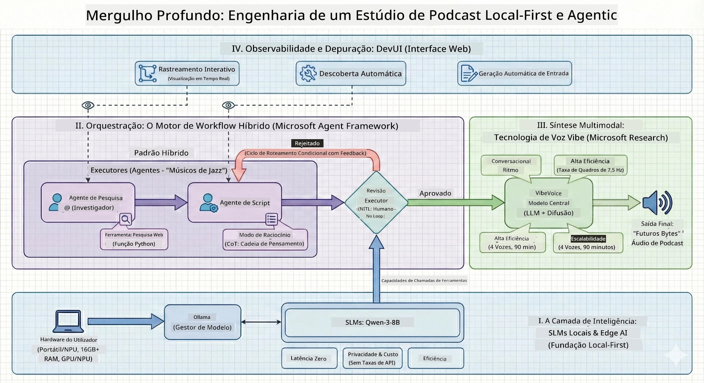

<!--
CO_OP_TRANSLATOR_METADATA:
{
  "original_hash": "f94e745264597bc5d8df967ead2eff97",
  "translation_date": "2026-01-05T10:33:33+00:00",
  "source_file": "WorkshopForAgentic/README.md",
  "language_code": "pt"
}
-->
# 🎙️ Oficina do Estúdio de Podcasts com IA

> 🌏 [中文版 (Versão Chinesa)](translation/zh-cn/README.md)


## A Sua Missão

Bem-vindo ao **Estúdio de Podcasts com IA**! Está prestes a lançar o seu próprio podcast de tecnologia chamado "Future Bytes" — mas aqui está a reviravolta: vai montar uma equipa de produção com IA para o ajudar a criá-lo. Sem mais horas infinitas de pesquisa, escrita de scripts e edição de áudio. Em vez disso, vai programar o seu caminho para se tornar um produtor de podcasts com superpoderes de IA.

## A História

Imagine isto: Você e os seus amigos querem começar um podcast sobre as tendências tecnológicas mais fixes, mas todos estão ocupados com escola, trabalho ou a vida em geral. E se pudesse montar uma equipa de agentes de IA para fazer o trabalho pesado? Um agente investiga os temas, outro escreve scripts envolventes, e um terceiro transforma o texto em conversas naturais. Parece ficção científica? Vamos tornar isso real.

## O Que Vai Aprender

No final desta oficina, vai saber como:
- 🤖 Desplegar o seu próprio modelo de IA local (sem custos de API, sem dependência da cloud!)
- 🔧 Construir agentes de IA especializados que realmente trabalham juntos
- 🎬 Criar uma linha de produção completa de podcasts desde a ideia até ao áudio

## A Sua Jornada: Três Atos



Como em qualquer boa história, temos três atos. Cada um vai construindo o seu estúdio de podcasts com IA peça a peça:

| Episódio | A Sua Missão | O Que Acontece | Competências Desbloqueadas |
|---------|--------------|----------------|-----------------------------|
| **Ato 1** | [Conheça os Seus Assistentes de IA](md/01.BuildAIAgentWithSLM.md) | Descobre como criar agentes de IA que podem conversar, pesquisar na web e até resolver problemas. Pense neles como estagiários de investigação que nunca dormem. | 🎯 Construa o seu primeiro agente<br>🛠️ Dê-lhe superpoderes (ferramentas!)<br>🧠 Ensine-o a pensar<br>🌐 Ligue-o à internet |
| **Ato 2** | [Reúna a Sua Equipa de Produção](md/02.AIAgentOrchestrationAndWorkflows.md) | Agora as coisas ficam interessantes! Vai orquestrar múltiplos agentes de IA para trabalharem em conjunto como uma verdadeira equipa de podcast. Um pesquisa, outro escreve, você aprova — o trabalho em equipa é que faz o sonho acontecer. | 🎭 Coordene múltiplos agentes<br>🔄 Construa processos de aprovação<br>🖥️ Teste com a interface DevUI<br>✋ Mantenha os humanos no controlo |
| **Ato 3** | [Dê Vida ao Seu Podcast](md/03.Multi-SpeakerPodcastGenerationWithVibeVoice.md) | O grand finale! Transforme os seus scripts em áudio de podcast real com vozes realistas e conversas naturais. O seu podcast "Future Bytes" está pronto para estrear! | 🎤 Magia do texto para fala<br>👥 Vozes de múltiplos oradores<br>⏱️ Áudio de longa duração<br>🚀 Automação completa |

Cada ato desbloqueia novas habilidades. Avance se for corajoso, mas recomendamos seguir a história!

## Requisitos do Ambiente

Esta oficina suporta vários ambientes de hardware:
- **CPU**: Adequado para testes e uso em pequena escala
- **GPU**: Recomendado para ambientes de produção, melhora significativamente a velocidade de inferência
- **NPU**: Suporta aceleração por unidade de processação neural de próxima geração

## O Que Vai Precisar

### Lista de Software ✅
- **Python 3.10+** (A sua linguagem de programação)
- **Ollama** (Executa modelos de IA no seu computador)
- **VS Code** (O seu editor de código)
- **Extensão Python** (Torna o VS Code mais inteligente)
- **Git** (Para obter o código)

### Verificação de Hardware 💻
- **Posso executar isto?**: 8GB RAM, 10GB de espaço livre (funciona, mas pode ser lento)
- **Configuração ideal**: 16GB+ RAM, uma GPU decente (funcionamento fluido!)
- **Tem uma NPU?**: Ainda melhor! Performance de próxima geração desbloqueada 🚀

## Monte o Seu Estúdio 🎬

### Passo 1: Potencie o Python

Certifique-se que tem Python 3.10 ou superior:

```bash
python --version
# Deve mostrar Python 3.10.x ou superior
```

Não tem Python? Instale em [python.org](https://python.org) — é grátis!

### Passo 2: Obtenha o Ollama (O Executor dos Modelos de IA)

Vá a [ollama.ai](https://ollama.ai) e descarregue o Ollama para o seu sistema operativo. Pense nele como o motor que executa os seus modelos de IA localmente.

Verifique se está pronto:

```bash
ollama --version
```

### Passo 3: Descarregue o Seu Cérebro de IA 🧠

Está na hora de obter o modelo Qwen-3-8B (é como contratar o seu primeiro assistente IA):

```bash
ollama pull qwen3:8b
```

*Isto pode demorar alguns minutos. O momento perfeito para um café! ☕*

### Passo 4: Prepare o VS Code

Descarregue [Visual Studio Code](https://code.visualstudio.com/) se ainda não o tem. É o melhor editor de código que existe (lute comigo 😄).

### Passo 5: Extensão do Python

No VS Code:
1. Pressione `Ctrl+Shift+X` (ou `Cmd+Shift+X` no Mac)
2. Procure "Python"
3. Instale a extensão oficial da Microsoft para Python

### Passo 6: Está Tudo Pronto! 🎉

A sério, está pronto para arrasar. Vamos construir alguma magia com IA!

### Passo 7: Instale o Microsoft Agent Framework e Pacotes Relacionados 📦

Instale todas as dependências necessárias para a oficina:

```bash
pip install -r ./Installations/requirements.txt -U
```

*Isto irá instalar o Microsoft Agent Framework e todos os pacotes necessários. Aproveite um café — a instalação pela primeira vez pode levar alguns minutos! ☕*

## Instruções da Oficina

A estrutura do projeto, passos de configuração e métodos de execução serão explicados passo a passo durante a oficina.

## Resolução de Problemas (Quando as Coisas Correm Mal) 🔧

### "Ugh, o download do modelo está a demorar uma eternidade!"
**Solução**: Use uma VPN ou configure o Ollama com uma fonte mirror. Às vezes a internet simplesmente não colabora.

### "O meu computador está a morrer! Memória insuficiente!"
**Solução**: Mude para um modelo mais pequeno ou ajuste a configuração `num_ctx` para usar menos memória. Pense nisso como pôr a sua IA em dieta.

### "Posso acelerar isto com a minha GPU?"
**Solução**: Ollama detecta GPUs automaticamente! Só precisa garantir que os drivers da sua GPU estão atualizados. Aceleração grátis! 🏎️

## Recursos Extras (Para os Curiosos) 📚

- [Documentação Ollama](https://github.com/ollama/ollama) — Mergulho profundo em modelos de IA locais
- [Microsoft Agent Framework](https://microsoft.github.io/autogen/) — Saiba mais sobre a criação de equipas de agentes
- [Informação sobre o Modelo Qwen](https://qwenlm.github.io/) — Conheça o cérebro do seu assistente IA

## Licença

Licença MIT — Crie coisas fixes, partilhe-as, torne o mundo um lugar melhor! 🌍

## Quer Contribuir?

Encontrou um erro? Tem uma ideia? Abra um Issue ou PR! Adoramos o espírito da comunidade. ✨

---

<!-- CO-OP TRANSLATOR DISCLAIMER START -->
**Aviso Legal**:  
Este documento foi traduzido utilizando o serviço de tradução por IA [Co-op Translator](https://github.com/Azure/co-op-translator). Embora nos esforcemos para garantir a precisão, por favor tenha em atenção que traduções automáticas podem conter erros ou imprecisões. O documento original na sua língua nativa deve ser considerado a fonte autorizada. Para informações críticas, recomenda-se a tradução profissional feita por humanos. Não nos responsabilizamos por quaisquer mal-entendidos ou interpretações incorretas decorrentes do uso desta tradução.
<!-- CO-OP TRANSLATOR DISCLAIMER END -->