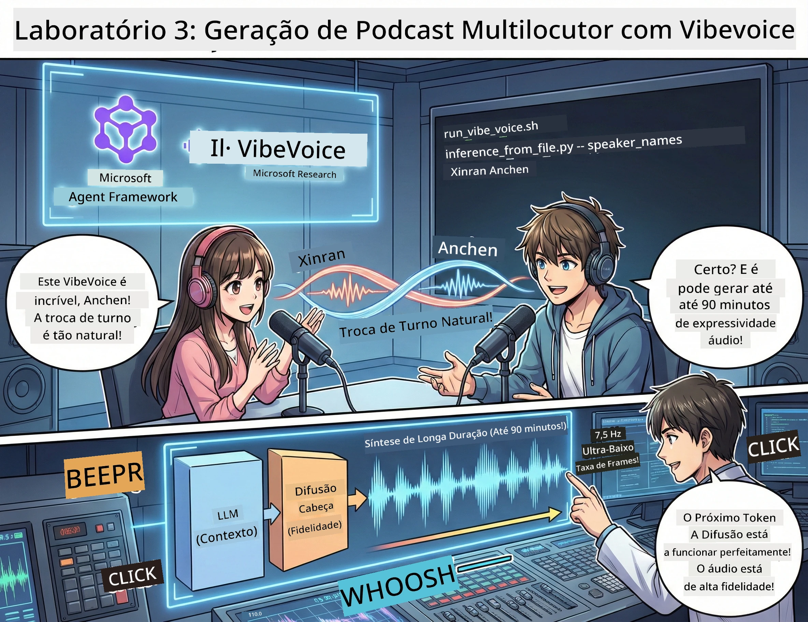

<!--
CO_OP_TRANSLATOR_METADATA:
{
  "original_hash": "d5c8bb53a007e77e7f8afe3067e64c55",
  "translation_date": "2026-01-05T15:56:14+00:00",
  "source_file": "WorkshopForAgentic/translation/zh-cn/03.Multi-SpeakerPodcastGenerationWithVibeVoice.md",
  "language_code": "pt"
}
-->
# Ato Três: Dê Vida ao Seu Podcast 🎤



## O Grande Final

Já pesquisaste o tema. Já escreveste o guião. Agora é hora do toque final: converte o teu texto em áudio de podcast realista com vozes autênticas!

Apresentamos o **VibeVoice** — a magia TTS (texto para fala) open-source da Microsoft Research que cria:
- 🎭 Conversas naturais e fluidas
- 👥 Vários oradores (até 4!)
- ⏱️ Áudio de formato longo (até 90 minutos!)
- 🎵 Entrega expressiva (não som de robô!)

Esta é a tecnologia por trás da síntese de podcasts. Vamos criar o teu!

## O que é o VibeVoice? (coisa fixe)

O VibeVoice é o presente da Microsoft Research para o mundo. Foi especialmente desenhado para áudio de conversas no estilo podcast.

### Porque é que é incrível 🔥

* **⏱️ Conversas de Maratona**: gera voz contínua por até 90 minutos (um episódio de podcast completo!)
* **👥 Magia de múltiplos oradores**: até 4 vozes diferentes, cada uma com personalidade consistente
* **⚡ Ultra eficiente**: usa uma taxa de quadros super baixa de 7,5 Hz para poupar poder computacional
* **🧠 Áudio inteligente**: combina LLM (compreensão de contexto) com modelos de difusão (criação de áudio realista)
* **🎭 Natural e fluido**: gere automaticamente turnos de fala, pausas e ritmo da conversa

**Em resumo**: o VibeVoice não se limita a ler o teu guião — ele *interpreta* como uma pessoa a falar.

---

## Antes de Começar 🚀

**O que precisas**:

* 🐍 **Python 3.10+** (já tens das Atos 1 e 2)
* 🚀 **uv** (um gerenciador de pacotes Python rápido — nós vamos instalá-lo)
* 📝 **O teu guião**: o ficheiro `podcast.txt` do Ato 2 (em `../03.Application/`)

**Dica profissional**: este passo precisa de uma boa ligação à Internet para descarregar modelos pré-treinados. Bebe um café! ☕

---

## Vamos lá! Método simples 🎬

Fizemos isto super simples. Um script shell faz tudo.

### Processo

1. **Torna-o executável**:
```bash
chmod +x run_vibe_voice.sh
```

2. **Corre-o**:
```bash
./run_vibe_voice.sh
```

3. **Espera pela magia** (a primeira execução pode demorar alguns minutos)

### O que está a acontecer nos bastidores 🎭

O script é basicamente o teu engenheiro de som automático:

1. **📥 Descarrega o VibeVoice**: clona o repositório oficial do GitHub
2. **📦 Instala dependências**: usa `uv pip` para instalação rápida dos pacotes
3. **🎬 Gera áudio**: corre o script de inferência com:
   * `--model_path`: modelo pré-treinado VibeVoice-7B
   * `--txt_path`: o teu guião `podcast.txt`
   * `--speaker_names`: nomes atribuídos às vozes (padrão Xinran e Anchen)

**Resultado**: o teu guião transformado num episódio real de podcast! 🎉

---

## A tua tarefa 🎯

Vamos divertir-nos com isto:

### Tarefa 1: Cria conteúdo
Edita `../03.Application/podcast.txt` com uma conversa entre duas pessoas. Pode ser sobre tecnologia, hobbies, o que quiseres! Apenas torna-o conversacional.

**Exemplo de formato**:
```
说话人 1：嘿！你听说新的 AI 模型了吗？
说话人 2：不会吧！告诉我更多！
说话人 1：它叫...
```

### Tarefa 2: Gera áudio
Executa o script e observa a magia acontecer. A primeira vez vai demorar mais (descarga de modelos).

### Tarefa 3: Ouve e analisa
- Soa natural?
- Os oradores têm vozes diferentes?
- O revezamento está fluido?
- Há momentos robóticos?

### Tarefa 4: Experimenta (para corajosos)
Edita `run_vibe_voice.sh` e altera `--speaker_names` para experimentar diferentes combinações de vozes. O VibeVoice tem várias vozes pré-treinadas!

**Desafio extra**: tenta uma conversa com 3 oradores! 🎆

---

## Aprende mais 📚

* **🏠 Página do projeto**: [VibeVoice site oficial](https://microsoft.github.io/VibeVoice/)
* **🤗 Modelos pré-treinados**: [Hugging Face - VibeVoice-7B](https://huggingface.co/vibevoice/VibeVoice-7B)
* **📖 Artigo científico**: aprofunda a tecnologia (se estiveres interessado)

> **⚠️ Lembrete de IA responsável**: o VibeVoice é poderoso. Usa-o eticamente! Não cries deepfakes ou conteúdos enganosos. Cria coisas fixes que ajudam as pessoas. 🙏

---

## 🏆 Parabéns! Concluíste!

Acabaste de fazer o fluxo completo:
1. ✅ **Ato 1**: constrói agentes de IA personalizáveis
2. ✅ **Ato 2**: orquestra workflows multi-agentes
3. ✅ **Ato 3**: gera áudio de podcast realista

**Agora tens**:
- Um assistente de investigação em IA funcional
- Um fluxo completo para criação de podcasts
- Áudio real para partilhar

### O próximo passo? 🚀

**Lança o teu podcast!**
- Faz upload nas plataformas de podcast
- Partilha nas redes sociais
- Itera e melhora

**Continua a construir!**
- Experimenta temas diferentes
- Testa mais oradores
- Adiciona música de fundo
- Cria uma interface Web
- Automatiza o processo inteiro

**Partilha a tua criação!**
Marca-nos! Mostra ao mundo o que construíste. A revolução do podcast em IA começa contigo. 🎙️

---

**Perguntas? Ideias? Histórias de sucesso?** Partilha no chat do workshop!

**Bem-vindo ao futuro da criação de conteúdos.** 🌟

---

<!-- CO-OP TRANSLATOR DISCLAIMER START -->
**Aviso Legal**:
Este documento foi traduzido utilizando o serviço de tradução automática [Co-op Translator](https://github.com/Azure/co-op-translator). Embora nos esforcemos por garantir a precisão, esteja ciente de que traduções automatizadas podem conter erros ou imprecisões. O documento original na sua língua nativa deve ser considerado a fonte oficial. Para informações críticas, recomenda-se a tradução profissional humana. Não nos responsabilizamos por quaisquer mal-entendidos ou interpretações erradas decorrentes do uso desta tradução.
<!-- CO-OP TRANSLATOR DISCLAIMER END -->