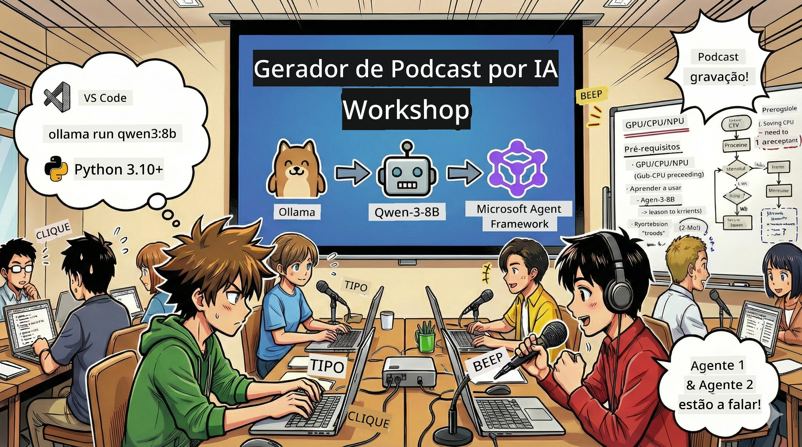

<!--
CO_OP_TRANSLATOR_METADATA:
{
  "original_hash": "aa775a734bda4590ecbe3a94a3b62197",
  "translation_date": "2026-01-05T17:37:06+00:00",
  "source_file": "WorkshopForAgentic/translation/zh-cn/README.md",
  "language_code": "pt"
}
-->
# 🎙️ Oficina do Estúdio de Podcast AI



## A tua missão

Bem-vindo ao **Estúdio de Podcast AI**! Estás prestes a lançar o teu próprio podcast de tecnologia "Future Bytes" — mas com uma reviravolta: vais construir uma equipa de produção movida a IA para te ajudar a criá-lo. Nada mais de pesquisas intermináveis, escrita de guião e edição de áudio. Em vez disso, vais programar para te tornares um produtor de podcast com superpoderes IA.

## Contexto da história

Imagina: tu e amigos querem começar um podcast sobre as tendências tecnológicas mais fixes, mas estão todos ocupados entre estudo, trabalho e vida. E se conseguisses criar uma equipa de agentes IA para fazer o trabalho pesado? Um agente investiga os temas, outro escreve guiões cativantes, e um terceiro transforma o texto em conversas naturais e fluídas. Parece ficção científica? Vamos tornar isto realidade.

## O que vais aprender

No final desta oficina, vais saber como:
- 🤖 Implantar os teus próprios modelos IA locais (sem custos de API, sem dependência da cloud!)
- 🔧 Construir agentes IA profissionais que colaboram de forma prática
- 🎬 Criar um fluxo de produção completo de podcast, da ideia ao áudio

## A tua jornada: três atos

Como em qualquer boa história, temos três atos. Cada ato vai construindo passo a passo o teu estúdio de podcast IA:

| Capítulo | A tua tarefa | O que acontece | Competências desbloqueadas |
|---------|-----------|--------------|----------------|
| **Ato 1** | [Conhece o teu assistente IA](01.BuildAIAgentWithSLM.md) | Vais descobrir como criar agentes IA que conseguem conversar, pesquisar na web e até resolver problemas. Imagina-os como estagiários investigadores que nunca dormem. | 🎯 Construir o teu primeiro agente<br>🛠️ Dar-lhe superpoderes (ferramentas!)<br>🧠 Ensinar a pensar<br>🌐 Ligar à internet |
| **Ato 2** | [Formar a tua equipa de produção](02.AIAgentOrchestrationAndWorkflows.md) | Agora é que a coisa fica divertida! Vais orquestrar vários agentes IA para trabalharem em equipa como num verdadeiro estúdio de podcast. Um pesquisa, outro escreve, tu aprovas — o trabalho em equipa faz acontecer. | 🎭 Coordenar múltiplos agentes<br>🔄 Criar fluxos de aprovação<br>🖥️ Testar a interface DevUI<br>✋ Manter controlo humano |
| **Ato 3** | [Dar vida ao teu podcast](03.Multi-SpeakerPodcastGenerationWithVibeVoice.md) | O grande final! Transforma os teus guiões em áudio real com vozes realistas e conversas naturais. O teu podcast "Future Bytes" está pronto para lançar! | 🎤 Magia do texto para fala<br>👥 Vozes multi-orador<br>⏱️ Áudio de formato longo<br>🚀 Totalmente automatizado |

Cada ato desbloqueia novas capacidades. Se fores corajoso, podes saltar capítulos, mas recomendamos seguir a ordem!

## Requisitos do ambiente

Esta oficina suporta vários ambientes de hardware:
- **CPU**: adequado para testes e uso de pequena escala
- **GPU**: recomendado para produção, acelera muito a inferência
- **NPU**: suporta unidades neuronais de próxima geração para aceleração

## O que precisas

### Lista de software ✅
- **Python 3.10+** (a tua linguagem de programação)
- **Ollama** (para correr modelos IA no teu computador)
- **VS Code** (o teu editor de código)
- **Extensão Python** (para tornar o VS Code mais inteligente)
- **Git** (para obter o código)

### Verificação do hardware 💻
- **Conseguirei correr?**: 8GB RAM, 10GB de espaço disponível (funciona, mas pode estar lento)
- **Configuração ideal**: 16GB+ RAM, uma boa GPU (funcionamento fluido!)
- **Tens NPU?**: Ainda melhor! Liberta performance da próxima geração 🚀

## Monta o teu estúdio 🎬

### Passo 1: Atualiza o Python

Assegura que tens Python 3.10 ou superior:

```bash
python --version
# Deve mostrar Python 3.10.x ou superior
```

Não tens Python? Obtém em [python.org](https://python.org) — é grátis!

### Passo 2: Obtém Ollama (o motor para modelos IA)

Visita [ollama.ai](https://ollama.ai) para descarregar o Ollama apropriado para o teu sistema operativo. Pensa nele como o motor para correr IA localmente.

Confirma que está pronto:

```bash
ollama --version
```

### Passo 3: Descarrega o teu cérebro IA 🧠

É hora de obter o modelo Qwen-3-8B (como contratar o teu primeiro assistente IA):

```bash
ollama pull qwen3:8b
```

*Isto pode demorar alguns minutos. Tempo perfeito para um café! ☕*

### Passo 4: Configura o VS Code

Se ainda não tiveres, instala o [Visual Studio Code](https://code.visualstudio.com/). É o melhor editor de código (duvidas? 😄).

### Passo 5: Extensão Python

No VS Code:
1. Pressiona `Ctrl+Shift+X` (no Mac `Cmd+Shift+X`)
2. Procura por "Python"
3. Instala a extensão oficial da Microsoft para Python

### Passo 6: Está feito! 🎉

A sério, estás pronto. Vamos criar alguma magia IA!

### Passo 7: Instala o Microsoft Agent Framework e pacotes relacionados 📦

Instala todas as dependências necessárias para a oficina:

```bash
pip install -r ./Installations/requirements.txt -U
```

*Isso vai instalar o Microsoft Agent Framework e todos os pacotes essenciais. Vai buscar um café — a primeira instalação pode demorar! ☕*

## Notas da oficina

A estrutura do projeto, passos de configuração e execução serão explicados detalhadamente durante a oficina.

## Solução de problemas (quando algo corre mal) 🔧

### "Ei, o download do modelo é muito lento!"
**Solução**: Usa um VPN ou configura um espelho para o Ollama. Às vezes a rede não ajuda.

### "O meu computador vai travar! Memória insuficiente!"
**Solução**: Usa um modelo mais pequeno ou ajusta a definição `num_ctx` para consumir menos memória. Pensa nisso como uma dieta para o teu IA.

### "Consigo usar GPU para acelerar?"
**Solução**: Ollama detecta automaticamente GPUs! Só certifica-te que os drivers da GPU estão atualizados. Aceleração grátis! 🏎️

## Recursos adicionais (para os curiosos) 📚

- [Documentação Ollama](https://github.com/ollama/ollama) — Aprende mais sobre modelos IA locais
- [Microsoft Agent Framework](https://microsoft.github.io/autogen/) — Aprende sobre construir equipas de agentes inteligentes
- [Informações do modelo Qwen](https://qwenlm.github.io/) — Conhece o cérebro do teu assistente IA

## Licença

Licença MIT — cria coisas fixes, partilha-as, torna o mundo melhor! 🌍

## Queres contribuir?

Encontraste bugs? Tens ideias? Submete Issues ou PR! Adoramos a vibe da comunidade. ✨

---

<!-- CO-OP TRANSLATOR DISCLAIMER START -->
**Aviso Legal**:
Este documento foi traduzido utilizando o serviço de tradução automática [Co-op Translator](https://github.com/Azure/co-op-translator). Embora nos esforcemos pela precisão, por favor, tenha em atenção que traduções automáticas podem conter erros ou imprecisões. O documento original na sua língua nativa deve ser considerado a fonte autorizada. Para informação crítica, recomenda-se tradução profissional humana. Não nos responsabilizamos por quaisquer mal-entendidos ou interpretações erradas decorrentes da utilização desta tradução.
<!-- CO-OP TRANSLATOR DISCLAIMER END -->