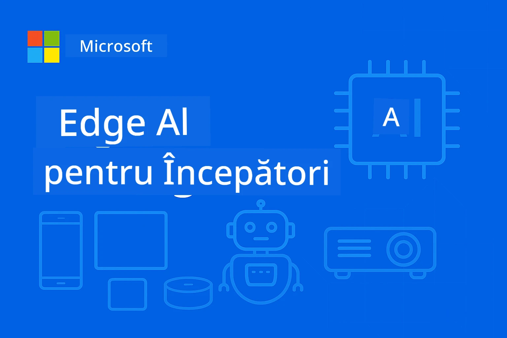

# EdgeAI pentru Începători




[](https://GitHub.com/microsoft/edgeai-for-beginners/graphs/contributors)
[](https://GitHub.com/microsoft/edgeai-for-beginners/issues)
[](https://GitHub.com/microsoft/edgeai-for-beginners/pulls)
[](http://makeapullrequest.com)

[](https://GitHub.com/microsoft/edgeai-for-beginners/watchers)
[](https://GitHub.com/microsoft/edgeai-for-beginners/fork)
[](https://GitHub.com/microsoft/edgeai-for-beginners/stargazers)


[](https://discord.gg/nTYy5BXMWG)

Urmați acești pași pentru a începe să utilizați aceste resurse:

1. **Fă un Fork al Repozitoriului**: Click [](https://GitHub.com/microsoft/edgeai-for-beginners/fork)
2. **Clonează Repozitoriul**:   `git clone https://github.com/microsoft/edgeai-for-beginners.git`
3. [**Alătură-te Discord-ului Azure AI Foundry și întâlnește experți și alți dezvoltatori**](https://discord.com/invite/ByRwuEEgH4)


### 🌐 Suport Multilingv

#### Suportat prin GitHub Action (Automatizat & Întotdeauna Actualizat)

<!-- CO-OP TRANSLATOR LANGUAGES TABLE START -->
[Arabic](../ar/README.md) | [Bengali](../bn/README.md) | [Bulgarian](../bg/README.md) | [Burmese (Myanmar)](../my/README.md) | [Chinese (Simplified)](../zh-CN/README.md) | [Chinese (Traditional, Hong Kong)](../zh-HK/README.md) | [Chinese (Traditional, Macau)](../zh-MO/README.md) | [Chinese (Traditional, Taiwan)](../zh-TW/README.md) | [Croatian](../hr/README.md) | [Czech](../cs/README.md) | [Danish](../da/README.md) | [Dutch](../nl/README.md) | [Estonian](../et/README.md) | [Finnish](../fi/README.md) | [French](../fr/README.md) | [German](../de/README.md) | [Greek](../el/README.md) | [Hebrew](../he/README.md) | [Hindi](../hi/README.md) | [Hungarian](../hu/README.md) | [Indonesian](../id/README.md) | [Italian](../it/README.md) | [Japanese](../ja/README.md) | [Kannada](../kn/README.md) | [Korean](../ko/README.md) | [Lithuanian](../lt/README.md) | [Malay](../ms/README.md) | [Malayalam](../ml/README.md) | [Marathi](../mr/README.md) | [Nepali](../ne/README.md) | [Nigerian Pidgin](../pcm/README.md) | [Norwegian](../no/README.md) | [Persian (Farsi)](../fa/README.md) | [Polish](../pl/README.md) | [Portuguese (Brazil)](../pt-BR/README.md) | [Portuguese (Portugal)](../pt-PT/README.md) | [Punjabi (Gurmukhi)](../pa/README.md) | [Romanian](./README.md) | [Russian](../ru/README.md) | [Serbian (Cyrillic)](../sr/README.md) | [Slovak](../sk/README.md) | [Slovenian](../sl/README.md) | [Spanish](../es/README.md) | [Swahili](../sw/README.md) | [Swedish](../sv/README.md) | [Tagalog (Filipino)](../tl/README.md) | [Tamil](../ta/README.md) | [Telugu](../te/README.md) | [Thai](../th/README.md) | [Turkish](../tr/README.md) | [Ukrainian](../uk/README.md) | [Urdu](../ur/README.md) | [Vietnamese](../vi/README.md)

> **Preferi să clonezi local?**

> Acest repozitoriu include peste 50 de traduceri care cresc semnificativ dimensiunea descărcării. Pentru a clona fără traduceri, folosește sparse checkout:
> ```bash
> git clone --filter=blob:none --sparse https://github.com/microsoft/edgeai-for-beginners.git
> cd edgeai-for-beginners
> git sparse-checkout set --no-cone '/*' '!translations' '!translated_images'
> ```
> Aceasta îți oferă tot ce ai nevoie pentru a finaliza cursul cu o descărcare mult mai rapidă.
<!-- CO-OP TRANSLATOR LANGUAGES TABLE END -->

**Dacă dorești să fie susținute și alte limbi suplimentare, acestea sunt listate [aici](https://github.com/Azure/co-op-translator/blob/main/getting_started/supported-languages.md)**
## Introducere

Bine ai venit la **EdgeAI pentru Începători** – călătoria ta cuprinzătoare în lumea transformatoare a Inteligenței Artificiale la margine (Edge). Acest curs face legătura între capabilitățile puternice AI și implementarea practică, în lumea reală, pe dispozitive edge, oferindu-ți puterea de a valorifica potențialul AI direct acolo unde sunt generate datele și trebuie luate decizii.

### Ce vei stăpâni

Acest curs te ghidează de la concepte fundamentale până la implementări gata de producție, acoperind:
- **Modele de Limbaj Mici (SLM)** optimizate pentru implementarea la margine
- **Optimizare conștientă de hardware** pe diverse platforme
- **Inferență în timp real** cu capabilități de protecție a confidențialității
- **Strategii de implementare în producție** pentru aplicații enterprise

### De ce este important EdgeAI

Edge AI reprezintă o schimbare de paradigmă care răspunde provocărilor moderne critice:
- **Confidențialitate și Securitate**: Procesează date sensibile local, fără expunere în cloud
- **Performanță în timp real**: Elimină latența rețelei pentru aplicații critice de timp
- **Eficiență de cost**: Reduce costurile de bandă și computație în cloud
- **Operațiuni Rezistente**: Menține funcționalitatea în timpul penelor de rețea
- **Conformitate Regulatorie**: Respectă cerințele de suveranitate a datelor

### Inteligența Artificială la margine

Edge AI se referă la rularea algoritmilor AI și a modelelor de limbaj local pe hardware, aproape de locul unde sunt generate datele, fără a depinde de resurse cloud pentru inferență. Aceasta reduce latența, crește confidențialitatea și permite luarea deciziilor în timp real.

### Principii de bază:
- **Inferență pe dispozitiv**: Modelele AI rulează pe dispozitive edge (telefoane, routere, microcontrolere, PC-uri industriale)
- **Funcționare offline**: Funcționează fără conexiune internet persistentă
- **Latență redusă**: Răspuns imediat, potrivit pentru sisteme în timp real
- **Suveranitatea datelor**: Păstrează date sensibile local, sporind securitatea și conformitatea

### Modele de Limbaj Mici (SLM)

SLM-uri precum Phi-4, Mistral-7B și Gemma sunt versiuni optimizate ale LLM-urilor mai mari — antrenate sau distilate pentru:
- **Amprentă de memorie redusă**: Utilizare eficientă a memoriei limitate a dispozitivelor edge
- **Cerere redusă de calcul**: Optimizate pentru performanța CPU și GPU la margine
- **Timpuri mai rapide de pornire**: Inițializare rapidă pentru aplicații responsive

Ele deblochează capabilități NLP puternice, în timp ce respectă constrângerile de:
- **Sisteme integrate**: Dispozitive IoT și controllere industriale
- **Dispozitive mobile**: Smartphone-uri și tablete cu capabilități offline
- **Dispozitive IoT**: Senzori și dispozitive inteligente cu resurse limitate
- **Servere edge**: Unități locale de procesare cu resurse GPU limitate
- **Calculatoare personale**: Scenarii de implementare pe desktop și laptop

## Module Curs & Navigare

| Modul | Subiect | Domeniu de focus | Conținut Cheie | Nivel | Durată |
|--------|-------|------------|-------------|--------|----------|
| [📖 00 ](./introduction.md) | [Introducere în EdgeAI](./introduction.md) | Fundamente & Context | Prezentare EdgeAI • Aplicații Industriale • Introducere SLM • Obiective de învățare | Începător | 1-2 ore |
| [📚 01](../../Module01) | [Fundamente EdgeAI](./Module01/README.md) | Comparație Cloud vs Edge AI | Fundamente EdgeAI • Studii de caz reale • Ghid implementare • Implementare Edge | Începător | 3-4 ore |
| [🧠 02](../../Module02) | [Fundamente Modele SLM](./Module02/README.md) | Familii modele & arhitectură | Familia Phi • Familia Qwen • Familia Gemma • BitNET • μModel • Phi-Silica | Începător | 4-5 ore |
| [🚀 03](../../Module03) | [Practica Implementării SLM](./Module03/README.md) | Implementare locală & cloud | Învățare avansată • Mediu local • Implementare Cloud | Intermediar | 4-5 ore |
| [⚙️ 04](../../Module04) | [Kit de Optimizare a Modelului](./Module04/README.md) | Optimizare cross-platform | Introducere • Llama.cpp • Microsoft Olive • OpenVINO • Apple MLX • Sinteză Workflow | Intermediar | 5-6 ore |
| [🔧 05](../../Module05) | [SLMOps în Producție](./Module05/README.md) | Operațiuni în producție | Introducere SLMOps • Distilarea modelelor • Fine-tuning • Implementare în producție | Avansat | 5-6 ore |
| [🤖 06](../../Module06) | [Agenți AI & Apelarea Funcțiilor](./Module06/README.md) | Framework-uri agenți & MCP | Introducere agenți • Apelarea funcțiilor • Protocol context model | Avansat | 4-5 ore |
| [💻 07](../../Module07) | [Implementare Platformă](./Module07/README.md) | Exemple cross-platform | Kit AI • Foundry Local • Dezvoltare Windows | Avansat | 3-4 ore |
| [🏭 08](../../Module08) | [Kit Foundry Local](./Module08/README.md) | Exemple gata de producție | Aplicații de exemplu (vezi detaliile mai jos) | Expert | 8-10 ore |

### 🏭 **Modul 08: Aplicații Exemple**

- [01: REST Chat Quickstart](./Module08/samples/01/README.md)
- [02: Integrare SDK OpenAI](./Module08/samples/02/README.md)
- [03: Descoperire și Benchmarking Model](./Module08/samples/03/README.md)
- [04: Aplicație Chainlit RAG](./Module08/samples/04/README.md)
- [05: Orchestrare Multi-Agent](./Module08/samples/05/README.md)
- [06: Router Modele-ca-Unelte](./Module08/samples/06/README.md)
- [07: Client API Direct](./Module08/samples/07/README.md)
- [08: Aplicație Chat Windows 11](./Module08/samples/08/README.md)
- [09: Sistem Multi-Agent Avansat](./Module08/samples/09/README.md)
- [10: Framework Foundry Tools](./Module08/samples/10/README.md)

### 🎓 **Atelier: Parcurs Practic de Învățare**

Materiale complete pentru atelier hands-on cu implementări gata de producție:

- **[Ghid Atelier](./Workshop/Readme.md)** - Obiective complete, rezultate și navigare resurse
- **Exemple Python** (6 sesiuni) - Actualizate cu bune practici, gestionare erori și documentație detaliată
- **Jupyter Notebooks** (8 interactive) - Tutoriale pas cu pas cu benchmark-uri și monitorizare performanță
- **Ghiduri sesiuni** - Ghiduri markdown detaliate pentru fiecare sesiune de atelier
- **Unelte de Validare** - Scripturi pentru verificarea calității codului și rularea testelor de verificare

**Ce vei construi:**
- Aplicații AI locale de chat cu suport streaming
- Pipeline-uri RAG cu evaluare de calitate (RAGAS)
- Instrumente de benchmarking și comparație multi-model
- Sisteme de orchestrare multi-agent
- Rutare inteligentă a modelelor cu selecție bazată pe task-uri

### 🎙️ **Atelier Agentic: Hands-On - Studioul de Podcast AI**

Construiește un pipeline de producție podcast alimentat de AI, de la zero! Acest atelier imersiv te învață să creezi un sistem multi-agent complet care transformă idei în episoade podcast profesionale.
**[🎬 Începe Atelierul AI Podcast Studio](./WorkshopForAgentic/README.md)**

**Misiunea Ta**: Lansează „Future Bytes” — un podcast tech alimentat integral de agenți AI pe care îi vei construi singur. Fără dependențe în cloud, fără costuri de API — totul rulează local pe mașina ta.

**Ce Face Acest Proiect Unic:**
- **🤖 Orchestrare Reală Multi-Agent** - Construiește agenți AI specializați care cercetează, scriu și produc audio
- **🎯 Proces Complet de Producție** - De la selecția subiectului până la ieșirea finală audio a podcastului
- **💻 Implementare 100% Locală** - Folosește Ollama și modele locale (Qwen-3-8B) pentru confidențialitate și control total
- **🎤 Integrare Text-la-Vorbire** - Transformă scripturile în conversații naturale cu mai mulți vorbitori
- **✋ Fluxuri de Lucru cu Implicarea Omului** - Porți de aprobare asigură calitatea menținând în același timp automatizarea

**Călătorie de Învățare în Trei Părți:**

| Act | Focus | Competențe Cheie | Durată |
|-----|-------|------------------|--------|
| **[Act 1: Cunoaște-ți Asistenții AI](./WorkshopForAgentic/md/01.BuildAIAgentWithSLM.md)** | Construiește-ți primul agent AI | Integrare de unelte • Căutare web • Rezolvare de probleme • Raționament agentic | 2-3 ore |
| **[Act 2: Adună-ți Echipa de Producție](./WorkshopForAgentic/md/02.AIAgentOrchestrationAndWorkflows.md)** | Orchestrarea mai multor agenți | Coordonare de echipă • Fluxuri de aprobare • Interfață DevUI • Supraveghere umană | 3-4 ore |
| **[Act 3: Adu Podcastul la Viață](./WorkshopForAgentic/md/03.Multi-SpeakerPodcastGenerationWithVibeVoice.md)** | Generează audio pentru podcast | Text-la-vorbire • Sinteză multi-vorbitor • Audio pe termen lung • Automatizare completă | 2-3 ore |

**Tehnologii Folosite:**
- **Microsoft Agent Framework** - Orchestrare și coordonare multi-agent
- **Ollama** - Runtime local pentru modele AI (fără cloud necesar)
- **Qwen-3-8B** - Model lingvistic open-source optimizat pentru sarcini agentice
- **API-uri Text-la-Vorbire** - Sinteză vocală naturală pentru generare podcast

**Suport Hardware:**
- ✅ **Mod CPU** - Funcționează pe orice computer modern (se recomandă 8GB+ RAM)
- 🚀 **Accelerație GPU** - Inferență mult mai rapidă cu GPU-uri NVIDIA/AMD
- ⚡ **Suport NPU** - Accelerație cu unitate neurală de generație următoare

**Perfect Pentru:**
- Dezvoltatori care învață sisteme AI multi-agent
- Oricine este interesat de automatizare AI și fluxuri de lucru
- Creatori de conținut care explorează producția asistată de AI
- Studenți care studiază tipare practice de orchestrare AI

**Începe Construirea**: [🎙️ Atelierul AI Podcast Studio →](./WorkshopForAgentic/README.md)

### 📊 **Rezumat Cale de Învățare**
- **Durată Totală**: 36-45 ore
- **Cale Pentru Începători**: Modulele 01-02 (7-9 ore)  
- **Cale Intermediară**: Modulele 03-04 (9-11 ore)
- **Cale Avansată**: Modulele 05-07 (12-15 ore)
- **Cale Expert**: Modulul 08 (8-10 ore)

## Ce Vei Construi

### 🎯 Competențe de Bază
- **Arhitectură Edge AI**: Proiectarea sistemelor AI cu prioritate locală și integrare cloud
- **Optimizarea Modelului**: Quantizare și compresie pentru implementare edge (creștere 85% viteză, reducere 75% dimensiune)
- **Implementare Multi-Platformă**: Windows, mobil, embedded și sisteme hibride cloud-edge
- **Operațiuni de Producție**: Monitorizare, scalare și mentenanță Edge AI în producție

### 🏗️ Proiecte Practice
- **Aplicații Chat Locale Foundry**: Aplicație nativă Windows 11 cu comutare de modele
- **Sisteme Multi-Agent**: Coordonator cu agenți specialiști pentru fluxuri de lucru complexe  
- **Aplicații RAG**: Prelucrare locală de documente cu căutare vectorială
- **Routere de Model**: Selecție inteligentă între modele pe baza analizei sarcinii
- **Framework-uri API**: Clienți gata de producție cu streaming și monitorizare sănătate
- **Unelte Cross-Platform**: Modele de integrare LangChain/Semantic Kernel

### 🏢 Aplicații Industriale
**Producție** • **Sănătate** • **Vehicule autonome** • **Orașe inteligente** • **Aplicații mobile**

## Start Rapid

**Calea de Învățare Recomandată** (20-30 ore total):

0. **📖 Introducere** ([Introduction.md](./introduction.md)): Fundamente EdgeAI + context industrial + cadru de învățare  
1. **📚 Bază** (Module 01-02): Concepte EdgeAI + familii de modele SLM  
2. **⚙️ Optimizare** (Module 03-04): Framework-uri de implementare + quantizare  
3. **🚀 Producție** (Module 05-06): SLMOps + agenți AI + apelare funcții  
4. **💻 Implementare** (Module 07-08): Exemple platformă + kit de unelte Foundry Local  

Fiecare modul include teorie, exerciții practice și exemple de cod gata pentru producție.

## Impact în Carieră

**Roluri Tehnice**: Arhitect Soluții EdgeAI • Inginer ML (Edge) • Dezvoltator AI IoT • Dezvoltator AI mobil

**Sectore Industriale**: Producție 4.0 • Tehnologie în sănătate • Sisteme autonome • FinTech • Electronică de consum

**Proiecte Portofoliu**: Sisteme multi-agent • Aplicații RAG de producție • Implementare cross-platform • Optimizare performanță

## Structura Repozitoriului

```
edgeai-for-beginners/
├── 📖 introduction.md  # Foundation: EdgeAI Overview & Learning Framework
├── 📚 Module01-04/     # Fundamentals → SLMs → Deployment → Optimization  
├── 🔧 Module05-06/     # SLMOps → AI Agents → Function Calling
├── 💻 Module07/        # Platform Samples (VS Code, Windows, Jetson, Mobile)
├── 🏭 Module08/        # Foundry Local Toolkit + 10 Comprehensive Samples
│   ├── samples/01-06/  # Foundation: REST, SDK, RAG, Agents, Routing
│   └── samples/07-10/  # Advanced: API Client, Windows App, Enterprise Agents, Tools
├── 🌐 translations/    # Multi-language support (8+ languages)
└── 📋 STUDY_GUIDE.md   # Structured learning paths & time allocation
```

## Puncte Importante ale Cursului

✅ **Învățare Progresivă**: Teorie → Practică → Implementare producție  
✅ **Studii de Caz Reale**: Microsoft, Japan Airlines, implementări enterprise  
✅ **Exemple Practice**: 50+ exemple, 10 demo-uri complete Foundry Local  
✅ **Focalizare pe Performanță**: Îmbunătățiri de viteză 85%, reduceri de dimensiune 75%  
✅ **Multi-Platformă**: Windows, mobil, embedded, cloud-edge hibrid  
✅ **Gata de Producție**: Monitorizare, scalare, securitate, cadre de conformitate  

📖 **[Ghid de Studiu Disponibil](STUDY_GUIDE.md)**: Cale de învățare structurată de 20 de ore cu alocarea timpului și instrumente de autoevaluare.

---

**EdgeAI reprezintă viitorul implementării AI**: local-first, care păstrează confidențialitatea și eficiență. Stăpânește aceste abilități pentru a construi următoarea generație de aplicații inteligente.

## Alte Cursuri

Echipa noastră produce și alte cursuri! Vezi:

<!-- CO-OP TRANSLATOR OTHER COURSES START -->
### LangChain
[](https://aka.ms/langchain4j-for-beginners)
[](https://aka.ms/langchainjs-for-beginners?WT.mc_id=m365-94501-dwahlin)

---

### Azure / Edge / MCP / Agenți
[](https://github.com/microsoft/AZD-for-beginners?WT.mc_id=academic-105485-koreyst)
[](https://github.com/microsoft/edgeai-for-beginners?WT.mc_id=academic-105485-koreyst)
[](https://github.com/microsoft/mcp-for-beginners?WT.mc_id=academic-105485-koreyst)
[](https://github.com/microsoft/ai-agents-for-beginners?WT.mc_id=academic-105485-koreyst)

---
 
### Seria AI Generativ
[](https://github.com/microsoft/generative-ai-for-beginners?WT.mc_id=academic-105485-koreyst)
[-9333EA?style=for-the-badge&labelColor=E5E7EB&color=9333EA)](https://github.com/microsoft/Generative-AI-for-beginners-dotnet?WT.mc_id=academic-105485-koreyst)
[-C084FC?style=for-the-badge&labelColor=E5E7EB&color=C084FC)](https://github.com/microsoft/generative-ai-for-beginners-java?WT.mc_id=academic-105485-koreyst)
[-E879F9?style=for-the-badge&labelColor=E5E7EB&color=E879F9)](https://github.com/microsoft/generative-ai-with-javascript?WT.mc_id=academic-105485-koreyst)

---
 
### Învățare de Bază
[](https://aka.ms/ml-beginners?WT.mc_id=academic-105485-koreyst)
[](https://aka.ms/datascience-beginners?WT.mc_id=academic-105485-koreyst)
[](https://aka.ms/ai-beginners?WT.mc_id=academic-105485-koreyst)
[](https://github.com/microsoft/Security-101?WT.mc_id=academic-96948-sayoung)
[](https://aka.ms/webdev-beginners?WT.mc_id=academic-105485-koreyst)
[](https://aka.ms/iot-beginners?WT.mc_id=academic-105485-koreyst)
[](https://github.com/microsoft/xr-development-for-beginners?WT.mc_id=academic-105485-koreyst)

---
 
### Seria Copilot
[](https://aka.ms/GitHubCopilotAI?WT.mc_id=academic-105485-koreyst)
[](https://github.com/microsoft/mastering-github-copilot-for-dotnet-csharp-developers?WT.mc_id=academic-105485-koreyst)
[](https://github.com/microsoft/CopilotAdventures?WT.mc_id=academic-105485-koreyst)
<!-- CO-OP TRANSLATOR OTHER COURSES END -->

## Obținerea ajutorului

Dacă rămâi blocat sau ai întrebări despre construirea aplicațiilor AI, alătură-te:

[](https://discord.gg/nTYy5BXMWG)

Dacă ai feedback despre produs sau întâmpini erori în timpul dezvoltării, vizitează:

[](https://aka.ms/foundry/forum)

---

<!-- CO-OP TRANSLATOR DISCLAIMER START -->
**Declinare de responsabilitate**:
Acest document a fost tradus folosind serviciul de traducere AI [Co-op Translator](https://github.com/Azure/co-op-translator). Deși ne străduim pentru acuratețe, vă rugăm să țineți cont că traducerile automate pot conține erori sau inexactități. Documentul original în limba sa nativă trebuie considerat sursa autoritară. Pentru informații critice, se recomandă traducerea profesională realizată de un specialist uman. Nu ne asumăm nicio răspundere pentru eventuale neînțelegeri sau interpretări greșite care pot apărea din utilizarea acestei traduceri.
<!-- CO-OP TRANSLATOR DISCLAIMER END -->