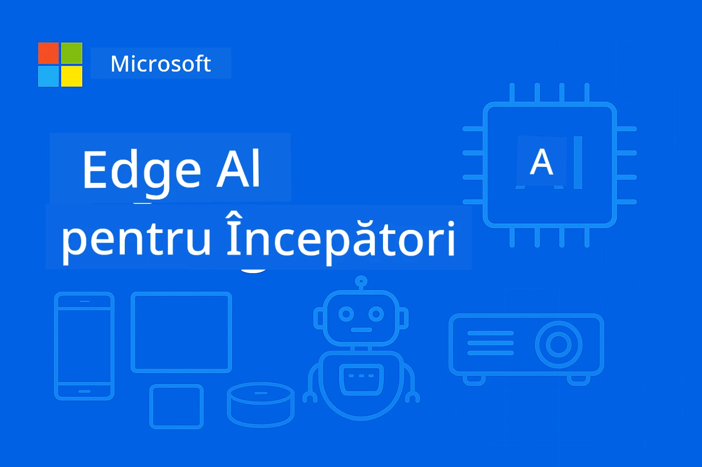

# EdgeAI pentru Începători 




[](https://GitHub.com/microsoft/edgeai-for-beginners/graphs/contributors)
[](https://GitHub.com/microsoft/edgeai-for-beginners/issues)
[](https://GitHub.com/microsoft/edgeai-for-beginners/pulls)
[](http://makeapullrequest.com)

[](https://GitHub.com/microsoft/edgeai-for-beginners/watchers)
[](https://GitHub.com/microsoft/edgeai-for-beginners/fork)
[](https://GitHub.com/microsoft/edgeai-for-beginners/stargazers)


[](https://discord.gg/nTYy5BXMWG)

Urmați acești pași pentru a începe să utilizați aceste resurse:

1. **Bifurcați Repositorul**: Dați clic pe [](https://GitHub.com/microsoft/edgeai-for-beginners/fork)
2. **Clonați Repositorul**:   `git clone https://github.com/microsoft/edgeai-for-beginners.git`
3. [**Alăturați-vă Discord-ului Azure AI Foundry și întâlniți experți și alți dezvoltatori**](https://discord.com/invite/ByRwuEEgH4)


### 🌐 Suport Multi-Limbă

#### Susținut prin GitHub Action (automat și mereu actualizat)

<!-- CO-OP TRANSLATOR LANGUAGES TABLE START -->
[Arabic](../ar/README.md) | [Bengali](../bn/README.md) | [Bulgarian](../bg/README.md) | [Burmese (Myanmar)](../my/README.md) | [Chinese (Simplified)](../zh-CN/README.md) | [Chinese (Traditional, Hong Kong)](../zh-HK/README.md) | [Chinese (Traditional, Macau)](../zh-MO/README.md) | [Chinese (Traditional, Taiwan)](../zh-TW/README.md) | [Croatian](../hr/README.md) | [Czech](../cs/README.md) | [Danish](../da/README.md) | [Dutch](../nl/README.md) | [Estonian](../et/README.md) | [Finnish](../fi/README.md) | [French](../fr/README.md) | [German](../de/README.md) | [Greek](../el/README.md) | [Hebrew](../he/README.md) | [Hindi](../hi/README.md) | [Hungarian](../hu/README.md) | [Indonesian](../id/README.md) | [Italian](../it/README.md) | [Japanese](../ja/README.md) | [Kannada](../kn/README.md) | [Khmer](../km/README.md) | [Korean](../ko/README.md) | [Lithuanian](../lt/README.md) | [Malay](../ms/README.md) | [Malayalam](../ml/README.md) | [Marathi](../mr/README.md) | [Nepali](../ne/README.md) | [Nigerian Pidgin](../pcm/README.md) | [Norwegian](../no/README.md) | [Persian (Farsi)](../fa/README.md) | [Polish](../pl/README.md) | [Portuguese (Brazil)](../pt-BR/README.md) | [Portuguese (Portugal)](../pt-PT/README.md) | [Punjabi (Gurmukhi)](../pa/README.md) | [Romanian](./README.md) | [Russian](../ru/README.md) | [Serbian (Cyrillic)](../sr/README.md) | [Slovak](../sk/README.md) | [Slovenian](../sl/README.md) | [Spanish](../es/README.md) | [Swahili](../sw/README.md) | [Swedish](../sv/README.md) | [Tagalog (Filipino)](../tl/README.md) | [Tamil](../ta/README.md) | [Telugu](../te/README.md) | [Thai](../th/README.md) | [Turkish](../tr/README.md) | [Ukrainian](../uk/README.md) | [Urdu](../ur/README.md) | [Vietnamese](../vi/README.md)

> **Preferi să clonezi local?**
>
> Acest repository include peste 50 de traduceri de limbi care măresc semnificativ dimensiunea descărcării. Pentru a clona fără traduceri, folosește sparse checkout:
>
> **Bash / macOS / Linux:**
> ```bash
> git clone --filter=blob:none --sparse https://github.com/microsoft/edgeai-for-beginners.git
> cd edgeai-for-beginners
> git sparse-checkout set --no-cone '/*' '!translations' '!translated_images'
> ```
>
> **CMD (Windows):**
> ```cmd
> git clone --filter=blob:none --sparse https://github.com/microsoft/edgeai-for-beginners.git
> cd edgeai-for-beginners
> git sparse-checkout set --no-cone "/*" "!translations" "!translated_images"
> ```
>
> Acest lucru îți oferă tot ce ai nevoie pentru a finaliza cursul cu o descărcare mult mai rapidă.
<!-- CO-OP TRANSLATOR LANGUAGES TABLE END -->

**Dacă dorești să fie suportate limbi suplimentare pentru traduceri, sunt listate [aici](https://github.com/Azure/co-op-translator/blob/main/getting_started/supported-languages.md)**
## Introducere

Bine ai venit la **EdgeAI pentru Începători** – călătoria ta cuprinzătoare în lumea transformatoare a Inteligenței Artificiale la margine. Acest curs face legătura între capabilitățile puternice AI și implementarea practică, din lumea reală, pe dispozitive edge, oferindu-ți puterea de a valorifica potențialul AI direct acolo unde datele sunt generate și deciziile trebuie luate.

### Ce vei stăpâni

Acest curs te duce de la conceptele fundamentale la implementări gata de producție, acoperind:
- **Modele Lingvistice Mici (SLM-uri)** optimizate pentru implementarea la margine
- **Optimizare conștientă de hardware** pe diverse platforme
- **Inferență în timp real** cu capabilități de protecție a confidențialității
- **Strategii de implementare în producție** pentru aplicații enterprise

### De ce contează EdgeAI

Edge AI reprezintă o schimbare de paradigmă care abordează provocări critice moderne:
- **Confidențialitate & Securitate**: Procesează date sensibile local, fără expunere în cloud
- **Performanță în timp real**: Elimină latența rețelei pentru aplicații critice temporal
- **Eficiență de cost**: Reduce costurile de bandă și calcul cloud
- **Operațiuni rezistente**: Menține funcționalitatea în timpul căderilor de rețea
- **Conformitate reglementară**: Respectă cerințele de suveranitate a datelor

### Edge AI

Edge AI se referă la rularea algoritmilor AI și modelelor lingvistice local, aproape de locul unde sunt generate datele, fără a depinde de resurse cloud pentru inferență. Reduce latența, îmbunătățește confidențialitatea și permite luarea deciziilor în timp real.

### Principii de bază:
- **Inferență la nivel de dispozitiv**: Modelele AI rulează pe dispozitive edge (telefoane, routere, microcontrolere, PC-uri industriale)
- **Capacitate offline**: Funcționează fără conexiune persistentă la internet
- **Latență mică**: Răspuns imediat care se potrivește sistemelor în timp real
- **Suveranitate asupra datelor**: Păstrează datele sensibile local, îmbunătățind securitatea și conformitatea

### Modele Lingvistice Mici (SLM-uri)

SLM-urile precum Phi-4, Mistral-7B și Gemma sunt versiuni optimizate ale modelor LLM mai mari — antrenate sau distilate pentru:
- **Amprentă de memorie redusă**: Utilizare eficientă a memoriei limitate a dispozitivelor edge
- **Cerere de calcul redusă**: Optimizate pentru performanța CPU și GPU edge
- **Timp de inițializare rapid**: Pornire rapidă pentru aplicații responsive

Ele deblochează capabilități NLP puternice respectând constrângerile:
- **Sisteme integrate**: Dispozitive IoT și controlere industriale
- **Dispozitive mobile**: Smartphone-uri și tablete cu capabilități offline
- **Dispozitive IoT**: Senzori și dispozitive inteligente cu resurse limitate
- **Servere edge**: Unități locale de procesare cu resurse GPU limitate
- **Calculatoare personale**: Scenarii de implementare desktop și laptop

## Modulele cursului & Navigare

| Modul | Subiect | Domeniu de interes | Conținut cheie | Nivel | Durată |
|--------|-------|------------|-------------|--------|----------|
| [📖 00 ](./introduction.md) | [Introducere în EdgeAI](./introduction.md) | Fundamente & context | Prezentare EdgeAI • Aplicații industriale • Introducere SLM • Obiective de învățare | Începător | 1-2 ore |
| [📚 01](../../Module01) | [Fundamente EdgeAI](./Module01/README.md) | Comparatie Cloud vs Edge AI | Fundamente EdgeAI • Studii de caz din lumea reală • Ghid de implementare • Implementare la margine | Începător | 3-4 ore |
| [🧠 02](../../Module02) | [Fundamentele modelului SLM](./Module02/README.md) | Familii de modele & arhitectură | Familia Phi • Familia Qwen • Familia Gemma • BitNET • μModel • Phi-Silica | Începător | 4-5 ore |
| [🚀 03](../../Module03) | [Practică implementare SLM](./Module03/README.md) | Implementare locală & cloud | Învațare avansată • Mediu local • Implementare cloud | Intermediar | 4-5 ore |
| [⚙️ 04](../../Module04) | [Set de instrumente pentru optimizarea modelelor](./Module04/README.md) | Optimizare cross-platform | Introducere • Llama.cpp • Microsoft Olive • OpenVINO • Apple MLX • Sinteza fluxurilor de lucru | Intermediar | 5-6 ore |
| [🔧 05](../../Module05) | [SLMOps în producție](./Module05/README.md) | Operațiuni în producție | Introducere SLMOps • Distilarea modelelor • Ajustarea fină • Implementare în producție | Avansat | 5-6 ore |
| [🤖 06](../../Module06) | [Agenți AI & Apelarea funcțiilor](./Module06/README.md) | Cadre pentru agenți & MCP | Introducere în agenți • Apelarea funcțiilor • Protocolul Contextului modelului | Avansat | 4-5 ore |
| [💻 07](../../Module07) | [Implementarea pe platforme](./Module07/README.md) | Exemple cross-platform | Toolkit AI • Foundry Local • Dezvoltare Windows | Avansat | 3-4 ore |
| [🏭 08](../../Module08) | [Toolkit Foundry Local](./Module08/README.md) | Exemple gata pentru producție | Aplicații de exemplu (vezi detalii mai jos) | Expert | 8-10 ore |

### 🏭 **Modul 08: Aplicații de exemplu**

- [01: REST Chat Quickstart](./Module08/samples/01/README.md)
- [02: Integrare SDK OpenAI](./Module08/samples/02/README.md)
- [03: Descoperire modele & Benchmarking](./Module08/samples/03/README.md)
- [04: Aplicație Chainlit RAG](./Module08/samples/04/README.md)
- [05: Orchestrare Multi-Agent](./Module08/samples/05/README.md)
- [06: Router Models-as-Tools](./Module08/samples/06/README.md)
- [07: Client API Direct](./Module08/samples/07/README.md)
- [08: Aplicație Chat Windows 11](./Module08/samples/08/README.md)
- [09: Sistem avansat Multi-Agent](./Module08/samples/09/README.md)
- [10: Framework Foundry Tools](./Module08/samples/10/README.md)

### 🎓 **Atelier: Parcurs practic de învățare**

Materiale complete pentru atelier practic cu implementări gata pentru producție:

- **[Ghid Atelier](./Workshop/Readme.md)** - Obiective complete de învățare, rezultate și navigarea resurselor
- **Exemple Python** (6 sesiuni) - Actualizate cu cele mai bune practici, tratarea erorilor și documentație cuprinzătoare
- **Jupyter Notebooks** (8 interactive) - Tutoriale pas cu pas cu benchmark-uri și monitorizare performanță
- **Ghiduri de sesiune** - Ghiduri detaliate în markdown pentru fiecare sesiune a atelierului
- **Instrumente de validare** - Scripturi pentru verificarea calității codului și efectuarea de teste rapide

**Ce vei construi:**
- Aplicații AI de chat locale cu suport de streaming
- Țevi RAG cu evaluare a calității (RAGAS)
- Instrumente de benchmarking și comparație multi-model
- Sisteme de orchestrare multi-agent
- Rutare inteligentă a modelelor cu selecție pe bază de sarcină

### 🎙️ **Atelier pentru Agentic: Hands-On - Studioul de Podcast AI**
Construiește un flux de producție podcast alimentat de AI de la zero! Acest atelier captivant te învață să creezi un sistem complet multi-agent care transformă ideile în episoade profesionale de podcast.

**[🎬 Începe Atelierul AI Podcast Studio](./WorkshopForAgentic/README.md)**

**Misiunea Ta**: Lansează „Future Bytes” — un podcast tehnologic alimentat integral de agenți AI pe care îi vei construi singur. Fără dependențe cloud, fără costuri API — totul rulează local pe mașina ta.

**Ce face acest curs unic:**
- **🤖 Orchestrare Reală Multi-Agent** - Construiește agenți AI specializați care cercetează, scriu și produc audio
- **🎯 Flux Complet de Producție** - De la selecția subiectului până la produsul final audio podcast
- **💻 Implementare 100% Locală** - Utilizează Ollama și modele locale (Qwen-3-8B) pentru confidențialitate și control total
- **🎤 Integrare Text-în-Vorbire** - Transformă scripturi în conversații naturale multi-vorbitor
- **✋ Fluxuri de lucru cu intervenție umană** - Porți de aprobare care garantează calitatea menținând automatizarea

**Călătorie de învățare în trei acte:**

| Act | Focus | Competențe cheie | Durată |
|-----|-------|------------------|--------|
| **[Act 1: Cunoaște-ți asistenții AI](./WorkshopForAgentic/md/01.BuildAIAgentWithSLM.md)** | Construiește primul tău agent AI | Integrare unelte • Căutare web • Rezolvarea problemelor • Raționament agentic | 2-3 ore |
| **[Act 2: Adună echipa ta de producție](./WorkshopForAgentic/md/02.AIAgentOrchestrationAndWorkflows.md)** | Orchestrarea mai multor agenți | Coordonare echipă • Fluxuri de aprobare • Interfață DevUI • Supraveghere umană | 3-4 ore |
| **[Act 3: Dă viață podcastului tău](./WorkshopForAgentic/md/03.Multi-SpeakerPodcastGenerationWithVibeVoice.md)** | Generează audio pentru podcast | Text-în-vorbire • Sinteză multi-vorbitor • Audio pe termen lung • Automatizare completă | 2-3 ore |

**Tehnologii folosite:**
- **Microsoft Agent Framework** - Orchestrarea și coordonarea multi-agent
- **Ollama** - Runtime modele AI locale (fără cloud necesar)
- **Qwen-3-8B** - Model lingvistic open-source optimizat pentru sarcini agentice
- **API-uri Text-în-Vorbire** - Sinteză vocală naturală pentru generarea podcastului

**Suport hardware:**
- ✅ **Mod CPU** - Funcționează pe orice computer modern (recomandat 8GB+ RAM)
- 🚀 **Accelerație GPU** - Inferență mult mai rapidă cu GPU-uri NVIDIA/AMD
- ⚡ **Suport NPU** - Accelerație unitate neurală de generație următoare

**Perfect pentru:**
- Dezvoltatori care învață sisteme AI multi-agent
- Oricine este interesat de automatizarea AI și fluxurile de lucru
- Creatori de conținut care explorează producția asistată de AI
- Studenți care studiază modele practice de orchestrare AI

**Începe să construiești**: [🎙️ Atelierul AI Podcast Studio →](./WorkshopForAgentic/README.md)

### 📊 **Rezumat Parcurs de Învățare**
- **Durata totală**: 36-45 ore
- **Parcurs Începători**: Modulele 01-02 (7-9 ore)  
- **Parcurs Intermediar**: Modulele 03-04 (9-11 ore)
- **Parcurs Avansat**: Modulele 05-07 (12-15 ore)
- **Parcurs Expert**: Modulul 08 (8-10 ore)

## Ce vei construi

### 🎯 Competențe centrale
- **Arhitectură AI Edge**: Proiectează sisteme AI cu prioritate locală și integrare cloud
- **Optimizare modele**: Cuantizează și comprimă modele pentru implementare edge (creștere viteză 85%, reducere dimensiune 75%)
- **Implementare multi-platformă**: Windows, mobil, embedded și sisteme hibride cloud-edge
- **Operațiuni de producție**: Monitorizare, scalare și întreținere AI edge în producție

### 🏗️ Proiecte practice
- **Aplicații chat Foundry Local**: Aplicație nativă Windows 11 cu comutare modele
- **Sisteme multi-agent**: Coordonator cu agenți specializați pentru fluxuri complexe  
- **Aplicații RAG**: Procesare locală a documentelor cu căutare vectorială
- **Routere de modele**: Selecție inteligentă între modele bazată pe analiza sarcinii
- **Framework-uri API**: Clienți producție ready cu streaming și monitorizare sănătate
- **Unelte cross-platform**: Modele de integrare LangChain/Semantic Kernel

### 🏢 Aplicații în industrie
**Producție** • **Sănătate** • **Vehicule autonome** • **Orașe inteligente** • **Aplicații mobile**

## Pornire rapidă

**Parcurs recomandat** (20-30 ore total):

0. **📖 Introducere** ([Introduction.md](./introduction.md)): Fundamente EdgeAI + context industrial + cadru de învățare
1. **📚 Bază** (Module 01-02): Concepte EdgeAI + familii modele SLM
2. **⚙️ Optimizare** (Module 03-04): Implementare + framework-uri cuantizare  
3. **🚀 Producție** (Module 05-06): SLMOps + agenți AI + apel funcții
4. **💻 Implementare** (Module 07-08): Exemple platformă + toolkit Foundry Local

Fiecare modul include teorie, exerciții practice și cod gata de producție.

## Impact în carieră

**Roluri tehnice**: Arhitect soluții EdgeAI • Inginer ML (Edge) • Dezvoltator AI IoT • Dezvoltator AI mobil

**Sectore industriale**: Producție 4.0 • Tehnologie sănătate • Sisteme autonome • FinTech • Electronică de consum

**Proiecte portofoliu**: Sisteme multi-agent • Aplicații RAG producție • Implementare cross-platform • Optimizare performanță

## Structura repository-ului

```
edgeai-for-beginners/
├── 📖 introduction.md  # Foundation: EdgeAI Overview & Learning Framework
├── 📚 Module01-04/     # Fundamentals → SLMs → Deployment → Optimization  
├── 🔧 Module05-06/     # SLMOps → AI Agents → Function Calling
├── 💻 Module07/        # Platform Samples (VS Code, Windows, Jetson, Mobile)
├── 🏭 Module08/        # Foundry Local Toolkit + 10 Comprehensive Samples
│   ├── samples/01-06/  # Foundation: REST, SDK, RAG, Agents, Routing
│   └── samples/07-10/  # Advanced: API Client, Windows App, Enterprise Agents, Tools
├── 🌐 translations/    # Multi-language support (8+ languages)
└── 📋 STUDY_GUIDE.md   # Structured learning paths & time allocation
```

## Reperele cursului

✅ **Învățare progresivă**: Teorie → Practică → Implementare în producție  
✅ **Studii de caz reale**: Microsoft, Japan Airlines, implementări enterprise  
✅ **Exemple practice**: 50+ exemple, 10 demo-uri complete Foundry Local  
✅ **Focalizare pe performanță**: Îmbunătățiri de viteză 85%, reduceri dimensiune 75%  
✅ **Multi-platformă**: Windows, mobil, embedded, hibride cloud-edge  
✅ **Ready pentru producție**: Monitorizare, scalare, securitate, cadre de conformitate

📖 **[Ghid de Studii Disponibil](STUDY_GUIDE.md)**: Parcurs de învățare structurat pe 20 de ore cu recomandări de timp și autoevaluare.

---

**EdgeAI reprezintă viitorul implementării AI**: local-first, cu păstrarea confidențialității și eficient. Stăpânește aceste competențe pentru a construi următoarea generație de aplicații inteligente.

## Alte cursuri

Echipa noastră produce și alte cursuri! Vezi:

<!-- CO-OP TRANSLATOR OTHER COURSES START -->
### LangChain
[](https://aka.ms/langchain4j-for-beginners)
[](https://aka.ms/langchainjs-for-beginners?WT.mc_id=m365-94501-dwahlin)
[](https://github.com/microsoft/langchain-for-beginners?WT.mc_id=m365-94501-dwahlin)
---

### Azure / Edge / MCP / Agenți
[](https://github.com/microsoft/AZD-for-beginners?WT.mc_id=academic-105485-koreyst)
[](https://github.com/microsoft/edgeai-for-beginners?WT.mc_id=academic-105485-koreyst)
[](https://github.com/microsoft/mcp-for-beginners?WT.mc_id=academic-105485-koreyst)
[](https://github.com/microsoft/ai-agents-for-beginners?WT.mc_id=academic-105485-koreyst)

---
 
### Seria AI Generativă
[](https://github.com/microsoft/generative-ai-for-beginners?WT.mc_id=academic-105485-koreyst)
[-9333EA?style=for-the-badge&labelColor=E5E7EB&color=9333EA)](https://github.com/microsoft/Generative-AI-for-beginners-dotnet?WT.mc_id=academic-105485-koreyst)
[-C084FC?style=for-the-badge&labelColor=E5E7EB&color=C084FC)](https://github.com/microsoft/generative-ai-for-beginners-java?WT.mc_id=academic-105485-koreyst)
[-E879F9?style=for-the-badge&labelColor=E5E7EB&color=E879F9)](https://github.com/microsoft/generative-ai-with-javascript?WT.mc_id=academic-105485-koreyst)

---
 
### Învățare de bază
[](https://aka.ms/ml-beginners?WT.mc_id=academic-105485-koreyst)
[](https://aka.ms/datascience-beginners?WT.mc_id=academic-105485-koreyst)
[](https://aka.ms/ai-beginners?WT.mc_id=academic-105485-koreyst)
[](https://github.com/microsoft/Security-101?WT.mc_id=academic-96948-sayoung)
[](https://aka.ms/webdev-beginners?WT.mc_id=academic-105485-koreyst)
[](https://aka.ms/iot-beginners?WT.mc_id=academic-105485-koreyst)
[](https://github.com/microsoft/xr-development-for-beginners?WT.mc_id=academic-105485-koreyst)

---
 
### Seria Copilot
[](https://aka.ms/GitHubCopilotAI?WT.mc_id=academic-105485-koreyst)
[](https://github.com/microsoft/mastering-github-copilot-for-dotnet-csharp-developers?WT.mc_id=academic-105485-koreyst)
[](https://github.com/microsoft/CopilotAdventures?WT.mc_id=academic-105485-koreyst)
<!-- CO-OP TRANSLATOR OTHER COURSES END -->

## Obținerea ajutorului

Dacă ești blocat sau ai întrebări despre construirea aplicațiilor AI, alătură-te:

[](https://discord.gg/nTYy5BXMWG)

Dacă ai feedback despre produs sau întâmpini erori în timpul dezvoltării, vizitează:

[](https://aka.ms/foundry/forum)

---

<!-- CO-OP TRANSLATOR DISCLAIMER START -->
**Declinare a responsabilității**:  
Acest document a fost tradus folosind serviciul de traducere AI [Co-op Translator](https://github.com/Azure/co-op-translator). Deși ne străduim pentru acuratețe, vă rugăm să rețineți că traducerile automate pot conține erori sau inexactități. Documentul original în limba sa nativă trebuie considerat sursa autoritară. Pentru informații critice, se recomandă traducerea profesională realizată de un specialist uman. Nu ne asumăm responsabilitatea pentru orice neînțelegeri sau interpretări greșite ce pot rezulta din utilizarea acestei traduceri.
<!-- CO-OP TRANSLATOR DISCLAIMER END -->