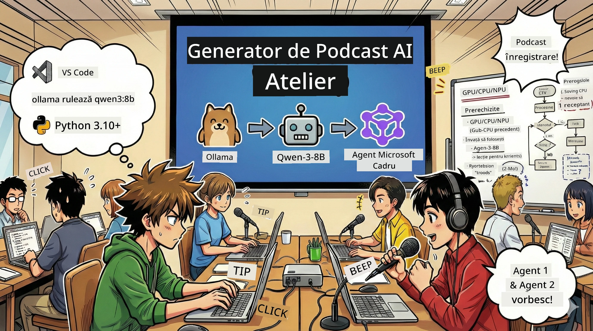
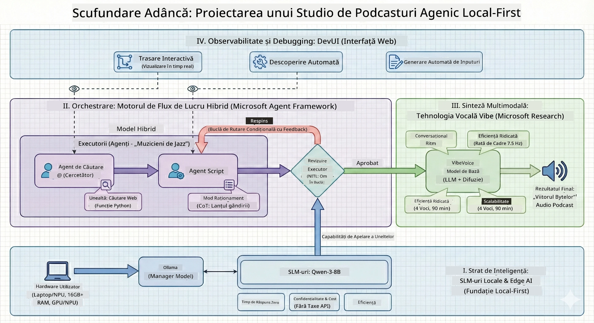

<!--
CO_OP_TRANSLATOR_METADATA:
{
  "original_hash": "f94e745264597bc5d8df967ead2eff97",
  "translation_date": "2026-01-05T10:51:54+00:00",
  "source_file": "WorkshopForAgentic/README.md",
  "language_code": "ro"
}
-->
# 🎙️ Atelierul AI Podcast Studio

> 🌏 [中文版 (Versiunea Chineză)](translation/zh-cn/README.md)



## Misiunea Ta

Bine ai venit la **The AI Podcast Studio**! Ești pe cale să lansezi propriul tău podcast tech numit "Future Bytes" — dar iată răsturnarea: vei construi o echipă de producție alimentată de AI care să te ajute să îl creezi. Fără ore nesfârșite de cercetare, scris scripturi și editare audio. În schimb, vei scrie cod pentru a deveni producător de podcast cu superputeri AI.

## Povestea

Imaginează-ți asta: Tu și prietenii voștri vreți să începeți un podcast despre cele mai tari tendințe tech, dar toată lumea e ocupată cu școala, munca sau pur și simplu viața. Ce-ar fi dacă ai putea construi o echipă de agenți AI să facă treaba grea? Un agent cercetează subiecte, altul scrie scenarii atractive, iar un al treilea transformă textul în conversații naturale. Sună a science fiction? Hai să o facem realitate.

## Ce Vei Învăța

La finalul acestui atelier, vei ști cum să:
- 🤖 Lansezi propriul model AI local (fără costuri API, fără dependență de cloud!)
- 🔧 Construiești agenți AI specializați care chiar colaborează
- 🎬 Creezi un flux complet de producție podcast, de la idee la audio

## Călătoria Ta: Trei Acte



Ca orice poveste bună, avem trei acte. Fiecare construiește studioul tău AI podcast, pas cu pas:

| Episod | Misiunea Ta | Ce se Întâmplă | Abilități Deținute |
|---------|-------------|----------------|--------------------|
| **Actul 1** | [Cunoaște-ți Asistenții AI](md/01.BuildAIAgentWithSLM.md) | Descoperi cum să creezi agenți AI care pot conversa, caută pe web și chiar rezolvă probleme. Gândește-te la ei ca la internul tău de cercetare care nu doarme niciodată. | 🎯 Construiește primul tău agent<br>🛠️ Dă-i superputeri (unelte!)<br>🧠 Învață-l să gândească<br>🌐 Conectează-l la internet |
| **Actul 2** | [Adună Echipa de Producție](md/02.AIAgentOrchestrationAndWorkflows.md) | Lucrurile devin interesante! Vei orchestra mai mulți agenți AI să lucreze împreună ca o echipă reală de podcast. Unul cercetează, altul scrie, tu aprobi — munca în echipă face visul să devină realitate. | 🎭 Coordonează mai mulți agenți<br>🔄 Construiește fluxuri de aprobare<br>🖥️ Testează cu interfața DevUI<br>✋ Menține oamenii în control |
| **Actul 3** | [Dă Viață Podcastului Tău](md/03.Multi-SpeakerPodcastGenerationWithVibeVoice.md) | Finalul! Transformă scripturile tale text în audio de podcast cu voci realiste și conversații naturale. Podcastul tău "Future Bytes" este gata pentru lansare! | 🎤 Magie text-la-vorbire<br>👥 Voci multiple de vorbitori<br>⏱️ Audio de lungă durată<br>🚀 Automatizare completă |

Fiecare act deblochează noi abilități. Sari peste dacă ești curajos, dar recomandăm să urmezi povestea!

## Cerințe de Mediu

Acest atelier suportă diverse medii hardware:
- **CPU**: Potrivit pentru testări și utilizare la scară mică
- **GPU**: Recomandat pentru mediile de producție, îmbunătățește semnificativ viteza de inferență
- **NPU**: Suportă accelerarea unităților neuronale next-gen

## Ce Vei Avea Nevoie

### Listă de Software ✅
- **Python 3.10+** (Limbajul tău de programare)
- **Ollama** (Rulează modelele AI pe calculatorul tău)
- **VS Code** (Editorul tău de cod)
- **Extensia Python** (Face VS Code mai inteligent)
- **Git** (Pentru a trage codul)

### Verificarea Hardware 💻
- **Pot să rulez asta?**: 8GB RAM, 10GB spațiu liber (merge, dar poate fi lent)
- **Configurație ideală**: 16GB+ RAM, un GPU decent (experiență fără probleme!)
- **Ai un NPU?**: Cu atât mai bine! Performanță next-gen deblocată 🚀

## Configurează-ți Studioul 🎬

### Pasul 1: Upgrade Python

Asigură-te că ai Python 3.10 sau mai nou:

```bash
python --version
# Ar trebui să afișeze Python 3.10.x sau o versiune mai nouă
```

Nu ai Python? Ia-l de pe [python.org](https://python.org) — este gratuit!

### Pasul 2: Ia Ollama (Motorul tău de modele AI)

Mergi la [ollama.ai](https://ollama.ai) și descarcă Ollama pentru sistemul tău de operare. Gândește-te la el ca la motorul care rulează modelele tale AI local.

Verifică dacă este gata:

```bash
ollama --version
```

### Pasul 3: Descarcă-ți Creierul AI 🧠

E timpul să iei modelul Qwen-3-8B (este ca și cum ai angaja primul tău asistent AI):

```bash
ollama pull qwen3:8b
```

*Acest pas poate dura câteva minute. Moment perfect pentru o pauză de cafea! ☕*

### Pasul 4: Configurează VS Code

Descarcă [Visual Studio Code](https://code.visualstudio.com/) dacă nu îl ai. E cel mai bun editor de cod (dacă nu, ne contrazicem cu zâmbet 😄).

### Pasul 5: Extensia Python

În VS Code:
1. Apasă `Ctrl+Shift+X` (sau `Cmd+Shift+X` pe Mac)
2. Caută "Python"
3. Instalează extensia oficială Microsoft pentru Python

### Pasul 6: Gata de Start! 🎉

Serios, ești pregătit să începi. Hai să construit magică AI!

### Pasul 7: Instalează Microsoft Agent Framework și Pachetele Corelate 📦

Instalează toate dependențele necesare pentru atelier:

```bash
pip install -r ./Installations/requirements.txt -U
```

*Aceasta va instala Microsoft Agent Framework și toate pachetele necesare. Ia-ți o cafea — configurarea inițială poate dura câteva minute! ☕*

## Instrucțiuni Atelier

Structura detaliată a proiectului, pașii de configurare și metodele de execuție vor fi explicate pas cu pas pe parcursul atelierului.

## Rezolvarea Problemelor (Când Lucrurile Merg Prost) 🔧

### „Ugh, descărcarea modelului durează o veșnicie!”
**Soluție**: Folosește un VPN sau configurează Ollama cu o sursă mirror. Uneori internetul nu ne place.

### „Calculatorul meu înnebunește! Memoria e plină!”
**Soluție**: Treci la un model mai mic sau ajustează setarea `num_ctx` pentru a folosi mai puțină memorie. Gândește-te ca și cum i-ai pune AI-ul la dietă.

### „Pot să accelerez asta cu GPU-ul meu?”
**Soluție**: Ollama detectează automat GPU-urile! Asigură-te doar că driverele GPU sunt actualizate. Boost de viteză gratuit! 🏎️

## Resurse Suplimentare (Pentru Curioși) 📚

- [Documentația Ollama](https://github.com/ollama/ollama) — Explorare detaliată a modelelor AI locale
- [Microsoft Agent Framework](https://microsoft.github.io/autogen/) — Află mai multe despre construirea echipelor de agenți
- [Info Model Qwen](https://qwenlm.github.io/) — Cunoaște creierul asistentului tău AI

## Licență

Licență MIT — Construiește lucruri cool, împărtășește-le, fă lumea mai bună! 🌍

## Vrei să Contribui?

Ai găsit un bug? Ai o idee? Lasă un Issue sau PR! Ne place vibe-ul comunității. ✨

---

<!-- CO-OP TRANSLATOR DISCLAIMER START -->
**Declinare a responsabilității**:
Acest document a fost tradus folosind serviciul de traducere AI [Co-op Translator](https://github.com/Azure/co-op-translator). Deși ne străduim pentru acuratețe, vă rugăm să rețineți că traducerile automate pot conține erori sau inexactități. Documentul original în limba sa nativă trebuie considerat sursa autorizată. Pentru informații critice, se recomandă traducerea profesională realizată de un om. Nu ne asumăm responsabilitatea pentru eventualele neînțelegeri sau interpretări greșite rezultate din utilizarea acestei traduceri.
<!-- CO-OP TRANSLATOR DISCLAIMER END -->