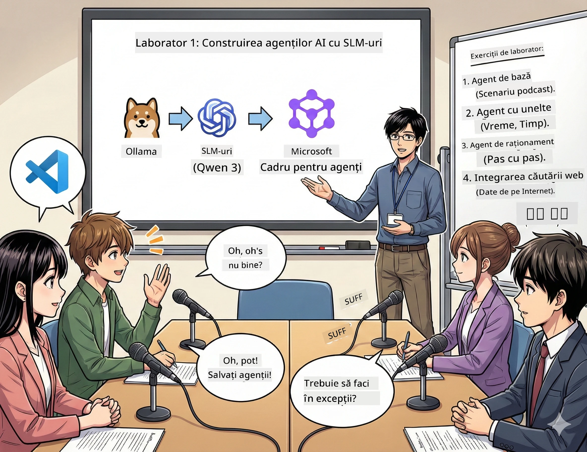

# Actul I: Cunoaște-ți asistentul tău de cercetare AI 🤖

## Provocarea

Lansezi „Future Bytes”, noul tău podcast tech. Primul episod este despre ultimele descoperiri în AI, dar ai doar 24 de ore să:
1. Cercetezi subiectul
2. Găsești surse de încredere
3. Scrii un scenariu captivant
4. Să îl faci să sune natural

**Răsturnare de situație**: Nu trebuie să faci totul singur. Ești pe cale să-ți construiești primul asistent AI, care te poate ajuta să faci toate acestea. Să-l numim Alex — partenerul tău de cercetare neobosit, care nu are nevoie niciodată să doarmă.

## De ce alege modelele de limbaj mici? (spoiler: sunt grozave)

Gândește-te la modelele de limbaj mici (SLM) ca la un AI personal care rulează pe *calculatorul tău*. Fără cloud, fără taxe lunare, fără partajări dubioase de date.

**De ce SLM este atât de 🔥:**
- **🏠 Rulează pe mașina ta**: laptopuri, desktopuri, chiar și Raspberry Pi-uri puternice
- **💸 Cost zero de funcționare continuă**: fără taxe API care să-ți golească buzunarul
- **🔒 Confidențialitate prioritară**: datele tale nu părăsesc niciodată dispozitivul
- **⚡ Fulger de rapid**: fără întârzieri de rețea, răspuns instant
- **🪦 Ușoare**: 1-10 miliarde de parametri versus 100+ miliarde pentru modelele mari

**SLM populare**: Qwen 3, Phi-4, Gemma 3 (workshop-ul folosește Qwen)

## Kitul tău de unelte

### Ollama: managerul tău de modele AI

[Ollama](https://ollama.com/) este ca Steam pentru modele AI. Descarcă, rulează și gestionează modele cu comenzi simple.

**Ce e cool la el:**
- Rulezi orice model cu o singură comandă
- Compatibil cu Mac, Windows, Linux
- Folosește GPU automat dacă ai
- Economisește multă memorie

### Microsoft Agent Framework: locul unde magia se întâmplă

[Microsoft Agent Framework](https://github.com/microsoft/agent-framework) este terenul tău de joacă pentru a construi agenți AI inteligenți care pot:

- 💬 Conversa și ține minte ce s-a discutat
- 🛠️ Folosi unelte personalizate (ex: căutare web sau vreme)
- 🧠 Gândi pas cu pas probleme complexe
- 🤝 Colabora în echipă cu alți agenți
- 🔌 Se conecta la diverși furnizori AI (OpenAI, Ollama, Azure)

**Componentele de construcție:**
- **Agenți (Agents)**: asistenți AI cu sarcini specifice
- **Unelte (Tools)**: abilități speciale pe care le oferi
- **Memorie (Memory)**: ca să nu uite conversația
- **Raționament (Reasoning)**: învață-i să gândească, nu doar să răspundă

## Montajul tău de antrenament: 4 misiuni

### Misiunea 1: Creează primul tău agent

📓 [Deschide Notebook-ul](../../code/01.BasicAgent/00.BasicAgent-agent.ipynb)

**Sarcina**: Construiește-l pe Alex, AI-ul tău pentru scris scenarii de podcast. Alex trebuie să genereze un dialog între doi prezentatori care discută despre tehnologie.

**Ce vei învăța:**
- Cum să trezești un agent AI (mai ușor decât să te scoli luni dimineața)
- Cum să-i dai personalitate și instrucțiuni
- Cum să-l faci să genereze un scenariu de podcast autentic
- Cum să interpretezi răspunsurile sale

**Succesul în această misiune**: Alex creează un scenariu pentru episodul pilot „Future Bytes” despre AI! 🎯

### Misiunea 2: Dă-i lui Alex superputeri (unelte!)

📓 [Deschide Notebook-ul](../../code/01.BasicAgent/01.BasicAgent-tools.ipynb)

**Sarcina**: Alex este deștept, dar nu știe cum e vremea azi sau ce oră e. Hai să-i dăm unelte ca să poată afla!

**Ce vei învăța:**
- Să creezi funcții Python personalizate ca „unelte”
- Să lași pe Alex să decidă singur *când* și *ce* unealtă să folosească
- Să observi cum rezolvă problemele singur
- Să combini mai multe unelte pentru sarcini complexe

**Succesul în această misiune**: Întreabă „Cum e vremea în Tokyo?” și Alex găsește singur răspunsul! ☁️

### Misiunea 3: Învață-l pe Alex să gândească

📓 [Deschide Notebook-ul](../../code/01.BasicAgent/02.BasicAgent-reasoning.ipynb)

**Sarcina**: Fă-l pe Alex să-ți arate cum gândește. Vrei să vezi *cum* raționează, nu doar răspunsul.

**Ce vei învăța:**
- Să activezi „modul de raționament” (ca la oră de matematică când arăți pașii)
- Să vezi procesul de gândire al lui Alex pas cu pas
- Să înțelegi prompturile lanțului de gândire
- Să depanezi când Alex e confuz

**Succesul în această misiune**: Pune o problemă matematică dificilă și vezi-l pe Alex cum o rezolvă! 🧠

### Misiunea 4: Conectează-l pe Alex la internet

📓 [Deschide Notebook-ul](../../code/01.BasicAgent/03.BasicAgent-websearch.ipynb)

**Sarcina**: Cunoștințele lui Alex au un termen limită. Hai să-l conectăm la web pentru informații în timp real!

**Ce vei învăța:**
- Să construiești o unealtă personalizată pentru căutare web
- Să integrezi API-uri externe
- Să gestionezi elegant erorile de rețea
- Să accesezi informații dincolo de datele de antrenament ale lui Alex

**Succesul în această misiune**: Întreabă știrile tech de azi și primește cele mai noi rezultate! 📰

## Înainte să începi 🚀

**Echipamentul necesar**:
- Python 3.10+ instalat
- Ollama pornit (verifică cu `ollama --version`)
- VS Code cu extensia Python
- Cel puțin 8GB RAM (16GB recomandat pentru experiență fluidă)

## Ordinea misiunilor

Parcurge notebook-urile în ordine pentru o experiență completă:

1. [00.BasicAgent-agent.ipynb](../../code/01.BasicAgent/00.BasicAgent-agent.ipynb) — Cunoaște-l pe Alex (primul tău agent)
2. [01.BasicAgent-tools.ipynb](../../code/01.BasicAgent/01.BasicAgent-tools.ipynb) — E timpul pentru upgrade!
3. [02.BasicAgent-reasoning.ipynb](../../code/01.BasicAgent/02.BasicAgent-reasoning.ipynb) — Învață-l pe Alex să gândească
4. [03.BasicAgent-websearch.ipynb](../../code/01.BasicAgent/03.BasicAgent-websearch.ipynb) — Deblochează accesul la internet!

## Ce vei putea face

După Actul I vei putea:

- ✅ Rula modele AI pe propriul hardware (fără cloud!)
- ✅ Construi agenți cu personalități și abilități personalizate
- ✅ Oferi agenților unelte pentru probleme reale
- ✅ Face agenții să-și arate raționamentul
- ✅ Conecta agenții la surse de date externe
- ✅ Depana când ceva merge prost

## Când lucrurile merg prost (și cum să le repari) 🔧

### „Alex nu se încarcă! Memorie insuficientă!”
**Soluție**: Calculatorul tău se chinuie. Închide alte aplicații sau folosește un model mai mic. 8GB e minim.

### „Alex e prea lent”
**Soluție**: Activează accelerarea GPU în setările Ollama. Sau micșorează contextul. Modul demon de viteză activat! 🏎️

### „Unealta nu funcționează!”
**Soluție**: Verifică semnătura funcției tale. Alex are nevoie de tipuri corecte ca să înțeleagă unealta. Gândește-te la asta ca la un set clar de instrucțiuni.

## Linkuri utile 🔗

- [Documentația Agent Framework](https://github.com/microsoft/agent-framework) — ghiduri și exemple oficiale
- [Biblioteca de modele Ollama](https://ollama.com/library) — navighează toate modelele disponibile
- [Modelul Qwen](https://ollama.com/library/qwen3) — creierul asistentului tău AI
- [Exemple de cod](https://github.com/microsoft/agent-framework/tree/main/python/samples) — inspiră-te de aici

## Următorul pas: Actul II 🎬

Ai un agent. Dar dacă ai o *echipă* de agenți care lucrează împreună? În Actul II vei construi o echipă completă de producție podcast:
- **Agentul de cercetare**: găsește cele mai bune surse
- **Agentul de scris**: creează scenariul perfect
- **Editorul (tu!)**: aprobă sau solicită modificări

Să orchestrăm puțină magie AI! → [Actul II: Construiește-ți echipa de producție](02.AIAgentOrchestrationAndWorkflows.md)

---

**Blocată?** Pune întrebări pe durata workshop-ului. Învațăm împreună! 🙌

---

<!-- CO-OP TRANSLATOR DISCLAIMER START -->
**Declinare de responsabilitate**:
Acest document a fost tradus folosind serviciul de traducere AI [Co-op Translator](https://github.com/Azure/co-op-translator). Deși ne străduim pentru acuratețe, vă rugăm să fiți conștienți că traducerile automate pot conține erori sau inexactități. Documentul original, în limba sa nativă, trebuie considerat sursa autorizată. Pentru informații critice, se recomandă traducerea profesională realizată de un specialist uman. Nu ne asumăm răspunderea pentru eventualele neînțelegeri sau interpretări greșite rezultate din utilizarea acestei traduceri.
<!-- CO-OP TRANSLATOR DISCLAIMER END -->