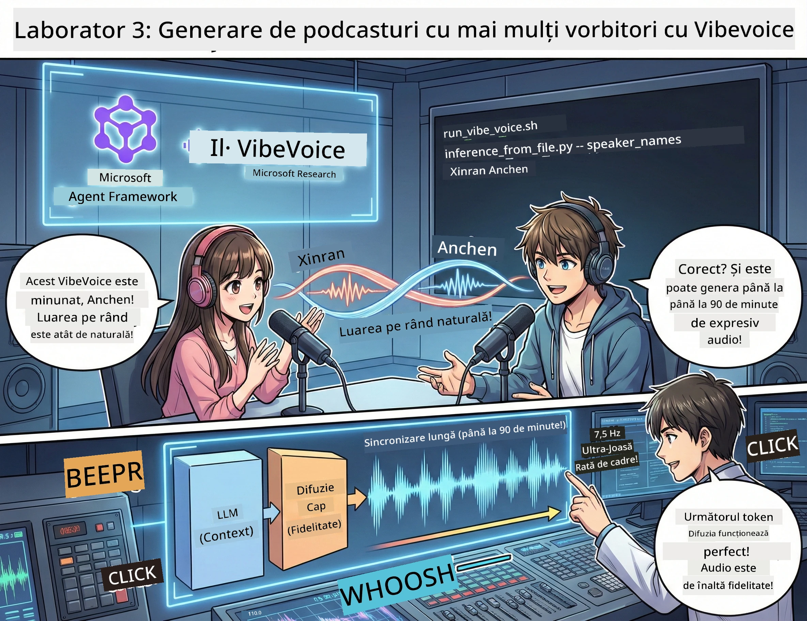

# Actul 3: Adu-ți podcastul la viață 🎤



## Marele final

Ai cercetat tema. Ai scris scenariul. Acum e momentul să faci un pas în plus: transformă-ți textul în audio de podcast autentic cu o voce realistă!

Intră în **VibeVoice** — magia TTS open-source a Microsoft Research care creează:
- 🎭 Dialoguri naturale și fluide
- 👥 Mai mulți vorbitori (până la 4!)
- ⏱️ Audio de format lung (până la 90 de minute!)
- 🎵 Livrare expresivă (nu o voce robotizată!)

Aceasta este tehnologia din spatele sintezei podcasturilor. Hai să-ți facem propriul podcast!

## Ce este VibeVoice? (Lucruri cool)

VibeVoice este un dar al Microsoft Research pentru lume. Este conceput special pentru audio de tip dialog în stil podcast.

### De ce este grozav 🔥

* **⏱️ Sesiuni maraton**: generează până la 90 de minute de vorbire continuă (asta e un episod întreg de podcast!)
* **👥 Magie multi-vorbitor**: până la 4 voci diferite, fiecare cu propria personalitate consistentă
* **⚡ Super eficient**: folosește o rată de cadre ultra-low de 7,5 Hz pentru a economisi puterea de calcul
* **🧠 Audio inteligent**: combină LLM (înțelegerea contextului) cu modele de difuzie (crearea de audio realist)
* **🎭 Natural și fluid**: gestionează automat schimbul vorbitorilor, pauzele și ritmul dialogului

**Traducere**: VibeVoice nu doar citește scenariul tău — îl *joacă* ca un om adevărat.

---

## Înainte să începi 🚀

**Ce îți trebuie**:

* 🐍 **Python 3.10+** (pe care deja îl ai din Actul 1 și Actul 2)
* 🚀 **uv** (un manager rapid de pachete Python - îl vom instala)
* 📝 **Scenariul tău**: fișierul `podcast.txt` din Actul 2 (în `../03.Application/`)

**Sfat profesionist**: această etapă necesită o conexiune bună la internet pentru a descărca modelele pre-antrenate. Ia-ți o cafea! ☕

---

## Hai să începem! Metoda simplă 🎬

Am făcut lucrurile super simple. Un script shell face totul.

### Procesul

1. **Fă-l executabil**:
```bash
chmod +x run_vibe_voice.sh
```

2. **Rulează-l**:
```bash
./run_vibe_voice.sh
```

3. **Așteaptă magia** (prima rulare poate dura câteva minute)

### Ce se întâmplă în spate 🎭

Scriptul este practic inginerul tău audio automat:

1. **📥 Descarcă VibeVoice**: clonează depozitul oficial de pe GitHub
2. **📦 Instalează dependențe**: folosește `uv pip` pentru o instalare rapidă a pachetelor
3. **🎬 Generează audio**: rulează scriptul de inferență, folosind:
   * `--model_path`: modelul VibeVoice-7B pre-antrenat
   * `--txt_path`: scenariul tău `podcast.txt`
   * `--speaker_names`: alocare vocilor (implicit Xinran și Anchen)

**Rezultat**: scenariul tău devine un episod real de podcast! 🎉

---

## Sarcina ta 🎯

Să facem asta mai distractiv:

### Sarcina 1: Creează conținut
Editează `../03.Application/podcast.txt` cu un dialog între două persoane. Fie despre tehnologie, hobby-uri, orice! Important să fie în stil de conversație.

**Exemplu de format**:
```
说话人 1：嘿！你听说新的 AI 模型了吗？
说话人 2：不会吧！告诉我更多！
说话人 1：它叫...
```

### Sarcina 2: Generează audio
Rulează scriptul și urmărește magia. Prima dată va dura mai mult (descărcarea modelului).

### Sarcina 3: Ascultă și analizează
- Sună natural?
- Sunt vocile diferite pentru fiecare vorbitor?
- Schimbul de replici este fluid?
- Există momente robotizate?

### Sarcina 4: Experimentează (pentru cei curajoși)
Editează `run_vibe_voice.sh` și modifică `--speaker_names` pentru a încerca combinații diferite de voci. VibeVoice are mai multe voci pre-antrenate!

**Provocare bonus**: încearcă un dialog între 3 vorbitori! 🎆

---

## Află mai multe 📚

* **🏠 Pagina proiectului**: [Pagina oficială VibeVoice](https://microsoft.github.io/VibeVoice/)
* **🤗 Modele pre-antrenate**: [Hugging Face - VibeVoice-7B](https://huggingface.co/vibevoice/VibeVoice-7B)
* **📖 Lucrare științifică**: detalii tehnice (dacă te interesează)

> **⚠️ Memento responsabil AI**: VibeVoice este puternic. Folosește-l etic! Nu crea deepfake-uri sau conținut înșelător. Fă chestii cool care ajută oamenii. 🙏

---

## 🏆 Felicitări! Ai reușit!

Tocmai ai finalizat întregul flow:
1. ✅ **Actul 1**: construiește agenți AI personalizați
2. ✅ **Actul 2**: orchestrează workflow multi-agent
3. ✅ **Actul 3**: generează audio autentic de podcast

**Acum ai**:
- Un asistent de cercetare AI funcțional
- Un workflow complet de producție podcast
- Un fișier audio real pe care îl poți distribui

### Ce urmează? 🚀

**Lansează-ți podcastul!**
- Încarcă-l pe platforme de podcast
- Distribuie pe rețele sociale
- Iterează și perfecționează

**Continuă să construiești!**
- Încearcă teme diferite
- Experimentează cu mai mulți vorbitori
- Adaugă muzică de fundal
- Creează o interfață web
- Automatizează întreg procesul

**Împărtășește creația ta!**
Menționează-ne! Arată lumii ce ai construit. Revoluția podcasturilor AI începe cu tine. 🎙️

---

**Întrebări? Idei? Povesti de succes?** Pune-le în chatul workshopului!

**Bine ai venit în viitorul creației de conținut.** 🌟

---

<!-- CO-OP TRANSLATOR DISCLAIMER START -->
**Declinarea responsabilității**:  
Acest document a fost tradus folosind serviciul de traducere automată AI [Co-op Translator](https://github.com/Azure/co-op-translator). Deși ne străduim să asigurăm acuratețea, vă rugăm să țineți cont că traducerile automate pot conține erori sau inexactități. Documentul original, în limba sa nativă, trebuie considerat sursa autorizată. Pentru informații critice, se recomandă o traducere profesională realizată de un specialist uman. Nu ne asumăm responsabilitatea pentru orice neînțelegeri sau interpretări greșite ce pot rezulta din utilizarea acestei traduceri.
<!-- CO-OP TRANSLATOR DISCLAIMER END -->