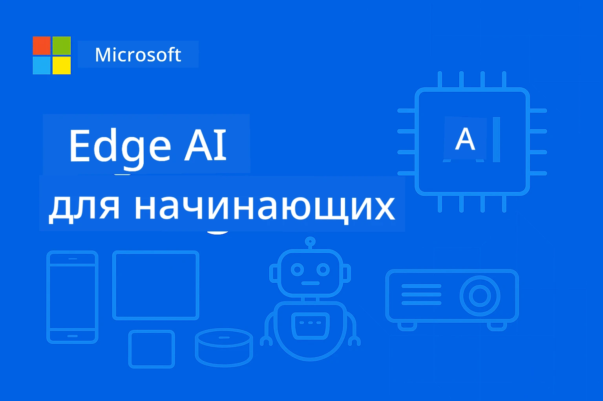

# EdgeAI для начинающих




[](https://GitHub.com/microsoft/edgeai-for-beginners/graphs/contributors)
[](https://GitHub.com/microsoft/edgeai-for-beginners/issues)
[](https://GitHub.com/microsoft/edgeai-for-beginners/pulls)
[](http://makeapullrequest.com)

[](https://GitHub.com/microsoft/edgeai-for-beginners/watchers)
[](https://GitHub.com/microsoft/edgeai-for-beginners/fork)
[](https://GitHub.com/microsoft/edgeai-for-beginners/stargazers)


[](https://discord.gg/nTYy5BXMWG)

Следуйте этим шагам, чтобы начать использовать эти ресурсы:

1. **Сделайте форк репозитория**: Нажмите [](https://GitHub.com/microsoft/edgeai-for-beginners/fork)
2. **Клонируйте репозиторий**:   `git clone https://github.com/microsoft/edgeai-for-beginners.git`
3. [**Присоединяйтесь к Discord Azure AI Foundry и знакомьтесь с экспертами и коллегами разработчиками**](https://discord.com/invite/ByRwuEEgH4)


### 🌐 Многоязычная поддержка

#### Поддерживается через GitHub Action (Автоматизировано и всегда актуально)

<!-- CO-OP TRANSLATOR LANGUAGES TABLE START -->
[Арабский](../ar/README.md) | [Бенгальский](../bn/README.md) | [Болгарский](../bg/README.md) | [Бирманский (Мьянма)](../my/README.md) | [Китайский (упрощённый)](../zh-CN/README.md) | [Китайский (традиционный, Гонконг)](../zh-HK/README.md) | [Китайский (традиционный, Макао)](../zh-MO/README.md) | [Китайский (традиционный, Тайвань)](../zh-TW/README.md) | [Хорватский](../hr/README.md) | [Чешский](../cs/README.md) | [Датский](../da/README.md) | [Нидерландский](../nl/README.md) | [Эстонский](../et/README.md) | [Финский](../fi/README.md) | [Французский](../fr/README.md) | [Немецкий](../de/README.md) | [Греческий](../el/README.md) | [Иврит](../he/README.md) | [Хинди](../hi/README.md) | [Венгерский](../hu/README.md) | [Индонезийский](../id/README.md) | [Итальянский](../it/README.md) | [Японский](../ja/README.md) | [Каннада](../kn/README.md) | [Корейский](../ko/README.md) | [Литовский](../lt/README.md) | [Малайский](../ms/README.md) | [Малаялам](../ml/README.md) | [Маратхи](../mr/README.md) | [Непальский](../ne/README.md) | [Нигерийский пиджин](../pcm/README.md) | [Норвежский](../no/README.md) | [Персидский (Фарси)](../fa/README.md) | [Польский](../pl/README.md) | [Португальский (Бразилия)](../pt-BR/README.md) | [Португальский (Португалия)](../pt-PT/README.md) | [Пенджаби (Гурмукхи)](../pa/README.md) | [Румынский](../ro/README.md) | [Русский](./README.md) | [Сербский (кириллица)](../sr/README.md) | [Словацкий](../sk/README.md) | [Словенский](../sl/README.md) | [Испанский](../es/README.md) | [Свахили](../sw/README.md) | [Шведский](../sv/README.md) | [Тагальский (Филиппинский)](../tl/README.md) | [Тамильский](../ta/README.md) | [Телугу](../te/README.md) | [Тайский](../th/README.md) | [Турецкий](../tr/README.md) | [Украинский](../uk/README.md) | [Урду](../ur/README.md) | [Вьетнамский](../vi/README.md)

> **Предпочитаете клонировать локально?**

> В репозитории есть более 50 языковых переводов, что значительно увеличивает размер скачивания. Чтобы клонировать без переводов, используйте sparse checkout:
> ```bash
> git clone --filter=blob:none --sparse https://github.com/microsoft/edgeai-for-beginners.git
> cd edgeai-for-beginners
> git sparse-checkout set --no-cone '/*' '!translations' '!translated_images'
> ```
> Это даст вам все необходимое для прохождения курса с гораздо более быстрой загрузкой.
<!-- CO-OP TRANSLATOR LANGUAGES TABLE END -->

**Если вы хотите добавить новые языки переводов, поддерживаемые языки перечислены [здесь](https://github.com/Azure/co-op-translator/blob/main/getting_started/supported-languages.md)**
## Введение

Добро пожаловать в **EdgeAI для начинающих** – ваш всесторонний путь в трансформационный мир Edge Искуственного Интеллекта. Этот курс соединяет мощные возможности ИИ с практическим развертыванием на edge-устройствах, позволяя вам использовать потенциал ИИ прямо там, где создаются данные и принимаются решения.

### Чему вы научитесь

Курс проведёт вас от базовых понятий до готовых к производству решений, охватывая:
- **Малые языковые модели (SLM)**, оптимизированные для edge-развертывания
- **Оптимизацию с учётом аппаратного обеспечения** на разных платформах
- **Инференс в реальном времени** с сохранением конфиденциальности
- **Стратегии промышленного развертывания** для корпоративных приложений

### Почему EdgeAI важен

Edge AI представляет собой смену парадигмы в решении важных современных задач:
- **Конфиденциальность и безопасность**: обработка чувствительных данных локально без облака
- **Производительность в реальном времени**: отсутствие сетевых задержек для критичных приложений
- **Экономическая эффективность**: снижение расходов на пропускную способность и облачные вычисления
- **Надёжность работы**: сохранение работоспособности при отключениях сети
- **Соответствие нормативам**: выполнение требований по суверенитету данных

### Edge AI

Edge AI означает выполнение алгоритмов искусственного интеллекта и языковых моделей локально на оборудовании, близко к месту генерации данных, без использования облачных ресурсов для инференса. Это сокращает задержки, улучшает конфиденциальность и обеспечивает принятие решений в реальном времени.

### Основные принципы:
- **Инференс на устройстве**: модели ИИ работают на edge-устройствах (телефоны, роутеры, микроконтроллеры, промышленные ПК)
- **Работа офлайн**: функционирование без постоянного подключения к интернету
- **Низкая задержка**: мгновенный отклик, подходящий для систем реального времени
- **Суверенитет данных**: хранение чувствительных данных локально, улучшая безопасность и соответствие требованиям

### Малые языковые модели (SLM)

SLM, такие как Phi-4, Mistral-7B и Gemma — это оптимизированные версии крупных LLM, обученные или дистиллированные для:
- **Сокращённого использования памяти**: эффективное использование ограниченной памяти edge-устройств
- **Низких вычислительных требований**: оптимизация под производительность на CPU и edge GPU
- **Быстрого запуска**: быстрая инициализация для отзывчивых приложений

Они открывают мощные возможности NLP, одновременно соответствуя ограничениям:
- **Встраиваемых систем**: IoT-устройства и промышленные контроллеры
- **Мобильных устройств**: смартфоны и планшеты с офлайн-функциями
- **IoT-устройств**: сенсоры и умные устройства с ограниченными ресурсами
- **Edge-серверов**: локальных вычислительных блоков с ограниченным GPU
- **Персональных компьютеров**: сценарии развертывания на настольных и портативных компьютерах

## Модули курса и навигация

| Модуль | Тема | Область фокуса | Ключевой контент | Уровень | Продолжительность |
|--------|-------|------------|-------------|--------|----------|
| [📖 00 ](./introduction.md) | [Введение в EdgeAI](./introduction.md) | Основы и контекст | Обзор EdgeAI • Применение в индустрии • Введение в SLM • Учебные цели | Начинающий | 1-2 часа |
| [📚 01](../../Module01) | [Основы EdgeAI](./Module01/README.md) | Сравнение облачных и edge AI | Основы EdgeAI • Примеры из практики • Руководство по реализации • Edge-развертывание | Начинающий | 3-4 часа |
| [🧠 02](../../Module02) | [Основы моделей SLM](./Module02/README.md) | Семейства моделей и архитектура | Семейство Phi • Qwen • Gemma • BitNET • μModel • Phi-Silica | Начинающий | 4-5 часов |
| [🚀 03](../../Module03) | [Практика развертывания SLM](./Module03/README.md) | Локальное и облачное развертывание | Продвинутое обучение • Локальная среда • Облачное развертывание | Средний | 4-5 часов |
| [⚙️ 04](../../Module04) | [Набор инструментов оптимизации моделей](./Module04/README.md) | Кроссплатформенная оптимизация | Введение • Llama.cpp • Microsoft Olive • OpenVINO • Apple MLX • Синтез рабочих процессов | Средний | 5-6 часов |
| [🔧 05](../../Module05) | [SLMOps в производстве](./Module05/README.md) | Операции в производстве | Введение в SLMOps • Дистилляция моделей • Тонкая настройка • Развертывание в производстве | Продвинутый | 5-6 часов |
| [🤖 06](../../Module06) | [AI-агенты и вызовы функций](./Module06/README.md) | Фреймворки агентов и MCP | Введение в агентов • Вызов функций • Протокол контекста моделей | Продвинутый | 4-5 часов |
| [💻 07](../../Module07) | [Реализация на платформах](./Module07/README.md) | Кроссплатформенные примеры | Набор AI инструментов • Foundry Local • Разработка под Windows | Продвинутый | 3-4 часа |
| [🏭 08](../../Module08) | [Инструментарий Foundry Local](./Module08/README.md) | Примеры, готовые к производству | Пример приложений (см. ниже) | Эксперт | 8-10 часов |

### 🏭 **Модуль 08: Пример приложений**

- [01: Быстрый старт REST-чата](./Module08/samples/01/README.md)
- [02: Интеграция OpenAI SDK](./Module08/samples/02/README.md)
- [03: Обнаружение моделей и бенчмаркинг](./Module08/samples/03/README.md)
- [04: Приложение Chainlit RAG](./Module08/samples/04/README.md)
- [05: Оркестрация мультиагентов](./Module08/samples/05/README.md)
- [06: Роутер Models-as-Tools](./Module08/samples/06/README.md)
- [07: Клиент Direct API](./Module08/samples/07/README.md)
- [08: Чат-приложение Windows 11](./Module08/samples/08/README.md)
- [09: Продвинутая мультиагентная система](./Module08/samples/09/README.md)
- [10: Фреймворк Foundry Tools](./Module08/samples/10/README.md)

### 🎓 **Воркшоп: Практический путь обучения**

Полный набор материалов для практического воркшопа с готовыми к производству реализациями:

- **[Руководство по воркшопу](./Workshop/Readme.md)** — Полные учебные цели, результаты и навигация по ресурсам
- **Образцы кода на Python** (6 сессий) — Обновлены с лучшими практиками, обработкой ошибок и подробной документацией
- **Jupyter блокноты** (8 интерактивных) — Пошаговые уроки с бенчмарками и мониторингом производительности
- **Руководства по сессиям** — Подробные markdown-руководства для каждой сессии воркшопа
- **Инструменты валидации** — Скрипты для проверки качества кода и проведения smoke-тестов

**Что вы построите:**
- Локальные AI-чат приложения с поддержкой потоковой передачи
- RAG-пайплайны с оценкой качества (RAGAS)
- Инструменты бенчмаркинга и сравнения нескольких моделей
- Системы оркестрации мультиагентов
- Интеллектуальный роутинг моделей с выбором задач

### 🎙️ **Воркшоп For Agentic: Практика - AI Podcast Studio**

Создайте производственную цепочку подкаста на базе ИИ с нуля! Этот увлекательный воркшоп научит вас создавать полную мультиагентную систему, которая превращает идеи в профессиональные эпизоды подкастов.
**[🎬 Начните мастерскую AI Podcast Studio](./WorkshopForAgentic/README.md)**

**Ваша миссия**: запустить "Future Bytes" — технический подкаст, полностью управляемый агентами ИИ, которых вы создадите сами. Без облаков, без затрат на API — всё запускается локально на вашем компьютере.

**Что делает это уникальным:**
- **🤖 Настоящая многонедельная оркестрация** — создайте специализированных агентов ИИ, которые исследуют, пишут и производят аудио
- **🎯 Полный производственный цикл** — от выбора темы до финального аудио подкаста
- **💻 100% локальный запуск** — использует Ollama и локальные модели (Qwen-3-8B) для полной приватности и контроля
- **🎤 Интеграция синтеза речи** — преобразование сценариев в натуральные многоспикерные диалоги
- **✋ Рабочие процессы с участием человека** — контроль качества при сохранении автоматизации

**Обучение в три этапа:**

| Акт | Фокус | Ключевые навыки | Продолжительность |
|-----|-------|-----------------|-------------------|
| **[Акт 1: Познакомьтесь с вашими AI помощниками](./WorkshopForAgentic/md/01.BuildAIAgentWithSLM.md)** | Создание первого агента ИИ | Интеграция инструментов • Веб-поиск • Решение задач • Агентное мышление | 2–3 часа |
| **[Акт 2: Соберите вашу команду по производству](./WorkshopForAgentic/md/02.AIAgentOrchestrationAndWorkflows.md)** | Оркестрация нескольких агентов | Координация команды • Рабочие процессы с утверждениями • Интерфейс DevUI • Человеческий надзор | 3–4 часа |
| **[Акт 3: Оживите ваш подкаст](./WorkshopForAgentic/md/03.Multi-SpeakerPodcastGenerationWithVibeVoice.md)** | Генерация аудио подкаста | Синтез речи • Многоспикерный синтез • Длительное аудио • Полная автоматизация | 2–3 часа |

**Используемые технологии:**
- **Microsoft Agent Framework** — оркестрация и координация многонедельных агентов
- **Ollama** — локальный AI-исполнитель (без необходимости облака)
- **Qwen-3-8B** — открытая языковая модель, оптимизированная под агентные задачи
- **API синтеза речи** — естественное озвучивание для генерации подкастов

**Поддержка оборудования:**
- ✅ **Режим CPU** — работает на любом современном ПК (рекомендуется 8 ГБ+ ОЗУ)
- 🚀 **Ускорение GPU** — значительно быстрее с NVIDIA/AMD GPU
- ⚡ **Поддержка NPU** — ускорение на нейронных процессорах нового поколения

**Идеально подходит для:**
- Разработчиков, изучающих многонедельные системы ИИ
- Всех, кто интересуется автоматизацией и рабочими процессами ИИ
- Создателей контента, исследующих AI-поддержку в производстве
- Студентов, изучающих практические паттерны оркестрации ИИ

**Начните создание**: [🎙️ Мастерская AI Podcast Studio →](./WorkshopForAgentic/README.md)

### 📊 **Краткое описание пути обучения**
- **Общая продолжительность**: 36–45 часов
- **Путь новичка**: модули 01–02 (7–9 часов)  
- **Средний уровень**: модули 03–04 (9–11 часов)
- **Продвинутый уровень**: модули 05–07 (12–15 часов)
- **Экспертный уровень**: модуль 08 (8–10 часов)

## Что вы создадите

### 🎯 Основные навыки
- **Архитектура Edge AI**: проектирование локальных систем ИИ с интеграцией облака
- **Оптимизация моделей**: квантизация и сжатие для edge-развертывания (ускорение на 85%, уменьшение размера на 75%)
- **Мультиплатформенное развертывание**: Windows, мобильные, встроенные и гибридные cloud-edge системы
- **Производственные операции**: мониторинг, масштабирование и поддержка edge AI в продакшене

### 🏗️ Практические проекты
- **Foundry Local чат-приложения**: нативное приложение Windows 11 с переключением моделей
- **Многонедельные системы**: координатор со специализированными агентами для комплексных рабочих процессов  
- **RAG-приложения**: локальная обработка документов с векторным поиском
- **Маршрутизаторы моделей**: интеллектуальный выбор моделей на основе анализа задач
- **API-фреймворки**: производственные клиенты с поддержкой потоковой передачи и мониторинга состояния
- **Кроссплатформенные инструменты**: интеграционные паттерны LangChain/Semantic Kernel

### 🏢 Отраслевые применения
**Производство** • **Здравоохранение** • **Автономные транспортные средства** • **Умные города** • **Мобильные приложения**

## Быстрый старт

**Рекомендуемый путь обучения** (20–30 часов всего):

0. **📖 Введение** ([Introduction.md](./introduction.md)): основы EdgeAI + контекст отрасли + структура обучения  
1. **📚 Основы** (модули 01–02): концепции EdgeAI + семейства моделей SLM  
2. **⚙️ Оптимизация** (модули 03–04): развертывание + фреймворки квантизации  
3. **🚀 Продакшен** (модули 05–06): SLMOps + агенты ИИ + вызовы функций  
4. **💻 Реализация** (модули 07–08): примеры платформ + комплект Foundry Local

Каждый модуль включает теорию, практические упражнения и готовые к продакшену примеры кода.

## Влияние на карьеру

**Технические роли**: архитектор решений EdgeAI • ML-инженер (Edge) • разработчик IoT AI • мобильный разработчик AI

**Отрасли**: Производство 4.0 • Технологии здравоохранения • Автономные системы • Финтех • Потребительская электроника

**Проекты в портфолио**: многонедельные системы • производственные RAG-приложения • кроссплатформенное развертывание • оптимизация производительности

## Структура репозитория

```
edgeai-for-beginners/
├── 📖 introduction.md  # Foundation: EdgeAI Overview & Learning Framework
├── 📚 Module01-04/     # Fundamentals → SLMs → Deployment → Optimization  
├── 🔧 Module05-06/     # SLMOps → AI Agents → Function Calling
├── 💻 Module07/        # Platform Samples (VS Code, Windows, Jetson, Mobile)
├── 🏭 Module08/        # Foundry Local Toolkit + 10 Comprehensive Samples
│   ├── samples/01-06/  # Foundation: REST, SDK, RAG, Agents, Routing
│   └── samples/07-10/  # Advanced: API Client, Windows App, Enterprise Agents, Tools
├── 🌐 translations/    # Multi-language support (8+ languages)
└── 📋 STUDY_GUIDE.md   # Structured learning paths & time allocation
```

## Основные моменты курса

✅ **Пошаговое обучение**: теория → практика → развертывание в продакшене  
✅ **Реальные кейсы**: Microsoft, Japan Airlines, корпоративные внедрения  
✅ **Практические примеры**: 50+ примеров, 10 комплексных демонстраций Foundry Local  
✅ **Фокус на производительность**: ускорение на 85%, уменьшение размера на 75%  
✅ **Мультиплатформенность**: Windows, мобильные, встроенные, гибрид cloud-edge  
✅ **Готовность к продакшену**: мониторинг, масштабирование, безопасность, соответствие стандартам

📖 **[Доступное учебное руководство](STUDY_GUIDE.md)**: структурированный 20-часовой путь обучения с рекомендациями по времени и инструментами самооценки.

---

**EdgeAI — это будущее развертывания ИИ**: локальный приоритет, сохранение приватности и эффективность. Овладейте этими навыками для создания следующего поколения интеллектуальных приложений.

## Другие курсы

Наша команда также производит другие курсы! Ознакомьтесь:

<!-- CO-OP TRANSLATOR OTHER COURSES START -->
### LangChain
[](https://aka.ms/langchain4j-for-beginners)
[](https://aka.ms/langchainjs-for-beginners?WT.mc_id=m365-94501-dwahlin)
[](https://github.com/microsoft/langchain-for-beginners?WT.mc_id=m365-94501-dwahlin)
---

### Azure / Edge / MCP / Агенты
[](https://github.com/microsoft/AZD-for-beginners?WT.mc_id=academic-105485-koreyst)
[](https://github.com/microsoft/edgeai-for-beginners?WT.mc_id=academic-105485-koreyst)
[](https://github.com/microsoft/mcp-for-beginners?WT.mc_id=academic-105485-koreyst)
[](https://github.com/microsoft/ai-agents-for-beginners?WT.mc_id=academic-105485-koreyst)

---
 
### Серия генеративного ИИ
[](https://github.com/microsoft/generative-ai-for-beginners?WT.mc_id=academic-105485-koreyst)
[-9333EA?style=for-the-badge&labelColor=E5E7EB&color=9333EA)](https://github.com/microsoft/Generative-AI-for-beginners-dotnet?WT.mc_id=academic-105485-koreyst)
[-C084FC?style=for-the-badge&labelColor=E5E7EB&color=C084FC)](https://github.com/microsoft/generative-ai-for-beginners-java?WT.mc_id=academic-105485-koreyst)
[-E879F9?style=for-the-badge&labelColor=E5E7EB&color=E879F9)](https://github.com/microsoft/generative-ai-with-javascript?WT.mc_id=academic-105485-koreyst)

---
 
### Основное обучение
[](https://aka.ms/ml-beginners?WT.mc_id=academic-105485-koreyst)
[](https://aka.ms/datascience-beginners?WT.mc_id=academic-105485-koreyst)
[](https://aka.ms/ai-beginners?WT.mc_id=academic-105485-koreyst)
[](https://github.com/microsoft/Security-101?WT.mc_id=academic-96948-sayoung)
[](https://aka.ms/webdev-beginners?WT.mc_id=academic-105485-koreyst)
[](https://aka.ms/iot-beginners?WT.mc_id=academic-105485-koreyst)
[](https://github.com/microsoft/xr-development-for-beginners?WT.mc_id=academic-105485-koreyst)

---
 
### Серия Copilot

[](https://aka.ms/GitHubCopilotAI?WT.mc_id=academic-105485-koreyst)
[](https://github.com/microsoft/mastering-github-copilot-for-dotnet-csharp-developers?WT.mc_id=academic-105485-koreyst)
[](https://github.com/microsoft/CopilotAdventures?WT.mc_id=academic-105485-koreyst)
<!-- CO-OP TRANSLATOR OTHER COURSES END -->

## Получение помощи

Если вы застряли или у вас есть вопросы по созданию AI-приложений, присоединяйтесь к:

[](https://discord.gg/nTYy5BXMWG)

Если у вас есть отзывы о продукте или ошибки во время разработки, посетите:

[](https://aka.ms/foundry/forum)

---

<!-- CO-OP TRANSLATOR DISCLAIMER START -->
**Отказ от ответственности**:  
Этот документ был переведен с использованием сервиса автоматического перевода [Co-op Translator](https://github.com/Azure/co-op-translator). Несмотря на наши усилия обеспечить точность, имейте в виду, что автоматический перевод может содержать ошибки или неточности. Оригинальный документ на его исходном языке следует считать авторитетным источником. Для критически важной информации рекомендуется профессиональный перевод человеком. Мы не несем ответственности за любые недоразумения или неправильные толкования, возникшие в результате использования данного перевода.
<!-- CO-OP TRANSLATOR DISCLAIMER END -->