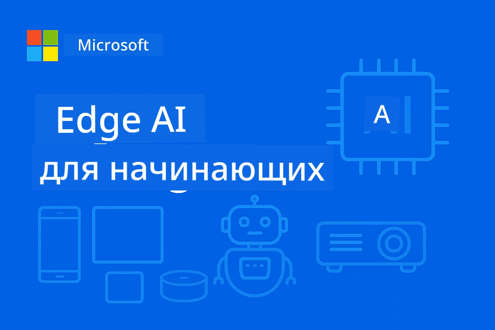

# EdgeAI для начинающих 




[](https://GitHub.com/microsoft/edgeai-for-beginners/graphs/contributors)
[](https://GitHub.com/microsoft/edgeai-for-beginners/issues)
[](https://GitHub.com/microsoft/edgeai-for-beginners/pulls)
[](http://makeapullrequest.com)

[](https://GitHub.com/microsoft/edgeai-for-beginners/watchers)
[](https://GitHub.com/microsoft/edgeai-for-beginners/fork)
[](https://GitHub.com/microsoft/edgeai-for-beginners/stargazers)


[](https://discord.gg/nTYy5BXMWG)

Следуйте этим шагам, чтобы начать использовать эти ресурсы:

1. **Форк репозитория**: нажмите [](https://GitHub.com/microsoft/edgeai-for-beginners/fork)
2. **Клонируйте репозиторий**:   `git clone https://github.com/microsoft/edgeai-for-beginners.git`
3. [**Присоединяйтесь к Azure AI Foundry Discord, чтобы встретиться с экспертами и коллегами-разработчиками**](https://discord.com/invite/ByRwuEEgH4)


### 🌐 Мультиязычная поддержка

#### Поддерживается через GitHub Action (автоматически и всегда актуально)

<!-- CO-OP TRANSLATOR LANGUAGES TABLE START -->
[Арабский](../ar/README.md) | [Бенгальский](../bn/README.md) | [Болгарский](../bg/README.md) | [Бирманский (Мьянма)](../my/README.md) | [Китайский (упрощенный)](../zh-CN/README.md) | [Китайский (традиционный, Гонконг)](../zh-HK/README.md) | [Китайский (традиционный, Макао)](../zh-MO/README.md) | [Китайский (традиционный, Тайвань)](../zh-TW/README.md) | [Хорватский](../hr/README.md) | [Чешский](../cs/README.md) | [Датский](../da/README.md) | [Нидерландский](../nl/README.md) | [Эстонский](../et/README.md) | [Финский](../fi/README.md) | [Французский](../fr/README.md) | [Немецкий](../de/README.md) | [Греческий](../el/README.md) | [Иврит](../he/README.md) | [Хинди](../hi/README.md) | [Венгерский](../hu/README.md) | [Индонезийский](../id/README.md) | [Итальянский](../it/README.md) | [Японский](../ja/README.md) | [Каннада](../kn/README.md) | [Кхмерский](../km/README.md) | [Корейский](../ko/README.md) | [Литовский](../lt/README.md) | [Малайский](../ms/README.md) | [Малаялам](../ml/README.md) | [Маратхи](../mr/README.md) | [Непали](../ne/README.md) | [Нигерийский пиджин](../pcm/README.md) | [Норвежский](../no/README.md) | [Персидский (фарси)](../fa/README.md) | [Польский](../pl/README.md) | [Португальский (Бразилия)](../pt-BR/README.md) | [Португальский (Португалия)](../pt-PT/README.md) | [Пенджаби (гурмухи)](../pa/README.md) | [Румынский](../ro/README.md) | [Русский](./README.md) | [Сербский (кириллица)](../sr/README.md) | [Словацкий](../sk/README.md) | [Словенский](../sl/README.md) | [Испанский](../es/README.md) | [Суахили](../sw/README.md) | [Шведский](../sv/README.md) | [Тагалог (филиппинский)](../tl/README.md) | [Тамильский](../ta/README.md) | [Телугу](../te/README.md) | [Тайский](../th/README.md) | [Турецкий](../tr/README.md) | [Украинский](../uk/README.md) | [Урду](../ur/README.md) | [Вьетнамский](../vi/README.md)

> **Предпочитаете клонировать локально?**
>
> В этом репозитории включено более 50 языковых переводов, что значительно увеличивает размер загрузки. Чтобы клонировать без переводов, используйте разреженную загрузку:
>
> **Bash / macOS / Linux:**
> ```bash
> git clone --filter=blob:none --sparse https://github.com/microsoft/edgeai-for-beginners.git
> cd edgeai-for-beginners
> git sparse-checkout set --no-cone '/*' '!translations' '!translated_images'
> ```
>
> **CMD (Windows):**
> ```cmd
> git clone --filter=blob:none --sparse https://github.com/microsoft/edgeai-for-beginners.git
> cd edgeai-for-beginners
> git sparse-checkout set --no-cone "/*" "!translations" "!translated_images"
> ```
>
> Это даст вам всё необходимое для прохождения курса с гораздо более быстрой загрузкой.
<!-- CO-OP TRANSLATOR LANGUAGES TABLE END -->

**Если вы хотите добавить дополнительные языки перевода, поддерживаемые языки указаны [здесь](https://github.com/Azure/co-op-translator/blob/main/getting_started/supported-languages.md)**
## Введение

Добро пожаловать в **EdgeAI для начинающих** – ваш всесторонний путь в трансформационный мир Edge искусственного интеллекта. Этот курс соединяет мощные возможности ИИ с практическим, реальным развертыванием на периферийных устройствах, позволяя вам использовать потенциал ИИ прямо там, где генерируются данные и принимаются решения.

### Чему вы научитесь

Этот курс проведет вас от базовых концепций до готовых к производству реализаций, охватывая:
- **Малые языковые модели (SLM)**, оптимизированные для edge-развертывания
- **Оптимизацию с учетом аппаратуры** на различных платформах
- **Реальное время вывода** с сохранением конфиденциальности
- **Стратегии развертывания в производстве** для корпоративных приложений

### Почему EdgeAI важен

Edge AI представляет собой парадигму, которая решает критические современные задачи:
- **Конфиденциальность и безопасность**: Обрабатывайте чувствительные данные локально без облачного воздействия
- **Производительность в реальном времени**: Устраните задержки сети для критичных к времени приложений
- **Экономия затрат**: Снизьте расходы на пропускную способность и облачные вычисления
- **Надежная работа**: Поддержание функциональности при сетевых сбоях
- **Соответствие требованиям регулирования**: Выполнение требований суверенитета данных

### Edge AI

Edge AI означает запуск AI-алгоритмов и языковых моделей локально на аппаратуре, близко к месту генерации данных без зависимости от облачных ресурсов для вывода. Это снижает задержки, повышает конфиденциальность и позволяет принимать решения в реальном времени.

### Основные принципы:
- **Вывод на устройстве**: AI-модели работают на edge-устройствах (телефоны, маршрутизаторы, микроконтроллеры, промышленные ПК)
- **Функционирование офлайн**: Работа без постоянного интернет-соединения
- **Низкая задержка**: Мгновенный отклик, подходящий для систем реального времени
- **Суверенитет данных**: Хранение чувствительных данных локально, улучшая безопасность и соблюдение требований

### Малые языковые модели (SLM)

SLM, такие как Phi-4, Mistral-7B и Gemma — это оптимизированные версии больших LLM, обученные или дистиллированные для:
- **Сниженного потребления памяти**: Эффективное использование ограниченной памяти edge-устройств
- **Меньших вычислительных требований**: Оптимизация для производительности CPU и edge GPU
- **Быстрого запуска**: Быстрая инициализация для отзывчивых приложений

Они открывают мощные возможности NLP, удовлетворяя ограничения:
- **Встраиваемые системы**: IoT-устройства и промышленные контроллеры
- **Мобильные устройства**: Смартфоны и планшеты с офлайн-возможностями
- **IoT-устройства**: Датчики и умные устройства с малыми ресурсами
- **Edge-серверы**: Локальные вычислительные узлы с ограниченными GPU-ресурсами
- **Персональные компьютеры**: Сценарии развертывания на десктопах и ноутбуках

## Модули курса и навигация

| Модуль | Тема | Область фокуса | Ключевое содержание | Уровень | Продолжительность |
|--------|-------|------------|-------------|--------|----------|
| [📖 00 ](./introduction.md) | [Введение в EdgeAI](./introduction.md) | Основы и контекст | Обзор EdgeAI • Промышленные применения • Введение в SLM • Цели обучения | Начинающий | 1-2 часа |
| [📚 01](../../Module01) | [Основы EdgeAI](./Module01/README.md) | Сравнение облакового и edge AI | Основы EdgeAI • Примеры из реальной жизни • Руководство по реализации • Edge-развертывание | Начинающий | 3-4 часа |
| [🧠 02](../../Module02) | [Основы модели SLM](./Module02/README.md) | Семейства моделей и архитектура | Семейство Phi • Семейство Qwen • Семейство Gemma • BitNET • μModel • Phi-Silica | Начинающий | 4-5 часов |
| [🚀 03](../../Module03) | [Практика развертывания SLM](./Module03/README.md) | Локальное и облачное развертывание | Продвинутое обучение • Локальная среда • Облачное развертывание | Средний | 4-5 часов |
| [⚙️ 04](../../Module04) | [Инструменты оптимизации моделей](./Module04/README.md) | Кроссплатформенная оптимизация | Введение • Llama.cpp • Microsoft Olive • OpenVINO • Apple MLX • Синтез рабочего процесса | Средний | 5-6 часов |
| [🔧 05](../../Module05) | [SLMOps в производстве](./Module05/README.md) | Операции в производстве | Введение в SLMOps • Дистилляция моделей • Тонкая настройка • Развертывание в производстве | Продвинутый | 5-6 часов |
| [🤖 06](../../Module06) | [AI-агенты и Function Calling](./Module06/README.md) | Фреймворки агентов и MCP | Введение в агентов • Вызов функций • Протокол контекста модели | Продвинутый | 4-5 часов |
| [💻 07](../../Module07) | [Реализация платформы](./Module07/README.md) | Кроссплатформенные образцы | Набор инструментов AI • Foundry Local • Разработка для Windows | Продвинутый | 3-4 часа |
| [🏭 08](../../Module08) | [Набор инструментов Foundry Local](./Module08/README.md) | Образцы, готовые к производству | Примерные приложения (подробности ниже) | Эксперт | 8-10 часов |

### 🏭 **Модуль 08: Примерные приложения**

- [01: Быстрый старт REST Chat](./Module08/samples/01/README.md)
- [02: Интеграция с OpenAI SDK](./Module08/samples/02/README.md)
- [03: Обнаружение моделей и бенчмаркинг](./Module08/samples/03/README.md)
- [04: Приложение Chainlit RAG](./Module08/samples/04/README.md)
- [05: Оркестрация мультиагентов](./Module08/samples/05/README.md)
- [06: Маршрутизатор Models-as-Tools](./Module08/samples/06/README.md)
- [07: Клиент прямого API](./Module08/samples/07/README.md)
- [08: Чат-приложение для Windows 11](./Module08/samples/08/README.md)
- [09: Продвинутая мультиагентская система](./Module08/samples/09/README.md)
- [10: Фреймворк инструментов Foundry](./Module08/samples/10/README.md)

### 🎓 **Воркшоп: Практический путь обучения**

Всесторонние материалы для практического воркшопа с реализациями, готовыми к производству:

- **[Руководство по воркшопу](./Workshop/Readme.md)** - Полные цели обучения, результаты и навигация по ресурсам
- **Примеры на Python** (6 сессий) - Обновлены с учетом лучших практик, обработки ошибок и полной документации
- **Jupyter notebooks** (8 интерактивных) - Пошаговые учебные пособия с бенчмарками и мониторингом производительности
- **Руководства к сессиям** - Детальные markdown руководства для каждой сессии воркшопа
- **Инструменты валидации** - Скрипты для проверки качества кода и запуска тестов

**Что вы создадите:**
- Локальные AI чат-приложения с поддержкой потоковой передачи
- RAG-конвейеры с оценкой качества (RAGAS)
- Инструменты бенчмаркинга и сравнения нескольких моделей
- Системы оркестрации мультиагентов
- Интеллектуальный маршрутизатор моделей с выбором задач

### 🎙️ **Воркшоп для Agentic: Практическое - AI подкаст-студия**
Создайте производственный конвейер подкастов с поддержкой ИИ с нуля! Этот увлекательный воркшоп научит вас создавать полную мультиагентную систему, которая превращает идеи в профессиональные эпизоды подкастов.

**[🎬 Начать воркшоп AI Podcast Studio](./WorkshopForAgentic/README.md)**

**Ваша миссия**: Запустить "Future Bytes" — технический подкаст, полностью управляемый AI агентами, которых вы создадите самостоятельно. Без облачных сервисов, без затрат на API — всё работает локально на вашем компьютере.

**Что делает это уникальным:**
- **🤖 Реальная мультиагентная оркестровка** – Создайте специализированных ИИ-агентов, которые исследуют, пишут и производят аудио
- **🎯 Полный производственный конвейер** – От выбора темы до финального подкастного аудио
- **💻 100% локальное развертывание** – Использует Ollama и локальные модели (Qwen-3-8B) для полной конфиденциальности и контроля
- **🎤 Интеграция преобразования текста в речь** – Преобразование сценариев в естественные многоголосые разговоры
- **✋ Управление с участием человека** – Ключевые точки утверждения обеспечивают качество при сохранении автоматизации

**Обучение по трем актам:**

| Акт | Фокус | Ключевые навыки | Продолжительность |
|-----|-------|-----------------|-------------------|
| **[Акт 1: Познакомьтесь со своими AI помощниками](./WorkshopForAgentic/md/01.BuildAIAgentWithSLM.md)** | Создайте первого AI агента | Интеграция инструментов • Веб-поиск • Решение задач • Агентное мышление | 2-3 часа |
| **[Акт 2: Соберите свою производственную команду](./WorkshopForAgentic/md/02.AIAgentOrchestrationAndWorkflows.md)** | Оркестровка нескольких агентов | Координация команды • Рабочие процессы утверждения • Интерфейс DevUI • Человеческий контроль | 3-4 часа |
| **[Акт 3: Оживите свой подкаст](./WorkshopForAgentic/md/03.Multi-SpeakerPodcastGenerationWithVibeVoice.md)** | Генерация подкастного аудио | Текст-в-речь • Мультиспикерный синтез • Длинные аудиозаписи • Полная автоматизация | 2-3 часа |

**Используемые технологии:**
- **Microsoft Agent Framework** – Оркестровка и координация мультиагентных систем
- **Ollama** – Локальная среда выполнения AI моделей (облако не требуется)
- **Qwen-3-8B** – Открытая языковая модель, оптимизированная для агентных задач
- **Текст-в-речь API** – Натуральный синтез голоса для создания подкастов

**Поддержка аппаратного обеспечения:**
- ✅ **Режим CPU** – Работает на любом современном компьютере (рекомендуется 8ГБ+ ОЗУ)
- 🚀 **GPU-ускорение** – Значительно более быстрая работа на видеокартах NVIDIA/AMD
- ⚡ **Поддержка NPU** – Ускорение с помощью процессоров нейронных сетей нового поколения

**Идеально подходит для:**
- Разработчиков, изучающих мультиагентные системы ИИ
- Всем, кто интересуется автоматизацией и рабочими процессами ИИ
- Создателей контента, исследующих ИИ-поддержку производства
- Студентов, изучающих практические паттерны оркестровки ИИ

**Начните создавать**: [🎙️ Воркшоп AI Podcast Studio →](./WorkshopForAgentic/README.md)

### 📊 **Резюме учебного пути**
- **Общая продолжительность**: 36-45 часов
- **Начальный уровень**: Модули 01-02 (7-9 часов)  
- **Средний уровень**: Модули 03-04 (9-11 часов)
- **Продвинутый уровень**: Модули 05-07 (12-15 часов)
- **Экспертный уровень**: Модуль 08 (8-10 часов)

## Что вы создадите

### 🎯 Основные компетенции
- **Архитектура Edge AI**: Проектирование локально ориентированных AI систем с интеграцией облака
- **Оптимизация моделей**: Квантование и сжатие моделей для развертывания на Edge (ускорение на 85%, уменьшение размера на 75%)
- **Мультиплатформенное развертывание**: Windows, мобильные устройства, встраиваемые системы и гибридные облачно-крайние решения
- **Производственная эксплуатация**: Мониторинг, масштабирование и поддержка Edge AI в продакшене

### 🏗️ Практические проекты
- **Foundry Local Chat Apps**: Нативное приложение для Windows 11 с переключением моделей
- **Мультиагентные системы**: Координатор со специализированными агентами для сложных рабочих процессов  
- **RAG приложения**: Локальная обработка документов с векторным поиском
- **Роутеры моделей**: Интеллектуальный выбор моделей на основе анализа задач
- **API-фреймворки**: Готовые к продакшену клиенты с поддержкой стриминга и мониторинга состояния
- **Кроссплатформенные инструменты**: Интеграция с LangChain/Semantic Kernel

### 🏢 Отраслевые применения
**Производство** • **Здравоохранение** • **Автономные транспортные средства** • **Умные города** • **Мобильные приложения**

## Быстрый старт

**Рекомендуемый учебный путь** (всего 20-30 часов):

0. **📖 Введение** ([Introduction.md](./introduction.md)): Основы EdgeAI + контекст отрасли + учебная структура
1. **📚 Фундамент** (Модули 01-02): Концепции EdgeAI + семейства моделей SLM
2. **⚙️ Оптимизация** (Модули 03-04): Развертывание + фреймворки для квантования  
3. **🚀 Продакшен** (Модули 05-06): SLMOps + AI агенты + вызовы функций
4. **💻 Реализация** (Модули 07-08): Примеры платформ + набор инструментов Foundry Local

Каждый модуль содержит теорию, практические упражнения и образцы кода для продакшена.

## Карьерное влияние

**Технические роли**: Архитектор решений EdgeAI • ML-инженер (Edge) • Разработчик IoT AI • Разработчик мобильного AI

**Отраслевые сектора**: Производство 4.0 • Технологии здравоохранения • Автономные системы • FinTech • Потребительская электроника

**Проекты в портфолио**: Мультиагентные системы • Продакшен RAG приложения • Кроссплатформенное развертывание • Оптимизация производительности

## Структура репозитория

```
edgeai-for-beginners/
├── 📖 introduction.md  # Foundation: EdgeAI Overview & Learning Framework
├── 📚 Module01-04/     # Fundamentals → SLMs → Deployment → Optimization  
├── 🔧 Module05-06/     # SLMOps → AI Agents → Function Calling
├── 💻 Module07/        # Platform Samples (VS Code, Windows, Jetson, Mobile)
├── 🏭 Module08/        # Foundry Local Toolkit + 10 Comprehensive Samples
│   ├── samples/01-06/  # Foundation: REST, SDK, RAG, Agents, Routing
│   └── samples/07-10/  # Advanced: API Client, Windows App, Enterprise Agents, Tools
├── 🌐 translations/    # Multi-language support (8+ languages)
└── 📋 STUDY_GUIDE.md   # Structured learning paths & time allocation
```

## Основные моменты курса

✅ **Пошаговое обучение**: Теория → Практика → Продакшен  
✅ **Реальные кейсы**: Microsoft, Japan Airlines, корпоративные внедрения  
✅ **Практические примеры**: 50+ образцов, 10 демонстраций Foundry Local  
✅ **Фокус на производительность**: Улучшение скорости на 85%, сокращение размера на 75%  
✅ **Мультиплатформенность**: Windows, мобильные, встроенные системы, облачно-крайние гибриды  
✅ **Готовность к продакшену**: Мониторинг, масштабирование, безопасность, соответствие требованиям

📖 **[Доступно руководство по обучению](STUDY_GUIDE.md)**: Структурированный 20-часовой учебный план с распределением времени и инструментами самооценки.

---

**EdgeAI – это будущее развертывания ИИ**: локально ориентированный, сохраняющий конфиденциальность и эффективный. Овладейте этими навыками, чтобы создавать следующее поколение интеллектуальных приложений.

## Другие курсы

Наша команда выпускает и другие курсы! Ознакомьтесь:

<!-- CO-OP TRANSLATOR OTHER COURSES START -->
### LangChain
[](https://aka.ms/langchain4j-for-beginners)
[](https://aka.ms/langchainjs-for-beginners?WT.mc_id=m365-94501-dwahlin)
[](https://github.com/microsoft/langchain-for-beginners?WT.mc_id=m365-94501-dwahlin)
---

### Azure / Edge / MCP / Агенты
[](https://github.com/microsoft/AZD-for-beginners?WT.mc_id=academic-105485-koreyst)
[](https://github.com/microsoft/edgeai-for-beginners?WT.mc_id=academic-105485-koreyst)
[](https://github.com/microsoft/mcp-for-beginners?WT.mc_id=academic-105485-koreyst)
[](https://github.com/microsoft/ai-agents-for-beginners?WT.mc_id=academic-105485-koreyst)

---
 
### Серия по генеративному ИИ
[](https://github.com/microsoft/generative-ai-for-beginners?WT.mc_id=academic-105485-koreyst)
[-9333EA?style=for-the-badge&labelColor=E5E7EB&color=9333EA)](https://github.com/microsoft/Generative-AI-for-beginners-dotnet?WT.mc_id=academic-105485-koreyst)
[-C084FC?style=for-the-badge&labelColor=E5E7EB&color=C084FC)](https://github.com/microsoft/generative-ai-for-beginners-java?WT.mc_id=academic-105485-koreyst)
[-E879F9?style=for-the-badge&labelColor=E5E7EB&color=E879F9)](https://github.com/microsoft/generative-ai-with-javascript?WT.mc_id=academic-105485-koreyst)

---
 
### Основное обучение
[](https://aka.ms/ml-beginners?WT.mc_id=academic-105485-koreyst)
[](https://aka.ms/datascience-beginners?WT.mc_id=academic-105485-koreyst)
[](https://aka.ms/ai-beginners?WT.mc_id=academic-105485-koreyst)
[](https://github.com/microsoft/Security-101?WT.mc_id=academic-96948-sayoung)
[](https://aka.ms/webdev-beginners?WT.mc_id=academic-105485-koreyst)
[](https://aka.ms/iot-beginners?WT.mc_id=academic-105485-koreyst)
[](https://github.com/microsoft/xr-development-for-beginners?WT.mc_id=academic-105485-koreyst)

---
 
### Серия Copilot

[](https://aka.ms/GitHubCopilotAI?WT.mc_id=academic-105485-koreyst)
[](https://github.com/microsoft/mastering-github-copilot-for-dotnet-csharp-developers?WT.mc_id=academic-105485-koreyst)
[](https://github.com/microsoft/CopilotAdventures?WT.mc_id=academic-105485-koreyst)
<!-- CO-OP TRANSLATOR OTHER COURSES END -->

## Получение помощи

Если вы застряли или у вас есть вопросы по созданию AI-приложений, присоединяйтесь:

[](https://discord.gg/nTYy5BXMWG)

Если у вас есть отзывы о продукте или ошибки при создании, посетите:

[](https://aka.ms/foundry/forum)

---

<!-- CO-OP TRANSLATOR DISCLAIMER START -->
**Отказ от ответственности**:  
Этот документ был переведён с помощью сервиса машинного перевода [Co-op Translator](https://github.com/Azure/co-op-translator). Несмотря на наши усилия обеспечить точность, имейте в виду, что автоматические переводы могут содержать ошибки или неточности. Оригинальный документ на исходном языке следует считать авторитетным источником. Для критически важной информации рекомендуется профессиональный перевод человеком. Мы не несем ответственности за любые недоразумения или неправильные толкования, возникшие в результате использования этого перевода.
<!-- CO-OP TRANSLATOR DISCLAIMER END -->