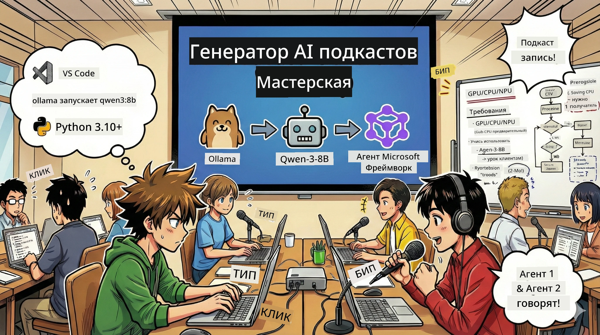
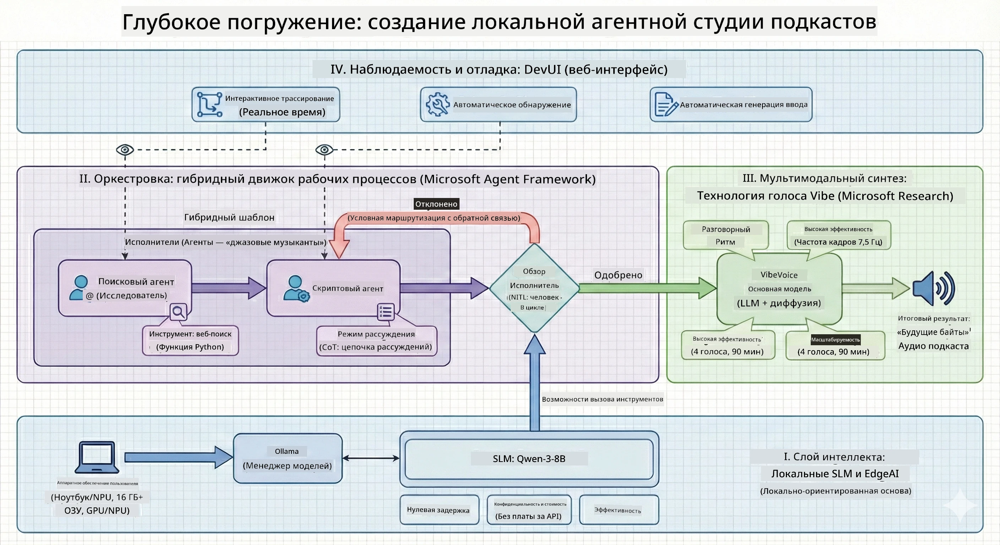

<!--
CO_OP_TRANSLATOR_METADATA:
{
  "original_hash": "f94e745264597bc5d8df967ead2eff97",
  "translation_date": "2026-01-05T10:21:09+00:00",
  "source_file": "WorkshopForAgentic/README.md",
  "language_code": "ru"
}
-->
# 🎙️ Мастерская AI Podcast Studio

> 🌏 [中文版 (Chinese Version)](translation/zh-cn/README.md)



## Ваша миссия

Добро пожаловать в **The AI Podcast Studio**! Вы собираетесь запустить свой собственный техно-подкаст под названием "Future Bytes" — но есть одна особенность: вы создадите команду продюсеров на базе ИИ, которая поможет вам его сделать. Больше никаких бесконечных часов исследований, написания сценариев и аудиомонтажа. Вместо этого вы запрограммируете себя в продюсеры подкастов с суперспособностями ИИ.

## История

Представьте: вы и ваши друзья хотите запустить подкаст о самых крутых технологических трендах, но все заняты учебой, работой или просто жизнью. А что если можно создать команду ИИ агентов, чтобы они делали всю тяжелую работу? Один агент исследует темы, другой пишет интересные сценарии, а третий превращает текст в естественные разговоры. Звучит как научная фантастика? Давайте сделаем это реальностью.

## Что вы узнаете

К концу этой мастерской вы научитесь:
- 🤖 Разворачивать собственную локальную модель ИИ (без затрат на API и зависимости от облака!)
- 🔧 Создавать специализированных ИИ агентов, которые действительно работают вместе
- 🎬 Создавать полный цикл производства подкаста от идеи до аудио

## Ваше путешествие: Три акта



Как и в любой хорошей истории, у нас три акта. Каждый шаг добавляет по частичке вашей AI podcast studio:

| Эпизод | Ваш квест | Что происходит | Получаемые навыки |
|---------|-----------|--------------|----------------|
| **Акт 1** | [Знакомство с вашими AI ассистентами](md/01.BuildAIAgentWithSLM.md) | Вы узнаете, как создавать ИИ агентов, которые умеют общаться, искать в интернете и решать проблемы. Представьте, что это ваши исследовательские стажеры, которые никогда не спят. | 🎯 Создайте своего первого агента<br>🛠️ Дайте ему суперспособности (инструменты!)<br>🧠 Научите его думать<br>🌐 Подключите к интернету |
| **Акт 2** | [Соберите свою производственную команду](md/02.AIAgentOrchestrationAndWorkflows.md) | Теперь начинается самое интересное! Вы организуете работу нескольких ИИ агентов, чтобы они работали вместе, как настоящая команда подкаста. Один собирает информацию, другой пишет, вы утверждаете — командная работа творит чудеса. | 🎭 Координация нескольких агентов<br>🔄 Построение процессов одобрения<br>🖥️ Тестирование с помощью DevUI интерфейса<br>✋ Контроль со стороны человека |
| **Акт 3** | [Оживите свой подкаст](md/03.Multi-SpeakerPodcastGenerationWithVibeVoice.md) | Финал! Преобразуйте свои текстовые сценарии в настоящий аудиоподкаст с реалистичными голосами и естественными диалогами. Ваш подкаст "Future Bytes" готов к выпуску! | 🎤 Магия преобразования текста в речь<br>👥 Голоса нескольких спикеров<br>⏱️ Длительное аудио<br>🚀 Полная автоматизация |

Каждый акт открывает новые возможности. Можете пропускать, если смелы, но мы рекомендуем следовать сюжету!

## Требования к окружению

Эта мастерская поддерживает разнообразные аппаратные среды:
- **CPU**: Подходит для тестирования и небольшого использования
- **GPU**: Рекомендуется для рабочих сред, существенно ускоряет инференс
- **NPU**: Поддерживает ускорение на процессорах нового поколения

## Что вам понадобится

### Контрольный список ПО ✅
- **Python 3.10+** (ваш язык программирования)
- **Ollama** (запуск моделей ИИ на вашем компьютере)
- **VS Code** (редактор кода)
- **Расширение Python** (делает VS Code умнее)
- **Git** (для загрузки кода)

### Аппаратные требования 💻
- **Могу ли я запустить это?**: 8 ГБ ОЗУ, 10 ГБ свободного места (будет работать, но может быть медленно)
- **Идеальный набор**: 16+ ГБ ОЗУ, приличная видеокарта (прекрасно!)
- **Есть NPU?**: Ещё лучше! Производительность следующего поколения разблокирована 🚀

## Настройка вашей студии 🎬

### Шаг 1: Установка Python

Убедитесь, что у вас установлен Python 3.10 или выше:

```bash
python --version
# Должна показывать Python 3.10.x или выше
```

Если Python нет — скачайте с [python.org](https://python.org) — бесплатно!

### Шаг 2: Скачайте Ollama (запуск вашей ИИ модели)

Зайдите на [ollama.ai](https://ollama.ai) и скачайте Ollama для вашей ОС. Это движок, который запускает ИИ модели локально.

Проверьте, готов ли он:

```bash
ollama --version
```

### Шаг 3: Скачайте мозг ИИ 🧠

Пора скачать модель Qwen-3-8B (как нанять вашего первого ИИ ассистента):

```bash
ollama pull qwen3:8b
```

*Это займет несколько минут. Лучшее время для кофе-паузы! ☕*

### Шаг 4: Установка VS Code

Скачайте [Visual Studio Code](https://code.visualstudio.com/), если он у вас не установлен. Это лучший редактор кода (спорить бессмысленно 😄).

### Шаг 5: Расширение Python

В VS Code:
1. Нажмите `Ctrl+Shift+X` (или `Cmd+Shift+X` на Mac)
2. Введите в поиск "Python"
3. Установите официальное расширение Microsoft для Python

### Шаг 6: Всё готово! 🎉

Серьезно, вы готовы творить магию ИИ!

### Шаг 7: Установка Microsoft Agent Framework и зависимостей 📦

Установите все нужные зависимости для мастерской:

```bash
pip install -r ./Installations/requirements.txt -U
```

*Это установит Microsoft Agent Framework и все необходимые пакеты. Берите кофе — первая установка может занять пару минут! ☕*

## Инструкции по мастерской

Подробная структура проекта, шаги настройки и запуск будут объясняться поэтапно в ходе мастерской.

## Устранение неполадок (если что-то пошло не так) 🔧

### «Уф, скачивание модели занимает вечность!»
**Решение**: Используйте VPN или настройте Ollama с зеркалом загрузки. Иногда интернет просто нас не любит.

### «Мой компьютер зависает! Заканчивается память!»
**Решение**: Переключитесь на более лёгкую модель или уменьшите параметр `num_ctx`, чтобы экономить память. Можно сказать, что вы сажаете ИИ на диету.

### «Можно ли ускорить с помощью моей GPU?»
**Решение**: Ollama автоматически распознает GPU! Просто обновите драйверы видеокарты. Бесплатное ускорение! 🏎️

## Дополнительные ресурсы (для любознательных) 📚

- [Документация Ollama](https://github.com/ollama/ollama) — глубокое погружение в локальные модели ИИ
- [Microsoft Agent Framework](https://microsoft.github.io/autogen/) — подробнее о создании команд агентов
- [Информация о модели Qwen](https://qwenlm.github.io/) — знакомьтесь с мозгом вашего ИИ ассистента

## Лицензия

MIT License — создавайте классные вещи, делитесь ими, делайте мир лучше! 🌍

## Хотите внести свой вклад?

Нашли баг? Есть идея? Оставьте Issue или PR! Мы любим сообщество и его энергию. ✨

---

<!-- CO-OP TRANSLATOR DISCLAIMER START -->
**Отказ от ответственности**:  
Этот документ был переведен с помощью сервиса автоматического перевода [Co-op Translator](https://github.com/Azure/co-op-translator). Несмотря на наши усилия по обеспечению точности, просим учитывать, что автоматический перевод может содержать ошибки и неточности. Оригинальный документ на его языке следует считать авторитетным источником. Для получения важной информации рекомендуется обращаться к профессиональному переводу, выполненному человеком. Мы не несем ответственности за любые недоразумения или неправильные толкования, возникшие в результате использования данного перевода.
<!-- CO-OP TRANSLATOR DISCLAIMER END -->