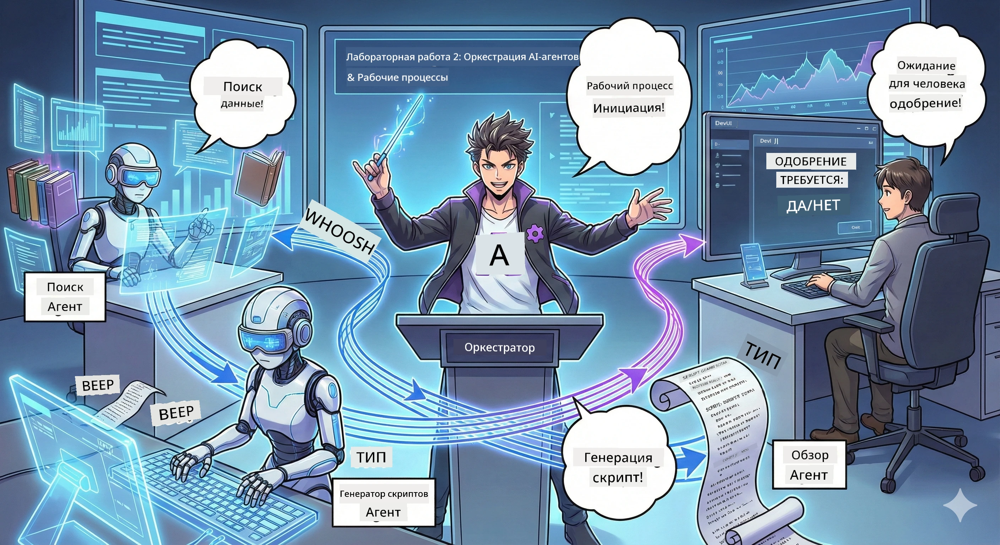

# Акт 2: Соберите свою команду по производству подкастов 🎬



## Сюжет утолщается

Алекс (ваш AI-ассистент из Акта 1) классный, но один агент не может управлять целой студией подкастов. Вам нужна *команда*:
- 🔍 **Агент исследования**: Искать свежую информацию в интернете
- ✍️ **Агент сценария**: Превращать исследования в увлекательный диалог
- 👤 **Вы (Редактор)**: Одобряете сценарии или отправляете их на доработку

Добро пожаловать в **Оркестрацию AI-агентов** — здесь вы становитесь режиссером своей AI-команды. Представьте Мстителей, только для производства подкастов.

## Что такое Оркестрация Агентов? (Простое объяснение)

Представьте, что вы управляете рестораном. Вы не делаете всё сами, правда? У вас есть:
- 🍳 Шеф-повар, который готовит
- 👨‍🍳 Су-шеф, который подготавливает
- 👩‍🍳 Официант, который подает

Оркестрация агентов — это та же идея, но с AI. Каждый агент специализируется на своем, а вы координируете их для достижения больших целей. Ни один агент не перегружен, а работа выполняется быстрее.

### Аналогия с группой 🎸

Ваши AI-агенты — как музыкальная группа:
- **Вокалист**: Главный агент, работающий с клиентами
- **Барабанщик**: Держит ритм, отвечает за фоновые процессы  
- **Басист**: Поддерживает всех, добывает данные
- **Вы (Менеджер группы)**: Координатор всего!

Без координации – просто шум. С оркестрацией – красивая музыка.

### Почему это важно

Один AI-агент, пытающийся делать всё, = выгорание. Специализированные агенты, работающие вместе = максимальная эффективность! 🚀

**Честно:** Помните, как сложно было самому исследовать, писать и редактировать подкаст? Да, это тяжело. С оркестацией каждый агент занимается тем, что умеет лучше. Вы просто принимаете окончательные решения.

**Пример из жизни:** Боты поддержки клиентов, которые знают, когда обрабатывать оплату, когда решать технические вопросы, а когда передавать человека. Вот это и есть оркестрация!

## Агент vs. Рабочий процесс: В чём разница?

Представьте так:

### 🤖 AI Агент = Джазовый музыкант
- **Принимает решения на ходу** исходя из услышанного
- **Импровизирует** решения, используя свои инструменты
- **Думает** с помощью модели LLM
- **Адаптируется** под любые задачи

### 🎵 Рабочий процесс = Оркестр, играющий классическую музыку  
- **Следует партитуре** (предопределённые шаги)
- **Предсказуемый** путь выполнения
- **Координирует** множество агентов, людей, систем
- **Структурирован**, как рецепт

**Фишка**: Рабочие процессы *оркестрируют* агентов! Вы создаёте рабочий процесс, который говорит агентам, когда играть свою роль. Лучшее из обоих миров. 🎭

## Три способа координации вашей AI-команды

### 1. 🎯 Централизованная (Вы — босс)

Один главный агент принимает все решения. Это как вы управляете командой — решаете, кто что делает и когда.

**Плюсы**:
- ✅ Четкое лидерство (никакой путаницы)
- ✅ Последовательные решения
- ✅ Легко отлаживать

**Используйте для**:
- Маршрутизации поддержки клиентов («Это оплата или техподдержка?»)
- Рабочих процессов для одобрения контента («Проходит ли этот сценарий?»)
- Производства подкастов (именно то, что мы строим!)

### 2. 🤝 Децентрализованная (Агенты самоорганизуются)

Агенты общаются напрямую и решают задачи вместе. Как групповой чат, где все координируются.

**Плюсы**:
- ✅ Легко масштабируется (добавляйте агентов когда угодно)
- ✅ Нет единой точки отказа
- ✅ Агенты естественно сотрудничают

**Используйте для**:
- Исследовательских команд (каждый агент изучает разные источники)
- Мозговых штурмов
- Распределенного решения задач

### 3. 🔀 Гибрид (Лучшее из обоих миров)

Вы задаете общее направление, но агенты свободны самоорганизовываться по задачам. Как CEO, который доверяет своей команде.

**Идеально для**: Сложных проектов, где нужна и контроль, и гибкость.

## Microsoft Agent Framework: Ваш набор инструментов для оркестрации 🧰

Время строить! Вот что вы будете использовать:

### Строительные блоки

#### 1. 🧱 Исполнители (Ваши рабочие)
- **Что это**: Отдельные блоки обработки — агенты или собственная логика
- **Что делают**: Принимают данные, выполняют задачи, выдают результат
- **Представляйте их как**: Станции на конвейере

#### 2. ➡️ Ребра (Соединения)
- **Что это**: Пути между исполнителями
- **Что делают**: Контролируют поток сообщений («После А — к Б»)
- **Представляйте их как**: Стрелки на блок-схеме

#### 3. 🗺️ Рабочие процессы (Главный план)
- **Что это**: Полный граф исполнителей + соединений
- **Что делают**: Определяют весь процесс от начала до конца
- **Представляйте их как**: Чертеж вашей производственной линии

### Крутые функции, которые вам понравятся

**🛡️ Типизация**: Сообщения между агентами проверяются на типы. Никаких сюрпризов с «неверным типом данных».

**🔀 Гибкая маршрутизация**: 
- Условия «если-то» («Если одобрено, публикуй; иначе, переписывай»)
- Параллельная обработка (несколько агентов работают одновременно)
- Динамические пути (рабочий процесс подстраивается под результаты)

**🔌 Внешняя интеграция**:
- Подключение к API
- Человеческие точки контроля (вы одобряете перед публикацией)
- Построение запрос-ответ потоков

**💾 Контрольные точки**: Сохраняйте прогресс! Если что-то падает — продолжайте с последнего сохранения.

**🤝 Координация нескольких агентов**:
- Запуск агентов последовательно (А → Б → В)
- Запуск параллельно (А + Б + В одновременно)
- Передача задач между агентами
- Совместная работа

## Лучшие практики (Профи советы) 🎯

### 1. Делайте модульно
Каждый агент должен делать ОДНУ вещь отлично. Не создавайте «суперагента», который делает всё — потом будете жалеть при отладке.

### 2. Планируйте ошибки
Агенты ошибаются. Сети падают. Делайте обработку ошибок и запасные варианты. Ваше «будущее я» скажет спасибо.

### 3. Мониторьте всё
Следите за действиями агентов. Используйте DevUI (мы его рассмотрим!), чтобы видеть рабочие процессы в действии.

### 4. Оптимизируйте размер сообщений
Не передавайте огромные файлы между агентами. Делайте сообщения компактными для скорости.

### 5. Выбирайте правильный паттерн
Нужен контроль? Централизованный режим. Нужен масштаб? Децентрализованный. Не можете выбрать? Гибрид!

## DevUI: Ваш отладчик рабочих процессов 🔍

### Что такое DevUI?

DevUI — это как игровая площадка для тестирования ваших агентов и рабочих процессов. Веб-интерфейс, где вы можете:
- 👀 Смотреть рабочий процесс в действии
- 💬 Общаться с агентами напрямую
- 🔍 Отлаживать ошибки
- 📊 Видеть трассировки и метрики производительности

> **Важно**: DevUI — только для разработки! Не использовать в продакшене. Это как локальная тестовая среда.

### Что в нём крутого

- **🖥️ Интерактивный веб-интерфейс**: Щёлкайте, печатайте, тестируйте — командная строка не нужна
- **📁 Drag-and-Drop**: Загружайте файлы, тестируйте с разными вводами
- **📂 Автоматическое обнаружение**: Укажите папку — и найдёт всех ваших агентов автоматически
- **📋 Работа без настройки**: Регистрируйте агентов через код, структура папок не нужна
- **🔌 Совместим с OpenAI**: Работает с OpenAI SDK (да здравствует совместимость!)
- **👁️ Встроенная трассировка**: Видите точно, что делают агенты

### Как работает ввод

DevUI умно обрабатывает ввод:

- **Тестируете агентов?** Получаете текстовые поля и кнопки загрузки файлов
- **Тестируете рабочие процессы?** UI сам генерирует поля ввода в зависимости от ожиданий процесса

Как магия, но это просто хороший код. ✨

## Ваши задачи: Постройте студию подкастов 🎬

### Задача 1: Создайте одного агента с DevUI

📂 [01.AgentDevUI](../../../../WorkshopForAgentic/code/02.Workflow/01.AgentDevUI)

**Задача**: Прежде чем собирать команду, протестируем DevUI с одним агентом: специалистом по веб-поиску.

**Что вы сделаете**:
Агент исследования, который ищет темы подкастов в интернете. Тестировать будете через веб-интерфейс DevUI на `http://localhost:8090`.

**Навыки, которые освоите**:
- 🚀 Запуск агентов в DevUI
- 🔍 Тестирование ответов агента в реальном времени
- 🛠️ Создание кастомных инструментов (веб-поиск)
- 📊 Включение трассировки для отладки
- 🖥️ Использование интерактивного веб-интерфейса

**Код**:
- `agent.py`: Ваш SearchAgent с суперспособностями веб-поиска
- Использует OllamaChatClient для подключения к Qwen
- Реализует функцию инструмента `web_search()`
- Запускается с помощью `serve()` — автоматически открывает DevUI

**Условие победы**: Спросите у агента «Что сейчас в тренде в AI?» и смотрите, как он ищет в интернете! 🎉

### Задача 2: Постройте мультиагентный рабочий процесс

📂 [02.WorkflowDevUI](../../../../WorkshopForAgentic/code/02.Workflow/02.WorkflowDevUI)

**Задача**: Теперь начинается настоящая магия! Постройте полный рабочий процесс производства подкаста с:
1. 🔍 **Агент поиска** → Исследует вашу тему
2. ✍️ **Агент сценария** → Пишет диалог между двумя ведущими (на китайском!)
3. 👤 **Исполнитель проверки** → Просит ВАС одобрить или отклонить
4. 🔄 **Цикл назад** → Если отклонено, переписывает по вашим комментариям

**Навыки, которые освоите**:
- 🧱 Создание специализированных агентов для разных задач
- 🔗 Связывание агентов с помощью WorkflowBuilder
- 🔀 Реализация циклов одобрения (человек в петле!)
- 🚦 Условная маршрутизация (одобрено vs. отклонено)
- 🔧 Построение кастомных исполнителей для бизнес-логики

**Рабочий процесс**:  
```
SearchAgent → ScriptAgent → ReviewExecutor
                             ↑          ↓ (if rejected)
                             ←─────────
```
  
**Код**:
- `search_agent/agent.py`: Ваш специалист по исследованиям
- `generate_script_agent/agent.py`: Ваш сценарист (писатель на китайском!)
- `workflow/workflow.py`: Здесь происходит магия оркестрации
- `main.py`: Запускает всё в DevUI

**Условие победы**: Дайте тему, проверьте сценарий, один раз отклоните, чтобы проверить цикл, затем одобрите! 🎉

### Задача 3: Постройте консольное приложение

📂 [03.Application](../../../../WorkshopForAgentic/code/02.Workflow/03.Application)

**Задача**: Возьмите свой рабочий процесс из DevUI и сделайте стильное терминальное приложение с цветным выводом, спиннерами загрузки и сохранением файлов. Это готовое к продакшену решение!

**Навыки, которые освоите**:
- ⚡ Запуск рабочих процессов программно (без DevUI)
- 📡 Событийно-ориентированная архитектура с потоками
- 🎨 Создание красивых терминальных UI (цвета, спиннеры, прогресс-бары)
- 💾 Сохранение финальных сценариев в файлы
- 🔄 Обработка асинхронных рабочих процессов с asyncio Python

**Что оно делает**:
1. Спрашивает тему подкаста
2. Показывает прогресс в реальном времени («Агент поиска работает...»)
3. Показывает сгенерированный сценарий с цветами
4. Запрашивает ваше одобрение
5. Сохраняет одобренный сценарий в `podcast.txt`

**Код**:
- `podcast_app.py`: Ваше главное приложение с обработкой событий
- `workflow.py`: Повторно использует рабочий процесс из Задачи 2
- Обрабатывает события: `AgentRunUpdateEvent`, `RequestInfoEvent`, `WorkflowOutputEvent`
- Использует ANSI-цвета для стилизации терминала

**Условие победы**: Запустите приложение, создайте сценарий подкаста и увидьте, как он сохраняется! Вы построили реальный инструмент. 🚀

## Чему вы научились 🏆

После Акта 2 вы умеете:

- ✅ Координировать нескольких AI-агентов, как профи
- ✅ Создавать рабочие процессы с последовательной И условной логикой
- ✅ Добавлять контрольные точки одобрения человеком
- ✅ Использовать DevUI для тестирования и отладки
- ✅ Создавать готовые к продакшену консольные приложения
- ✅ Грамотно обрабатывать ошибки в сложных системах
- ✅ Выбирать правильный паттерн оркестрации для любого проекта

## Если что-то ломается 🔧

### «Мой рабочий процесс слишком сложный!»
**Решение**: Разбейте его на меньшие подпроцессы. Каждый рабочий процесс должен делать ОДНУ вещь хорошо. Соединяйте их по цепочке при необходимости.

### «Я не могу отследить, что происходит!»
**Решение**: Используйте контрольные точки рабочего процесса для сохранения состояния. Включите трассировку в DevUI, чтобы видеть каждый шаг.

### «Ошибка одного агента ломает всё!»
**Решение**: Добавьте границы обработки ошибок. Каждый агент должен уметь справляться с собственными сбоями и иметь запасной сценарий.

### «Это так долго работает»
**Решение**: Можно ли запускать агентов параллельно? Последовательные рабочие процессы просты, но медленны. Ищите возможности для параллелизации!

## Полезные ресурсы 🔗

- [Workflow Docs](https://learn.microsoft.com/en-us/agent-framework/user-guide/workflows/overview) — Официальное руководство Microsoft
- [Orchestration Patterns](https://www.ibm.com/think/topics/ai-agent-orchestration) — Мнение IBM по теме
- [Agent Framework GitHub](https://github.com/microsoft/agent-framework) — Исходный код проекта на GitHub
- [Примеры кода](https://github.com/microsoft/agent-framework/tree/main/python/samples) — Берите шаблоны отсюда

---

**Готовы к финалу?** Ваш скрипт готов. Теперь давайте превратим его в настоящую аудиозапись! → [Акт 3: Оживите свой подкаст](03.Multi-SpeakerPodcastGenerationWithVibeVoice.md) 🎤

---

**Застряли? Запутались? Взволнованы?** Делитесь в чате воркшопа! Мы учимся вместе. 🚀

---

<!-- CO-OP TRANSLATOR DISCLAIMER START -->
**Отказ от ответственности**:  
Этот документ был переведён с помощью сервиса автоматического перевода [Co-op Translator](https://github.com/Azure/co-op-translator). Несмотря на наши усилия по обеспечению точности, просим учитывать, что автоматический перевод может содержать ошибки или неточности. Оригинальный документ на исходном языке считается авторитетным источником. Для получения критически важной информации рекомендуется обратиться к профессиональному переводу, выполненному человеком. Мы не несем ответственности за какие-либо недоразумения или неправильные толкования, возникшие в результате использования данного перевода.
<!-- CO-OP TRANSLATOR DISCLAIMER END -->