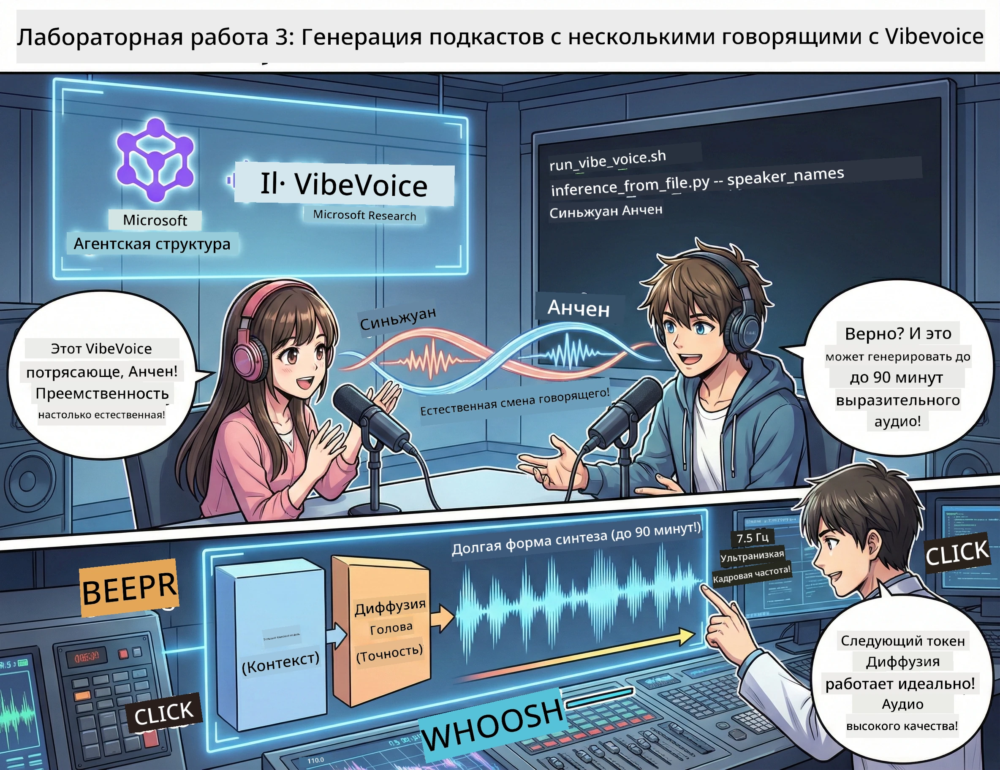

<!--
CO_OP_TRANSLATOR_METADATA:
{
  "original_hash": "bb2a3cf5ebd0ec8211af960a004fc23d",
  "translation_date": "2026-01-05T12:01:31+00:00",
  "source_file": "WorkshopForAgentic/md/03.Multi-SpeakerPodcastGenerationWithVibeVoice.md",
  "language_code": "ru"
}
-->
# Акт 3: Оживи свой подкаст 🎤



## Грандиозный финал

Вы исследовали темы. Вы написали сценарии. А теперь вишенка на торте: превращаем ваш текст в настоящий подкаст с реалистичными голосами!

Встречайте **VibeVoice** — открытая TTS (текст-в-речь) магия от Microsoft Research, создающая:
- 🎭 Натурально звучащие разговоры
- 👥 Несколько говорящих (до 4!)
- ⏱️ Длительный аудиоформат (до 90 минут!)
- 🎵 Выразительную подачу (не роботы!)

Это технология, лежащая в основе синтетических подкастов. Сделаем ваш!

## Что такое VibeVoice? (Крутые фишки)

VibeVoice — это подарок Microsoft Research миру. Специально создан для аудио в стиле подкастов с диалогами.

### Почему это классно 🔥

* **⏱️ Марафонские сессии**: Генерирует до 90 минут непрерывной речи (целый эпизод подкаста!)
* **👥 Мультиголоса**: До 4 разных голосов с постоянным характером
* **⚡ Суперэффективность**: Использует ультранизкую частоту кадров 7.5 Гц для экономии ресурсов
* **🧠 Умное аудио**: Совмещает LLM (понимает контекст) с диффузионной моделью (создаёт реалистичное аудио)
* **🎭 Естественный поток**: Автоматически управляет очередностью, паузами и ритмом диалога

**Перевод**: VibeVoice не просто читает ваш сценарий — он *исполняет* его, как настоящие люди.

---

## Перед началом 🚀

**Что нужно**:

* 🐍 **Python 3.10+** (у вас уже есть из Актов 1 и 2)
* 🚀 **uv** (быстрый менеджер пакетов для Python — мы установим)
* 📝 **Ваш сценарий**: файл `podcast.txt` из Акта 2 (в `../03.Application/`)

**Полезный совет**: Для загрузки предобученной модели нужен хороший интернет. Берите кофе! ☕

---

## Поехали! Простой способ 🎬

Мы сделали всё очень просто. Один скрипт shell выполняет всё.

### Процесс

1. **Сделайте его исполняемым**:
```bash
chmod +x run_vibe_voice.sh
```

2. **Запустите**:
```bash
./run_vibe_voice.sh
```

3. **Ждите волшебства** (первый запуск может занять несколько минут)

### Что происходит за кулисами 🎭

Скрипт — ваш автоматический звукоинженер:

1. **📥 Скачивает VibeVoice**: Клонирует официальный репозиторий с GitHub
2. **📦 Устанавливает зависимости**: Использует `uv pip` для молниеносной установки пакетов
3. **🎬 Генерирует аудио**: Запускает скрипт инференса с:
   * `--model_path`: предобученная модель VibeVoice-7B
   * `--txt_path`: ваш сценарий `podcast.txt`
   * `--speaker_names`: назначает голоса (по умолчанию Xinran и Anchen)

**Результат**: Ваш сценарий превращается в настоящий эпизод подкаста! 🎉

---

## Ваша миссия 🎯

Давайте сделаем это интереснее:

### Задача 1: Создать контент
Отредактируйте `../03.Application/podcast.txt` с разговором между двумя людьми. Пусть это будет о технологиях, хобби, что угодно! Главное — чтобы получился диалог.

**Пример формата**:
```
Speaker 1: Hey! Did you hear about the new AI model?
Speaker 2: No way! Tell me more!
Speaker 1: It's called...
```

### Задача 2: Сгенерировать аудио
Запустите скрипт и смотрите, как происходит волшебство. Первый раз займёт больше времени (скачивание модели).

### Задача 3: Прослушать и проанализировать
- Звучит ли естественно?
- Есть ли у говорящих разные голоса?
- Гладко ли проходит смена говорящих?
- Бывают ли роботоподобные моменты?

### Задача 4: Эксперимент (для смельчаков)
Отредактируйте `run_vibe_voice.sh` и поменяйте `--speaker_names`, чтобы попробовать разные голосовые комбинации. В VibeVoice есть несколько предобученных голосов!

**Бонусный челлендж**: Попробуйте разговор с 3 говорящими! 🎆

---

## Узнать больше 📚

* **🏠 Главная страница проекта**: [Официальный сайт VibeVoice](https://microsoft.github.io/VibeVoice/)
* **🤗 Предобученная модель**: [Hugging Face - VibeVoice-7B](https://huggingface.co/vibevoice/VibeVoice-7B)
* **📖 Научная статья**: Погрузитесь в детали технологии (если вам это интересно)

> **⚠️ Напоминание об ответственном использовании ИИ**: VibeVoice — мощный инструмент. Используйте его этично! Не создавайте дипфейки или вводящий в заблуждение контент. Создавайте крутые вещи, которые помогают людям. 🙏

---

## 🏆 Поздравляем! Вы справились!

Вы прошли полный цикл:
1. ✅ **Акт 1**: Создали AI-агентов с кастомными инструментами
2. ✅ **Акт 2**: Организовали мультиагентский рабочий процесс
3. ✅ **Акт 3**: Сгенерировали настоящий аудиоподкаст

**Теперь у вас есть**:
- Рабочий AI-ассистент для исследований
- Полный процесс производства подкастов
- Настоящий аудиофайл, которым можно поделиться

### Что дальше? 🚀

**Запускайте подкаст!**
- Загружайте на подкаст-платформы
- Делитесь в соцсетях
- Улучшайте и развивайте

**Продолжайте создавать!**
- Пробуйте разные темы
- Экспериментируйте с количеством говорящих
- Добавляйте фоновую музыку
- Создавайте веб-интерфейс
- Автоматизируйте всё

**Делитесь своим творчеством!**
Отмечайте нас! Покажите миру, что вы сделали. Революция AI-подкастов начинается с вас. 🎙️

---

**Есть вопросы? Идеи? Истории успеха?** Пишите в чат воркшопа!

**Добро пожаловать в будущее создания контента.** 🌟

---

<!-- CO-OP TRANSLATOR DISCLAIMER START -->
**Отказ от ответственности**:  
Этот документ был переведён с помощью сервиса автоматического перевода [Co-op Translator](https://github.com/Azure/co-op-translator). Хотя мы стремимся к точности, имейте в виду, что автоматический перевод может содержать ошибки или неточности. Оригинальный документ на его исходном языке следует считать авторитетным источником. Для критически важной информации рекомендуется воспользоваться профессиональным переводом, выполненным человеком. Мы не несем ответственности за любые недоразумения или неправильные толкования, возникшие вследствие использования данного перевода.
<!-- CO-OP TRANSLATOR DISCLAIMER END -->